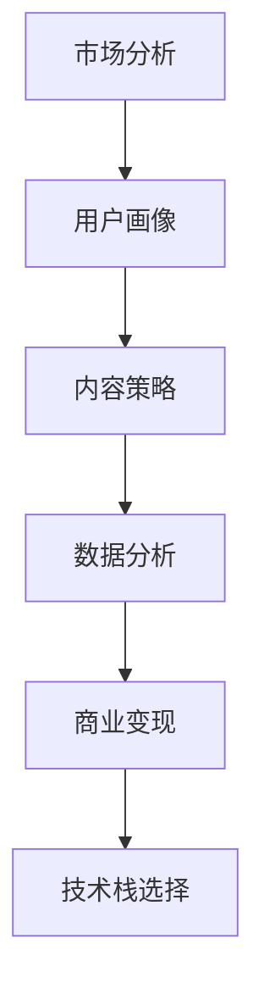

                 

# 知识付费创业的跨平台运营策略

> 关键词：知识付费, 跨平台运营, 市场分析, 用户画像, 内容策略, 数据分析, 商业变现, 技术栈选择

## 1. 背景介绍

在互联网时代，知识付费成为越来越多用户的选择。随着人们对知识需求的增长，从阅读、听书到在线课程，各种形式的知识付费服务逐渐兴起。对于创业者来说，如何在这个领域取得成功，是一个颇具挑战性的课题。而跨平台运营策略，则是实现这一目标的关键。

### 1.1 问题由来

知识付费市场已经初步成熟，市场份额的争夺日益激烈。无论是新入场的创业者，还是已经有一定规模的平台，都需要在运营上有所突破。跨平台运营，可以极大地拓宽内容覆盖范围，获取更多用户，同时也能够提高内容利用效率，降低成本。

跨平台运营策略的核心，在于找到一个平衡点：既能够保持平台特色，又能够在多个平台之间无缝切换，为用户提供一致且高效的服务。

### 1.2 问题核心关键点

跨平台运营策略的核心，包括以下几个方面：

1. **市场分析与定位**：分析市场竞争状况，定位自身的特色和优势。
2. **用户画像构建**：了解不同平台用户的特征，设计针对性的内容和服务。
3. **内容策略设计**：制定内容生产、分发的策略，确保内容的连续性和吸引力。
4. **数据分析与优化**：通过数据分析驱动决策，不断优化运营策略。
5. **商业变现路径**：探索有效的变现方式，实现收益最大化。
6. **技术栈选择与优化**：选择合适的技术工具和平台，优化运营效率。

这些核心点之间相互联系，共同构成了跨平台运营策略的基础框架。

## 2. 核心概念与联系

### 2.1 核心概念概述

要理解跨平台运营策略，需要先了解几个核心概念：

- **跨平台运营（Cross-Platform Operation）**：指在多个平台上（如Web、iOS、Android、PC等）同时进行内容运营和服务提供，以实现用户覆盖面的最大化。
- **市场分析（Market Analysis）**：通过分析市场规模、用户需求、竞争态势等，找出业务机会和潜在风险。
- **用户画像（User Persona）**：根据不同平台用户的行为数据和反馈，构建用户特征模型，以便设计针对性策略。
- **内容策略（Content Strategy）**：包括内容生成、组织、分发等环节，旨在提升内容的吸引力、可用性和互动性。
- **数据分析（Data Analytics）**：通过数据分析工具和方法，对运营数据进行挖掘和应用，以优化决策。
- **商业变现（Revenue Model）**：从运营活动中获取收益，包括广告、付费订阅、增值服务等。
- **技术栈选择（Technology Stack）**：根据业务需求和平台特性，选择合适的技术工具和框架，以提高运营效率。

这些概念之间的联系紧密，形成一个完整的跨平台运营体系。

### 2.2 核心概念原理和架构的 Mermaid 流程图(Mermaid 流程节点中不要有括号、逗号等特殊字符)



这个流程图展示了跨平台运营的核心流程：市场分析指导用户画像，用户画像支撑内容策略，内容策略推动数据分析，数据分析促进商业变现，而商业变现的收益则支持技术栈选择和优化。

## 3. 核心算法原理 & 具体操作步骤

### 3.1 算法原理概述

跨平台运营策略基于以下算法原理：

1. **A/B测试（A/B Testing）**：通过在多个平台上进行测试，找出最优的运营方案。
2. **个性化推荐（Personalized Recommendation）**：根据用户画像和行为数据，推送个性化的内容和服务。
3. **流量优化（Traffic Optimization）**：通过优化内容布局和推送策略，提高平台流量和用户停留时间。
4. **广告投放（Ad Placement）**：在平台上精准投放广告，以提升品牌曝光和转化率。
5. **用户流失分析（Churn Analysis）**：分析用户流失原因，优化用户体验和留存率。

这些算法原理在跨平台运营中扮演着重要的角色，确保运营策略的科学性和有效性。

### 3.2 算法步骤详解

以下是跨平台运营的详细操作步骤：

**Step 1: 市场分析**

1. **市场规模评估**：评估目标市场的规模和潜力，找出增长点。
2. **竞争态势分析**：分析主要竞争对手的优劣势，找出突破口。
3. **用户需求识别**：通过问卷调查、访谈等方式，了解用户需求和痛点。
4. **机会与风险识别**：识别潜在机会和风险，制定应对策略。

**Step 2: 用户画像构建**

1. **用户数据收集**：收集用户在各个平台上的行为数据，如浏览记录、购买记录等。
2. **用户特征分析**：通过数据分析工具，如Google Analytics、Mixpanel等，找出用户的行为模式和偏好。
3. **用户画像设计**：根据分析结果，设计用户画像，并将其应用于内容和服务设计。

**Step 3: 内容策略设计**

1. **内容生产规划**：制定内容生产计划，确保内容更新频率和质量。
2. **内容分发策略**：选择合适的分发渠道和时间，以最大化内容曝光率和点击率。
3. **互动设计**：增加内容的互动性，如评论、分享、问答等，提升用户粘性。

**Step 4: 数据分析与优化**

1. **数据收集与处理**：收集关键运营数据，如流量、转化率、用户留存率等。
2. **数据分析与建模**：使用机器学习模型，如线性回归、聚类分析等，找出数据中的规律和趋势。
3. **决策支持**：根据分析结果，调整运营策略，优化资源配置。

**Step 5: 商业变现路径**

1. **付费模式设计**：设计订阅、单次付费、会员制度等不同的付费模式。
2. **广告投放策略**：选择适合平台特点的广告形式和投放策略，确保效果最大化。
3. **增值服务开发**：根据用户需求，开发附加服务，如个性化推荐、VIP会员服务等。

**Step 6: 技术栈选择与优化**

1. **平台选择与集成**：根据业务需求，选择适合的Web、iOS、Android平台，并进行集成。
2. **技术工具选择**：选择合适的开发框架、数据库、云服务，如React、Angular、MySQL、AWS等。
3. **性能优化**：优化系统性能，提高响应速度和用户体验。

### 3.3 算法优缺点

跨平台运营策略的优点：

1. **覆盖面广**：可以在多个平台上提供服务，覆盖更多的用户。
2. **数据利用率高**：通过分析各个平台的数据，实现更全面的用户画像和内容策略。
3. **优化灵活**：可以在不同的平台上灵活调整运营策略，提高效率。

跨平台运营策略的缺点：

1. **技术复杂度大**：需要在多个平台上进行开发和维护，技术要求高。
2. **资源投入大**：跨平台运营需要投入更多的资源，包括人力、物力和财力。
3. **用户体验一致性挑战**：在不同的平台上保持一致的用户体验，难度较大。

### 3.4 算法应用领域

跨平台运营策略在知识付费创业中具有广泛的应用：

1. **课程发布平台**：在iOS、Android、Web等多个平台同时发布课程，扩大受众。
2. **阅读和听书平台**：在多个平台上提供电子书和有声书，满足不同用户的阅读和听书需求。
3. **社区和论坛**：在各个平台上创建社区和论坛，增加用户互动和粘性。
4. **广告和营销平台**：在不同平台上精准投放广告，增加品牌曝光和转化率。
5. **增值服务和会员制度**：提供个性化推荐、VIP会员服务，增加用户粘性和收益。

## 4. 数学模型和公式 & 详细讲解 & 举例说明

### 4.1 数学模型构建

跨平台运营策略的数学模型可以包括以下几个部分：

1. **用户行为模型**：描述用户在平台上的行为模式，如浏览、点击、购买等。
2. **内容推荐模型**：根据用户行为和内容特征，推荐最符合用户需求的内容。
3. **流量预测模型**：预测不同平台上的流量变化，优化资源配置。
4. **转化率优化模型**：通过优化广告和推荐策略，提高用户转化率。

### 4.2 公式推导过程

以下以内容推荐模型为例，推导公式。

假设用户画像为 $\mathbf{u}=(u_1, u_2, ..., u_n)$，其中 $u_i$ 表示用户对第 $i$ 个特征的评分。内容特征为 $\mathbf{c}=(c_1, c_2, ..., c_m)$，其中 $c_i$ 表示内容对第 $i$ 个特征的评分。设内容与用户的相关性为 $S(\mathbf{u}, \mathbf{c})$，推荐算法为 $F$。则推荐内容的评分函数为：

$$
R(\mathbf{u}, \mathbf{c}, S, F) = F(S(\mathbf{u}, \mathbf{c}))
$$

其中 $F$ 为推荐算法，如协同过滤、矩阵分解等。

### 4.3 案例分析与讲解

以Coursera为例，Coursera是一个在线教育平台，提供多种课程和证书，内容覆盖广泛。

1. **市场分析**：Coursera通过调研发现，学生更倾向于选择质量高、内容丰富、价格合理的课程。
2. **用户画像**：根据数据分析，Coursera发现学生的年龄、职业、学习偏好等信息，并构建了详细的用户画像。
3. **内容策略**：Coursera制定了内容生产计划，并引入了个性化的推荐算法，根据用户画像推荐最适合的内容。
4. **数据分析**：Coursera通过分析用户行为数据，发现学习行为与用户满意度的关系，调整优化内容推荐策略。
5. **商业变现**：Coursera通过付费订阅和广告投放，实现盈利。
6. **技术栈选择**：Coursera使用了React和Angular构建Web端，iOS和Android平台则使用原生开发。

Coursera的跨平台运营策略，成功地吸引了大量用户，并提高了平台的用户满意度和留存率。

## 5. 项目实践：代码实例和详细解释说明

### 5.1 开发环境搭建

在进行跨平台运营实践前，我们需要准备好开发环境。以下是使用React Native进行跨平台开发的环境配置流程：

1. 安装Node.js和npm。
2. 安装React Native CLI。
3. 安装Android Studio和Xcode。
4. 安装微信开发者工具（可选）。

完成上述步骤后，即可在React Native环境中开始跨平台开发。

### 5.2 源代码详细实现

这里我们以开发一个跨平台的知识付费阅读平台为例，给出React Native的代码实现。

首先，安装并配置React Native CLI和相关依赖：

```bash
npm install -g react-native-cli
npm install --save react-native react-native-reanimated react-native-screens react-native-safe-area-context @react-native-community/masked-view react-native-webview react-native-url-loader react-native-background-task react-native-vector-icons
```

接着，创建React Native项目：

```bash
react-native init KnowledgePaidApp
```

然后，在App.js中添加跨平台代码：

```javascript
import React, { useState, useEffect } from 'react';
import { StyleSheet, Text, View, Image, WebView, Dimensions } from 'react-native';

const App = () => {
  const [isLogin, setIsLogin] = useState(false);
  const [currentArticle, setCurrentArticle] = useState(null);

  const handleLogin = () => {
    // 登录逻辑
  };

  const handleArticleLoad = (article) => {
    setCurrentArticle(article);
  };

  useEffect(() => {
    // 获取最新文章数据
  }, []);

  return (
    <View style={styles.container}>
      {isLogin ? (
        <Text style={styles.welcome}>欢迎使用知识付费平台</Text>
      ) : (
        <Text style={styles.welcome}>请先登录</Text>
      )}
      {currentArticle && (
        <>
          <Text style={styles.title}>{currentArticle.title}</Text>
          <Image source={{ uri: currentArticle.imageUrl }} style={styles.image} />
          <Text style={styles.description}>{currentArticle.description}</Text>
          <WebView
            source={{ uri: currentArticle.url }}
            style={styles.webView}
            onLoadStart={handleArticleLoad}
          />
        </>
      )}
    </View>
  );
};

const styles = StyleSheet.create({
  container: {
    flex: 1,
    backgroundColor: '#fff',
    alignItems: 'center',
    justifyContent: 'center',
  },
  welcome: {
    fontSize: 20,
    textAlign: 'center',
    margin: 10,
  },
  title: {
    fontSize: 24,
    fontWeight: 'bold',
    marginTop: 20,
  },
  image: {
    width: Dimensions.get('window').width - 50,
    height: Dimensions.get('window').width - 50,
    marginTop: 10,
  },
  description: {
    fontSize: 16,
    marginTop: 10,
  },
  webView: {
    marginTop: 20,
  },
});

export default App;
```

以上是React Native开发一个跨平台的知识付费阅读平台的代码实现。可以看到，通过React Native，开发者可以轻松地在iOS和Android平台上实现一致的用户体验。

### 5.3 代码解读与分析

让我们再详细解读一下关键代码的实现细节：

**useState和useEffect**：
- useState用于管理组件状态，如isLogin表示用户是否已登录，currentArticle表示当前正在阅读的文章。
- useEffect用于在组件渲染后执行副作用操作，如获取最新文章数据。

**handleLogin和handleArticleLoad**：
- handleLogin用于处理用户登录逻辑。
- handleArticleLoad用于处理文章加载逻辑，更新currentArticle状态。

**onLoadStart事件**：
- 在WebView中使用onLoadStart事件，当用户开始阅读文章时，触发handleArticleLoad函数，加载当前文章的详细数据。

**styles样式**：
- 定义了组件的样式，包括欢迎信息、文章标题、图片、描述和WebView。

**实际应用场景**：
- 当用户登录后，可以直接查看推荐的文章列表，点击某篇文章即跳转到详细页面进行阅读。
- 在详细页面中，用户可以阅读文章的标题、图片和描述，并使用WebView加载文章的详细页面。

### 5.4 运行结果展示

运行代码后，即可在iOS和Android设备上看到知识付费阅读平台的界面。用户可以看到文章的标题、图片和描述，点击文章即跳转到详细页面进行阅读。

## 6. 实际应用场景

### 6.1 智能广告平台

在知识付费领域，智能广告平台通过跨平台运营，可以在多个平台上投放广告，最大化品牌曝光和点击率。

以知乎为例，知乎通过广告平台在不同平台上投放内容广告，如在微信朋友圈、头条新闻等平台投放知乎的问答广告。通过跨平台运营，知乎广告触及面更广，用户点击率更高，从而实现更有效的品牌推广和流量转化。

### 6.2 在线教育平台

在线教育平台如Coursera、Udacity等，通过跨平台运营，可以在多个平台上提供课程，吸引更多用户。

例如，Coursera通过在iOS、Android、Web等多个平台上同时发布课程，覆盖了全球的用户。不同平台的用户可以通过App、网站、PC等终端，随时随地进行学习，极大地提高了课程的覆盖范围和用户粘性。

### 6.3 社区和论坛

社区和论坛通过跨平台运营，可以在多个平台上建立用户互动的桥梁，增加用户粘性和活跃度。

以知乎为例，知乎通过在不同平台上建立社区，如知乎App、知乎网站、知乎小程序等，让用户可以随时随地进行讨论和互动。这种跨平台运营，不仅提高了用户粘性，还增加了社区的活跃度。

### 6.4 未来应用展望

未来，跨平台运营将在知识付费领域迎来更多应用，推动技术不断突破：

1. **人工智能驱动**：通过引入人工智能技术，如自然语言处理、图像识别等，实现更精准的内容推荐和个性化服务。
2. **大数据分析**：利用大数据技术，进行用户行为分析和流量预测，优化运营策略。
3. **区块链应用**：通过区块链技术，确保内容版权和用户隐私，提高平台信任度。
4. **虚拟现实（VR）/增强现实（AR）**：结合VR/AR技术，提供沉浸式的学习体验。
5. **边缘计算**：通过边缘计算技术，降低延迟，提高响应速度。

这些应用场景和技术手段，将进一步提升知识付费平台的运营效率和用户体验，推动行业健康发展。

## 7. 工具和资源推荐

### 7.1 学习资源推荐

为了帮助开发者掌握跨平台运营的理论与实践，这里推荐一些优质的学习资源：

1. **《React Native从入门到实战》**：详细介绍React Native开发跨平台应用的步骤和技巧，适合初学者入门。
2. **《跨平台移动应用开发实战》**：通过实际案例，讲解跨平台开发的应用和最佳实践。
3. **《Flutter官方文档》**：Flutter是目前最流行的跨平台开发框架之一，提供了全面的开发指南和示例代码。
4. **《跨平台应用设计模式》**：深入分析跨平台应用的设计模式，提供可复用的设计方案。
5. **《Web前端开发实战》**：涵盖HTML、CSS、JavaScript等前端技术，适合Web端跨平台开发。

通过这些资源的学习，相信你能够掌握跨平台运营的核心技能，并应用于知识付费领域的开发和运营。

### 7.2 开发工具推荐

高效的开发离不开优秀的工具支持。以下是几款用于跨平台开发的常用工具：

1. **React Native**：由Facebook开发的跨平台移动应用开发框架，支持iOS和Android。
2. **Flutter**：Google开发的跨平台移动应用开发框架，支持iOS、Android和Web。
3. **Ionic**：基于Web技术的跨平台移动应用开发框架，支持iOS和Android。
4. **Xamarin**：微软开发的跨平台开发框架，支持iOS、Android和Windows。
5. **Apache Cordova**：开源的跨平台移动应用开发框架，支持iOS、Android和Windows。

合理利用这些工具，可以显著提升跨平台开发的速度和效率，缩短项目周期。

### 7.3 相关论文推荐

跨平台运营技术的发展源于学界的持续研究。以下是几篇奠基性的相关论文，推荐阅读：

1. **《Cross-Platform User Experience Design》**：探讨跨平台用户界面设计的方法和最佳实践。
2. **《Cross-Platform Application Development with Flutter》**：介绍Flutter跨平台开发的技术和优势。
3. **《Designing Cross-Platform Mobile Apps》**：讲解跨平台移动应用设计的思路和策略。
4. **《Mobile Application Cross-Platform Development》**：深入分析跨平台开发的现状和未来趋势。

这些论文代表了大规模跨平台运营技术的发展脉络。通过学习这些前沿成果，可以帮助研究者把握学科前进方向，激发更多的创新灵感。

## 8. 总结：未来发展趋势与挑战

### 8.1 总结

本文对知识付费创业的跨平台运营策略进行了全面系统的介绍。首先阐述了跨平台运营策略的重要性，明确了市场分析、用户画像、内容策略等关键环节。其次，从原理到实践，详细讲解了跨平台运营的算法原理和操作步骤，给出了具体的代码实例。同时，本文还广泛探讨了跨平台运营策略在智能广告、在线教育、社区论坛等多个领域的应用前景，展示了其广阔的应用范围。此外，本文精选了跨平台运营技术的各类学习资源，力求为读者提供全方位的技术指引。

通过本文的系统梳理，可以看到，跨平台运营策略是知识付费领域的重要支撑，能够大幅提高运营效率和用户体验。未来，伴随技术手段的不断演进，跨平台运营策略将进一步优化，推动知识付费领域的发展。

### 8.2 未来发展趋势

展望未来，跨平台运营策略将呈现以下几个发展趋势：

1. **技术融合加深**：未来，跨平台运营将更多地融合人工智能、大数据、区块链等技术，提升运营效率和用户体验。
2. **平台多样化**：除了传统的Web、iOS、Android平台外，跨平台运营将拓展到更多场景，如智能家居、车载、可穿戴设备等。
3. **用户画像细化**：通过更加精细化的用户画像，实现更精准的内容推荐和个性化服务。
4. **商业变现多元化**：除了付费订阅和广告变现，跨平台运营将探索更多元化的商业变现模式，如会员制、众筹等。
5. **服务化拓展**：跨平台运营将更多地基于云服务构建，提高服务的可扩展性和灵活性。

这些趋势将推动跨平台运营策略的不断发展，带来更加高效、智能、个性化的知识付费服务。

### 8.3 面临的挑战

尽管跨平台运营策略已经取得了一定的成果，但在其发展的过程中，仍面临诸多挑战：

1. **技术复杂度大**：跨平台开发需要同时支持多个平台，技术要求高，开发难度大。
2. **用户体验一致性**：在不同平台上保持一致的用户体验，仍是一个难点。
3. **商业变现难度**：如何在多个平台上实现高效的商业变现，仍需更多创新。
4. **跨平台安全问题**：跨平台应用面临更多的安全问题，如何保障用户数据和隐私，是一个挑战。
5. **跨平台性能优化**：不同平台的用户体验和性能差异较大，如何优化跨平台应用的性能，仍需更多努力。

### 8.4 研究展望

面对这些挑战，未来的研究需要在以下几个方面寻求新的突破：

1. **技术栈优化**：选择适合的技术栈和工具，降低开发复杂度，提升开发效率。
2. **用户体验优化**：通过用户界面和交互设计，提升不同平台上的用户体验一致性。
3. **商业变现创新**：探索更多元化的商业变现模式，提高收益。
4. **安全机制完善**：加强跨平台应用的安全性，保障用户数据和隐私。
5. **性能优化策略**：针对不同平台的特点，优化跨平台应用的性能。

这些研究方向将推动跨平台运营策略的不断优化，确保其长期健康发展。

## 9. 附录：常见问题与解答

**Q1：跨平台运营策略是否适用于所有知识付费平台？**

A: 跨平台运营策略适用于大多数知识付费平台，特别是那些希望覆盖更多用户和渠道的平台。但对于一些特定领域或小众市场，由于用户行为和平台特性差异较大，可能需要根据具体情况进行定制化设计。

**Q2：跨平台运营策略的商业变现方式有哪些？**

A: 跨平台运营策略的商业变现方式包括：
1. 付费订阅：用户通过订阅服务获得专属内容或服务。
2. 广告投放：平台通过广告收入变现。
3. 会员制：提供会员特权，如专属内容、优惠等。
4. 增值服务：提供如课程问答、专属资料等增值服务。
5. 众筹：通过众筹获得项目资金支持。
6. 知识付费服务：如电子书、有声书等产品销售。

**Q3：如何进行跨平台数据收集和分析？**

A: 跨平台数据收集和分析可以通过以下步骤：
1. 收集不同平台的数据，如点击率、转化率、用户行为等。
2. 使用数据整合工具，如Flume、Kafka等，将数据统一存储和处理。
3. 使用大数据分析工具，如Hadoop、Spark等，进行数据挖掘和分析。
4. 根据分析结果，调整和优化跨平台运营策略。

**Q4：跨平台运营策略的开发难点是什么？**

A: 跨平台运营策略的开发难点主要包括：
1. 技术复杂度：跨平台开发需要同时支持多个平台，技术要求高。
2. 用户体验一致性：在不同平台上保持一致的用户体验，难度较大。
3. 商业变现难度：如何在多个平台上实现高效的商业变现，仍需更多创新。
4. 跨平台安全问题：跨平台应用面临更多的安全问题，如何保障用户数据和隐私，是一个挑战。
5. 性能优化：不同平台的用户体验和性能差异较大，如何优化跨平台应用的性能，仍需更多努力。

这些难点需要开发者在技术、设计、商业等多个层面进行综合考虑，才能取得良好的效果。

**Q5：跨平台运营策略的未来发展方向是什么？**

A: 跨平台运营策略的未来发展方向包括：
1. 技术融合加深：未来，跨平台运营将更多地融合人工智能、大数据、区块链等技术，提升运营效率和用户体验。
2. 平台多样化：除了传统的Web、iOS、Android平台外，跨平台运营将拓展到更多场景，如智能家居、车载、可穿戴设备等。
3. 用户画像细化：通过更加精细化的用户画像，实现更精准的内容推荐和个性化服务。
4. 商业变现多元化：除了付费订阅和广告变现，跨平台运营将探索更多元化的商业变现模式，如会员制、众筹等。
5. 服务化拓展：跨平台运营将更多地基于云服务构建，提高服务的可扩展性和灵活性。

这些方向将推动跨平台运营策略的不断发展，带来更加高效、智能、个性化的知识付费服务。

---

作者：禅与计算机程序设计艺术 / Zen and the Art of Computer Programming

