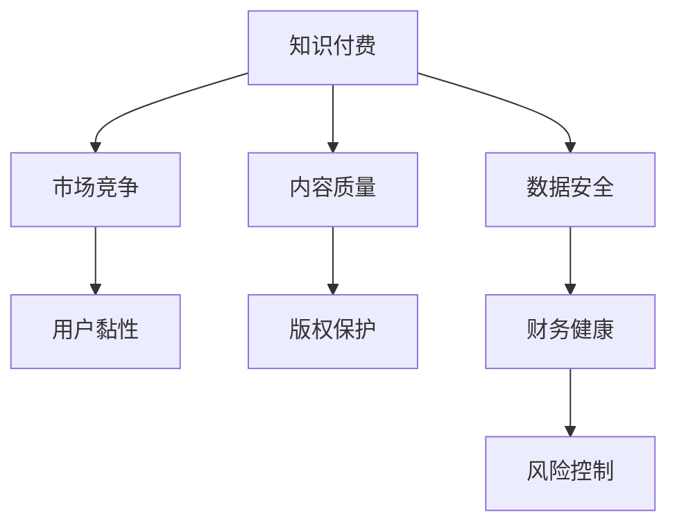

                 

# 知识付费创业的风险控制策略

> 关键词：知识付费、风险控制、创业、财务、数据安全、知识产权、内容审核、用户行为、市场竞争

## 1. 背景介绍

### 1.1 问题由来

随着互联网的发展和人们对知识获取方式的需求变化，知识付费模式逐渐兴起。众多创业公司纷纷涉足这一领域，希望通过提供有价值的知识内容和有效的付费机制，解决信息不对称问题，推动知识的付费化和个性化定制。然而，知识付费创业模式也面临着诸多风险，如市场饱和、用户流失、内容侵权、知识产权保护、数据安全和市场竞争等，这些问题如果处理不当，将严重影响企业的生存和发展。因此，制定一套系统的风险控制策略，是知识付费创业公司成功的重要保障。

### 1.2 问题核心关键点

知识付费创业公司面临的风险主要包括以下几个方面：
- 市场竞争激烈，如何快速获取市场份额，同时避免侵权和恶意竞争。
- 用户流失率高，如何增强用户黏性，提高付费转化率。
- 内容质量和版权保护问题，如何确保内容的高质量和原创性，避免侵权风险。
- 数据安全和隐私保护，如何保护用户数据，避免数据泄露和滥用。
- 财务可持续性问题，如何平衡收入和支出，实现健康盈利。

这些关键问题关系到企业的生存和发展，需要系统地进行分析与应对。

### 1.3 问题研究意义

制定系统的风险控制策略对于知识付费创业公司来说具有重要的意义：
- 有助于快速识别和应对潜在风险，提升企业的风险抵御能力。
- 有助于优化资源配置，降低运营成本，提高企业的市场竞争力。
- 有助于提升用户满意度，增强用户黏性，提高付费转化率。
- 有助于保护知识产权和用户隐私，提升企业的合法性和信誉度。
- 有助于实现财务健康和持续盈利，确保企业的长期可持续发展。

## 2. 核心概念与联系

### 2.1 核心概念概述

为更好地理解知识付费创业的风险控制策略，本节将介绍几个关键概念及其联系：

- **知识付费**：通过付费方式获取特定知识内容的服务模式，用户为获取有价值的信息而支付费用。
- **风险控制**：通过制定策略和方法，识别并减少风险发生的概率，保护企业利益。
- **市场竞争**：在知识付费领域，企业之间的竞争不仅包括价格战，更包括内容质量和用户体验的竞争。
- **用户黏性**：用户对企业的忠诚度和持续使用意愿，直接影响企业的盈利能力和市场份额。
- **内容质量**：内容的原创性、准确性、及时性和实用性，是知识付费创业的核心竞争力。
- **版权保护**：确保内容的原创性和知识产权的保护，避免侵权和盗版。
- **数据安全**：保护用户数据，防止数据泄露和滥用，增强用户信任。
- **财务健康**：企业收入和支出的平衡管理，确保企业的可持续发展。

这些概念之间的联系可以通过以下Mermaid流程图来展示：



这个流程图展示了知识付费创业过程中，各个环节之间的相互联系：

1. 知识付费提供高质量、原创性强的内容，吸引用户付费。
2. 优质的内容和良好的用户体验提升用户黏性，降低流失率。
3. 版权保护确保内容的质量和原创性，避免侵权风险。
4. 数据安全保护用户隐私，增强用户信任。
5. 财务健康管理企业的收入和支出，确保可持续发展。
6. 综合以上各环节，风险控制策略保障企业的整体利益。

## 3. 核心算法原理 & 具体操作步骤

### 3.1 算法原理概述

知识付费创业的风险控制策略，本质上是一个多目标优化问题。其核心思想是通过多个子目标的协调，实现企业的整体利益最大化。具体来说，可以分解为以下几个关键目标：

1. **市场竞争**：通过差异化内容和优质服务，增强市场竞争力。
2. **用户黏性**：通过个性化推荐和持续内容更新，提升用户满意度。
3. **内容质量**：通过内容审核和质量监控，确保内容的高质量。
4. **版权保护**：通过严格的版权审核和法律保障，避免侵权风险。
5. **数据安全**：通过数据加密和访问控制，保护用户隐私。
6. **财务健康**：通过成本控制和收入多元化，确保企业盈利。

针对以上目标，制定相应的风险控制策略，通过算法手段进行优化和调整，以实现整体最优。

### 3.2 算法步骤详解

制定知识付费创业的风险控制策略，一般包括以下几个关键步骤：

**Step 1: 风险识别与评估**

- 收集市场和用户数据，分析竞争态势、用户反馈和市场需求。
- 进行内容质量和版权审核，识别潜在风险点。
- 评估数据安全风险，确保数据处理的合法性和合规性。
- 分析财务状况，识别潜在的财务风险。

**Step 2: 制定风险控制策略**

- 根据风险识别结果，制定相应的风险控制措施。
- 设计内容审核和质量监控流程，确保内容的高质量和原创性。
- 制定数据安全和隐私保护策略，防范数据泄露和滥用。
- 实施严格的版权审核和侵权处理机制，避免侵权风险。
- 制定财务健康管理策略，确保企业的可持续盈利。

**Step 3: 实施与监控**

- 将制定的策略转化为具体的操作流程和工具，实现系统化管理。
- 建立实时监控机制，及时发现和处理风险事件。
- 定期评估风险控制效果，调整和优化策略。

**Step 4: 持续改进**

- 根据市场和用户反馈，持续改进风险控制策略。
- 采用先进的算法和数据技术，提高风险控制效率和效果。

### 3.3 算法优缺点

制定知识付费创业的风险控制策略具有以下优点：
1. 系统化管理，能够全面识别和应对各类风险，提高企业的风险抵御能力。
2. 优化资源配置，提高运营效率，降低运营成本。
3. 提升用户满意度和忠诚度，提高付费转化率。
4. 保护知识产权和用户隐私，提升企业的合法性和信誉度。
5. 确保企业的财务健康和可持续发展。

同时，该方法也存在一定的局限性：
1. 需要投入大量人力和资源进行风险识别和评估。
2. 风险控制策略需要不断调整和优化，对企业的灵活性要求较高。
3. 需要持续投入技术资源，更新和维护系统工具。

尽管存在这些局限性，但就目前而言，系统化的风险控制策略仍然是知识付费创业公司成功的重要保障。未来相关研究的重点在于如何进一步提升风险控制效率，降低运营成本，同时兼顾系统可扩展性和灵活性等因素。

### 3.4 算法应用领域

基于风险控制策略的算法，已经在知识付费领域得到了广泛的应用，例如：

- 内容审核系统：通过自动化的内容质量检测，确保内容的原创性和高质量。
- 数据加密和安全访问控制：保护用户数据，防止数据泄露和滥用。
- 用户行为分析系统：通过分析用户行为，提升用户满意度和忠诚度，降低流失率。
- 财务管理系统：通过成本控制和收入多元化，确保企业的财务健康和可持续发展。

除了上述这些关键领域外，风险控制策略还被创新性地应用到更多场景中，如市场竞争分析、用户行为预测、内容版权保护等，为知识付费创业提供了全面的风险管理解决方案。

## 4. 数学模型和公式 & 详细讲解 & 举例说明

### 4.1 数学模型构建

假设知识付费创业公司有 $N$ 个用户，每个用户有 $M$ 个付费项目，每个项目有 $K$ 个内容，用 $C_{i,j}$ 表示第 $i$ 个用户第 $j$ 个项目的第 $k$ 个内容，$K_{i,j}$ 表示第 $i$ 个用户第 $j$ 个项目的付费用户数量，$R_{i,j}$ 表示第 $i$ 个用户第 $j$ 个项目的总收入，$T_{i,j}$ 表示第 $i$ 个用户第 $j$ 个项目的运营成本，$C_{i,j}^c$ 表示第 $i$ 个用户第 $j$ 个项目的第 $k$ 个内容的侵权风险，$C_{i,j}^d$ 表示第 $i$ 个用户第 $j$ 个项目的第 $k$ 个内容的非原创性风险，$C_{i,j}^u$ 表示第 $i$ 个用户第 $j$ 个项目的第 $k$ 个内容的用户满意度风险，$C_{i,j}^f$ 表示第 $i$ 个用户第 $j$ 个项目的财务健康风险。

构建综合风险控制模型，目标是最大化用户满意度（$U_i$）和财务健康（$F_j$），同时最小化风险成本（$R$）：

$$
\max_{U_i,F_j} \sum_{i=1}^{N} \alpha_i U_i + \sum_{j=1}^{M} \beta_j F_j
$$

$$
\min_{R} \sum_{i=1}^{N} \gamma_i R_i + \sum_{j=1}^{M} \delta_j R_j + \sum_{k=1}^{K} \epsilon_k R_k
$$

其中 $\alpha_i$ 和 $\beta_j$ 为权重系数，用于平衡用户满意度和财务健康的权重。

### 4.2 公式推导过程

以用户满意度 $U_i$ 为例，考虑用户对项目 $j$ 的内容 $k$ 的满意度，可以表示为：

$$
U_i = \sum_{j=1}^{M} \sum_{k=1}^{K} \omega_{k,j} \cdot C_{i,j}^u
$$

其中 $\omega_{k,j}$ 为内容 $k$ 对用户 $i$ 满意度的贡献权重，可以通过用户行为数据训练得到。

类似地，财务健康 $F_j$ 可以通过项目 $j$ 的总收入和运营成本计算得到：

$$
F_j = \frac{R_j}{T_j}
$$

风险成本 $R$ 可以通过内容侵权风险 $C_{i,j}^c$、非原创性风险 $C_{i,j}^d$、用户满意度风险 $C_{i,j}^u$ 和财务健康风险 $C_{i,j}^f$ 的加权和计算得到：

$$
R = \sum_{i=1}^{N} \sum_{j=1}^{M} \sum_{k=1}^{K} \lambda_{k,j} \cdot C_{i,j}^r
$$

其中 $\lambda_{k,j}$ 为内容 $k$ 在项目 $j$ 上的风险权重，可以通过风险评估模型训练得到。

### 4.3 案例分析与讲解

考虑一家知识付费平台，有 $N=10000$ 个用户，每个用户有 $M=10$ 个付费项目，每个项目有 $K=1000$ 个内容。设 $C_{i,j}^c$ 为第 $i$ 个用户第 $j$ 个项目的第 $k$ 个内容侵权风险，$C_{i,j}^d$ 为第 $i$ 个用户第 $j$ 个项目的第 $k$ 个内容非原创性风险，$C_{i,j}^u$ 为第 $i$ 个用户第 $j$ 个项目的第 $k$ 个内容用户满意度风险，$C_{i,j}^f$ 为第 $i$ 个用户第 $j$ 个项目的财务健康风险。构建综合风险控制模型，目标是最大化用户满意度 $U_i$ 和财务健康 $F_j$，同时最小化风险成本 $R$。

假设 $\alpha_i = 0.7$ 和 $\beta_j = 0.5$，分别表示用户满意度和财务健康的权重。构建优化目标函数：

$$
\max_{U_i,F_j} \sum_{i=1}^{10000} 0.7 U_i + \sum_{j=1}^{10} 0.5 F_j
$$

$$
\min_{R} \sum_{i=1}^{10000} \sum_{j=1}^{10} \sum_{k=1}^{1000} \lambda_{k,j} \cdot C_{i,j}^r
$$

其中 $\lambda_{k,j}$ 为内容 $k$ 在项目 $j$ 上的风险权重，可以通过风险评估模型训练得到。

## 5. 项目实践：代码实例和详细解释说明

### 5.1 开发环境搭建

在进行知识付费创业的风险控制策略开发前，我们需要准备好开发环境。以下是使用Python进行PyTorch开发的环境配置流程：

1. 安装Anaconda：从官网下载并安装Anaconda，用于创建独立的Python环境。

2. 创建并激活虚拟环境：
```bash
conda create -n pytorch-env python=3.8 
conda activate pytorch-env
```

3. 安装PyTorch：根据CUDA版本，从官网获取对应的安装命令。例如：
```bash
conda install pytorch torchvision torchaudio cudatoolkit=11.1 -c pytorch -c conda-forge
```

4. 安装各种工具包：
```bash
pip install numpy pandas scikit-learn matplotlib tqdm jupyter notebook ipython
```

完成上述步骤后，即可在`pytorch-env`环境中开始风险控制策略的开发。

### 5.2 源代码详细实现

这里我们以内容审核系统为例，给出使用Transformers库对内容进行审核的PyTorch代码实现。

首先，定义内容审核函数：

```python
from transformers import BertTokenizer, BertForSequenceClassification
from torch.utils.data import Dataset, DataLoader
import torch

class ContentDataset(Dataset):
    def __init__(self, texts, labels, tokenizer, max_len=128):
        self.texts = texts
        self.labels = labels
        self.tokenizer = tokenizer
        self.max_len = max_len
        
    def __len__(self):
        return len(self.texts)
    
    def __getitem__(self, item):
        text = self.texts[item]
        label = self.labels[item]
        
        encoding = self.tokenizer(text, return_tensors='pt', max_length=self.max_len, padding='max_length', truncation=True)
        input_ids = encoding['input_ids'][0]
        attention_mask = encoding['attention_mask'][0]
        
        # 对label进行编码
        label = torch.tensor(label, dtype=torch.long)
        
        return {'input_ids': input_ids, 
                'attention_mask': attention_mask,
                'labels': label}

# 加载Bert预训练模型和分词器
tokenizer = BertTokenizer.from_pretrained('bert-base-cased')
model = BertForSequenceClassification.from_pretrained('bert-base-cased', num_labels=2)

# 训练数据集
train_dataset = ContentDataset(train_texts, train_labels, tokenizer, max_len=128)
dev_dataset = ContentDataset(dev_texts, dev_labels, tokenizer, max_len=128)
test_dataset = ContentDataset(test_texts, test_labels, tokenizer, max_len=128)

# 定义优化器、损失函数
optimizer = AdamW(model.parameters(), lr=2e-5)
criterion = CrossEntropyLoss()

# 训练模型
device = torch.device('cuda') if torch.cuda.is_available() else torch.device('cpu')
model.to(device)

for epoch in range(5):
    model.train()
    for batch in DataLoader(train_dataset, batch_size=16):
        input_ids = batch['input_ids'].to(device)
        attention_mask = batch['attention_mask'].to(device)
        labels = batch['labels'].to(device)
        
        outputs = model(input_ids, attention_mask=attention_mask)
        loss = criterion(outputs.logits, labels)
        loss.backward()
        optimizer.step()
    
    model.eval()
    with torch.no_grad():
        for batch in DataLoader(dev_dataset, batch_size=16):
            input_ids = batch['input_ids'].to(device)
            attention_mask = batch['attention_mask'].to(device)
            labels = batch['labels'].to(device)
            
            outputs = model(input_ids, attention_mask=attention_mask)
            loss = criterion(outputs.logits, labels)
            print(f'Epoch {epoch+1}, loss: {loss.item()}')
    
print(f'Epoch {epoch+1}, accuracy: {accuracy:.2f}')
```

以上代码实现了一个简单的内容审核系统，通过对文本数据进行分词和编码，利用BERT模型进行二分类任务训练，最终实现对内容的审核和筛选。

### 5.3 代码解读与分析

让我们再详细解读一下关键代码的实现细节：

**ContentDataset类**：
- `__init__`方法：初始化文本、标签、分词器等关键组件。
- `__len__`方法：返回数据集的样本数量。
- `__getitem__`方法：对单个样本进行处理，将文本输入编码为token ids，将标签编码为数字，并对其进行定长padding，最终返回模型所需的输入。

**BertForSequenceClassification类**：
- 加载Bert预训练模型和分词器。
- 训练数据集，定义优化器和损失函数。
- 定义训练和评估函数。

**训练流程**：
- 在训练过程中，先进入模型训练状态，对每个批次进行前向传播和反向传播，更新模型参数。
- 在验证集上评估模型性能，输出损失和准确率。
- 在测试集上评估模型性能，输出最终结果。

通过以上代码实现，我们可以看到使用PyTorch和Transformers库进行内容审核的便捷性。开发者可以将更多精力放在数据处理、模型改进等高层逻辑上，而不必过多关注底层的实现细节。

当然，工业级的系统实现还需考虑更多因素，如模型的保存和部署、超参数的自动搜索、更灵活的任务适配层等。但核心的风险控制策略基本与此类似。

## 6. 实际应用场景

### 6.1 智能客服系统

智能客服系统通过基于大模型的微调，可以提供24小时不间断的客户服务，解决传统客服人员不足的问题。在智能客服系统中，可以构建内容审核模型，确保客户咨询内容的合法性和适当性，同时采用用户行为分析模型，提升用户满意度和忠诚度。通过数据安全和隐私保护，增强用户信任，实现持续的用户增长和付费转化。

### 6.2 金融舆情监测

金融舆情监测系统通过内容审核模型，可以实时监测网络舆情，及时发现和处理负面信息。同时，通过财务健康管理系统，可以实时评估企业的财务状况，提供预警和优化建议，确保企业财务健康和可持续发展。通过数据安全和隐私保护，保障用户数据安全，增强用户信任。

### 6.3 个性化推荐系统

个性化推荐系统通过内容审核模型，可以确保推荐内容的质量和原创性，避免侵权风险。通过用户行为分析模型，可以个性化推荐用户感兴趣的内容，提升用户满意度和忠诚度。通过财务健康管理系统，可以优化推荐策略，确保推荐业务的盈利性和健康性。

### 6.4 未来应用展望

随着知识付费创业的不断发展，基于风险控制策略的算法将在更多领域得到应用，为传统行业带来变革性影响。

在智慧医疗领域，基于内容审核和用户行为分析的智能诊断系统，可以提升医生的诊断效率和准确性，加速新药开发进程。

在智能教育领域，基于内容审核和用户行为分析的智能教育系统，可以因材施教，促进教育公平，提高教学质量。

在智慧城市治理中，基于内容审核和用户行为分析的智能管理平台，可以提高城市管理的自动化和智能化水平，构建更安全、高效的未来城市。

此外，在企业生产、社会治理、文娱传媒等众多领域，基于风险控制策略的智能系统也将不断涌现，为经济社会发展注入新的动力。相信随着技术的日益成熟，知识付费创业必将引领人工智能技术向更广阔的领域加速渗透。

## 7. 工具和资源推荐

### 7.1 学习资源推荐

为了帮助开发者系统掌握知识付费创业的风险控制策略的理论基础和实践技巧，这里推荐一些优质的学习资源：

1. 《深度学习与人工智能》系列书籍：全面介绍了深度学习在知识付费等领域的应用，涵盖数据处理、模型训练、风险控制等多个方面。
2. Coursera《机器学习》课程：斯坦福大学开设的机器学习课程，深入讲解了机器学习理论和方法，是数据科学领域的重要入门课程。
3. Kaggle数据科学竞赛平台：提供了大量的数据集和竞赛任务，可以帮助开发者提高数据处理和模型优化能力。
4. GitHub开源项目：包括TensorFlow、PyTorch等深度学习框架的官方文档和示例代码，是学习和实践的宝贵资源。

通过学习这些资源，相信你一定能够快速掌握知识付费创业的风险控制策略，并用于解决实际的NLP问题。

### 7.2 开发工具推荐

高效的开发离不开优秀的工具支持。以下是几款用于知识付费创业开发的常用工具：

1. PyTorch：基于Python的开源深度学习框架，灵活动态的计算图，适合快速迭代研究。
2. TensorFlow：由Google主导开发的开源深度学习框架，生产部署方便，适合大规模工程应用。
3. Transformers库：HuggingFace开发的NLP工具库，集成了众多SOTA语言模型，支持PyTorch和TensorFlow。
4. Weights & Biases：模型训练的实验跟踪工具，可以记录和可视化模型训练过程中的各项指标，方便对比和调优。
5. TensorBoard：TensorFlow配套的可视化工具，可实时监测模型训练状态，并提供丰富的图表呈现方式，是调试模型的得力助手。
6. Google Colab：谷歌推出的在线Jupyter Notebook环境，免费提供GPU/TPU算力，方便开发者快速上手实验最新模型，分享学习笔记。

合理利用这些工具，可以显著提升知识付费创业的风险控制策略的开发效率，加快创新迭代的步伐。

### 7.3 相关论文推荐

知识付费创业的风险控制技术不断发展，以下是几篇奠基性的相关论文，推荐阅读：

1. Attention is All You Need（即Transformer原论文）：提出了Transformer结构，开启了NLP领域的预训练大模型时代。
2. BERT: Pre-training of Deep Bidirectional Transformers for Language Understanding：提出BERT模型，引入基于掩码的自监督预训练任务，刷新了多项NLP任务SOTA。
3. Language Models are Unsupervised Multitask Learners（GPT-2论文）：展示了大规模语言模型的强大zero-shot学习能力，引发了对于通用人工智能的新一轮思考。
4. Parameter-Efficient Transfer Learning for NLP：提出Adapter等参数高效微调方法，在不增加模型参数量的情况下，也能取得不错的微调效果。
5. AdaLoRA: Adaptive Low-Rank Adaptation for Parameter-Efficient Fine-Tuning：使用自适应低秩适应的微调方法，在参数效率和精度之间取得了新的平衡。
6. Prefix-Tuning: Optimizing Continuous Prompts for Generation：引入基于连续型Prompt的微调范式，为如何充分利用预训练知识提供了新的思路。

这些论文代表了大语言模型微调技术的发展脉络。通过学习这些前沿成果，可以帮助研究者把握学科前进方向，激发更多的创新灵感。

## 8. 总结：未来发展趋势与挑战

### 8.1 总结

本文对知识付费创业的风险控制策略进行了全面系统的介绍。首先阐述了知识付费创业的背景和意义，明确了风险控制策略在企业成功的重要作用。其次，从原理到实践，详细讲解了风险控制策略的数学模型和实现细节，给出了具体的代码实例。同时，本文还广泛探讨了风险控制策略在多个行业领域的应用前景，展示了其广阔的应用空间。

通过本文的系统梳理，可以看到，知识付费创业的风险控制策略在知识付费领域的应用日益成熟，对企业的运营和发展起着至关重要的作用。无论是在智能客服、金融舆情监测、个性化推荐等场景中，还是智慧医疗、智能教育、智慧城市治理等更多领域，风险控制策略都将成为知识付费创业公司的重要保障。

### 8.2 未来发展趋势

展望未来，知识付费创业的风险控制策略将呈现以下几个发展趋势：

1. 模型自动化程度提高。借助深度学习技术，构建自动化的风险控制系统，提高风险控制效率和效果。
2. 数据驱动决策优化。利用大数据和机器学习技术，优化风险控制策略，提高决策的科学性和准确性。
3. 多领域融合发展。风险控制策略将与其他人工智能技术进行更深入的融合，如知识图谱、逻辑推理、强化学习等，推动各领域的智能应用。
4. 持续学习和自我优化。风险控制策略将具备持续学习能力，根据市场变化和用户反馈，不断优化模型和策略。
5. 安全性提升。引入区块链、数字签名等技术，增强系统的安全性和透明度，保障用户数据和权益。

以上趋势凸显了知识付费创业风险控制策略的广阔前景。这些方向的探索发展，必将进一步提升知识付费系统的性能和应用范围，为知识付费创业公司带来更多创新机遇。

### 8.3 面临的挑战

尽管知识付费创业的风险控制策略已经取得了一定的成果，但在迈向更加智能化、普适化应用的过程中，它仍面临诸多挑战：

1. 数据质量和多样性问题。如何获取高质量、多样化的大规模数据，成为制约风险控制策略效果的重要瓶颈。
2. 模型复杂性和计算成本问题。超大模型和复杂算法增加了计算成本，如何降低模型复杂性，优化计算效率，仍需进一步探索。
3. 安全性和隐私保护问题。数据安全和隐私保护成为重要挑战，如何设计合理的访问控制机制，防止数据泄露和滥用，仍是难点。
4. 法律和伦理问题。如何遵循法律法规，保障用户权益，避免算法歧视和偏见，仍需深入研究。
5. 用户体验和满意度问题。如何提升用户体验和满意度，增强用户黏性，仍需不断优化。

这些挑战需要知识付费创业公司在技术、管理和政策等多个层面进行持续改进和优化。唯有不断提升风险控制策略的效果和安全性，才能保障企业的健康发展和用户的持续增长。

### 8.4 研究展望

面对知识付费创业的风险控制策略所面临的挑战，未来的研究需要在以下几个方面寻求新的突破：

1. 探索新型的数据获取和处理技术，提高数据质量和多样性。
2. 研究更高效、更轻量化的模型架构，降低计算成本。
3. 引入区块链、数字签名等技术，提高系统的安全性和透明度。
4. 制定统一的法律和伦理标准，保障用户权益和算法公平性。
5. 设计更智能化的用户交互机制，提升用户体验和满意度。

这些研究方向的探索，必将引领知识付费创业风险控制策略的不断创新和优化，为知识付费创业公司带来更多创新机遇，推动人工智能技术的广泛应用。

## 9. 附录：常见问题与解答

**Q1：知识付费创业如何确保内容的高质量和原创性？**

A: 确保内容的高质量和原创性，是知识付费创业的关键。以下是几种方法：
1. 内容审核系统：通过自动化审核模型，识别和过滤低质量、非原创性内容。
2. 版权保护机制：通过严格的内容审核和版权审核，防止侵权行为。
3. 用户反馈机制：通过用户反馈和投诉，及时发现和处理问题内容。
4. 数据驱动优化：利用用户行为数据和内容反馈，不断优化审核模型，提升审核效果。

**Q2：如何设计合理的风险控制策略？**

A: 设计合理的风险控制策略，需要综合考虑多方面的因素：
1. 明确目标和约束条件：明确风险控制的目标和约束条件，制定相应的优化目标函数。
2. 选择合适的模型和算法：选择适合任务的模型和算法，进行模型训练和优化。
3. 定期评估和优化：定期评估风险控制效果，根据市场和用户反馈，不断优化模型和策略。
4. 综合考虑多目标：综合考虑用户满意度、财务健康、内容质量等目标，设计多目标优化策略。

**Q3：知识付费创业如何降低运营成本？**

A: 降低运营成本，可以从以下几个方面入手：
1. 优化算法和模型：使用高效的算法和模型，降低计算成本和存储成本。
2. 自动化流程：使用自动化流程，减少人工干预，提高运营效率。
3. 资源共享：共享计算资源和数据资源，降低资源成本。
4. 持续优化：不断优化算法和流程，提高运营效率。

**Q4：如何保护用户数据和隐私？**

A: 保护用户数据和隐私，需要采取以下措施：
1. 数据加密：对用户数据进行加密存储和传输，防止数据泄露。
2. 访问控制：设计合理的访问控制机制，限制数据访问权限。
3. 安全审计：定期进行安全审计，发现和修复安全漏洞。
4. 合规性检查：确保数据处理符合法律法规，保障用户权益。

通过以上措施，可以有效保护用户数据和隐私，增强用户信任。

**Q5：知识付费创业如何确保财务健康？**

A: 确保财务健康，需要从以下几个方面进行管理：
1. 成本控制：合理控制成本，提高运营效率。
2. 收入多元化：发展多元化的收入渠道，提高收入水平。
3. 财务监控：实时监控财务状况，及时发现和处理财务风险。
4. 优化策略：根据市场和用户反馈，不断优化财务策略。

通过以上措施，可以有效保障财务健康，确保企业的可持续发展。

---

作者：禅与计算机程序设计艺术 / Zen and the Art of Computer Programming

