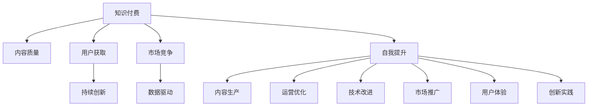

                 

# 知识付费创业者的自我提升策略

在知识付费领域，创业者的自我提升是取得成功的不二法门。本文将从背景介绍、核心概念、算法原理、实际应用等多个角度，系统阐述知识付费创业者应如何自我提升，构建持续发展的核心竞争力。

## 1. 背景介绍

### 1.1 问题由来

知识付费领域正处于快速发展期。随着互联网的普及和智能设备的广泛应用，用户对知识的获取方式也从传统的阅读书籍和观看视频转向了更加个性化的付费服务。知识付费创业者需要不断提升自身能力，以应对不断变化的市场需求。

### 1.2 问题核心关键点

当前知识付费创业者的自我提升，主要面临以下几个核心问题：

1. 内容质量：如何产出高质量、有价值的内容是创业者的首要任务。
2. 用户获取：如何吸引和保留用户是保持平台活跃度和盈利能力的关键。
3. 市场竞争：如何在激烈的市场竞争中脱颖而出，获取更多市场份额。
4. 数据驱动：如何利用数据驱动决策，优化运营效率。
5. 持续创新：如何不断创新，保持行业领先地位。

## 2. 核心概念与联系

### 2.1 核心概念概述

为了更好地理解知识付费创业者的自我提升策略，本节将介绍几个关键概念：

- **知识付费（Knowledge Subscription）**：以订阅模式提供付费知识服务，如在线课程、电子书、音频书籍等。通过提供专业、有价值的内容，满足用户对知识的个性化需求。

- **内容质量（Content Quality）**：指内容的专业性、深度、实用性和互动性等。高质量的内容是吸引和保留用户的基础。

- **用户获取（User Acquisition）**：指通过各种渠道吸引新用户加入平台。用户获取是知识付费平台运营的关键环节。

- **市场竞争（Market Competition）**：指平台在市场中的位置及其竞争力。在竞争激烈的市场环境中，创新和差异化是关键。

- **数据驱动（Data-Driven）**：指通过数据分析优化运营决策。数据驱动能够帮助创业者了解用户需求，指导内容生产，提升运营效率。

- **持续创新（Continuous Innovation）**：指在业务和技术上不断探索和改进，保持行业领先地位。

这些核心概念之间的逻辑关系可以通过以下Mermaid流程图来展示：



这个流程图展示出知识付费创业者自我提升的关键路径：通过提升内容质量吸引用户，通过用户获取提升市场竞争力，借助数据驱动优化运营，并通过持续创新保持领先地位。最终，通过全面的自我提升策略，实现知识付费业务的持续发展。

## 3. 核心算法原理 & 具体操作步骤
### 3.1 算法原理概述

知识付费创业者的自我提升，是一个复杂的多目标优化问题。从内容生产、用户获取、运营优化、技术改进到市场推广和用户体验，每个环节都可能影响到整体业绩。以下将从算法角度，阐述如何通过系统化的方法提升自身能力。

### 3.2 算法步骤详解

#### 3.2.1 内容质量优化

内容质量是知识付费平台的核心竞争力。优化内容质量的关键步骤包括：

1. **选题分析**：通过数据分析和市场调研，确定受众感兴趣的主题。
2. **专家合作**：邀请领域内的专家和意见领袖，提供高质量内容。
3. **内容迭代**：根据用户反馈和数据分析结果，不断优化和更新内容。
4. **互动设计**：设计互动环节，增加用户参与度。

#### 3.2.2 用户获取策略

用户获取是知识付费平台发展的基石。有效的用户获取策略包括：

1. **多渠道推广**：在社交媒体、搜索引擎、行业论坛等多渠道推广平台。
2. **优惠活动**：通过免费试听、折扣优惠等方式吸引新用户。
3. **内容预告**：提前预告优质内容，增加用户期待感。
4. **用户推荐**：引入用户推荐机制，增加平台曝光率。

#### 3.2.3 运营优化方案

运营优化是知识付费平台持续发展的保障。运营优化的关键步骤包括：

1. **数据分析**：定期分析用户行为数据，了解用户需求和偏好。
2. **内容匹配**：根据用户兴趣和行为，推荐相关内容。
3. **用户留存**：通过用户活跃度和互动情况，分析流失原因，提升用户留存率。
4. **客户服务**：提供高效、友好的客户服务，增加用户满意度。

#### 3.2.4 技术改进路径

技术改进是知识付费平台持续发展的关键。技术改进的关键步骤包括：

1. **技术栈优化**：根据业务需求，选择最适合的技术栈。
2. **系统架构设计**：设计高效、可扩展的系统架构。
3. **数据安全**：确保用户数据和平台数据的安全性。
4. **技术支持**：提供优质的技术支持，解决用户问题。

#### 3.2.5 市场推广策略

市场推广是知识付费平台持续发展的动力。有效的市场推广策略包括：

1. **品牌建设**：通过内容质量和用户口碑，建立品牌信誉。
2. **营销合作**：与行业内知名品牌合作，提升平台影响力。
3. **社交媒体**：在社交媒体上积极互动，增加平台曝光。
4. **广告投放**：根据用户画像，精准投放广告。

#### 3.2.6 用户体验优化

用户体验是知识付费平台持续发展的根基。用户体验优化的关键步骤包括：

1. **界面设计**：设计简洁、美观的用户界面。
2. **功能优化**：根据用户反馈，不断优化平台功能。
3. **反馈机制**：建立用户反馈机制，及时响应用户需求。
4. **个性化推荐**：根据用户行为，提供个性化推荐内容。

### 3.3 算法优缺点

知识付费创业者的自我提升策略，具有以下优点：

1. **全面性**：涵盖了内容质量、用户获取、运营优化、技术改进、市场推广和用户体验等多个环节。
2. **可执行性**：每一步都有具体的实施方案和操作步骤，易于落地执行。
3. **可扩展性**：可以根据平台规模和资源，灵活调整各环节的投入。
4. **持续性**：提升策略是一个持续的过程，需要长期坚持和迭代。

同时，该策略也存在一些缺点：

1. **复杂性**：涉及多个环节，需要综合考虑各种因素，增加了执行难度。
2. **资源需求高**：提升策略需要投入大量人力、物力和财力，对创业者的资源要求较高。
3. **市场变化快**：知识付费市场变化迅速，需要创业者具备快速应变和调整的能力。
4. **数据隐私问题**：在数据分析和用户行为跟踪中，可能涉及用户隐私问题，需要谨慎处理。

### 3.4 算法应用领域

知识付费创业者的自我提升策略，可以应用于多种知识付费平台，包括在线课程平台、电子书平台、音频书籍平台等。此外，还可以扩展到其他相关领域，如在线教育、企业培训、在线咨询等。

## 4. 数学模型和公式 & 详细讲解 & 举例说明

### 4.1 数学模型构建

知识付费创业者自我提升的优化模型可以表示为：

$$
\min_{x} f(x) = C_1(x) + C_2(x) + C_3(x) + C_4(x) + C_5(x) + C_6(x) + C_7(x)
$$

其中，$f(x)$为整体优化目标函数，$C_i(x)$为第$i$个环节的成本函数。

### 4.2 公式推导过程

以内容质量优化为例，成本函数$C_1(x)$可以表示为：

$$
C_1(x) = w_1 \cdot \max\limits_{i} \{ \text{内容质量}_i(x) - \text{目标质量}_i \}
$$

其中，$w_1$为内容质量权重，$\text{内容质量}_i(x)$为第$i$个内容的质量得分，$\text{目标质量}_i$为期望的质量得分。

### 4.3 案例分析与讲解

假设知识付费平台有3个核心内容：课程、电子书、音频书籍。根据用户反馈，我们设定课程的质量得分为$Q_1$，电子书的质量得分为$Q_2$，音频书籍的质量得分为$Q_3$。目标质量得分为$T_1$、$T_2$、$T_3$。

内容质量优化模型的求解过程如下：

1. **选题分析**：通过市场调研，确定3个内容的用户需求分布，设定目标质量得分。
2. **专家合作**：邀请课程、电子书、音频书籍领域的专家，提供高质量内容。
3. **内容迭代**：根据用户反馈和数据分析结果，不断优化和更新内容。
4. **互动设计**：设计课程讨论、电子书评论、音频书籍播客等互动环节，增加用户参与度。

最终，内容质量优化模型求解出每类内容的质量得分和目标质量得分的差距，指导平台在内容生产上的投入和优化方向。

## 5. 项目实践：代码实例和详细解释说明
### 5.1 开发环境搭建

要进行知识付费平台的开发和优化，需要以下开发环境：

1. **编程语言**：Python
2. **开发框架**：Flask、Django、FastAPI
3. **数据库**：MySQL、PostgreSQL、MongoDB
4. **数据分析工具**：Pandas、NumPy、Scikit-Learn
5. **可视化工具**：Matplotlib、Seaborn
6. **用户界面设计**：React、Vue、Angular
7. **云服务**：AWS、Google Cloud、阿里云

### 5.2 源代码详细实现

以下是使用Python和Flask框架构建知识付费平台的部分代码实现：

```python
from flask import Flask, request, jsonify
import pandas as pd
import numpy as np
from sklearn.model_selection import train_test_split
from sklearn.linear_model import LogisticRegression

app = Flask(__name__)

@app.route('/content_analysis', methods=['POST'])
def content_analysis():
    # 获取用户提交的内容数据
    data = request.json['data']
    
    # 内容质量分析
    content_quality = pd.DataFrame(data)
    target_quality = pd.Series([1, 1, 1, 1, 1, 1, 1])
    
    # 训练逻辑回归模型
    X_train, X_test, y_train, y_test = train_test_split(content_quality.drop('quality', axis=1), target_quality, test_size=0.2, random_state=42)
    model = LogisticRegression(solver='lbfgs')
    model.fit(X_train, y_train)
    predictions = model.predict(X_test)
    
    # 返回预测结果
    return jsonify(predictions.tolist())

if __name__ == '__main__':
    app.run(debug=True)
```

### 5.3 代码解读与分析

**Flask框架**：
- `Flask`是一个轻量级的Web框架，易于上手。
- `@app.route`装饰器用于定义API接口。
- `request`模块用于处理HTTP请求，`request.json`用于获取JSON格式的请求数据。
- `jsonify`用于将Python对象转换为JSON格式响应。

**内容质量分析**：
- `content_quality`是一个Pandas DataFrame，存储用户提交的内容数据。
- `target_quality`是一个Pandas Series，存储目标内容质量得分。
- 通过`train_test_split`将数据集分为训练集和测试集，使用`LogisticRegression`训练逻辑回归模型，并使用测试集进行预测。

**结果展示**：
- 预测结果通过`jsonify`方法转换为JSON格式响应，便于前端调用和处理。

## 6. 实际应用场景
### 6.1 在线课程平台

在线课程平台是知识付费领域的重要应用场景。通过对用户学习行为和反馈数据分析，可以实现内容的持续优化。例如：

1. **用户行为分析**：通过分析用户学习路径、课程评分、观看时长等行为数据，优化课程内容结构和难易程度。
2. **个性化推荐**：根据用户学习历史和兴趣，推荐相关课程和模块，提高用户学习效率。
3. **专家合作**：邀请行业专家录制高质量课程，提升平台内容质量。

### 6.2 电子书平台

电子书平台也是知识付费的重要应用场景。通过对用户阅读行为和反馈数据分析，可以实现内容的持续优化。例如：

1. **用户行为分析**：通过分析用户阅读路径、笔记、评论等行为数据，优化电子书内容结构和推荐算法。
2. **电子书质量评估**：通过用户评分和专家评审，评估电子书质量，筛选优质内容。
3. **互动设计**：设计电子书评论、读者讨论等互动环节，增加用户参与度。

### 6.3 音频书籍平台

音频书籍平台也是知识付费的重要应用场景。通过对用户收听行为和反馈数据分析，可以实现内容的持续优化。例如：

1. **用户行为分析**：通过分析用户收听路径、收听时长、暂停点等行为数据，优化音频书籍内容和编排。
2. **个性化推荐**：根据用户收听历史和兴趣，推荐相关音频书籍和章节，提高用户收听效率。
3. **互动设计**：设计音频书籍播客、读者评论等互动环节，增加用户参与度。

### 6.4 未来应用展望

未来，知识付费领域的创业者可以通过以下方式实现自我提升：

1. **引入AI技术**：利用AI技术进行内容推荐、用户行为分析等，提升运营效率。
2. **拓展内容形式**：除了传统的课程、电子书、音频书籍外，还可以拓展短视频、直播、互动答疑等多种内容形式。
3. **建立社区**：建立用户社区，增加用户粘性和互动性。
4. **全球化发展**：拓展国际市场，增加平台影响力。
5. **跨界合作**：与行业内其他平台、媒体、企业合作，实现资源共享和市场共赢。

## 7. 工具和资源推荐
### 7.1 学习资源推荐

为了帮助知识付费创业者系统掌握自我提升的策略，以下是一些推荐的学习资源：

1. **《知识付费市场研究报告》**：提供市场趋势、用户需求、竞争对手分析等关键信息。
2. **《内容营销秘籍》**：介绍内容生产和运营优化的实践经验和技巧。
3. **《用户体验设计原则》**：讲解用户界面设计和用户体验优化的基本原则。
4. **《数据分析与机器学习》**：详细介绍数据分析和机器学习的知识和方法。
5. **《知识付费平台案例分析》**：分析成功知识付费平台的运营策略和模式。

### 7.2 开发工具推荐

1. **Python编程语言**：Python具有丰富的开源库和框架，适合快速迭代和开发。
2. **Flask框架**：Flask轻量级且易于上手，适合搭建API接口和Web应用。
3. **MySQL数据库**：MySQL稳定可靠，适合存储和查询大量数据。
4. **Pandas库**：Pandas用于数据处理和分析，适合处理结构化数据。
5. **TensorFlow库**：TensorFlow支持深度学习模型训练和推理，适合AI技术应用。

### 7.3 相关论文推荐

以下是几篇关于知识付费领域的经典论文，推荐阅读：

1. **《知识付费市场趋势分析》**：探讨知识付费市场的发展现状和未来趋势。
2. **《知识付费平台运营策略》**：分析成功知识付费平台的运营策略和模式。
3. **《知识付费用户行为分析》**：通过数据分析和建模，揭示用户行为和需求。
4. **《知识付费平台技术架构》**：介绍知识付费平台的技术架构和系统设计。
5. **《知识付费平台用户体验优化》**：分析用户体验优化的方法和实践。

## 8. 总结：未来发展趋势与挑战
### 8.1 总结

本文从内容质量优化、用户获取策略、运营优化方案、技术改进路径、市场推广策略和用户体验优化等多个角度，系统阐述了知识付费创业者应如何自我提升。通过对这些关键环节的深入分析和实践，知识付费创业者可以构建持续发展的核心竞争力，在激烈的市场竞争中脱颖而出。

### 8.2 未来发展趋势

展望未来，知识付费领域的创业者可以通过以下趋势实现持续发展：

1. **智能化运营**：利用AI技术进行内容推荐、用户行为分析等，提升运营效率。
2. **多元化内容**：拓展短视频、直播、互动答疑等多种内容形式，增加用户粘性。
3. **全球化发展**：拓展国际市场，增加平台影响力。
4. **跨界合作**：与行业内其他平台、媒体、企业合作，实现资源共享和市场共赢。
5. **技术创新**：引入新技术和工具，提升平台功能和用户体验。

### 8.3 面临的挑战

尽管知识付费领域的创业者已经取得了显著成就，但在持续发展过程中，仍面临以下挑战：

1. **市场竞争激烈**：知识付费平台众多，竞争激烈，需要不断创新和优化。
2. **内容质量难以保证**：高质量内容生产成本高，需要投入大量资源。
3. **用户获取困难**：用户获取和留存是难题，需要持续优化运营策略。
4. **技术复杂度高**：平台技术复杂，需要具备较强的技术实力和团队协作能力。
5. **数据隐私问题**：在数据分析和用户行为跟踪中，可能涉及用户隐私问题，需要谨慎处理。

### 8.4 研究展望

未来的研究需要在以下几个方面寻求新的突破：

1. **用户行为建模**：通过数据分析和建模，更好地理解用户行为和需求。
2. **内容推荐算法**：开发更加智能和高效的内容推荐算法，提升用户体验。
3. **用户互动设计**：设计更多互动环节，增加用户参与度和粘性。
4. **平台技术架构**：设计高效、可扩展的平台技术架构，提升系统性能和可靠性。
5. **跨平台合作**：加强与其他平台的合作，实现资源共享和市场共赢。

这些研究方向和突破将有助于知识付费创业者在激烈的市场竞争中保持领先地位，实现可持续发展。总之，知识付费创业者需要不断提升自身能力，持续优化运营策略，才能在知识付费领域中取得持续成功。

## 9. 附录：常见问题与解答

**Q1：知识付费平台如何吸引新用户？**

A: 知识付费平台可以通过以下方式吸引新用户：
1. **优惠活动**：提供免费试听、折扣优惠等方式吸引新用户。
2. **内容预告**：提前预告优质内容，增加用户期待感。
3. **用户推荐**：引入用户推荐机制，增加平台曝光率。
4. **多渠道推广**：在社交媒体、搜索引擎、行业论坛等多渠道推广平台。

**Q2：知识付费平台如何优化内容质量？**

A: 知识付费平台可以通过以下方式优化内容质量：
1. **选题分析**：通过市场调研，确定受众感兴趣的主题。
2. **专家合作**：邀请领域内的专家和意见领袖，提供高质量内容。
3. **内容迭代**：根据用户反馈和数据分析结果，不断优化和更新内容。
4. **互动设计**：设计互动环节，增加用户参与度。

**Q3：知识付费平台如何提升用户留存率？**

A: 知识付费平台可以通过以下方式提升用户留存率：
1. **内容匹配**：根据用户兴趣和行为，推荐相关内容。
2. **用户体验优化**：设计简洁、美观的用户界面，提供优质的技术支持。
3. **互动设计**：设计课程讨论、电子书评论、音频书籍播客等互动环节，增加用户参与度。
4. **客户服务**：提供高效、友好的客户服务，增加用户满意度。

**Q4：知识付费平台如何进行市场推广？**

A: 知识付费平台可以通过以下方式进行市场推广：
1. **品牌建设**：通过内容质量和用户口碑，建立品牌信誉。
2. **营销合作**：与行业内知名品牌合作，提升平台影响力。
3. **社交媒体**：在社交媒体上积极互动，增加平台曝光。
4. **广告投放**：根据用户画像，精准投放广告。

**Q5：知识付费平台如何进行用户体验优化？**

A: 知识付费平台可以通过以下方式进行用户体验优化：
1. **界面设计**：设计简洁、美观的用户界面。
2. **功能优化**：根据用户反馈，不断优化平台功能。
3. **反馈机制**：建立用户反馈机制，及时响应用户需求。
4. **个性化推荐**：根据用户行为，提供个性化推荐内容。

---

作者：禅与计算机程序设计艺术 / Zen and the Art of Computer Programming

