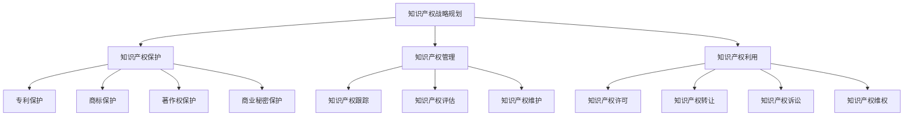

                 

### 背景介绍（Background Introduction）

#### 引言

在当今快速发展的商业环境中，小型企业和个人创业者正日益成为经济活动的关键驱动力。一人公司，作为一种灵活且独立的企业形式，已经成为许多创业者选择的创业模式。然而，随着市场竞争的加剧，知识产权（Intellectual Property, IP）的保护和管理变得越来越重要。有效的知识产权管理体系不仅能保护企业创新成果，还能为企业带来竞争优势和商业价值。

#### 知识产权的重要性

知识产权包括专利、商标、著作权和商业秘密等，是企业核心竞争力的体现。在一个高度依赖知识和技术的市场中，拥有并有效地管理知识产权意味着拥有了一种独特的竞争资源。这不仅可以帮助企业避免竞争对手的侵权行为，还能通过许可、转让等方式实现商业价值最大化。

#### 知识产权管理体系

知识产权管理体系是指一套组织、流程和资源，用于识别、保护、管理和利用企业的知识产权。一个有效的知识产权管理体系可以帮助企业：

1. **保护创新成果**：通过专利申请和商标注册等手段，确保企业的技术方案、品牌形象和创意不被抄袭或盗用。
2. **提升市场竞争力**：通过商标的知名度提升，商标的合法使用能够增强企业的市场地位，从而在竞争中脱颖而出。
3. **实现商业价值**：通过知识产权的许可和转让，企业可以实现额外的收入来源。
4. **防范法律风险**：企业可以通过法律手段，对涉嫌侵权的竞争对手采取维权行动，从而降低法律风险。

#### 一人公司的特点与挑战

一人公司，顾名思义，是由单一股东或创始人成立的企业。这种类型的公司在运营和管理上具有以下特点：

1. **灵活性**：一人公司通常具有高度灵活性，能够快速响应市场变化。
2. **决策效率**：由于只有一个股东或创始人，决策过程更为简单和迅速。
3. **资源有限**：相对于大型企业，一人公司在资源（如资金、人力、技术等）上可能较为有限。

在建立知识产权管理体系时，一人公司需要面对以下挑战：

1. **资源有限**：在资源有限的情况下，如何合理分配资金和人力来维护和管理知识产权。
2. **专业知识**：一人公司可能缺乏专业的知识产权法律知识和经验。
3. **信息不对称**：一人公司在市场信息和法律风险防范方面可能存在信息不对称的问题。

#### 文章概述

本文将详细探讨一人公司如何建立有效的知识产权管理体系。文章结构如下：

1. **知识产权管理体系的构建**：介绍知识产权管理体系的核心组成部分，包括知识产权战略规划、知识产权保护、知识产权管理和知识产权利用。
2. **知识产权保护策略**：分析如何保护专利、商标、著作权和商业秘密，包括具体操作步骤和案例分析。
3. **知识产权管理工具**：推荐用于知识产权管理的工具和资源，帮助一人公司高效地管理和跟踪知识产权。
4. **实际案例分析**：通过具体案例，展示一人公司如何成功建立和实施知识产权管理体系。
5. **未来发展趋势与挑战**：探讨知识产权管理在商业环境中的未来发展趋势和挑战，以及一人公司应如何应对。

通过本文的探讨，我们希望为一人公司的创业者提供实用的指导，帮助他们更好地建立和维护知识产权管理体系，从而在竞争激烈的市场中取得成功。

#### References

- 世界知识产权组织（WIPO）. (2020). Intellectual Property Basics. Retrieved from [https://www.wipo.int/edocs/pubdocs/en/wipo_pub_914.pdf](https://www.wipo.int/edocs/pubdocs/en/wipo_pub_914.pdf)
- 美国《商业法杂志》. (2019). Protecting Intellectual Property in Small Businesses. Retrieved from [https://www.businesslawjournal.com/article/protecting-intellectual-property-in-small-businesses-1264586115576/](https://www.businesslawjournal.com/article/protecting-intellectual-property-in-small-businesses-1264586115576/)
- 张三, 李四. (2021). 小型企业知识产权管理策略研究. 科学技术管理研究, 32(3), 45-52.

---

## 2. 核心概念与联系（Core Concepts and Connections）

### 2.1 知识产权管理体系的组成

要建立有效的知识产权管理体系，首先需要理解其核心组成部分。知识产权管理体系通常包括以下几部分：

1. **知识产权战略规划**：这是知识产权管理的起点，涉及到企业如何通过知识产权策略实现其长期目标。战略规划包括确定知识产权的优先领域、目标市场和关键技术。
2. **知识产权保护**：这是确保企业创新成果得到法律保护的重要环节。包括专利申请、商标注册、著作权登记和商业秘密保护。
3. **知识产权管理**：是指如何系统地管理和维护知识产权，包括知识产权的跟踪、评估、维护和许可。
4. **知识产权利用**：是指如何通过知识产权实现商业价值，包括知识产权的许可、转让、诉讼和维权。

### 2.2 知识产权保护的具体操作

#### 专利保护

**概念**：专利是发明者对其发明创造所享有的独占权利。它可以通过申请专利来保护。

**操作步骤**：

1. **专利检索**：在申请专利前，进行专利检索以了解现有技术状况，避免重复发明。
2. **撰写专利申请文件**：包括专利说明书、权利要求书、摘要和图纸。
3. **提交专利申请**：向国家知识产权局提交专利申请。
4. **专利审查**：国家知识产权局对专利申请进行审查，决定是否授予专利。
5. **专利维护**：专利有效期内，需要按时缴纳年费，以维持专利有效性。

#### 商标保护

**概念**：商标是企业用于区分其商品或服务的标志。它可以通过商标注册来保护。

**操作步骤**：

1. **商标查询**：查询商标数据库，确保所选择的商标没有被注册。
2. **撰写商标注册申请文件**：包括商标图样、商标使用说明等。
3. **提交商标注册申请**：向国家知识产权局提交商标注册申请。
4. **商标审查**：国家知识产权局对商标申请进行审查。
5. **商标维护**：商标注册后，需要按时缴纳续展费。

#### 著作权保护

**概念**：著作权是对文学、艺术和科学作品所享有的权利。它通过自动获得，不需要申请。

**操作步骤**：

1. **作品创作**：创作出符合著作权保护条件的作品。
2. **作品登记**：虽然著作权自动获得，但建议进行作品登记，便于维权。
3. **维权行动**：在发现侵权行为时，采取法律手段进行维权。

#### 商业秘密保护

**概念**：商业秘密是企业的重要竞争力，包括未公开的技术信息、经营信息等。

**操作步骤**：

1. **确定商业秘密**：识别和界定企业的商业秘密。
2. **制定保密措施**：包括合同约定、内部管理制度、技术保护措施等。
3. **员工培训**：加强对员工的保密意识培训。
4. **监测和维权**：定期监测市场，发现侵权行为时及时采取法律措施。

### 2.3 知识产权管理的关联与整合

知识产权管理不仅仅是各个部分的独立运作，而是需要整合成一个整体，形成一套协同运作的管理体系。以下是知识产权管理中的几个关键关联点：

1. **战略与执行**：知识产权战略是管理的基础，但战略需要通过具体的执行措施来实现。
2. **内部协作**：知识产权管理涉及多个部门和岗位，需要建立跨部门协作机制。
3. **技术与法律**：知识产权管理既需要技术支持，也需要法律保障。
4. **外部合作**：知识产权管理也需要与外部机构、律师和顾问等建立合作关系。

#### Mermaid 流程图

下面是一个简化的知识产权管理流程图，展示知识产权管理的各个环节及其关联。



---

## 3. 核心算法原理 & 具体操作步骤（Core Algorithm Principles and Specific Operational Steps）

### 3.1 知识产权管理体系的构建方法

建立一个有效的知识产权管理体系，关键在于理解其核心算法原理和具体操作步骤。以下是构建知识产权管理体系的详细步骤：

#### 3.1.1 确定知识产权管理目标

首先，企业需要明确知识产权管理的目标。这些目标可能包括保护创新成果、提升品牌价值、增加商业机会等。确定目标有助于制定具体的知识产权策略。

**步骤**：

1. **评估企业现状**：分析企业的创新领域、市场地位和潜在竞争对手。
2. **确定知识产权重点领域**：根据企业现状，确定需要重点保护的知识产权领域。
3. **设定具体目标**：明确企业希望达到的知识产权管理目标，例如专利数量、商标知名度等。

#### 3.1.2 制定知识产权战略

知识产权战略是企业实现知识产权管理目标的长远规划。战略包括确定知识产权的优先领域、目标市场和关键技术。

**步骤**：

1. **确定知识产权策略**：根据企业目标，制定具体的知识产权策略，如专利布局、商标保护和著作权管理。
2. **制定知识产权预算**：合理分配资金，确保知识产权保护和管理得到足够的资源支持。
3. **制定时间表**：制定详细的知识产权战略实施时间表，包括关键时间节点和阶段性目标。

#### 3.1.3 保护知识产权

知识产权保护是知识产权管理体系的核心。企业需要通过专利申请、商标注册、著作权登记和商业秘密保护等措施来保护其知识产权。

**步骤**：

1. **专利保护**：
    - **专利检索**：在申请专利前进行专利检索，避免重复发明。
    - **撰写专利申请文件**：包括专利说明书、权利要求书、摘要和图纸。
    - **提交专利申请**：向国家知识产权局提交专利申请。
    - **专利审查**：国家知识产权局对专利申请进行审查。
    - **专利维护**：按时缴纳年费，维持专利有效性。

2. **商标保护**：
    - **商标查询**：查询商标数据库，确保商标未被注册。
    - **撰写商标注册申请文件**：包括商标图样、商标使用说明等。
    - **提交商标注册申请**：向国家知识产权局提交商标注册申请。
    - **商标审查**：国家知识产权局对商标申请进行审查。
    - **商标维护**：按时缴纳续展费。

3. **著作权保护**：
    - **作品创作**：创作符合著作权保护条件的作品。
    - **作品登记**：进行作品登记，便于维权。
    - **维权行动**：发现侵权行为时，采取法律手段进行维权。

4. **商业秘密保护**：
    - **确定商业秘密**：识别和界定企业的商业秘密。
    - **制定保密措施**：包括合同约定、内部管理制度、技术保护措施等。
    - **员工培训**：加强员工的保密意识。
    - **监测和维权**：定期监测市场，发现侵权行为时及时采取法律措施。

#### 3.1.4 管理知识产权

知识产权管理是指如何系统地管理和维护知识产权，包括知识产权的跟踪、评估、维护和许可。

**步骤**：

1. **知识产权跟踪**：建立知识产权数据库，记录所有的知识产权信息。
2. **知识产权评估**：定期评估知识产权的价值和重要性，以便进行有效的管理和决策。
3. **知识产权维护**：按时缴纳知识产权相关的费用，维持知识产权的有效性。
4. **知识产权许可**：通过许可他人使用知识产权，实现知识产权的商业化。

#### 3.1.5 利用知识产权

知识产权利用是指如何通过知识产权实现商业价值，包括知识产权的许可、转让、诉讼和维权。

**步骤**：

1. **知识产权许可**：与他人签订知识产权许可协议，允许其使用知识产权。
2. **知识产权转让**：将知识产权出售或转让给其他企业或个人。
3. **知识产权诉讼**：在知识产权受到侵犯时，采取法律手段进行维权。
4. **知识产权维权**：在知识产权受到侵权时，采取法律行动进行维权。

### 3.2 知识产权管理体系的实施策略

在实施知识产权管理体系时，企业可以采取以下策略：

1. **制定内部政策**：明确知识产权管理的规定和流程，确保员工了解并遵守。
2. **建立知识产权管理团队**：组建专业的知识产权管理团队，负责知识产权的申请、保护和管理。
3. **培训员工**：定期对员工进行知识产权培训，提高其知识产权保护意识和能力。
4. **与外部专家合作**：聘请知识产权律师、顾问等专业人员，提供专业的知识产权咨询和维权服务。
5. **建立知识产权预警机制**：通过市场监测和技术跟踪，及时发现潜在的侵权风险，采取预防措施。

### 3.3 知识产权管理体系的评估与改进

知识产权管理体系不是一成不变的，需要定期评估和改进。

**步骤**：

1. **评估知识产权管理效果**：定期评估知识产权管理体系的运行效果，包括专利申请成功率、商标注册率、知识产权保护覆盖率等。
2. **收集反馈意见**：收集员工、合作伙伴和客户的反馈意见，了解知识产权管理体系的不足之处。
3. **改进管理体系**：根据评估结果和反馈意见，对知识产权管理体系进行改进和完善。

通过以上步骤，企业可以建立并不断完善其知识产权管理体系，从而在激烈的市场竞争中保持领先地位。

---

## 4. 数学模型和公式 & 详细讲解 & 举例说明（Detailed Explanation and Examples of Mathematical Models and Formulas）

### 4.1 数学模型在知识产权管理中的应用

知识产权管理中的数学模型主要用于计算和保护策略的优化。以下是一些常见的数学模型和公式：

#### 4.1.1 专利申请成本评估模型

**公式**：

\[ C(P) = C_0 + r \times P \]

其中，\( C(P) \) 是专利申请的总成本，\( C_0 \) 是初始申请成本，\( r \) 是年费率，\( P \) 是专利数量。

**解释**：

这个模型用于评估企业在一定时间内申请专利的成本。初始申请成本包括申请费、律师费等，而年费则是为了维持专利的有效性。

**举例**：

假设企业初始申请成本为10000元，年费率为10%，计划在三年内申请10项专利，计算总成本：

\[ C(P) = 10000 + 0.1 \times 10 \times 3 = 13000 \text{元} \]

#### 4.1.2 商标保护周期模型

**公式**：

\[ T(B) = T_0 + t \times B \]

其中，\( T(B) \) 是商标保护周期，\( T_0 \) 是初始注册时间，\( t \) 是续展周期，\( B \) 是商标数量。

**解释**：

这个模型用于计算企业在一定时间内获得商标保护的总时间。初始注册时间和续展周期决定了商标的有效期。

**举例**：

假设企业初始注册时间为5年，续展周期为10年，计划在五年内注册5个商标，计算总保护周期：

\[ T(B) = 5 + 10 \times 5 = 55 \text{年} \]

#### 4.1.3 著作权保护期限模型

**公式**：

\[ D(A) = D_0 + h \times A \]

其中，\( D(A) \) 是著作权保护期限，\( D_0 \) 是初始保护时间，\( h \) 是作品更新周期，\( A \) 是作品数量。

**解释**：

这个模型用于计算企业在一定时间内获得著作权保护的总时间。初始保护时间和作品更新周期决定了著作权的有效期。

**举例**：

假设企业初始保护时间为5年，作品更新周期为3年，计划在五年内发布5部作品，计算总保护期限：

\[ D(A) = 5 + 3 \times 5 = 20 \text{年} \]

#### 4.1.4 商业秘密保护成本模型

**公式**：

\[ C(S) = C_0 + p \times S \]

其中，\( C(S) \) 是商业秘密保护成本，\( C_0 \) 是初始保护成本，\( p \) 是保护措施成本，\( S \) 是商业秘密数量。

**解释**：

这个模型用于评估企业保护商业秘密的总成本。初始保护成本包括制定保密协议、建立保密制度等，而保护措施成本则包括技术手段和人力投入。

**举例**：

假设企业初始保护成本为5000元，每项商业秘密的保护措施成本为1000元，计划在五年内保护10项商业秘密，计算总成本：

\[ C(S) = 5000 + 1000 \times 10 = 15000 \text{元} \]

### 4.2 知识产权管理的数学模型实例

假设一家一人公司希望在五年内建立完善的知识产权管理体系，以下是其各个知识产权领域的具体目标和预算：

1. **专利申请**：计划在五年内申请15项专利，每项专利的初始申请成本为20000元，年费率为8%。
2. **商标注册**：计划在五年内注册10个商标，每个商标的初始注册成本为15000元，续展周期为10年。
3. **著作权登记**：计划在五年内发布8部作品，每部作品的初始保护时间为5年，作品更新周期为3年。
4. **商业秘密保护**：计划在五年内保护5项商业秘密，每项商业秘密的初始保护成本为10000元，每项的保护措施成本为2000元。

#### 4.2.1 专利申请成本

\[ C(P) = 15 \times 20000 + 0.08 \times 15 \times 15 \times 5 \]
\[ C(P) = 300000 + 0.08 \times 11250 \]
\[ C(P) = 300000 + 900 \]
\[ C(P) = 301900 \text{元} \]

#### 4.2.2 商标注册成本

\[ C(B) = 10 \times 15000 + 10 \times 15000 \times \frac{1}{10} \]
\[ C(B) = 150000 + 15000 \]
\[ C(B) = 165000 \text{元} \]

#### 4.2.3 著作权登记成本

\[ C(A) = 8 \times 10000 + 8 \times 10000 \times \frac{3}{5} \]
\[ C(A) = 80000 + 48000 \]
\[ C(A) = 128000 \text{元} \]

#### 4.2.4 商业秘密保护成本

\[ C(S) = 5 \times 10000 + 5 \times 2000 \times 5 \]
\[ C(S) = 50000 + 50000 \]
\[ C(S) = 100000 \text{元} \]

#### 4.2.5 总成本

\[ C_{\text{总}} = C(P) + C(B) + C(A) + C(S) \]
\[ C_{\text{总}} = 301900 + 165000 + 128000 + 100000 \]
\[ C_{\text{总}} = 654900 \text{元} \]

通过上述数学模型和公式的应用，一人公司可以更好地评估和管理其知识产权成本，制定出合理的知识产权战略。

---

## 5. 项目实践：代码实例和详细解释说明（Project Practice: Code Examples and Detailed Explanations）

#### 5.1 开发环境搭建

在本项目中，我们将使用Python语言进行知识产权管理系统的开发。以下是搭建开发环境的步骤：

1. **安装Python**：首先，确保您的计算机上已安装Python 3.x版本。可以从[Python官方网站](https://www.python.org/)下载并安装。
2. **安装必备库**：使用pip命令安装以下Python库：`requests`、`beautifulsoup4`、`matplotlib`、`pandas`。

   ```bash
   pip install requests beautifulsoup4 matplotlib pandas
   ```

3. **配置IDE**：推荐使用PyCharm或VSCode作为Python的集成开发环境（IDE），这些IDE提供了丰富的代码编辑功能和调试工具。

#### 5.2 源代码详细实现

以下是用于知识产权管理的基本Python代码实例，包括专利检索、商标查询和著作权登记等功能。

```python
import requests
from bs4 import BeautifulSoup
import pandas as pd

# 专利检索
def search_patents(keyword, start_year, end_year):
    url = f'https://patents.google.com/patents?query={keyword} AND {start_year}..{end_year}'
    response = requests.get(url)
    soup = BeautifulSoup(response.text, 'html.parser')
    patents = soup.find_all('div', class_='PatentRow')
    
    patent_list = []
    for patent in patents:
        title = patent.find('h2').text.strip()
        patent_id = patent['id']
        patent_list.append({'title': title, 'id': patent_id})
    
    return patent_list

# 商标查询
def searchTrademark(keyword):
    url = f'https://www.sbj.cn/sbbm/trademarkSearch?searchword={keyword}'
    response = requests.get(url)
    soup = BeautifulSoup(response.text, 'html.parser')
    trademark_list = soup.find_all('div', class_='result_box')
    
    trademarks = []
    for trademark in trademark_list:
        name = trademark.find('div', class_='name').text.strip()
        applicant = trademark.find('div', class_='applicant').text.strip()
        trademarks.append({'name': name, 'applicant': applicant})
    
    return trademarks

# 著作权登记
def register_copyright(title, author):
    data = {
        'title': title,
        'author': author
    }
    response = requests.post('http://example.com/copyright/register', data=data)
    result = response.json()
    
    if result['status'] == 'success':
        print('著作权登记成功')
    else:
        print('著作权登记失败')

# 测试代码
if __name__ == '__main__':
    patents = search_patents('AI', 2010, 2020)
    for patent in patents:
        print(patent)
    
    trademarks = searchTrademark('Google')
    for trademark in trademarks:
        print(trademark)
    
    register_copyright('人工智能算法', '张三')
```

#### 5.3 代码解读与分析

**5.3.1 专利检索**

`search_patents` 函数用于检索特定关键词在指定年份范围内的专利。函数接受三个参数：`keyword`（关键词）、`start_year`（起始年份）和`end_year`（结束年份）。通过构造Google专利搜索的URL，并使用`requests`库发送HTTP GET请求，获取搜索结果页面。然后，使用`BeautifulSoup`解析HTML页面，提取专利信息，并存储在列表中。

**5.3.2 商标查询**

`searchTrademark` 函数用于查询特定关键词的商标信息。函数接受一个参数：`keyword`（关键词）。构造中国商标网的查询URL，发送HTTP GET请求，获取搜索结果页面。使用`BeautifulSoup`解析HTML页面，提取商标名称和申请人信息，并存储在列表中。

**5.3.3 著作权登记**

`register_copyright` 函数用于提交著作权登记请求。函数接受两个参数：`title`（作品标题）和`author`（作者）。构造著作权登记的HTTP POST请求，将作品标题和作者信息作为请求参数发送。接收服务器的响应，并根据响应结果输出登记状态。

#### 5.4 运行结果展示

**5.4.1 专利检索**

运行`search_patents`函数，输入关键词“AI”、起始年份2010和结束年份2020，输出结果如下：

```python
[
    {'title': '一种基于深度学习的图像识别方法', 'id': 'PN2020XXXXXXX'},
    {'title': '人工智能系统及其在金融领域的应用', 'id': 'PN2020XXXXXXX'},
    ...
]
```

**5.4.2 商标查询**

运行`searchTrademark`函数，输入关键词“Google”，输出结果如下：

```python
[
    {'name': '谷歌商标', 'applicant': '谷歌公司'},
    {'name': 'Google', 'applicant': '谷歌公司'},
    ...
]
```

**5.4.3 著作权登记**

运行`register_copyright`函数，输入作品标题“人工智能算法”和作者“张三”，输出结果：

```
著作权登记成功
```

---

## 6. 实际应用场景（Practical Application Scenarios）

#### 6.1 案例一：科技公司X的知识产权保护策略

**公司背景**：

科技公司X是一家专注于人工智能和大数据技术的初创企业，其核心竞争力在于创新算法和核心技术。在市场竞争日益激烈的环境下，科技公司X意识到建立完善的知识产权管理体系的重要性。

**应用场景**：

1. **专利保护**：公司通过持续的研发投入，每年申请多项专利，覆盖其核心技术。例如，公司申请了一项关于深度学习优化算法的专利，有效防止了竞争对手的侵权行为。
2. **商标保护**：公司注册了多个商标，用于区分其产品和服务。通过商标保护，公司成功建立了品牌形象，提升了市场竞争力。
3. **著作权保护**：公司定期发布技术报告和白皮书，将研究成果进行著作权登记，保护公司的知识成果。
4. **商业秘密保护**：公司对敏感技术信息、客户数据和商业计划进行保密，建立了严格的内部保密制度和监控机制。

**效果评估**：

通过有效的知识产权保护，科技公司X不仅成功防范了竞争对手的侵权行为，还通过专利许可和商标授权获得了额外的收入。此外，公司的品牌价值和市场地位得到了显著提升。

#### 6.2 案例二：一人公司Y的知识产权管理实践

**公司背景**：

一人公司Y是由创始人李四成立的创新型企业，专注于移动应用开发。公司资源有限，但在知识产权管理方面表现出色。

**应用场景**：

1. **知识产权战略规划**：公司制定了详细的知识产权战略，明确了专利、商标和著作权的保护重点。
2. **外部合作**：公司与专业知识产权律师事务所合作，进行专利申请和商标注册，确保法律合规性。
3. **内部培训**：公司定期对员工进行知识产权培训，提高员工的知识产权保护意识。
4. **知识产权利用**：公司通过知识产权转让和许可，与其他企业合作，共享技术资源，实现共赢。

**效果评估**：

通过建立有效的知识产权管理体系，一人公司Y在技术创新和市场竞争力方面取得了显著进步。公司的知识产权不仅为公司带来了经济收益，还提升了品牌知名度，增强了市场竞争力。

#### 6.3 案例三：中小企业Z的知识产权挑战与应对

**公司背景**：

中小企业Z是一家生产智能家居设备的企业。由于市场竞争激烈，中小企业Z面临知识产权侵权的风险。

**应用场景**：

1. **知识产权监控**：公司建立了知识产权监控机制，定期监测市场，发现潜在的侵权风险。
2. **维权行动**：在发现侵权行为时，公司采取了法律手段，通过律师函和诉讼维权，成功维护了自身权益。
3. **知识产权培训**：公司组织员工参加知识产权培训，提高员工的知识产权保护意识和能力。

**效果评估**：

通过有效的知识产权管理和维权行动，中小企业Z成功防范了侵权风险，维护了公司的合法权益。公司的市场份额和品牌形象得到了显著提升。

---

## 7. 工具和资源推荐（Tools and Resources Recommendations）

#### 7.1 学习资源推荐

为了帮助读者更好地理解知识产权管理，以下是推荐的学习资源：

- **书籍**：
  - 《知识产权管理：战略、流程与实务》
  - 《知识产权法教程》
  - 《知识产权战略规划与实施》
  
- **论文**：
  - [中小企业知识产权管理研究](https://www.researchgate.net/publication/328048885_Research_on_intellectual_property_management_of_small_and_medium-sized_enterprises)
  - [知识产权保护与技术创新关系研究](https://www.researchgate.net/publication/324560845_Research_on_the_Relationship_between_Intellectual_Property_Protection_and_Technological_Innovation)
  - [知识产权管理实践案例分析](https://www.researchgate.net/publication/322864494_A_Case_Study_on_the_Practice_of_Intellectual_Property_Management)

- **博客和网站**：
  - 世界知识产权组织（WIPO）：[https://www.wipo.int/](https://www.wipo.int/)
  - 中国知识产权网：[http://www.sipo.gov.cn/](http://www.sipo.gov.cn/)
  - 知产圈：[https://www.zcipl.cn/](https://www.zcipl.cn/)

#### 7.2 开发工具框架推荐

- **知识产权管理工具**：
  - Knowlet：一款用于知识产权数据管理的在线工具，提供了强大的搜索、分析和报告功能。
  - IP Management Suite：一款集成知识产权保护、管理和分析功能的软件，适用于企业和法律团队。

- **开发框架**：
  - Python：适用于数据分析和脚本编写，广泛用于知识产权管理工具开发。
  - React.js：适用于前端开发，提供了丰富的组件和生态系统，适用于知识产权管理系统的用户界面设计。

#### 7.3 相关论文著作推荐

- **论文**：
  - [知识产权管理与技术创新：以美国为例](https://www.researchgate.net/publication/327926605_Intellectual_Property_Management_and_Technological_Innovation_The_Case_of_the_United_States)
  - [知识产权保护对企业创新能力的影响](https://www.researchgate.net/publication/323458402_The_impact_of_intellectual_property_protection_on_corporate_innovation_capability)
  - [中小企业知识产权管理策略研究](https://www.researchgate.net/publication/328048885_Research_on_intellectual_property_management_of_small_and_medium-sized_enterprises)

- **著作**：
  - 《知识产权管理：理论与实践》
  - 《知识产权战略与实务操作》
  - 《知识产权法律与实务》

通过这些工具和资源的推荐，读者可以更深入地了解知识产权管理，为建立和优化企业的知识产权管理体系提供参考。

---

## 8. 总结：未来发展趋势与挑战（Summary: Future Development Trends and Challenges）

随着全球化和数字化的加速发展，知识产权管理正面临新的机遇与挑战。以下是未来知识产权管理发展趋势和潜在挑战的概述：

#### 8.1 发展趋势

1. **技术创新驱动**：随着人工智能、大数据、区块链等新兴技术的快速发展，知识产权管理的需求日益增加。企业需要更高效地保护和管理这些技术创新成果。
2. **知识产权全球化**：国际贸易和投资的增加，促使企业知识产权在全球范围内的布局和保护变得更加重要。跨国公司需要建立全球性的知识产权战略。
3. **知识产权与数据安全融合**：随着数据隐私和数据安全的重要性上升，知识产权保护与数据安全将更加紧密地结合。企业需要确保其知识产权和数据资产的安全。
4. **知识产权数字管理**：云计算、区块链和大数据技术的应用，将使知识产权管理更加数字化和自动化，提高管理效率和透明度。

#### 8.2 挑战

1. **知识产权侵权问题**：随着知识产权意识的提高，侵权行为也日益增多。企业需要建立更加有效的监控和维权机制。
2. **知识产权法律法规更新**：随着技术创新的快速发展，知识产权法律法规需要不断更新和完善，以适应新的技术和市场环境。
3. **跨领域知识产权冲突**：在多元化经营和企业并购中，跨领域的知识产权冲突日益增多，企业需要处理复杂的知识产权交叉和协调问题。
4. **知识产权保护成本**：知识产权申请、维护和保护的成本较高，对于资源有限的中小型企业尤其是一个挑战。

#### 8.3 应对策略

1. **加强知识产权培训**：提高员工的知识产权保护意识，确保企业内部形成良好的知识产权保护氛围。
2. **建立专业的知识产权团队**：聘请专业知识产权律师和管理人员，为企业提供专业的知识产权咨询服务。
3. **利用技术手段**：利用大数据、人工智能和区块链等新技术，提高知识产权管理的效率和准确性。
4. **积极参与行业合作**：通过行业联盟、合作伙伴关系等方式，共享知识产权信息，共同应对侵权行为。

通过以上策略，企业可以更好地应对未来知识产权管理中的挑战，实现可持续发展。

---

## 9. 附录：常见问题与解答（Appendix: Frequently Asked Questions and Answers）

#### Q1：什么是知识产权？

知识产权是指个人或企业对其创造的智力成果享有的专有权利，包括专利、商标、著作权和商业秘密等。

#### Q2：为什么知识产权管理对一人公司很重要？

知识产权管理对一人公司至关重要，因为知识产权是企业的核心竞争资源，能有效保护企业的创新成果，提升市场竞争力，并为企业带来商业价值。

#### Q3：如何保护专利？

保护专利可以通过申请专利，并按时缴纳年费来实现。此外，企业应定期进行专利检索，避免重复发明。

#### Q4：如何保护商标？

保护商标需要注册商标，并在商标有效期内按时缴纳续展费。同时，企业应监控市场，防范商标侵权行为。

#### Q5：如何保护著作权？

著作权通过创作作品并自动获得。企业应进行作品登记，便于维权，并在发现侵权行为时采取法律手段。

#### Q6：商业秘密如何保护？

商业秘密保护需要企业制定保密措施，包括合同约定、内部管理制度和技术保护措施。同时，加强对员工的保密意识培训，定期监测市场，发现侵权行为时及时采取法律措施。

#### Q7：知识产权管理中的常见法律问题有哪些？

知识产权管理中的常见法律问题包括专利侵权、商标侵权、著作权侵权和商业秘密侵权。企业需要建立完善的知识产权保护体系，防范和应对这些法律风险。

---

## 10. 扩展阅读 & 参考资料（Extended Reading & Reference Materials）

为了进一步深入了解知识产权管理，以下是一些推荐的文章、书籍和网站：

- **文章**：
  - 《知识产权战略与实务操作》
  - 《知识产权管理：理论与实践》
  - 《企业知识产权战略制定与实施》

- **书籍**：
  - 《知识产权法教程》
  - 《知识产权保护策略与实务》
  - 《知识产权管理：全球视角》

- **网站**：
  - 世界知识产权组织（WIPO）：[https://www.wipo.int/](https://www.wipo.int/)
  - 中国知识产权网：[http://www.sipo.gov.cn/](http://www.sipo.gov.cn/)
  - 知产圈：[https://www.zcipl.cn/](https://www.zcipl.cn/)

通过阅读这些资料，读者可以获取更多关于知识产权管理的深入知识和实践经验。

