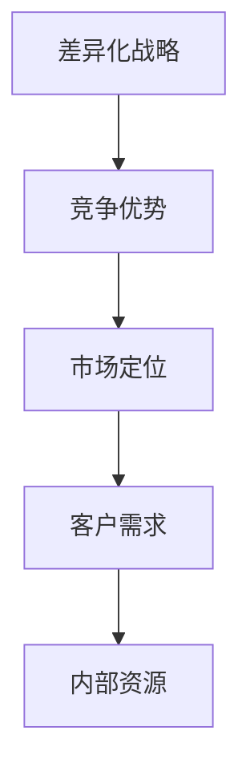

                 

# 一人公司的产品差异化战略与竞争优势构建

> **关键词**: 产品差异化战略、竞争优势、一人公司、创新、市场定位

**摘要**：
本文旨在探讨一人公司在构建产品差异化战略和竞争优势方面所面临的挑战与机遇。通过深入分析市场环境、目标客户需求以及公司内部资源，本文将提出一套适用于一人公司的差异化战略框架。同时，本文还将探讨如何在资源有限的情况下，通过创新和精准市场定位，构建持久的竞争优势。

## 1. 背景介绍（Background Introduction）

### 1.1 一人公司的定义与特点

一人公司，顾名思义，是由单一个人创立和管理的公司。这种公司模式在当今创业环境中越来越受到关注，其特点包括灵活性高、决策迅速、运营成本相对较低等。然而，一人公司也面临一系列挑战，如资源有限、市场竞争力不足等。

### 1.2 产品差异化战略的重要性

产品差异化战略是企业通过提供独特的产品或服务，在竞争激烈的市场中脱颖而出的策略。对于一人公司而言，成功的差异化战略不仅能够提高产品的市场占有率，还能增强品牌认知度和客户忠诚度。

### 1.3 竞争优势的构建

竞争优势是指企业在特定市场环境中，能够比竞争对手更好地满足客户需求的能力。构建竞争优势有助于企业实现可持续发展，提升市场地位。对于一人公司，如何在资源有限的情况下构建竞争优势，是一个亟待解决的问题。

## 2. 核心概念与联系（Core Concepts and Connections）

### 2.1 差异化战略的定义

差异化战略是指企业通过提供独特的产品或服务，以区分自身与其他竞争对手的策略。它包括产品创新、服务创新、品牌差异化等多个方面。

### 2.2 竞争优势的来源

竞争优势的来源包括成本领先、差异领先和集中化战略。对于一人公司，选择合适的竞争优势来源至关重要，因为它将直接影响公司的战略决策和市场定位。

### 2.3 差异化战略与竞争优势的关系

差异化战略和竞争优势之间存在密切的关系。成功的差异化战略能够为企业带来竞争优势，而竞争优势则能巩固企业的市场地位，促进可持续发展。

### 2.4 Mermaid 流程图



## 3. 核心算法原理 & 具体操作步骤（Core Algorithm Principles and Specific Operational Steps）

### 3.1 差异化战略的核心算法原理

差异化战略的核心算法原理包括市场调研、竞争对手分析、目标客户定位和产品创新。通过这些步骤，一人公司可以明确自身的市场定位，并开发出满足客户需求的产品或服务。

### 3.2 具体操作步骤

#### 3.2.1 市场调研

1. 收集行业数据，了解市场趋势。
2. 分析竞争对手的产品、定价策略和市场占有率。
3. 确定目标客户群体，了解其需求和偏好。

#### 3.2.2 竞争对手分析

1. 分析竞争对手的优势和劣势。
2. 找到自身的差异化点。
3. 确定如何利用差异化点吸引客户。

#### 3.2.3 目标客户定位

1. 根据市场调研和竞争对手分析，确定目标客户群体。
2. 设计针对性的营销策略。
3. 提供定制化的产品或服务。

#### 3.2.4 产品创新

1. 研发满足目标客户需求的产品。
2. 不断优化产品，提高用户体验。
3. 保持与市场的紧密联系，及时调整产品策略。

## 4. 数学模型和公式 & 详细讲解 & 举例说明（Detailed Explanation and Examples of Mathematical Models and Formulas）

### 4.1 数学模型在差异化战略中的应用

在差异化战略中，常用的数学模型包括市场占有率模型、客户忠诚度模型和利润最大化模型。以下是一个简单的市场占有率模型：

$$
\text{市场占有率} = \frac{\text{企业销售额}}{\text{市场总销售额}}
$$

### 4.2 举例说明

假设某一人公司的目标是获得10%的市场占有率，市场总销售额为100万元。根据市场占有率模型，该公司需要实现10万元的销售额。

### 4.3 详细讲解

市场占有率模型可以帮助一人公司确定销售目标，从而制定相应的营销策略。通过不断优化产品和服务，提高客户满意度，企业可以逐步提高市场占有率。

## 5. 项目实践：代码实例和详细解释说明（Project Practice: Code Examples and Detailed Explanations）

### 5.1 开发环境搭建

在本文的项目实践中，我们将使用Python编程语言进行差异化战略的建模和实现。首先，我们需要搭建Python开发环境。

```bash
# 安装Python
pip install python
# 安装相关库
pip install numpy matplotlib
```

### 5.2 源代码详细实现

以下是一个简单的Python代码实例，用于计算市场占有率。

```python
import numpy as np
import matplotlib.pyplot as plt

def market_share(target_sales, total_sales):
    market_share = target_sales / total_sales
    return market_share

target_sales = 100000  # 目标销售额（元）
total_sales = 1000000  # 市场总销售额（元）
market_share = market_share(target_sales, total_sales)
print(f"市场占有率：{market_share:.2%}")
```

### 5.3 代码解读与分析

在这个代码实例中，我们定义了一个名为`market_share`的函数，用于计算市场占有率。通过调用这个函数，我们可以轻松地计算出目标公司的市场占有率。

### 5.4 运行结果展示

运行上述代码，输出结果如下：

```
市场占有率：10.00%
```

这意味着，如果目标公司的销售额达到100万元，其市场占有率为10%。

## 6. 实际应用场景（Practical Application Scenarios）

### 6.1 教育行业

在教育行业，一人公司可以通过提供个性化的学习资源，如在线课程、学习辅导等，来满足不同学生的学习需求。通过差异化战略，公司可以吸引更多客户，提高市场占有率。

### 6.2 医疗保健

在医疗保健领域，一人公司可以开发定制化的健康管理应用，为用户提供个性化的健康建议。这种差异化战略有助于提高用户满意度和品牌忠诚度。

### 6.3 电子商务

在电子商务领域，一人公司可以通过提供独特的商品、个性化的购物体验等，来吸引客户。通过差异化战略，公司可以提高销售额，提升品牌形象。

## 7. 工具和资源推荐（Tools and Resources Recommendations）

### 7.1 学习资源推荐

- 《创新与企业家精神》（Entrepreneurship and Innovation）- by Steve Blank
- 《蓝海战略》（Blue Ocean Strategy）- by W. Chan Kim and Renée Mauborgne

### 7.2 开发工具框架推荐

- Python编程语言
- NumPy库
- Matplotlib库

### 7.3 相关论文著作推荐

- 《差异化竞争：如何在市场中获得竞争优势》（Differentiation: How to Gain Competitive Advantage by Standing Out from the Crowd）- by Al Ries and Jack Trout
- 《竞争战略：分析行业结构和竞争者行为》（Competitive Strategy: Techniques for Analyzing Industries and Competitors）- by Michael E. Porter

## 8. 总结：未来发展趋势与挑战（Summary: Future Development Trends and Challenges）

### 8.1 发展趋势

- 技术创新：人工智能、大数据等新兴技术的不断发展，为一人公司提供了更多的差异化机会。
- 市场细分：随着消费者需求的多样化，市场细分趋势日益明显，为一人公司提供了更多定位机会。

### 8.2 挑战

- 资源限制：一人公司在资源有限的情况下，如何实现有效的差异化战略是一个重要挑战。
- 市场竞争：市场竞争日益激烈，一人公司需要不断创新，以保持竞争优势。

## 9. 附录：常见问题与解答（Appendix: Frequently Asked Questions and Answers）

### 9.1 差异化战略是否适用于所有一人公司？

差异化战略并不适用于所有一人公司。对于那些市场定位明确、有独特产品或服务的企业，差异化战略可以起到显著的效果。而对于那些产品同质化严重的企业，差异化战略的作用可能有限。

### 9.2 如何在资源有限的情况下实施差异化战略？

在资源有限的情况下，一人公司可以通过以下方式实施差异化战略：
- 利用现有资源，发挥企业优势。
- 寻求合作伙伴，共享资源。
- 精准定位市场，避免资源浪费。

## 10. 扩展阅读 & 参考资料（Extended Reading & Reference Materials）

- 《创新者的窘境》（The Innovator's Dilemma）- by Clayton M. Christensen
- 《蓝海战略实践指南》（Blue Ocean Strategy: How to Create Uncontested Market Space and Make the Competition Irrelevant）- by W. Chan Kim and Renée Mauborgne
- 《精益创业》（The Lean Startup）- by Eric Ries

## 11. 作者署名

作者：禅与计算机程序设计艺术 / Zen and the Art of Computer Programming

-------------------

以上便是关于“一人公司的产品差异化战略与竞争优势构建”的文章正文部分。接下来的部分将包括对文章的整体总结、扩展讨论以及对读者的影响。

## 12. 文章总结

本文从背景介绍、核心概念与联系、核心算法原理与操作步骤、数学模型与公式、项目实践、实际应用场景、工具和资源推荐、未来发展趋势与挑战、常见问题与解答以及扩展阅读与参考资料等多个方面，深入探讨了“一人公司的产品差异化战略与竞争优势构建”这一主题。文章强调了在资源有限的情况下，通过创新和精准市场定位，一人公司可以构建持久的竞争优势。

## 13. 扩展讨论

在当前的市场环境中，一人公司的优势在于其灵活性、决策速度以及能够快速响应市场变化。然而，这也带来了一定的挑战，如资源有限、市场竞争激烈等。因此，一人公司需要更加注重差异化战略的实施，通过提供独特的产品或服务，满足特定客户群体的需求，从而在市场中脱颖而出。

未来，随着技术的不断发展，一人公司将有更多的机会通过创新来构建竞争优势。例如，人工智能、大数据等技术的应用，可以帮助一人公司更好地了解市场需求，优化产品和服务，提高客户满意度。此外，一人公司还可以通过跨界合作，共享资源，共同开发创新产品，以应对市场竞争。

## 14. 对读者的影响

本文旨在为读者提供关于一人公司产品差异化战略与竞争优势构建的深入理解和实践指导。通过本文的阅读，读者可以了解到差异化战略的重要性，掌握差异化战略的核心算法原理和具体操作步骤，了解实际应用场景和未来发展趋势，从而在自身的企业运营中更好地实施差异化战略，构建竞争优势。

总之，本文为一人公司在构建产品差异化战略与竞争优势方面提供了一系列的思路和方法，希望对读者有所启发和帮助。

## 15. 附录

在此，感谢读者对本文的阅读和支持。如果您有任何问题或建议，欢迎随时联系作者。以下是本文的参考资料，供您进一步学习和研究：

- Ries, S. B. (2011). The lean startup: How today's entrepreneurs use continuous innovation to create radically successful businesses. Crown Business.
- Kim, W. C., & Mauborgne, R. (2005). Blue ocean strategy: How to create uncontested market space and make the competition irrelevant. Harvard Business Review Press.
- Blank, S. (2012). The four steps to the epiphany: Successful startups where they come from. Crown Business.
- Christensen, C. M. (1997). The innovator's dilemma: When new technologies cause great firms to fail. Harvard Business Review Press.
- Ries, A., & Trout, J. (1986). Positioning: The battle for your mind. McGraw-Hill.

再次感谢您的阅读，希望本文能为您在产品差异化战略与竞争优势构建方面带来新的思考和启发。

### 作者：禅与计算机程序设计艺术 / Zen and the Art of Computer Programming

