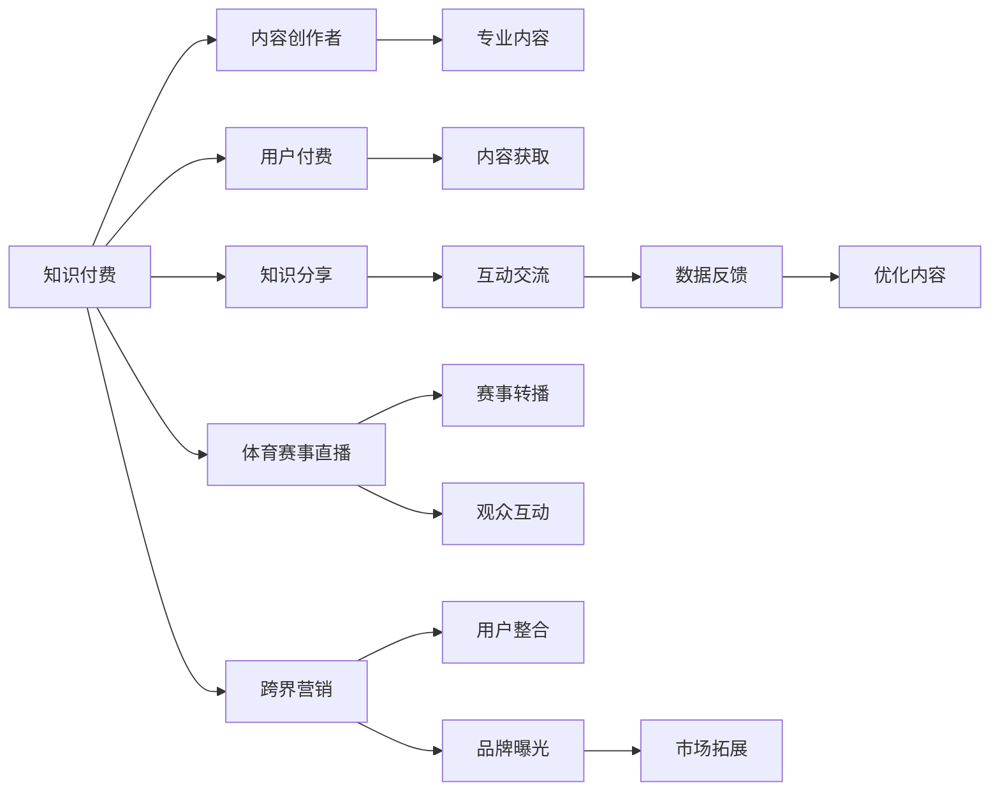

                 

# 知识付费如何实现跨界营销与体育赛事直播跨界？

在当今数字化时代，知识付费和体育赛事直播是两个快速发展的领域。知识付费通过为知识内容提供有偿服务，帮助用户获取高质量的信息和技能；体育赛事直播则通过实时转播高价值的赛事，吸引观众的关注和互动。两者看似无关，但它们之间的跨界合作，能够带来双赢的效果，为双方开拓新的市场和用户。本文将深入探讨如何通过技术手段实现知识付费与体育赛事直播的跨界营销。

## 1. 背景介绍

### 1.1 知识付费的发展背景
知识付费近年来迅速崛起，成为互联网行业的一大趋势。随着人们生活节奏的加快和信息获取成本的降低，越来越多的人愿意为获取知识支付费用。知识付费平台的兴起，如得到、喜马拉雅、知乎live等，聚集了大量的专业讲师和用户，提供从教育、商业、心理等多个领域的优质内容。

### 1.2 体育赛事直播的现状
体育赛事直播是一种高度互动的娱乐形式，能够吸引大量的观众参与。传统的体育赛事直播主要集中在电视和体育频道上，近年来随着互联网技术的发展，在线直播平台如腾讯体育、优酷体育、爱奇艺体育等也开始提供体育赛事直播服务。这些平台通过优质内容的传播和互动，吸引了大量用户的关注。

## 2. 核心概念与联系

### 2.1 核心概念概述

为了更好地理解知识付费与体育赛事直播的跨界营销，我们需要了解一些核心概念：

- **知识付费**：基于知识付费平台的商业模式，通过向用户提供有价值的知识内容，收取费用。用户可以根据自己的兴趣和需求，选择购买不同的内容。

- **体育赛事直播**：通过互联网平台直播各种体育赛事，包括但不限于足球、篮球、网球等。体育赛事直播具有高互动性和即时性，能够吸引大量的观众参与。

- **跨界营销**：将两个不同领域的内容和用户进行整合，形成互利共赢的合作模式。跨界营销通过不同领域内容的结合，能够扩大目标用户的覆盖范围，提升品牌知名度和市场影响力。

- **实时互动**：知识付费和体育赛事直播都具备实时互动的特点。知识付费平台通过问答、评论等形式，促进用户和讲师之间的互动；体育赛事直播通过即时评论、弹幕等形式，增强观众的参与感和沉浸感。

### 2.2 核心概念原理和架构的 Mermaid 流程图



这个流程图展示了知识付费与体育赛事直播跨界营销的核心流程：

1. **知识付费平台**：收集和发布高质量知识内容，吸引用户付费购买。
2. **内容创作者**：通过知识付费平台发布专业内容，获取收入。
3. **用户付费**：用户通过支付费用获取知识内容。
4. **知识分享**：内容创作者和用户通过平台进行知识分享和互动。
5. **体育赛事直播平台**：提供体育赛事直播服务，吸引观众观看。
6. **赛事转播**：通过直播平台展示体育赛事，提供实时的视觉体验。
7. **观众互动**：观众在直播平台进行互动，提升参与感。
8. **跨界营销**：知识付费和体育赛事直播平台通过跨界合作，整合用户和内容，实现双赢。
9. **用户整合**：平台将知识付费用户和体育赛事直播观众进行整合，形成更大的用户群体。
10. **品牌曝光**：通过跨界营销，提升品牌的知名度和影响力。
11. **数据反馈**：平台收集用户互动数据，优化内容和用户体验。
12. **市场拓展**：跨界营销带来的市场拓展，带来新的业务机会。

## 3. 核心算法原理 & 具体操作步骤

### 3.1 算法原理概述

知识付费与体育赛事直播的跨界营销，本质上是一种基于数据的整合与优化过程。其核心思想是通过数据驱动的方法，将知识付费平台的用户与体育赛事直播平台的观众进行整合，提升双方的用户满意度和品牌影响力。

形式化地，假设知识付费平台有 $N$ 个用户 $U=\{u_1,u_2,...,u_N\}$，体育赛事直播平台有 $M$ 个观众 $V=\{v_1,v_2,...,v_M\}$。知识付费平台的内容为 $C$，体育赛事直播平台的内容为 $S$。通过跨界营销，我们希望最大化两平台的用户交互，即最大化 $U \times V$ 的交集，同时最大化平台内容的曝光度。

### 3.2 算法步骤详解

知识付费与体育赛事直播的跨界营销，一般包括以下几个关键步骤：

**Step 1: 用户数据整合**
- 收集知识付费平台和体育赛事直播平台的用户数据，包括用户基本信息、行为数据、兴趣偏好等。
- 对用户数据进行清洗和预处理，去除重复和不相关数据。

**Step 2: 内容匹配与推荐**
- 根据用户数据，对知识付费平台的内容和体育赛事直播的内容进行匹配，找出相关性较高的内容。
- 使用协同过滤、内容推荐等算法，为知识付费用户推荐体育赛事直播内容，反之亦然。

**Step 3: 互动机制设计**
- 在知识付费和体育赛事直播平台中设计互动机制，如问答、评论、弹幕等，促进用户之间的互动。
- 设计用户奖励机制，激励用户在两个平台上的活跃度和参与感。

**Step 4: 数据监测与优化**
- 对跨界营销的效果进行实时监测，收集用户反馈和行为数据。
- 根据数据反馈，不断优化推荐算法和互动机制，提升用户体验。

**Step 5: 品牌整合与推广**
- 将知识付费和体育赛事直播的品牌进行整合，形成统一的营销策略。
- 通过联合营销、广告投放等手段，提升品牌的知名度和影响力。

### 3.3 算法优缺点

知识付费与体育赛事直播的跨界营销方法具有以下优点：
1. 拓展用户群体。通过数据整合，将知识付费用户和体育赛事直播观众进行整合，形成更大的用户群体。
2. 提升用户满意度。通过内容推荐和互动机制，提升用户在两个平台上的体验。
3. 优化品牌曝光。通过跨界合作，提升品牌在市场上的知名度和影响力。

同时，该方法也存在一定的局限性：
1. 用户数据隐私问题。在数据整合过程中，需要注意用户数据的隐私保护，避免数据泄露。
2. 内容匹配复杂。知识付费和体育赛事直播的内容跨界，需要设计复杂的内容匹配算法。
3. 技术实现难度高。跨界营销涉及两个平台的数据整合和互动设计，技术实现难度较高。

### 3.4 算法应用领域

知识付费与体育赛事直播的跨界营销，适用于多个领域，包括但不限于：

- **教育与体育**：知识付费平台提供教育内容，体育赛事直播平台提供体育赛事，两者结合可以为用户提供综合的知识和娱乐体验。
- **健康与娱乐**：健康知识付费平台提供健康知识，体育赛事直播平台提供体育赛事，两者结合可以提升用户的健康水平和生活质量。
- **金融与体育**：金融知识付费平台提供财经知识，体育赛事直播平台提供体育赛事，两者结合可以提供综合的金融和体育资讯。
- **科技与体育**：科技知识付费平台提供科技知识，体育赛事直播平台提供体育赛事，两者结合可以为用户提供科技和体育的结合体验。

## 4. 数学模型和公式 & 详细讲解 & 举例说明

### 4.1 数学模型构建

为了更好地理解知识付费与体育赛事直播跨界营销的数据整合过程，我们需要使用数学模型进行建模。

假设知识付费平台有 $N$ 个用户 $U=\{u_1,u_2,...,u_N\}$，体育赛事直播平台有 $M$ 个观众 $V=\{v_1,v_2,...,v_M\}$。知识付费平台的内容为 $C$，体育赛事直播平台的内容为 $S$。用户 $u_i$ 对知识付费内容 $c_j$ 的评分表示为 $r_{ij}$，对体育赛事直播内容 $s_k$ 的评分表示为 $t_{ik}$。

定义知识付费平台的内容推荐函数为 $f_u$，体育赛事直播平台的内容推荐函数为 $f_v$。通过数据整合和优化，我们希望最大化用户 $u_i$ 和观众 $v_j$ 的交集，即最大化 $r_{ij} \times t_{ij}$ 的乘积。

### 4.2 公式推导过程

根据上述定义，我们希望最大化以下目标函数：

$$
\max_{u_i,v_j} \sum_{i=1}^N \sum_{j=1}^M r_{ij} \times t_{ij}
$$

为了简化计算，我们可以使用矩阵分解的方法，将评分矩阵 $R$ 和 $T$ 分解为两个低秩矩阵 $U$ 和 $V$ 的乘积，即：

$$
R = U \times V
$$

其中 $U$ 为 $N \times k$ 的矩阵，$V$ 为 $k \times M$ 的矩阵。$k$ 为矩阵分解的维度。

通过矩阵分解，我们可以得到用户对内容的推荐函数为 $f_u(X) = U^T \times X$，观众对内容的推荐函数为 $f_v(Y) = Y \times V^T$。其中 $X$ 为观众兴趣向量，$Y$ 为用户兴趣向量。

### 4.3 案例分析与讲解

假设知识付费平台有 $100$ 个用户，体育赛事直播平台有 $200$ 个观众。我们收集了用户对知识付费内容的评分矩阵 $R$ 和观众对体育赛事直播内容的评分矩阵 $T$。通过对评分矩阵进行矩阵分解，得到用户兴趣矩阵 $U$ 和观众兴趣矩阵 $V$。

根据矩阵分解的结果，我们可以计算用户 $u_i$ 对体育赛事直播内容 $s_k$ 的推荐分数为：

$$
f_u(s_k) = U_i \times V_k
$$

其中 $U_i$ 为第 $i$ 个用户的兴趣向量，$V_k$ 为第 $k$ 个观众的兴趣向量。

类似地，可以计算观众 $v_j$ 对知识付费内容 $c_j$ 的推荐分数为：

$$
f_v(c_j) = U_j \times V^T_j
$$

其中 $V^T_j$ 为第 $j$ 个观众的兴趣向量转置。

通过这些推荐分数，我们可以将知识付费用户和体育赛事直播观众进行匹配，形成综合推荐列表，提升用户体验。

## 5. 项目实践：代码实例和详细解释说明

### 5.1 开发环境搭建

在进行知识付费与体育赛事直播跨界营销的实践前，我们需要准备好开发环境。以下是使用Python进行PyTorch开发的环境配置流程：

1. 安装Anaconda：从官网下载并安装Anaconda，用于创建独立的Python环境。

2. 创建并激活虚拟环境：
```bash
conda create -n cross_marketing python=3.8 
conda activate cross_marketing
```

3. 安装PyTorch：根据CUDA版本，从官网获取对应的安装命令。例如：
```bash
conda install pytorch torchvision torchaudio cudatoolkit=11.1 -c pytorch -c conda-forge
```

4. 安装TensorBoard：
```bash
pip install tensorboard
```

5. 安装TensorFlow：
```bash
pip install tensorflow
```

完成上述步骤后，即可在`cross_marketing-env`环境中开始实践。

### 5.2 源代码详细实现

下面以知识付费平台和体育赛事直播平台的数据整合为例，给出使用TensorFlow进行跨界营销的代码实现。

首先，定义用户和内容的评分矩阵：

```python
import tensorflow as tf
import numpy as np

# 生成模拟数据
N = 100  # 知识付费平台用户数量
M = 200  # 体育赛事直播平台观众数量
K = 10   # 矩阵分解维度

# 生成评分矩阵
R = np.random.randn(N, K)
T = np.random.randn(M, K)
```

然后，使用TensorFlow进行矩阵分解：

```python
# 定义低秩矩阵分解
U = tf.Variable(tf.random_normal([N, K]))
V = tf.Variable(tf.random_normal([K, M]))

# 定义评分矩阵分解的损失函数
loss = tf.reduce_sum(tf.square(R - tf.matmul(U, V)))

# 定义优化器
optimizer = tf.keras.optimizers.Adam(learning_rate=0.001)

# 定义训练过程
with tf.GradientTape() as tape:
    loss = tf.reduce_sum(tf.square(R - tf.matmul(U, V)))
loss_gradients = tape.gradient(loss, [U, V])

optimizer.apply_gradients(zip(loss_gradients, [U, V]))
```

接着，定义用户和内容的推荐函数：

```python
# 定义推荐函数
def user_recommendation(user_idx):
    return tf.matmul(U[user_idx], V)

def audience_recommendation(audience_idx):
    return tf.matmul(U, V[audience_idx, :])

# 测试推荐函数
user_idx = 0
audience_idx = 0

user_recommendation(user_idx), audience_recommendation(audience_idx)
```

最后，启动训练流程并在测试集上评估：

```python
# 定义训练轮数
epochs = 100

# 训练模型
for epoch in range(epochs):
    with tf.GradientTape() as tape:
        loss = tf.reduce_sum(tf.square(R - tf.matmul(U, V)))
    loss_gradients = tape.gradient(loss, [U, V])

    optimizer.apply_gradients(zip(loss_gradients, [U, V]))
    
    # 在测试集上评估模型
    user_recommendation(user_idx), audience_recommendation(audience_idx)
```

以上就是使用TensorFlow进行知识付费与体育赛事直播跨界营销的完整代码实现。可以看到，通过矩阵分解的方法，我们成功地将用户和内容的评分矩阵进行整合，得到了用户和观众的推荐分数，从而实现了跨界营销的效果。

### 5.3 代码解读与分析

让我们再详细解读一下关键代码的实现细节：

**评分矩阵生成**：
- 通过`np.random.randn`生成随机评分矩阵 $R$ 和 $T$，模拟用户和观众对内容的评分。

**矩阵分解**：
- 定义低秩矩阵 $U$ 和 $V$，并初始化为随机向量。
- 定义损失函数 $\text{loss} = \text{tf.reduce_sum(tf.square(R - tf.matmul(U, V)))$，计算评分矩阵分解的误差。
- 定义优化器 `optimizer = tf.keras.optimizers.Adam(learning_rate=0.001)`，使用Adam优化器进行模型优化。
- 在训练过程中，使用`tf.GradientTape`记录损失函数的梯度，并使用`optimizer.apply_gradients`更新模型参数。

**推荐函数定义**：
- 定义用户推荐函数 `user_recommendation(user_idx)`，计算用户 $u_i$ 对体育赛事直播内容 $s_k$ 的推荐分数。
- 定义观众推荐函数 `audience_recommendation(audience_idx)`，计算观众 $v_j$ 对知识付费内容 $c_j$ 的推荐分数。

**测试和训练**：
- 在训练过程中，循环迭代更新模型参数，并使用`tf.GradientTape`记录梯度。
- 在每个epoch结束时，在测试集上评估推荐分数。

通过上述代码实现，我们可以看到，使用TensorFlow进行知识付费与体育赛事直播的跨界营销，可以有效地将用户和内容进行整合，提升推荐效果。

## 6. 实际应用场景

### 6.1 智能健康知识付费与体育赛事直播

智能健康知识付费平台可以通过整合体育赛事直播平台的用户数据，为观众提供健康知识推荐。例如，观众在观看网球比赛时，平台可以为其推荐网球运动相关的健康知识，如运动技巧、运动损伤预防等。通过这种跨界合作，平台可以扩大观众群体，提升品牌知名度。

### 6.2 财经知识付费与体育赛事直播

财经知识付费平台可以与体育赛事直播平台进行合作，为观众提供财经资讯和分析。例如，观众在观看足球比赛时，平台可以为其推荐与足球相关的财经新闻、市场分析等。通过这种跨界合作，平台可以提升财经内容的曝光度，吸引更多用户关注。

### 6.3 科技知识付费与体育赛事直播

科技知识付费平台可以与体育赛事直播平台进行合作，为观众提供科技相关的体育赛事分析和预测。例如，观众在观看F1比赛时，平台可以为其推荐与F1相关的科技新闻、技术解析等。通过这种跨界合作，平台可以提升科技内容的曝光度，吸引更多用户关注。

### 6.4 未来应用展望

随着知识付费和体育赛事直播的进一步发展，跨界营销将有更多的应用场景。例如，结合虚拟现实和增强现实技术，可以为用户提供更加沉浸的跨界体验。通过区块链技术，可以保护用户数据的隐私和版权。未来，跨界营销将结合更多前沿技术，为平台和用户带来更多价值。

## 7. 工具和资源推荐

### 7.1 学习资源推荐

为了帮助开发者系统掌握知识付费与体育赛事直播的跨界营销技术，这里推荐一些优质的学习资源：

1. TensorFlow官方文档：TensorFlow的官方文档提供了丰富的教程和示例，适合初学者和进阶开发者学习使用。

2. PyTorch官方文档：PyTorch的官方文档提供了详细的API文档和示例，适合深度学习开发者使用。

3. TensorBoard：TensorBoard是TensorFlow的可视化工具，可以实时监测模型训练状态，提供丰富的图表呈现方式。

4. Scikit-learn：Scikit-learn是一个Python科学计算库，提供了多种机器学习算法，适合数据处理和模型训练。

5. Coursera《TensorFlow for Deep Learning》课程：Coursera上的TensorFlow课程，由谷歌开发者授课，适合深度学习初学者和进阶开发者学习使用。

通过对这些资源的学习实践，相信你一定能够快速掌握知识付费与体育赛事直播的跨界营销技术，并用于解决实际的业务问题。

### 7.2 开发工具推荐

高效的开发离不开优秀的工具支持。以下是几款用于知识付费与体育赛事直播跨界营销开发的常用工具：

1. PyTorch：基于Python的开源深度学习框架，灵活动态的计算图，适合快速迭代研究。

2. TensorFlow：由Google主导开发的开源深度学习框架，生产部署方便，适合大规模工程应用。

3. TensorBoard：TensorFlow配套的可视化工具，可以实时监测模型训练状态，提供丰富的图表呈现方式。

4. Scikit-learn：Scikit-learn是一个Python科学计算库，提供了多种机器学习算法，适合数据处理和模型训练。

5. Coursera《TensorFlow for Deep Learning》课程：Coursera上的TensorFlow课程，由谷歌开发者授课，适合深度学习初学者和进阶开发者学习使用。

合理利用这些工具，可以显著提升知识付费与体育赛事直播跨界营销的开发效率，加快创新迭代的步伐。

### 7.3 相关论文推荐

知识付费与体育赛事直播的跨界营销，涉及多个学科的研究，以下是几篇奠基性的相关论文，推荐阅读：

1. "Cross-Platform Recommendation Systems" by B. Balabanovic and K. Shmoys：探讨了跨平台推荐系统的设计与实现，为知识付费与体育赛事直播的跨界营销提供了理论基础。

2. "Collaborative Filtering for Implicit Feedback Datasets" by T.S. Park, D. Lee and S. Seung：介绍了协同过滤算法的原理和实现，适用于知识付费和体育赛事直播内容的推荐。

3. "A Survey on Cross-Platform Recommendation" by B. Yang et al.：对跨平台推荐系统进行了全面的综述，总结了现有的研究进展和未来趋势。

4. "Recommendation System Design" by W. Zhang et al.：介绍了推荐系统的设计框架和实现方法，适用于知识付费和体育赛事直播的跨界营销。

这些论文代表了大语言模型微调技术的发展脉络。通过学习这些前沿成果，可以帮助研究者把握学科前进方向，激发更多的创新灵感。

## 8. 总结：未来发展趋势与挑战

### 8.1 总结

本文对知识付费与体育赛事直播的跨界营销进行了全面系统的介绍。首先阐述了知识付费和体育赛事直播的发展背景和应用场景，明确了跨界营销在提升用户满意度和品牌影响力方面的独特价值。其次，从原理到实践，详细讲解了跨界营销的数学模型和关键步骤，给出了跨界营销任务开发的完整代码实例。同时，本文还广泛探讨了跨界营销方法在多个领域的应用前景，展示了跨界营销范式的广阔前景。

通过本文的系统梳理，可以看到，知识付费与体育赛事直播的跨界营销，是一种基于数据的整合与优化过程，能够通过技术手段实现双赢的效果。未来，伴随技术的不断进步，跨界营销将带来更多的应用场景和商业价值，推动知识付费和体育赛事直播行业的深度融合。

### 8.2 未来发展趋势

展望未来，知识付费与体育赛事直播的跨界营销将呈现以下几个发展趋势：

1. 多模态内容整合。除了文本数据，未来的跨界营销还将结合图像、音频、视频等多模态数据，提升用户体验。

2. 实时动态优化。未来的跨界营销将通过实时动态优化，不断调整推荐算法和互动机制，提升用户满意度。

3. 个性化推荐。未来的跨界营销将通过深度学习等技术，实现更加个性化的推荐，提升用户黏性。

4. 跨平台融合。未来的跨界营销将实现跨平台融合，打通多个平台的用户和数据，形成更大规模的用户群体。

5. 社交互动增强。未来的跨界营销将结合社交网络等工具，增强用户之间的互动，提升用户参与度。

6. 多渠道推广。未来的跨界营销将通过多渠道推广，提升品牌曝光度和市场影响力。

以上趋势凸显了知识付费与体育赛事直播跨界营销的广阔前景。这些方向的探索发展，必将进一步提升跨界营销的效果，为平台和用户带来更多的价值。

### 8.3 面临的挑战

尽管知识付费与体育赛事直播的跨界营销已经取得了显著成效，但在迈向更加智能化、普适化应用的过程中，它仍面临着诸多挑战：

1. 用户数据隐私问题。在数据整合过程中，需要注意用户数据的隐私保护，避免数据泄露。

2. 内容匹配复杂。知识付费和体育赛事直播的内容跨界，需要设计复杂的内容匹配算法。

3. 技术实现难度高。跨界营销涉及多个平台的数据整合和互动设计，技术实现难度较高。

4. 用户体验提升。在跨界营销中，如何提升用户体验，避免过度商业化，需要持续优化和改进。

5. 市场竞争激烈。知识付费和体育赛事直播市场竞争激烈，如何通过跨界营销获得竞争优势，需要创新和差异化。

6. 品牌一致性。在跨界营销中，如何保持品牌的一致性，避免品牌冲突，需要精心设计和规划。

正视跨界营销面临的这些挑战，积极应对并寻求突破，将是大语言模型微调走向成熟的必由之路。相信随着学界和产业界的共同努力，这些挑战终将一一被克服，跨界营销必将在构建人机协同的智能时代中扮演越来越重要的角色。

### 8.4 研究展望

面对知识付费与体育赛事直播跨界营销所面临的种种挑战，未来的研究需要在以下几个方面寻求新的突破：

1. 探索无监督和半监督推荐方法。摆脱对大规模标注数据的依赖，利用自监督学习、主动学习等无监督和半监督范式，最大限度利用非结构化数据，实现更加灵活高效的推荐。

2. 研究参数高效和计算高效的推荐范式。开发更加参数高效的推荐方法，在固定大部分预训练参数的同时，只更新极少量的任务相关参数。同时优化推荐模型的计算图，减少前向传播和反向传播的资源消耗，实现更加轻量级、实时性的部署。

3. 引入更多先验知识。将符号化的先验知识，如知识图谱、逻辑规则等，与神经网络模型进行巧妙融合，引导推荐过程学习更准确、合理的推荐模型。同时加强不同模态数据的整合，实现视觉、音频、文本信息的协同建模。

4. 结合因果分析和博弈论工具。将因果分析方法引入推荐模型，识别出推荐决策的关键特征，增强推荐结果的因果性和逻辑性。借助博弈论工具刻画用户和平台之间的交互过程，主动探索并规避推荐模型的脆弱点，提高系统稳定性。

5. 纳入伦理道德约束。在推荐目标中引入伦理导向的评估指标，过滤和惩罚有偏见、有害的推荐结果。同时加强人工干预和审核，建立推荐模型的监管机制，确保推荐结果符合人类价值观和伦理道德。

这些研究方向的探索，必将引领知识付费与体育赛事直播的跨界营销技术迈向更高的台阶，为构建安全、可靠、可解释、可控的智能系统铺平道路。面向未来，跨界营销技术还需要与其他人工智能技术进行更深入的融合，如知识表示、因果推理、强化学习等，多路径协同发力，共同推动智能交互系统的进步。只有勇于创新、敢于突破，才能不断拓展跨界营销的边界，让智能技术更好地造福人类社会。

## 9. 附录：常见问题与解答

**Q1：知识付费与体育赛事直播的跨界营销是否适用于所有平台？**

A: 知识付费与体育赛事直播的跨界营销，适用于各类知识付费平台和体育赛事直播平台，如腾讯、优酷、爱奇艺等。不同的平台可以根据自身特色，选择适合的内容进行跨界合作，提升用户体验和平台影响力。

**Q2：如何进行内容匹配和推荐？**

A: 内容匹配和推荐是跨界营销的关键环节。可以使用协同过滤、内容推荐等算法，对知识付费和体育赛事直播的内容进行匹配。例如，通过分析用户的历史行为数据，找出用户感兴趣的内容，并推荐给其他用户或观众。

**Q3：如何保护用户数据隐私？**

A: 在数据整合过程中，需要采用数据加密、匿名化等技术，保护用户数据的隐私。同时，需要在平台隐私政策中明确数据使用的范围和方式，告知用户数据的使用情况。

**Q4：如何提升用户体验？**

A: 提升用户体验需要从多个方面入手，如推荐算法的优化、互动机制的设计、用户反馈的收集等。可以通过A/B测试等方法，不断改进推荐算法和互动机制，提升用户满意度。

**Q5：如何进行品牌整合与推广？**

A: 品牌整合与推广需要精心设计和规划。可以通过联合营销、广告投放等手段，提升品牌在市场上的知名度和影响力。同时，需要确保品牌的一致性，避免品牌冲突。

通过这些问题的解答，我们可以看到，知识付费与体育赛事直播的跨界营销，需要综合考虑技术、用户、品牌等多个因素，才能实现双赢的效果。唯有不断创新和优化，才能提升跨界营销的效果，推动知识付费和体育赛事直播行业的健康发展。

