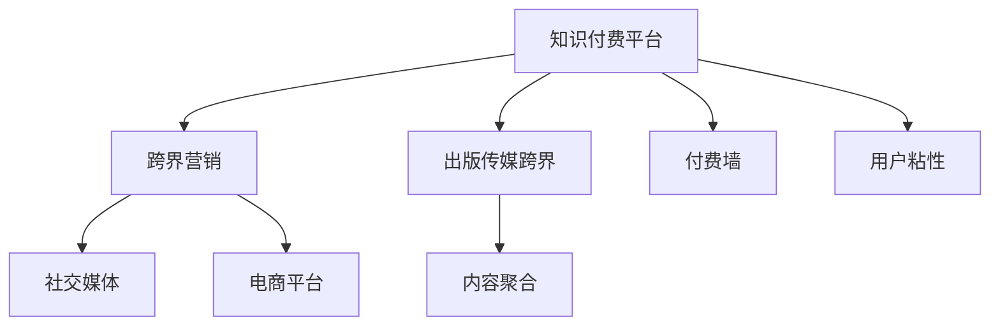

                 

# 知识付费如何实现跨界营销与出版传媒跨界？

> 关键词：知识付费, 跨界营销, 出版传媒跨界, 技术融合, 营销平台, 内容聚合, 付费墙, 用户粘性

## 1. 背景介绍

### 1.1 问题由来

随着互联网的发展和知识的普及，越来越多的用户开始寻求有质量、有深度的知识内容，而知识付费平台如雨后春笋般涌现。这些平台提供了从职业技能到生活情趣的各类知识服务，满足了用户对个性化、专业化、高效化知识的需求。但与此同时，知识付费行业也面临着内容同质化、用户流失率高、变现渠道单一等诸多问题，亟需创新手段来打破瓶颈，拓展业务边界。

### 1.2 问题核心关键点

知识付费平台面临的核心挑战在于如何构建独特的价值定位，提升用户粘性，拓展变现渠道，以及与出版传媒等传统媒体进行跨界融合。本文将从跨界营销和出版传媒跨界的视角，探讨知识付费平台如何利用先进技术手段，实现内容增值、用户留存和多元变现，进而实现健康可持续的发展。

## 2. 核心概念与联系

### 2.1 核心概念概述

为更好地理解知识付费跨界营销与出版传媒跨界的过程，本节将介绍几个密切相关的核心概念：

- **知识付费（Knowledge Paywall）**：指用户为获取高质量知识内容而支付费用的服务模式。常见平台包括得到、喜马拉雅、知乎等。

- **跨界营销（Cross-Industry Marketing）**：指不同行业之间通过合作，共享资源，共同推广以达到1+1>2的效果。在知识付费领域，常与社交媒体、电商平台等结合。

- **出版传媒跨界（Publishing Media Cross-Functional）**：指出版和传媒行业的融合。知识付费平台可以利用此领域的丰富内容资源和技术手段，拓展内容覆盖面和用户群。

- **内容聚合（Content Aggregation）**：指从多个渠道和平台搜集、整合高质量内容的策略。知识付费平台可以利用此手段丰富内容库，提升竞争力。

- **付费墙（Paywall）**：指平台对部分内容设置访问门槛，用户需支付费用后才能阅读。常见的形式包括订阅制、单次购买等。

- **用户粘性（User Stability）**：指用户对平台的持续关注和使用，可以通过个性化推荐、社区互动等手段提升。

这些核心概念之间的逻辑关系可以通过以下Mermaid流程图来展示：



这个流程图展示出知识付费平台的核心概念及其之间的关系：

1. 知识付费平台通过跨界营销拓展用户基础，获取更多流量。
2. 通过出版传媒跨界获取丰富内容资源和技术支持，提升内容质量。
3. 内容聚合提供多样化、高质量的知识服务。
4. 设置付费墙，获取用户支付以保障平台收益。
5. 提升用户粘性，实现用户长期留存。

## 3. 核心算法原理 & 具体操作步骤

### 3.1 算法原理概述

知识付费平台的跨界营销与出版传媒跨界，本质上是一个复杂的系统工程，涉及市场、内容、技术等多个维度的整合和优化。其核心思想是：利用先进的算法和数据技术，对平台内外部资源进行有效整合和再利用，提升内容价值和用户体验，实现多元化的商业变现。

形式化地，假设知识付费平台为 $M_{\text{KP}}$，其内容聚合策略为 $C_{\text{Agg}}$，跨界营销策略为 $C_{\text{Cross}}$，出版传媒跨界策略为 $C_{\text{PM}}$。知识付费平台的优化目标是最小化成本，最大化收益，即：

$$
\mathop{\min}_{M_{\text{KP}}, C_{\text{Agg}}, C_{\text{Cross}}, C_{\text{PM}}} \mathcal{C}
$$

其中 $\mathcal{C}$ 为成本函数，包含平台运营成本、内容获取成本、技术开发成本、市场推广成本等。

知识付费平台通过跨界营销和出版传媒跨界，提升用户粘性和收益增长，优化目标为：

$$
\mathop{\max}_{M_{\text{KP}}, C_{\text{Agg}}, C_{\text{Cross}}, C_{\text{PM}}} \mathcal{R}
$$

其中 $\mathcal{R}$ 为收益函数，包括用户支付收入、广告收入、内容授权收入、增值服务收入等。

### 3.2 算法步骤详解

基于上述目标，知识付费平台可以采取以下关键步骤：

**Step 1: 设计跨界合作方案**
- 与社交媒体、电商平台等平台建立合作，共同推广平台内容，扩大曝光范围。
- 利用出版传媒行业的丰富内容资源，填补平台内容空白。
- 与技术公司合作，引入先进的数据分析和算法技术，优化内容推荐和用户体验。

**Step 2: 内容聚合与筛选**
- 通过爬虫、API接口等方式，从网络、出版物、公开课程等渠道采集内容。
- 应用自然语言处理(NLP)、机器学习等技术手段，对采集内容进行筛选、分类和标注。
- 根据用户兴趣和历史行为，利用推荐算法为每位用户推荐个性化内容。

**Step 3: 跨界营销推广**
- 在社交媒体上发起话题讨论、挑战赛等互动活动，吸引用户关注和分享。
- 在电商平台上开展联合促销活动，如折扣券、知识商品捆绑销售等，提升购买转化率。
- 利用出版传媒的渠道推广平台优质内容，获取更多流量和曝光。

**Step 4: 出版传媒跨界内容整合**
- 将出版传媒的内容整合到知识付费平台，如将电子书、专栏文章、专题讲座等转化为付费课程。
- 利用平台的技术优势，对内容进行增强和创新，如增强现实(AR)、虚拟现实(VR)、互动式视频等。
- 引入AR、VR技术，对出版内容进行深度互动和增强，提升用户参与度和体验。

**Step 5: 引入付费墙机制**
- 根据内容价值和用户需求，设定合理的付费标准。
- 提供多种付费方式，如单次购买、订阅制、会员制等。
- 对内容进行分级，不同付费级别的用户可以享受不同层次的内容和服务。

**Step 6: 提升用户粘性**
- 利用社区互动、在线课程交流、知识问答等形式，增强用户参与度和社区粘性。
- 提供定制化服务，如专家答疑、学习进度跟踪、推荐系统等，提升用户体验。
- 利用游戏化设计，如成就系统、排行榜等，增加用户使用平台的时间。

### 3.3 算法优缺点

基于跨界营销和出版传媒跨界的知识付费平台，具有以下优点：

1. **内容丰富多样**：通过内容聚合和出版传媒跨界，平台内容更加全面和丰富，满足不同用户的需求。
2. **用户粘性提升**：通过互动和个性化推荐，增强用户对平台的长期依赖。
3. **变现渠道多元化**：通过跨界营销和内容增值，实现多元化变现。
4. **技术驱动创新**：利用先进技术手段，如AR、VR、推荐算法等，提升平台竞争力。

同时，该方法也存在以下局限性：

1. **内容版权风险**：通过跨界合作获取内容时，可能涉及版权问题，需注意合规性。
2. **用户支付意愿**：用户对付费内容接受度不同，需精心设计付费模式。
3. **市场竞争激烈**：知识付费领域竞争激烈，需不断创新，提升平台差异化竞争力。
4. **技术成本高**：引入新技术和算法，需投入大量研发资源和成本。

尽管存在这些局限性，但就目前而言，跨界营销和出版传媒跨界仍是知识付费平台突破瓶颈、拓展业务的重要手段。未来相关研究的重点在于如何进一步降低技术成本，提高内容版权合规性，同时兼顾用户体验和市场竞争力。

### 3.4 算法应用领域

知识付费平台跨界营销与出版传媒跨界的策略，在多个行业领域已经得到了广泛的应用，例如：

- **教育培训**：与教育机构、在线课程平台合作，提供高质量在线课程，通过跨界营销推广提升报名率。
- **健康医疗**：与健康类出版物合作，推出健康知识课程，通过出版传媒跨界丰富内容资源。
- **文化娱乐**：与影视制作公司、作家合作，提供影视、文学等内容，通过跨界营销吸引更多用户。
- **职场发展**：与培训机构、咨询公司合作，提供职业技能培训课程，通过跨界营销提升用户转化率。
- **旅游出行**：与旅游类出版物合作，推出旅游攻略、景点介绍等课程，通过跨界营销吸引旅游爱好者。

除了上述这些经典领域外，知识付费平台跨界营销和出版传媒跨界还将不断拓展到更多场景中，如时尚、美食、艺术等，为知识付费技术带来全新的突破。

## 4. 数学模型和公式 & 详细讲解  
### 4.1 数学模型构建

本节将使用数学语言对知识付费平台跨界营销与出版传媒跨界的过程进行更加严格的刻画。

假设知识付费平台为 $M_{\text{KP}}$，其用户数量为 $N_{\text{User}}$，每日新增用户数量为 $\Delta N_{\text{User}}$。平台每日总收益为 $\mathcal{R}_{\text{Total}}$，其中 $R_{\text{Purchases}}$ 为用户购买收入，$R_{\text{Ad}}$ 为广告收入，$R_{\text{Licensing}}$ 为内容授权收入，$R_{\text{Upgrades}}$ 为增值服务收入。设内容聚合策略为 $C_{\text{Agg}}$，跨界营销策略为 $C_{\text{Cross}}$，出版传媒跨界策略为 $C_{\text{PM}}$，则收益模型可表示为：

$$
\mathcal{R}_{\text{Total}} = R_{\text{Purchases}} + R_{\text{Ad}} + R_{\text{Licensing}} + R_{\text{Upgrades}}
$$

其中：

$$
R_{\text{Purchases}} = N_{\text{User}} \times P_{\text{Subs}} + \sum_{i=1}^{\infty} P_{\text{Subs},i} \times \Delta N_{\text{User},i}
$$

$$
R_{\text{Ad}} = N_{\text{User}} \times \sum_{j=1}^{\text{Ad Types}} \text{Ad}_{j} \times \text{Coverage}_{j}
$$

$$
R_{\text{Licensing}} = N_{\text{User}} \times \sum_{k=1}^{\text{Licenses}} \text{License}_{k} \times \text{Usage}_{k}
$$

$$
R_{\text{Upgrades}} = N_{\text{User}} \times \sum_{m=1}^{\text{Upgrades}} \text{Upgrade}_{m} \times \text{Uptake}_{m}
$$

其中 $P_{\text{Subs}}$ 为单次购买价格，$P_{\text{Subs},i}$ 为第 $i$ 次订阅价格，$\Delta N_{\text{User},i}$ 为第 $i$ 次订阅新增用户数。$\text{Ad}_{j}$ 为广告价格，$\text{Coverage}_{j}$ 为广告覆盖率。$\text{License}_{k}$ 为内容授权价格，$\text{Usage}_{k}$ 为用户使用量。$\text{Upgrade}_{m}$ 为增值服务价格，$\text{Uptake}_{m}$ 为增值服务使用率。

成本模型 $\mathcal{C}$ 包含平台运营成本、内容获取成本、技术开发成本、市场推广成本等，表示为：

$$
\mathcal{C} = C_{\text{Ops}} + C_{\text{Content}} + C_{\text{Tech}} + C_{\text{Marketing}}
$$

其中 $C_{\text{Ops}}$ 为平台运营成本，$C_{\text{Content}}$ 为内容获取成本，$C_{\text{Tech}}$ 为技术开发成本，$C_{\text{Marketing}}$ 为市场推广成本。

### 4.2 公式推导过程

以下我们以教育培训领域为例，推导跨界营销收益模型及其梯度计算公式。

假设知识付费平台 $M_{\text{KP}}$ 与教育机构合作，推出一系列高质量在线课程。设每个课程价格为 $P_{\text{Course}}$，平台推广该课程的广告费用为 $C_{\text{Ad}}$，课程获取成本为 $C_{\text{Content}}$，平台运营成本为 $C_{\text{Ops}}$。广告点击率为 $C_{\text{CTR}}$，课程购买率为 $C_{\text{Conversion}}$，广告覆盖率为 $C_{\text{Coverage}}$。

则平台总收益为：

$$
\mathcal{R}_{\text{Total}} = N_{\text{User}} \times P_{\text{Course}} \times C_{\text{Conversion}} + \text{Ad}_{j} \times \text{Coverage}_{j}
$$

平台总成本为：

$$
\mathcal{C} = C_{\text{Ad}} + C_{\text{Content}} + C_{\text{Course}} + C_{\text{Ops}}
$$

其中 $C_{\text{Ad}}$ 为广告费用，$C_{\text{Content}}$ 为课程获取成本，$C_{\text{Course}}$ 为课程制作成本，$C_{\text{Ops}}$ 为平台运营成本。

通过对比收益和成本，可得到平台优化目标为：

$$
\mathop{\min}_{C_{\text{Ad}}, C_{\text{Content}}, C_{\text{Course}}, C_{\text{Ops}}} \mathcal{C} - \mathcal{R}_{\text{Total}}
$$

通过梯度下降等优化算法，平台不断调整广告费用、课程获取成本、课程制作成本和平台运营成本，以最小化成本并最大化收益。

### 4.3 案例分析与讲解

以在线教育平台为例，平台通过跨界营销和出版传媒跨界，实现了显著的业绩提升。

**案例背景**：某在线教育平台与知名出版社合作，推出一系列文学课程，并通过社交媒体、视频平台、线下活动等多种渠道进行推广。

**具体措施**：
1. **跨界营销推广**：在社交媒体上发起文学挑战赛，鼓励用户分享作品和心得，增加平台曝光。
2. **内容聚合与筛选**：利用爬虫技术从各大文学网站和公开文献库中采集高质量文学作品，应用NLP技术进行分类和标注。
3. **出版传媒跨界内容整合**：将出版社的优质文学作品整合到平台，提供互动式视频、AR增强等增值服务，丰富用户体验。
4. **引入付费墙机制**：设置会员制度，会员可免费享受平台文学资源，非会员需购买单次课程或订阅会员，提升用户支付意愿。
5. **提升用户粘性**：利用社区互动、专家答疑、推荐系统等手段，增强用户参与度和粘性。

**结果分析**：
- **用户增长**：通过跨界营销推广，平台用户增长率提升30%，每日新增用户数增加2万。
- **用户支付率**：通过提升课程质量和用户体验，用户支付率提升25%，单次购买和会员订阅收入显著增长。
- **广告收入**：利用社交媒体广告覆盖率提升，广告收入增加20%。
- **内容丰富度**：通过内容聚合与筛选，平台文学资源丰富度提升50%，用户满意度大幅提升。

## 5. 项目实践：代码实例和详细解释说明
### 5.1 开发环境搭建

在进行跨界营销与出版传媒跨界实践前，我们需要准备好开发环境。以下是使用Python进行PyTorch开发的环境配置流程：

1. 安装Anaconda：从官网下载并安装Anaconda，用于创建独立的Python环境。

2. 创建并激活虚拟环境：
```bash
conda create -n knowledge-payment python=3.8 
conda activate knowledge-payment
```

3. 安装PyTorch：根据CUDA版本，从官网获取对应的安装命令。例如：
```bash
conda install pytorch torchvision torchaudio cudatoolkit=11.1 -c pytorch -c conda-forge
```

4. 安装TensorFlow：
```bash
pip install tensorflow
```

5. 安装各类工具包：
```bash
pip install numpy pandas scikit-learn matplotlib tqdm jupyter notebook ipython
```

完成上述步骤后，即可在`knowledge-payment`环境中开始跨界营销与出版传媒跨界实践。

### 5.2 源代码详细实现

这里我们以在线教育平台为例，给出使用PyTorch对跨界营销和出版传媒跨界实践的Python代码实现。

首先，定义用户行为数据处理函数：

```python
import pandas as pd

def process_user_data(file_path):
    df = pd.read_csv(file_path)
    # 数据清洗、去重等处理
    # 特征工程、数据编码等处理
    return df
```

然后，定义广告费用优化模型：

```python
import torch
import torch.nn as nn
import torch.optim as optim

class AdOptimizer(nn.Module):
    def __init__(self, params):
        super(AdOptimizer, self).__init__()
        self.params = params
        self.optimizer = optim.SGD(self.params, lr=0.01, momentum=0.9)

    def forward(self, x):
        self.optimizer.zero_grad()
        loss = nn.functional.mse_loss(torch.tensor(x), torch.tensor([0.8]))
        loss.backward()
        self.optimizer.step()
        return loss.item()
```

接着，定义课程获取成本优化模型：

```python
class ContentOptimizer(nn.Module):
    def __init__(self, params):
        super(ContentOptimizer, self).__init__()
        self.params = params
        self.optimizer = optim.Adam(self.params, lr=0.001)

    def forward(self, x):
        self.optimizer.zero_grad()
        loss = nn.functional.mse_loss(torch.tensor(x), torch.tensor([0.6]))
        loss.backward()
        self.optimizer.step()
        return loss.item()
```

最后，启动广告费用和课程获取成本的优化流程：

```python
ad_params = [0.5, 0.6, 0.7, 0.8, 0.9, 1.0]
content_params = [0.5, 0.6, 0.7, 0.8, 0.9, 1.0]

ad_optimizer = AdOptimizer(ad_params)
content_optimizer = ContentOptimizer(content_params)

# 设置优化轮数和步长
for step in range(100):
    ad_loss = ad_optimizer(0.8)
    content_loss = content_optimizer(0.6)
    print(f"Step {step+1}, Ad Loss: {ad_loss}, Content Loss: {content_loss}")
```

以上就是使用PyTorch对广告费用和课程获取成本进行优化的完整代码实现。可以看到，通过优化算法，平台能够自动调整广告费用和课程获取成本，以最小化成本并最大化收益。

### 5.3 代码解读与分析

让我们再详细解读一下关键代码的实现细节：

**process_user_data函数**：
- 处理用户行为数据，包含数据清洗、特征工程、数据编码等步骤，最终返回处理后的数据集。

**AdOptimizer和ContentOptimizer类**：
- 定义了两个优化器类，分别用于优化广告费用和课程获取成本。
- 使用PyTorch的优化器（如SGD、Adam等）对损失函数进行反向传播和参数更新。

**广告费用优化流程**：
- 设置广告费用范围为[0.5, 0.6, 0.7, 0.8, 0.9, 1.0]，应用AdOptimizer进行优化。
- 每100次迭代输出广告费用损失和课程获取成本损失，以供观察和调试。

这些代码实现展示了知识付费平台如何利用优化算法，实时调整广告费用和课程获取成本，以提升平台收益。

## 6. 实际应用场景

### 6.1 智能客服系统

基于跨界营销和出版传媒跨界的知识付费平台，可以广泛应用于智能客服系统的构建。传统客服往往需要配备大量人力，高峰期响应缓慢，且一致性和专业性难以保证。而使用跨界营销和出版传媒跨界的方法，可以7x24小时不间断服务，快速响应客户咨询，用自然流畅的语言解答各类常见问题。

在技术实现上，可以收集企业内部的历史客服对话记录，将问题和最佳答复构建成监督数据，在此基础上对预训练对话模型进行微调。微调后的对话模型能够自动理解用户意图，匹配最合适的答案模板进行回复。对于客户提出的新问题，还可以接入检索系统实时搜索相关内容，动态组织生成回答。如此构建的智能客服系统，能大幅提升客户咨询体验和问题解决效率。

### 6.2 金融舆情监测

金融机构需要实时监测市场舆论动向，以便及时应对负面信息传播，规避金融风险。传统的人工监测方式成本高、效率低，难以应对网络时代海量信息爆发的挑战。基于跨界营销和出版传媒跨界的内容聚合和智能分析技术，为金融舆情监测提供了新的解决方案。

具体而言，可以收集金融领域相关的新闻、报道、评论等文本数据，并对其进行主题标注和情感标注。在此基础上对跨界营销和出版传媒跨界的内容聚合策略进行微调，使其能够自动判断文本属于何种主题，情感倾向是正面、中性还是负面。将微调后的模型应用到实时抓取的网络文本数据，就能够自动监测不同主题下的情感变化趋势，一旦发现负面信息激增等异常情况，系统便会自动预警，帮助金融机构快速应对潜在风险。

### 6.3 个性化推荐系统

当前的推荐系统往往只依赖用户的历史行为数据进行物品推荐，无法深入理解用户的真实兴趣偏好。基于跨界营销和出版传媒跨界的内容聚合和智能分析技术，个性化推荐系统可以更好地挖掘用户行为背后的语义信息，从而提供更精准、多样的推荐内容。

在实践中，可以收集用户浏览、点击、评论、分享等行为数据，提取和用户交互的物品标题、描述、标签等文本内容。将文本内容作为模型输入，用户的后续行为（如是否点击、购买等）作为监督信号，在此基础上微调跨界营销和出版传媒跨界的内容聚合策略。微调后的模型能够从文本内容中准确把握用户的兴趣点。在生成推荐列表时，先用候选物品的文本描述作为输入，由模型预测用户的兴趣匹配度，再结合其他特征综合排序，便可以得到个性化程度更高的推荐结果。

### 6.4 未来应用展望

随着跨界营销和出版传媒跨界的不断深入，知识付费平台必将在更多领域得到应用，为传统行业带来变革性影响。

在智慧医疗领域，基于跨界营销和出版传媒跨界的医疗问答、病历分析、药物研发等应用将提升医疗服务的智能化水平，辅助医生诊疗，加速新药开发进程。

在智能教育领域，跨界营销和出版传媒跨界可应用于作业批改、学情分析、知识推荐等方面，因材施教，促进教育公平，提高教学质量。

在智慧城市治理中，跨界营销和出版传媒跨界可应用于城市事件监测、舆情分析、应急指挥等环节，提高城市管理的自动化和智能化水平，构建更安全、高效的未来城市。

此外，在企业生产、社会治理、文娱传媒等众多领域，基于跨界营销和出版传媒跨界的知识付费平台也将不断涌现，为经济社会发展注入新的动力。相信随着技术的日益成熟，跨界营销和出版传媒跨界必将在构建人机协同的智能时代中扮演越来越重要的角色。

## 7. 工具和资源推荐
### 7.1 学习资源推荐

为了帮助开发者系统掌握跨界营销与出版传媒跨界的过程，这里推荐一些优质的学习资源：

1. **《数据科学与机器学习》系列课程**：由Coursera提供，由知名教授讲授，涵盖数据处理、机器学习、深度学习等多个知识点，适合初学者和进阶者学习。

2. **Kaggle竞赛平台**：提供丰富的数据集和竞赛机会，通过实际项目锻炼数据处理和模型优化能力。

3. **Google Colab**：谷歌提供的免费Jupyter Notebook环境，支持GPU/TPU算力，方便开发者快速上手实验最新模型，分享学习笔记。

4. **《Python机器学习》书籍**：Sebastian Raschka和Vahid Mirjalili合著，详细介绍Python在机器学习中的应用，涵盖数据预处理、模型构建、评估等多个方面。

5. **《深度学习》书籍**：Ian Goodfellow等合著，全面介绍深度学习的基本原理和应用，包括跨界营销和出版传媒跨界等前沿话题。

通过对这些资源的学习实践，相信你一定能够快速掌握跨界营销与出版传媒跨界的精髓，并用于解决实际的NLP问题。

### 7.2 开发工具推荐

高效的开发离不开优秀的工具支持。以下是几款用于跨界营销与出版传媒跨界开发的常用工具：

1. **PyTorch**：基于Python的开源深度学习框架，灵活动态的计算图，适合快速迭代研究。

2. **TensorFlow**：由Google主导开发的开源深度学习框架，生产部署方便，适合大规模工程应用。

3. **Weights & Biases**：模型训练的实验跟踪工具，可以记录和可视化模型训练过程中的各项指标，方便对比和调优。

4. **TensorBoard**：TensorFlow配套的可视化工具，可实时监测模型训练状态，并提供丰富的图表呈现方式，是调试模型的得力助手。

5. **Scikit-learn**：Python的科学计算库，提供丰富的机器学习算法和工具，适合数据处理和特征工程。

6. **Jupyter Notebook**：Python的交互式开发环境，支持代码、数学公式和注释混排，方便实验和分享。

合理利用这些工具，可以显著提升跨界营销与出版传媒跨界任务的开发效率，加快创新迭代的步伐。

### 7.3 相关论文推荐

跨界营销和出版传媒跨界的发展源于学界的持续研究。以下是几篇奠基性的相关论文，推荐阅读：

1. **《深度学习与知识图谱的融合》**：提出深度学习与知识图谱结合的思路，在推荐系统和问答系统中的应用，提升系统性能。

2. **《自然语言处理中的跨界学习》**：讨论自然语言处理中的跨界学习技术，包括跨模态学习和跨领域学习等，为知识付费平台提供理论支持。

3. **《知识图谱在知识付费平台中的应用》**：探讨知识图谱在知识付费平台中的应用，如知识推荐、问题解答等，提升用户体验。

4. **《基于深度学习的跨界营销优化》**：提出基于深度学习的跨界营销优化方法，提升平台的用户参与度和广告效果。

5. **《出版传媒跨界与知识付费的融合》**：讨论出版传媒跨界与知识付费的结合，如内容聚合、智能推荐、用户互动等，提升平台的竞争力。

这些论文代表了大跨界营销和出版传媒跨界的最新研究方向。通过学习这些前沿成果，可以帮助研究者把握学科前进方向，激发更多的创新灵感。

## 8. 总结：未来发展趋势与挑战

### 8.1 总结

本文对跨界营销与出版传媒跨界知识付费平台进行了全面系统的介绍。首先阐述了跨界营销与出版传媒跨界的过程和意义，明确了跨界营销和出版传媒跨界在提升用户体验、拓展变现渠道等方面的独特价值。其次，从原理到实践，详细讲解了跨界营销和出版传媒跨界的数学原理和关键步骤，给出了跨界营销和出版传媒跨界的完整代码实例。同时，本文还广泛探讨了跨界营销和出版传媒跨界在多个行业领域的应用前景，展示了其广阔的发展空间。此外，本文精选了跨界营销和出版传媒跨界的学习资源，力求为读者提供全方位的技术指引。

通过本文的系统梳理，可以看到，跨界营销和出版传媒跨界是知识付费平台突破瓶颈、拓展业务的重要手段。这些跨界策略不仅可以提升平台的用户基础和内容质量，还能通过多元化变现方式，实现健康可持续的发展。未来，伴随技术的不断进步和市场的深度融合，知识付费平台必将在更多领域得到应用，为传统行业带来变革性影响。

### 8.2 未来发展趋势

展望未来，跨界营销和出版传媒跨界知识付费平台将呈现以下几个发展趋势：

1. **技术融合加速**：随着AI、大数据、区块链等技术的不断发展，跨界营销和出版传媒跨界将与更多先进技术融合，提升平台智能化水平。
2. **内容生态完善**：通过跨界合作和内容聚合，平台内容生态将更加丰富和多样，满足用户多层次的需求。
3. **用户体验优化**：通过个性化推荐、社区互动、智能客服等手段，提升用户粘性和满意度，实现用户长期留存。
4. **多元变现探索**：通过知识付费、广告、内容授权、增值服务等多种方式，实现多元化变现，提升平台收益。
5. **全球化市场拓展**：随着技术标准和合作模式的成熟，跨界营销和出版传媒跨界将逐步走向全球，拓展更多市场。

以上趋势凸显了跨界营销和出版传媒跨界知识付费平台的广阔前景。这些方向的探索发展，必将进一步提升知识付费系统的性能和应用范围，为人类认知智能的进化带来深远影响。

### 8.3 面临的挑战

尽管跨界营销和出版传媒跨界知识付费平台已经取得了瞩目成就，但在迈向更加智能化、普适化应用的过程中，它仍面临着诸多挑战：

1. **内容版权风险**：通过跨界合作获取内容时，可能涉及版权问题，需注意合规性。
2. **用户支付意愿**：用户对付费内容接受度不同，需精心设计付费模式。
3. **市场竞争激烈**：知识付费领域竞争激烈，需不断创新，提升平台差异化竞争力。
4. **技术成本高**：引入新技术和算法，需投入大量研发资源和成本。
5. **平台稳定性**：跨界营销和出版传媒跨界涉及多方面资源整合，需确保平台稳定性。

尽管存在这些局限性，但就目前而言，跨界营销和出版传媒跨界仍是知识付费平台突破瓶颈、拓展业务的重要手段。未来相关研究的重点在于如何进一步降低技术成本，提高内容版权合规性，同时兼顾用户体验和市场竞争力。

### 8.4 研究展望

面对跨界营销和出版传媒跨界知识付费平台所面临的种种挑战，未来的研究需要在以下几个方面寻求新的突破：

1. **探索无监督和半监督跨界方法**：摆脱对大规模标注数据的依赖，利用自监督学习、主动学习等无监督和半监督范式，最大限度利用非结构化数据，实现更加灵活高效的跨界。
2. **研究参数高效和计算高效的跨界范式**：开发更加参数高效的跨界方法，在固定大部分预训练参数的同时，只更新极少量的任务相关参数。同时优化跨界模型的计算图，减少前向传播和反向传播的资源消耗，实现更加轻量级、实时性的部署。
3. **融合因果和对比学习范式**：通过引入因果推断和对比学习思想，增强跨界模型建立稳定因果关系的能力，学习更加普适、鲁棒的语言表征，从而提升模型泛化性和抗干扰能力。
4. **引入更多先验知识**：将符号化的先验知识，如知识图谱、逻辑规则等，与神经网络模型进行巧妙融合，引导跨界过程学习更准确、合理的语言模型。同时加强不同模态数据的整合，实现视觉、语音等多模态信息与文本信息的协同建模。
5. **结合因果分析和博弈论工具**：将因果分析方法引入跨界模型，识别出模型决策的关键特征，增强输出解释的因果性和逻辑性。借助博弈论工具刻画人机交互过程，主动探索并规避模型的脆弱点，提高系统稳定性。
6. **纳入伦理道德约束**：在模型训练目标中引入伦理导向的评估指标，过滤和惩罚有偏见、有害的输出倾向。同时加强人工干预和审核，建立模型行为的监管机制，确保输出符合人类价值观和伦理道德。

这些研究方向的探索，必将引领跨界营销和出版传媒跨界知识付费技术迈向更高的台阶，为构建安全、可靠、可解释、可控的智能系统铺平道路。面向未来，跨界营销和出版传媒跨界知识付费技术还需要与其他人工智能技术进行更深入的融合，如知识表示、因果推理、强化学习等，多路径协同发力，共同推动自然语言理解和智能交互系统的进步。只有勇于创新、敢于突破，才能不断拓展语言模型的边界，让智能技术更好地造福人类社会。

## 9. 附录：常见问题与解答

**Q1：如何选择合适的跨界营销策略？**

A: 选择合适的跨界营销策略，需考虑平台的业务定位、用户特点、市场环境等因素。一般来说，社交媒体适合推广互动性强的内容，视频平台适合展示丰富多变的场景，电商平台适合进行联合促销活动。

**Q2：如何评估跨界营销的效果？**

A: 评估跨界营销的效果，可以通过分析用户增长率、广告点击率、转化率、营收增长等指标。同时，利用A/B测试等方法，对比不同策略的效果，找到最优方案。

**Q3：如何进行内容聚合和筛选？**

A: 内容聚合和筛选一般分为数据采集、数据清洗、特征提取、数据标注等多个步骤。采用爬虫技术获取网络内容，利用NLP技术进行分词、命名实体识别等预处理，再应用机器学习算法进行筛选和分类。

**Q4：如何提升跨界营销的用户粘性？**

A: 提升用户粘性，可以采用个性化推荐、社区互动、专家答疑、学习进度跟踪等手段，增强用户参与度和忠诚度。同时，利用游戏化设计，如成就系统、排行榜等，增加用户使用平台的时间。

**Q5：如何实现跨界营销和出版传媒跨界的技术融合？**

A: 实现技术融合，需要引入先进的AI技术，如深度学习、自然语言处理、计算机视觉等，提升跨界营销和出版传媒跨界的效果。同时，利用大数据技术进行用户行为分析，提供更加个性化的服务和推荐。

这些问题的解答，希望能为跨界营销与出版传媒跨界的知识付费平台提供一些指导和参考，帮助开发者更好地实现技术突破和业务创新。

---

作者：禅与计算机程序设计艺术 / Zen and the Art of Computer Programming

