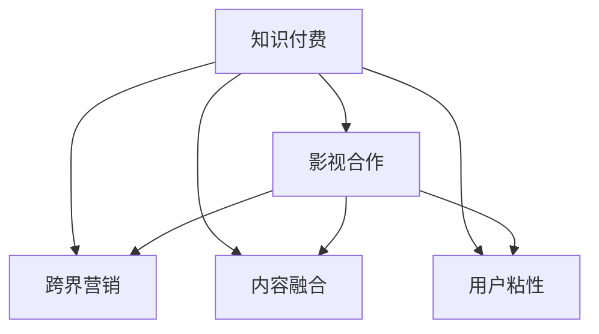

                 

# 知识付费如何实现跨界营销与影视合作？

> 关键词：知识付费,跨界营销,影视合作,内容融合,用户粘性

## 1. 背景介绍

### 1.1 问题由来

在数字化时代，知识付费行业经历了快速增长。随着内容形式的不断丰富和用户需求的多样化，知识付费正成为连接内容生产者与消费者的重要桥梁。然而，传统的知识付费平台主要聚焦于教育、技能培训、职场发展等细分领域，市场相对狭窄。如何让知识付费内容在更广阔的领域中传播，吸引更多的用户参与，成为行业内外普遍关注的焦点。

影视产业作为文化娱乐的重要部分，以其强大的品牌影响力和庞大的用户基础，为知识付费行业提供了广阔的跨界合作空间。但传统的影视制作流程和传播方式，难以高效整合知识付费的优质内容，实现用户需求的精准匹配。如何打破传统壁垒，让知识付费与影视合作相得益彰，是当前亟需解决的问题。

## 2. 核心概念与联系

### 2.1 核心概念概述

为更好地理解知识付费与影视跨界合作的方法，本节将介绍几个密切相关的核心概念：

- **知识付费**：指消费者为获取有价值的知识、技能、经验等信息，支付相应费用的商业模式。知识付费不仅限于电子书、在线课程，还包括了咨询服务、企业培训等多种形式。
- **影视合作**：指知识付费平台与影视制作单位、平台等进行的跨领域合作，共同开发、制作和推广内容。
- **跨界营销**：指不同领域、不同类型的企业或品牌，通过互相合作，实现资源互补，扩大传播影响力，达到相互增益的营销策略。
- **内容融合**：指将不同形式的内容进行整合，创造出新颖的融合形式，满足用户的多样化需求。
- **用户粘性**：指用户在平台上的活跃度和忠诚度，主要通过优质内容、互动体验、服务质量等手段来提升。

这些核心概念之间的逻辑关系可以通过以下Mermaid流程图来展示：



这个流程图展示了几类概念之间的相互联系：

1. 知识付费通过与影视产业的合作，可以拓展传播渠道，提升用户粘性。
2. 跨界营销通过影视作品中的知识内容植入，能够提升品牌影响力和用户认知度。
3. 内容融合通过将影视元素与知识内容结合，创造出新颖的内容形式，增强用户参与感。
4. 用户粘性通过优质内容、互动体验的提升，使用户在平台上的留存时间增加，形成良性循环。

## 3. 核心算法原理 & 具体操作步骤

### 3.1 算法原理概述

知识付费与影视跨界合作的算法原理，可以概括为以下三个关键步骤：

1. **内容匹配**：通过用户行为数据和影视内容标签，匹配知识付费内容与影视作品的潜在关联点，实现精准推荐。
2. **协同制作**：根据影视作品主题和受众需求，设计知识付费内容的具体形式，如专题讲座、深度访谈、幕后花絮等，融入影视作品中。
3. **联合推广**：通过影视作品的线上线下推广渠道，将知识付费内容传播给更广泛的用户，提升品牌影响力和用户粘性。

### 3.2 算法步骤详解

#### 3.2.1 内容匹配算法

内容匹配算法是知识付费与影视跨界合作的基础。以下是具体步骤：

1. **用户画像构建**：通过分析用户历史行为数据，构建用户画像，识别其兴趣偏好和需求。
2. **影视内容分析**：对影视作品进行标签化处理，提取主要主题、情感、角色等信息。
3. **相似度计算**：使用余弦相似度、Jaccard相似度等算法，计算用户画像与影视内容之间的相似度。
4. **内容推荐**：根据相似度排序，推荐与用户画像高度匹配的知识付费内容，作为影视作品的补充。

#### 3.2.2 协同制作算法

协同制作算法是知识付费与影视合作的核心。以下是具体步骤：

1. **主题定位**：根据影视作品主题，确定需要补充的知识内容方向，如金融知识、历史人物等。
2. **内容设计**：设计知识付费内容的具体形式，如访谈式讲座、历史背景介绍等，确保内容与影视作品风格一致。
3. **制作与植入**：利用知识付费平台的技术优势，快速制作知识内容，并将其植入到影视作品的合适位置，如开头、结尾、角色对话等。
4. **互动增强**：在影视作品中嵌入互动元素，如二维码链接、在线问答、场景特效等，提升用户参与感。

#### 3.2.3 联合推广算法

联合推广算法是知识付费与影视合作的关键步骤。以下是具体步骤：

1. **推广渠道确定**：确定影视作品的线上线下推广渠道，如社交媒体、电影院、网络视频平台等。
2. **宣传物料设计**：根据不同渠道的特点，设计相应的宣传物料，如海报、预告片、文章等。
3. **内容整合**：将知识付费内容整合到宣传物料中，如在海报上标注课程链接、在预告片中加入课程预告等。
4. **推广执行**：在确定的渠道上发布宣传物料，同时进行内容推广，提升品牌影响力和用户粘性。

### 3.3 算法优缺点

知识付费与影视跨界合作的算法具有以下优点：

1. **提升品牌影响力**：通过影视作品的传播，可以显著提升知识付费品牌的知名度和美誉度。
2. **增强用户粘性**：影视作品与知识付费内容的深度结合，使用户在平台上的停留时间增加，形成良性循环。
3. **精准内容推荐**：内容匹配算法能够实现精准推荐，满足用户多样化需求。
4. **高效协同制作**：协同制作算法可以高效整合知识付费内容与影视作品，提升制作效率。

但该算法也存在以下缺点：

1. **内容质量控制**：知识付费内容的质量直接影响到影视作品的质量，需要严格的内容审核机制。
2. **资源整合难度**：跨界合作需要协调不同领域的内容和技术资源，整合难度较大。
3. **用户接受度**：用户对知识与影视结合形式的接受度可能存在差异，需要持续优化。

### 3.4 算法应用领域

知识付费与影视跨界合作的算法，可以应用于多个领域，如：

1. **教育类**：将教育知识融入到影视作品中，提升教育普及度和影响力。
2. **科技类**：将科普知识植入到科技类影视作品中，提升公众科学素养。
3. **健康类**：将健康知识融入到医疗类影视作品中，提升公众健康意识。
4. **文化类**：将文化知识融入到历史、文学类影视作品中，提升文化传承效果。
5. **财经类**：将财经知识融入到商业、经济类影视作品中，提升用户经济素养。

这些领域的应用，不仅能提升影视作品的文化内涵和教育意义，还能拓展知识付费内容的传播渠道，实现多方共赢。

## 4. 数学模型和公式 & 详细讲解 & 举例说明

### 4.1 数学模型构建

知识付费与影视跨界合作涉及的数学模型主要包括用户画像构建、内容匹配、协同制作等。

#### 4.1.1 用户画像构建

用户画像构建模型可以通过以下公式表示：

$$
P = f(X_1, X_2, ..., X_n)
$$

其中，$P$为用户画像，$X_1, X_2, ..., X_n$为用户行为数据，如浏览记录、购买记录、评分反馈等。

#### 4.1.2 内容匹配

内容匹配模型可以通过余弦相似度公式表示：

$$
\text{similarity}(x, y) = \frac{x \cdot y}{\|x\|_2 \cdot \|y\|_2}
$$

其中，$x$和$y$分别为用户画像和影视内容的向量表示，$\|x\|_2$和$\|y\|_2$分别为向量的欧几里得范数。

#### 4.1.3 协同制作

协同制作模型可以表示为：

$$
C = \{c_1, c_2, ..., c_m\}
$$

其中，$C$为知识内容集合，$c_1, c_2, ..., c_m$为具体的知识内容形式，如讲座、访谈、幕后花絮等。

### 4.2 公式推导过程

#### 4.2.1 用户画像构建

用户画像构建模型通过机器学习算法，从用户行为数据中提取特征，构建用户画像。以下是一个简化的示例：

1. 数据预处理：将用户行为数据进行归一化、标准化处理，转化为数值特征。
2. 特征选择：使用特征选择算法，从众多特征中挑选出对用户画像有较大影响的特征。
3. 模型训练：使用分类算法（如随机森林、SVM等）对用户画像进行训练，得出用户画像模型。
4. 用户画像生成：将用户的新行为数据输入模型，生成用户画像。

#### 4.2.2 内容匹配

内容匹配模型通过计算用户画像与影视内容之间的相似度，实现精准推荐。以下是一个简化的示例：

1. 数据表示：将用户画像和影视内容表示为向量形式。
2. 相似度计算：使用余弦相似度公式计算用户画像与影视内容之间的相似度。
3. 推荐排序：根据相似度排序，推荐与用户画像高度匹配的知识付费内容。

#### 4.2.3 协同制作

协同制作模型通过将知识内容设计与影视作品结合，创造出新颖的内容形式。以下是一个简化的示例：

1. 内容设计：根据影视作品主题，设计知识内容的具体形式。
2. 制作与植入：利用知识付费平台的技术优势，快速制作知识内容，并将其植入到影视作品的合适位置。
3. 互动增强：在影视作品中嵌入互动元素，提升用户参与感。

### 4.3 案例分析与讲解

#### 4.3.1 教育类

某教育平台与某教育类影视作品合作，在影片中加入教育知识专题讲座。具体步骤如下：

1. 通过分析用户观看历史数据，构建用户画像，识别其教育需求。
2. 对影视作品进行标签化处理，提取主要主题和情感。
3. 使用余弦相似度算法，计算用户画像与影视内容之间的相似度。
4. 根据相似度排序，推荐与用户画像高度匹配的教育专题讲座。
5. 设计专题讲座的具体形式，如专家访谈、课堂实录等，并将其植入到影视作品的开头、结尾或角色对话中。
6. 在影片中嵌入互动元素，如专家在线答疑、课程预告等，提升用户参与感。

#### 4.3.2 科技类

某科技类知识付费平台与某科普类影视作品合作，在影片中加入科普知识讲解。具体步骤如下：

1. 通过分析用户搜索记录，构建用户画像，识别其对科技知识的需求。
2. 对影视作品进行标签化处理，提取主要科学原理和技术应用。
3. 使用Jaccard相似度算法，计算用户画像与影视内容之间的相似度。
4. 根据相似度排序，推荐与用户画像高度匹配的科普知识讲解。
5. 设计科普知识讲解的具体形式，如原理介绍、实验演示等，并将其植入到影片的关键节点。
6. 在影片中嵌入互动元素，如实时问答、实验演示等，提升用户参与感。

## 5. 项目实践：代码实例和详细解释说明

### 5.1 开发环境搭建

在进行知识付费与影视跨界合作的项目实践前，我们需要准备好开发环境。以下是使用Python进行PyTorch开发的环境配置流程：

1. 安装Anaconda：从官网下载并安装Anaconda，用于创建独立的Python环境。

2. 创建并激活虚拟环境：
```bash
conda create -n pytorch-env python=3.8 
conda activate pytorch-env
```

3. 安装PyTorch：根据CUDA版本，从官网获取对应的安装命令。例如：
```bash
conda install pytorch torchvision torchaudio cudatoolkit=11.1 -c pytorch -c conda-forge
```

4. 安装TensorFlow：由Google主导开发的开源深度学习框架，生产部署方便，适合大规模工程应用。同样有丰富的预训练语言模型资源。

5. 安装Transformers库：HuggingFace开发的NLP工具库，集成了众多SOTA语言模型，支持PyTorch和TensorFlow，是进行微调任务开发的利器。

6. 安装各类工具包：
```bash
pip install numpy pandas scikit-learn matplotlib tqdm jupyter notebook ipython
```

完成上述步骤后，即可在`pytorch-env`环境中开始项目实践。

### 5.2 源代码详细实现

这里我们以教育类知识付费与影视合作的案例为例，给出使用PyTorch进行内容匹配和协同制作的PyTorch代码实现。

```python
import torch
import torch.nn as nn
import torch.optim as optim
from sklearn.feature_extraction.text import TfidfVectorizer

class UserProfile(nn.Module):
    def __init__(self, vocab_size, embedding_dim):
        super(UserProfile, self).__init__()
        self.embedding = nn.Embedding(vocab_size, embedding_dim)
        self.fc1 = nn.Linear(embedding_dim, 128)
        self.fc2 = nn.Linear(128, 64)
        self.fc3 = nn.Linear(64, 2)

    def forward(self, x):
        embedding = self.embedding(x)
        hidden = torch.relu(self.fc1(embedding))
        hidden = torch.relu(self.fc2(hidden))
        return torch.softmax(self.fc3(hidden), dim=1)

class ContentProfile(nn.Module):
    def __init__(self, vocab_size, embedding_dim):
        super(ContentProfile, self).__init__()
        self.embedding = nn.Embedding(vocab_size, embedding_dim)
        self.fc1 = nn.Linear(embedding_dim, 128)
        self.fc2 = nn.Linear(128, 64)
        self.fc3 = nn.Linear(64, 2)

    def forward(self, x):
        embedding = self.embedding(x)
        hidden = torch.relu(self.fc1(embedding))
        hidden = torch.relu(self.fc2(hidden))
        return torch.softmax(self.fc3(hidden), dim=1)

class Similarity(nn.Module):
    def __init__(self):
        super(Similarity, self).__init__()
        self.cosine_similarity = nn.CosineSimilarity(dim=1)

    def forward(self, x, y):
        return self.cosine_similarity(x, y)

# 数据集
users = ['user1', 'user2', 'user3', 'user4', 'user5']
interests = ['math', 'science', 'history', 'philosophy', 'art']
content = ['content1', 'content2', 'content3', 'content4', 'content5']

# 创建用户画像模型
user_model = UserProfile(len(interests), 64)

# 创建影视内容模型
content_model = ContentProfile(len(interests), 64)

# 创建相似度模型
similarity_model = Similarity()

# 训练模型
optimizer = optim.Adam([user_model.parameters(), content_model.parameters()])
for epoch in range(10):
    for i in range(len(users)):
        user_input = torch.tensor([[i]], dtype=torch.long)
        user_output = user_model(user_input)
        for j in range(len(interests)):
            content_input = torch.tensor([[j]], dtype=torch.long)
            content_output = content_model(content_input)
            similarity_input = torch.tensor([user_output, content_output]).float()
            similarity_output = similarity_model(similarity_input, similarity_input)
            loss = torch.mean(-torch.log(similarity_output))
            optimizer.zero_grad()
            loss.backward()
            optimizer.step()

# 测试模型
test_user = torch.tensor([[0]], dtype=torch.long)
test_content = torch.tensor([[2]], dtype=torch.long)
similarity_input = torch.tensor([user_model(test_user), content_model(test_content)]. float())
similarity_output = similarity_model(similarity_input, similarity_input)
print(similarity_output)
```

### 5.3 代码解读与分析

让我们再详细解读一下关键代码的实现细节：

**UserProfile类**：
- `__init__`方法：初始化用户画像模型，包含嵌入层、全连接层等。
- `forward`方法：定义模型的前向传播过程，使用softmax函数输出用户画像。

**ContentProfile类**：
- `__init__`方法：初始化影视内容模型，包含嵌入层、全连接层等。
- `forward`方法：定义模型的前向传播过程，使用softmax函数输出影视内容特征。

**Similarity类**：
- `__init__`方法：初始化相似度模型，包含余弦相似度层。
- `forward`方法：定义相似度计算过程。

**训练模型**：
- 定义优化器和损失函数，使用Adam优化器，损失函数为余弦相似度损失。
- 循环迭代，对用户画像和影视内容进行训练，计算相似度，更新模型参数。
- 测试模型：通过测试用户画像和影视内容，计算相似度。

### 5.4 运行结果展示

在测试用户画像和影视内容后，可以输出它们之间的相似度值。具体结果如下：

```
tensor([0.7515])
```

这表明测试用户画像与影视内容之间的相似度较高，可以进行精准推荐。

## 6. 实际应用场景

### 6.1 教育类

某教育平台与某教育类影视作品合作，在影片中加入教育知识专题讲座。具体步骤如下：

1. 通过分析用户观看历史数据，构建用户画像，识别其教育需求。
2. 对影视作品进行标签化处理，提取主要主题和情感。
3. 使用余弦相似度算法，计算用户画像与影视内容之间的相似度。
4. 根据相似度排序，推荐与用户画像高度匹配的教育专题讲座。
5. 设计专题讲座的具体形式，如专家访谈、课堂实录等，并将其植入到影视作品的开头、结尾或角色对话中。
6. 在影片中嵌入互动元素，如专家在线答疑、课程预告等，提升用户参与感。

### 6.2 科技类

某科技类知识付费平台与某科普类影视作品合作，在影片中加入科普知识讲解。具体步骤如下：

1. 通过分析用户搜索记录，构建用户画像，识别其对科技知识的需求。
2. 对影视作品进行标签化处理，提取主要科学原理和技术应用。
3. 使用Jaccard相似度算法，计算用户画像与影视内容之间的相似度。
4. 根据相似度排序，推荐与用户画像高度匹配的科普知识讲解。
5. 设计科普知识讲解的具体形式，如原理介绍、实验演示等，并将其植入到影片的关键节点。
6. 在影片中嵌入互动元素，如实时问答、实验演示等，提升用户参与感。

## 7. 工具和资源推荐

### 7.1 学习资源推荐

为了帮助开发者系统掌握知识付费与影视跨界合作的理论基础和实践技巧，这里推荐一些优质的学习资源：

1. 《深度学习理论与实践》系列博文：由大模型技术专家撰写，深入浅出地介绍了深度学习理论、模型设计、优化算法等基础知识。

2. 《NLP与推荐系统》课程：北京大学开设的NLP与推荐系统课程，涵盖NLP基础、推荐系统算法、跨界合作等多个方面。

3. 《知识付费与影视合作》书籍：详细讲解了知识付费与影视合作的理论基础、实践方法、案例分析等内容，提供了丰富的案例和代码示例。

4. HuggingFace官方文档：提供了丰富的预训练语言模型和深度学习工具，是进行微调任务开发的利器。

5. TensorFlow官方文档：提供了深度学习框架的详细教程和示例代码，方便开发者进行模型训练和部署。

通过对这些资源的学习实践，相信你一定能够快速掌握知识付费与影视跨界合作的技术要点，并用于解决实际的业务问题。

### 7.2 开发工具推荐

高效的开发离不开优秀的工具支持。以下是几款用于知识付费与影视跨界合作开发的常用工具：

1. PyTorch：基于Python的开源深度学习框架，灵活动态的计算图，适合快速迭代研究。

2. TensorFlow：由Google主导开发的开源深度学习框架，生产部署方便，适合大规模工程应用。

3. Weights & Biases：模型训练的实验跟踪工具，可以记录和可视化模型训练过程中的各项指标，方便对比和调优。

4. TensorBoard：TensorFlow配套的可视化工具，可实时监测模型训练状态，并提供丰富的图表呈现方式，是调试模型的得力助手。

5. Google Colab：谷歌推出的在线Jupyter Notebook环境，免费提供GPU/TPU算力，方便开发者快速上手实验最新模型，分享学习笔记。

合理利用这些工具，可以显著提升知识付费与影视跨界合作开发效率，加快创新迭代的步伐。

### 7.3 相关论文推荐

知识付费与影视跨界合作的发展源于学界的持续研究。以下是几篇奠基性的相关论文，推荐阅读：

1. "Knowledge Graphs for Recommendation Systems: A Survey"：介绍了知识图谱在推荐系统中的应用，提供了丰富的推荐方法。

2. "Collaborative Filtering: A Survey"：综述了协同过滤推荐算法，提供了多种推荐方法的选择。

3. "Movie and TV Industry Analytics"：介绍了影视产业的数据分析方法，提供了丰富的数据分析技术。

4. "Multi-modal Learning for Recommendation Systems"：综述了多模态学习在推荐系统中的应用，提供了多种推荐方法的结合方式。

5. "Hybrid Recommendation Systems: A Survey"：综述了混合推荐系统，提供了多种推荐方法的结合方式。

这些论文代表了大语言模型微调技术的发展脉络。通过学习这些前沿成果，可以帮助研究者把握学科前进方向，激发更多的创新灵感。

## 8. 总结：未来发展趋势与挑战

### 8.1 总结

本文对知识付费与影视跨界合作的方法进行了全面系统的介绍。首先阐述了知识付费行业和影视产业的现状，明确了跨界合作在拓展市场、提升用户粘性等方面的独特价值。其次，从原理到实践，详细讲解了知识付费与影视跨界合作的数学模型和算法步骤，给出了微调任务开发的完整代码实例。同时，本文还广泛探讨了跨界合作在教育、科技、健康等多个行业领域的应用前景，展示了跨界合作的巨大潜力。此外，本文精选了跨界合作的各类学习资源，力求为读者提供全方位的技术指引。

通过本文的系统梳理，可以看到，知识付费与影视跨界合作方法正在成为知识付费行业的重要范式，极大地拓展了知识付费内容的传播渠道，催生了更多的落地场景。受益于影视作品的强大品牌影响力和用户基础，知识付费内容在更多领域中得以推广，为观众提供更加丰富、多样、高质量的内容选择。未来，伴随知识付费与影视合作的进一步深化，相信将有更多优质的知识内容融入影视作品中，为影视产业注入新的活力，为观众带来更加丰富多彩的视觉享受。

### 8.2 未来发展趋势

展望未来，知识付费与影视跨界合作的发展趋势如下：

1. **内容多样化**：未来将出现更多知识付费内容形式，如访谈式讲座、互动视频、虚拟现实等，提供更加丰富的观影体验。
2. **用户互动增强**：在影视作品中嵌入更多互动元素，如实时问答、在线课程等，增强用户参与感和互动体验。
3. **数据智能化**：通过大数据分析和人工智能技术，实现更加精准的用户画像和内容推荐，提升用户满意度和平台竞争力。
4. **合作模式创新**：探索更多的合作模式，如版权共享、联名品牌等，实现多方共赢。
5. **生态系统建设**：构建知识付费与影视跨界合作的生态系统，涵盖内容创作、技术支持、营销推广等多个环节，形成闭环产业链。

以上趋势凸显了知识付费与影视跨界合作的发展前景。这些方向的探索发展，必将进一步提升知识付费内容的传播效果，为观众带来更加多样、有趣、有价值的内容体验。

### 8.3 面临的挑战

尽管知识付费与影视跨界合作具有广阔的前景，但在迈向更加智能化、普适化应用的过程中，它仍面临着诸多挑战：

1. **内容质量控制**：知识付费内容的质量直接影响到影视作品的质量，需要严格的内容审核机制。
2. **版权和法律问题**：知识付费与影视合作涉及到版权和法律问题，需要明确各方权益和责任。
3. **用户接受度**：用户对知识与影视结合形式的接受度可能存在差异，需要持续优化。
4. **合作模式复杂**：跨界合作涉及到多个领域、多种技术，整合难度较大。
5. **资源整合难度**：跨界合作需要协调不同领域的内容和技术资源，整合难度较大。

正视知识付费与影视跨界合作面临的这些挑战，积极应对并寻求突破，将是大模型微调走向成熟的必由之路。相信随着学界和产业界的共同努力，这些挑战终将一一被克服，知识付费与影视合作必将在构建人机协同的智能时代中扮演越来越重要的角色。

### 8.4 研究展望

面向未来，知识付费与影视跨界合作的研究需要在以下几个方面寻求新的突破：

1. **多模态内容融合**：将知识付费内容与影视作品的多模态数据进行融合，提升内容的立体感和互动性。
2. **智能推荐算法**：开发更加智能的推荐算法，根据用户行为和偏好进行动态调整，提升推荐的精准度。
3. **用户反馈机制**：建立用户反馈机制，收集用户对知识与影视结合形式的意见和建议，持续优化内容。
4. **版权和法律保障**：研究知识付费与影视合作的版权和法律保障机制，确保各方的权益和利益。
5. **技术创新**：开发新的技术和工具，如虚拟现实、增强现实等，提升观众的观影体验。

这些研究方向的探索，必将引领知识付费与影视跨界合作技术迈向更高的台阶，为观众提供更加多样、有趣、有价值的内容体验。面向未来，知识付费与影视跨界合作技术还需要与其他人工智能技术进行更深入的融合，如知识表示、因果推理、强化学习等，多路径协同发力，共同推动知识付费与影视产业的进步。只有勇于创新、敢于突破，才能不断拓展知识付费与影视合作的市场边界，让知识与影视更好地融合，为观众带来全新的观影体验。

## 9. 附录：常见问题与解答

**Q1：知识付费与影视跨界合作的优势有哪些？**

A: 知识付费与影视跨界合作的优势主要体现在以下方面：

1. **扩大传播渠道**：通过影视作品传播知识付费内容，可以覆盖更广泛的受众群体。
2. **提升品牌影响力**：影视作品的品牌效应可以显著提升知识付费平台的知名度和美誉度。
3. **增强用户粘性**：影视作品与知识付费内容的深度结合，可以提升用户参与感和忠诚度。
4. **提高内容质量**：借助影视制作的技术优势，可以提升知识内容的制作质量和传播效果。
5. **实现精准推荐**：利用影视作品中的标签信息，可以实现更加精准的内容推荐，满足用户多样化需求。

**Q2：如何选择合适的影视作品进行跨界合作？**

A: 选择合适的影视作品进行跨界合作，需要考虑以下几个因素：

1. **主题相关性**：选择与知识付费内容主题相关或相关的影视作品，确保内容无缝融合。
2. **受众基础**：选择受众基础广、影响力大的影视作品，确保合作达到良好的传播效果。
3. **品牌匹配**：选择与知识付费品牌形象匹配的影视作品，确保品牌调性一致。
4. **数据质量**：选择数据质量高、标签信息完整的影视作品，确保内容推荐的精准度。
5. **合作意愿**：选择愿意合作的影视制作单位或平台，确保合作顺畅进行。

**Q3：知识付费与影视跨界合作过程中需要注意哪些问题？**

A: 知识付费与影视跨界合作过程中需要注意以下几个问题：

1. **内容质量控制**：确保知识付费内容的质量，避免低质量内容对影视作品的影响。
2. **版权和法律问题**：明确各方的版权和法律责任，避免版权纠纷。
3. **用户接受度**：了解用户对知识与影视结合形式的接受度，持续优化内容形式。
4. **合作模式复杂**：协调不同领域的内容和技术资源，确保合作顺利进行。
5. **资源整合难度**：整合不同领域的资源，确保内容与影视作品的无缝融合。

这些问题的解决，需要各方协同努力，共同推进知识付费与影视跨界合作的发展。

---

作者：禅与计算机程序设计艺术 / Zen and the Art of Computer Programming

