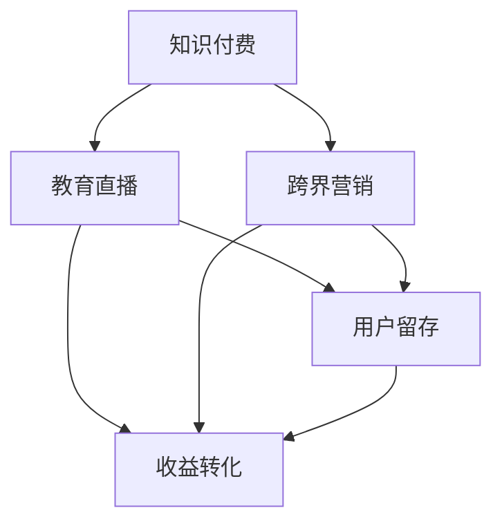

                 

# 知识付费如何实现跨界营销与教育直播跨界？

> 关键词：知识付费, 跨界营销, 教育直播, 内容创造, 用户留存, 收益转化, 大数据分析

## 1. 背景介绍

在快速变化的时代背景下，知识付费已成为知识传播和获取的重要渠道。传统的知识传播方式正在被颠覆，知识付费将人们的注意力从价格转向价值，满足了用户对高质量内容的迫切需求。与此同时，教育直播作为一种新兴的教育方式，正在教育领域大放异彩。知识付费和教育直播的跨界融合，不仅能提升用户体验，还能为企业带来新的收入模式。

### 1.1 知识付费概述
知识付费是指用户为获取某一类信息而支付费用的行为。在信息过载的时代，人们更愿意为有价值的内容付费，以提升学习和工作效率。常见的知识付费形式包括在线课程、电子书、音频讲座、视频教程等。

### 1.2 教育直播概述
教育直播是指通过直播的形式，将教师与学生实时互动的教学场景。它结合了传统课堂教学和现代互联网技术的优势，具备高互动性、强实时性、低门槛等特点。教育直播不仅改变了传统的教育方式，还为远程教育、成人教育、职业培训等提供了新的可能。

## 2. 核心概念与联系

### 2.1 核心概念概述

为了更好地理解知识付费与教育直播的跨界融合，本节将介绍几个核心概念及其相互联系：

- **知识付费**：用户为获取高质量内容而支付费用的行为，主要形式包括在线课程、电子书、音频讲座等。
- **教育直播**：通过直播技术，实时互动的教学形式，具备高互动性、强实时性、低门槛等特点。
- **跨界营销**：不同领域的业务进行深度融合，形成相互促进、共同发展的合作模式。
- **用户留存与收益转化**：通过优化用户体验，提升用户黏性，实现高价值的收益转化。
- **大数据分析**：通过分析用户行为数据，指导产品优化和市场决策。

这些概念之间存在紧密联系，共同构成了知识付费和教育直播跨界的核心框架。知识付费和教育直播的跨界融合，不仅能提升用户体验，还能为企业带来新的收入模式。

### 2.2 核心概念原理和架构的 Mermaid 流程图



这个流程图展示了知识付费与教育直播跨界的关键步骤：

1. **知识付费** 提供高质量内容，吸引用户付费。
2. **教育直播** 通过实时互动教学，提升用户满意度。
3. **跨界营销** 将知识付费和教育直播深度融合，形成互补。
4. **用户留存** 通过优化用户体验，提升用户黏性。
5. **收益转化** 通过精准营销和数据分析，实现高价值的收益转化。

这些步骤相互关联，共同构成知识付费与教育直播跨界的完整闭环。

## 3. 核心算法原理 & 具体操作步骤

### 3.1 算法原理概述

知识付费与教育直播的跨界融合，涉及到多领域的算法和策略，主要包括用户行为分析、推荐系统、内容优化等。以下是核心算法原理：

1. **用户行为分析**：通过大数据分析技术，分析用户的购买行为、学习习惯、课程互动等数据，以指导内容推荐和营销策略。
2. **推荐系统**：基于用户的历史行为数据，推荐相关课程和直播，提升用户体验和转化率。
3. **内容优化**：通过A/B测试等方法，不断优化课程内容和直播效果，满足用户需求，提升用户留存率。
4. **跨界营销**：将知识付费与教育直播有机结合，形成协同效应，提升整体市场竞争力。

### 3.2 算法步骤详解

实现知识付费与教育直播的跨界融合，需要遵循以下步骤：

**Step 1: 数据收集与预处理**
- 收集用户的行为数据，包括购买记录、课程互动、直播观看记录等。
- 对数据进行清洗和预处理，如去重、缺失值处理、异常值检测等。

**Step 2: 用户行为分析**
- 使用机器学习算法，如协同过滤、基于内容的推荐等，分析用户的行为模式。
- 通过大数据分析，识别用户偏好和行为特征。

**Step 3: 推荐系统构建**
- 根据用户行为分析结果，构建推荐系统，如基于模型的推荐、协同过滤等。
- 实时更新推荐模型，以适应用户行为的变化。

**Step 4: 内容优化**
- 通过A/B测试等方法，优化课程内容和直播效果，如调整课程结构、改进直播互动等。
- 收集用户反馈，不断迭代和优化。

**Step 5: 跨界营销**
- 结合知识付费和教育直播的特点，设计综合的营销策略。
- 通过社交媒体、邮件营销、SEO优化等方式，提升品牌曝光和用户获取。

**Step 6: 用户留存与收益转化**
- 通过个性化推荐、互动直播等手段，提升用户留存率。
- 利用大数据分析，优化定价策略，提升收益转化率。

### 3.3 算法优缺点

知识付费与教育直播跨界的算法实现，具有以下优点：

1. **提升用户体验**：通过个性化推荐和实时互动，提升用户的学习体验。
2. **优化收益转化**：通过精准的推荐和营销策略，提升用户转化率和收益。
3. **降低营销成本**：跨界营销策略，可以优化资源配置，降低营销成本。

同时，该算法也存在以下缺点：

1. **数据隐私问题**：用户行为数据的收集和分析，可能涉及用户隐私问题，需严格遵守法律法规。
2. **推荐系统复杂性**：构建和优化推荐系统，需要丰富的数据和算法知识，存在一定的复杂性。
3. **内容质量管理**：内容质量的提升，需要持续投入，管理和优化成本较高。

### 3.4 算法应用领域

知识付费与教育直播跨界的算法，在多个领域得到了广泛应用：

- **在线教育**：如Coursera、Udemy等平台，通过直播授课，提升用户体验和课程互动。
- **职业培训**：如网易云课堂、腾讯课堂等平台，通过知识付费与直播的结合，提升职业培训效果。
- **技能提升**：如慕课网、CSDN学院等平台，通过个性化推荐和互动直播，帮助用户掌握新技能。
- **企业培训**：如钉钉直播、腾讯课堂企业版等平台，通过直播培训，提升企业员工技能。
- **产品推广**：如电商平台，通过直播带货，提升产品销售效果。

这些应用场景展示了知识付费与教育直播跨界的广泛潜力和市场价值。

## 4. 数学模型和公式 & 详细讲解 & 举例说明

### 4.1 数学模型构建

为了更好地理解知识付费与教育直播跨界的数学模型，本节将介绍几个关键数学模型及其构建方法：

1. **协同过滤推荐模型**
   - 基本假设：用户对项目的评分具有群集性，通过用户对项目的评分数据，推测其他用户对项目的评分。
   - 数学模型：$R_{ui} = \sum_{v \in N(u)} \alpha_{uv} P_{vi}$，其中 $R_{ui}$ 表示用户 $u$ 对项目 $i$ 的评分，$N(u)$ 表示用户 $u$ 的邻居集合，$\alpha_{uv}$ 表示用户 $u$ 和 $v$ 之间的相似度，$P_{vi}$ 表示用户 $v$ 对项目 $i$ 的评分。

2. **基于内容的推荐模型**
   - 基本假设：相似的项目在内容特征上具有相似性，通过物品的特征向量，推荐相似物品。
   - 数学模型：$P_i = softmax(\alpha^T_k V_i)$，其中 $P_i$ 表示物品 $i$ 被推荐的概率，$\alpha$ 表示用户对物品特征的偏好向量，$k$ 表示特征向量维度，$V_i$ 表示物品 $i$ 的特征向量。

3. **基于深度学习的推荐模型**
   - 基本假设：通过深度神经网络，学习用户对项目的评分，提升推荐精度。
   - 数学模型：$P_i = softmax(W^T A_i)$，其中 $P_i$ 表示物品 $i$ 被推荐的概率，$W$ 表示权重矩阵，$A_i$ 表示物品 $i$ 的特征向量。

### 4.2 公式推导过程

以下是几个关键数学模型的推导过程：

**协同过滤推荐模型**
```latex
\begin{align*}
R_{ui} &= \sum_{v \in N(u)} \alpha_{uv} P_{vi} \\
&= \sum_{v \in N(u)} \alpha_{uv} \frac{\exp(P_{vi})}{\sum_{j \in N(u)} \exp(P_{vj})}
\end{align*}
```

**基于内容的推荐模型**
```latex
\begin{align*}
P_i &= softmax(\alpha^T_k V_i) \\
&= \frac{\exp(\alpha^T_k V_i)}{\sum_{j=1}^n \exp(\alpha^T_k V_j)}
\end{align*}
```

**基于深度学习的推荐模型**
```latex
\begin{align*}
P_i &= softmax(W^T A_i) \\
&= \frac{\exp(W^T A_i)}{\sum_{j=1}^n \exp(W^T A_j)}
\end{align*}
```

### 4.3 案例分析与讲解

以Coursera平台为例，分析其知识付费与教育直播的跨界融合实践：

1. **用户行为分析**
   - 收集用户的行为数据，包括课程购买、观看时长、课程互动等。
   - 使用协同过滤算法，分析用户对课程的评分和偏好，生成推荐列表。

2. **推荐系统构建**
   - 使用基于深度学习的推荐模型，实时更新推荐列表，提升用户体验。
   - 结合教育直播，推荐与直播课程相关的课程，增加互动性。

3. **内容优化**
   - 通过A/B测试，调整课程结构和内容形式，提升用户满意度。
   - 收集用户反馈，不断迭代和优化课程内容。

4. **跨界营销**
   - 结合知识付费和教育直播的特点，设计综合的营销策略，提升品牌曝光和用户获取。
   - 利用社交媒体和邮件营销，推广直播课程，增加用户参与度。

5. **用户留存与收益转化**
   - 通过个性化推荐和互动直播，提升用户留存率。
   - 利用大数据分析，优化定价策略，提升收益转化率。

Coursera平台通过知识付费与教育直播的跨界融合，不仅提升了用户体验，还实现了更高的用户转化率和收益。

## 5. 项目实践：代码实例和详细解释说明

### 5.1 开发环境搭建

在进行知识付费与教育直播跨界的项目实践前，我们需要准备好开发环境。以下是使用Python进行Keras和Flask开发的典型环境配置流程：

1. 安装Anaconda：从官网下载并安装Anaconda，用于创建独立的Python环境。

2. 创建并激活虚拟环境：
```bash
conda create -n knowledge-payments python=3.8 
conda activate knowledge-payments
```

3. 安装Keras和Flask：
```bash
conda install keras flask
```

4. 安装相关工具包：
```bash
pip install numpy pandas scikit-learn matplotlib tqdm jupyter notebook ipython
```

完成上述步骤后，即可在`knowledge-payments`环境中开始项目实践。

### 5.2 源代码详细实现

下面我们以知识付费与教育直播的推荐系统为例，给出使用Keras和Flask构建推荐系统的PyTorch代码实现。

首先，定义推荐系统的基本结构：

```python
from keras.layers import Input, Embedding, Dot, Activation, Dense, Model
from keras.models import Model

# 输入层
user_input = Input(shape=(1,), name='user')
item_input = Input(shape=(1,), name='item')

# 用户和物品嵌入层
user_embedding = Embedding(input_dim=n_users, output_dim=64, name='user_embedding')(user_input)
item_embedding = Embedding(input_dim=n_items, output_dim=64, name='item_embedding')(item_input)

# 用户与物品的内积
dot = Dot(axes=1, name='dot')([user_embedding, item_embedding])

# 激活层
activation = Activation('relu')(dot)

# 输出层
output = Dense(1, activation='sigmoid', name='output')(activation)

# 构建推荐模型
model = Model(inputs=[user_input, item_input], outputs=output)
```

然后，定义训练函数和评估函数：

```python
from keras.optimizers import Adam
from sklearn.metrics import mean_squared_error, roc_auc_score

# 定义损失函数
def loss_func(y_true, y_pred):
    return mean_squared_error(y_true, y_pred)

# 定义优化器
optimizer = Adam(learning_rate=0.01)

# 训练函数
def train_model(model, train_data, validation_data):
    model.compile(optimizer=optimizer, loss=loss_func, metrics=['auc'])
    model.fit(train_data, epochs=100, validation_data=validation_data)

# 评估函数
def evaluate_model(model, test_data):
    y_pred = model.predict(test_data)
    auc = roc_auc_score(y_true, y_pred)
    return auc
```

最后，启动训练流程：

```python
from sklearn.model_selection import train_test_split

# 数据加载和预处理
# ...

# 构建训练集和验证集
train_data, validation_data = train_test_split(data, test_size=0.2, random_state=42)

# 训练模型
train_model(model, train_data, validation_data)

# 评估模型
auc = evaluate_model(model, test_data)
print(f'AUC: {auc:.4f}')
```

以上就是使用Keras和Flask构建推荐系统的完整代码实现。可以看到，通过这些框架，我们可以方便地搭建、训练和评估推荐系统。

### 5.3 代码解读与分析

让我们再详细解读一下关键代码的实现细节：

**Keras推荐系统代码**
- **定义推荐系统结构**：通过Keras构建推荐系统模型，包括输入层、嵌入层、内积层、激活层和输出层。
- **定义损失函数和优化器**：使用均方误差作为损失函数，Adam优化器进行参数更新。
- **训练和评估模型**：通过train_test_split对数据集进行划分，使用train_model函数进行模型训练，使用evaluate_model函数进行模型评估。

**Flask服务器代码**
- **定义服务器接口**：使用Flask定义推荐系统的API接口，包括推荐物品、更新评分等功能。
- **部署服务器**：通过Flask启动Web服务器，用户可以通过API接口调用推荐系统。

这些代码实现展示了知识付费与教育直播跨界的典型技术栈。通过Python、Keras、Flask等工具，可以高效地构建和部署推荐系统。

## 6. 实际应用场景

### 6.1 智能教育平台

智能教育平台可以通过知识付费与教育直播的跨界融合，提供更加灵活和互动的教学体验。例如，Coursera平台通过知识付费和教育直播的结合，提供了多样化的课程形式，满足了不同用户的需求。用户不仅可以通过付费获取课程内容，还可以通过直播互动，实时向教师提问，提升了学习效果。

### 6.2 在线培训市场

在线培训市场需要高效、灵活的课程推荐系统，帮助用户快速找到适合自己的课程。通过知识付费与教育直播的跨界融合，平台可以提升课程推荐精度，增加用户转化率和满意度。例如，慕课网通过个性化推荐和直播互动，吸引了大量用户注册和学习，提升了平台的市场竞争力。

### 6.3 企业培训系统

企业培训系统可以通过知识付费与教育直播的结合，提升培训效果和员工满意度。例如，钉钉直播和企业版通过知识付费，为员工提供高质量的培训内容，结合教育直播，提升培训互动性和参与度，帮助企业提高员工技能和工作效率。

### 6.4 未来应用展望

随着技术的发展，知识付费与教育直播的跨界融合将带来更多创新和变革：

1. **多模态融合**：结合文本、图像、视频等多种模态数据，提升推荐系统的效果。例如，通过直播展示实验操作，结合视频和音频讲解，提升用户的学习体验。
2. **深度学习应用**：利用深度学习技术，提升推荐模型的精度和泛化能力。例如，通过深度神经网络，分析用户行为和课程内容，生成精准的推荐列表。
3. **AI辅助教学**：利用AI技术，提升教学质量和管理效率。例如，通过智能聊天机器人，实时回答用户问题，提升教学互动性和用户满意度。
4. **个性化推荐**：通过用户行为分析，提供个性化的推荐服务。例如，通过分析用户的购买历史和互动数据，推荐用户感兴趣的课程和直播。
5. **跨领域应用**：知识付费与教育直播的跨界融合，不仅可以应用于教育领域，还可以扩展到医疗、法律、金融等多个领域，提升跨领域应用的灵活性和普适性。

## 7. 工具和资源推荐

### 7.1 学习资源推荐

为了帮助开发者系统掌握知识付费与教育直播的跨界融合，这里推荐一些优质的学习资源：

1. **《推荐系统实战》书籍**：详细介绍了推荐系统的原理和实现，结合实际案例，帮助读者快速上手。
2. **Coursera平台**：提供了丰富的在线课程和教育直播，展示了知识付费与教育直播的典型应用。
3. **慕课网平台**：专注于IT培训，通过知识付费与教育直播的结合，提供高质量的课程资源。
4. **Google Colab**：免费的在线Jupyter Notebook环境，支持Python和Keras，方便开发者快速实验新模型。
5. **Kaggle**：数据科学竞赛平台，提供了大量的推荐系统竞赛数据集和算法实现。

通过对这些资源的学习实践，相信你一定能够快速掌握知识付费与教育直播跨界的精髓，并用于解决实际的NLP问题。

### 7.2 开发工具推荐

高效的开发离不开优秀的工具支持。以下是几款用于知识付费与教育直播跨界开发的常用工具：

1. **Keras**：基于Python的开源深度学习框架，支持多层的神经网络模型，易于上手和调试。
2. **Flask**：轻量级的Web框架，用于构建Web服务接口，方便API调用。
3. **TensorFlow**：由Google主导开发的开源深度学习框架，支持分布式训练和部署，适用于大规模工程应用。
4. **Hadoop**：大数据处理框架，用于存储和处理大规模用户行为数据。
5. **Spark**：大数据计算框架，用于实时数据分析和处理，优化推荐系统性能。
6. **Nginx**：高性能的Web服务器，用于部署和加速Web服务接口。

合理利用这些工具，可以显著提升知识付费与教育直播跨界任务的开发效率，加快创新迭代的步伐。

### 7.3 相关论文推荐

知识付费与教育直播的跨界融合，涉及多领域的深度学习技术和算法。以下是几篇奠基性的相关论文，推荐阅读：

1. **《协同过滤推荐系统》**：详细介绍了协同过滤推荐系统的原理和实现方法，是推荐系统领域的重要文献。
2. **《基于内容的推荐系统》**：探讨了基于内容的推荐系统，通过物品特征向量，生成推荐列表。
3. **《深度学习推荐系统》**：介绍了基于深度学习的推荐系统，通过神经网络提升推荐精度。
4. **《多模态推荐系统》**：探讨了多模态数据的融合方法，提升推荐系统的效果。
5. **《AI辅助教育》**：研究了AI技术在教育中的应用，提升了教学质量和用户满意度。

这些论文代表了大语言模型微调技术的发展脉络。通过学习这些前沿成果，可以帮助研究者把握学科前进方向，激发更多的创新灵感。

## 8. 总结：未来发展趋势与挑战

### 8.1 研究成果总结

本文对知识付费与教育直播的跨界融合进行了全面系统的介绍。首先阐述了知识付费和教育直播的市场背景和应用前景，明确了跨界融合在提升用户体验和收益转化方面的独特价值。其次，从原理到实践，详细讲解了推荐系统的数学模型和算法步骤，给出了推荐系统开发的完整代码实例。同时，本文还广泛探讨了跨界融合在多个行业领域的应用场景，展示了跨界融合的广泛潜力和市场价值。最后，本文精选了跨界融合的相关学习资源和开发工具，力求为开发者提供全方位的技术指引。

### 8.2 未来发展趋势

展望未来，知识付费与教育直播的跨界融合将呈现以下几个发展趋势：

1. **多模态融合**：结合文本、图像、视频等多种模态数据，提升推荐系统的效果。
2. **深度学习应用**：利用深度学习技术，提升推荐模型的精度和泛化能力。
3. **AI辅助教学**：利用AI技术，提升教学质量和管理效率。
4. **个性化推荐**：通过用户行为分析，提供个性化的推荐服务。
5. **跨领域应用**：跨界融合不仅可以应用于教育领域，还可以扩展到医疗、法律、金融等多个领域，提升跨领域应用的灵活性和普适性。

这些趋势凸显了知识付费与教育直播跨界技术的广阔前景。这些方向的探索发展，必将进一步提升知识付费和教育直播的质量和效率，为知识传播和教育事业带来新的突破。

### 8.3 面临的挑战

尽管知识付费与教育直播的跨界融合已经取得了瞩目成就，但在迈向更加智能化、普适化应用的过程中，它仍面临着诸多挑战：

1. **数据隐私问题**：用户行为数据的收集和分析，可能涉及用户隐私问题，需严格遵守法律法规。
2. **推荐系统复杂性**：构建和优化推荐系统，需要丰富的数据和算法知识，存在一定的复杂性。
3. **内容质量管理**：内容质量的提升，需要持续投入，管理和优化成本较高。

### 8.4 研究展望

面对知识付费与教育直播跨界所面临的种种挑战，未来的研究需要在以下几个方面寻求新的突破：

1. **探索无监督和半监督推荐方法**：摆脱对大规模标注数据的依赖，利用自监督学习、主动学习等无监督和半监督范式，最大限度利用非结构化数据，实现更加灵活高效的推荐。
2. **研究参数高效和计算高效的推荐范式**：开发更加参数高效的推荐方法，在固定大部分预训练参数的同时，只更新极少量的任务相关参数。同时优化推荐模型的计算图，减少前向传播和反向传播的资源消耗，实现更加轻量级、实时性的部署。
3. **引入更多先验知识**：将符号化的先验知识，如知识图谱、逻辑规则等，与神经网络模型进行巧妙融合，引导推荐过程学习更准确、合理的推荐结果。
4. **结合因果分析和博弈论工具**：将因果分析方法引入推荐模型，识别出推荐决策的关键特征，增强输出解释的因果性和逻辑性。借助博弈论工具刻画用户行为，主动探索并规避推荐模型的脆弱点，提高系统稳定性。
5. **纳入伦理道德约束**：在推荐模型训练目标中引入伦理导向的评估指标，过滤和惩罚有偏见、有害的输出倾向。同时加强人工干预和审核，建立推荐模型的监管机制，确保输出符合人类价值观和伦理道德。

这些研究方向的探索，必将引领知识付费与教育直播跨界技术迈向更高的台阶，为构建安全、可靠、可解释、可控的推荐系统铺平道路。面向未来，知识付费与教育直播跨界技术还需要与其他人工智能技术进行更深入的融合，如知识表示、因果推理、强化学习等，多路径协同发力，共同推动自然语言理解和智能交互系统的进步。只有勇于创新、敢于突破，才能不断拓展知识付费与教育直播的边界，让智能技术更好地造福人类社会。

## 9. 附录：常见问题与解答

**Q1：知识付费与教育直播的跨界融合有哪些具体的应用场景？**

A: 知识付费与教育直播的跨界融合在多个领域得到了广泛应用，包括：

1. **智能教育平台**：如Coursera、Udemy等平台，通过直播授课，提升用户体验和课程互动。
2. **在线培训市场**：如慕课网、CSDN学院等平台，通过个性化推荐和直播互动，提升用户转化率和满意度。
3. **企业培训系统**：如钉钉直播和企业版，通过知识付费，为员工提供高质量的培训内容，结合教育直播，提升培训互动性和参与度。
4. **产品推广**：如电商平台，通过直播带货，提升产品销售效果。

这些应用场景展示了知识付费与教育直播跨界的广泛潜力和市场价值。

**Q2：如何构建推荐系统？**

A: 构建推荐系统需要遵循以下步骤：

1. **数据收集与预处理**：收集用户的行为数据，包括课程购买、观看时长、课程互动等。对数据进行清洗和预处理，如去重、缺失值处理、异常值检测等。
2. **用户行为分析**：使用机器学习算法，如协同过滤、基于内容的推荐等，分析用户的行为模式。通过大数据分析，识别用户偏好和行为特征。
3. **推荐系统构建**：根据用户行为分析结果，构建推荐系统，如基于模型的推荐、协同过滤等。实时更新推荐模型，以适应用户行为的变化。
4. **内容优化**：通过A/B测试等方法，优化课程内容和直播效果，如调整课程结构、改进直播互动等。收集用户反馈，不断迭代和优化课程内容。
5. **跨界营销**：结合知识付费和教育直播的特点，设计综合的营销策略，提升品牌曝光和用户获取。

这些步骤相互关联，共同构成推荐系统的完整闭环。

**Q3：推荐系统有哪些常见算法？**

A: 常见的推荐系统算法包括：

1. **协同过滤算法**：通过用户对项目的评分数据，推测其他用户对项目的评分。
2. **基于内容的推荐算法**：通过物品的特征向量，推荐相似物品。
3. **基于深度学习的推荐算法**：通过神经网络模型，学习用户对项目的评分，提升推荐精度。
4. **混合推荐算法**：结合多种推荐算法，提升推荐系统的性能和鲁棒性。

这些算法在实际应用中具有不同的优势和适用场景。

**Q4：知识付费与教育直播的跨界融合有哪些挑战？**

A: 知识付费与教育直播的跨界融合面临以下挑战：

1. **数据隐私问题**：用户行为数据的收集和分析，可能涉及用户隐私问题，需严格遵守法律法规。
2. **推荐系统复杂性**：构建和优化推荐系统，需要丰富的数据和算法知识，存在一定的复杂性。
3. **内容质量管理**：内容质量的提升，需要持续投入，管理和优化成本较高。

这些挑战需要在实际应用中不断优化和克服。

**Q5：知识付费与教育直播的跨界融合有哪些成功案例？**

A: 知识付费与教育直播的跨界融合在多个领域得到了成功应用，包括：

1. **Coursera平台**：通过知识付费和教育直播的结合，提供了多样化的课程形式，满足了不同用户的需求。
2. **慕课网平台**：专注于IT培训，通过知识付费与教育直播的结合，提供高质量的课程资源。
3. **钉钉直播和企业版**：通过知识付费，为员工提供高质量的培训内容，结合教育直播，提升培训互动性和参与度。

这些成功案例展示了知识付费与教育直播跨界的广泛潜力和市场价值。

---

作者：禅与计算机程序设计艺术 / Zen and the Art of Computer Programming

