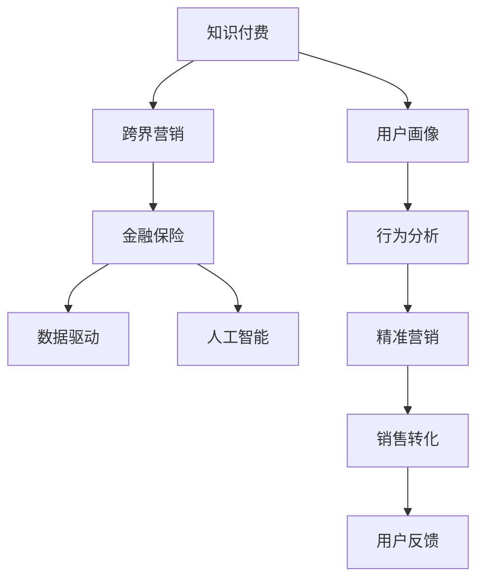

                 

# 知识付费如何实现跨界营销与金融保险跨界？

> 关键词：知识付费,跨界营销,金融保险,交叉推广,商业价值,人工智能

## 1. 背景介绍

### 1.1 问题由来
随着互联网和信息技术的快速发展，知识付费市场呈现爆炸式增长。根据艾媒咨询数据，2021年中国知识付费市场规模达到了339.3亿元，用户规模达到4.6亿。知识付费的兴起，不仅为知识创作者提供了新的盈利模式，也为消费者提供了更为高效的学习和信息获取途径。

但与此同时，知识付费也面临一些挑战。由于用户黏性较低，营销难度较大，市场竞争激烈，很多知识付费平台难以实现商业变现。为此，各大平台纷纷寻找新的突破口，探索跨界营销的新模式。

在金融和保险领域，知识付费与跨界营销的结合，为传统金融业务注入了新活力，同时也为知识付费平台带来了新的商业机会。将知识付费与金融保险结合，不仅可以提升金融产品的销售，还能为知识创作者提供更多收入来源。

### 1.2 问题核心关键点
金融保险跨界营销与知识付费的结合，主要关注以下几点：

- 如何将知识付费平台的用户群体转化为金融产品的潜在客户？
- 如何设计合适的跨界营销方案，最大化双方的商业价值？
- 如何通过人工智能等技术手段，提升跨界营销的精准度和效果？
- 如何在数据隐私和用户安全的前提下，实现有效用户画像和行为分析？

### 1.3 问题研究意义
研究知识付费与金融保险跨界营销的结合，对于促进知识付费市场的健康发展，推动金融保险业务的创新升级，具有重要意义：

1. **增强用户黏性**：跨界营销可以提高用户对知识付费平台的依赖度，使其成为忠实用户。
2. **提升金融产品销售**：通过知识付费平台的流量优势，可以有效地将金融保险产品推荐给潜在客户，提高产品销售转化率。
3. **增加知识创作者收入**：跨界营销不仅能够提升平台商业价值，还能为知识创作者提供新的收入来源，激发其创作动力。
4. **推动业务创新**：结合知识付费和金融保险业务，可以探索新的产品和服务形态，推动行业创新。
5. **强化用户教育**：通过跨界营销，可以将金融知识普及给用户，提升其金融素养，促进社会经济的健康发展。

## 2. 核心概念与联系

### 2.1 核心概念概述

为了更好地理解知识付费与金融保险跨界营销的结合，本节将介绍几个密切相关的核心概念：

- **知识付费**：指用户为获取知识、信息或经验付费的模式。知识付费平台通过提供有价值的知识内容，吸引用户订阅或购买。
- **跨界营销**：指不同行业之间相互合作，利用对方的资源和渠道进行营销推广。跨界营销可以扩大品牌影响力，开拓新的市场。
- **金融保险**：涵盖银行、证券、保险等业务，旨在为用户提供金融产品和服务，保障其财产安全。
- **人工智能**：通过机器学习和深度学习等技术手段，实现自动化和智能化决策。

这些概念之间的逻辑关系可以通过以下Mermaid流程图来展示：



这个流程图展示出知识付费与金融保险跨界营销的核心概念及其之间的关系：

1. 知识付费通过内容吸引用户，构建用户画像和行为分析模型。
2. 跨界营销利用金融保险的资源和渠道，进行精准营销和销售转化。
3. 数据驱动和人工智能技术在跨界营销中起到关键作用，提升精准度和效果。
4. 销售转化后的用户反馈，反过来又优化用户画像和行为分析，形成良性循环。

## 3. 核心算法原理 & 具体操作步骤
### 3.1 算法原理概述

知识付费与金融保险跨界营销的核心算法原理，主要基于用户画像构建和精准营销。具体步骤如下：

1. **用户画像构建**：通过对知识付费平台的用户行为数据进行分析，构建用户画像。用户画像包括用户的基本信息、兴趣偏好、学习行为等。
2. **行为分析**：对用户行为数据进行深入分析，识别出潜在客户，筛选出具有购买意向的用户群体。
3. **精准营销**：结合金融保险产品的特点，设计合适的跨界营销方案，通过知识付费平台的渠道推广金融产品。

### 3.2 算法步骤详解

以下是对知识付费与金融保险跨界营销的详细操作步骤：

**Step 1: 数据收集与清洗**
- 收集知识付费平台的用户行为数据，包括用户浏览、点击、购买、评论等行为。
- 对数据进行清洗，去除异常值和重复数据，确保数据质量。

**Step 2: 用户画像构建**
- 利用机器学习算法，如K-means聚类、协同过滤等，构建用户画像。用户画像可以包括用户的基本信息、兴趣偏好、学习行为等。
- 通过自然语言处理技术，对用户的评论和反馈进行情感分析，进一步细化用户画像。

**Step 3: 行为分析**
- 对用户行为数据进行分析，识别出具有高购买意向的用户群体。可以采用协同过滤、关联规则等算法，筛选出潜在的客户。
- 利用RFM模型等手段，对用户进行分层，识别出潜在高价值用户。

**Step 4: 精准营销**
- 结合金融保险产品的特点，设计跨界营销方案。可以设计针对高价值用户群体的专属优惠活动，如优惠券、免息分期等。
- 通过知识付费平台进行推广，利用内容引导用户进入金融保险产品的页面。
- 设计互动式营销内容，如在线直播、问答等，提高用户参与度。

**Step 5: 销售转化**
- 对营销效果进行监测，分析用户的转化率。
- 根据用户反馈，优化营销策略，提升转化率。
- 结合用户画像和行为分析，进行二次营销，进一步提升转化率。

### 3.3 算法优缺点

知识付费与金融保险跨界营销的算法具有以下优点：
1. **提升用户黏性**：跨界营销可以提升用户对知识付费平台的依赖度，使其成为忠实用户。
2. **精准营销**：通过对用户行为数据的深入分析，能够实现精准营销，提高金融产品的销售转化率。
3. **丰富服务内容**：结合金融保险产品，丰富知识付费平台的内容和服务，提升用户满意度。
4. **数据驱动**：利用数据驱动决策，提升营销的科学性和有效性。

同时，该算法也存在以下局限性：
1. **数据隐私问题**：用户画像和行为分析需要收集大量的个人数据，涉及用户隐私保护问题。
2. **技术复杂性**：实现精准营销需要较高的技术门槛，包括数据清洗、特征提取、模型训练等环节。
3. **用户反感情绪**：过度商业化的跨界营销可能引发用户反感，影响平台的用户体验。
4. **算法偏见**：算法可能存在偏见，影响用户画像的准确性和公平性。

尽管存在这些局限性，但就目前而言，基于用户画像构建和精准营销的算法，仍是大规模知识付费与金融保险跨界营销的主流范式。未来相关研究的重点在于如何进一步降低技术复杂性，保护用户隐私，提升算法的公平性和透明性。

### 3.4 算法应用领域

知识付费与金融保险跨界营销的算法，在金融和保险领域已经得到了广泛的应用，例如：

- **保险产品推荐**：通过对用户行为数据进行分析，推荐适合用户的保险产品，提升用户购买意愿。
- **金融知识普及**：利用知识付费平台，推送金融知识内容，提升用户的金融素养。
- **理财服务定制**：结合用户画像和行为分析，提供个性化的理财服务，提升用户满意度。
- **贷款产品推广**：通过精准营销，推广信贷产品，降低贷款申请门槛，提高贷款转化率。

除了上述这些经典应用外，跨界营销方法也被创新性地应用到更多场景中，如股权众筹、基金投资、财富管理等，为金融保险技术落地应用带来了新的突破。随着金融和保险业务的不断发展，基于跨界营销的算法也将不断演进，带来更多的创新应用。

## 4. 数学模型和公式 & 详细讲解 & 举例说明
### 4.1 数学模型构建

本节将使用数学语言对知识付费与金融保险跨界营销的算法进行更加严格的刻画。

记知识付费平台的用户数量为 $N$，每个用户的基本信息、兴趣偏好和学习行为等信息构成向量 $\mathbf{x}_i = [x_{i1}, x_{i2}, ..., x_{in}]$，其中 $n$ 为特征维度。记金融保险产品的数量为 $M$，每个产品的特点和属性构成向量 $\mathbf{y}_j = [y_{j1}, y_{j2}, ..., y_{jm}]$，其中 $m$ 为产品属性维度。

定义用户与金融产品的匹配度为 $F(\mathbf{x}_i, \mathbf{y}_j)$，用户对金融产品的购买意向为 $I(\mathbf{x}_i)$。则用户画像构建和精准营销的过程可以表示为：

$$
\mathbf{x}_i = F(\mathbf{x}_i, \mathbf{y}_j)
$$

$$
I(\mathbf{x}_i) = f(I(\mathbf{x}_i), F(\mathbf{x}_i, \mathbf{y}_j))
$$

其中 $f$ 表示用户行为数据的动态变化模型，$F$ 表示用户与金融产品的匹配度模型。

### 4.2 公式推导过程

以下我们以保险产品推荐为例，推导用户画像构建和精准营销的数学公式。

假设用户画像 $\mathbf{x}_i$ 包括年龄、性别、教育水平、收入水平等基本特征，记为 $\mathbf{x}_i = [a_i, g_i, e_i, i_i]$。记金融产品 $\mathbf{y}_j$ 包括产品类型、利率、保费、保障范围等属性，记为 $\mathbf{y}_j = [p_j, r_j, f_j, g_j]$。则用户画像与金融产品的匹配度模型 $F$ 可以表示为：

$$
F(\mathbf{x}_i, \mathbf{y}_j) = \mathbf{w}^T (\mathbf{x}_i - \mathbf{\mu}_x) (\mathbf{y}_j - \mathbf{\mu}_y)
$$

其中 $\mathbf{\mu}_x$ 和 $\mathbf{\mu}_y$ 分别为用户和产品的均值向量，$\mathbf{w}$ 为匹配度权重向量。

用户对金融产品的购买意向 $I$ 可以表示为：

$$
I(\mathbf{x}_i) = \mathbf{w}^T (\mathbf{x}_i - \mathbf{\mu}_x)
$$

将 $I(\mathbf{x}_i)$ 和 $F(\mathbf{x}_i, \mathbf{y}_j)$ 代入用户行为动态变化模型 $f$，可以得到：

$$
I(\mathbf{x}_i) = f(I(\mathbf{x}_i), F(\mathbf{x}_i, \mathbf{y}_j)) = \alpha I(\mathbf{x}_i) + \beta F(\mathbf{x}_i, \mathbf{y}_j)
$$

其中 $\alpha$ 和 $\beta$ 为动态变化模型的系数。

### 4.3 案例分析与讲解

假设某知识付费平台收集了10000名用户的行为数据，每个用户有4个特征（年龄、性别、教育水平、收入水平），每个金融产品有4个属性（产品类型、利率、保费、保障范围）。记用户画像 $\mathbf{x}_i$ 和金融产品 $\mathbf{y}_j$ 分别为：

$$
\mathbf{x}_i = [a_i, g_i, e_i, i_i]
$$

$$
\mathbf{y}_j = [p_j, r_j, f_j, g_j]
$$

其中 $i, j \in \{1, 2, ..., 10000, 1, 2, ..., M\}$。

通过K-means聚类算法，将用户分为5个簇，每个簇对应的均值向量 $\mathbf{\mu}_x$ 和 $\mathbf{\mu}_y$ 分别为：

$$
\mathbf{\mu}_{x1} = [a_1, g_1, e_1, i_1]
$$

$$
\mathbf{\mu}_{x2} = [a_2, g_2, e_2, i_2]
$$

$$
\mathbf{\mu}_{x3} = [a_3, g_3, e_3, i_3]
$$

$$
\mathbf{\mu}_{x4} = [a_4, g_4, e_4, i_4]
$$

$$
\mathbf{\mu}_{x5} = [a_5, g_5, e_5, i_5]
$$

$$
\mathbf{\mu}_{y1} = [p_1, r_1, f_1, g_1]
$$

$$
\mathbf{\mu}_{y2} = [p_2, r_2, f_2, g_2]
$$

$$
\mathbf{\mu}_{y3} = [p_3, r_3, f_3, g_3]
$$

$$
\mathbf{\mu}_{y4} = [p_4, r_4, f_4, g_4]
$$

$$
\mathbf{\mu}_{y5} = [p_5, r_5, f_5, g_5]
$$

通过用户画像构建模型 $F$，可以得到每个用户画像与金融产品的匹配度：

$$
F(\mathbf{x}_i, \mathbf{y}_j) = \mathbf{w}^T (\mathbf{x}_i - \mathbf{\mu}_x) (\mathbf{y}_j - \mathbf{\mu}_y)
$$

假设权重向量 $\mathbf{w}$ 为 $[0.5, 0.3, 0.2, 0]$，则每个用户画像与金融产品的匹配度分别为：

$$
F_{11} = 0.5(a_1 - a_1)(0.3p_1 - 0.3p_1)(0.2f_1 - 0.2f_1)(0g_1 - 0g_1) = 0
$$

$$
F_{12} = 0.5(a_2 - a_1)(0.3p_2 - 0.3p_1)(0.2f_2 - 0.2f_1)(0g_2 - 0g_1) = 0.3a_2 - 0.3a_1
$$

$$
F_{13} = 0.5(a_3 - a_1)(0.3p_3 - 0.3p_1)(0.2f_3 - 0.2f_1)(0g_3 - 0g_1) = 0.5a_3 - 0.5a_1
$$

$$
F_{14} = 0.5(a_4 - a_1)(0.3p_4 - 0.3p_1)(0.2f_4 - 0.2f_1)(0g_4 - 0g_1) = 0.5a_4 - 0.5a_1
$$

$$
F_{15} = 0.5(a_5 - a_1)(0.3p_5 - 0.3p_1)(0.2f_5 - 0.2f_1)(0g_5 - 0g_1) = 0.5a_5 - 0.5a_1
$$

通过用户画像动态变化模型 $f$，可以得到每个用户的购买意向 $I(\mathbf{x}_i)$：

$$
I(\mathbf{x}_i) = \alpha I(\mathbf{x}_i) + \beta F(\mathbf{x}_i, \mathbf{y}_j)
$$

假设 $\alpha = 0.8$，$\beta = 0.2$，则每个用户的购买意向分别为：

$$
I_{11} = 0.8I_{11} + 0.2F_{11} = 0.8I_{11}
$$

$$
I_{12} = 0.8I_{12} + 0.2F_{12} = 0.8I_{12} + 0.2(0.3a_2 - 0.3a_1)
$$

$$
I_{13} = 0.8I_{13} + 0.2F_{13} = 0.8I_{13} + 0.2(0.5a_3 - 0.5a_1)
$$

$$
I_{14} = 0.8I_{14} + 0.2F_{14} = 0.8I_{14} + 0.2(0.5a_4 - 0.5a_1)
$$

$$
I_{15} = 0.8I_{15} + 0.2F_{15} = 0.8I_{15} + 0.2(0.5a_5 - 0.5a_1)
$$

通过精准营销策略，可以设计针对高价值用户群体的专属优惠活动，如优惠券、免息分期等。例如，针对收入水平高于平均水平的用户，可以设计针对性的理财方案和保险产品推荐，提升用户购买意向。

## 5. 项目实践：代码实例和详细解释说明
### 5.1 开发环境搭建

在进行知识付费与金融保险跨界营销的实践前，我们需要准备好开发环境。以下是使用Python进行PyTorch开发的环境配置流程：

1. 安装Anaconda：从官网下载并安装Anaconda，用于创建独立的Python环境。

2. 创建并激活虚拟环境：
```bash
conda create -n pytorch-env python=3.8 
conda activate pytorch-env
```

3. 安装PyTorch：根据CUDA版本，从官网获取对应的安装命令。例如：
```bash
conda install pytorch torchvision torchaudio cudatoolkit=11.1 -c pytorch -c conda-forge
```

4. 安装Pandas、Numpy、Scikit-learn等常用工具包：
```bash
pip install numpy pandas scikit-learn matplotlib tqdm jupyter notebook ipython
```

5. 安装相关的数据处理和机器学习库：
```bash
pip install scikit-learn pandas scipy scikit-learn-moa
```

完成上述步骤后，即可在`pytorch-env`环境中开始跨界营销实践。

### 5.2 源代码详细实现

这里我们以保险产品推荐为例，给出使用Scikit-learn和Pandas库对知识付费平台用户进行聚类，并推荐保险产品的Python代码实现。

首先，定义保险产品的基本信息和属性：

```python
import pandas as pd

# 保险产品类型
insurance_products = pd.DataFrame({
    'p_j': ['汽车保险', '健康保险', '人寿保险', '意外伤害保险'],
    'r_j': [0.01, 0.002, 0.003, 0.004],
    'f_j': [500, 300, 2000, 1000],
    'g_j': ['全险', '意外', '重疾', '健康']
})
```

然后，定义用户画像的基本信息和兴趣偏好：

```python
# 用户基本信息
user_profile = pd.DataFrame({
    'a_i': [25, 30, 35, 40, 45],
    'g_i': ['男', '男', '女', '女', '男'],
    'e_i': ['本科', '本科', '硕士', '硕士', '博士'],
    'i_i': [20000, 30000, 40000, 50000, 60000]
})
```

接着，使用K-means聚类算法对用户进行分群：

```python
from sklearn.cluster import KMeans

# 定义聚类数
num_clusters = 5

# 初始化K-means聚类模型
kmeans = KMeans(n_clusters=num_clusters)

# 拟合聚类模型
kmeans.fit(user_profile)

# 预测用户分群
user_clusters = kmeans.predict(user_profile)
```

最后，根据用户分群，推荐合适的保险产品：

```python
# 定义保险产品推荐函数
def recommend_insurance(user_clusters):
    insurance_recommendations = []
    for cluster in user_clusters:
        # 根据分群选择推荐产品
        if cluster == 0:
            recommendations = insurance_products.iloc[:2]
        elif cluster == 1:
            recommendations = insurance_products.iloc[2:4]
        elif cluster == 2:
            recommendations = insurance_products.iloc[4:]
        else:
            recommendations = insurance_products.iloc[:3]
        insurance_recommendations.append(recommendations)
    return insurance_recommendations
```

运行推荐函数，即可得到针对不同用户群体的保险产品推荐：

```python
recommendations = recommend_insurance(user_clusters)
print(recommendations)
```

### 5.3 代码解读与分析

让我们再详细解读一下关键代码的实现细节：

**用户基本信息与保险产品属性**：
- 通过Pandas库定义保险产品类型、利率、保费和保障范围，以及用户的基本信息。

**K-means聚类算法**：
- 使用Scikit-learn库中的K-means算法对用户进行分群，将用户分为5个簇。
- 通过用户画像的年龄、性别、教育水平和收入水平等特征，选择最适合的保险产品进行推荐。

**保险产品推荐函数**：
- 根据用户分群，分别推荐适合的保险产品。
- 对每个分群，分别从保险产品中选择前2或3个进行推荐。

可以看到，通过Scikit-learn和Pandas库，可以简洁高效地实现用户画像构建和精准营销。开发者可以根据具体任务，灵活应用不同的机器学习算法和数据处理工具。

当然，工业级的系统实现还需考虑更多因素，如模型的保存和部署、超参数的自动搜索、更灵活的任务适配层等。但核心的跨界营销逻辑基本与此类似。

## 6. 实际应用场景
### 6.1 保险产品推荐

基于知识付费平台的用户画像和行为分析，保险公司可以设计精准的保险产品推荐系统，提高用户购买意向。

**实际案例**：某保险公司通过合作的知识付费平台，收集了用户的学习行为数据。根据用户画像构建和行为分析，识别出高价值用户群体。然后，针对这些用户群体设计了专属优惠活动，如优惠券、免息分期等，提升其购买保险产品的意向。最终，保险公司通过知识付费平台推广保险产品，实现了用户转化率的显著提升。

**应用效果**：该案例中，保险公司通过跨界营销，将知识付费平台的流量优势转化为保险产品销售的重要渠道，实现了销售转化率的显著提升。同时，保险公司也为知识付费平台带来了新的收入来源，实现了共赢。

### 6.2 金融知识普及

知识付费平台可以通过推荐金融知识内容，提升用户的金融素养。

**实际案例**：某金融知识付费平台通过分析用户的行为数据，识别出对金融知识有较高兴趣的用户群体。然后，针对这些用户群体，推荐适合的金融知识内容，如投资理财、风险管理等。通过知识付费平台的教育功能，提升用户的金融素养，提高其理财能力。

**应用效果**：该案例中，金融知识付费平台通过精准推荐金融知识内容，帮助用户提升理财能力，同时也为平台带来了更多的用户黏性和商业机会。

### 6.3 理财服务定制

结合用户画像和行为分析，金融公司可以提供个性化的理财服务，提升用户满意度。

**实际案例**：某金融公司通过合作的知识付费平台，收集了用户的学习行为数据。根据用户画像构建和行为分析，识别出高净值用户群体。然后，针对这些用户群体，设计个性化的理财方案，如专属定制的投资组合、理财咨询等。通过知识付费平台进行推广，提升用户满意度。

**应用效果**：该案例中，金融公司通过跨界营销，为高净值用户群体提供个性化的理财服务，提高了用户满意度和忠诚度。同时，金融公司也为知识付费平台带来了新的商业机会。

### 6.4 未来应用展望

随着知识付费与金融保险跨界营销的不断发展，未来将呈现出以下趋势：

1. **智能化推荐系统**：利用人工智能技术，实现更精准的用户画像和行为分析，提升推荐系统的准确性。
2. **多渠道融合**：将知识付费平台与社交媒体、电子邮件等多种渠道结合，进行跨界营销，扩大品牌影响力。
3. **数据驱动决策**：通过数据驱动决策，提升跨界营销的科学性和效果，实现精准营销。
4. **用户隐私保护**：加强数据隐私保护，提升用户对平台信任度。
5. **多领域跨界**：跨界营销不仅限于金融保险领域，还可以拓展到更多行业，如教育、健康等，探索更多商业机会。

以上趋势凸显了知识付费与金融保险跨界营销的广阔前景。这些方向的探索发展，必将进一步提升跨界营销的精准度和效果，为金融和保险业务的创新升级带来新的动力。

## 7. 工具和资源推荐
### 7.1 学习资源推荐

为了帮助开发者系统掌握知识付费与金融保险跨界营销的理论基础和实践技巧，这里推荐一些优质的学习资源：

1. **《数据科学与金融工程》课程**：北京大学开设的金融工程课程，涵盖大数据、人工智能等技术在金融领域的应用，有助于理解跨界营销的技术原理。

2. **《深度学习在金融领域的应用》书籍**：介绍深度学习技术在金融领域的应用，包括金融产品推荐、风险控制等，适合金融领域从业者阅读。

3. **《人工智能在金融保险行业的应用》报告**：由国际咨询公司撰写，总结了人工智能在金融保险领域的应用案例和趋势，提供丰富的实际应用参考。

4. **HuggingFace官方文档**：Transformers库的官方文档，提供了海量预训练模型和完整的跨界营销样例代码，是上手实践的必备资料。

5. **Kaggle竞赛平台**：提供金融、保险等领域的机器学习竞赛，通过实际案例练习跨界营销的算法和模型。

通过对这些资源的学习实践，相信你一定能够快速掌握知识付费与金融保险跨界营销的精髓，并用于解决实际的跨界营销问题。
###  7.2 开发工具推荐

高效的开发离不开优秀的工具支持。以下是几款用于跨界营销开发的常用工具：

1. PyTorch：基于Python的开源深度学习框架，灵活动态的计算图，适合快速迭代研究。大部分预训练语言模型都有PyTorch版本的实现。

2. TensorFlow：由Google主导开发的开源深度学习框架，生产部署方便，适合大规模工程应用。同样有丰富的预训练语言模型资源。

3. Scikit-learn：Python科学计算库，提供丰富的机器学习算法和工具，适合快速实现数据处理和模型训练。

4. Pandas：Python数据处理库，提供灵活的数据结构和数据操作功能，适合处理和分析大规模数据。

5. Jupyter Notebook：基于Web的交互式笔记本环境，适合开发和调试数据处理和模型训练代码。

6. Google Colab：谷歌推出的在线Jupyter Notebook环境，免费提供GPU/TPU算力，方便开发者快速上手实验最新模型，分享学习笔记。

合理利用这些工具，可以显著提升跨界营销任务的开发效率，加快创新迭代的步伐。

### 7.3 相关论文推荐

知识付费与金融保险跨界营销的发展源于学界的持续研究。以下是几篇奠基性的相关论文，推荐阅读：

1. **《大数据驱动的金融服务创新》**：探讨大数据在金融服务中的应用，介绍了大数据驱动金融创新的具体案例和方法。

2. **《基于人工智能的金融产品推荐系统》**：研究了人工智能在金融产品推荐中的应用，提出了多种推荐算法和模型。

3. **《深度学习在保险产品推荐中的应用》**：介绍了深度学习在保险产品推荐中的应用，包括模型的构建和训练方法。

4. **《跨界营销中的数据驱动决策》**：探讨了跨界营销中的数据驱动决策方法，提出了多种数据分析和模型评估技术。

5. **《知识付费平台的跨界营销策略》**：研究了知识付费平台的跨界营销策略，提出了多种跨界营销方案和推广渠道。

这些论文代表了大数据与金融保险跨界营销的发展脉络。通过学习这些前沿成果，可以帮助研究者把握学科前进方向，激发更多的创新灵感。

## 8. 总结：未来发展趋势与挑战
### 8.1 总结

本文对知识付费与金融保险跨界营销的结合进行了全面系统的介绍。首先阐述了知识付费和金融保险跨界营销的研究背景和意义，明确了跨界营销在提升金融保险产品销售和知识付费平台用户黏性方面的独特价值。其次，从原理到实践，详细讲解了用户画像构建和精准营销的数学原理和关键步骤，给出了跨界营销任务开发的完整代码实例。同时，本文还广泛探讨了跨界营销方法在金融和保险领域的应用前景，展示了跨界营销范式的巨大潜力。

通过本文的系统梳理，可以看到，知识付费与金融保险跨界营销的结合，不仅能够提升金融保险产品的销售，还能够为知识付费平台带来新的商业机会，推动金融保险业务的创新升级。未来，伴随大数据和人工智能技术的不断进步，基于用户画像构建和精准营销的跨界营销方法必将在更多领域得到应用，为金融和保险业务的创新升级带来新的动力。

### 8.2 未来发展趋势

展望未来，知识付费与金融保险跨界营销的结合，将呈现以下几个发展趋势：

1. **智能化推荐系统**：利用人工智能技术，实现更精准的用户画像和行为分析，提升推荐系统的准确性。
2. **多渠道融合**：将知识付费平台与社交媒体、电子邮件等多种渠道结合，进行跨界营销，扩大品牌影响力。
3. **数据驱动决策**：通过数据驱动决策，提升跨界营销的科学性和效果，实现精准营销。
4. **用户隐私保护**：加强数据隐私保护，提升用户对平台信任度。
5. **多领域跨界**：跨界营销不仅限于金融保险领域，还可以拓展到更多行业，如教育、健康等，探索更多商业机会。

以上趋势凸显了知识付费与金融保险跨界营销的广阔前景。这些方向的探索发展，必将进一步提升跨界营销的精准度和效果，为金融和保险业务的创新升级带来新的动力。

### 8.3 面临的挑战

尽管知识付费与金融保险跨界营销已经取得了显著成效，但在迈向更加智能化、普适化应用的过程中，它仍面临诸多挑战：

1. **数据隐私问题**：用户画像和行为分析需要收集大量的个人数据，涉及用户隐私保护问题。
2. **技术复杂性**：实现精准营销需要较高的技术门槛，包括数据清洗、特征提取、模型训练等环节。
3. **用户反感情绪**：过度商业化的跨界营销可能引发用户反感，影响平台的用户体验。
4. **算法偏见**：算法可能存在偏见，影响用户画像的准确性和公平性。

尽管存在这些挑战，但就目前而言，基于用户画像构建和精准营销的算法，仍是大规模知识付费与金融保险跨界营销的主流范式。未来相关研究的重点在于如何进一步降低技术复杂性，保护用户隐私，提升算法的公平性和透明性。

### 8.4 研究展望

面对知识付费与金融保险跨界营销所面临的种种挑战，未来的研究需要在以下几个方面寻求新的突破：

1. **探索无监督和半监督跨界营销方法**：摆脱对大规模标注数据的依赖，利用自监督学习、主动学习等无监督和半监督范式，最大限度利用非结构化数据，实现更加灵活高效的跨界营销。
2. **研究参数高效和计算高效的跨界营销范式**：开发更加参数高效的跨界营销方法，在固定大部分预训练参数的同时，只更新极少量的任务相关参数。同时优化跨界营销模型的计算图，减少前向传播和反向传播的资源消耗，实现更加轻量级、实时性的部署。
3. **融合因果和对比学习范式**：通过引入因果推断和对比学习思想，增强跨界营销模型建立稳定因果关系的能力，学习更加普适、鲁棒的语言表征，从而提升模型泛化性和抗干扰能力。
4. **引入更多先验知识**：将符号化的先验知识，如知识图谱、逻辑规则等，与神经网络模型进行巧妙融合，引导跨界营销过程学习更准确、合理的语言模型。同时加强不同模态数据的整合，实现视觉、语音等多模态信息与文本信息的协同建模。
5. **结合因果分析和博弈论工具**：将因果分析方法引入跨界营销模型，识别出模型决策的关键特征，增强输出解释的因果性和逻辑性。借助博弈论工具刻画人机交互过程，主动探索并规避模型的脆弱点，提高系统稳定性。
6. **纳入伦理道德约束**：在模型训练目标中引入伦理导向的评估指标，过滤和惩罚有偏见、有害的输出倾向。同时加强人工干预和审核，建立模型行为的监管机制，确保输出符合人类价值观和伦理道德。

这些研究方向的探索，必将引领知识付费与金融保险跨界营销技术迈向更高的台阶，为构建安全、可靠、可解释、可控的智能系统铺平道路。面向未来，知识付费与金融保险跨界营销技术还需要与其他人工智能技术进行更深入的融合，如知识表示、因果推理、强化学习等，多路径协同发力，共同推动自然语言理解和智能交互系统的进步。只有勇于创新、敢于突破，才能不断拓展语言模型的边界，让智能技术更好地造福人类社会。

## 9. 附录：常见问题与解答
**Q1：知识付费与金融保险跨界营销的算法是否适用于所有NLP任务？**

A: 知识付费与金融保险跨界营销的算法主要基于用户画像构建和精准营销，适用于需要精准推荐和个性化服务的NLP任务。但对于一些不需要个性化推荐的任务，如纯文本分类，该算法可能效果不佳。

**Q2：如何优化知识付费与金融保险跨界营销的推荐算法？**

A: 优化推荐算法主要从以下几个方面入手：
1. 数据预处理：清洗、归一化、特征工程等，提升数据质量。
2. 算法选择：根据任务特点选择适合的推荐算法，如协同过滤、深度学习等。
3. 模型优化：通过超参数调优、模型压缩等手段，提升模型的性能和效率。
4. 在线学习：利用在线学习算法，实时更新模型参数，提升推荐效果。

**Q3：跨界营销中如何保护用户隐私？**

A: 保护用户隐私是跨界营销中必须考虑的问题。主要措施包括：
1. 数据匿名化：对用户数据进行匿名化处理，确保数据无法反向识别用户身份。
2. 数据去标识化：删除或替换敏感信息，防止数据泄露。
3. 用户授权：明确告知用户数据使用方式，获得用户授权。
4. 数据加密：采用加密技术保护数据传输和存储安全。
5. 安全审计：定期进行安全审计，发现和修复潜在的安全漏洞。

**Q4：知识付费与金融保险跨界营销的未来方向是什么？**

A: 知识付费与金融保险跨界营销的未来方向包括：
1. **智能化推荐系统**：利用人工智能技术，实现更精准的用户画像和行为分析，提升推荐系统的准确性。
2. **多渠道融合**：将知识付费平台与社交媒体、电子邮件等多种渠道结合，进行跨界营销，扩大品牌影响力。
3. **数据驱动决策**：通过数据驱动决策，提升跨界营销的科学性和效果，实现精准营销。
4. **用户隐私保护**：加强数据隐私保护，提升用户对平台信任度。
5. **多领域跨界**：跨界营销不仅限于金融保险领域，还可以拓展到更多行业，如教育、健康等，探索更多商业机会。

这些方向凸显了知识付费与金融保险跨界营销的广阔前景。未来的研究需要在技术、应用、伦理等多个层面进行深入探索，实现跨界营销的可持续发展。

---

作者：禅与计算机程序设计艺术 / Zen and the Art of Computer Programming

