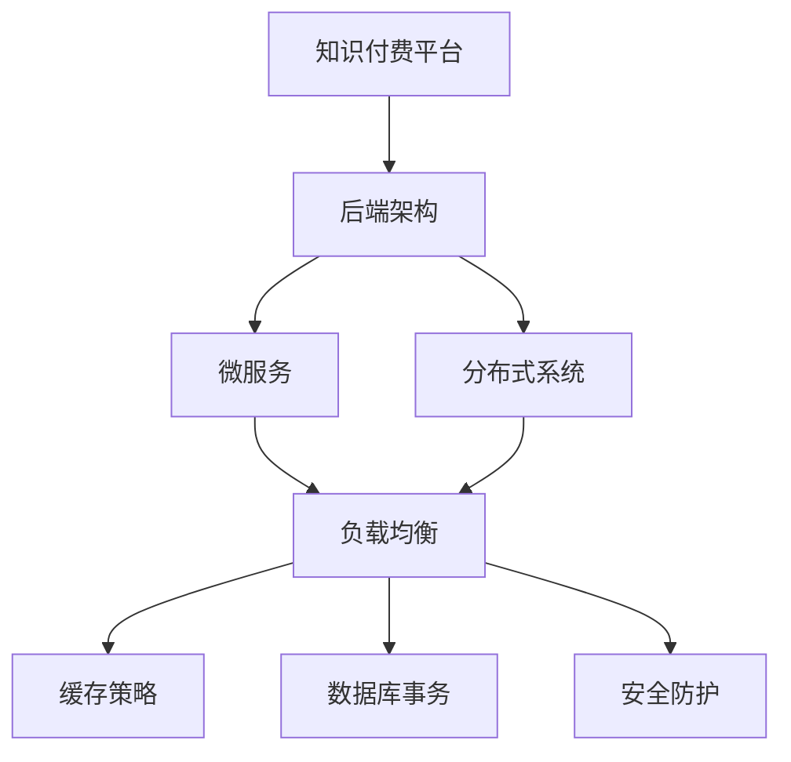

                 

# 知识付费平台的后端架构设计

> 关键词：知识付费,后端架构,微服务,分布式系统,负载均衡,缓存策略,数据库事务,安全防护

## 1. 背景介绍

### 1.1 问题由来

随着知识付费业务的快速增长，知识付费平台面临的挑战也越来越多。如何构建一个稳定、高效、可扩展的后端架构，以支撑平台不断增长的用户和内容规模，成为平台架构师和开发者的重要任务。本文将详细介绍知识付费平台后端架构的设计思路，包括系统架构、微服务拆分、数据库设计、缓存策略、安全防护等方面。

### 1.2 问题核心关键点

构建知识付费平台后端架构的关键点包括：
1. 系统架构的模块化和可扩展性。
2. 服务之间的解耦和通信效率。
3. 数据库的性能优化和数据一致性。
4. 缓存策略的选择和应用。
5. 安全防护的全面性和及时性。

解决这些问题将有助于平台后端架构的高效运行和长期稳定发展。

### 1.3 问题研究意义

系统架构设计的好坏直接影响平台的性能、可用性和可扩展性。设计一个优秀的后端架构可以：
1. 提升用户体验，保障内容服务的稳定性。
2. 降低系统维护成本，提升开发效率。
3. 为平台未来的扩展和升级提供坚实的基础。
4. 构建业务竞争力，增强平台的市场影响力。

## 2. 核心概念与联系

### 2.1 核心概念概述

为更好地理解知识付费平台后端架构设计，本节将介绍几个关键概念：

- **知识付费平台**：以在线形式提供付费内容（如文章、视频、音频等），通过订阅模式获取收益的互联网服务。
- **后端架构**：负责处理用户请求，进行业务逻辑处理和数据存储的系统架构。
- **微服务**：将后端系统拆分为多个独立运行的服务，通过轻量级通信机制（如HTTP RESTful API）实现服务间的协作。
- **分布式系统**：由多个计算机节点构成的系统，用于处理大数据量和高并发请求。
- **负载均衡**：通过分布式算法将请求均衡地分配到多个服务器节点，提升系统的处理能力和可用性。
- **缓存策略**：用于提高数据访问效率，减少数据库压力，提高系统响应速度的策略。
- **数据库事务**：确保数据一致性的机制，通过ACID（原子性、一致性、隔离性、持久性）原则保证数据操作的可靠性。
- **安全防护**：包括访问控制、数据加密、DDoS防护、API安全等，确保系统安全稳定运行。

这些核心概念之间的逻辑关系可以通过以下Mermaid流程图来展示：



这个流程图展示了一系列概念之间的关系：

1. 知识付费平台使用后端架构来处理请求和业务逻辑。
2. 后端架构通过微服务拆分和分布式系统来实现可扩展和高效处理。
3. 微服务和分布式系统使用负载均衡来提升系统性能和可用性。
4. 缓存策略用于优化数据访问效率，减轻数据库负担。
5. 数据库事务确保数据一致性，保证业务逻辑的可靠性。
6. 安全防护措施确保系统的安全稳定运行。

这些概念共同构成了知识付费平台后端架构设计的核心框架，为设计一个高性能、可扩展、安全的系统提供了理论基础。

## 3. 核心算法原理 & 具体操作步骤
### 3.1 算法原理概述

知识付费平台后端架构的设计和优化主要遵循以下原则：
- 模块化拆分：将系统拆分为多个独立的服务，便于独立开发、部署和维护。
- 通信协议：采用轻量级HTTP RESTful API，方便服务间的通信和数据交换。
- 负载均衡：通过算法均衡分配请求，提升系统的处理能力和可用性。
- 缓存策略：合理使用缓存技术，优化数据访问效率。
- 数据库事务：确保数据操作的可靠性和一致性。
- 安全防护：建立全面的安全防护体系，防止系统受到攻击。

### 3.2 算法步骤详解

构建知识付费平台后端架构的主要步骤如下：

**Step 1: 系统模块划分**
- 根据业务需求和功能模块，将系统拆分为多个独立的服务。例如，订单服务、支付服务、内容服务、用户服务、推荐服务等。
- 每个服务设计独立的API接口，封装业务逻辑，确保服务解耦。

**Step 2: 服务部署和通信**
- 使用云服务或容器化技术（如Kubernetes）实现服务的自动部署和扩展。
- 采用HTTP RESTful API作为服务间的通信协议，定义明确的请求和响应格式。
- 使用网关（如Nginx、API Gateway）对API进行路由和管理。

**Step 3: 负载均衡和分布式**
- 使用负载均衡算法（如Round Robin、Least Connections等）分配请求到多个服务节点。
- 使用分布式架构（如Zookeeper、Consul）管理服务发现和配置。
- 实现服务间的高可用和故障转移，确保系统的稳定运行。

**Step 4: 缓存策略选择**
- 根据数据访问频率和使用场景，选择合适类型的缓存（如Redis、Memcached等）。
- 设计合理的缓存规则，使用缓存穿透、缓存失效、缓存预热等技术。
- 对热点数据进行缓存，减少数据库的访问压力，提升系统响应速度。

**Step 5: 数据库设计**
- 设计合理的数据库模型，优化SQL查询，提高数据访问效率。
- 使用事务控制和锁机制，保证数据操作的可靠性和一致性。
- 定期对数据库进行性能优化，如索引优化、查询优化等。

**Step 6: 安全防护**
- 实现身份认证和访问控制，保护系统免受未授权访问。
- 对数据传输和存储进行加密处理，保护数据安全。
- 采用DDoS防护措施，防止系统遭受大流量攻击。
- 对API进行安全验证，防止SQL注入、XSS攻击等安全漏洞。

完成上述步骤后，即可构建一个稳定、高效、可扩展的知识付费平台后端架构。

### 3.3 算法优缺点

构建知识付费平台后端架构的优点：
1. 模块化和可扩展性：系统易于维护和扩展，支持快速响应业务需求变化。
2. 通信效率高：服务间通过轻量级API通信，响应速度快。
3. 高可用性：通过负载均衡和故障转移，提升系统的可用性和稳定性。
4. 数据访问效率高：合理使用缓存策略，减轻数据库负担，提高系统响应速度。
5. 数据一致性好：使用数据库事务，确保数据操作的可靠性和一致性。
6. 安全防护全面：多层次的安全防护措施，保障系统安全稳定运行。

同时，这种架构也存在一些缺点：
1. 系统复杂度增加：服务拆分和分布式系统设计增加了系统复杂度，开发和维护成本较高。
2. 性能调优难度大：多层次的架构设计带来了性能调优的挑战，需要全面优化各个环节。
3. 数据一致性风险：分布式系统设计增加了数据一致性管理的复杂性。
4. 部署和管理难度大：分布式系统需要复杂的部署和管理工具，增加了运营成本。

尽管存在这些缺点，但就目前而言，这种架构仍是构建高性能、可扩展、安全知识付费平台的主要选择。

### 3.4 算法应用领域

基于微服务的后端架构设计不仅适用于知识付费平台，还广泛应用于各种高并发、高可扩展的互联网系统。例如：

- 电商平台的商品管理系统
- 在线教育的课程管理系统
- 社交媒体的信息流系统
- 医疗系统的患者管理系统
- 金融系统的交易结算系统

这些系统都需要处理大量的请求和数据，使用基于微服务的设计思路，可以实现系统的可扩展和高效处理。

## 4. 数学模型和公式 & 详细讲解  
### 4.1 数学模型构建

为更好地理解后端架构设计的数学模型，本节将使用数学语言对相关问题进行描述。

假设知识付费平台的后端架构由 $N$ 个微服务组成，每个服务具有响应时间 $t_i$ 和可用性 $a_i$，其中 $i=1,2,...,N$。

设 $T$ 为系统总响应时间，$A$ 为系统总可用性。则系统响应时间和可用性的计算公式分别为：

$$
T = \sum_{i=1}^N t_i
$$

$$
A = \prod_{i=1}^N a_i
$$

为了提高系统性能，可以采用以下优化策略：

1. 负载均衡：通过均衡分配请求到不同服务节点，减少单个服务的响应时间，提高系统整体性能。

2. 缓存策略：对热点数据进行缓存，减少数据库访问，提升系统响应速度。

3. 数据库事务：通过事务控制，确保数据操作的可靠性和一致性，避免数据丢失和错误。

4. 安全防护：通过身份认证和访问控制，防止未授权访问，保障系统安全稳定运行。

### 4.2 公式推导过程

以下我们以缓存策略为例，推导其优化效果。

设原始查询时间为 $t$，命中缓存的数据访问时间为 $c$。则系统总响应时间为：

$$
T = t + \lambda t
$$

其中 $\lambda$ 为缓存命中率。

采用缓存策略后，系统总响应时间为：

$$
T = c + \lambda c
$$

显然，采用缓存策略后，系统总响应时间减少了 $(1-\lambda)t$。

### 4.3 案例分析与讲解

**案例1：负载均衡优化**
- 假设系统总请求量为 $Q$，每个服务的响应时间为 $t$，服务可用性为 $a$。
- 通过均衡分配请求，每个服务的平均请求量为 $\frac{Q}{N}$。
- 采用负载均衡后，系统总响应时间 $T$ 和总可用性 $A$ 分别为：

$$
T = \frac{Q}{N}t
$$

$$
A = \prod_{i=1}^N a
$$

负载均衡显著提高了系统的可用性和响应速度。

**案例2：数据库事务优化**
- 假设系统进行一次复杂的数据操作，需要执行 $M$ 条SQL语句，其中 $K$ 条为事务内部语句，$N$ 条为非事务语句。
- 不使用事务控制时，系统总响应时间为 $t_M$。
- 使用事务控制后，系统总响应时间为 $t_M$ 和事务内部语句执行时间 $t_K$ 之和。

事务控制可以确保数据操作的可靠性和一致性，避免数据丢失和错误。

## 5. 项目实践：代码实例和详细解释说明
### 5.1 开发环境搭建

在进行后端架构设计实践前，我们需要准备好开发环境。以下是使用Docker搭建微服务环境的流程：

1. 安装Docker：从官网下载并安装Docker。

2. 创建和启动容器：编写Dockerfile，构建包含应用和依赖的Docker镜像。

3. 启动Docker容器：使用Docker run命令启动容器，指定容器网络和端口映射。

4. 配置负载均衡：使用Nginx或Kubernetes等工具配置负载均衡。

完成上述步骤后，即可在Docker容器内进行微服务开发和测试。

### 5.2 源代码详细实现

下面以一个简单的订单服务为例，给出使用Spring Boot构建微服务的PyTorch代码实现。

首先，定义订单服务的接口：

```java
@RestController
@RequestMapping("/orders")
public class OrderController {
    
    @Autowired
    private OrderService orderService;
    
    @GetMapping("/{id}")
    public Order getOrderById(@PathVariable Long id) {
        return orderService.getOrderById(id);
    }
    
    @PostMapping
    public Order createOrder(@RequestBody Order order) {
        return orderService.createOrder(order);
    }
    
    @PutMapping("/{id}")
    public Order updateOrder(@PathVariable Long id, @RequestBody Order order) {
        return orderService.updateOrder(id, order);
    }
    
    @DeleteMapping("/{id}")
    public void deleteOrder(@PathVariable Long id) {
        orderService.deleteOrder(id);
    }
}
```

然后，定义订单服务的业务逻辑：

```java
@Service
public class OrderService {
    
    @Autowired
    private OrderRepository orderRepository;
    
    public Order getOrderById(Long id) {
        return orderRepository.findById(id).orElse(null);
    }
    
    public Order createOrder(Order order) {
        return orderRepository.save(order);
    }
    
    public Order updateOrder(Long id, Order order) {
        Order existingOrder = orderRepository.findById(id).orElse(null);
        if (existingOrder != null) {
            existingOrder.setOrderNo(order.getOrderNo());
            existingOrder.setOrderDate(order.getOrderDate());
            existingOrder.setCustomer(order.getCustomer());
            existingOrder.setProducts(order.getProducts());
            return orderRepository.save(existingOrder);
        } else {
            return null;
        }
    }
    
    public void deleteOrder(Long id) {
        orderRepository.deleteById(id);
    }
}
```

最后，启动微服务，测试接口功能：

```java
@SpringBootApplication
public class OrderApplication {
    
    public static void main(String[] args) {
        SpringApplication.run(OrderApplication.class, args);
    }
}
```

通过上述代码，即可构建一个简单的订单服务，并将其部署到Docker容器中，实现基本的CRUD操作。

### 5.3 代码解读与分析

让我们再详细解读一下关键代码的实现细节：

**OrderController类**：
- 定义了订单服务的CRUD接口，通过@Autowired注解注入OrderService对象。
- 使用@RequestMapping注解对接口进行路由，指定URL和请求方法。

**OrderService类**：
- 使用@Service注解定义服务类，通过@Autowired注解注入OrderRepository对象。
- 实现基本的订单业务逻辑，如获取、创建、更新、删除等操作。

**OrderApplication类**：
- 使用@SpringBootApplication注解定义Spring Boot应用程序。
- 通过SpringApplication.run方法启动Spring Boot应用程序。

这些代码展示了构建微服务的核心思路：将业务逻辑和数据访问封装在独立的业务服务中，通过RESTful API进行服务间的通信。通过Spring Boot等框架的封装，可以大大简化微服务的开发和部署过程。

当然，工业级的系统实现还需考虑更多因素，如服务间的分布式事务、调用超时、服务发现等，但核心的微服务构建思路基本与此类似。

## 6. 实际应用场景
### 6.1 智能推荐系统

知识付费平台常常使用智能推荐系统，为用户提供个性化的内容推荐。智能推荐系统通常由多个服务模块组成，包括用户画像模块、内容推荐模块、推荐算法模块等。

通过微服务拆分和分布式系统设计，可以实现各个模块的独立开发和部署，提高系统的灵活性和可扩展性。同时，通过负载均衡和缓存策略，可以提升系统的性能和可用性，保障推荐质量。

### 6.2 交易结算系统

知识付费平台的交易结算系统通常涉及支付、订单、发票等多个模块。通过微服务拆分和分布式系统设计，可以实现各个模块的独立开发和部署，提高系统的灵活性和可扩展性。同时，通过数据库事务控制和缓存策略，可以确保数据操作的可靠性和一致性，提升系统的稳定性和性能。

### 6.3 内容管理系统

知识付费平台的内容管理系统包括内容上传、审核、发布等多个模块。通过微服务拆分和分布式系统设计，可以实现各个模块的独立开发和部署，提高系统的灵活性和可扩展性。同时，通过缓存策略和负载均衡，可以提升系统的性能和可用性，保障内容发布和审核的流畅性。

### 6.4 未来应用展望

随着微服务架构和分布式系统的不断发展，基于微服务的后端架构设计将有更多应用场景，例如：

- 智慧医疗平台
- 智能制造系统
- 智能交通管理系统
- 在线教育平台
- 智能物流系统

这些系统都需要处理大量的请求和数据，使用基于微服务的设计思路，可以实现系统的可扩展和高效处理。

## 7. 工具和资源推荐
### 7.1 学习资源推荐

为了帮助开发者系统掌握微服务架构和分布式系统的设计思路，这里推荐一些优质的学习资源：

1. 《Spring Boot实战》：深入浅出地介绍了Spring Boot框架的使用方法和最佳实践，适用于初学者和进阶开发者。

2. 《微服务设计模式》：讲解了微服务架构的各种设计模式，如异步通信、服务网格、数据一致性等，帮助开发者构建高效稳定的微服务系统。

3. 《分布式系统原理与设计》：由著名计算机科学家编著，系统讲解了分布式系统的原理和设计，适合深入学习分布式系统设计。

4. 《Kubernetes实战》：介绍了Kubernetes的部署、管理和扩展方法，适用于实际生产环境中的微服务部署。

5. 《分布式事务》：讲解了分布式系统中的事务控制和优化方法，帮助开发者保障数据一致性。

通过对这些资源的学习实践，相信你一定能够快速掌握微服务架构和分布式系统的设计思路，并将其应用于实际开发中。

### 7.2 开发工具推荐

高效的开发离不开优秀的工具支持。以下是几款用于微服务开发和部署的工具：

1. Spring Boot：基于Spring框架的轻量级开发框架，适用于微服务系统的快速开发和部署。

2. Docker：用于容器化开发和部署的开放平台，支持多种操作系统和开发语言。

3. Kubernetes：开源容器编排平台，用于微服务系统的部署、管理和扩展。

4. Nginx：高性能网络服务器和反向代理，适用于负载均衡和API网关。

5. Consul：分布式服务发现和配置工具，支持服务注册和健康检查。

6. Redis：高性能内存数据库，适用于缓存和消息队列。

7. Hibernate：基于JPA规范的ORM框架，适用于数据库的访问和操作。

合理利用这些工具，可以显著提升微服务系统的开发效率，加快创新迭代的步伐。

### 7.3 相关论文推荐

微服务架构和分布式系统的发展源于学界的持续研究。以下是几篇奠基性的相关论文，推荐阅读：

1. "Design Patterns: Elements of Reusable Object-Oriented Software"：由《设计模式》作者Erwin Ullman等人合著，系统讲解了微服务架构的设计模式和最佳实践。

2. "Microservices: A Platform for Distributed Systems"：讲解了微服务架构的原理和设计方法，由Gerhard Kowalczyk等人合著。

3. "Designing Distributed Systems"：由Shlomo Elfasi等人合著，系统讲解了分布式系统的原理和设计方法。

4. "Transact: A Distributed Transaction Management System for Microservices"：介绍了分布式系统中的事务控制和优化方法，由Simon Vogt等人合著。

5. "Key Considerations for Microservices"：讲解了微服务架构的设计原则和最佳实践，由Nick pollution等人合著。

这些论文代表了大语言模型微调技术的发展脉络。通过学习这些前沿成果，可以帮助研究者把握学科前进方向，激发更多的创新灵感。

## 8. 总结：未来发展趋势与挑战
### 8.1 总结

本文对知识付费平台后端架构的设计思路进行了全面系统的介绍。首先阐述了知识付费平台后端架构的设计需求和关键点，明确了系统架构的模块化和可扩展性、服务间的解耦和通信效率、数据库的性能优化和数据一致性、缓存策略的选择和应用、安全防护的全面性和及时性等方面的重要性。其次，从原理到实践，详细讲解了微服务拆分、分布式系统设计、数据库事务控制、缓存策略优化和安全防护措施等关键步骤，给出了微服务开发的完整代码实例。同时，本文还广泛探讨了微服务架构在智能推荐系统、交易结算系统、内容管理系统等多个应用场景中的具体实现，展示了微服务架构的巨大潜力。此外，本文精选了微服务架构的相关学习资源和工具，力求为读者提供全方位的技术指引。

通过本文的系统梳理，可以看到，基于微服务架构的知识付费平台后端架构设计正在成为NLP领域的重要范式，极大地拓展了预训练语言模型的应用边界，催生了更多的落地场景。受益于大规模语料的预训练和微调方法的持续演进，相信NLP技术将在更广阔的应用领域大放异彩，深刻影响人类的生产生活方式。

### 8.2 未来发展趋势

展望未来，知识付费平台后端架构设计将呈现以下几个发展趋势：

1. 微服务架构普及化：微服务架构将在更多的行业领域得到应用，成为构建高性能、可扩展系统的主要选择。

2. 服务治理体系完善：服务治理体系将更加成熟，包括服务发现、服务路由、服务监控、服务限流等，保障系统的高可用性和稳定性。

3. 容器化部署常态化：容器化技术将进一步普及，与云服务深度融合，实现微服务的自动化部署和扩展。

4. 分布式架构优化：分布式架构将不断优化，引入新的分布式计算模型和数据管理技术，提升系统的性能和可用性。

5. 安全防护措施加强：安全防护措施将更加全面，包括多层次的身份认证、DDoS防护、API安全等，保障系统安全稳定运行。

6. 智能化运维发展：智能化运维技术将不断涌现，包括故障预测、问题定位、自动化测试等，提升系统运营效率和稳定性。

以上趋势凸显了知识付费平台后端架构设计的广阔前景。这些方向的探索发展，必将进一步提升系统的性能和用户体验，为知识付费平台的发展提供坚实的基础。

### 8.3 面临的挑战

尽管知识付费平台后端架构设计已经取得了显著成就，但在迈向更加智能化、普适化应用的过程中，它仍面临着诸多挑战：

1. 系统复杂度增加：微服务拆分和分布式系统设计增加了系统复杂度，开发和维护成本较高。

2. 性能调优难度大：多层次的架构设计带来了性能调优的挑战，需要全面优化各个环节。

3. 数据一致性风险：分布式系统设计增加了数据一致性管理的复杂性。

4. 部署和管理难度大：分布式系统需要复杂的部署和管理工具，增加了运营成本。

尽管存在这些挑战，但就目前而言，基于微服务的后端架构设计仍是构建高性能、可扩展、安全知识付费平台的主要选择。

### 8.4 研究展望

面对知识付费平台后端架构设计所面临的种种挑战，未来的研究需要在以下几个方面寻求新的突破：

1. 微服务架构优化：探索更加简洁、高效的微服务架构，减少服务间的依赖和复杂度。

2. 分布式架构优化：引入新的分布式计算模型和数据管理技术，优化微服务架构的性能和稳定性。

3. 数据一致性优化：优化分布式系统中的数据一致性管理，降低数据丢失和错误的风险。

4. 安全防护增强：建立更加全面、及时的安全防护体系，确保系统安全稳定运行。

5. 智能化运维发展：引入智能化运维技术，提升系统运营效率和稳定性。

这些研究方向的探索，必将引领知识付费平台后端架构设计迈向更高的台阶，为构建安全、可靠、可解释、可控的智能系统铺平道路。面向未来，知识付费平台后端架构设计还需要与其他人工智能技术进行更深入的融合，如知识表示、因果推理、强化学习等，多路径协同发力，共同推动自然语言理解和智能交互系统的进步。只有勇于创新、敢于突破，才能不断拓展语言模型的边界，让智能技术更好地造福人类社会。

## 9. 附录：常见问题与解答
**Q1：微服务架构是否适用于所有NLP任务？**

A: 微服务架构适用于高并发、高可扩展的NLP任务，如推荐系统、内容管理系统等。但对于一些需要强实时性、低延迟的应用场景，微服务架构可能不是最佳选择，可以考虑其他架构设计。

**Q2：如何选择合适的负载均衡算法？**

A: 负载均衡算法应根据具体的业务场景和系统需求选择合适的算法。常见的负载均衡算法包括Round Robin、Least Connections、IP Hash等。通常需要结合业务流量、服务特性等因素进行综合考虑。

**Q3：微服务架构的缓存策略有哪些？**

A: 常见的缓存策略包括Redis、Memcached等内存缓存，以及分布式缓存（如Ehcache、Hazelcast等）。根据数据访问频率和使用场景，选择合适的缓存策略，设计合理的缓存规则。

**Q4：数据库事务控制需要注意哪些问题？**

A: 数据库事务控制需要注意以下问题：
1. 锁机制的使用：合理使用锁机制，避免锁竞争和死锁。
2. 事务边界划分：明确事务边界，避免事务跨越过长的业务逻辑。
3. 数据库性能优化：合理设计SQL语句，优化索引，减少数据库访问时间。

**Q5：如何保障微服务架构的安全性？**

A: 保障微服务架构的安全性需要注意以下问题：
1. 身份认证和访问控制：实现严格的身份认证和访问控制，防止未授权访问。
2. 数据加密和传输安全：对数据进行加密处理，保护数据传输安全。
3. DDoS防护：采用DDoS防护措施，防止系统遭受大流量攻击。
4. API安全：对API进行安全验证，防止SQL注入、XSS攻击等安全漏洞。

这些研究方向的探索，必将引领知识付费平台后端架构设计迈向更高的台阶，为构建安全、可靠、可解释、可控的智能系统铺平道路。面向未来，知识付费平台后端架构设计还需要与其他人工智能技术进行更深入的融合，如知识表示、因果推理、强化学习等，多路径协同发力，共同推动自然语言理解和智能交互系统的进步。只有勇于创新、敢于突破，才能不断拓展语言模型的边界，让智能技术更好地造福人类社会。

---

作者：禅与计算机程序设计艺术 / Zen and the Art of Computer Programming

