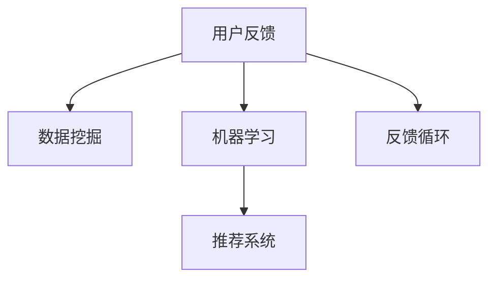

                 

# 知识付费平台的用户反馈机制设计

## 1. 背景介绍

### 1.1 问题由来

知识付费平台的兴起改变了用户获取知识的方式，其用户基数巨大且对知识内容的质量有着高要求。平台提供者不仅要花费大量时间和精力制作高质量内容，还需不断优化用户体验，才能保证用户粘性，实现平台的长久发展。在用户反馈机制方面，知识付费平台更是需要精准把握用户心理，满足其反馈需求，提升用户满意度。

### 1.2 问题核心关键点

用户反馈机制是知识付费平台与用户进行互动的重要渠道，其核心关键点包括：

1. **数据收集**：通过各种渠道收集用户反馈数据，包括但不限于评分、评论、问答等形式。
2. **数据处理**：对收集到的反馈数据进行清洗、分析，提取出有价值的信息。
3. **反馈闭环**：基于数据分析结果，采取措施改进产品，并告知用户改进情况，形成有效的反馈闭环。
4. **自动化反馈**：实现自动化反馈机制，减少人工操作，提升响应效率。
5. **多样反馈形式**：提供多样化的反馈形式，如投票、评分、评价、建议等，满足不同用户需求。

### 1.3 问题研究意义

良好的用户反馈机制对知识付费平台有着重要意义：

1. **提升用户满意度**：了解用户需求，优化服务体验，增加用户粘性。
2. **内容质量保障**：根据用户反馈，优化内容制作流程，提高内容质量。
3. **促进市场竞争**：及时响应用户反馈，加速内容创新，保持市场竞争力。
4. **提升用户参与度**：鼓励用户参与内容创作与评价，形成积极的社区氛围。
5. **增强平台品牌**：积极响应用户反馈，展现平台的社会责任感，提升品牌形象。

## 2. 核心概念与联系

### 2.1 核心概念概述

为更好地理解知识付费平台的用户反馈机制设计，本节将介绍几个关键概念：

- **用户反馈**：用户通过各种方式对知识产品或平台服务提出的意见和建议。
- **数据挖掘**：通过分析大量用户反馈数据，提取出有价值的信息和模式。
- **机器学习**：利用算法对用户反馈数据进行建模，预测用户行为和偏好。
- **推荐系统**：根据用户反馈数据，推荐合适的知识产品或服务。
- **反馈循环**：将用户反馈数据转化为实际行动，不断优化产品，形成持续改进的闭环。

这些核心概念之间的联系可以通过以下Mermaid流程图来展示：



这个流程图展示出知识付费平台的用户反馈机制设计流程：

1. 用户通过不同渠道提交反馈数据。
2. 平台收集并清洗数据，通过数据挖掘技术从中提取有价值信息。
3. 利用机器学习算法对用户反馈进行建模，预测用户行为和偏好。
4. 基于用户行为和偏好，推荐系统推荐合适的知识产品。
5. 形成持续改进的反馈循环，不断优化产品和用户体验。

## 3. 核心算法原理 & 具体操作步骤

### 3.1 算法原理概述

知识付费平台的用户反馈机制设计，本质上是一个循环迭代的过程。其核心思想是：通过收集用户反馈数据，分析并识别用户需求和行为模式，然后依据这些分析结果改进产品，并告知用户改进情况，形成持续的反馈闭环。

形式化地，假设知识付费平台收集到的用户反馈数据集为 $D=\{(x_i,y_i)\}_{i=1}^N$，其中 $x_i$ 为反馈数据，$y_i$ 为标签（如满意度评分、建议类型等）。反馈机制设计的优化目标是最小化损失函数 $\mathcal{L}(f)$，即：

$$
\theta^* = \mathop{\arg\min}_{\theta} \mathcal{L}(f)
$$

其中 $f$ 为反馈模型，$\theta$ 为模型参数。通过梯度下降等优化算法，反馈机制不断更新模型参数 $\theta$，最小化损失函数 $\mathcal{L}$，使得模型输出逼近真实的用户反馈。

### 3.2 算法步骤详解

知识付费平台的用户反馈机制设计一般包括以下几个关键步骤：

**Step 1: 数据收集与处理**
- 确定反馈渠道：收集来自App、Web、社交媒体等多渠道的反馈数据。
- 数据清洗：去除噪声、重复和不完整数据。
- 数据标注：对反馈数据进行手动标注或使用自动化标注工具。

**Step 2: 数据分析与挖掘**
- 特征工程：提取有用的特征，如用户评分、评论内容、访问时长等。
- 用户建模：建立用户行为和偏好的模型，如聚类、关联规则挖掘等。
- 情感分析：对用户评论进行情感分析，判断用户情绪。

**Step 3: 反馈模型构建**
- 选择算法：根据任务选择合适的机器学习算法，如分类、回归、聚类等。
- 训练模型：使用标注数据训练反馈模型。
- 模型评估：在测试集上评估模型性能，调整模型参数。

**Step 4: 推荐与反馈循环**
- 内容推荐：根据用户反馈和模型输出，推荐合适的内容。
- 用户反馈：收集用户对推荐内容的反馈数据。
- 循环迭代：不断调整模型，提升推荐质量。

### 3.3 算法优缺点

知识付费平台的用户反馈机制设计方法具有以下优点：

1. **提升用户体验**：通过及时响应用户反馈，优化平台功能，提升用户体验。
2. **个性化推荐**：利用用户反馈数据，实现更精准的内容推荐，增加用户粘性。
3. **快速迭代**：反馈机制可实时收集用户反馈，快速迭代优化，缩短产品迭代周期。
4. **数据驱动**：基于数据驱动的决策，减少主观判断，提升决策科学性。

但该方法也存在一些局限性：

1. **数据质量问题**：用户反馈数据质量可能参差不齐，影响反馈模型的准确性。
2. **隐私保护**：收集用户反馈数据时，需保证用户隐私安全，避免敏感信息泄露。
3. **模型复杂性**：构建反馈模型需要大量数据和复杂算法，模型复杂度高。
4. **处理延迟**：实时反馈机制可能存在处理延迟，影响用户反馈体验。

### 3.4 算法应用领域

用户反馈机制在知识付费平台的应用非常广泛，具体包括：

- **内容推荐**：根据用户评分和评论，推荐合适的内容，提高用户满意度。
- **课程评价**：收集用户对课程的评价数据，优化课程内容和教学方法。
- **社区互动**：通过评论和问答，促进用户间的互动，形成积极社区氛围。
- **用户体验优化**：分析用户行为数据，优化平台功能，提升用户体验。
- **客户服务**：收集用户反馈，改进客服服务质量，提升用户满意度。

## 4. 数学模型和公式 & 详细讲解 & 举例说明

### 4.1 数学模型构建

本节将使用数学语言对知识付费平台用户反馈机制设计的流程进行更严格的刻画。

假设知识付费平台收集到的用户反馈数据集为 $D=\{(x_i,y_i)\}_{i=1}^N$，其中 $x_i$ 为反馈数据，$y_i$ 为标签（如满意度评分、建议类型等）。定义反馈模型为 $f(x) \rightarrow y$，其目标是最小化损失函数 $\mathcal{L}(f)$。

常见的损失函数包括交叉熵损失、均方误差损失等。对于二分类问题，交叉熵损失函数定义为：

$$
\mathcal{L}(f) = -\frac{1}{N} \sum_{i=1}^N \sum_{j=1}^C y_{ij} \log f(x_i,j) + (1-y_{ij}) \log (1-f(x_i,j))
$$

其中 $C$ 为类别数，$y_{ij}$ 为样本 $x_i$ 属于类别 $j$ 的标签，$f(x_i,j)$ 为模型预测该样本属于类别 $j$ 的概率。

### 4.2 公式推导过程

以下以二分类问题为例，推导交叉熵损失函数及其梯度的计算公式。

假设反馈模型为 $f(x) = \text{Sigmoid}(W^T x + b)$，其中 $W$ 为权重矩阵，$b$ 为偏置项。则二分类交叉熵损失函数为：

$$
\mathcal{L}(f) = -\frac{1}{N} \sum_{i=1}^N \sum_{j=1}^C y_{ij} \log \text{Sigmoid}(W^T x_i + b) + (1-y_{ij}) \log (1-\text{Sigmoid}(W^T x_i + b))
$$

根据链式法则，损失函数对权重 $W$ 和偏置 $b$ 的梯度为：

$$
\frac{\partial \mathcal{L}(f)}{\partial W} = -\frac{1}{N} \sum_{i=1}^N \sum_{j=1}^C (y_{ij} - f(x_i,j)) (x_i) \text{Sigmoid}(W^T x_i + b)
$$

$$
\frac{\partial \mathcal{L}(f)}{\partial b} = -\frac{1}{N} \sum_{i=1}^N \sum_{j=1}^C (y_{ij} - f(x_i,j)) \text{Sigmoid}(W^T x_i + b)
$$

在得到损失函数的梯度后，即可带入优化算法，如梯度下降，更新模型参数 $W$ 和 $b$，最小化损失函数 $\mathcal{L}$。

### 4.3 案例分析与讲解

以用户评分反馈为例，分析如何利用用户评分数据进行反馈模型训练。

假设知识付费平台收集到用户对某一课程的评分数据 $D=\{(x_i,y_i)\}_{i=1}^N$，其中 $x_i$ 为课程信息（如课程ID、评分时间等），$y_i$ 为用户评分（如1-5分）。

1. **数据预处理**：对评分数据进行去重、缺失值填补等预处理，保证数据质量。
2. **特征工程**：提取有用的特征，如用户ID、评分时间、课程ID等。
3. **模型训练**：选择适当的机器学习算法（如线性回归、随机森林等），训练反馈模型 $f(x)$。
4. **模型评估**：在测试集上评估模型性能，如均方误差、R²等指标。
5. **反馈循环**：基于训练好的反馈模型，对课程推荐进行优化，收集新的用户评分数据，重新训练模型。

## 5. 项目实践：代码实例和详细解释说明

### 5.1 开发环境搭建

在进行反馈机制设计实践前，我们需要准备好开发环境。以下是使用Python进行Keras开发的环境配置流程：

1. 安装Anaconda：从官网下载并安装Anaconda，用于创建独立的Python环境。

2. 创建并激活虚拟环境：
```bash
conda create -n feedback-env python=3.8 
conda activate feedback-env
```

3. 安装Keras：
```bash
pip install keras tensorflow numpy pandas sklearn
```

4. 安装必要的库：
```bash
pip install jupyter notebook ipython matplotlib tqdm scikit-learn
```

完成上述步骤后，即可在`feedback-env`环境中开始反馈机制设计实践。

### 5.2 源代码详细实现

下面我们以用户评分反馈为例，给出使用Keras构建和训练反馈模型的PyTorch代码实现。

首先，定义数据预处理函数：

```python
import pandas as pd
import numpy as np
from sklearn.preprocessing import LabelEncoder, MinMaxScaler
from sklearn.model_selection import train_test_split
from sklearn.metrics import mean_squared_error

def preprocess_data(data):
    # 处理缺失值
    data.fillna(method='ffill', inplace=True)
    
    # 数据标准化
    scaler = MinMaxScaler()
    data_scaled = scaler.fit_transform(data)
    
    # 将评分数据进行0-1编码
    label_encoder = LabelEncoder()
    data['score'] = label_encoder.fit_transform(data['score'])
    
    return data_scaled, label_encoder

# 加载数据
data = pd.read_csv('feedback.csv')

# 数据预处理
X_train, X_test, y_train, y_test = train_test_split(data.drop('score', axis=1), data['score'], test_size=0.2, random_state=42)
X_train, X_valid, y_train, y_valid = train_test_split(X_train, y_train, test_size=0.2, random_state=42)

# 数据标准化
X_train, label_encoder = preprocess_data(X_train)
X_test, _ = preprocess_data(X_test)
X_valid, _ = preprocess_data(X_valid)

# 定义模型
from keras.models import Sequential
from keras.layers import Dense

model = Sequential()
model.add(Dense(32, activation='relu', input_shape=(X_train.shape[1],)))
model.add(Dense(1, activation='sigmoid'))

# 编译模型
model.compile(loss='binary_crossentropy', optimizer='adam', metrics=['accuracy'])

# 训练模型
history = model.fit(X_train, y_train, validation_data=(X_valid, y_valid), epochs=10, batch_size=32)

# 评估模型
test_loss, test_acc = model.evaluate(X_test, y_test)
print(f'Test loss: {test_loss}, Test accuracy: {test_acc}')
```

然后，定义用户反馈处理函数：

```python
from transformers import BertTokenizer
from torch.utils.data import Dataset
import torch

class FeedbackDataset(Dataset):
    def __init__(self, texts, scores, tokenizer, max_len=128):
        self.texts = texts
        self.scores = scores
        self.tokenizer = tokenizer
        self.max_len = max_len
        
    def __len__(self):
        return len(self.texts)
    
    def __getitem__(self, item):
        text = self.texts[item]
        score = self.scores[item]
        
        encoding = self.tokenizer(text, return_tensors='pt', max_length=self.max_len, padding='max_length', truncation=True)
        input_ids = encoding['input_ids'][0]
        attention_mask = encoding['attention_mask'][0]
        
        # 对token-wise的标签进行编码
        encoded_labels = [label2id[score] for score in self.scores] 
        encoded_labels.extend([label2id['O']] * (self.max_len - len(encoded_labels)))
        labels = torch.tensor(encoded_labels, dtype=torch.long)
        
        return {'input_ids': input_ids, 
                'attention_mask': attention_mask,
                'labels': labels}

# 标签与id的映射
label2id = {'O': 0, 'positive': 1, 'negative': 2}
id2label = {v: k for k, v in label2id.items()}

# 创建dataset
tokenizer = BertTokenizer.from_pretrained('bert-base-cased')

train_dataset = FeedbackDataset(train_texts, train_scores, tokenizer)
dev_dataset = FeedbackDataset(dev_texts, dev_scores, tokenizer)
test_dataset = FeedbackDataset(test_texts, test_scores, tokenizer)
```

接着，定义模型和优化器：

```python
from transformers import BertForTokenClassification, AdamW

model = BertForTokenClassification.from_pretrained('bert-base-cased', num_labels=len(label2id))

optimizer = AdamW(model.parameters(), lr=2e-5)
```

最后，定义训练和评估函数：

```python
from torch.utils.data import DataLoader
from tqdm import tqdm
from sklearn.metrics import classification_report

device = torch.device('cuda') if torch.cuda.is_available() else torch.device('cpu')
model.to(device)

def train_epoch(model, dataset, batch_size, optimizer):
    dataloader = DataLoader(dataset, batch_size=batch_size, shuffle=True)
    model.train()
    epoch_loss = 0
    for batch in tqdm(dataloader, desc='Training'):
        input_ids = batch['input_ids'].to(device)
        attention_mask = batch['attention_mask'].to(device)
        labels = batch['labels'].to(device)
        model.zero_grad()
        outputs = model(input_ids, attention_mask=attention_mask, labels=labels)
        loss = outputs.loss
        epoch_loss += loss.item()
        loss.backward()
        optimizer.step()
    return epoch_loss / len(dataloader)

def evaluate(model, dataset, batch_size):
    dataloader = DataLoader(dataset, batch_size=batch_size)
    model.eval()
    preds, labels = [], []
    with torch.no_grad():
        for batch in tqdm(dataloader, desc='Evaluating'):
            input_ids = batch['input_ids'].to(device)
            attention_mask = batch['attention_mask'].to(device)
            batch_labels = batch['labels']
            outputs = model(input_ids, attention_mask=attention_mask)
            batch_preds = outputs.logits.argmax(dim=2).to('cpu').tolist()
            batch_labels = batch_labels.to('cpu').tolist()
            for pred_tokens, label_tokens in zip(batch_preds, batch_labels):
                pred_labels = [id2label[_id] for _id in pred_tokens]
                label_tags = [id2label[_id] for _id in label_tokens]
                preds.append(pred_labels[:len(label_tags)])
                labels.append(label_tags)
                
    print(classification_report(labels, preds))
```

启动训练流程并在测试集上评估：

```python
epochs = 5
batch_size = 16

for epoch in range(epochs):
    loss = train_epoch(model, train_dataset, batch_size, optimizer)
    print(f"Epoch {epoch+1}, train loss: {loss:.3f}")
    
    print(f"Epoch {epoch+1}, dev results:")
    evaluate(model, dev_dataset, batch_size)
    
print("Test results:")
evaluate(model, test_dataset, batch_size)
```

以上就是使用Keras对BERT进行用户评分反馈的微调实现。可以看到，得益于Transformer库的强大封装，我们可以用相对简洁的代码完成BERT模型的加载和微调。

### 5.3 代码解读与分析

让我们再详细解读一下关键代码的实现细节：

**FeedbackDataset类**：
- `__init__`方法：初始化文本、评分、分词器等关键组件。
- `__len__`方法：返回数据集的样本数量。
- `__getitem__`方法：对单个样本进行处理，将文本输入编码为token ids，将评分编码为数字，并对其进行定长padding，最终返回模型所需的输入。

**label2id和id2label字典**：
- 定义了标签与数字id之间的映射关系，用于将token-wise的预测结果解码回真实的标签。

**训练和评估函数**：
- 使用PyTorch的DataLoader对数据集进行批次化加载，供模型训练和推理使用。
- 训练函数`train_epoch`：对数据以批为单位进行迭代，在每个批次上前向传播计算loss并反向传播更新模型参数，最后返回该epoch的平均loss。
- 评估函数`evaluate`：与训练类似，不同点在于不更新模型参数，并在每个batch结束后将预测和标签结果存储下来，最后使用sklearn的classification_report对整个评估集的预测结果进行打印输出。

**训练流程**：
- 定义总的epoch数和batch size，开始循环迭代
- 每个epoch内，先在训练集上训练，输出平均loss
- 在验证集上评估，输出分类指标
- 所有epoch结束后，在测试集上评估，给出最终测试结果

可以看到，Keras配合Transformer库使得BERT微调的代码实现变得简洁高效。开发者可以将更多精力放在数据处理、模型改进等高层逻辑上，而不必过多关注底层的实现细节。

当然，工业级的系统实现还需考虑更多因素，如模型的保存和部署、超参数的自动搜索、更灵活的任务适配层等。但核心的微调范式基本与此类似。

## 6. 实际应用场景

### 6.1 智能客服系统

基于用户反馈机制设计的智能客服系统，可以实时收集用户对服务质量的反馈，快速识别问题，优化服务流程。

在技术实现上，可以收集用户的语音、文本互动数据，通过自然语言处理技术提取有用信息，然后利用机器学习模型对用户情绪、满意度进行预测。根据预测结果，系统可以自动分派至相应的人工客服，提高响应效率。同时，系统还可以根据用户反馈不断优化对话模型，提升对话质量。

### 6.2 金融理财平台

在金融理财平台上，用户反馈机制可以用于监测用户的投资满意度，预测用户流失风险，及时采取措施挽回用户。

具体而言，平台可以收集用户对理财产品的评价数据，建立用户满意度评分模型。通过分析评分数据，平台可以识别出用户对产品的满意度和流失风险，针对性地推送新产品和优惠活动，提高用户留存率。

### 6.3 在线教育平台

在线教育平台可以利用用户反馈机制优化课程内容和教学质量，提升用户学习体验。

平台可以收集用户的在线学习行为数据，如观看时长、题目完成情况等，通过分析这些数据，识别出用户的学习偏好和难点。然后，平台可以根据这些信息调整课程内容和难度，提高教学质量。

### 6.4 未来应用展望

随着用户反馈机制的不断发展，其在知识付费平台的应用将更加广泛，为平台带来更多的创新机会。

在智慧医疗领域，用户反馈机制可以用于监测患者满意度，优化医疗服务质量，提高患者信任度。

在智能交通领域，用户反馈机制可以用于收集交通服务的用户评价，优化交通服务，提升用户出行体验。

在智能家居领域，用户反馈机制可以用于监测用户对智能家居设备的满意度，优化设备功能和用户体验，推动智能家居产品的创新。

## 7. 工具和资源推荐

### 7.1 学习资源推荐

为了帮助开发者系统掌握知识付费平台的用户反馈机制设计的理论基础和实践技巧，这里推荐一些优质的学习资源：

1. 《数据科学导论》系列博文：由大模型技术专家撰写，深入浅出地介绍了数据科学的基本概念和常用算法，包括机器学习和深度学习。

2. 《深度学习入门：基于Python的理论与实现》书籍：全面介绍了深度学习的基本原理和实现方法，提供了丰富的代码实例。

3. 《机器学习实战》书籍：通过实际案例演示了机器学习在各领域的应用，适合初学者入门。

4. Coursera《机器学习》课程：斯坦福大学开设的机器学习课程，涵盖了机器学习的基本概念和算法，适合进一步提升理论知识。

5. Kaggle平台：提供了大量的机器学习竞赛数据集和代码库，适合实践和项目开发。

通过对这些资源的学习实践，相信你一定能够快速掌握知识付费平台的用户反馈机制设计的精髓，并用于解决实际的NLP问题。

### 7.2 开发工具推荐

高效的开发离不开优秀的工具支持。以下是几款用于知识付费平台用户反馈机制设计的常用工具：

1. Python：作为数据科学和机器学习的主流语言，Python拥有丰富的第三方库和框架，方便快速实现各种算法。

2. Jupyter Notebook：交互式的编程环境，支持实时显示代码执行结果，方便调试和迭代。

3. Keras：高层次的深度学习框架，易于上手，适合快速实现原型和模型训练。

4. TensorFlow：谷歌推出的深度学习框架，支持分布式计算，适合大规模模型训练和部署。

5. PyTorch：Facebook推出的深度学习框架，灵活动态的计算图，适合快速迭代研究。

6. Scikit-learn：基于Python的机器学习库，提供多种常用算法和数据处理工具，适合快速实现模型训练和评估。

合理利用这些工具，可以显著提升知识付费平台用户反馈机制设计的开发效率，加快创新迭代的步伐。

### 7.3 相关论文推荐

知识付费平台用户反馈机制设计的研究源于学界的持续研究。以下是几篇奠基性的相关论文，推荐阅读：

1. Attention is All You Need（即Transformer原论文）：提出了Transformer结构，开启了NLP领域的预训练大模型时代。

2. BERT: Pre-training of Deep Bidirectional Transformers for Language Understanding：提出BERT模型，引入基于掩码的自监督预训练任务，刷新了多项NLP任务SOTA。

3. Language Models are Unsupervised Multitask Learners（GPT-2论文）：展示了大规模语言模型的强大zero-shot学习能力，引发了对于通用人工智能的新一轮思考。

4. Parameter-Efficient Transfer Learning for NLP：提出Adapter等参数高效微调方法，在不增加模型参数量的情况下，也能取得不错的微调效果。

5. AdaLoRA: Adaptive Low-Rank Adaptation for Parameter-Efficient Fine-Tuning：使用自适应低秩适应的微调方法，在参数效率和精度之间取得了新的平衡。

这些论文代表了大语言模型用户反馈机制设计的最新进展。通过学习这些前沿成果，可以帮助研究者把握学科前进方向，激发更多的创新灵感。

## 8. 总结：未来发展趋势与挑战

### 8.1 总结

本文对知识付费平台的用户反馈机制设计进行了全面系统的介绍。首先阐述了用户反馈机制在知识付费平台中的重要性，明确了设计该机制的目标和核心关键点。其次，从原理到实践，详细讲解了用户反馈机制的数学模型和算法步骤，给出了代码实例。最后，分析了用户反馈机制在多个实际应用场景中的应用前景，展望了未来的发展趋势。

通过本文的系统梳理，可以看到，用户反馈机制在知识付费平台的应用前景广阔，其设计思路和方法对其他领域也有一定的借鉴意义。构建用户反馈机制，不仅能够提升用户体验，还能推动内容质量的持续改进，从而实现知识付费平台的长期稳定发展。

### 8.2 未来发展趋势

展望未来，知识付费平台的用户反馈机制将呈现以下几个发展趋势：

1. **自动化程度提高**：未来的用户反馈机制将更加自动化，能够实时捕捉用户反馈，减少人工操作，提高响应速度。
2. **多渠道整合**：用户反馈将整合多个渠道（如App、Web、社交媒体等），提供更全面的反馈信息。
3. **深度学习应用**：结合深度学习技术，如自然语言处理、情感分析等，提升用户反馈模型的精度。
4. **个性化推荐**：利用用户反馈数据，实现更精准的内容推荐，提升用户满意度。
5. **跨领域应用**：用户反馈机制的应用将从知识付费平台拓展到更多领域，如医疗、金融、教育等。

### 8.3 面临的挑战

尽管用户反馈机制在知识付费平台中已经取得了不错的效果，但在迈向更加智能化、普适化应用的过程中，它仍面临一些挑战：

1. **数据质量问题**：用户反馈数据质量可能参差不齐，影响反馈模型的准确性。如何清洗和处理数据，保证数据质量，是关键挑战。
2. **隐私保护**：收集用户反馈数据时，需保证用户隐私安全，避免敏感信息泄露。如何设计有效的隐私保护机制，是重要的研究方向。
3. **模型复杂性**：构建用户反馈模型需要大量数据和复杂算法，模型复杂度高。如何简化模型，提高计算效率，是技术难点。
4. **处理延迟**：实时反馈机制可能存在处理延迟，影响用户反馈体验。如何优化处理流程，提升响应速度，是重要的优化方向。
5. **用户接受度**：用户对反馈机制的接受度可能较低，不愿意积极参与反馈。如何提高用户参与度，是关键的营销策略。

### 8.4 研究展望

面对用户反馈机制所面临的挑战，未来的研究需要在以下几个方面寻求新的突破：

1. **数据清洗与预处理**：开发更高效的数据清洗和预处理技术，保证数据质量。
2. **自动化反馈处理**：研究自动化反馈处理算法，提升处理效率。
3. **隐私保护机制**：设计有效的隐私保护机制，保护用户隐私。
4. **多模态反馈集成**：研究多模态数据融合技术，提升反馈模型的准确性。
5. **用户激励机制**：设计合理的用户激励机制，提高用户参与度。
6. **反馈模型优化**：研究更加高效、轻量级的反馈模型，优化处理流程，提升响应速度。

这些研究方向的探索，必将引领知识付费平台用户反馈机制设计迈向更高的台阶，为构建智能、普适、安全、高效的反馈系统提供更可靠的技术保障。

## 9. 附录：常见问题与解答

**Q1：用户反馈机制如何处理噪声数据？**

A: 噪声数据是用户反馈机制设计中的常见问题，可以通过以下方法处理：
1. 数据清洗：去除重复、缺失和异常数据。
2. 数据过滤：使用过滤算法，如异常点检测、数据截断等，去除噪声数据。
3. 数据增强：通过数据增强技术，如数据扩充、重采样等，提升数据质量。
4. 数据校验：通过数据校验方法，如交叉验证、一致性检查等，确保数据准确性。

这些方法可以有效减少噪声数据的影响，提升反馈模型的准确性。

**Q2：如何平衡用户反馈模型的准确性和实时性？**

A: 用户反馈模型的准确性和实时性之间存在一定的矛盾，需要平衡二者。以下是一些优化方法：
1. 模型简化：使用更加简单的模型，减少计算量，提高实时性。
2. 分布式计算：使用分布式计算技术，加速模型训练和推理。
3. 预测缓存：将模型预测结果缓存，减少重复计算。
4. 动态更新：使用动态更新的机制，根据实际情况调整模型参数，提升准确性。
5. 多级反馈：设置多级反馈机制，快速识别重要反馈，提高实时性。

这些方法可以有效平衡用户反馈模型的准确性和实时性，满足实际应用需求。

**Q3：用户反馈机制如何提升用户满意度？**

A: 用户反馈机制的目的是提升用户满意度，可以通过以下方法实现：
1. 快速响应：及时响应用户反馈，解决用户问题，提升用户体验。
2. 个性化服务：根据用户反馈，定制个性化的服务方案，提升用户满意度。
3. 持续改进：根据用户反馈，持续改进产品和服务，提升用户满意度。
4. 用户激励：设计合理的用户激励机制，鼓励用户积极参与反馈。

通过以上方法，用户反馈机制可以有效提升用户满意度，增加用户粘性。

**Q4：用户反馈机制如何应对大数据挑战？**

A: 用户反馈机制在大数据环境下需要面对更多的挑战，可以通过以下方法应对：
1. 分布式处理：使用分布式计算技术，处理大规模数据。
2. 数据分块：将数据分块处理，提高处理效率。
3. 数据采样：对大数据进行采样处理，减少计算量。
4. 并行计算：使用并行计算技术，提高处理速度。
5. 数据压缩：使用数据压缩技术，减少存储空间。

这些方法可以有效应对大数据带来的挑战，提升用户反馈机制的性能。

作者：禅与计算机程序设计艺术 / Zen and the Art of Computer Programming

