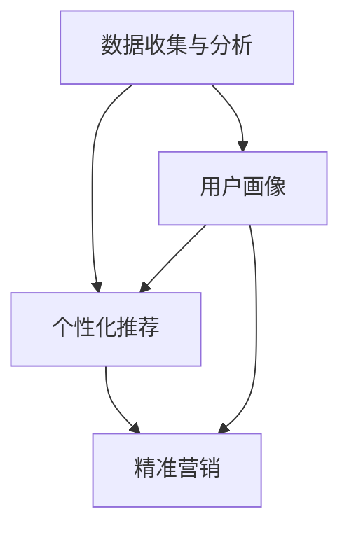

                 

# 知识付费平台的用户画像与精准营销

> 关键词：知识付费, 用户画像, 精准营销, 数据分析, 模型优化

## 1. 背景介绍

### 1.1 问题由来
随着互联网的发展和智能手机的普及，知识付费行业经历了爆发式增长。越来越多的用户开始选择订阅优质的内容，以获取知识、技能和见解，从而在职业发展、生活提升等方面获得更多优势。知识付费平台，如得到、知乎、网易有道等，应运而生，凭借丰富的内容和良好的用户体验，赢得了大批忠实用户。

然而，用户增长和用户留存一直是知识付费平台面临的主要挑战。如何精准定位用户，提高用户的参与度和付费率，成为平台的核心课题。用户画像（User Persona）的构建和精准营销（Precision Marketing）的实施，正是在这一背景下提出并逐渐成熟的解决方案。通过深入分析用户行为数据，并结合机器学习算法，知识付费平台能够更好地了解用户需求，从而提供个性化的服务，实现精准的营销推广。

### 1.2 问题核心关键点
用户画像与精准营销的核心关键点在于：
1. **数据收集与分析**：收集用户行为、兴趣、社交、人口统计等多维数据，进行详细分析和建模。
2. **模型训练与优化**：使用机器学习算法训练用户画像模型，并对模型进行优化，提高预测精度。
3. **个性化服务**：基于用户画像，提供定制化推荐、内容匹配、活动设计等服务，提升用户体验和平台粘性。
4. **精准营销**：通过用户画像分析，进行针对性的广告投放、邮件营销、社交媒体推广等，提高营销效率和效果。

### 1.3 问题研究意义
构建用户画像和实施精准营销，对于知识付费平台的可持续发展具有重要意义：
1. **提高用户留存**：通过个性化推荐和服务，满足用户需求，提高用户粘性和平台留存率。
2. **增加用户付费**：精准定位潜在付费用户，设计高价值的内容和优惠活动，推动用户付费转化。
3. **提升运营效率**：自动化分析用户数据，实时调整营销策略，优化资源配置，降低运营成本。
4. **增强市场竞争力**：精准了解用户需求，快速响应市场变化，在激烈竞争中占据优势。

## 2. 核心概念与联系

### 2.1 核心概念概述

为了更好地理解用户画像与精准营销的原理和流程，本节将介绍几个密切相关的核心概念：

- **用户画像（User Persona）**：对用户基本信息、行为偏好、兴趣爱好的全面描述，通过数据建模和分析得出。
- **个性化推荐（Personalized Recommendation）**：根据用户画像，推荐符合用户需求的内容、活动等，提升用户满意度和参与度。
- **精准营销（Precision Marketing）**：通过用户画像，进行有针对性的广告投放、活动推广等，提升营销效果，降低运营成本。
- **数据分析（Data Analysis）**：收集、处理和分析用户行为数据，提取有价值的信息，支持用户画像构建和精准营销实施。
- **模型优化（Model Optimization）**：使用机器学习算法训练用户画像模型，并对模型进行优化，提高预测精度。

这些核心概念之间的逻辑关系可以通过以下Mermaid流程图来展示：



这个流程图展示了一系列关键步骤：
1. **数据收集与分析**：获取用户行为数据，并进行详细分析。
2. **用户画像**：基于分析结果，构建用户画像。
3. **个性化推荐**：使用用户画像进行个性化内容推荐。
4. **精准营销**：通过用户画像进行精准营销推广。

## 3. 核心算法原理 & 具体操作步骤
### 3.1 算法原理概述

用户画像与精准营销的核心算法原理是基于机器学习的用户行为预测。其核心思想是：通过收集和分析用户行为数据，构建用户画像，并在此基础上进行个性化推荐和精准营销。

具体来说，算法流程如下：

1. **数据收集与预处理**：收集用户行为数据（如浏览记录、购买记录、评分记录等），并进行数据清洗和预处理。
2. **特征工程**：从原始数据中提取有意义的特征，如用户活跃度、兴趣偏好、行为时间等。
3. **用户画像建模**：使用机器学习算法（如协同过滤、内容过滤等）构建用户画像，描述用户的基本特征和行为模式。
4. **个性化推荐**：基于用户画像，使用推荐算法（如基于协同过滤、内容过滤、混合推荐等）进行个性化推荐，提升用户满意度。
5. **精准营销**：通过用户画像分析，进行有针对性的广告投放、活动推广等，提高营销效果。

### 3.2 算法步骤详解

**Step 1: 数据收集与预处理**
- 使用日志、用户行为数据API等手段，收集用户行为数据。
- 对数据进行清洗和处理，去除重复、异常数据，填补缺失值。
- 对数据进行标准化和归一化，便于后续的模型训练。

**Step 2: 特征工程**
- 提取用户基本信息（如年龄、性别、地域等）和行为特征（如浏览时长、购买频率等）。
- 使用特征选择算法（如卡方检验、互信息等），选择与推荐目标相关性高的特征。
- 使用特征降维算法（如主成分分析、线性判别分析等），减少特征数量，提高模型效率。

**Step 3: 用户画像建模**
- 使用协同过滤算法（如基于用户的协同过滤、基于物品的协同过滤等），构建用户画像，描述用户的兴趣偏好和行为模式。
- 使用内容过滤算法（如基于内容的推荐、基于深度学习的推荐等），分析用户对内容的偏好，生成个性化推荐列表。
- 使用混合推荐算法（如加权协同过滤、混合协同过滤等），综合利用多种推荐算法，提升推荐效果。

**Step 4: 个性化推荐**
- 使用推荐算法（如基于协同过滤、基于内容的推荐等），对用户进行个性化推荐。
- 对推荐结果进行评估和优化，使用A/B测试等手段，评估推荐效果。
- 根据用户反馈，实时调整推荐算法，提高推荐准确性。

**Step 5: 精准营销**
- 基于用户画像，分析用户群体特征和行为模式，进行精准营销推广。
- 使用营销自动化工具，进行有针对性的广告投放和活动设计。
- 实时监控营销效果，分析用户反馈，不断优化营销策略。

### 3.3 算法优缺点

用户画像与精准营销方法具有以下优点：
1. **个性化服务**：通过用户画像，提供定制化推荐和服务，提升用户体验和平台粘性。
2. **精准营销**：通过用户画像，进行有针对性的广告投放和活动推广，提高营销效果。
3. **用户留存**：通过个性化推荐和服务，满足用户需求，提高用户留存率。
4. **运营效率**：自动化分析用户数据，实时调整营销策略，优化资源配置。

同时，该方法也存在一定的局限性：
1. **数据隐私问题**：用户数据的收集和分析可能涉及隐私问题，需采取数据脱敏和隐私保护措施。
2. **数据质量和完整性**：用户数据的准确性和完整性直接影响模型效果，需对数据质量进行严格把控。
3. **推荐算法复杂性**：推荐算法的设计和实现较为复杂，需投入较多时间和资源进行优化。
4. **模型泛化能力**：用户画像模型的泛化能力不足，可能影响对新用户的推荐效果。
5. **营销成本**：精准营销推广的成本较高，需根据实际效果进行合理预算。

尽管存在这些局限性，但就目前而言，用户画像与精准营销方法是知识付费平台实现用户留存和运营优化的重要手段。未来相关研究的重点在于如何进一步提高模型的泛化能力和推荐效率，同时兼顾隐私保护和数据质量。

### 3.4 算法应用领域

用户画像与精准营销方法在知识付费平台的实际应用中，具体场景包括：

- **个性化内容推荐**：根据用户画像，推荐用户感兴趣的文章、课程、书籍等内容，提高用户满意度和参与度。
- **精准广告投放**：通过用户画像，进行有针对性的广告投放，提升广告效果，降低成本。
- **活动设计**：基于用户画像，设计符合用户需求的活动和优惠，吸引用户参与，提升平台活跃度。
- **用户流失预警**：实时监控用户行为数据，分析用户流失趋势，及时采取措施，减少用户流失。

这些应用场景展示了用户画像与精准营销的广泛应用，极大地提升了知识付费平台的运营效率和用户体验。

## 4. 数学模型和公式 & 详细讲解 & 举例说明
### 4.1 数学模型构建

基于用户画像与精准营销的核心算法原理，我们构建以下数学模型：

设用户集合为 $U=\{u_1,u_2,...,u_n\}$，物品集合为 $I=\{i_1,i_2,...,i_m\}$，用户与物品的评分矩阵为 $R\in\mathbb{R}^{n\times m}$，用户画像模型为 $P$，个性化推荐模型为 $F$，精准营销模型为 $M$。

模型的目标是通过最大化推荐效果和营销效果，最小化用户流失率，实现用户画像的构建和精准营销。

$$
\maximize R(F(P),U,I)
$$

$$
\minimize R(U,I,M)
$$

其中 $R(U,I,M)$ 表示用户流失率，$R(F(P),U,I)$ 表示推荐效果和营销效果。

### 4.2 公式推导过程

下面我们以基于协同过滤的个性化推荐模型为例，推导推荐效果的计算公式。

设用户 $u_i$ 对物品 $i_j$ 的评分向量为 $r_{u_i}$，用户画像模型 $P$ 的预测评分向量为 $\hat{r}_{u_i}$，则推荐效果 $R_{u_i}$ 定义为：

$$
R_{u_i} = \frac{1}{m}\sum_{j=1}^m (\hat{r}_{u_i}[i_j]-r_{u_i}[i_j])^2
$$

其中 $\hat{r}_{u_i}[i_j]$ 表示用户画像模型对物品 $i_j$ 的预测评分，$r_{u_i}[i_j]$ 表示用户 $u_i$ 对物品 $i_j$ 的实际评分。

目标是最小化推荐效果与实际评分的差异，即：

$$
\minimize \sum_{i=1}^n R_{u_i}
$$

推导过程如下：

1. **数据收集与预处理**
- 收集用户行为数据，进行数据清洗和预处理。
- 提取用户基本信息和行为特征，进行特征选择和降维。

2. **用户画像建模**
- 使用协同过滤算法（如基于用户的协同过滤、基于物品的协同过滤等），构建用户画像模型。
- 使用内容过滤算法（如基于内容的推荐、基于深度学习的推荐等），分析用户对内容的偏好。

3. **个性化推荐**
- 使用推荐算法（如基于协同过滤、基于内容的推荐等），对用户进行个性化推荐。
- 对推荐结果进行评估和优化，使用A/B测试等手段，评估推荐效果。
- 根据用户反馈，实时调整推荐算法，提高推荐准确性。

4. **精准营销**
- 基于用户画像，分析用户群体特征和行为模式，进行精准营销推广。
- 使用营销自动化工具，进行有针对性的广告投放和活动设计。
- 实时监控营销效果，分析用户反馈，不断优化营销策略。

### 4.3 案例分析与讲解

以得到App为例，进行案例分析：

**Step 1: 数据收集与预处理**
- 通过日志、用户行为数据API等手段，收集用户行为数据，如浏览记录、购买记录、评分记录等。
- 对数据进行清洗和处理，去除重复、异常数据，填补缺失值。
- 对数据进行标准化和归一化，便于后续的模型训练。

**Step 2: 特征工程**
- 提取用户基本信息（如年龄、性别、地域等）和行为特征（如浏览时长、购买频率等）。
- 使用特征选择算法（如卡方检验、互信息等），选择与推荐目标相关性高的特征。
- 使用特征降维算法（如主成分分析、线性判别分析等），减少特征数量，提高模型效率。

**Step 3: 用户画像建模**
- 使用协同过滤算法（如基于用户的协同过滤、基于物品的协同过滤等），构建用户画像，描述用户的兴趣偏好和行为模式。
- 使用内容过滤算法（如基于内容的推荐、基于深度学习的推荐等），分析用户对内容的偏好，生成个性化推荐列表。
- 使用混合推荐算法（如加权协同过滤、混合协同过滤等），综合利用多种推荐算法，提升推荐效果。

**Step 4: 个性化推荐**
- 使用推荐算法（如基于协同过滤、基于内容的推荐等），对用户进行个性化推荐。
- 对推荐结果进行评估和优化，使用A/B测试等手段，评估推荐效果。
- 根据用户反馈，实时调整推荐算法，提高推荐准确性。

**Step 5: 精准营销**
- 基于用户画像，分析用户群体特征和行为模式，进行精准营销推广。
- 使用营销自动化工具，进行有针对性的广告投放和活动设计。
- 实时监控营销效果，分析用户反馈，不断优化营销策略。

通过以上步骤，得到App能够实现对用户的深度分析，提供个性化推荐，并通过精准营销提升用户留存和运营效率。

## 5. 项目实践：代码实例和详细解释说明
### 5.1 开发环境搭建

在进行项目实践前，我们需要准备好开发环境。以下是使用Python进行项目实践的环境配置流程：

1. 安装Anaconda：从官网下载并安装Anaconda，用于创建独立的Python环境。

2. 创建并激活虚拟环境：
```bash
conda create -n pytorch-env python=3.8 
conda activate pytorch-env
```

3. 安装PyTorch：根据CUDA版本，从官网获取对应的安装命令。例如：
```bash
conda install pytorch torchvision torchaudio cudatoolkit=11.1 -c pytorch -c conda-forge
```

4. 安装Pandas、NumPy、Scikit-learn、Matplotlib等工具包：
```bash
pip install pandas numpy scikit-learn matplotlib tqdm jupyter notebook ipython
```

完成上述步骤后，即可在`pytorch-env`环境中开始项目实践。

### 5.2 源代码详细实现

我们以基于协同过滤的个性化推荐系统为例，给出使用Python的实现。

首先，定义用户与物品评分矩阵：

```python
import numpy as np

# 用户与物品评分矩阵
R = np.array([[3, 1, 4, 5],
              [1, 2, 3, 2],
              [5, 4, 3, 2],
              [2, 3, 2, 5]])
```

然后，使用基于用户的协同过滤算法，进行用户画像建模：

```python
from sklearn.metrics.pairwise import cosine_similarity

# 计算用户之间的相似度
similarity = cosine_similarity(R)

# 设置用户画像模型
P = np.dot(R, similarity)
```

接着，定义推荐函数：

```python
def recommendation(user_id, top_n=5):
    # 获取用户画像向量
    user_profile = P[user_id]
    
    # 计算物品之间的相似度
    item_similarity = cosine_similarity(user_profile)
    
    # 排序得到推荐物品列表
    top_items = np.argsort(item_similarity)[::-1][:top_n]
    
    # 返回推荐物品
    return R[user_id, top_items]
```

最后，进行个性化推荐：

```python
# 测试推荐系统
user_id = 0
top_items = recommendation(user_id)
print(f"推荐物品列表: {top_items}")
```

以上代码实现了一个简单的基于协同过滤的个性化推荐系统。在实际应用中，我们还需要考虑数据质量和完整性，以及模型的泛化能力。

### 5.3 代码解读与分析

让我们再详细解读一下关键代码的实现细节：

**R数组**：
- 定义了用户与物品的评分矩阵，用于推荐算法的基础数据。

**基于用户的协同过滤算法**：
- 使用sklearn库中的cosine_similarity函数计算用户之间的相似度。
- 将评分矩阵R与相似度矩阵相乘，得到用户画像模型P，描述用户的基本特征和行为模式。

**推荐函数**：
- 使用cosine_similarity函数计算物品之间的相似度。
- 根据用户画像向量与物品相似度计算推荐物品列表。
- 返回推荐物品，供用户选择。

**个性化推荐测试**：
- 使用user_id为0的用户画像模型，进行个性化推荐。
- 输出推荐物品列表，供用户查看。

在实际应用中，我们还需要考虑数据隐私、模型训练和优化、推荐效果评估等问题。项目实践的具体细节和优化方法，可以参考相关文献和开源项目。

## 6. 实际应用场景
### 6.1 智能客服系统

基于用户画像与精准营销的用户画像与精准营销方法，可以广泛应用于智能客服系统的构建。传统客服往往需要配备大量人力，高峰期响应缓慢，且一致性和专业性难以保证。通过构建用户画像，智能客服系统能够快速响应客户咨询，用自然流畅的语言解答各类常见问题。

在技术实现上，可以收集企业内部的历史客服对话记录，将问题和最佳答复构建成监督数据，在此基础上对用户画像模型进行微调。微调后的模型能够自动理解用户意图，匹配最合适的答案模板进行回复。对于客户提出的新问题，还可以接入检索系统实时搜索相关内容，动态组织生成回答。如此构建的智能客服系统，能大幅提升客户咨询体验和问题解决效率。

### 6.2 金融舆情监测

金融机构需要实时监测市场舆论动向，以便及时应对负面信息传播，规避金融风险。传统的人工监测方式成本高、效率低，难以应对网络时代海量信息爆发的挑战。基于用户画像与精准营销的用户画像与精准营销方法，为金融舆情监测提供了新的解决方案。

具体而言，可以收集金融领域相关的新闻、报道、评论等文本数据，并对其进行主题标注和情感标注。在此基础上对用户画像模型进行微调，使其能够自动判断文本属于何种主题，情感倾向是正面、中性还是负面。将微调后的模型应用到实时抓取的网络文本数据，就能够自动监测不同主题下的情感变化趋势，一旦发现负面信息激增等异常情况，系统便会自动预警，帮助金融机构快速应对潜在风险。

### 6.3 个性化推荐系统

当前的推荐系统往往只依赖用户的历史行为数据进行物品推荐，无法深入理解用户的真实兴趣偏好。基于用户画像与精准营销的用户画像与精准营销方法，个性化推荐系统可以更好地挖掘用户行为背后的语义信息，从而提供个性化的服务，实现精准的推荐。

在实践中，可以收集用户浏览、点击、评论、分享等行为数据，提取和用户交互的物品标题、描述、标签等文本内容。将文本内容作为模型输入，用户的后续行为（如是否点击、购买等）作为监督信号，在此基础上微调用户画像模型。微调后的模型能够从文本内容中准确把握用户的兴趣点。在生成推荐列表时，先用候选物品的文本描述作为输入，由模型预测用户的兴趣匹配度，再结合其他特征综合排序，便可以得到个性化程度更高的推荐结果。

### 6.4 未来应用展望

随着用户画像与精准营销方法的发展，其在各个行业领域的应用前景更加广阔：

在智慧医疗领域，基于用户画像与精准营销的用户画像与精准营销方法，可以实现对用户的深度分析，推荐符合其需求的健康管理方案，提升用户的健康水平。

在智能教育领域，用户画像与精准营销方法可以应用于个性化学习推荐，根据学生的学习行为和兴趣，推荐适合的课程和内容，提高学习效率和效果。

在智慧城市治理中，用户画像与精准营销方法可以应用于城市事件监测、舆情分析、应急指挥等环节，提高城市管理的自动化和智能化水平，构建更安全、高效的未来城市。

此外，在企业生产、社会治理、文娱传媒等众多领域，基于用户画像与精准营销的用户画像与精准营销方法，将不断涌现，为传统行业数字化转型升级提供新的技术路径。

## 7. 工具和资源推荐
### 7.1 学习资源推荐

为了帮助开发者系统掌握用户画像与精准营销的理论基础和实践技巧，这里推荐一些优质的学习资源：

1. 《推荐系统》系列书籍：介绍推荐系统的基本原理、算法和实践，涵盖协同过滤、基于内容的推荐、混合推荐等多个方面。
2. 《Python推荐系统实战》课程：通过实战项目，讲解推荐系统在实际应用中的搭建和优化方法。
3. 《深度学习》系列课程：深度介绍深度学习模型在推荐系统中的应用，如神经网络、卷积神经网络、循环神经网络等。
4. 《推荐系统实战》实战项目：基于TensorFlow和PyTorch，实现推荐系统中的协同过滤、基于内容的推荐等算法。
5. 《推荐系统与精准营销》在线课程：从理论到实践，全面介绍推荐系统和精准营销的构建和优化方法。

通过对这些资源的学习实践，相信你一定能够快速掌握用户画像与精准营销的精髓，并用于解决实际的推荐系统问题。

### 7.2 开发工具推荐

高效的开发离不开优秀的工具支持。以下是几款用于用户画像与精准营销开发的常用工具：

1. PyTorch：基于Python的开源深度学习框架，灵活动态的计算图，适合快速迭代研究。
2. TensorFlow：由Google主导开发的开源深度学习框架，生产部署方便，适合大规模工程应用。
3. Scikit-learn：Python的科学计算库，提供丰富的机器学习算法，包括协同过滤、内容过滤等。
4. Pandas：Python的数据处理库，适合进行数据清洗和特征工程。
5. NumPy：Python的数值计算库，提供高效的数组和矩阵操作，适合进行数据处理和算法实现。
6. Scipy：Python的科学计算库，提供更多的数值计算和优化算法。

合理利用这些工具，可以显著提升用户画像与精准营销任务的开发效率，加快创新迭代的步伐。

### 7.3 相关论文推荐

用户画像与精准营销的发展源于学界的持续研究。以下是几篇奠基性的相关论文，推荐阅读：

1. "The Netflix Prize Challenge"（2006年KDD论文）：介绍了Netflix推荐系统的构建和优化方法，是推荐系统领域的经典案例。
2. "A Bayesian Personalized Ranking Approach to Learning Recommendations in Big Data"（ICML 2010）：提出基于贝叶斯学习的推荐系统模型，提高推荐效果。
3. "Collaborative Filtering for Implicit Feedback Datasets"（KDD 2008）：介绍协同过滤算法在推荐系统中的应用，解决数据稀疏性问题。
4. "A Comparative Study of Collaborative Filtering Recommendation Engines"（IEEE TKDE 2012）：比较了多种推荐算法的效果，为推荐系统的选择提供了理论基础。
5. "Deep Rank: Learning to Rank Features in Multi-Screen Environments"（ICML 2014）：提出深度学习在推荐系统中的应用，提升了推荐效果和速度。

这些论文代表了大数据推荐系统的进展，为后续研究提供了宝贵的参考。

## 8. 总结：未来发展趋势与挑战
### 8.1 总结

本文对基于用户画像与精准营销的用户画像与精准营销方法进行了全面系统的介绍。首先阐述了用户画像与精准营销的研究背景和意义，明确了其对知识付费平台可持续发展的重要性。其次，从原理到实践，详细讲解了用户画像与精准营销的数学模型和算法步骤，给出了项目实践的完整代码实现。同时，本文还广泛探讨了用户画像与精准营销方法在多个行业领域的应用前景，展示了其广阔的应用价值。

通过本文的系统梳理，可以看到，基于用户画像与精准营销的用户画像与精准营销方法，正在成为知识付费平台实现用户留存和运营优化的重要手段。这些方法的实施，不仅提升了平台的运营效率和用户体验，还推动了人工智能技术在各行各业的落地应用。未来，伴随着大数据、深度学习等技术的发展，用户画像与精准营销方法将更加成熟，为构建智能化的社会服务体系带来新的机遇。

### 8.2 未来发展趋势

展望未来，用户画像与精准营销方法将呈现以下几个发展趋势：

1. **数据驱动**：用户画像与精准营销方法将更加依赖数据驱动，通过深度学习和数据挖掘，构建更加精准的用户画像，提高推荐和营销的效果。
2. **个性化服务**：基于用户画像，提供更加个性化的推荐和内容，提升用户满意度和平台粘性。
3. **实时响应**：通过实时数据分析和处理，实现对用户需求的快速响应，提升用户体验。
4. **跨领域应用**：用户画像与精准营销方法将在更多领域得到应用，如智能客服、金融舆情、医疗健康等，为各行各业带来变革性影响。
5. **模型优化**：开发更加高效、泛化能力更强的推荐和营销模型，提升系统的稳定性和效果。
6. **技术融合**：与大数据、深度学习、自然语言处理等技术进行更深入的融合，实现多维度的用户画像和精准营销。

以上趋势凸显了用户画像与精准营销方法的广阔前景。这些方向的探索发展，必将进一步提升知识付费平台的运营效率和用户体验，推动人工智能技术在各行各业的落地应用。

### 8.3 面临的挑战

尽管用户画像与精准营销方法已经取得了显著成效，但在迈向更加智能化、普适化应用的过程中，仍面临诸多挑战：

1. **数据隐私问题**：用户数据的收集和分析可能涉及隐私问题，需采取数据脱敏和隐私保护措施。
2. **数据质量问题**：用户数据的准确性和完整性直接影响模型效果，需对数据质量进行严格把控。
3. **模型复杂性**：推荐算法和营销模型较为复杂，需投入较多时间和资源进行优化。
4. **计算资源消耗**：推荐和营销模型的计算量较大，需优化算法和系统架构，降低资源消耗。
5. **用户行为预测**：预测用户行为和偏好具有一定的挑战性，需结合多维数据进行综合分析。

尽管存在这些挑战，但通过不断的技术创新和优化，用户画像与精准营销方法将在各个行业领域得到广泛应用，推动人工智能技术的落地和产业化进程。

### 8.4 研究展望

面对用户画像与精准营销所面临的种种挑战，未来的研究需要在以下几个方面寻求新的突破：

1. **数据隐私保护**：开发更加安全的数据收集和处理技术，保护用户隐私，防止数据滥用。
2. **模型优化与高效性**：开发更加高效、泛化能力更强的推荐和营销模型，提高系统的稳定性和效果。
3. **用户行为预测**：结合多维数据进行综合分析，提升用户行为预测的准确性。
4. **跨领域应用**：将用户画像与精准营销方法应用于更多领域，推动人工智能技术在各行各业的落地应用。
5. **技术融合**：与大数据、深度学习、自然语言处理等技术进行更深入的融合，实现多维度的用户画像和精准营销。

这些研究方向的探索，必将引领用户画像与精准营销方法迈向更高的台阶，为构建智能化的社会服务体系铺平道路。面向未来，用户画像与精准营销方法还需要与其他人工智能技术进行更深入的融合，协同发力，共同推动人工智能技术的发展和应用。

## 9. 附录：常见问题与解答

**Q1：用户画像与精准营销是否适用于所有NLP任务？**

A: 用户画像与精准营销方法在NLP任务中的应用，需要考虑数据的丰富性和多样性。对于数据量较小的任务，如个性化推荐、智能客服等，用户画像与精准营销方法可以显著提升效果。但对于一些特定领域的任务，如法律咨询、医学诊断等，仅依赖用户画像与精准营销方法可能难以获得理想结果。此时需要在特定领域语料上进一步预训练，再进行微调，才能获得理想效果。

**Q2：在构建用户画像时，如何处理数据隐私问题？**

A: 在构建用户画像时，需要严格遵守数据隐私保护法规，如GDPR、CCPA等，确保用户数据的安全和隐私。具体措施包括：
1. 数据脱敏：对敏感数据进行脱敏处理，如对姓名、地址等信息进行匿名化处理。
2. 数据匿名化：对用户数据进行匿名化处理，确保无法反向追踪到具体用户。
3. 数据加密：对用户数据进行加密存储，防止数据泄露。
4. 访问控制：限制数据访问权限，确保只有授权人员能够访问和处理数据。
5. 隐私保护技术：使用隐私保护技术，如差分隐私、联邦学习等，保护用户隐私。

**Q3：在用户画像的构建和优化中，如何提高模型的泛化能力？**

A: 提高用户画像模型的泛化能力，需要从多个方面进行优化：
1. 数据多样性：收集多样化的数据，涵盖不同的用户群体和行为模式。
2. 特征工程：选择多样化的特征，涵盖用户的兴趣偏好、行为模式、社交属性等。
3. 模型选择：选择多样化的模型，如协同过滤、内容过滤、混合过滤等，综合利用不同模型的优势。
4. 模型优化：使用多种优化算法，如正则化、Dropout、早停等，防止模型过拟合。
5. 模型评估：使用多种评估指标，如AUC、F1-score、ROC等，全面评估模型效果。

**Q4：在精准营销中，如何提高广告投放的效率和效果？**

A: 提高精准营销中的广告投放效率和效果，需要从多个方面进行优化：
1. 用户画像分析：深入分析用户画像，了解用户需求和行为模式，进行精准定向。
2. 广告创意优化：优化广告创意，设计符合用户兴趣和偏好的广告内容。
3. 投放策略优化：优化广告投放策略，如时间段、地理位置、用户行为等，提升广告效果。
4. 效果监测与优化：实时监测广告投放效果，根据用户反馈进行优化，提高广告效果。
5. 多渠道整合：整合多渠道广告资源，进行联合投放，提升广告覆盖率。

**Q5：在个性化推荐中，如何平衡推荐效果和用户体验？**

A: 在个性化推荐中，需要平衡推荐效果和用户体验，具体措施包括：
1. 推荐算法优化：优化推荐算法，提高推荐效果和准确性。
2. 推荐结果展示：优化推荐结果展示方式，确保用户易于理解和接受。
3. 用户反馈机制：建立用户反馈机制，根据用户反馈调整推荐策略。
4. 推荐多样性：推荐多样化内容，避免推荐过度集中，提升用户体验。
5. 推荐动态调整：根据用户行为实时调整推荐策略，提高推荐效果和用户体验。

通过以上措施，可以实现推荐效果和用户体验的平衡，提升个性化推荐系统的价值。

---

作者：禅与计算机程序设计艺术 / Zen and the Art of Computer Programming

