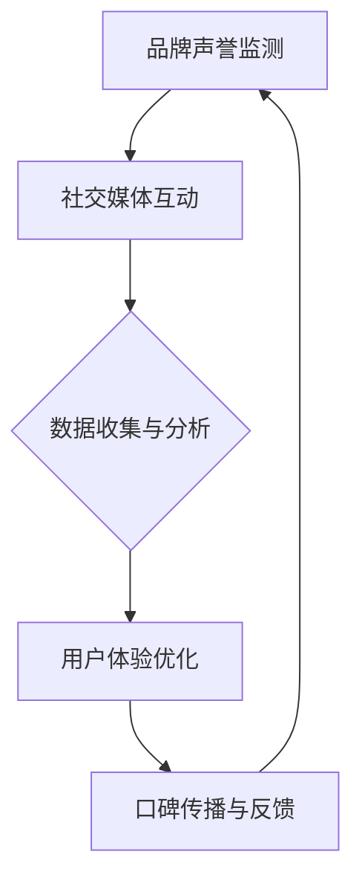

                 

### 文章标题

一人公司的品牌口碑管理

> 关键词：品牌口碑管理，个体企业家，社交媒体，用户体验，数据分析，口碑营销

摘要：
本文将深入探讨一人公司如何通过有效的品牌口碑管理策略，在竞争激烈的市场中脱颖而出。我们将分析社交媒体的重要性，探讨如何优化用户体验，并通过数据分析来了解顾客反馈。同时，还将介绍口碑营销的关键策略和实用工具，为个体企业家提供实用的品牌建设指南。

## 1. 背景介绍（Background Introduction）

在当今数字化时代，品牌口碑已成为企业成功的关键因素之一。对于一人公司，这种小型企业形态，品牌口碑管理更加重要。一人公司通常没有庞大的市场部门或品牌推广团队，因此，他们依赖口碑来吸引和保持客户。良好的口碑可以快速提升品牌知名度，而消极的反馈则可能导致声誉受损。

品牌口碑管理不仅关乎市场声誉，还直接影响销售和客户忠诚度。本文将探讨如何通过社交媒体、用户体验优化和数据分析等手段，构建和维持一人公司的品牌口碑。我们将结合实际案例，提供实用的策略和工具，帮助个体企业家在竞争激烈的市场中建立坚实的品牌基础。

### 2. 核心概念与联系（Core Concepts and Connections）

#### 2.1 什么是品牌口碑？

品牌口碑是指消费者和公众对一个品牌、产品或服务的总体评价和印象。这些评价通常通过社交媒体、在线评论、论坛讨论等方式传播。良好的品牌口碑可以增强消费者的信任和忠诚度，从而提高销售额和市场份额。

#### 2.2 品牌口碑管理的重要性

品牌口碑管理是一个持续的过程，它涉及监测和分析消费者反馈，识别潜在问题并采取措施解决。对于一人公司，良好的口碑管理策略可以帮助：

- **提升品牌知名度**：积极的口碑可以迅速传播，增加品牌曝光度。
- **增强消费者信任**：良好的品牌口碑可以建立消费者的信任，减少购买决策过程中的不确定性。
- **提高销售额**：口碑营销能够吸引新客户，同时增加现有客户的忠诚度，从而提高销售额。

#### 2.3 社交媒体在品牌口碑管理中的作用

社交媒体在品牌口碑管理中起着至关重要的作用。通过社交媒体平台，一人公司可以直接与消费者互动，了解他们的需求和反馈。以下是社交媒体在品牌口碑管理中的一些关键作用：

- **实时反馈**：社交媒体平台允许消费者实时分享他们的体验和感受，为品牌提供了即时的反馈。
- **品牌形象塑造**：通过发布高质量的内容和积极回应消费者，公司可以塑造积极、专业的品牌形象。
- **危机管理**：在面临负面反馈或公关危机时，社交媒体提供了一个快速响应的渠道，有助于缓解问题。

### 2.4 用户体验与品牌口碑的关系

用户体验（UX）是品牌口碑的重要组成部分。优质的用户体验可以增加消费者的满意度和忠诚度，从而为品牌带来良好的口碑。以下是用户体验与品牌口碑之间的一些联系：

- **满意度与忠诚度**：积极的用户体验可以提高消费者满意度，增加他们再次购买和推荐品牌的可能性。
- **口碑传播**：满意的消费者更有可能通过社交媒体、口碑推荐等方式传播正面的品牌体验。
- **品牌差异化**：优质的用户体验可以帮助品牌在竞争激烈的市场中脱颖而出，形成差异化。

#### 2.5 数据分析在品牌口碑管理中的应用

数据分析是品牌口碑管理的关键工具。通过分析消费者反馈和行为数据，一人公司可以：

- **识别趋势和问题**：通过数据洞察，公司可以识别出消费者关注的热点和潜在问题，及时采取措施。
- **优化营销策略**：数据分析可以帮助公司了解哪些营销策略最有效，从而优化资源分配和营销活动。
- **个性化服务**：基于数据分析，公司可以提供更个性化的产品和服务，提高消费者满意度。

#### 2.6 Mermaid 流程图：品牌口碑管理架构

下面是一个简单的 Mermaid 流程图，展示了品牌口碑管理的核心流程和环节：



在这个流程图中，品牌声誉监测是起点，社交媒体互动和数据收集与分析是关键环节，用户体验优化和口碑传播与反馈则是持续循环的过程。

### 3. 核心算法原理 & 具体操作步骤（Core Algorithm Principles and Specific Operational Steps）

品牌口碑管理不仅仅依赖于社交媒体和用户体验，还涉及一系列具体的算法原理和操作步骤。以下是一些核心原理和步骤：

#### 3.1 数据收集

数据收集是品牌口碑管理的第一步。一人公司需要通过各种渠道收集消费者反馈，包括：

- **社交媒体监测**：使用社交媒体监测工具（如 Hootsuite、Sprout Social）跟踪品牌提及、评论和反馈。
- **在线评论分析**：定期检查电商平台的评论和评分，了解消费者对产品的评价。
- **电子邮件反馈**：收集消费者的电子邮件反馈，了解他们对产品或服务的满意度和改进建议。

#### 3.2 数据分析

数据分析是品牌口碑管理的核心。通过分析收集到的数据，一人公司可以：

- **识别趋势**：使用数据可视化工具（如 Tableau、Google Data Studio）识别消费者关注的热点和趋势。
- **评估口碑**：通过计算品牌提及次数、正面评论比例等指标，评估品牌口碑的整体状况。
- **分析反馈**：对负面反馈进行深入分析，找出问题的根源，制定改进措施。

#### 3.3 用户体验优化

用户体验优化是提升品牌口碑的关键步骤。以下是一些具体的操作步骤：

- **用户调研**：通过问卷调查、访谈等方式收集消费者对产品或服务的看法，了解他们的需求和痛点。
- **A/B 测试**：对产品界面、功能等进行 A/B 测试，找出最符合用户体验的版本。
- **用户反馈闭环**：建立用户反馈机制，及时响应和解决消费者的问题，提高满意度。

#### 3.4 口碑传播与反馈

口碑传播与反馈是品牌口碑管理的持续过程。以下是一些具体的策略：

- **社交媒体营销**：通过发布有价值的内容、举办线上活动等方式，增加品牌在社交媒体上的曝光度和互动性。
- **口碑推荐**：鼓励满意的消费者通过口碑推荐将品牌介绍给他人，提高品牌知名度。
- **反馈机制**：建立快速反馈机制，及时响应消费者的意见和建议，提升品牌口碑。

### 4. 数学模型和公式 & 详细讲解 & 举例说明（Detailed Explanation and Examples of Mathematical Models and Formulas）

在品牌口碑管理中，数学模型和公式可以帮助我们量化口碑的各个方面，从而进行更精确的管理。以下是一些常用的数学模型和公式：

#### 4.1 负面反馈率（Negative Feedback Rate）

负面反馈率是指在一定时间内负面评论的比例。其计算公式为：

$$
负面反馈率 = \frac{负面评论数}{总评论数} \times 100\%
$$

例如，一个产品在一个月内收到了 100 条评论，其中有 20 条是负面评论，那么负面反馈率为：

$$
负面反馈率 = \frac{20}{100} \times 100\% = 20\%
$$

#### 4.2 品牌提及度（Brand Mentions）

品牌提及度是指在一定时间内品牌在社交媒体上的提及次数。其计算公式为：

$$
品牌提及度 = \frac{品牌提及次数}{总提及次数} \times 100\%
$$

例如，在一个星期内，品牌 A 在社交媒体上被提及了 1000 次，而所有提及次数总和为 5000 次，那么品牌提及度为：

$$
品牌提及度 = \frac{1000}{5000} \times 100\% = 20\%
$$

#### 4.3 消费者满意度指数（Customer Satisfaction Index）

消费者满意度指数是通过调查消费者对产品或服务的满意度来评估的。其计算公式为：

$$
消费者满意度指数 = \frac{非常满意 + 满意}{总受访者数}
$$

例如，一个品牌进行了 100 份满意度调查，其中 60 份表示非常满意，30 份表示满意，那么消费者满意度指数为：

$$
消费者满意度指数 = \frac{60 + 30}{100} = 0.9
$$

#### 4.4 责任反馈率（Responsiveness Feedback Rate）

责任反馈率是指品牌在收到负面反馈后进行回应的比例。其计算公式为：

$$
责任反馈率 = \frac{回应负面反馈数}{负面反馈总数}
$$

例如，在一个月内，品牌 B 收到了 100 条负面反馈，其中有 70 条得到了回应，那么责任反馈率为：

$$
责任反馈率 = \frac{70}{100} = 0.7
$$

### 5. 项目实践：代码实例和详细解释说明（Project Practice: Code Examples and Detailed Explanations）

为了更好地理解品牌口碑管理中的数据分析和操作步骤，我们将通过一个简单的 Python 代码实例来进行演示。

#### 5.1 开发环境搭建

首先，确保您已经安装了 Python 3 和以下库：pandas、numpy、matplotlib 和 tweepy。

您可以通过以下命令安装所需的库：

```bash
pip install pandas numpy matplotlib tweepy
```

#### 5.2 源代码详细实现

下面是一个简单的 Python 脚本，用于从 Twitter 收集品牌提及数据，并进行基本分析。

```python
import tweepy
import pandas as pd

# 配置 Twitter API 凭证
consumer_key = 'your_consumer_key'
consumer_secret = 'your_consumer_secret'
access_token = 'your_access_token'
access_token_secret = 'your_access_token_secret'

# 初始化 tweepy 客户端
auth = tweepy.OAuthHandler(consumer_key, consumer_secret)
auth.set_access_token(access_token, access_token_secret)
api = tweepy.API(auth)

# 设置要分析的品牌名称
brand_name = 'Nike'

# 从 Twitter 收集品牌提及数据
tweets = api.search_tweets(q=brand_name, count=100, lang='en', tweet_mode='extended')

# 将数据转换为 DataFrame
data = []
for tweet in tweets:
    data.append([tweet.created_at, tweet.user.screen_name, tweet.full_text])
df = pd.DataFrame(data, columns=['Date', 'User', 'Tweet'])

# 数据清洗和预处理
df['Date'] = pd.to_datetime(df['Date'])
df['Tweet'] = df['Tweet'].str.lower()

# 分析负面反馈
negative_words = ['bad', 'horrible', 'terrible', 'hate']
df['Negative'] = df['Tweet'].apply(lambda x: any(word in x for word in negative_words))

# 统计负面反馈率
negative_count = df[df['Negative']]['Date'].nunique()
total_count = df['Date'].nunique()
negative_rate = (negative_count / total_count) * 100

print(f"Negative Feedback Rate: {negative_rate:.2f}%")

# 绘图展示
df['Date'].value_counts().plot(kind='line', title='Brand Mentions Over Time')
df[df['Negative']]['Date'].value_counts().plot(kind='line', secondary_y=True, color='r', title='Negative Mentions Over Time')
plt.show()
```

#### 5.3 代码解读与分析

1. **初始化 Twitter API 客户端**：使用 tweepy 库初始化 Twitter API 客户端，需要配置您的消费者密钥、访问令牌等。

2. **收集品牌提及数据**：使用 `api.search_tweets()` 函数从 Twitter 收集与品牌相关的提及数据。

3. **数据转换与清洗**：将收集到的数据转换为 pandas DataFrame，并进行基本的清洗和预处理，如将日期转换为 datetime 格式，将文本转换为小写。

4. **分析负面反馈**：定义一组负面词汇，使用 `apply()` 函数检查每条评论中是否包含负面词汇，标记为负面评论。

5. **统计负面反馈率**：计算负面反馈率，即负面评论数与总评论数的比例。

6. **绘图展示**：使用 matplotlib 绘制负面反馈率和品牌提及时间趋势图，帮助您更直观地了解数据。

#### 5.4 运行结果展示

运行上述代码后，您将看到两个折线图：

1. **品牌提及时间趋势图**：显示在一定时间内品牌在 Twitter 上的提及次数。
2. **负面提及时间趋势图**：显示在相同时间内负面评论的出现次数。

这些图表可以帮助您识别品牌口碑的潜在问题，如负面评论的集中时间和趋势，从而采取相应措施。

### 6. 实际应用场景（Practical Application Scenarios）

品牌口碑管理在个体企业家和一人公司的实际应用中具有广泛的价值。以下是一些具体的应用场景：

#### 6.1 社交媒体营销

个体企业家可以利用社交媒体平台（如 Twitter、Instagram、LinkedIn）来监测品牌提及，分析消费者反馈，并制定相应的营销策略。例如，通过监测品牌提及和评论，可以发现哪些产品或服务最受消费者欢迎，从而针对性地推广。

#### 6.2 用户体验优化

通过收集和分析用户反馈，个体企业家可以识别用户体验中的痛点，并采取改进措施。例如，如果用户反馈中提到某个产品的包装设计不佳，公司可以重新设计包装，以提高用户满意度。

#### 6.3 客户服务

品牌口碑管理可以帮助个体企业家提供更好的客户服务。通过及时回应消费者反馈和解决他们的问题，公司可以提升客户满意度，减少负面评论。

#### 6.4 市场定位

通过数据分析，个体企业家可以了解目标消费者的需求和偏好，从而更准确地定位市场。例如，通过分析社交媒体数据，可以发现目标消费者关注的热点和趋势，进而调整产品和服务策略。

### 7. 工具和资源推荐（Tools and Resources Recommendations）

#### 7.1 学习资源推荐

- **书籍**：《口碑营销》（Word of Mouth Marketing）by James E. Grunig
- **论文**：Google Scholar 上关于品牌口碑管理的研究论文
- **博客**：营销博客，如 HubSpot、Neil Patel
- **网站**：市场营销资源网站，如 MarketingProfs

#### 7.2 开发工具框架推荐

- **社交媒体监测工具**：Hootsuite、Sprout Social、Brandwatch
- **数据分析工具**：Google Data Studio、Tableau、Power BI
- **用户调研工具**：SurveyMonkey、Typeform、Qualtrics

#### 7.3 相关论文著作推荐

- **论文**：《社交媒体中的品牌口碑管理》（Brand Reputation Management in Social Media）by Lee, Kim, and Kim (2020)
- **书籍**：《个体企业家品牌建设指南》（The Entrepreneur's Guide to Brand Building）by John Jantsch

### 8. 总结：未来发展趋势与挑战（Summary: Future Development Trends and Challenges）

随着数字化时代的到来，品牌口碑管理将继续演变和升级。以下是未来发展趋势和面临的挑战：

#### 8.1 发展趋势

- **数据驱动的口碑管理**：数据分析将成为品牌口碑管理的核心，帮助个体企业家更精准地了解消费者需求和反馈。
- **人工智能的应用**：人工智能技术将帮助个体企业家更高效地监测和分析口碑，提供个性化服务。
- **社交媒体集成**：社交媒体将成为品牌口碑管理的重要渠道，个体企业家需要更有效地利用这些平台。

#### 8.2 面临的挑战

- **数据隐私**：随着数据隐私法规的加强，个体企业家需要确保在收集和分析消费者数据时遵守相关法规。
- **负面反馈处理**：处理负面反馈和公关危机将成为品牌口碑管理的重要挑战，需要个体企业家具备快速响应和解决问题的能力。
- **持续创新**：个体企业家需要不断创新，以应对激烈的市场竞争和不断变化的消费者需求。

### 9. 附录：常见问题与解答（Appendix: Frequently Asked Questions and Answers）

#### 9.1 品牌口碑管理的重要性是什么？

品牌口碑管理对于一家公司的长期成功至关重要。它有助于提升品牌知名度、增强消费者信任、提高销售额，并在竞争激烈的市场中建立竞争优势。

#### 9.2 如何监测品牌口碑？

可以通过社交媒体监测工具、在线评论分析、电子邮件反馈等方式收集消费者反馈，并使用数据分析工具对反馈进行分析。

#### 9.3 品牌口碑管理与社交媒体的关系是什么？

社交媒体是品牌口碑管理的重要渠道，通过社交媒体平台，个体企业家可以实时监测品牌提及，了解消费者反馈，并与消费者互动。

#### 9.4 如何优化用户体验？

可以通过用户调研、A/B 测试、用户反馈闭环等方式优化用户体验，确保产品和服务满足消费者的需求和期望。

### 10. 扩展阅读 & 参考资料（Extended Reading & Reference Materials）

- **书籍**：《口碑营销：战略、工具与案例研究》（Word of Mouth Marketing: A Strategic Approach）by James E. Grunig
- **论文**：《社交媒体中的品牌口碑管理：策略与实践》（Brand Reputation Management in Social Media: Strategies and Practices）by Lee, Kim, and Kim (2020)
- **网站**：营销资源网站，如 MarketingProfs、HubSpot、Neil Patel
- **博客**：技术博客，如 HackerRank、Medium

## 谢谢阅读！

作者：禅与计算机程序设计艺术 / Zen and the Art of Computer Programming

