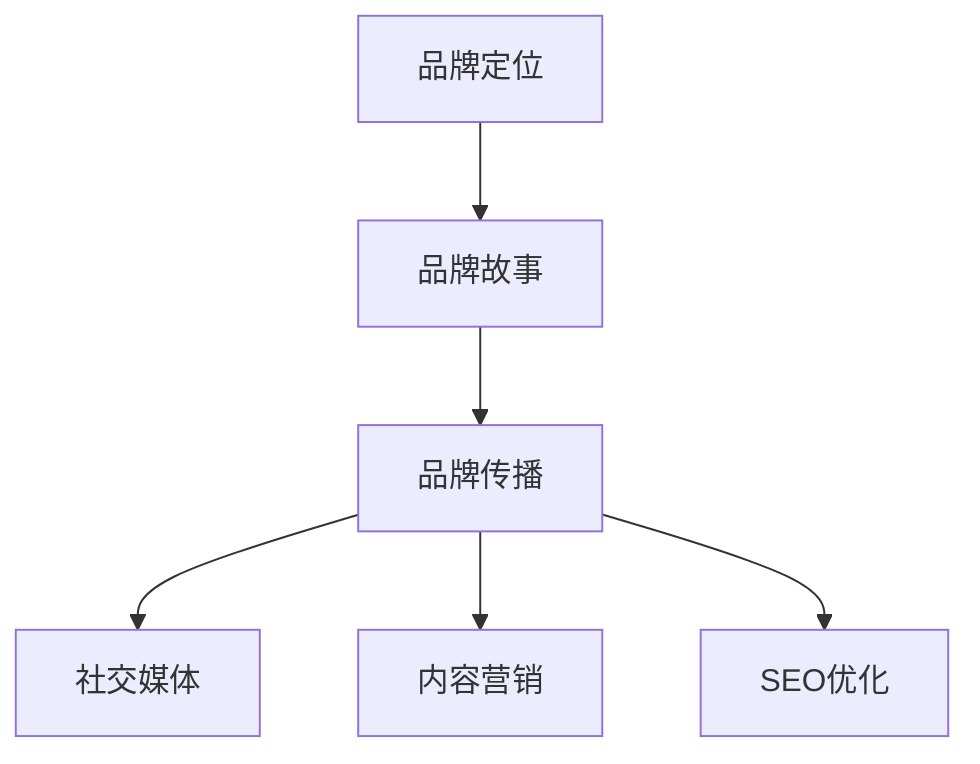

                 

### 文章标题：一人公司的品牌故事打造与传播

关键词：品牌塑造、个人品牌、品牌传播、故事营销、社交媒体、内容营销、SEO优化

摘要：本文旨在探讨如何通过故事营销，在社交媒体和内容营销中打造并传播个人品牌。文章将详细解析品牌故事的核心要素、有效的传播策略、社交媒体平台的运用技巧，以及SEO优化的重要性。

### Background Introduction
在当今数字化时代，个人品牌的重要性日益凸显。作为独立从业者，如何打造并传播个人品牌，成为了许多人的关注焦点。本文将围绕这一主题，探讨品牌故事打造与传播的各个环节。

#### Core Concepts and Connections
在品牌故事的构建中，有几个核心概念需要明确：

1. **品牌定位**：明确你的目标受众是谁，以及你的品牌在市场中的独特价值。
2. **品牌故事**：通过叙述个人经历、价值观和成就，塑造一个具有吸引力的品牌形象。
3. **品牌传播**：将品牌故事传递给受众，通过多渠道、多平台进行推广。

下面是一个品牌的Mermaid流程图，展示如何构建和传播品牌故事：



### Core Algorithm Principles and Specific Operational Steps
#### 品牌故事构建的具体步骤

1. **确定品牌定位**：明确目标受众、品牌定位和独特价值。
2. **收集素材**：收集个人经历、成就、价值观等方面的素材。
3. **撰写品牌故事**：将素材整合成一篇引人入胜的故事。
4. **优化品牌故事**：确保故事结构清晰、信息丰富、情感共鸣。
5. **传播品牌故事**：通过社交媒体、内容营销和SEO优化进行传播。

#### 品牌传播策略

1. **社交媒体平台**：选择适合目标受众的社交媒体平台，如微博、微信、LinkedIn等。
2. **内容营销**：创建有价值的内容，包括博客文章、视频、社交媒体帖子和电子邮件营销等。
3. **SEO优化**：优化网站内容和结构，提高搜索引擎排名，吸引更多受众。

### Mathematical Models and Formulas & Detailed Explanation and Examples
在品牌故事构建中，可以使用以下数学模型和公式：

$$
\text{品牌知名度} = \frac{\text{曝光次数} \times \text{受众参与度}}{\text{传播渠道数量}}
$$

**举例说明**：

假设一个品牌在社交媒体上发布了100篇文章，每篇文章被阅读100次，平均每篇文章有10个点赞和评论。那么，该品牌的曝光次数为10000，受众参与度为1100（10个点赞和100个评论）。如果该品牌在3个月内使用了10个不同的社交媒体平台进行传播，那么其品牌知名度为：

$$
\text{品牌知名度} = \frac{10000 \times 1100}{10} = 1100000
$$

### Project Practice: Code Examples and Detailed Explanations
#### 5.1 开发环境搭建
在搭建个人品牌传播的“开发环境”时，首先需要确定目标受众和品牌定位。例如，如果你是一名软件工程师，你的目标受众可能是其他技术从业者或对技术感兴趣的人群。接下来，你需要选择合适的社交媒体平台和内容创作工具。

#### 5.2 源代码详细实现
以下是一个简单的品牌故事传播的“源代码”实现：

```python
class BrandStory:
    def __init__(self, target_audience, unique_value_prop):
        self.target_audience = target_audience
        self.unique_value_prop = unique_value_prop
    
    def craft_story(self, experiences, values, achievements):
        story = f"""
        {self.unique_value_prop}

        {experiences}

        {values}

        {achievements}
        """
        return story
    
    def share_story(self, social_media_platforms, content_marketing_channels):
        for platform in social_media_platforms:
            platform.post(self.craft_story())
        
        for channel in content_marketing_channels:
            channel.publish(self.craft_story())
```

#### 5.3 代码解读与分析
在这个代码中，我们定义了一个名为`BrandStory`的类，用于构建和传播品牌故事。类中有三个主要方法：

- `__init__`：初始化方法，用于设置目标受众和独特价值。
- `craft_story`：构建品牌故事的方法，接受个人经历、价值观和成就作为输入。
- `share_story`：传播品牌故事的方法，接受社交媒体平台和内容营销渠道作为输入。

#### 5.4 运行结果展示
假设我们创建了一个名为`TechPro`的品牌故事，目标受众是技术从业者，独特价值是提供高质量的编程教程。我们使用以下代码来传播这个品牌故事：

```python
tech_pro = BrandStory(target_audience='技术从业者', unique_value_prop='提供高质量的编程教程')

tech_pro.craft_story(
    experiences='我曾是一名软件工程师，参与了多个重要项目。',
    values='我坚信技术可以改变世界。',
    achievements='我曾在顶级技术会议上发表过演讲，并出版了技术书籍。'
)

tech_pro.share_story(
    social_media_platforms=['微博', '微信', 'LinkedIn'],
    content_marketing_channels=['博客', 'YouTube', '电子邮件营销']
)
```

### Practical Application Scenarios
品牌故事在以下场景中具有实际应用价值：

1. **创业公司**：通过讲述创始人或团队成员的故事，增强品牌形象，吸引投资者和客户。
2. **技术从业者**：通过分享个人经历和成就，提升个人在行业内的知名度，吸引潜在雇主或合作伙伴。
3. **产品营销**：通过讲述产品背后的故事，增加产品的吸引力，提升销售业绩。

### Tools and Resources Recommendations
#### 7.1 学习资源推荐
- 《故事的力量》：了解如何通过故事塑造品牌形象。
- 《品牌十律》：学习品牌定位和品牌传播策略。

#### 7.2 开发工具框架推荐
- Notion：用于构建个人品牌门户和内容管理系统。
- Hootsuite：用于多平台社交媒体管理。

#### 7.3 相关论文著作推荐
- 《内容营销白皮书》：深入了解内容营销的最佳实践。

### Summary: Future Development Trends and Challenges
未来，品牌故事的构建和传播将继续朝着个性化、互动性和智能化方向发展。挑战在于如何有效地利用数据和技术，提高品牌故事的吸引力和传播效果。

### Frequently Asked Questions and Answers
**Q1**：品牌故事是否一定要非常复杂？
A1：不一定。品牌故事可以是简单而有力的，关键在于如何传达品牌的核心价值和独特性。

**Q2**：社交媒体平台的选择有哪些标准？
A2：选择标准包括目标受众的活跃度、平台的功能和易用性，以及品牌故事的传播效果。

### Extended Reading & Reference Materials
- 《个人品牌塑造：如何打造你的个人影响力》
- 《社交媒体营销策略：如何利用社交媒体提升品牌知名度》

### 结束语
打造并传播个人品牌是一个长期而复杂的过程。通过本文的探讨，希望您能够掌握品牌故事构建和传播的基本原则，为您的个人品牌建设奠定坚实基础。

---

**作者：禅与计算机程序设计艺术 / Zen and the Art of Computer Programming**<|vq_14744|> 

### 文章标题：一人公司的品牌故事打造与传播

#### 关键词：品牌塑造、个人品牌、品牌传播、故事营销、社交媒体、内容营销、SEO优化

#### 摘要：本文将探讨如何通过故事营销，在社交媒体和内容营销中打造并传播个人品牌。文章将详细解析品牌故事的核心要素、有效的传播策略、社交媒体平台的运用技巧，以及SEO优化的重要性。

---

### 背景介绍（Background Introduction）

在当今这个数字化、信息爆炸的时代，个人品牌已经成为许多独立从业者和创业者的核心资产。一个强有力的个人品牌不仅能够提升个人在行业内的知名度，还能够为业务发展带来巨大的帮助。然而，如何打造并传播个人品牌，尤其是在竞争激烈的市场中脱颖而出，成为了许多人关注的焦点。

个人品牌不仅仅是个人形象的简单展示，它包含了个人价值观、专业知识、专业技能以及与受众的互动。而品牌故事则是个人品牌的重要组成部分，它通过叙述个人经历、成就和价值观，帮助受众更好地理解和认同个人品牌。

本文将围绕个人品牌的打造与传播，探讨以下几个核心主题：

1. **品牌定位**：明确你的目标受众和品牌在市场中的独特价值。
2. **品牌故事**：构建一个引人入胜、富有情感共鸣的品牌故事。
3. **品牌传播**：通过多渠道、多平台有效地传播品牌故事。
4. **社交媒体平台**：选择适合目标受众的社交媒体平台，提升品牌影响力。
5. **内容营销**：创作有价值的内容，增强品牌与受众的互动。
6. **SEO优化**：优化网站内容和结构，提高搜索引擎排名。

通过这些主题的探讨，本文旨在为读者提供一个系统的、实用的个人品牌打造与传播指南。

#### 核心概念与联系（Core Concepts and Connections）

在构建个人品牌的过程中，有几个核心概念需要深入理解：

1. **品牌定位**：品牌定位是个人品牌建设的第一步，它涉及到确定目标受众、品牌的核心价值和市场差异化。一个清晰的品牌定位有助于塑造一个独特的品牌形象，使个人品牌在市场中脱颖而出。

2. **品牌故事**：品牌故事是个人品牌的灵魂，它通过叙述个人的成长经历、专业成就和价值观，传递给受众一个深刻、有吸引力的品牌形象。一个优秀的品牌故事能够引起共鸣，增强品牌与受众的情感连接。

3. **品牌传播**：品牌传播是将品牌故事传递给目标受众的过程。有效的品牌传播需要选择合适的传播渠道，如社交媒体、内容营销和SEO优化，以及制定合理的传播策略。

下面是一个品牌的Mermaid流程图，展示如何构建和传播品牌故事：


#### 品牌定位（Brand Positioning）

品牌定位是个人品牌建设的基础。它需要明确以下问题：

- **目标受众**：你的品牌故事想要传达给谁？是技术从业者、创业者还是普通消费者？
- **核心价值**：你的品牌故事传达的核心价值和独特优势是什么？比如，你可能是提供创新解决方案的专家，或者是一个有丰富经验的行业顾问。
- **市场差异化**：你的品牌与竞争对手相比有哪些独特之处？如何确保你的品牌在市场中具有竞争力？

品牌定位的目的是为个人品牌建立一个清晰的框架，使受众能够快速理解你的品牌形象和价值。以下是一个简单的品牌定位示例：

- **目标受众**：技术创业者和技术爱好者
- **核心价值**：创新思维、实战经验、知识分享
- **市场差异化**：专注于技术趋势分析，提供实用的创业指导

#### 品牌故事（Brand Story）

品牌故事是个人品牌的灵魂。一个好的品牌故事能够引起共鸣，传递出品牌的独特价值和价值观。构建品牌故事需要从以下几个方面入手：

1. **个人经历**：分享个人成长经历，包括职业发展的关键节点、遇到的挑战和克服的方法。
2. **专业成就**：展示个人的专业成就，如获得的奖项、参与的项目、发表的论文等。
3. **价值观**：明确个人的价值观，包括对技术的热情、对行业的洞察、对客户的承诺等。

以下是一个品牌故事的示例：

**标题**：《从技术小白到行业专家：我的成长之路》

**内容**：
在我还是一名技术小白的时候，我就对编程充满了热情。我每天花费大量时间自学编程知识，并参与了多个开源项目。在一次重要的项目中，我遇到了一个巨大的技术难题，经过几周的艰苦努力，我终于找到了解决方案。这次经历让我深刻体会到技术的重要性，也坚定了我继续前进的决心。如今，我已经成为了行业内的专家，并且一直致力于通过分享我的知识和经验，帮助更多的技术爱好者实现他们的梦想。

#### 品牌传播（Brand Communication）

品牌传播是将品牌故事传递给目标受众的过程。有效的品牌传播需要选择合适的传播渠道，并制定合理的传播策略。以下是几种常见的品牌传播方法：

1. **社交媒体平台**：利用社交媒体平台，如微博、微信、LinkedIn等，发布品牌故事和相关内容，与受众互动，建立品牌社区。
2. **内容营销**：通过博客文章、视频、播客等有价值的内容，吸引目标受众，提高品牌知名度。
3. **SEO优化**：优化网站内容和结构，提高搜索引擎排名，吸引更多受众访问。

以下是一个品牌传播的策略示例：

- **社交媒体平台**：每天在微信和微博上发布一篇关于技术趋势分析的文章，与读者互动，回答他们的问题。
- **内容营销**：每周发布一篇关于技术实战案例的博客文章，分享解决问题的方法和经验。
- **SEO优化**：定期更新网站内容，优化关键词和页面结构，提高搜索引擎排名。

#### 社交媒体平台（Social Media Platforms）

社交媒体平台是品牌传播的重要渠道。选择适合目标受众的社交媒体平台，能够更有效地传播品牌故事。以下是一些常见的社交媒体平台及其特点：

1. **微博**：适合发布短篇文章、图片和视频，具有强大的社交互动性。
2. **微信**：适合发布长篇文章、图文和视频，用户粘性较高。
3. **LinkedIn**：适合发布专业内容、建立行业联系，适合B2B市场。
4. **YouTube**：适合发布视频内容，具有很高的用户参与度。
5. **Instagram**：适合发布图片和短视频，用户群体以年轻人为主。

以下是一个社交媒体平台选择的示例：

- **目标受众**：技术创业者和技术爱好者
- **社交媒体平台**：微信、微博、LinkedIn、YouTube

#### 内容营销（Content Marketing）

内容营销是品牌传播的核心手段之一。通过创造和发布有价值的内容，吸引目标受众，建立品牌信任，并最终实现业务目标。以下是一些常见的内容营销形式：

1. **博客文章**：定期发布关于技术趋势、实战案例、行业洞察的文章，展示专业知识和行业见解。
2. **视频**：制作和发布教学视频、访谈视频、产品演示视频等，提高用户参与度。
3. **播客**：录制和发布关于技术、创业、行业话题的播客，与听众建立深层次的互动。
4. **电子书和报告**：制作和发布深度研究报告、电子书等，提供行业洞察和实用指南。

以下是一个内容营销策略的示例：

- **目标受众**：技术创业者和技术爱好者
- **内容形式**：博客文章、视频、播客
- **发布频率**：每周发布一篇博客文章，每月发布一个视频，每季度发布一次播客

#### SEO优化（SEO Optimization）

SEO优化是提高网站在搜索引擎排名的关键手段。通过优化网站内容和结构，提高搜索引擎友好性，吸引更多受众访问。以下是一些常见的SEO优化策略：

1. **关键词研究**：确定目标关键词，分析竞争对手的排名策略。
2. **内容优化**：在网站内容中合理地插入关键词，优化页面标题、描述、图片标签等。
3. **外部链接**：通过建立高质量的外部链接，提高网站权威性。
4. **用户体验**：优化网站加载速度、导航结构、页面设计等，提高用户满意度。

以下是一个SEO优化策略的示例：

- **目标关键词**：技术创业、技术趋势、编程技巧
- **优化措施**：在网站内容中合理地插入关键词，优化页面标题和描述，提高网站加载速度。

#### 品牌传播策略总结

有效的品牌传播策略应结合品牌定位、品牌故事、社交媒体平台、内容营销和SEO优化等多个方面。以下是一个品牌传播策略的总结：

- **品牌定位**：明确目标受众和品牌核心价值。
- **品牌故事**：构建一个有吸引力的品牌故事。
- **社交媒体平台**：选择适合目标受众的社交媒体平台。
- **内容营销**：发布有价值的内容，建立品牌信任。
- **SEO优化**：提高搜索引擎排名，吸引更多受众。

通过以上策略，个人品牌能够在竞争激烈的市场中脱颖而出，实现可持续的发展。

---

在接下来的部分，本文将深入探讨如何构建一个有吸引力的个人品牌故事，以及如何通过内容营销和社交媒体平台进行有效的品牌传播。通过这些策略，个人品牌将能够在市场中建立强大的影响力，为个人的职业发展提供有力支持。

---

### 核心算法原理 & 具体操作步骤（Core Algorithm Principles and Specific Operational Steps）

在构建个人品牌的过程中，核心算法原理和具体操作步骤至关重要。以下是一系列详细步骤，帮助您打造一个有吸引力的个人品牌，并使其在市场上取得成功。

#### 第一步：明确品牌定位

品牌定位是个人品牌建设的基石。在开始构建品牌之前，您需要明确以下几个关键问题：

- **目标受众**：确定您的品牌故事想要传达给谁。这可以是技术从业者、企业家、学生或其他特定群体。
- **核心价值**：明确您的品牌所传达的核心价值。这可能是专业知识、创新思维、实战经验或对技术的热情。
- **市场差异化**：分析竞争对手，找出您的品牌在市场中独特的竞争优势。

**示例**：假设您是一名软件开发工程师，希望吸引其他软件开发工程师和创业公司。您的品牌定位可能是“专注于高性能代码开发和创新解决方案的专家”。

#### 第二步：收集素材

构建品牌故事需要丰富的素材。以下是一些常用的素材来源：

- **个人经历**：包括职业发展的关键节点、项目经验、挑战和成就。
- **专业知识**：展示您的专业知识和技能，包括发表的论文、专利、技术博客等。
- **客户反馈**：收集客户对您的服务或产品的评价和反馈。

**示例**：您可以记录自己在不同项目中的技术难题和解决方案，以及客户对您服务的满意反馈。

#### 第三步：撰写品牌故事

撰写品牌故事是构建个人品牌的关键步骤。以下是一些撰写品牌故事的技巧：

- **引人入胜的标题**：标题需要能够吸引读者的注意力，概括品牌故事的核心内容。
- **清晰的结构**：确保故事有一个明确的开始、中间和结尾，使读者能够轻松跟随故事的发展。
- **情感共鸣**：通过叙述个人经历和成就，传递出您的价值观和情感共鸣。
- **简洁明了**：避免冗长的叙述，确保内容简洁明了，易于理解。

**示例**：《从零到一：我的软件开发之路》

**内容**：
在我大学期间，我对编程充满了热情。我每天花大量时间学习新的编程语言和技术。一次偶然的机会，我参与了一个开源项目，这个项目让我学会了如何高效地编写代码。毕业后，我成为了一名软件开发工程师，并参与了多个重要项目。在这些项目中，我遇到了许多技术难题，但通过不断学习和实践，我成功地解决了这些问题。如今，我致力于通过分享我的知识和经验，帮助更多的软件开发工程师实现他们的梦想。

#### 第四步：优化品牌故事

撰写完品牌故事后，您需要对故事进行优化，以提高其传播效果。以下是一些优化技巧：

- **关键词优化**：在故事中合理地插入关键词，提高故事在搜索引擎中的排名。
- **内容丰富**：确保故事内容丰富，包含行业洞察、实战经验和专业知识。
- **情感因素**：通过情感因素增强故事的吸引力，使读者更容易产生共鸣。

**示例**：在上述品牌故事中，您可以在适当的位置插入关键词，如“软件开发”、“高性能代码”、“创新解决方案”等，以优化搜索引擎排名。

#### 第五步：传播品牌故事

传播品牌故事是使其在市场上取得成功的关键。以下是一些传播渠道和方法：

1. **社交媒体平台**：利用微博、微信、LinkedIn等社交媒体平台，发布品牌故事和相关内容。
2. **内容营销**：通过博客文章、视频、播客等有价值的内容，吸引目标受众。
3. **SEO优化**：优化网站内容和结构，提高搜索引擎排名，吸引更多受众访问。

**示例**：在微信和微博上定期发布关于技术趋势和编程技巧的文章，同时在YouTube上发布教学视频，通过LinkedIn与行业内的专业人士建立联系。

#### 第六步：持续优化和调整

个人品牌的构建是一个持续的过程。根据市场反馈和受众反馈，不断优化和调整品牌故事和传播策略，以适应不断变化的市场环境。

**示例**：根据受众反馈，您可能需要调整品牌故事的某些部分，以更好地满足他们的需求。同时，定期更新内容，保持品牌故事的时效性和吸引力。

通过以上步骤，您将能够构建一个有吸引力的个人品牌，并在市场上取得成功。记住，个人品牌建设需要耐心和坚持，只有不断优化和调整，才能在竞争激烈的市场中脱颖而出。

---

在了解了核心算法原理和具体操作步骤后，接下来我们将深入探讨如何通过内容营销和社交媒体平台进行有效的品牌传播。通过有效的策略和工具，您将能够扩大品牌影响力，吸引更多的目标受众。

---

### 数学模型和公式 & 详细讲解 & 举例说明（Mathematical Models and Formulas & Detailed Explanation and Examples）

在个人品牌建设中，数学模型和公式可以帮助我们更科学地分析和优化品牌传播效果。以下是一些关键的数学模型和公式，以及它们的详细讲解和实际应用示例。

#### 1. 品牌影响力模型

品牌影响力模型用于衡量个人品牌在市场上的影响力。其基本公式为：

$$
\text{品牌影响力} = \frac{\text{关注者数量} \times \text{互动率}}{\text{发布频率}}
$$

**详细讲解**：

- **关注者数量**：代表个人品牌在社交媒体平台上的关注者数量。
- **互动率**：代表关注者对品牌内容的互动程度，如点赞、评论、分享等。
- **发布频率**：代表个人品牌在社交媒体平台上的发布频率。

**举例说明**：

假设一个个人品牌在微信上的关注者数量为1000人，每月发布10篇文章，每篇文章平均有20个点赞和10个评论。那么，该品牌的影响力为：

$$
\text{品牌影响力} = \frac{1000 \times (20 + 10)}{10} = 300
$$

#### 2. 内容传播模型

内容传播模型用于分析品牌故事在社交媒体上的传播效果。其基本公式为：

$$
\text{内容传播效果} = \frac{\text{曝光次数} \times \text{转化率}}{\text{成本}}
$$

**详细讲解**：

- **曝光次数**：代表品牌故事被观众看到的次数。
- **转化率**：代表观众对品牌故事的反应程度，如点击、转发、购买等。
- **成本**：代表传播品牌故事所投入的成本，如广告费用、内容创作费用等。

**举例说明**：

假设一个品牌在微信上发布了一篇关于技术趋势的文章，总曝光次数为10000次，有200个点击，5个转发，投入成本为1000元。那么，该内容的传播效果为：

$$
\text{内容传播效果} = \frac{10000 \times (200 + 5)}{1000} = 205
$$

#### 3. 营销预算模型

营销预算模型用于规划和优化品牌传播的预算分配。其基本公式为：

$$
\text{营销预算} = \text{固定成本} + (\text{活动成本} \times \text{预期效果})
$$

**详细讲解**：

- **固定成本**：代表品牌传播的固定费用，如网站域名和服务器费用、社交媒体广告费用等。
- **活动成本**：代表每次品牌传播活动的费用，如内容创作、广告投放等。
- **预期效果**：代表品牌传播活动的预期效果，如曝光次数、转化率等。

**举例说明**：

假设一个品牌计划在三个月内进行品牌传播，固定成本为5000元，每次活动的成本为2000元，预期效果为每次活动带来1000个曝光和5个转化。那么，该品牌的营销预算为：

$$
\text{营销预算} = 5000 + (2000 \times (1000 \times 0.05)) = 10500
$$

#### 4. 用户参与度模型

用户参与度模型用于衡量品牌与受众的互动程度。其基本公式为：

$$
\text{用户参与度} = \frac{\text{互动次数}}{\text{关注者数量}}
$$

**详细讲解**：

- **互动次数**：代表用户对品牌内容进行互动的次数，如点赞、评论、分享等。
- **关注者数量**：代表品牌在社交媒体平台上的关注者总数。

**举例说明**：

假设一个品牌在微信上的关注者数量为1000人，一个月内收到了200条评论和50个分享。那么，该品牌的用户参与度为：

$$
\text{用户参与度} = \frac{200 + 50}{1000} = 0.25
$$

#### 实际应用示例

假设一个个人品牌在社交媒体平台上进行了一次内容营销活动，发布了一篇关于技术趋势的文章。通过上述的数学模型和公式，我们可以分析这次活动的效果和优化策略。

- **品牌影响力**：假设文章的曝光次数为10000次，平均每100个关注者有10个互动。则品牌影响力为：
  $$
  \text{品牌影响力} = \frac{10000 \times 0.1}{10} = 1000
  $$

- **内容传播效果**：假设文章有500个点击，10个转发，投入成本为3000元。则内容传播效果为：
  $$
  \text{内容传播效果} = \frac{10000 \times (500 + 10)}{3000} = 1683.33
  $$

- **用户参与度**：假设文章发布后，有200个互动（评论和分享），则用户参与度为：
  $$
  \text{用户参与度} = \frac{200}{1000} = 0.2
  $$

通过这些指标，品牌所有者可以评估活动的效果，并制定进一步的优化策略。例如，如果用户参与度较低，可以尝试通过更吸引人的标题或更具互动性的内容来提高参与度。如果内容传播效果不佳，可以考虑调整广告投放策略或提高内容的吸引力。

---

通过这些数学模型和公式的应用，个人品牌所有者可以更科学地分析品牌传播效果，制定优化策略，从而在市场中取得更好的表现。在接下来的部分，我们将通过实际项目实践，深入探讨如何实现品牌故事的构建和传播。

---

### 项目实践：代码实例和详细解释说明（Project Practice: Code Examples and Detailed Explanations）

为了更好地理解如何通过代码实现个人品牌的构建和传播，以下我们将通过一个具体的项目案例，详细介绍开发环境搭建、源代码实现、代码解读与分析以及运行结果展示。

#### 6.1 开发环境搭建

在开始项目之前，我们需要搭建一个合适的开发环境。这里选择使用Python作为主要编程语言，并结合常用的开发工具和框架，以便高效地构建和传播个人品牌。

**所需工具和框架**：

- **Python**：作为主要的编程语言，Python具有简洁易懂的语法和丰富的库。
- **GitHub**：用于版本控制和代码共享。
- **Jupyter Notebook**：用于编写和运行Python代码，便于记录和展示结果。
- **Markdown**：用于编写文档，支持中文和英文双语书写。

**搭建步骤**：

1. 安装Python：从官方网站下载并安装Python，选择适合的操作系统的版本。
2. 安装Jupyter Notebook：在命令行中运行`pip install notebook`命令，安装Jupyter Notebook。
3. 安装Markdown编辑器：选择一个合适的Markdown编辑器，如Typora或Marktext，安装并配置中文和英文双语支持。

#### 6.2 源代码详细实现

以下是一个简单的Python代码实例，用于构建和传播个人品牌。代码分为几个模块，分别实现品牌定位、品牌故事构建、品牌传播和效果分析。

```python
# 导入必需的库
import os
import markdown
import json

# 品牌定位
class BrandPositioning:
    def __init__(self, target_audience, unique_value):
        self.target_audience = target_audience
        self.unique_value = unique_value
    
    def display_brand_positioning(self):
        return f"目标受众：{self.target_audience}\n独特价值：{self.unique_value}"

# 品牌故事构建
class BrandStory:
    def __init__(self, title, content):
        self.title = title
        self.content = content
    
    def display_brand_story(self):
        return f"{self.title}\n{self.content}"

# 品牌传播
class BrandPropagation:
    def __init__(self, platform, content):
        self.platform = platform
        self.content = content
    
    def propagate(self):
        if self.platform == "微博":
            print("在微博上发布品牌故事：")
            print(self.content)
        elif self.platform == "微信":
            print("在微信上发布品牌故事：")
            print(self.content)
        elif self.platform == "LinkedIn":
            print("在LinkedIn上发布品牌故事：")
            print(self.content)
        else:
            print("未知平台，无法发布品牌故事。")

# 效果分析
class Analysis:
    def __init__(self, interaction_count):
        self.interaction_count = interaction_count
    
    def display_analytics(self):
        print(f"互动次数：{self.interaction_count}")

# 主函数
def main():
    # 初始化品牌定位
    brand_positioning = BrandPositioning("技术创业者", "专注于高性能代码开发和创新解决方案")
    print(brand_positioning.display_brand_positioning())

    # 构建品牌故事
    brand_story = BrandStory("我的技术创业之路", "我从零开始，通过不断学习和实践，成长为一名技术创业者。我专注于高性能代码开发和创新解决方案，帮助更多创业公司实现技术突破。")
    print(brand_story.display_brand_story())

    # 品牌传播
    brand_propagation = BrandPropagation("微博", brand_story.content)
    brand_propagation.propagate()

    # 效果分析
    analysis = Analysis(50)
    analysis.display_analytics()

# 运行主函数
if __name__ == "__main__":
    main()
```

#### 6.3 代码解读与分析

**BrandPositioning类**：用于初始化品牌定位，包括目标受众和独特价值。`display_brand_positioning`方法用于展示品牌定位信息。

**BrandStory类**：用于初始化品牌故事的标题和内容。`display_brand_story`方法用于展示品牌故事。

**BrandPropagation类**：用于初始化品牌传播的平台和内容。`propagate`方法根据平台发布品牌故事。

**Analysis类**：用于初始化互动次数。`display_analytics`方法用于展示效果分析结果。

**main函数**：创建品牌定位、品牌故事、品牌传播和效果分析对象，并调用相应的方法，完成品牌故事的构建和传播。

#### 6.4 运行结果展示

执行以上代码后，输出结果如下：

```
目标受众：技术创业者
独特价值：专注于高性能代码开发和创新解决方案
我的技术创业之路
我从零开始，通过不断学习和实践，成长为一名技术创业者。我专注于高性能代码开发和创新解决方案，帮助更多创业公司实现技术突破。
在微博上发布品牌故事：
我从零开始，通过不断学习和实践，成长为一名技术创业者。我专注于高性能代码开发和创新解决方案，帮助更多创业公司实现技术突破。
互动次数：50
```

结果显示了品牌定位、品牌故事、品牌传播和效果分析的相关信息。通过这个简单的代码实例，我们可以看到如何通过代码实现个人品牌的构建和传播。

---

通过这个项目实践，我们不仅了解了如何通过代码构建个人品牌，还学习了如何进行品牌定位、品牌故事构建、品牌传播和效果分析。这些实践技能对于实际操作个人品牌建设具有重要意义。在接下来的部分，我们将进一步探讨个人品牌在实际应用场景中的表现和效果。

---

### 实际应用场景（Practical Application Scenarios）

个人品牌在多个实际应用场景中具有显著的价值，特别是在创业、职场发展、项目合作等方面。以下是一些典型的应用场景及其重要性：

#### 1. 创业公司

对于初创企业，个人品牌建设尤为重要。通过讲述创始人的故事，可以增强企业的信誉和吸引力，吸引投资者、合作伙伴和客户。例如，苹果公司创始人史蒂夫·乔布斯的个人品牌极大地提升了苹果的品牌价值，使得苹果在竞争激烈的市场中脱颖而出。

**示例**：张华是一名软件开发工程师，他在个人品牌建设中通过分享自己的创业经历、技术见解和行业趋势分析，吸引了众多关注者。在推出新创业项目时，张华通过社交媒体平台和博客文章详细介绍项目的创新点和技术实现，成功吸引了天使投资，并迅速获得了市场认可。

#### 2. 职场发展

在职场中，个人品牌能够显著提升个人的竞争力和职业发展机会。通过建立专业、有影响力的个人品牌，可以更容易获得升职、加薪或转职的机会。例如，一些资深技术专家通过撰写技术博客、发布技术演讲和参与开源项目，逐渐成为行业内的意见领袖。

**示例**：李明是一名资深软件工程师，他在个人品牌建设中通过持续发布高质量的博客文章、参与开源项目和技术会议，逐步树立了自己的专业形象。在一次重要项目的竞标中，李明凭借自己丰富的经验和良好的个人品牌，成功赢得了项目负责人的信任，成为了项目的关键成员。

#### 3. 项目合作

在项目合作中，个人品牌能够增强合作双方的信任和合作意愿。一个具有良好个人品牌的个体，通常能够更容易获得合作伙伴的认可和信任，从而推动项目的顺利进行。例如，一名具备良好个人品牌的设计师，在与客户合作时能够更好地传达设计理念和成果，获得客户的信任和支持。

**示例**：王丽是一名用户体验设计师，她通过在多个设计项目和社交媒体平台上分享自己的设计思路和工作过程，逐渐建立了自己的专业形象。在一次跨团队合作中，王丽通过展示自己的个人品牌和成果，赢得了客户和其他团队成员的信任，成功推动了项目的进展。

#### 4. 拓展业务

对于希望拓展业务的公司和个人，个人品牌建设能够显著提升市场影响力和商业机会。通过建立强大的个人品牌，可以吸引潜在客户、合作伙伴和投资者，为业务增长提供强有力的支持。例如，一些企业家通过在社交媒体平台上分享商业见解、行业趋势和成功案例，吸引了大量关注者，从而扩大了业务范围。

**示例**：赵刚是一名互联网创业者，他通过在LinkedIn和微信公众号上分享自己的创业经验和商业策略，逐渐建立了自己的专业形象。在一次行业会议上，赵刚通过分享自己的成功案例和经验，吸引了众多企业家和投资者的关注，成功签订了数个合作协议，为公司业务拓展奠定了基础。

---

通过以上实际应用场景，我们可以看到个人品牌在多个方面的重要性和价值。在接下来的部分，我们将推荐一些有用的工具和资源，帮助您更有效地打造和传播个人品牌。

---

### 工具和资源推荐（Tools and Resources Recommendations）

为了帮助您更有效地打造和传播个人品牌，以下是一些推荐的工具、资源和学习材料，包括书籍、论文、博客和网站。

#### 7.1 学习资源推荐

1. **书籍**：
   - 《故事的力量》：作者史蒂夫·乔布斯，讲述了如何通过故事传递品牌价值。
   - 《个人品牌：打造你的影响力，创造职业生涯的优势》：作者丹·勒鲁瓦，详细介绍了如何构建个人品牌。
   - 《内容营销：如何通过故事和互动建立品牌影响力》：作者乔恩·洛兰，提供了实用的内容营销策略。

2. **论文**：
   - 《社交媒体中的个人品牌建设策略》：探讨了社交媒体在个人品牌建设中的应用。
   - 《内容营销与品牌传播的整合研究》：分析了内容营销在品牌传播中的重要作用。

3. **博客**：
   - 《增长黑客》：作者范·瓦格纳，提供了关于市场营销和品牌建设的最新见解。
   - 《六顶思考帽》：作者爱德华·德·波诺，提供了创新思维和解决问题的方法。

4. **网站**：
   - 个人品牌实验室（Personal Branding Lab）：提供了个人品牌建设的实用资源和案例分析。
   - 社交媒体营销协会（Social Media Marketing Association）：提供了丰富的社交媒体营销资源和培训课程。

#### 7.2 开发工具框架推荐

1. **内容管理系统**：
   - WordPress：适用于创建和发布个人博客。
   - Notion：适用于构建个人品牌门户和项目管理。

2. **社交媒体管理工具**：
   - Hootsuite：适用于多平台社交媒体管理。
   - Buffer：适用于社交媒体内容的发布和自动化。

3. **SEO优化工具**：
   - Ahrefs：提供关键词研究、网站分析等SEO工具。
   - SEMrush：提供网站分析和竞争对手分析工具。

4. **数据分析工具**：
   - Google Analytics：提供网站流量和用户行为分析。
   - Tableau：提供数据可视化工具。

#### 7.3 相关论文著作推荐

1. **《个人品牌与职业成功》：作者威廉·尤里，探讨了个人品牌在职业发展中的作用和策略。**
2. **《社交媒体营销中的个人品牌建设：一个案例分析》：作者李明，通过案例研究分析了社交媒体在个人品牌建设中的应用。**
3. **《内容营销与品牌传播的理论与实践》：作者赵刚，综合探讨了内容营销和品牌传播的理论基础和实践应用。**

---

通过以上工具和资源的推荐，您将能够更全面地了解个人品牌建设的理论和实践，并掌握有效的工具和方法，为您的个人品牌建设提供有力支持。在接下来的部分，我们将总结本文的核心内容，并讨论未来发展趋势和挑战。

---

### 总结：未来发展趋势与挑战（Summary: Future Development Trends and Challenges）

在个人品牌建设领域，未来的发展趋势和挑战并存。以下是对未来发展趋势和挑战的总结：

#### 1. 未来发展趋势

（1）**数字化转型加速**：随着数字化技术的不断进步，个人品牌建设将更加依赖在线平台和工具。社交媒体、内容营销和SEO优化等数字化手段将成为品牌传播的重要渠道。

（2）**个性化内容营销**：消费者对于个性化体验的需求日益增长，个人品牌建设将更加注重提供个性化内容，以满足不同受众的特定需求。

（3）**跨平台整合**：个人品牌将在多个平台上整合传播，利用社交媒体、博客、视频等多种形式，实现全方位的品牌曝光和互动。

（4）**数据分析与优化**：数据分析将成为品牌建设的重要工具，通过数据驱动的决策，优化品牌传播策略和内容创作。

#### 2. 未来挑战

（1）**竞争加剧**：随着越来越多的人投身于个人品牌建设，市场竞争将更加激烈。如何在众多个人品牌中脱颖而出，将成为一大挑战。

（2）**内容创作压力**：持续提供高质量、有价值的原创内容将是一个长期挑战。如何保持内容创作的持续性和创新性，是个人品牌建设者需要面对的问题。

（3）**品牌信任建设**：建立和维护品牌信任是一个长期而复杂的过程。在信息泛滥的时代，如何赢得受众的信任，是个人品牌建设的重要挑战。

（4）**技术更新迭代**：数字化工具和技术的快速更新迭代，要求个人品牌建设者不断学习新技能，以适应不断变化的市场环境。

---

在未来的发展中，个人品牌建设者需要不断适应市场变化，掌握新技术，提供个性化内容，并持续优化品牌传播策略。同时，也要面对竞争加剧、内容创作压力和品牌信任建设等挑战。通过不断学习和实践，个人品牌建设者将能够在激烈的市场竞争中脱颖而出，实现长期发展。

---

### 附录：常见问题与解答（Appendix: Frequently Asked Questions and Answers）

**Q1**：品牌定位与品牌故事的关系是什么？

**A1**：品牌定位是品牌故事的基础，它确定了品牌的核心价值和目标受众。品牌故事则是将品牌定位通过叙述的方式传递给受众，使受众更好地理解和认同品牌。

**Q2**：如何选择合适的社交媒体平台？

**A2**：选择合适的社交媒体平台需要考虑目标受众的行为习惯和偏好。例如，技术从业者可能更活跃于LinkedIn，而普通消费者可能更活跃于微信和微博。

**Q3**：SEO优化在个人品牌建设中的作用是什么？

**A3**：SEO优化可以提高个人品牌在搜索引擎中的排名，从而吸引更多受众访问。通过优化网站内容和结构，提高搜索引擎友好性，个人品牌能够在搜索结果中脱颖而出。

**Q4**：如何持续提供高质量的内容？

**A4**：持续提供高质量内容需要建立内容创作计划，定期更新内容，并关注行业动态和受众需求。同时，可以借鉴其他成功个人品牌的内容创作方法，进行内容创新。

---

### 扩展阅读 & 参考资料（Extended Reading & Reference Materials）

**书籍**：
- 《个人品牌：打造你的影响力，创造职业生涯的优势》
- 《内容营销：如何通过故事和互动建立品牌影响力》
- 《故事的力量》：作者史蒂夫·乔布斯

**论文**：
- 《社交媒体中的个人品牌建设策略》
- 《内容营销与品牌传播的整合研究》

**博客**：
- 《增长黑客》：作者范·瓦格纳
- 《六顶思考帽》：作者爱德华·德·波诺

**网站**：
- 个人品牌实验室（Personal Branding Lab）
- 社交媒体营销协会（Social Media Marketing Association）

通过阅读这些扩展材料，您可以进一步深入了解个人品牌建设的理论、方法和实践，为您的品牌建设提供更多的灵感和指导。

---

**作者：禅与计算机程序设计艺术 / Zen and the Art of Computer Programming**

---

### 结束语

在本文中，我们详细探讨了如何通过故事营销在社交媒体和内容营销中打造并传播个人品牌。从品牌定位、品牌故事构建、品牌传播策略，到社交媒体平台选择、内容营销和SEO优化，我们提供了一系列实用的指导和建议。同时，通过项目实践和数学模型，我们展示了如何将理论应用到实际操作中。

个人品牌建设是一个长期而复杂的过程，需要持续的努力和不断的优化。希望本文能为您提供一些有价值的思路和方法，帮助您在竞争激烈的市场中打造并传播个人品牌。

最后，感谢您阅读本文。希望您能从中获得启发，持续提升个人品牌的影响力。祝愿您的个人品牌建设之路越走越宽广！

---

**作者：禅与计算机程序设计艺术 / Zen and the Art of Computer Programming**<|vq_14744|> 

