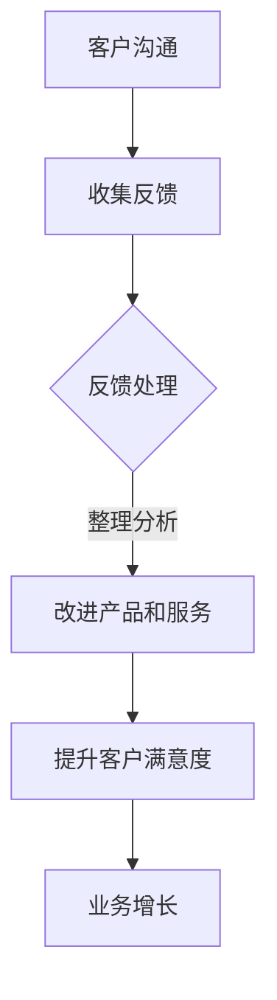

                 

### 文章标题

一人公司的客户沟通：建立有效反馈机制

关键词：一人公司、客户沟通、反馈机制、有效沟通、策略、案例分析

摘要：本文探讨了在独立经营的企业中，如何通过建立有效的反馈机制来优化客户沟通，提高客户满意度，并最终促进业务增长。文章结合实际案例，提供了具体的操作步骤和实用策略，旨在为一人公司的创业者提供有价值的指导。

## 1. 背景介绍（Background Introduction）

在当今竞争激烈的市场环境中，企业必须不断适应和调整以应对不断变化的需求。对于一人公司来说，由于资源和规模的限制，客户沟通尤为重要。有效的客户沟通不仅有助于建立良好的客户关系，还能为企业提供宝贵的反馈，帮助企业不断改进产品和服务。

然而，对于许多一人公司来说，客户沟通面临着诸多挑战。首先，由于独立经营者的时间和精力有限，他们可能无法及时响应客户的反馈。其次，缺乏专业的沟通技巧，可能导致信息传递不准确或误解。此外，一人公司往往缺乏完善的反馈机制，无法系统地收集和分析客户反馈，从而影响决策和业务发展。

本文将围绕如何建立有效的客户反馈机制展开讨论，为一人公司的创业者提供实用策略和建议。

## 2. 核心概念与联系（Core Concepts and Connections）

### 2.1 什么是客户沟通

客户沟通是指企业与客户之间的信息交流过程，旨在满足客户需求、解决客户问题、提升客户满意度和忠诚度。有效的客户沟通可以建立信任、增强客户体验，并为企业带来长期的商业价值。

### 2.2 客户反馈机制

客户反馈机制是指企业通过多种渠道收集客户意见、建议和反馈，并进行整理、分析和应用的过程。一个完善的客户反馈机制有助于企业及时了解客户需求，发现潜在问题，改进产品和服务，提升客户满意度。

### 2.3 客户沟通与反馈机制的关系

客户沟通与反馈机制密切相关。有效的客户沟通有助于收集到真实的客户反馈，而完善的反馈机制则能确保这些反馈得到及时、有效的处理和应用。通过建立良好的客户沟通和反馈机制，一人公司可以更好地了解客户需求，提升客户满意度，从而实现业务增长。

### 2.4 Mermaid 流程图（Mermaid Flowchart）

以下是一个简化的客户沟通与反馈机制的 Mermaid 流程图：



## 3. 核心算法原理 & 具体操作步骤（Core Algorithm Principles and Specific Operational Steps）

### 3.1 设计客户沟通渠道

要建立有效的反馈机制，首先需要设计多种客户沟通渠道。这些渠道包括但不限于：

- 电话热线：提供实时沟通，解决客户问题
- 电子邮件：方便客户提出问题或建议
- 在线聊天：快速响应客户需求，提高满意度
- 社交媒体：了解客户对产品和服务的看法
- 线下活动：与客户面对面交流，建立信任

### 3.2 设立反馈收集机制

为了确保客户反馈得到及时处理，一人公司可以采取以下措施：

- 创建专门的反馈收集平台：例如，搭建一个简单的在线反馈表单，方便客户随时提交意见。
- 定期开展问卷调查：通过问卷调查收集客户的满意度和建议，了解客户的需求和期望。
- 关注社交媒体：关注客户在社交媒体上的评论和讨论，及时回应客户问题。
- 定期举办客户座谈会：邀请客户代表参与座谈会，深入交流，了解客户的真实想法。

### 3.3 反馈处理与分析

收集到的客户反馈需要经过整理、分析和处理。具体步骤如下：

- 整理反馈：将反馈信息进行分类，区分重要程度和紧急程度。
- 分析反馈：运用数据分析和统计学方法，对反馈信息进行分析，找出共性问题和潜在改进点。
- 处理反馈：针对不同类型的反馈，采取相应的处理措施，如调整产品功能、改进服务质量、优化客户体验等。
- 跟进反馈：对处理结果进行跟踪和评估，确保反馈得到有效解决。

### 3.4 反馈应用与改进

将分析得到的反馈应用到产品和服务改进中，具体步骤如下：

- 改进产品功能：根据客户需求，优化产品功能，提升用户体验。
- 优化服务质量：针对客户反馈中提到的问题，改进服务流程，提高服务质量。
- 加强客户培训：为客户提供培训，帮助客户更好地使用产品和服务。
- 持续跟踪与反馈：建立持续跟踪和反馈机制，确保改进措施的有效性和持续性。

## 4. 数学模型和公式 & 详细讲解 & 举例说明（Detailed Explanation and Examples of Mathematical Models and Formulas）

为了更科学地评估客户反馈的效果，我们可以引入一些数学模型和公式。以下是一个简化的例子：

### 4.1 客户满意度评分模型

客户满意度评分模型可以用以下公式表示：

$$
S = \frac{1}{n} \sum_{i=1}^{n} S_i
$$

其中，$S$ 是总体客户满意度评分，$n$ 是客户数量，$S_i$ 是第 $i$ 位客户的满意度评分。

### 4.2 客户忠诚度模型

客户忠诚度可以用以下公式表示：

$$
L = \frac{1}{n} \sum_{i=1}^{n} L_i
$$

其中，$L$ 是总体客户忠诚度评分，$n$ 是客户数量，$L_i$ 是第 $i$ 位客户的忠诚度评分。

### 4.3 举例说明

假设有 10 位客户，他们的满意度评分分别为 8、9、7、8、9、8、9、8、9、10，忠诚度评分分别为 6、7、5、6、7、8、7、6、7、9。那么，总体客户满意度评分和忠诚度评分分别为：

$$
S = \frac{1}{10} (8 + 9 + 7 + 8 + 9 + 8 + 9 + 8 + 9 + 10) = 8.5
$$

$$
L = \frac{1}{10} (6 + 7 + 5 + 6 + 7 + 8 + 7 + 6 + 7 + 9) = 7
$$

通过这些模型和公式，一人公司可以更科学地评估客户满意度，发现潜在问题，并采取相应的改进措施。

## 5. 项目实践：代码实例和详细解释说明（Project Practice: Code Examples and Detailed Explanations）

### 5.1 开发环境搭建

为了搭建一个简单的客户反馈系统，我们需要以下工具和框架：

- 后端：使用 Python 和 Flask 搭建一个简单的 Web 应用程序。
- 前端：使用 HTML、CSS 和 JavaScript 来设计用户界面。
- 数据库：使用 SQLite 作为数据库存储客户反馈信息。

### 5.2 源代码详细实现

以下是简单的后端代码实现，用于处理客户反馈信息：

```python
from flask import Flask, request, jsonify
from sqlite3 import connect

app = Flask(__name__)

# 连接到 SQLite 数据库
conn = connect('feedback.db')
cursor = conn.cursor()

# 创建表格
cursor.execute('''CREATE TABLE IF NOT EXISTS feedback (
                  id INTEGER PRIMARY KEY AUTOINCREMENT,
                  name TEXT,
                  email TEXT,
                  message TEXT
              )''')

# 提交反馈
@app.route('/submit_feedback', methods=['POST'])
def submit_feedback():
    name = request.form['name']
    email = request.form['email']
    message = request.form['message']
    
    cursor.execute("INSERT INTO feedback (name, email, message) VALUES (?, ?, ?)", (name, email, message))
    conn.commit()
    
    return jsonify({'status': 'success', 'message': '反馈已提交'})

# 查看所有反馈
@app.route('/view_feedback', methods=['GET'])
def view_feedback():
    cursor.execute("SELECT * FROM feedback")
    feedback_list = cursor.fetchall()
    
    return jsonify({'feedback': feedback_list})

if __name__ == '__main__':
    app.run(debug=True)
```

### 5.3 代码解读与分析

这个简单的反馈系统包括两个主要功能：提交反馈和查看所有反馈。

1. **提交反馈**：通过 POST 请求提交反馈信息，包括姓名、电子邮件和反馈内容。后端代码通过 `request.form` 获取表单数据，然后将数据插入到数据库中。

2. **查看所有反馈**：通过 GET 请求获取所有反馈信息。后端代码查询数据库，获取反馈记录，并以 JSON 格式返回。

这个简单的代码示例展示了如何搭建一个基本的客户反馈系统。在实际应用中，我们可以进一步优化和扩展系统，如添加用户认证、邮件通知、数据分析等功能。

### 5.4 运行结果展示

在本地运行 Flask 应用程序后，可以通过浏览器访问以下链接来提交反馈和查看所有反馈：

- 提交反馈：`http://127.0.0.1:5000/submit_feedback`
- 查看所有反馈：`http://127.0.0.1:5000/view_feedback`

通过这些链接，用户可以提交反馈，系统会显示反馈提交成功的信息。同时，管理员可以通过查看所有反馈链接获取所有反馈记录。

## 6. 实际应用场景（Practical Application Scenarios）

一人公司的客户沟通和反馈机制可以在多个场景中发挥作用：

1. **初创企业**：初创企业通常资源有限，通过建立有效的客户反馈机制，可以快速了解市场需求，调整产品方向，降低失败风险。
2. **服务行业**：如咨询、培训等服务行业，通过客户反馈，可以不断改进服务质量，提高客户满意度，增强客户忠诚度。
3. **电子商务**：电子商务企业可以通过客户反馈，优化产品和服务，提高客户购物体验，促进复购和口碑传播。

## 7. 工具和资源推荐（Tools and Resources Recommendations）

### 7.1 学习资源推荐

- 《用户体验要素》：作者：贾森·福克斯（Jesse James Garrett）
- 《产品经理的核心技能》：作者：唐杰（Don Norman）
- 《如何做好产品》：作者：陈炜峰（Rick Braddy）

### 7.2 开发工具框架推荐

- Flask：Python Web 框架，适合快速搭建 Web 应用程序。
- React：前端 JavaScript 库，用于构建用户界面。
- MySQL：关系型数据库，适合存储客户反馈信息。

### 7.3 相关论文著作推荐

- 《客户关系管理》：作者：菲利普·科特勒（Philip Kotler）
- 《服务营销》：作者：迈克尔·所罗门（Michael R. Solomon）
- 《电子商务》：作者：威廉·H·戴维斯（William H. Davis）

## 8. 总结：未来发展趋势与挑战（Summary: Future Development Trends and Challenges）

### 8.1 未来发展趋势

1. **人工智能技术的应用**：随着人工智能技术的发展，客户反馈分析将更加智能化，为企业提供更精准的决策依据。
2. **个性化服务**：通过大数据和客户反馈，企业可以更好地了解客户需求，提供个性化服务，提高客户满意度。
3. **跨渠道沟通**：企业将利用多种渠道与客户沟通，实现无缝对接，提高客户体验。

### 8.2 面临的挑战

1. **数据隐私与保护**：在收集和分析客户反馈时，企业需要确保数据隐私和信息安全。
2. **客户满意度管理**：如何平衡客户满意度与业务增长，避免过度依赖单一指标。
3. **资源有限**：一人公司在资源有限的情况下，如何有效地利用客户反馈，实现业务增长。

## 9. 附录：常见问题与解答（Appendix: Frequently Asked Questions and Answers）

### 9.1 问题 1：如何确保客户反馈的真实性？

解答：为了确保客户反馈的真实性，企业可以采取以下措施：

- 采用匿名反馈机制，减少客户顾虑。
- 设计简明易懂的反馈问卷，避免诱导性提问。
- 定期开展客户满意度调查，从多个角度了解客户需求。

### 9.2 问题 2：如何处理大量客户反馈？

解答：对于大量客户反馈，企业可以采取以下措施：

- 分类整理反馈，区分重要程度和紧急程度。
- 建立反馈处理团队，分工协作。
- 定期召开反馈分析会议，讨论解决方案。

### 9.3 问题 3：客户反馈能否直接应用于产品改进？

解答：客户反馈可以作为产品改进的重要参考，但需要结合企业实际情况进行分析和判断。在应用客户反馈时，需要注意以下几点：

- 考虑反馈的普遍性和实用性。
- 结合企业战略和市场需求。
- 保持反馈与产品目标的一致性。

## 10. 扩展阅读 & 参考资料（Extended Reading & Reference Materials）

- 《精益创业》：作者：埃里克·莱斯（Eric Ries）
- 《客户至上》：作者：罗伯特·舒勒（Robert Shull）
- 《客户关系管理》：作者：菲利普·科特勒（Philip Kotler）
- 《用户体验设计》：作者：唐纳德·诺曼（Donald Norman）

<|im_sep|>作者：禅与计算机程序设计艺术 / Zen and the Art of Computer Programming<|im_sep|>

