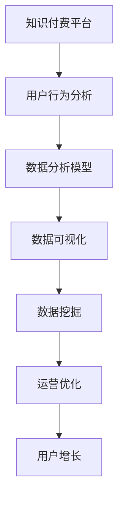

                 

# 知识付费平台的运营数据分析

> 关键词：知识付费, 数据分析, 用户行为, 模型预测, 数据可视化, 数据挖掘, 市场分析

## 1. 背景介绍

在数字时代，知识付费已成为知识分享和付费内容消费的重要形式。随着互联网的普及和数字技术的发展，知识付费平台如雨后春笋般涌现，为人们提供了高效便捷的知识获取途径。然而，尽管知识付费平台的数量与日俱增，但用户活跃度、转化率、收益等关键运营指标仍面临诸多挑战。本文将从运营数据分析的角度，深入探讨知识付费平台的成功要素，并提供实用的数据分析解决方案。

## 2. 核心概念与联系

### 2.1 核心概念概述

为更好地理解知识付费平台的运营数据分析，本节将介绍几个关键概念：

- **知识付费平台**：以互联网为媒介，为用户提供有偿知识服务的平台。常见的知识付费形式包括在线课程、电子书、音频节目等。

- **用户行为分析**：通过对用户在使用平台时的行为数据进行收集和分析，了解用户需求、行为偏好和购买习惯，从而优化产品设计和服务体验。

- **数据分析模型**：基于统计学和机器学习技术，构建用于分析用户行为、预测用户行为和推荐内容的模型，帮助平台提升运营效率。

- **数据可视化**：将复杂的数据信息通过图形、图表等方式直观呈现，帮助决策者理解数据，做出更科学的决策。

- **数据挖掘**：从海量数据中挖掘出有价值的模式和规律，帮助平台发现潜在用户需求和市场趋势，优化运营策略。

### 2.2 核心概念原理和架构的 Mermaid 流程图



这个流程图展示了知识付费平台运营分析的核心流程：

1. **用户行为分析**：通过收集用户行为数据，了解用户需求和行为模式。
2. **数据分析模型**：基于用户行为数据，构建预测和推荐模型，优化用户体验。
3. **数据可视化**：将分析结果直观展示，辅助决策者理解数据。
4. **数据挖掘**：从海量数据中发现潜在规律，指导运营策略。
5. **运营优化**：根据分析结果，调整平台策略，提升用户增长和转化率。

## 3. 核心算法原理 & 具体操作步骤

### 3.1 算法原理概述

知识付费平台的运营数据分析主要基于用户行为数据的收集、存储、处理和分析。其核心算法原理包括：

- **数据收集**：通过平台的用户行为日志、支付记录、课程评价等数据源，收集用户的行为数据。
- **数据存储**：将收集到的数据存储在数据库中，以便进行后续的数据分析和挖掘。
- **数据处理**：对存储的数据进行清洗、去重、归一化等预处理，保证数据的质量和一致性。
- **数据分析**：利用统计学和机器学习算法，对处理后的数据进行分析，发现用户行为规律和趋势。
- **模型预测**：基于分析结果，构建预测模型，预测用户行为和需求，指导平台运营决策。

### 3.2 算法步骤详解

#### 3.2.1 数据收集

数据收集是知识付费平台运营分析的第一步。主要的数据来源包括：

- **用户行为日志**：记录用户在平台上的浏览、学习、购买等行为。
- **支付记录**：记录用户支付信息，分析用户消费行为和购买能力。
- **课程评价**：记录用户对课程的评价，分析课程质量和用户满意度。

#### 3.2.2 数据存储

数据存储是确保数据完整性和可访问性的关键步骤。常见的数据存储方式包括：

- **关系型数据库**：如MySQL、PostgreSQL，适用于结构化数据存储。
- **NoSQL数据库**：如MongoDB、Cassandra，适用于非结构化数据的存储。
- **数据湖**：如Hadoop、Amazon S3，适用于大规模数据的存储和处理。

#### 3.2.3 数据处理

数据处理的目标是清洗、整理和准备数据，以便进行后续的分析。主要的数据处理步骤包括：

- **数据清洗**：去除重复、缺失、异常值等不符合规范的数据，保证数据质量。
- **数据归一化**：将不同来源的数据进行统一处理，转换为标准格式。
- **特征工程**：提取有意义的特征，如用户活跃度、课程评分等，以便进行模型训练。

#### 3.2.4 数据分析

数据分析是运营分析的核心环节。主要的数据分析方法包括：

- **描述性统计分析**：通过均值、中位数、标准差等指标，描述数据的分布和趋势。
- **探索性数据分析**：使用数据可视化工具，发现数据中的异常点和规律。
- **机器学习算法**：如回归分析、分类算法、聚类算法等，构建预测模型，优化运营策略。

#### 3.2.5 模型预测

模型预测的目标是根据历史数据，预测用户的行为和需求。常用的模型预测方法包括：

- **回归分析**：预测用户消费金额、课程学习时长等连续型指标。
- **分类算法**：预测用户是否会购买课程、课程是否会获得高评价等离散型指标。
- **协同过滤**：基于用户和课程的相似度，推荐可能感兴趣的课程。

### 3.3 算法优缺点

#### 3.3.1 算法优点

- **数据驱动决策**：通过分析用户行为数据，科学决策，提升平台运营效率。
- **用户个性化推荐**：利用协同过滤等算法，推荐个性化课程，提升用户满意度和转化率。
- **市场趋势预测**：通过数据挖掘，发现潜在市场趋势，指导课程开发和营销策略。

#### 3.3.2 算法缺点

- **数据隐私问题**：用户行为数据的收集和使用，可能引发隐私泄露风险。
- **数据质量要求高**：数据收集和处理环节复杂，数据质量对分析结果有重要影响。
- **模型复杂度高**：预测模型复杂，需要较高的计算资源和数据量。

### 3.4 算法应用领域

知识付费平台的运营数据分析广泛应用于以下几个领域：

- **用户增长**：分析用户增长趋势，优化用户获取策略。
- **课程推荐**：根据用户行为数据，推荐用户感兴趣的课程，提升用户留存率。
- **营销策略**：分析营销活动效果，优化广告投放策略。
- **收益预测**：预测平台收益，制定合理的定价和促销策略。

## 4. 数学模型和公式 & 详细讲解 & 举例说明

### 4.1 数学模型构建

知识付费平台的运营数据分析主要依赖于以下几个数学模型：

- **回归模型**：用于预测连续型指标，如用户消费金额、课程学习时长等。
- **分类模型**：用于预测离散型指标，如用户是否会购买课程、课程是否会获得高评价等。
- **协同过滤模型**：用于推荐系统，根据用户行为和课程特征，推荐可能感兴趣的课程。

### 4.2 公式推导过程

以回归模型为例，其公式推导过程如下：

设 $y$ 为连续型指标，$x$ 为影响指标的特征变量，$n$ 为样本数量。回归模型的目标是通过最小化误差 $e_i=y_i-\hat{y_i}$ 来拟合数据，其中 $\hat{y_i}$ 为模型预测值。常见的回归模型包括线性回归、多项式回归等。

线性回归模型的一般形式为：

$$
\hat{y} = \beta_0 + \beta_1x_1 + \beta_2x_2 + \cdots + \beta_kx_k
$$

其中 $\beta_0$ 为截距，$\beta_1, \beta_2, \cdots, \beta_k$ 为特征系数。线性回归模型的目标是找到最优的 $\beta_0, \beta_1, \beta_2, \cdots, \beta_k$，使得预测值 $\hat{y}$ 与实际值 $y$ 的误差最小化。

### 4.3 案例分析与讲解

以用户消费金额预测为例，假设平台收集到用户的支付记录 $(x_i, y_i)$，其中 $x_i$ 包括用户活跃度、课程评分等特征，$y_i$ 为用户的消费金额。可以通过线性回归模型进行预测，具体步骤如下：

1. **数据收集和处理**：收集用户的支付记录，对数据进行清洗、归一化等处理。
2. **模型训练**：使用历史数据 $(x_i, y_i)$，训练线性回归模型，得到特征系数 $\beta_0, \beta_1, \beta_2, \cdots, \beta_k$。
3. **模型预测**：对新用户 $x'$，利用训练好的模型进行预测，得到消费金额 $\hat{y}'$。

## 5. 项目实践：代码实例和详细解释说明

### 5.1 开发环境搭建

在进行知识付费平台的运营数据分析前，我们需要准备好开发环境。以下是使用Python进行Pandas和Scikit-Learn开发的环境配置流程：

1. 安装Anaconda：从官网下载并安装Anaconda，用于创建独立的Python环境。

2. 创建并激活虚拟环境：
```bash
conda create -n analytics-env python=3.8 
conda activate analytics-env
```

3. 安装Pandas和Scikit-Learn：
```bash
conda install pandas scikit-learn
```

4. 安装各类工具包：
```bash
pip install numpy matplotlib seaborn statsmodels
```

完成上述步骤后，即可在`analytics-env`环境中开始数据分析实践。

### 5.2 源代码详细实现

这里我们以用户消费金额预测为例，给出使用Pandas和Scikit-Learn进行回归模型训练的代码实现。

首先，定义数据处理和模型训练函数：

```python
import pandas as pd
from sklearn.linear_model import LinearRegression
from sklearn.model_selection import train_test_split
from sklearn.metrics import mean_squared_error, r2_score

def preprocess_data(data):
    # 数据清洗和归一化
    data = data.dropna()
    data = pd.get_dummies(data)
    return data

def train_model(X_train, y_train):
    # 训练线性回归模型
    model = LinearRegression()
    model.fit(X_train, y_train)
    return model

def evaluate_model(model, X_test, y_test):
    # 模型评估
    y_pred = model.predict(X_test)
    mse = mean_squared_error(y_test, y_pred)
    r2 = r2_score(y_test, y_pred)
    print(f"MSE: {mse:.3f}, R^2: {r2:.3f}")
```

接着，加载数据并进行模型训练：

```python
# 加载数据
data = pd.read_csv('user_data.csv')

# 数据预处理
X = preprocess_data(data.drop(['amount', 'user_id'], axis=1))
y = data['amount']

# 划分训练集和测试集
X_train, X_test, y_train, y_test = train_test_split(X, y, test_size=0.2, random_state=42)

# 模型训练和评估
model = train_model(X_train, y_train)
evaluate_model(model, X_test, y_test)
```

以上就是使用Pandas和Scikit-Learn进行回归模型训练的完整代码实现。可以看到，借助这些库，数据分析的实现变得非常简单高效。

### 5.3 代码解读与分析

让我们再详细解读一下关键代码的实现细节：

**preprocess_data函数**：
- `dropna`方法：去除缺失值，保证数据完整性。
- `get_dummies`方法：将分类特征进行独热编码，便于模型训练。

**train_model函数**：
- 实例化线性回归模型，并通过训练数据拟合模型。

**evaluate_model函数**：
- `predict`方法：对测试集进行预测。
- `mean_squared_error`和`r2_score`方法：评估模型预测结果与真实值的误差和相关性。

**训练流程**：
- 加载数据后，进行数据预处理。
- 使用`train_test_split`方法，将数据划分为训练集和测试集。
- 训练模型并输出模型评估结果。

可以看到，Pandas和Scikit-Learn提供了丰富而强大的数据分析工具，极大地简化了数据处理和模型训练的流程。

当然，工业级的系统实现还需考虑更多因素，如模型保存和部署、超参数自动搜索、数据可视化等。但核心的数据分析流程基本与此类似。

## 6. 实际应用场景

### 6.1 用户增长策略

通过用户行为数据的分析，可以了解用户的获取渠道、流失原因、转化路径等信息，从而制定有效的用户增长策略。

- **用户来源分析**：分析不同来源的用户转化率和留存率，优化广告投放和引流策略。
- **流失用户分析**：通过用户流失数据，分析流失原因，制定挽留策略。
- **推荐系统**：根据用户行为数据，推荐新用户可能感兴趣的课程，提升用户转化率。

### 6.2 课程推荐系统

利用协同过滤和推荐算法，为用户提供个性化的课程推荐，提升用户满意度和平台黏性。

- **协同过滤**：基于用户历史行为，推荐可能感兴趣的课程。
- **内容推荐**：根据课程标签和用户偏好，推荐相关课程。
- **多样性推荐**：在推荐同时，考虑课程多样性，避免用户陷入信息茧房。

### 6.3 市场趋势预测

通过对用户行为数据的分析，发现市场趋势，指导课程开发和营销策略。

- **热门课程分析**：分析课程的浏览量、购买量等指标，预测热门课程。
- **市场趋势预测**：基于热门课程数据，预测新课程的市场需求。
- **广告投放优化**：根据市场趋势，优化广告投放策略，提升营销效果。

### 6.4 未来应用展望

随着数据分析技术的不断发展，知识付费平台的运营分析将呈现以下几个趋势：

- **实时数据分析**：通过实时数据流处理技术，实现对用户行为数据的实时分析，及时调整运营策略。
- **多模态数据分析**：结合用户行为数据、文本评论、社交媒体等多模态数据，构建更全面的用户画像。
- **深度学习应用**：利用深度学习算法，如神经网络、强化学习，提升数据分析模型的精度和泛化能力。
- **数据隐私保护**：通过数据匿名化和加密技术，保护用户隐私，确保数据安全。

## 7. 工具和资源推荐

### 7.1 学习资源推荐

为了帮助开发者系统掌握知识付费平台的数据分析技术，这里推荐一些优质的学习资源：

1. 《数据分析实战》系列博文：由数据科学家撰写，系统介绍了数据分析的基本方法和工具，包括Pandas、Scikit-Learn等。

2. Coursera《机器学习》课程：由斯坦福大学开设的机器学习经典课程，涵盖了机器学习的基础理论和应用实例。

3. 《Python数据分析》书籍：深入浅出地介绍了Pandas、NumPy等Python数据分析库的使用方法，适合入门学习。

4. Kaggle数据科学竞赛：通过参与实际数据竞赛，学习数据分析和模型训练的最佳实践。

5. PyData官方文档：提供了丰富的Pandas、NumPy等库的官方文档，是数据分析开发的必备资料。

通过对这些资源的学习实践，相信你一定能够快速掌握知识付费平台的数据分析方法，并用于解决实际的运营问题。

### 7.2 开发工具推荐

高效的开发离不开优秀的工具支持。以下是几款用于知识付费平台数据分析开发的常用工具：

1. Jupyter Notebook：免费的交互式编程环境，支持多种编程语言和库，便于数据分析的可视化展示。

2. Tableau：商业智能和数据可视化工具，支持复杂的数据报表和可视化图表，适合业务决策分析。

3. Power BI：微软推出的商业智能和数据可视化工具，与Excel无缝集成，支持动态数据报表和仪表盘。

4. KNIME：开源的数据分析和数据科学平台，支持可视化编程，适合构建复杂的分析管道。

5. Apache Spark：大数据处理和分析引擎，支持分布式数据处理，适合大规模数据分析。

合理利用这些工具，可以显著提升知识付费平台的数据分析效率，加快数据驱动决策的步伐。

### 7.3 相关论文推荐

知识付费平台的数据分析技术源于学界的持续研究。以下是几篇奠基性的相关论文，推荐阅读：

1. "User Behavior Analysis for Knowledge Sharing Platforms"：通过数据分析发现用户行为规律，指导平台运营策略。

2. "Recommendation System for Personalized Learning"：利用协同过滤算法，提升个性化课程推荐效果。

3. "Predictive Modeling for Revenue Forecasting"：通过回归模型，预测平台收益，制定合理的定价和促销策略。

4. "Data Privacy Preservation in Knowledge Sharing Platforms"：探讨数据隐私保护技术，确保用户数据安全。

5. "Real-time Data Analysis for Smart Marketing"：利用实时数据流处理技术，实现对用户行为数据的实时分析。

这些论文代表了大数据分析技术的发展脉络。通过学习这些前沿成果，可以帮助研究者把握学科前进方向，激发更多的创新灵感。

## 8. 总结：未来发展趋势与挑战

### 8.1 总结

本文对知识付费平台的运营数据分析方法进行了全面系统的介绍。首先阐述了知识付费平台在数字时代的崛起，以及运营数据分析的重要作用。其次，从原理到实践，详细讲解了数据分析的数学模型和操作步骤，提供了实用的数据分析代码实例。同时，本文还广泛探讨了数据分析在用户增长、课程推荐、市场预测等运营场景中的应用，展示了数据分析的巨大潜力。此外，本文精选了数据分析技术的各类学习资源，力求为读者提供全方位的技术指引。

通过本文的系统梳理，可以看到，知识付费平台的数据分析技术正在成为平台运营的重要支柱，极大地提升了平台的运营效率和用户体验。未来，伴随数据分析技术的不断演进，知识付费平台的运营分析将更加智能、高效，为平台的持续增长和用户价值的最大化奠定坚实基础。

### 8.2 未来发展趋势

展望未来，知识付费平台的数据分析技术将呈现以下几个发展趋势：

- **数据驱动运营**：通过数据分析技术，实现对用户行为和市场趋势的全面洞察，指导平台运营决策。
- **多模态数据融合**：结合用户行为数据、文本评论、社交媒体等多模态数据，构建更全面的用户画像，提升分析的准确性和全面性。
- **实时数据分析**：通过实时数据流处理技术，实现对用户行为数据的实时分析，及时调整运营策略。
- **深度学习应用**：利用深度学习算法，提升数据分析模型的精度和泛化能力。
- **数据隐私保护**：通过数据匿名化和加密技术，保护用户隐私，确保数据安全。

这些趋势凸显了数据分析技术在知识付费平台运营中的重要性，将进一步提升平台的运营效率和用户体验。

### 8.3 面临的挑战

尽管知识付费平台的数据分析技术已经取得了不小的进展，但在迈向更加智能化、普适化应用的过程中，它仍面临诸多挑战：

- **数据隐私问题**：用户行为数据的收集和使用，可能引发隐私泄露风险。如何在数据采集和使用过程中保护用户隐私，是亟待解决的重要问题。
- **数据质量要求高**：数据收集和处理环节复杂，数据质量对分析结果有重要影响。如何保证数据质量，提升数据处理的效率，是数据分析的核心挑战。
- **模型复杂度高**：预测模型复杂，需要较高的计算资源和数据量。如何在保证模型精度的情况下，提高模型训练和推理的效率，是未来研究的重要方向。
- **技术门槛高**：数据分析技术复杂，需要较强的数学和编程功底。如何降低技术门槛，让更多非技术人员参与数据分析工作，是平台运营的重要课题。

### 8.4 研究展望

面对知识付费平台数据分析所面临的种种挑战，未来的研究需要在以下几个方面寻求新的突破：

- **数据隐私保护技术**：研究如何通过数据匿名化和加密技术，保护用户隐私，确保数据安全。
- **数据质量提升**：研究如何提高数据收集和处理效率，提升数据质量，确保分析结果的可靠性。
- **模型压缩和优化**：研究如何通过模型压缩和优化技术，降低模型复杂度，提升训练和推理效率。
- **技术普及和教育**：研究如何通过普及数据分析技术，降低技术门槛，让更多非技术人员参与数据分析工作，提升平台的运营效率。

这些研究方向的探索，必将引领知识付费平台的数据分析技术迈向更高的台阶，为平台的持续增长和用户价值的最大化奠定坚实基础。面向未来，数据分析技术还需要与其他人工智能技术进行更深入的融合，如自然语言处理、图像识别等，多路径协同发力，共同推动知识付费平台的发展。

## 9. 附录：常见问题与解答

**Q1：如何进行用户行为数据的收集和处理？**

A: 用户行为数据的收集和处理主要依赖于平台的用户行为日志、支付记录、课程评价等数据源。具体步骤如下：

1. **数据采集**：通过日志文件、数据库等方式，收集用户行为数据。
2. **数据清洗**：去除重复、缺失、异常值等不符合规范的数据，保证数据质量。
3. **数据归一化**：将不同来源的数据进行统一处理，转换为标准格式。
4. **特征提取**：提取有意义的特征，如用户活跃度、课程评分等，以便进行模型训练。

**Q2：如何构建有效的用户画像？**

A: 用户画像的构建需要综合考虑用户的各种行为数据。具体步骤如下：

1. **行为数据收集**：收集用户的浏览记录、购买记录、评价记录等数据。
2. **数据预处理**：对收集到的数据进行清洗、归一化等处理。
3. **特征提取**：提取有意义的特征，如用户活跃度、课程评分等。
4. **数据可视化**：利用数据可视化工具，将用户画像直观展示，帮助决策者理解用户需求。

**Q3：如何进行实时数据分析？**

A: 实时数据分析主要依赖于数据流处理技术。具体步骤如下：

1. **数据采集**：通过实时数据流技术，实时采集用户行为数据。
2. **数据预处理**：对实时数据进行清洗、归一化等处理。
3. **数据存储**：将处理后的数据存储在实时数据仓库中。
4. **实时分析**：利用流处理框架（如Apache Kafka、Apache Flink），对实时数据进行分析和处理。

**Q4：如何进行数据隐私保护？**

A: 数据隐私保护主要依赖于数据匿名化和加密技术。具体步骤如下：

1. **数据匿名化**：通过数据脱敏、伪装等技术，去除敏感信息，保护用户隐私。
2. **数据加密**：对敏感数据进行加密存储，确保数据传输和存储的安全性。
3. **访问控制**：通过身份认证、权限控制等技术，限制对敏感数据的访问权限。

**Q5：如何构建高效的预测模型？**

A: 高效的预测模型需要综合考虑模型复杂度、数据量、计算资源等因素。具体步骤如下：

1. **模型选择**：选择适合的数据分析模型，如回归模型、分类模型等。
2. **特征工程**：提取有意义的特征，如用户活跃度、课程评分等。
3. **模型训练**：使用历史数据训练模型，优化模型参数，提高模型精度。
4. **模型评估**：使用测试数据评估模型效果，调整模型参数，提升模型泛化能力。

---

作者：禅与计算机程序设计艺术 / Zen and the Art of Computer Programming

