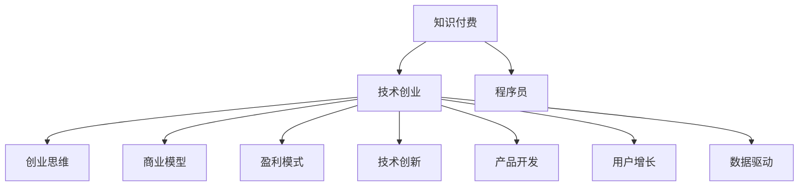

                 

# 知识付费时代程序员的创业思维

> 关键词：知识付费, 创业思维, 程序员, 商业模型, 盈利模式, 技术创新, 产品开发, 用户增长, 数据驱动

## 1. 背景介绍

### 1.1 问题由来

随着互联网和数字经济的迅速发展，知识付费成为了一种新的经济形态，逐渐渗透到各行各业。程序员作为技术创新和产品开发的核心力量，在这种背景下如何抓住机会，从单纯的技术专家转型为企业家，是每一个立志创业的程序员需要深思的问题。

### 1.2 问题核心关键点

知识付费时代，程序员可以通过技术优势和专业知识，创造价值，实现创业梦想。核心关键点包括：

- 识别用户需求：准确把握用户痛点，提供有针对性的解决方案。
- 打造技术壁垒：利用独有的技术能力，形成市场竞争力。
- 创新商业模式：探索多元化的盈利模式，扩大市场覆盖。
- 用户增长策略：建立有效的用户获取和留存机制。
- 数据驱动决策：基于数据分析进行产品优化和市场预测。

### 1.3 问题研究意义

在知识付费时代，程序员通过技术创新和商业模式创新，可以在教育、培训、咨询、企业内部解决方案等多个领域实现创业，推动技术进步和产业发展，同时实现个人价值和社会价值的双重提升。本文旨在探索程序员创业思维的核心要素，为有志于此领域的程序员提供方向性指导。

## 2. 核心概念与联系

### 2.1 核心概念概述

为更好地理解知识付费时代程序员的创业思维，本节将介绍几个密切相关的核心概念：

- 知识付费：通过付费方式获取专业知识或技术资源，提高学习效率和知识质量。
- 技术创业：利用技术优势和专业知识，开展以技术为核心的商业活动。
- 程序员：掌握计算机科学及相关技术的专业人员，具备技术创新和产品开发的能力。
- 创业思维：企业家的思维方式，包括市场洞察、商业模式、用户需求、产品规划等各个方面。
- 商业模型：企业在市场上的盈利方式，如订阅制、按需付费、广告收入等。
- 盈利模式：企业的收入来源，包括直接收益和间接收益。
- 技术创新：通过新技术、新方法、新工具，推动产品和服务的创新。
- 产品开发：设计和开发符合市场需求的新产品或服务。
- 用户增长：吸引并保持用户群体，实现产品和服务的市场扩张。
- 数据驱动：利用数据分析和技术手段，优化产品和服务，指导商业决策。

这些核心概念之间的逻辑关系可以通过以下Mermaid流程图来展示：



这个流程图展示了几者之间的逻辑关系：

1. 知识付费为技术创业提供了市场背景和用户需求。
2. 程序员是知识付费和商业创新的重要参与者。
3. 创业思维贯穿于技术创业的全过程。
4. 商业模型和盈利模式是技术创业的核心要素。
5. 技术创新和产品开发是技术创业的关键驱动力。
6. 用户增长和数据驱动是技术创业成功的保障。

## 3. 核心算法原理 & 具体操作步骤

### 3.1 算法原理概述

知识付费时代程序员的创业思维，本质上是一种以技术为核心、以市场为导向的商业化过程。其核心思想是：通过技术创新和产品开发，满足市场需求，形成具有竞争力的商业模式，实现可持续盈利。

形式化地，假设有一个程序员团队 $T$，具备技术优势 $S$，面对市场需求 $D$，选择一个适合的商业模型 $M$，其盈利能力可以表示为：

$$
\text{Profit}(T, D, M) = F(\text{Value}(T, S, D), \text{Cost}(T, M))
$$

其中 $\text{Value}(T, S, D)$ 表示团队通过技术和产品创造的价值，$\text{Cost}(T, M)$ 表示商业模式下的运营成本。

### 3.2 算法步骤详解

基于知识付费时代程序员的创业思维，下面详细介绍其实现步骤：

**Step 1: 识别市场需求**
- 调查目标市场，了解用户需求和痛点。
- 进行市场调研，分析用户数据和行为，挖掘潜在需求。

**Step 2: 确定技术路线**
- 评估自身技术能力，确定技术选型和开发方向。
- 制定技术规划，明确技术研发重点和路线图。

**Step 3: 设计商业模式**
- 根据市场需求和技术能力，选择合适的商业模型。
- 设计盈利模式，明确主要收入来源和盈利策略。

**Step 4: 开发核心产品**
- 基于技术路线和商业模型，进行产品需求分析和设计。
- 启动产品开发，迭代优化产品功能和用户体验。

**Step 5: 推广和营销**
- 利用社交媒体、搜索引擎、内容营销等手段，扩大产品知名度。
- 建立社区和粉丝群体，增强用户粘性和品牌忠诚度。

**Step 6: 数据驱动优化**
- 收集用户反馈和行为数据，进行数据分析和用户画像。
- 根据数据分析结果，调整产品策略和运营方案。

**Step 7: 持续改进和创新**
- 跟踪市场和技术动态，不断优化和迭代产品。
- 探索新技术和新市场，保持技术领先和产品创新。

### 3.3 算法优缺点

知识付费时代程序员的创业思维，具有以下优点：

1. 高效利用技术优势：程序员的技术专长可以直接转化为产品和服务的核心竞争力。
2. 快速响应市场变化：基于技术优势，能够快速推出符合市场需求的新产品。
3. 数据驱动决策：利用数据分析，能够科学地进行产品优化和市场预测。

同时，该方法也存在一定的局限性：

1. 技术依赖性强：技术创新和产品开发高度依赖于程序员的技术水平。
2. 市场风险高：产品开发和市场推广的不确定性较高。
3. 资金需求大：初期开发和推广需要大量的资金投入。
4. 用户体验复杂：技术和产品设计需要兼顾用户体验，否则难以获得用户认可。

尽管存在这些局限性，但知识付费时代程序员的创业思维无疑为程序员提供了广阔的创新空间和发展机会，值得深入探索和实践。

### 3.4 算法应用领域

知识付费时代程序员的创业思维，可以在以下领域得到广泛应用：

- 在线教育：开发在线课程、编程教程、技术培训等产品，满足学习者的知识需求。
- 技术咨询服务：提供企业内部技术解决方案、系统集成、技术顾问等服务。
- 软件开发工具：开发和推广编程工具、开发框架、插件等，提升开发效率。
- 技术咨询平台：建立技术社区，提供技术交流、问题解答、项目外包等服务。
- 技术创新公司：专注于技术前沿，探索新领域、新技术和新市场，形成技术壁垒。

除了上述这些经典应用外，程序员创业思维还将随着技术的发展，不断拓展到更多领域，为社会带来更广泛的价值。

## 4. 数学模型和公式 & 详细讲解 & 举例说明

### 4.1 数学模型构建

本节将使用数学语言对知识付费时代程序员的创业思维进行更加严格的刻画。

记市场需求为 $D$，技术优势为 $S$，商业模型为 $M$，盈利能力为 $P$。假设市场需求和商业模型为连续变量，表示为 $D \in \mathbb{R}^n$，$M \in \mathbb{R}^m$。盈利能力 $P$ 可表示为：

$$
P = f(D, S, M)
$$

其中 $f$ 为数学模型函数，可以根据具体情况选择线性模型、非线性模型、博弈模型等。

### 4.2 公式推导过程

以下我们以一个简单的线性模型为例，推导创业盈利能力的计算公式。

假设市场需求与盈利能力的关系为线性模型：

$$
P = a_0 + a_1 D + a_2 S + a_3 M + a_4 D \cdot S + a_5 D \cdot M + a_6 S \cdot M
$$

其中 $a_0$ 为常数项，$a_1$ 至 $a_6$ 为回归系数。

通过最小二乘法等统计方法，可以求解出最优的回归系数：

$$
\hat{a}_i = \frac{\sum_{i=1}^n (x_i - \bar{x}) (y_i - \bar{y})}{\sum_{i=1}^n (x_i - \bar{x})^2}, i=0,1,\cdots,6
$$

带入数据 $D, S, P$ 求解得到最优回归系数后，即可计算盈利能力 $P$。

### 4.3 案例分析与讲解

假设某程序员团队开发了一款在线编程教育平台，通过市场需求调研，发现以下三个因素对盈利能力有显著影响：

1. 用户数量 $D$：用户规模直接影响平台的市场份额和广告收入。
2. 技术质量 $S$：课程内容、教学质量、技术支持等直接影响用户满意度和口碑传播。
3. 商业模式 $M$：付费模式（按需付费、订阅制）、增值服务（技术支持、项目外包）等直接影响盈利结构。

基于以上假设，假设回归模型如下：

$$
P = 1000 + 10D + 20S + 30M - 5D \cdot S + 10D \cdot M + 15S \cdot M
$$

通过实际数据的收集和计算，可以求解出最优回归系数，得到平台的盈利能力预测公式。

## 5. 项目实践：代码实例和详细解释说明

### 5.1 开发环境搭建

在进行知识付费时代程序员的创业思维实践前，我们需要准备好开发环境。以下是使用Python进行数据驱动的商业模型优化实验的环境配置流程：

1. 安装Anaconda：从官网下载并安装Anaconda，用于创建独立的Python环境。

2. 创建并激活虚拟环境：
```bash
conda create -n business-env python=3.8 
conda activate business-env
```

3. 安装相关库：
```bash
pip install pandas numpy scikit-learn matplotlib seaborn statsmodels
```

4. 安装Jupyter Notebook：
```bash
pip install jupyterlab
```

完成上述步骤后，即可在`business-env`环境中开始创业思维实验。

### 5.2 源代码详细实现

下面我们以一个简单的线性回归模型为例，给出使用Python进行数据驱动的商业模型优化的代码实现。

首先，定义数据集和模型参数：

```python
import pandas as pd
import numpy as np
from sklearn.linear_model import LinearRegression

# 读取数据
data = pd.read_csv('business_data.csv')

# 定义模型参数
D = data['D']
S = data['S']
M = data['M']
P = data['P']

# 定义模型
model = LinearRegression()
```

接着，进行数据预处理和模型训练：

```python
# 数据预处理
X = np.column_stack([D, S, M])
y = P

# 模型训练
model.fit(X, y)
```

最后，输出模型参数并计算盈利能力：

```python
# 输出模型参数
print(model.coef_)
print(model.intercept_)

# 计算盈利能力
predicted_P = model.predict(X)
print(predicted_P)
```

以上就是使用Python进行数据驱动的商业模型优化的完整代码实现。可以看到，通过简单的线性回归模型，就可以量化市场需求、技术优势和商业模式对盈利能力的影响，为创业决策提供科学依据。

### 5.3 代码解读与分析

让我们再详细解读一下关键代码的实现细节：

**数据读取和处理**：
- 使用Pandas库读取CSV格式的数据集，存储到DataFrame中。
- 根据业务需求，选择相关列进行模型训练。

**模型定义和训练**：
- 使用Scikit-learn库定义线性回归模型，并进行训练。
- 模型训练过程中，通过最小二乘法求解最优回归系数。

**模型输出和预测**：
- 使用模型参数和训练集数据，计算预测的盈利能力。
- 将预测结果输出，供创业者进行决策参考。

这些代码实现展示了数据驱动决策的基本步骤，即数据收集、模型训练和结果输出。通过数学模型，创业者能够将复杂的市场和技术问题转化为可计算的指标，科学地进行决策。

当然，工业级的系统实现还需考虑更多因素，如模型的超参数调优、特征工程、预测结果的可视化等。但核心的数据驱动决策基本与此类似。

## 6. 实际应用场景

### 6.1 在线教育平台

在线教育平台作为知识付费的重要应用场景，通过数据驱动的商业模型优化，可以大幅提升用户留存率和转化率，提高平台的盈利能力。

具体而言，可以收集用户注册、登录、课程学习、购买等行为数据，提取和商业模型相关的特征，如用户活跃度、课程评分、课程订阅量等。利用这些数据，建立数据驱动的商业模型，实时监控平台运营情况，动态调整产品策略，提升用户满意度和粘性，从而增加盈利能力。

### 6.2 软件开发工具

软件开发工具作为程序员创业的重要领域，通过数据驱动的产品优化，可以更好地满足用户需求，提升工具的使用体验和市场竞争力。

在实践中，可以收集用户的使用反馈、工具的下载量、功能使用率等数据，提取和产品优化相关的特征，如功能模块使用频率、错误率、用户满意度等。利用这些数据，建立数据驱动的产品优化模型，实时监控产品使用情况，动态调整产品功能，优化用户体验，从而增加用户黏性，提升市场份额和盈利能力。

### 6.3 技术咨询公司

技术咨询公司作为知识付费的重要服务提供商，通过数据驱动的客户管理，可以更精准地识别客户需求，提供更符合市场需求的技术解决方案。

在实践中，可以收集客户的需求调查、项目需求、服务满意度等数据，提取和客户管理相关的特征，如客户行业分布、项目类型、服务反馈等。利用这些数据，建立数据驱动的客户管理模型，实时监控客户需求变化，动态调整服务策略，提升客户满意度和忠诚度，从而增加客户续约率和市场份额，提升盈利能力。

### 6.4 未来应用展望

随着数据驱动决策技术的不断演进，知识付费时代程序员的创业思维将呈现以下几个发展趋势：

1. 数据治理能力增强：数据质量提升和数据治理技术的成熟，将大幅提升数据驱动决策的准确性和可靠性。
2. 模型自动化水平提高：自动化模型构建和优化技术的普及，将降低创业者的技术门槛，提高决策效率。
3. 人工智能融合应用：大数据、人工智能等先进技术的引入，将进一步增强数据驱动决策的智能化水平。
4. 实时化、动态化决策：实时数据采集和处理技术的应用，将使得数据驱动决策更具实时性和动态性。
5. 跨领域、跨学科融合：不同领域和学科的数据驱动决策技术融合，将拓展数据驱动决策的应用范围和深度。

这些趋势凸显了知识付费时代程序员的创业思维的广阔前景。数据驱动决策技术的应用，将使得程序员创业者能够更好地把握市场机会，提升决策科学性和效率，实现持续增长。

## 7. 工具和资源推荐

### 7.1 学习资源推荐

为了帮助创业者系统掌握数据驱动决策的理论基础和实践技巧，这里推荐一些优质的学习资源：

1. 《数据驱动决策：实战指南》系列博文：由数据科学专家撰写，深入浅出地介绍了数据驱动决策的理论基础和实践方法。

2. Coursera《数据科学导论》课程：由知名大学开设的数据科学入门课程，涵盖数据处理、模型构建、决策分析等关键内容，适合初学者。

3. Kaggle数据竞赛平台：提供海量真实数据集，鼓励数据驱动决策的实战练习，积累实践经验。

4. 《Python数据分析实战》书籍：全面介绍Python在数据分析中的应用，包括数据清洗、数据可视化、模型构建等。

5. 《数据驱动的商业决策》课程：聚焦于商业场景的数据驱动决策，提供实战案例和应用策略，助力创业者提升决策能力。

通过对这些资源的学习实践，相信创业者能够更好地掌握数据驱动决策的精髓，并将其应用于创业实践中。

### 7.2 开发工具推荐

高效的开发离不开优秀的工具支持。以下是几款用于数据驱动决策优化的常用工具：

1. Python：广泛用于数据科学和机器学习的编程语言，丰富的第三方库支持。

2. Jupyter Notebook：交互式编程环境，支持数据可视化、模型构建和结果展示。

3. Pandas：数据处理和分析库，提供高效的数据清洗和数据操作功能。

4. Matplotlib：数据可视化库，支持绘制各种统计图表和可视化结果。

5. Seaborn：基于Matplotlib的数据可视化库，支持更高级的统计图表绘制。

6. TensorFlow和PyTorch：深度学习框架，支持数据驱动决策模型的构建和优化。

合理利用这些工具，可以显著提升数据驱动决策的开发效率，加快创新迭代的步伐。

### 7.3 相关论文推荐

数据驱动决策技术的发展源于学界的持续研究。以下是几篇奠基性的相关论文，推荐阅读：

1. "Data Mining, Statistical Learning, and Statistical Reasoning"：强调数据驱动决策的重要性，介绍了数据挖掘和统计学习的关键技术。

2. "The Elements of Statistical Learning"：经典统计学习教材，涵盖各种统计模型和方法，适合深入学习。

3. "Pattern Recognition and Machine Learning"：介绍模式识别和机器学习的基础知识，包括分类、回归、聚类等。

4. "The Data-Driven Decision-Making Model in Business"：讨论数据驱动决策在商业中的应用，提供实际案例和分析方法。

5. "Data Mining and Statistical Learning"：深入探讨数据驱动决策的理论基础和应用场景，适合专业研究和实践参考。

这些论文代表了大数据和机器学习驱动决策技术的发展脉络。通过学习这些前沿成果，可以帮助创业者把握学科前进方向，激发更多的创新灵感。

## 8. 总结：未来发展趋势与挑战

### 8.1 总结

本文对知识付费时代程序员的创业思维进行了全面系统的介绍。首先阐述了知识付费时代的背景和程序员创业的重要性，明确了数据驱动决策的核心要素。其次，从原理到实践，详细讲解了数据驱动决策的数学模型和实际操作步骤，给出了创业决策的完整代码实例。同时，本文还广泛探讨了数据驱动决策在教育、软件开发、技术咨询等多个行业领域的应用前景，展示了数据驱动决策技术的巨大潜力。此外，本文精选了数据驱动决策技术的各类学习资源，力求为创业者提供全方位的技术指引。

通过本文的系统梳理，可以看到，知识付费时代程序员的创业思维正在成为数据驱动决策技术的重要范式，极大地提升了创业者的决策科学性和效率，推动了技术和业务的双重进步。未来，伴随数据科学和机器学习技术的不断进步，数据驱动决策技术必将迎来更广阔的发展空间，为创业者提供更多的机遇和挑战。

### 8.2 未来发展趋势

展望未来，知识付费时代程序员的创业思维将呈现以下几个发展趋势：

1. 数据质量提升：数据清洗和治理技术的进步，将使得数据驱动决策更准确、更可靠。

2. 模型自动化和优化：自动化模型构建和优化技术的普及，将降低数据驱动决策的技术门槛，提高决策效率。

3. 智能决策系统：人工智能和大数据技术的融合，将进一步增强数据驱动决策的智能化水平。

4. 实时化、动态化决策：实时数据采集和处理技术的应用，将使得数据驱动决策更具实时性和动态性。

5. 跨领域、跨学科融合：不同领域和学科的数据驱动决策技术融合，将拓展数据驱动决策的应用范围和深度。

以上趋势凸显了知识付费时代程序员的创业思维的广阔前景。数据驱动决策技术的持续演进，将使得程序员创业者能够更好地把握市场机会，提升决策科学性和效率，实现持续增长。

### 8.3 面临的挑战

尽管数据驱动决策技术已经取得了瞩目成就，但在迈向更加智能化、普适化应用的过程中，它仍面临着诸多挑战：

1. 数据隐私和安全性：数据采集和使用过程中，如何保护用户隐私和数据安全，是数据驱动决策面临的主要挑战。

2. 数据质量不稳定：数据来源多样，数据质量参差不齐，如何提高数据质量和准确性，是数据驱动决策需要解决的关键问题。

3. 模型复杂度高：数据驱动决策模型通常较为复杂，如何降低模型复杂度，提高模型可解释性，是数据驱动决策需要优化的地方。

4. 实时性要求高：数据驱动决策需要实时响应市场变化，如何提高系统实时处理能力，是数据驱动决策需要突破的难点。

5. 多源数据整合：不同来源和格式的数据，如何有效整合，形成一致的数据视图，是数据驱动决策需要解决的技术问题。

这些挑战凸显了数据驱动决策技术的复杂性和复杂性，需要不断优化和创新，才能真正实现数据驱动决策技术的商业价值。

### 8.4 研究展望

面对数据驱动决策技术面临的挑战，未来的研究需要在以下几个方面寻求新的突破：

1. 数据隐私保护技术：研究数据隐私保护和数据安全技术，确保数据使用过程中的安全性和隐私性。

2. 数据治理和清洗技术：研究数据治理和数据清洗技术，提高数据质量和准确性，为数据驱动决策提供可靠的基础。

3. 模型可解释性和自动化：研究模型可解释性和自动化技术，提高模型的透明度和可解释性，降低技术门槛。

4. 实时数据处理和分析技术：研究实时数据处理和分析技术，提高数据驱动决策的实时性和动态性。

5. 跨领域数据整合技术：研究跨领域数据整合技术，提高不同数据源和数据格式的一致性和融合度。

这些研究方向的探索，必将引领数据驱动决策技术迈向更高的台阶，为知识付费时代的程序员创业者提供更多的创新灵感和解决方案。只有勇于创新、敢于突破，才能真正实现数据驱动决策技术的商业价值，推动创业企业的发展和进步。

## 9. 附录：常见问题与解答

**Q1：数据驱动决策是否适用于所有行业？**

A: 数据驱动决策可以应用于绝大多数行业，但不同的行业需要关注的重点不同。例如，金融行业更关注风险管理，医疗行业更关注健康数据分析，教育行业更关注学习行为分析。因此，不同行业的数据驱动决策方法和模型设计应有所不同。

**Q2：如何确保数据的质量和准确性？**

A: 确保数据的质量和准确性是数据驱动决策的前提。可以从以下几个方面入手：

1. 数据来源可靠：选择可靠的数据来源，确保数据的真实性和可信度。
2. 数据清洗和处理：通过数据清洗和预处理，去除异常值和噪声，提高数据质量。
3. 数据治理和规范：建立数据治理和数据规范，确保数据的一致性和完整性。
4. 数据监测和反馈：实时监测数据质量，及时发现和纠正数据异常，确保数据准确性。

**Q3：数据驱动决策中的数据隐私和安全如何保护？**

A: 数据隐私和安全是数据驱动决策面临的重要挑战。可以从以下几个方面入手：

1. 数据匿名化：对敏感数据进行匿名化处理，减少隐私泄露风险。
2. 数据加密：对数据进行加密存储和传输，确保数据安全。
3. 访问控制：对数据访问进行严格控制，确保只有授权人员可以访问敏感数据。
4. 数据合规：遵守相关法律法规，确保数据使用的合规性和合法性。

**Q4：数据驱动决策中的模型复杂度如何降低？**

A: 数据驱动决策中的模型复杂度是一个需要关注的问题。可以从以下几个方面入手：

1. 特征选择和降维：通过特征选择和降维技术，减少模型复杂度，提高模型效率。
2. 模型简化：通过简化模型结构，降低模型复杂度，提高模型可解释性和可操作性。
3. 自动化模型优化：利用自动化模型优化技术，提高模型优化效率，降低技术门槛。

**Q5：如何实现实时数据驱动决策？**

A: 实时数据驱动决策需要高效的数据处理和分析能力。可以从以下几个方面入手：

1. 实时数据采集：通过实时数据采集技术，保证数据的时效性。
2. 实时数据处理：利用实时数据处理技术，快速进行数据清洗和分析。
3. 实时数据存储：利用实时数据存储技术，确保数据的高效访问和快速处理。

这些策略往往需要根据具体行业和应用场景进行灵活组合。只有在数据、模型、技术、应用等各个环节进行全面优化，才能真正实现数据驱动决策的实时性和动态性。

