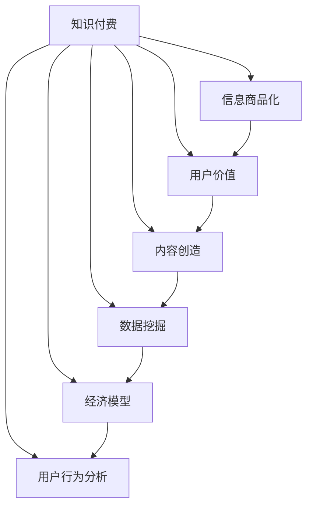

                 

# 知识付费时代：信息商品化的利弊

> 关键词：知识付费, 信息商品化, 用户价值, 内容创造, 数据挖掘, 经济模型, 用户行为分析

## 1. 背景介绍

### 1.1 问题由来
随着互联网和信息技术的飞速发展，知识的传播和获取变得更加容易。人们不再受限于传统的图书、报纸等实体媒介，而是可以通过各种在线平台随时随地获取所需信息。然而，这种便利也带来了新的问题：信息过载、知识碎片化、质量参差不齐等问题逐渐显现。为了筛选有价值的信息，很多用户开始付费订阅高质量的内容。这一现象被广泛称为“知识付费”。

知识付费不仅仅是消费行为的变化，更是信息商品化的一个表现。从传统的知识传播方式，到通过付费获取，信息商品化的路径在各个行业逐步显现，特别是在教育、科技、医疗等高附加值领域，信息商品化的趋势尤为明显。

### 1.2 问题核心关键点
知识付费的本质是信息商品化。它改变了知识的获取方式和消费者行为，也带来了新的经济模式和商业机会。同时，知识付费也引发了一系列社会和经济问题，如信息不对称、价格歧视、内容质量良莠不齐等。因此，理解知识付费时代信息商品化的利弊，对于制定相关政策和指导企业运营具有重要意义。

## 2. 核心概念与联系

### 2.1 核心概念概述

为更好地理解知识付费时代的信息商品化，本节将介绍几个关键概念：

- **知识付费**：指用户为获取高质量、专业化的知识内容而支付费用的行为。形式包括在线课程、专业文章、视频讲座等。

- **信息商品化**：指信息成为一种可交易的商品，通过市场机制进行买卖，如图书、课程、咨询等。

- **用户价值**：指用户从信息消费中获得的使用价值和情感价值，是信息商品化的核心驱动因素。

- **内容创造**：指专业机构或个人为满足用户需求而创作知识内容的过程。

- **数据挖掘**：指从大量数据中提取有用信息，用于优化知识商品化的过程，如用户画像、内容推荐等。

- **经济模型**：指知识付费平台为实现商业目标所采取的商业模式，如订阅制、单次购买、按需付费等。

- **用户行为分析**：指通过分析用户的行为数据，来了解用户需求、优化推荐算法，提升用户体验。

这些核心概念之间的逻辑关系可以通过以下Mermaid流程图来展示：



这个流程图展示了知识付费时代各个概念之间的相互作用关系：

1. **知识付费**通过平台收集用户价值，引导内容创造和数据挖掘，并采用经济模型和用户行为分析来优化服务。
2. **信息商品化**则体现为通过市场交易获取信息，反过来又影响用户价值和内容创造。
3. **用户价值**驱动内容创造和数据挖掘，而内容创造和数据挖掘又进一步提升用户价值。
4. **内容创造**和**数据挖掘**为经济模型提供支撑，使平台能够精准定价和个性化推荐。
5. **经济模型**和**用户行为分析**则不断优化信息商品化的过程。

## 3. 核心算法原理 & 具体操作步骤
### 3.1 算法原理概述

知识付费时代的信息商品化，主要依赖于以下几个核心算法原理：

- **推荐系统算法**：通过分析用户行为数据，生成个性化推荐列表，提高用户体验和平台营收。
- **定价策略算法**：根据内容价值、用户画像和市场竞争等因素，动态调整价格，实现用户价值最大化。
- **内容审核与筛选算法**：对用户上传的内容进行审核和筛选，确保内容质量和合规性，提升平台声誉。
- **数据分析与预测算法**：对用户行为、市场趋势等数据进行挖掘和预测，优化平台运营决策。

这些算法共同构成了知识付费时代信息商品化的核心框架，使得平台能够有效管理和优化信息资源。

### 3.2 算法步骤详解

知识付费时代的信息商品化过程，主要包括以下几个关键步骤：

**Step 1: 用户行为数据采集与分析**

- 收集用户的基本信息、浏览历史、购买记录等数据。
- 使用数据分析算法，提取用户行为特征，如兴趣偏好、购买频率等。

**Step 2: 内容推荐**

- 利用推荐系统算法，对每个用户生成个性化推荐列表。
- 推荐系统通常基于协同过滤、内容基推荐、混合推荐等技术实现。

**Step 3: 内容审核与筛选**

- 对用户上传的内容进行审核和筛选，确保符合平台政策和质量标准。
- 内容审核通常采用机器学习和人工审查相结合的方式。

**Step 4: 定价策略制定**

- 根据内容价值、市场竞争等因素，制定动态定价策略。
- 定价算法可以采用收益管理、拍卖机制、价值定价等方法。

**Step 5: 个性化定价**

- 根据用户画像和行为数据，对不同用户提供个性化定价。
- 个性化定价有助于提升用户价值，但也需要平衡成本和收益。

**Step 6: 数据分析与预测**

- 对用户行为数据和市场趋势进行挖掘和预测，优化平台运营决策。
- 数据分析与预测算法包括聚类分析、回归分析、时间序列分析等。

### 3.3 算法优缺点

知识付费时代的信息商品化算法具有以下优点：

- **提升用户体验**：个性化推荐和动态定价能够满足用户需求，提升用户满意度和忠诚度。
- **优化资源配置**：通过数据分析与预测，平台可以优化内容发布和价格调整，提高资源利用率。
- **增加收益**：个性化定价和市场化运作，使平台能够实现盈利，推动可持续发展。

同时，这些算法也存在以下缺点：

- **用户隐私风险**：大量用户行为数据的收集和分析，可能侵犯用户隐私。
- **价格歧视**：个性化定价可能引发价格歧视，增加市场竞争复杂性。
- **内容审核难度大**：大规模内容审核和筛选，成本较高且容易误判。
- **算法依赖强**：算法依赖于数据质量和模型选择，一旦数据或模型出错，可能影响平台运营。

### 3.4 算法应用领域

知识付费时代的信息商品化算法，在以下几个领域得到了广泛应用：

- **在线教育**：通过推荐系统算法，为学生推荐个性化课程和学习资料，提升学习效果。
- **专业咨询**：通过定价策略算法，为专家提供个性化定价和市场化运作，增加平台营收。
- **健康管理**：通过数据分析与预测算法，为患者推荐个性化的健康建议和治疗方案，提升医疗服务质量。
- **金融理财**：通过内容审核与筛选算法，为用户提供高质量的投资咨询和理财建议，保障用户资产安全。
- **职场培训**：通过个性化定价，为职场人士提供定制化的培训课程，满足个性化需求。

除了这些应用领域，知识付费的信息商品化还逐渐渗透到更多行业，推动了产业数字化和智能化转型。

## 4. 数学模型和公式 & 详细讲解  
### 4.1 数学模型构建

知识付费时代的信息商品化，涉及多个数学模型和公式。以在线教育为例，我们可以建立一个基本模型：

$$
U = C + I + M + E
$$

其中：
- $U$ 表示用户价值，
- $C$ 表示内容价值，
- $I$ 表示互动价值，
- $M$ 表示市场价值，
- $E$ 表示环境价值。

用户价值 $U$ 是内容价值 $C$、互动价值 $I$、市场价值 $M$ 和环境价值 $E$ 的综合体现。

### 4.2 公式推导过程

以在线教育平台为例，用户价值 $U$ 可以分解为：

- **内容价值 $C$**：包括课程内容的质量、难度、时效性等。可以用内容评分、用户评价等指标来衡量。
- **互动价值 $I$**：包括师生互动、学习社区、同伴评价等。可以通过互动频率、互动质量等指标来衡量。
- **市场价值 $M$**：包括市场定位、用户需求、竞争态势等。可以通过市场调研、用户画像等指标来衡量。
- **环境价值 $E$**：包括外部环境因素，如政策法规、技术发展等。可以通过环境评分、市场反馈等指标来衡量。

根据用户价值 $U$ 的分解，我们可以建立以下公式：

$$
U = \alpha C + \beta I + \gamma M + \delta E
$$

其中 $\alpha$、$\beta$、$\gamma$、$\delta$ 为模型系数，表示不同因素对用户价值的相对贡献。

### 4.3 案例分析与讲解

以Kaggle平台为例，分析其信息商品化的实现过程：

1. **用户行为数据采集与分析**：Kaggle平台收集用户的行为数据，包括浏览历史、搜索关键词、参与竞赛等。使用数据分析算法，提取用户的行为特征，如兴趣偏好、知识水平等。

2. **内容推荐**：Kaggle平台使用协同过滤算法，对用户生成个性化推荐列表。推荐系统基于用户历史行为数据，生成与用户兴趣匹配的竞赛和教程。

3. **内容审核与筛选**：Kaggle平台对用户上传的内容进行审核和筛选，确保内容质量符合平台标准。对于违规内容，平台会进行删除或降低曝光度。

4. **定价策略制定**：Kaggle平台采用免费和付费相结合的方式，为竞赛和教程设置不同的访问权限。对于高质量内容，平台会提供高级访问权限和广告展示机会，以提升用户价值。

5. **个性化定价**：Kaggle平台根据用户画像和行为数据，对不同用户提供个性化定价。例如，对于活跃用户，平台提供更多的免费资源和优惠活动。

6. **数据分析与预测**：Kaggle平台使用数据分析与预测算法，优化内容发布和价格调整。例如，通过聚类分析，平台识别出高价值用户群体，进行个性化推荐和定价。

通过以上分析，可以看出Kaggle平台在信息商品化过程中，综合运用了推荐系统、定价策略、内容审核、数据分析等算法，取得了显著的用户价值和平台收益。

## 5. 项目实践：代码实例和详细解释说明
### 5.1 开发环境搭建

在进行知识付费平台的开发之前，我们需要准备好开发环境。以下是使用Python进行Flask开发的环境配置流程：

1. 安装Anaconda：从官网下载并安装Anaconda，用于创建独立的Python环境。

2. 创建并激活虚拟环境：
```bash
conda create -n knowledge-payment python=3.8 
conda activate knowledge-payment
```

3. 安装Flask：
```bash
pip install Flask
```

4. 安装SQLite3：
```bash
pip install SQLite3
```

5. 安装requests库：
```bash
pip install requests
```

6. 安装Flask-RESTful：
```bash
pip install Flask-RESTful
```

7. 安装Flask-CORS：
```bash
pip install Flask-CORS
```

完成上述步骤后，即可在`knowledge-payment-env`环境中开始知识付费平台的开发。

### 5.2 源代码详细实现

这里我们以在线教育平台为例，给出使用Flask框架实现知识付费平台的完整代码实现。

```python
from flask import Flask, request, jsonify
from flask_sqlalchemy import SQLAlchemy
from flask_restful import Resource, Api
import requests
import json

app = Flask(__name__)
api = Api(app)
app.config['SQLALCHEMY_DATABASE_URI'] = 'sqlite:///online_education.db'
db = SQLAlchemy(app)

class User(db.Model):
    id = db.Column(db.Integer, primary_key=True)
    name = db.Column(db.String(50))
    email = db.Column(db.String(50))
    courses = db.relationship('Course', backref='users', lazy='dynamic')

class Course(db.Model):
    id = db.Column(db.Integer, primary_key=True)
    title = db.Column(db.String(50))
    description = db.Column(db.String(200))
    price = db.Column(db.Float)
    users = db.relationship('User', backref='courses', lazy='dynamic')

class CourseList(Resource):
    def get(self):
        courses = Course.query.all()
        results = []
        for course in courses:
            results.append({
                'id': course.id,
                'title': course.title,
                'description': course.description,
                'price': course.price
            })
        return jsonify(results)

class EnrollCourse(Resource):
    def post(self):
        data = request.get_json()
        user_id = data['user_id']
        course_id = data['course_id']
        user = User.query.filter_by(id=user_id).first()
        course = Course.query.filter_by(id=course_id).first()
        if user and course:
            user.courses.append(course)
            db.session.commit()
            return jsonify({'message': 'Enroll successful'}), 200
        else:
            return jsonify({'message': 'Enroll failed'}), 400

api.add_resource(CourseList, '/courses')
api.add_resource(EnrollCourse, '/enroll')

if __name__ == '__main__':
    db.create_all()
    app.run(debug=True)
```

这段代码实现了两个资源端点：`/courses`和`/enroll`。用户可以通过这两个端点，获取课程列表和参与课程报名。

### 5.3 代码解读与分析

让我们再详细解读一下关键代码的实现细节：

**User类和Course类**：
- `User`类和`Course`类分别表示用户和课程，通过关系映射，将用户和课程关联起来。

**CourseList类**：
- `CourseList`类表示课程列表资源，通过`get`方法查询数据库中的所有课程，并返回JSON格式的结果。

**EnrollCourse类**：
- `EnrollCourse`类表示课程报名资源，通过`post`方法接受用户和课程的ID，将用户和课程关联，并返回成功或失败的消息。

**Flask和SQLAlchemy**：
- 使用Flask框架，创建Web应用程序，并使用SQLAlchemy进行数据库操作。
- Flask的`request`对象用于处理HTTP请求，`jsonify`函数用于将Python对象转换为JSON格式。

**Flask-RESTful和Flask-CORS**：
- 使用Flask-RESTful创建RESTful风格的API端点。
- 使用Flask-CORS设置跨域资源共享，允许来自不同域的请求访问。

**运行结果展示**：
- 启动服务器后，通过访问`http://127.0.0.1:5000/courses`获取课程列表。
- 通过访问`http://127.0.0.1:5000/enroll`提交报名请求，返回成功或失败的消息。

以上是使用Flask框架实现知识付费平台的完整代码实现。可以看到，Flask结合SQLAlchemy和Flask-RESTful，可以快速搭建知识付费平台，并实现基本的用户管理和课程报名功能。

## 6. 实际应用场景
### 6.1 智能教育系统

知识付费时代，智能教育系统得以快速发展。通过推荐系统算法和个性化定价策略，智能教育平台可以提供更加精准的教育资源，满足学生的个性化学习需求。

具体而言，智能教育平台可以收集学生的学习行为数据，包括浏览时长、互动频率、成绩反馈等。利用推荐系统算法，平台可以为学生推荐最适合的课程和教材，提升学习效果。同时，平台可以通过个性化定价，提供付费和免费相结合的资源，满足不同层次学生的需求。

### 6.2 专业咨询平台

专业咨询平台的知识付费，通常基于用户的咨询需求和专业机构的专家知识。通过推荐系统和定价策略，平台可以为专家和用户提供高效的服务匹配和定价机制。

具体而言，平台可以收集用户的历史咨询记录和专家背景信息，利用推荐系统算法，为专家匹配最合适的用户，并为用户提供高质量的咨询服务。平台还可以根据市场竞争和用户需求，动态调整专家定价，确保平台收益。

### 6.3 健康管理平台

健康管理平台的知识付费，可以提供个性化的健康建议和治疗方案，提升用户健康水平和生活质量。通过内容审核与筛选算法，平台可以为用户提供可靠的健康信息。

具体而言，平台可以收集用户的健康数据，如体重、血压、运动记录等，利用数据分析与预测算法，为用户提供个性化的健康建议。平台还可以根据用户的反馈和市场趋势，动态调整健康内容的价格，满足用户需求。

### 6.4 金融理财平台

金融理财平台的知识付费，通常基于用户的专业投资需求和市场动态信息。通过定价策略算法和数据分析与预测算法，平台可以为用户提供高质量的投资建议和市场分析。

具体而言，平台可以收集用户的投资偏好和市场数据，利用推荐系统算法，为用户提供最适合的投资方案。平台还可以根据市场变化和用户需求，动态调整投资建议的价格，确保用户收益。

### 6.5 未来应用展望

随着知识付费平台的不断成熟，未来将在更多领域得到应用，为各行各业带来变革性影响。

在智慧医疗领域，知识付费平台可以提供个性化的健康建议和治疗方案，提升医疗服务质量，加速新药研发进程。在智能教育领域，平台可以提供高质量的教育资源和个性化学习方案，促进教育公平，提高教学质量。在智能客服领域，平台可以为企业提供高质量的客服解决方案，提升客户体验和满意度。

此外，知识付费平台的应用还将进一步拓展到更多行业，如金融、娱乐、旅游等，为传统行业数字化转型升级提供新的技术路径。相信随着技术的不断进步，知识付费平台将为人类认知智能的进化带来深远影响。

## 7. 工具和资源推荐
### 7.1 学习资源推荐

为了帮助开发者系统掌握知识付费平台的技术实现和运营策略，这里推荐一些优质的学习资源：

1. **《深度学习基础》系列博文**：由深度学习专家撰写，深入浅出地介绍了深度学习的基本概念和应用，包括推荐系统、定价策略等。

2. **CS229《机器学习》课程**：斯坦福大学开设的机器学习明星课程，涵盖推荐系统、聚类分析、回归分析等内容，是理解知识付费技术的重要参考。

3. **《推荐系统实战》书籍**：深入介绍推荐系统的算法原理和实现技巧，适合深度学习和数据科学从业者阅读。

4. **Kaggle平台**：数据科学竞赛平台，提供丰富的数据集和推荐系统、定价策略等领域的实践案例。

5. **Coursera《商业分析》课程**：介绍商业数据分析的基本方法，适合非技术背景的学习者。

通过对这些资源的学习实践，相信你一定能够快速掌握知识付费平台的技术实现和运营策略，为解决实际问题提供有力支持。

### 7.2 开发工具推荐

高效的开发离不开优秀的工具支持。以下是几款用于知识付费平台开发的常用工具：

1. **Flask框架**：轻量级的Web框架，易于上手和扩展，适合快速搭建API端点。

2. **SQLAlchemy**：Python的SQL工具库，支持多种数据库，提供了丰富的ORM（对象关系映射）功能。

3. **SQLite3**：轻量级的关系型数据库，适合开发简单的本地应用。

4. **requests库**：Python的HTTP客户端库，支持RESTful风格的API调用。

5. **Flask-RESTful**：为Flask框架提供RESTful风格的API开发支持，适合快速搭建API端点。

6. **Flask-CORS**：为Flask框架提供跨域资源共享支持，解决跨域访问问题。

合理利用这些工具，可以显著提升知识付费平台的开发效率，加快创新迭代的步伐。

### 7.3 相关论文推荐

知识付费平台的知识商品化，涉及多个前沿领域的研究。以下是几篇奠基性的相关论文，推荐阅读：

1. **《推荐系统算法设计与应用》**：介绍推荐系统的基本算法和实际应用，适合了解知识付费平台的推荐策略。

2. **《定价策略与市场分析》**：介绍定价策略的基本模型和实际应用，适合了解知识付费平台的定价机制。

3. **《内容审核与筛选算法》**：介绍内容审核和筛选的基本方法和实际应用，适合了解知识付费平台的内容管理策略。

4. **《用户行为分析与预测》**：介绍用户行为分析的基本方法和实际应用，适合了解知识付费平台的运营优化策略。

5. **《深度学习在知识付费平台中的应用》**：介绍深度学习在知识付费平台中的应用，适合了解知识付费平台的技术实现。

这些论文代表了大语言模型微调技术的发展脉络。通过学习这些前沿成果，可以帮助研究者把握学科前进方向，激发更多的创新灵感。

## 8. 总结：未来发展趋势与挑战

### 8.1 总结

本文对知识付费时代的信息商品化进行了全面系统的介绍。首先阐述了知识付费的本质是信息商品化，并介绍了与之相关的核心概念和理论。其次，从算法原理到实际应用，详细讲解了信息商品化的技术实现和运营策略，并通过代码实例进行了演示。同时，本文还广泛探讨了信息商品化在各个行业领域的应用前景，展示了其广阔的发展空间。

通过本文的系统梳理，可以看到，知识付费时代的信息商品化，已经成为推动信息资源增值的重要手段。它不仅改变了用户的获取方式和行为习惯，还催生了新的商业模式和技术创新，为各行各业带来了深刻变革。未来，随着技术的不断进步和应用的不断拓展，信息商品化的潜力将进一步释放，为人类认知智能的进化带来深远影响。

### 8.2 未来发展趋势

展望未来，知识付费时代的信息商品化将呈现以下几个发展趋势：

1. **个性化程度提升**：通过推荐系统和定价策略的优化，信息商品化将更加个性化和精准，满足用户多样化的需求。

2. **智能化程度提升**：引入人工智能技术，如深度学习和自然语言处理，提升信息商品化的智能化水平，实现智能推荐和个性化定价。

3. **多样化的内容形式**：除了文字和视频，更多形式的内容将加入信息商品化的范畴，如音频、图片、动画等，提供更丰富的用户体验。

4. **多渠道的营销推广**：信息商品化将结合多渠道的营销推广，提升平台的品牌影响力和用户覆盖面。

5. **全球化的市场拓展**：信息商品化将突破地域限制，全球化的市场拓展将带来新的发展机遇。

6. **可持续发展**：信息商品化将更加注重环保和可持续发展，如采用绿色能源、降低资源消耗等。

以上趋势凸显了知识付费时代信息商品化的广阔前景。这些方向的探索发展，必将进一步提升信息商品化的质量和效率，为人类认知智能的进化提供更强大的支持。

### 8.3 面临的挑战

尽管知识付费时代的信息商品化技术已经取得了显著进展，但在迈向更加智能化、普适化应用的过程中，它仍面临着诸多挑战：

1. **数据隐私保护**：大量用户行为数据的收集和分析，可能侵犯用户隐私，引发法律和伦理问题。

2. **内容审核难度大**：大规模内容审核和筛选，成本较高且容易误判，影响用户体验。

3. **算法依赖强**：算法依赖于数据质量和模型选择，一旦数据或模型出错，可能影响平台运营。

4. **市场竞争复杂**：个性化定价和市场化运作，可能引发价格歧视和市场竞争问题。

5. **用户信任度低**：平台必须确保内容的真实性和可靠性，否则可能失去用户的信任和支持。

6. **技术壁垒高**：信息商品化涉及复杂的算法和系统架构，需要较高的技术门槛和研发投入。

正视信息商品化面临的这些挑战，积极应对并寻求突破，将是大语言模型微调走向成熟的必由之路。相信随着学界和产业界的共同努力，这些挑战终将一一被克服，信息商品化必将在构建人机协同的智能时代中扮演越来越重要的角色。

### 8.4 研究展望

面对信息商品化所面临的种种挑战，未来的研究需要在以下几个方面寻求新的突破：

1. **用户隐私保护**：探索如何保护用户隐私，合理使用数据，增强用户信任。

2. **内容审核技术**：引入机器学习、人工智能技术，提高内容审核的准确性和效率。

3. **算法优化**：开发更加高效和鲁棒的推荐系统和定价策略算法，提升平台的稳定性和可持续性。

4. **多模态内容整合**：结合文字、视频、音频等多模态内容，提升信息商品化的多样性和吸引力。

5. **市场监管机制**：建立健全市场监管机制，规范信息商品化的市场行为，保障用户的合法权益。

6. **可持续发展**：探索可持续发展的商业模式和技术手段，减少对环境的负面影响。

这些研究方向的探索，必将引领信息商品化技术迈向更高的台阶，为构建安全、可靠、可解释、可控的智能系统铺平道路。面向未来，信息商品化技术还需要与其他人工智能技术进行更深入的融合，如知识表示、因果推理、强化学习等，多路径协同发力，共同推动自然语言理解和智能交互系统的进步。只有勇于创新、敢于突破，才能不断拓展信息商品化的边界，让智能技术更好地造福人类社会。

## 9. 附录：常见问题与解答

**Q1：知识付费的本质是什么？**

A: 知识付费的本质是信息商品化。它将知识作为商品，通过市场机制进行买卖，用户为获取高质量的知识内容而支付费用。

**Q2：知识付费平台如何实现个性化推荐？**

A: 知识付费平台通过推荐系统算法实现个性化推荐。它收集用户的历史行为数据，利用协同过滤、内容基推荐等技术，为每个用户生成个性化的推荐列表。

**Q3：知识付费平台如何控制价格歧视？**

A: 知识付费平台通过定价策略算法控制价格歧视。它根据用户画像和行为数据，提供个性化的定价策略，确保用户价值最大化。

**Q4：知识付费平台如何确保内容质量？**

A: 知识付费平台通过内容审核与筛选算法确保内容质量。它利用机器学习和人工审查相结合的方式，对用户上传的内容进行审核和筛选，确保内容符合平台标准。

**Q5：知识付费平台的收益来源有哪些？**

A: 知识付费平台的收益来源包括广告收入、订阅费、交易佣金等。通过个性化定价和市场化运作，平台可以获取丰厚收益，推动可持续发展。

以上是知识付费时代信息商品化的全面解析，希望能为你提供有价值的参考和启示。通过深入理解信息商品化的核心概念和实现技术，相信你将能够更好地设计和运营知识付费平台，推动信息资源的增值和智能技术的进步。

