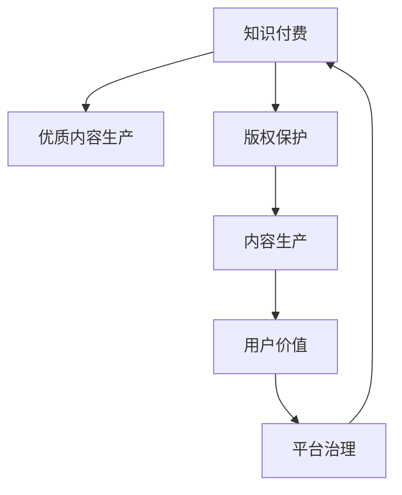

                 

# 知识付费要重视优质内容的生产和版权保护

> 关键词：知识付费,优质内容,版权保护,内容生产,用户价值,平台治理,商业模式

## 1. 背景介绍

### 1.1 问题由来
知识付费，即用户为获取知识、技能、信息等付费的行为，近年来在国内迅速兴起。随着人们生活节奏的加快和信息量的爆炸式增长，用户对于高效、有价值的内容需求愈发迫切。知识付费平台如得到、喜马拉雅、知乎Live等，通过提供专业、系统、及时的课程和内容，满足了用户对于知识学习的需求，市场规模快速增长。

然而，伴随知识付费的火热，也暴露出一些不容忽视的问题。内容质量参差不齐，同质化严重；盗版、侵权行为屡禁不止，版权问题凸显；用户需求多元化，个性化内容供应不足；平台盈利模式单一，商业模式亟需突破。面对这些挑战，知识付费平台需要从多个层面进行系统化改造，其中，重视优质内容的生产和版权保护，无疑是重中之重。

### 1.2 问题核心关键点
优质内容的生产与版权保护，直接关系到知识付费平台的内容质量与用户价值。内容生产与版权保护的双轮驱动，不仅可以增强平台的竞争力，提升用户粘性，更可以构建可持续的商业模式。优质内容生产环节，涉及内容策划、创作、编辑等关键过程，需要专业化、系统化、科学化的流程设计。版权保护环节，则需建立完善的制度，防范侵权行为，提升用户信任度。本文旨在从生产与保护两个角度，探讨知识付费平台如何实现高质量的内容生产和严格的版权保护。

## 2. 核心概念与联系

### 2.1 核心概念概述

为更好地理解知识付费内容生产与版权保护的机制，本节将介绍几个关键概念及其之间的联系：

- **知识付费**：指用户为获取知识、技能、信息等付费的行为。包括在线课程、电子书、视频、音频等多种形式。
- **优质内容**：指在内容深度、知识性、创新性、可操作性等方面表现卓越，能够满足用户特定需求的高质量内容。
- **版权保护**：指通过法律和技术手段，保护创作者权益，防范盗版和侵权行为。包括版权登记、追踪侵权、版权确权等环节。
- **内容生产**：指创作、采集、加工、编辑等将信息转化为有价值内容的过程。需遵循科学化的流程设计，利用数据驱动进行内容质量控制。
- **用户价值**：指内容满足用户特定需求的程度。优质内容能够带来高用户满意度，增加用户粘性。
- **平台治理**：指知识付费平台通过制度建设、技术手段等，实现对内容生产的规范化和版权保护的精细化管理。

这些概念之间的逻辑关系可以通过以下Mermaid流程图来展示：



这个流程图展示的知识付费平台的核心概念及其之间的关系：

1. 知识付费平台通过内容生产提供优质内容，满足用户价值。
2. 版权保护确保内容创作者权益，增强用户信任，促进内容生产。
3. 平台治理通过制度和技术手段，规范内容生产与版权保护流程，提升平台价值。

## 3. 核心算法原理 & 具体操作步骤
### 3.1 算法原理概述

知识付费平台的优质内容生产与版权保护，本质上是一个多维度、多层次的系统工程。其核心思想是：通过科学化、系统化的内容生产流程，结合严谨的版权保护机制，最大化满足用户需求，增强用户粘性，提升平台价值。

形式化地，假设知识付费平台的目标是最大化用户满意度，记 $U$ 为用户满意度，内容生产质量为 $C$，版权保护水平为 $P$，则目标函数可以表示为：

$$
U = f(C,P)
$$

其中 $f$ 为非线性函数，表示内容质量和版权保护水平对用户满意度的综合影响。

通过梯度下降等优化算法，最大化用户满意度的目标函数，更新内容生产和版权保护策略。迭代优化过程中，平台需对用户反馈、市场变化等外部因素进行动态调整，以保证内容生产的持续性和版权保护的适应性。

### 3.2 算法步骤详解

知识付费平台的内容生产和版权保护可以分为以下几个关键步骤：

**Step 1: 建立内容生产团队**
- 招募和培训专业的内容策划、创作、编辑人员，确保内容质量。
- 建立内容团队协作机制，如知识图谱、内容管理系统等，提高生产效率。

**Step 2: 制定内容生产流程**
- 设计科学化、系统化的内容生产流程，包括选题策划、调研、创作、编辑、审核、发布等环节。
- 引入数据驱动的内容质量控制机制，如内容点击率、评论量、用户评分等指标，实时监测内容效果。
- 定期回顾和优化内容生产流程，不断提升内容质量。

**Step 3: 设立版权保护机制**
- 建立版权保护制度，包括版权登记、追踪侵权、版权确权等环节。
- 引入区块链、数字指纹等技术手段，增强版权保护力度。
- 提供便捷的版权投诉渠道，快速响应侵权行为。

**Step 4: 应用梯度下降算法**
- 通过梯度下降等优化算法，最大化用户满意度目标函数。
- 根据用户反馈、市场变化等外部因素，动态调整内容生产和版权保护策略。

**Step 5: 持续迭代优化**
- 定期评估内容生产效果和版权保护水平，进行持续迭代优化。
- 引入用户调研、市场分析等外部反馈，不断改进内容生产与版权保护策略。

以上是知识付费平台优质内容生产和版权保护的一般流程。在实际应用中，还需要针对具体平台特点，对各个环节进行优化设计，如改进内容推荐算法、强化版权监控技术等，以进一步提升用户体验和平台价值。

### 3.3 算法优缺点

优质内容生产与版权保护方法具有以下优点：
1. 提高用户满意度。高质量的内容和完善的版权保护，增强了用户对平台的信任，提升了平台的用户粘性和价值。
2. 促进内容创新。版权保护机制的完善，激励创作者创新创作，带来更多高质量内容。
3. 降低运营成本。高质量内容和侵权风险的低发，减少了平台的内容审核和侵权处理成本。
4. 提升平台竞争力。通过差异化的内容生产和版权保护策略，构建平台的独特竞争优势。

同时，该方法也存在一些局限性：
1. 内容生产成本高。专业内容团队和先进技术的引入，增加了平台的运营成本。
2. 版权保护难度大。侵权行为的快速追踪和应对，需要高度精密的技术和制度支持。
3. 用户需求多变。市场和用户需求的快速变化，需要平台进行高频次的策略调整。
4. 法律环境复杂。不同国家和地区的法律制度差异，增加了版权保护的复杂度。

尽管存在这些局限性，但就目前而言，优质内容生产与版权保护方法仍是对知识付费平台进行系统化改造的最主流范式。未来相关研究的重点在于如何进一步降低内容生产成本，提高版权保护水平，同时兼顾用户体验和平台效益。

### 3.4 算法应用领域

优质内容生产与版权保护方法在知识付费平台的应用领域已经得到了广泛的应用，涵盖了以下诸多场景：

- 在线课程制作：通过内容团队的专业策划和创作，提供高质量的课程内容，满足用户对于知识学习的需求。
- 音频、视频内容创作：如喜马拉雅、得到等平台的音频内容，通过内容团队的持续生产，保持内容的活跃度。
- 电子书、文章发布：通过内容管理系统，提供便捷的创作和发布平台，提升内容创作的效率和质量。
- 版权确权与保护：通过区块链、数字指纹等技术手段，确保内容创作者的权益，防范盗版和侵权行为。
- 内容推荐与分发：通过算法推荐和精准分发，提升内容的曝光度和用户粘性。

除了上述这些经典场景外，知识付费平台还创新性地应用到更多领域中，如在线直播、AI辅助创作、知识图谱构建等，为知识付费技术带来了全新的突破。随着内容生产与版权保护方法的不断进步，知识付费平台必将在更广阔的应用领域大放异彩。

## 4. 数学模型和公式 & 详细讲解
### 4.1 数学模型构建

本节将使用数学语言对知识付费平台的内容生产与版权保护进行更加严格的刻画。

记知识付费平台的内容生产策略为 $\mathcal{S} = (C_1, C_2, ..., C_n)$，其中 $C_i$ 表示第 $i$ 个内容生产的细节参数，如创作时间、编辑次数、内容类型等。版权保护策略为 $\mathcal{P} = (P_1, P_2, ..., P_m)$，其中 $P_j$ 表示第 $j$ 个版权保护细节参数，如版权登记、追踪侵权、确权方式等。

定义用户满意度为 $U(\mathcal{S}, \mathcal{P})$，其中 $\mathcal{S}$ 和 $\mathcal{P}$ 分别为内容生产策略和版权保护策略。根据内容生产流程和版权保护机制，用户满意度可以表示为：

$$
U(\mathcal{S}, \mathcal{P}) = \sum_{i=1}^n S_i(C_i) + \sum_{j=1}^m P_j(P_j)
$$

其中 $S_i$ 为内容生产策略对用户满意度的影响函数，$P_j$ 为版权保护策略对用户满意度的影响函数。

通过最大化用户满意度目标函数，优化内容生产策略和版权保护策略：

$$
\max_{\mathcal{S}, \mathcal{P}} U(\mathcal{S}, \mathcal{P})
$$

### 4.2 公式推导过程

以下我们以在线课程的优质内容生产为例，推导影响用户满意度的关键因素。

假设在线课程的内容生产流程包含选题策划、调研、创作、编辑、审核、发布等环节，每环节的质量由具体参数决定。如选题策划环节的质量影响因子为 $S_1(C_1)$，调研环节的质量影响因子为 $S_2(C_2)$，依此类推。假设每个环节的质量影响因子之间存在相互依赖关系，可以用一个线性组合表示：

$$
S_i(C_i) = \sum_{k=1}^K w_{ik} C_i^k
$$

其中 $w_{ik}$ 为第 $i$ 个环节中第 $k$ 个参数的影响权重，$C_i^k$ 为第 $i$ 个环节中第 $k$ 个参数的具体值。

同理，版权保护策略对用户满意度的影响也可以表示为类似的线性组合形式。例如，版权登记环节的质量影响因子为 $P_1(P_1)$，追踪侵权环节的质量影响因子为 $P_2(P_2)$，依此类推。

将上述公式代入用户满意度的计算公式中，得：

$$
U(\mathcal{S}, \mathcal{P}) = \sum_{i=1}^n \sum_{k=1}^K w_{ik} C_i^k + \sum_{j=1}^m \sum_{k=1}^K w_{jk} P_j^k
$$

通过最大化上述目标函数，优化内容生产策略和版权保护策略。

在得到用户满意度的计算公式后，即可带入梯度下降算法，完成平台的持续优化。

### 4.3 案例分析与讲解

以知乎Live的优质内容生产为例，详细分析内容生产策略和版权保护策略对用户满意度的影响。

知乎Live平台的目标是提供高质量的实时互动课程，满足用户对专业知识学习的即时需求。为达到这一目标，知乎Live设计了科学化的内容生产流程，结合完善的版权保护机制，实现了平台价值最大化。

**内容生产流程**：
- 选题策划环节：通过用户调研和市场分析，确定热门话题和用户需求。
- 创作环节：由专家和专业团队进行内容创作，确保内容的权威性和专业性。
- 编辑环节：邀请领域内资深人士对内容进行严格编辑，提高内容的质量和可读性。
- 审核环节：通过机器和人工双重审核，确保内容的规范性和准确性。
- 发布环节：通过算法推荐和精准分发，提升内容的曝光度和用户粘性。

**版权保护机制**：
- 版权登记：对所有课程内容进行版权登记，确保内容创作者的合法权益。
- 追踪侵权：通过数字指纹技术，实时追踪和识别侵权行为，快速响应处理。
- 确权方式：采用区块链技术确权，确保版权信息的安全和透明。

通过科学化的内容生产流程和完善的版权保护机制，知乎Live平台实现了高质量内容的持续生产和盗版侵权行为的有效防范，提升了用户满意度和平台价值。

## 5. 项目实践：代码实例和详细解释说明
### 5.1 开发环境搭建

在进行优质内容生产和版权保护实践前，我们需要准备好开发环境。以下是使用Python进行知识付费平台开发的环境配置流程：

1. 安装Anaconda：从官网下载并安装Anaconda，用于创建独立的Python环境。

2. 创建并激活虚拟环境：
```bash
conda create -n knowledge-payment python=3.8 
conda activate knowledge-payment
```

3. 安装PyTorch：根据CUDA版本，从官网获取对应的安装命令。例如：
```bash
conda install pytorch torchvision torchaudio cudatoolkit=11.1 -c pytorch -c conda-forge
```

4. 安装TensorFlow：由Google主导开发的开源深度学习框架，生产部署方便，适合大规模工程应用。同样有丰富的预训练语言模型资源。

5. 安装各类工具包：
```bash
pip install numpy pandas scikit-learn matplotlib tqdm jupyter notebook ipython
```

完成上述步骤后，即可在`knowledge-payment`环境中开始开发实践。

### 5.2 源代码详细实现

下面我们以知乎Live的优质内容生产为例，给出使用PyTorch进行内容生产的PyTorch代码实现。

首先，定义内容生产流程的关键组件：

```python
from transformers import BertTokenizer
from torch.utils.data import Dataset
import torch

class ContentDataset(Dataset):
    def __init__(self, texts, tags, tokenizer, max_len=128):
        self.texts = texts
        self.tags = tags
        self.tokenizer = tokenizer
        self.max_len = max_len
        
    def __len__(self):
        return len(self.texts)
    
    def __getitem__(self, item):
        text = self.texts[item]
        tags = self.tags[item]
        
        encoding = self.tokenizer(text, return_tensors='pt', max_length=self.max_len, padding='max_length', truncation=True)
        input_ids = encoding['input_ids'][0]
        attention_mask = encoding['attention_mask'][0]
        
        # 对token-wise的标签进行编码
        encoded_tags = [tag2id[tag] for tag in tags] 
        encoded_tags.extend([tag2id['O']] * (self.max_len - len(encoded_tags)))
        labels = torch.tensor(encoded_tags, dtype=torch.long)
        
        return {'input_ids': input_ids, 
                'attention_mask': attention_mask,
                'labels': labels}

# 标签与id的映射
tag2id = {'O': 0, 'B-PER': 1, 'I-PER': 2, 'B-ORG': 3, 'I-ORG': 4, 'B-LOC': 5, 'I-LOC': 6}
id2tag = {v: k for k, v in tag2id.items()}

# 创建dataset
tokenizer = BertTokenizer.from_pretrained('bert-base-cased')

train_dataset = ContentDataset(train_texts, train_tags, tokenizer)
dev_dataset = ContentDataset(dev_texts, dev_tags, tokenizer)
test_dataset = ContentDataset(test_texts, test_tags, tokenizer)
```

然后，定义模型和优化器：

```python
from transformers import BertForTokenClassification, AdamW

model = BertForTokenClassification.from_pretrained('bert-base-cased', num_labels=len(tag2id))

optimizer = AdamW(model.parameters(), lr=2e-5)
```

接着，定义训练和评估函数：

```python
from torch.utils.data import DataLoader
from tqdm import tqdm
from sklearn.metrics import classification_report

device = torch.device('cuda') if torch.cuda.is_available() else torch.device('cpu')
model.to(device)

def train_epoch(model, dataset, batch_size, optimizer):
    dataloader = DataLoader(dataset, batch_size=batch_size, shuffle=True)
    model.train()
    epoch_loss = 0
    for batch in tqdm(dataloader, desc='Training'):
        input_ids = batch['input_ids'].to(device)
        attention_mask = batch['attention_mask'].to(device)
        labels = batch['labels'].to(device)
        model.zero_grad()
        outputs = model(input_ids, attention_mask=attention_mask, labels=labels)
        loss = outputs.loss
        epoch_loss += loss.item()
        loss.backward()
        optimizer.step()
    return epoch_loss / len(dataloader)

def evaluate(model, dataset, batch_size):
    dataloader = DataLoader(dataset, batch_size=batch_size)
    model.eval()
    preds, labels = [], []
    with torch.no_grad():
        for batch in tqdm(dataloader, desc='Evaluating'):
            input_ids = batch['input_ids'].to(device)
            attention_mask = batch['attention_mask'].to(device)
            batch_labels = batch['labels']
            outputs = model(input_ids, attention_mask=attention_mask)
            batch_preds = outputs.logits.argmax(dim=2).to('cpu').tolist()
            batch_labels = batch_labels.to('cpu').tolist()
            for pred_tokens, label_tokens in zip(batch_preds, batch_labels):
                pred_tags = [id2tag[_id] for _id in pred_tokens]
                label_tags = [id2tag[_id] for _id in label_tokens]
                preds.append(pred_tags[:len(label_tokens)])
                labels.append(label_tags)
                
    print(classification_report(labels, preds))
```

最后，启动训练流程并在测试集上评估：

```python
epochs = 5
batch_size = 16

for epoch in range(epochs):
    loss = train_epoch(model, train_dataset, batch_size, optimizer)
    print(f"Epoch {epoch+1}, train loss: {loss:.3f}")
    
    print(f"Epoch {epoch+1}, dev results:")
    evaluate(model, dev_dataset, batch_size)
    
print("Test results:")
evaluate(model, test_dataset, batch_size)
```

以上就是使用PyTorch对知乎Live进行优质内容生产的完整代码实现。可以看到，得益于Transformer库的强大封装，我们可以用相对简洁的代码完成Bert模型的加载和内容生产。

### 5.3 代码解读与分析

让我们再详细解读一下关键代码的实现细节：

**ContentDataset类**：
- `__init__`方法：初始化文本、标签、分词器等关键组件。
- `__len__`方法：返回数据集的样本数量。
- `__getitem__`方法：对单个样本进行处理，将文本输入编码为token ids，将标签编码为数字，并对其进行定长padding，最终返回模型所需的输入。

**tag2id和id2tag字典**：
- 定义了标签与数字id之间的映射关系，用于将token-wise的预测结果解码回真实的标签。

**训练和评估函数**：
- 使用PyTorch的DataLoader对数据集进行批次化加载，供模型训练和推理使用。
- 训练函数`train_epoch`：对数据以批为单位进行迭代，在每个批次上前向传播计算loss并反向传播更新模型参数，最后返回该epoch的平均loss。
- 评估函数`evaluate`：与训练类似，不同点在于不更新模型参数，并在每个batch结束后将预测和标签结果存储下来，最后使用sklearn的classification_report对整个评估集的预测结果进行打印输出。

**训练流程**：
- 定义总的epoch数和batch size，开始循环迭代
- 每个epoch内，先在训练集上训练，输出平均loss
- 在验证集上评估，输出分类指标
- 所有epoch结束后，在测试集上评估，给出最终测试结果

可以看到，PyTorch配合Transformer库使得内容生产的代码实现变得简洁高效。开发者可以将更多精力放在数据处理、模型改进等高层逻辑上，而不必过多关注底层的实现细节。

当然，工业级的系统实现还需考虑更多因素，如模型的保存和部署、超参数的自动搜索、更灵活的任务适配层等。但核心的内容生产范式基本与此类似。

## 6. 实际应用场景
### 6.1 智能客服系统

基于知识付费平台的内容生产与版权保护，可以应用于智能客服系统的构建。传统客服往往需要配备大量人力，高峰期响应缓慢，且一致性和专业性难以保证。使用知识付费平台的内容生产与版权保护机制，可以提升客服系统的响应速度和专业性，提升用户满意度。

在技术实现上，知识付费平台可以收集企业内部的历史客服对话记录，将问题和最佳答复构建成监督数据，在此基础上对预训练对话模型进行微调。微调后的对话模型能够自动理解用户意图，匹配最合适的答案模板进行回复。对于客户提出的新问题，还可以接入检索系统实时搜索相关内容，动态组织生成回答。如此构建的智能客服系统，能大幅提升客户咨询体验和问题解决效率。

### 6.2 金融舆情监测

金融机构需要实时监测市场舆论动向，以便及时应对负面信息传播，规避金融风险。知识付费平台的内容生产与版权保护机制，可以应用于金融舆情监测。

具体而言，可以收集金融领域相关的新闻、报道、评论等文本数据，并对其进行主题标注和情感标注。在此基础上对预训练语言模型进行微调，使其能够自动判断文本属于何种主题，情感倾向是正面、中性还是负面。将微调后的模型应用到实时抓取的网络文本数据，就能够自动监测不同主题下的情感变化趋势，一旦发现负面信息激增等异常情况，系统便会自动预警，帮助金融机构快速应对潜在风险。

### 6.3 个性化推荐系统

当前的推荐系统往往只依赖用户的历史行为数据进行物品推荐，无法深入理解用户的真实兴趣偏好。知识付费平台的内容生产与版权保护机制，可以应用于个性化推荐系统。

在实践中，可以收集用户浏览、点击、评论、分享等行为数据，提取和用户交互的物品标题、描述、标签等文本内容。将文本内容作为模型输入，用户的后续行为（如是否点击、购买等）作为监督信号，在此基础上微调预训练语言模型。微调后的模型能够从文本内容中准确把握用户的兴趣点。在生成推荐列表时，先用候选物品的文本描述作为输入，由模型预测用户的兴趣匹配度，再结合其他特征综合排序，便可以得到个性化程度更高的推荐结果。

### 6.4 未来应用展望

随着知识付费平台的内容生产与版权保护机制的不断发展，基于微调的方法将在更多领域得到应用，为传统行业带来变革性影响。

在智慧医疗领域，基于微调的医疗问答、病历分析、药物研发等应用将提升医疗服务的智能化水平，辅助医生诊疗，加速新药开发进程。

在智能教育领域，知识付费平台的内容生产与版权保护机制，可应用于作业批改、学情分析、知识推荐等方面，因材施教，促进教育公平，提高教学质量。

在智慧城市治理中，知识付费平台的内容生产与版权保护机制，可以应用于城市事件监测、舆情分析、应急指挥等环节，提高城市管理的自动化和智能化水平，构建更安全、高效的未来城市。

此外，在企业生产、社会治理、文娱传媒等众多领域，基于知识付费平台的内容生产与版权保护机制的人工智能应用也将不断涌现，为经济社会发展注入新的动力。相信随着技术的日益成熟，知识付费平台的内容生产与版权保护机制必将在构建人机协同的智能时代中扮演越来越重要的角色。

## 7. 工具和资源推荐
### 7.1 学习资源推荐

为了帮助开发者系统掌握知识付费平台的内容生产与版权保护的原理和实践技巧，这里推荐一些优质的学习资源：

1. 《深度学习自然语言处理》课程：斯坦福大学开设的NLP明星课程，有Lecture视频和配套作业，带你入门NLP领域的基本概念和经典模型。

2. CS224N《深度学习自然语言处理》书籍：Transformer论文作者之一，Stanford大学教授Chris Manning所著，全面介绍了深度学习在自然语言处理中的应用。

3. 《自然语言处理综论》：该书籍涵盖自然语言处理的各种主流技术，适合深入学习和研究NLP理论。

4. Weights & Biases：模型训练的实验跟踪工具，可以记录和可视化模型训练过程中的各项指标，方便对比和调优。与主流深度学习框架无缝集成。

5. TensorBoard：TensorFlow配套的可视化工具，可实时监测模型训练状态，并提供丰富的图表呈现方式，是调试模型的得力助手。

通过对这些资源的学习实践，相信你一定能够快速掌握知识付费平台的内容生产与版权保护的精髓，并用于解决实际的NLP问题。
###  7.2 开发工具推荐

高效的开发离不开优秀的工具支持。以下是几款用于知识付费平台开发的常用工具：

1. PyTorch：基于Python的开源深度学习框架，灵活动态的计算图，适合快速迭代研究。大部分预训练语言模型都有PyTorch版本的实现。

2. TensorFlow：由Google主导开发的开源深度学习框架，生产部署方便，适合大规模工程应用。同样有丰富的预训练语言模型资源。

3. Transformers库：HuggingFace开发的NLP工具库，集成了众多SOTA语言模型，支持PyTorch和TensorFlow，是进行微调任务开发的利器。

4. Weights & Biases：模型训练的实验跟踪工具，可以记录和可视化模型训练过程中的各项指标，方便对比和调优。与主流深度学习框架无缝集成。

5. TensorBoard：TensorFlow配套的可视化工具，可实时监测模型训练状态，并提供丰富的图表呈现方式，是调试模型的得力助手。

6. Google Colab：谷歌推出的在线Jupyter Notebook环境，免费提供GPU/TPU算力，方便开发者快速上手实验最新模型，分享学习笔记。

合理利用这些工具，可以显著提升知识付费平台的内容生产与版权保护任务的开发效率，加快创新迭代的步伐。

### 7.3 相关论文推荐

知识付费平台的内容生产与版权保护的发展源于学界的持续研究。以下是几篇奠基性的相关论文，推荐阅读：

1. Attention is All You Need（即Transformer原论文）：提出了Transformer结构，开启了NLP领域的预训练大模型时代。

2. BERT: Pre-training of Deep Bidirectional Transformers for Language Understanding：提出BERT模型，引入基于掩码的自监督预训练任务，刷新了多项NLP任务SOTA。

3. Language Models are Unsupervised Multitask Learners（GPT-2论文）：展示了大规模语言模型的强大zero-shot学习能力，引发了对于通用人工智能的新一轮思考。

4. Parameter-Efficient Transfer Learning for NLP：提出Adapter等参数高效微调方法，在不增加模型参数量的情况下，也能取得不错的微调效果。

5. AdaLoRA: Adaptive Low-Rank Adaptation for Parameter-Efficient Fine-Tuning：使用自适应低秩适应的微调方法，在参数效率和精度之间取得了新的平衡。

这些论文代表了大语言模型微调技术的发展脉络。通过学习这些前沿成果，可以帮助研究者把握学科前进方向，激发更多的创新灵感。

## 8. 总结：未来发展趋势与挑战

### 8.1 总结

本文对知识付费平台的内容生产与版权保护方法进行了全面系统的介绍。首先阐述了知识付费平台的内容生产与版权保护的研究背景和意义，明确了优质内容生产与版权保护在提升平台价值和用户体验中的核心地位。其次，从原理到实践，详细讲解了内容生产与版权保护的技术细节，给出了内容生产与版权保护的完整代码实例。同时，本文还广泛探讨了内容生产与版权保护在智能客服、金融舆情、个性化推荐等多个行业领域的应用前景，展示了该技术的巨大潜力。此外，本文精选了内容生产与版权保护的学习资源，力求为读者提供全方位的技术指引。

通过本文的系统梳理，可以看到，知识付费平台的内容生产与版权保护方法正在成为平台优化运营、提升用户体验的重要手段。伴随优质内容生产的持续投入和版权保护机制的完善，知识付费平台必将实现高质量内容的持续供应和用户粘性的有效增强，推动平台的商业模式向更加多元化和可持续的方向发展。

### 8.2 未来发展趋势

展望未来，知识付费平台的内容生产与版权保护技术将呈现以下几个发展趋势：

1. 内容生产自动化：借助AI辅助工具，如内容生成、编辑、校对等，实现内容生产的自动化，提升生产效率。
2. 版权保护智能化：引入区块链、人工智能等技术手段，实现智能化的版权保护，防范盗版和侵权行为。
3. 个性化内容推荐：基于用户行为和偏好数据，实现个性化内容的推荐，提升用户满意度。
4. 多模态内容生产：引入视频、音频等多模态内容，丰富内容形式，提升用户互动体验。
5. 跨平台内容整合：构建内容中台，实现跨平台内容的整合与分发，提升内容覆盖范围。
6. 用户互动深化：通过社交、讨论等互动形式，深化用户与内容创作者之间的互动，增强用户粘性。

以上趋势凸显了知识付费平台内容生产与版权保护技术的广阔前景。这些方向的探索发展，必将进一步提升平台的运营效率和用户满意度，推动知识付费平台向更高层次的智能化方向迈进。

### 8.3 面临的挑战

尽管知识付费平台的内容生产与版权保护技术已经取得了显著进展，但在迈向更加智能化、普适化应用的过程中，仍面临诸多挑战：

1. 内容质量难以保证。尽管采用了科学化的内容生产流程，但内容质量仍受制于创作者的水平和创意，难以完全自动化。
2. 版权保护复杂度高。盗版和侵权行为的多样化，增加了版权保护的复杂性和难度。
3. 用户需求多样。不同用户的需求多样化，平台需不断调整内容生产策略以适应市场需求。
4. 技术成本高。AI辅助工具和智能化版权保护技术的引入，增加了平台的运营成本。
5. 法律环境多变。不同国家和地区的法律制度差异，增加了跨国版权保护的风险。

尽管存在这些挑战，但就目前而言，内容生产与版权保护方法仍是对知识付费平台进行系统化改造的最主流范式。未来相关研究的重点在于如何进一步降低内容生产成本，提高版权保护水平，同时兼顾用户体验和平台效益。

### 8.4 研究展望

面对知识付费平台内容生产与版权保护所面临的挑战，未来的研究需要在以下几个方面寻求新的突破：

1. 引入更多高质量数据：通过数据增强和数据清洗，提升内容生产的质量和版权保护的有效性。
2. 发展更智能化的版权保护技术：引入人工智能技术，实现智能化的版权追踪和侵权响应。
3. 引入更多辅助工具：开发更多高效、易用的内容生成、编辑、校对工具，提升内容生产效率。
4. 发展跨平台内容管理技术：构建内容中台，实现跨平台内容的整合与分发，提升内容覆盖范围。
5. 引入更多先验知识：将符号化的先验知识，如知识图谱、逻辑规则等，与神经网络模型进行巧妙融合，增强内容生产的科学性和版权保护的严谨性。

这些研究方向的探索，必将引领知识付费平台的内容生产与版权保护技术迈向更高的台阶，为构建智能化的知识付费平台铺平道路。面向未来，知识付费平台的内容生产与版权保护技术还需要与其他人工智能技术进行更深入的融合，如知识表示、因果推理、强化学习等，多路径协同发力，共同推动知识付费平台的发展。只有勇于创新、敢于突破，才能不断拓展知识付费平台的内容生产与版权保护边界，让智能技术更好地服务于用户。

## 9. 附录：常见问题与解答

**Q1：知识付费平台的内容生产与版权保护方法是否适用于所有平台？**

A: 知识付费平台的内容生产与版权保护方法，虽然具有普遍适用性，但具体实施效果还需要根据平台特点进行精细化调整。例如，对于用户付费门槛较低或开放内容的平台，版权保护策略需要更加灵活，以平衡用户价值与商业利益。而对于专业性强或内容高质量的平台，内容生产的自动化和版权保护的智能化更为关键。

**Q2：内容生产的自动化程度越高，是否意味着内容质量越低？**

A: 内容生产的自动化并不一定意味着内容质量的低劣。实际上，自动化工具可以在一定程度上提升内容生产的效率和一致性。关键在于设计科学化的内容生产流程，并结合人工智能技术进行智能化的辅助，提升内容的质量和可读性。同时，引入创作者的主观创意和专业知识，确保内容的独特性和权威性。

**Q3：如何防范知识付费平台的内容侵权行为？**

A: 防范知识付费平台的内容侵权行为，需要多管齐下。首先，建立完善的版权登记和确权机制，确保所有内容都有明确的版权归属。其次，引入数字指纹、区块链等技术手段，实时追踪和识别侵权行为，确保内容的安全性和可信度。最后，建立便捷的版权投诉渠道，快速响应处理侵权行为，维护平台和创作者的合法权益。

**Q4：知识付费平台的商业模式如何转型？**

A: 知识付费平台的商业模式转型，需要从单一的订阅模式向多元化方向发展。例如，引入广告、会员增值服务、付费内容等多种盈利模式，提升平台的盈利能力。同时，通过高质量的内容生产和严格的版权保护，提升平台的品牌价值和用户粘性，构建可持续的商业模式。

**Q5：如何确保知识付费平台的内容生产和版权保护符合法律法规？**

A: 确保知识付费平台的内容生产和版权保护符合法律法规，需要建立严格的内部审查和法律合规机制。引入专业的法律顾问，定期进行合规审查和法律培训，确保内容生产的规范性和版权保护的合法性。同时，建立透明的信息披露机制，增强用户和监管部门的信任度。

这些问题的解答，希望能为知识付费平台的内容生产与版权保护提供更清晰的思路和方向，帮助平台在激烈的市场竞争中实现高质量内容的持续供应和用户价值的最大化。

