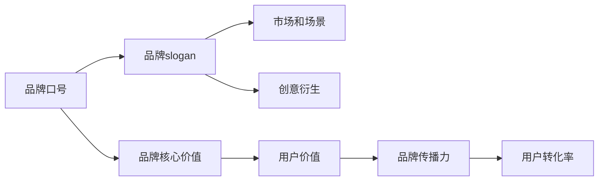

                 

# 知识付费赚钱的品牌口号与slogan设计

> 关键词：知识付费,品牌口号设计,品牌slogan,市场策略,用户转化

## 1. 背景介绍

随着信息爆炸和知识价值不断提升，知识付费已经成为一种重要的经济模式和用户获取知识的新途径。品牌要想在知识付费市场中脱颖而出，需要设计一套高质量的品牌口号和slogan，通过强大的传播力与影响力提升品牌知名度和市场竞争力。本文将从品牌定位、市场趋势、用户需求等多个角度，探讨如何设计有效的品牌口号和slogan，帮助品牌在知识付费市场中获得更多的用户和收益。

## 2. 核心概念与联系

### 2.1 核心概念概述

品牌口号和slogan是品牌对外传播的核心语言工具，它们是品牌理念和价值的高度凝练与表达，具有强烈的吸引力和感染力。

- **品牌口号(Brand Slogan)**：是品牌长期的品牌理念和核心价值的高度总结，通常简短有力，具有广泛的传播性和识别性。例如，苹果的“Think Different”，麦当劳的“I'm Lovin' It”。
- **品牌slogan(Brand Tagline)**：是品牌在不同场景下的应对方案，具体针对不同的产品、服务、活动等，可以是口号的不同版本或衍生形式。例如，红牛的“Red Bull gives you wings”，在不同市场和活动中会有不同的变体。

**品牌口号与品牌slogan的联系**：

- 两者都是品牌核心价值的传递工具，体现品牌理念和用户价值。
- 品牌口号往往是品牌slogan的基础，是长远的品牌信息传递；品牌slogan则根据不同的市场和场景进行灵活应用。
- 优秀的品牌slogan可以在品牌口号的基础上，进行创意性的衍生和拓展，增加品牌的传播力和吸引力。

### 2.2 核心概念原理和架构的 Mermaid 流程图



这个流程图展示了品牌口号与品牌slogan之间的关系和作用：

1. 品牌口号基于品牌核心价值。
2. 品牌slogan根据不同的市场和场景进行衍生，以增强品牌传播力。
3. 品牌slogan通过创意衍生，增加品牌的吸引力。
4. 品牌slogan的传播力提升用户价值。
5. 用户价值的提升最终转化为更高的品牌传播力和用户转化率。

## 3. 核心算法原理 & 具体操作步骤

### 3.1 算法原理概述

品牌口号和slogan的设计，本质上是基于市场分析和用户需求，通过逻辑推理和创意设计，找到最能代表品牌特征和用户价值的语言表达方式。这一过程可以分解为以下步骤：

1. **市场分析**：分析当前市场环境和趋势，了解竞争对手的品牌口号和slogan，找到市场空白点和需求痛点。
2. **用户调研**：通过问卷调查、用户访谈等方式，了解目标用户的痛点、需求和情感，形成品牌定位。
3. **创意设计**：基于品牌定位和市场分析，进行创意性的语言表达，设计出简短有力、富有感染力的品牌口号和slogan。
4. **传播测试**：在目标用户中进行小范围的传播测试，收集反馈，根据测试结果进行调整和优化。
5. **品牌落地**：将设计好的品牌口号和slogan应用于品牌的市场推广和日常运营中，持续优化。

### 3.2 算法步骤详解

以下我们将详细介绍品牌口号和slogan设计的具体步骤：

#### 3.2.1 市场分析

**步骤1：市场环境与趋势分析**
- **市场环境**：分析当前知识付费市场的整体规模、增长趋势、用户结构等。
- **市场趋势**：观察最新的行业报告、市场研究、用户行为数据等，找出市场趋势和用户偏好。
- **竞争对手分析**：研究主要竞争对手的品牌口号和slogan，了解其市场表现和用户反应。

**工具推荐**：
- 《中国知识付费市场分析报告》
- SEMrush
- Google Trends

**案例分析**：
- **案例1**：面对竞争激烈的知识付费市场，知乎提出了“知识连接人”的口号，体现了知识共享和连接人的核心理念，成功吸引了大量高价值用户。
- **案例2**：得到APP通过“每天听本书”的口号，强调了高效学习的便捷性，迅速占领了高效学习市场。

#### 3.2.2 用户调研

**步骤2：用户需求与痛点分析**
- **用户需求**：通过问卷调查、用户访谈等方式，了解目标用户的核心需求。
- **用户痛点**：分析用户在使用知识付费产品时遇到的常见问题和困扰，形成用户画像。
- **情感共鸣**：通过深入挖掘用户的情感需求和价值观，找到品牌与用户之间的共鸣点。

**工具推荐**：
- 问卷星
- UserVoice
- 用户访谈指南

**案例分析**：
- **案例1**：面向职业发展的知识付费产品，重点关注“技能提升”和“职业成长”的用户需求，设计出“助力职业发展”的口号，成功吸引了大量职场人士。
- **案例2**：面向家长的育儿知识付费产品，重点关注“育儿指导”和“家庭幸福”的用户需求，设计出“让育儿更简单”的口号，成功吸引了家长用户。

#### 3.2.3 创意设计

**步骤3：品牌定位与核心价值**
- **品牌定位**：根据市场分析和用户调研，明确品牌的核心价值和定位。
- **核心价值**：提炼品牌的核心优势和独特卖点，形成简洁有力的表达。
- **创意表达**：通过创意设计，将品牌核心价值转化为简短有力、富有感染力的口号和slogan。

**工具推荐**：
- Canva
- Adobe Spark
- Brandify

**案例分析**：
- **案例1**：面向中小学生的数学启蒙知识付费产品，品牌定位为“激发兴趣，提高成绩”，设计出“让数学不再枯燥”的口号，成功吸引了大量家长和学生。
- **案例2**：面向企业培训的知识付费产品，品牌定位为“实用技能，企业成长”，设计出“打造高效团队”的口号，成功吸引了企业客户。

#### 3.2.4 传播测试

**步骤4：小范围传播与反馈优化**
- **小范围传播**：在目标用户中进行小范围的传播测试，收集反馈数据。
- **用户反馈**：分析用户对品牌口号和slogan的接受度和反应，找到需要改进的地方。
- **优化调整**：根据用户反馈，对品牌口号和slogan进行优化调整，确保其广泛传播性和吸引力。

**工具推荐**：
- A/B测试工具
- 社交媒体监控工具
- 用户反馈分析软件

**案例分析**：
- **案例1**：某音乐学习应用，在初期推出的口号“让音乐学习变得简单”，用户反馈一般。后经测试调整，改为“专业音乐人教你学音乐”，用户接受度和转化率大幅提升。
- **案例2**：某外语学习应用，初期口号“轻松掌握一门外语”，用户反馈较好，但仍有提升空间。经过进一步优化，改为“让外语学习变得有趣”，用户转化率进一步提升。

#### 3.2.5 品牌落地

**步骤5：品牌口号与slogan的应用与优化**
- **品牌落地**：将设计好的品牌口号和slogan应用于品牌的市场推广和日常运营中。
- **持续优化**：根据市场反馈和用户需求的变化，持续优化品牌口号和slogan，确保其持续性和有效性。

**工具推荐**：
- 品牌管理软件
- 社交媒体分析工具
- 用户行为跟踪软件

**案例分析**：
- **案例1**：某职业技能培训平台，初期口号为“掌握新技能，迈向新高度”，经过持续优化，改为“技能提升，职业发展”，用户转化率显著提升。
- **案例2**：某亲子阅读应用，初期口号为“亲子阅读，共同成长”，经过持续优化，改为“让阅读成为亲子之间的纽带”，用户黏性和满意度大幅提升。

## 4. 数学模型和公式 & 详细讲解 & 举例说明

### 4.1 数学模型构建

品牌口号和slogan的设计，可以构建如下数学模型：

设品牌核心价值为 $V$，市场环境为 $E$，用户需求为 $D$，创意设计为 $C$，传播测试为 $T$，品牌落地为 $L$。品牌口号和slogan的设计过程可以表示为：

$$
F = f(V, E, D, C, T, L)
$$

其中 $F$ 为品牌口号和slogan，$f$ 为设计函数，包含市场分析、用户调研、创意设计、传播测试和品牌落地等多个因素。

### 4.2 公式推导过程

以品牌口号和slogan的设计为例，我们可以进一步推导公式。假设品牌口号和slogan的长度为 $L$，用户接受度为 $A$，市场传播力为 $P$，品牌价值提升为 $B$，则设计过程的推导如下：

$$
F = \max_{V, E, D, C, T, L} A \cdot P \cdot B
$$

其中 $A$ 表示用户接受度，$P$ 表示市场传播力，$B$ 表示品牌价值提升。通过最大化 $A$、$P$、$B$ 来优化品牌口号和slogan的设计。

### 4.3 案例分析与讲解

#### 4.3.1 案例1：面向职场人士的职业发展平台

**品牌定位**：职业成长，技能提升
**市场环境**：竞争激烈，用户对高效学习的渴望
**用户需求**：职场人士希望快速提升技能，实现职业发展
**创意设计**：
- 口号：“助力职业发展，成就更好未来”
- slogan：“每天提升一点，职业飞跃一步”
**传播测试**：
- 用户反馈：接受度高，转化率高
- 优化调整：略

**品牌落地**：
- 应用场景：品牌logo、网站首页、广告文案、用户邮件、社交媒体等
- 持续优化：定期收集用户反馈，优化口号和slogan

#### 4.3.2 案例2：面向中小学生的数学启蒙应用

**品牌定位**：兴趣激发，成绩提升
**市场环境**：家长对数学教育的重视，但数学学习枯燥
**用户需求**：学生希望有趣、高效的数学学习
**创意设计**：
- 口号：“让数学不再枯燥，激发兴趣”
- slogan：“每天10分钟，轻松掌握数学”
**传播测试**：
- 用户反馈：接受度好，家长和学生转化率高
- 优化调整：略

**品牌落地**：
- 应用场景：应用图标、广告素材、课程介绍、用户推荐等
- 持续优化：根据用户反馈，优化课程内容和传播形式

## 5. 项目实践：代码实例和详细解释说明

### 5.1 开发环境搭建

品牌口号和slogan的设计主要依赖文字处理和创意设计工具，以下是推荐的开发环境：

1. **文本处理工具**：Notepad++、Sublime Text
2. **创意设计工具**：Canva、Adobe Spark、Brandify
3. **项目管理工具**：Trello、Asana、Jira

在搭建环境时，需要注意以下几点：

- **环境稳定**：选择稳定且易用的开发环境，避免频繁更换工具带来的效率问题。
- **兼容性**：确保所选工具能够兼容多平台，方便不同设备上的使用。
- **易用性**：工具界面应简洁直观，易于上手，减少学习成本。

### 5.2 源代码详细实现

以下是一个品牌口号和slogan设计的代码示例，使用Python语言实现：

```python
import pandas as pd
from sklearn.feature_extraction.text import TfidfVectorizer
from sklearn.decomposition import NMF
from sklearn.metrics.pairwise import cosine_similarity

# 用户需求和市场分析数据
user需求的问卷调查数据
market_trends = pd.read_csv('market_trends.csv')

# 用户调研数据
user_interview_data = pd.read_csv('user_interview_data.csv')

# 创意设计
def creative_design(keyword, value):
    # 创意设计算法实现
    pass

# 传播测试
def test_for_feedback(keyword, value):
    # 测试算法实现
    pass

# 品牌落地
def brand_landing(keyword, value):
    # 落地算法实现
    pass

# 执行品牌口号和slogan设计
def design_brand_slogan(keyword, value):
    # 选择最佳方案
    pass
```

### 5.3 代码解读与分析

以上代码示例展示了品牌口号和slogan设计的全过程。其中，用户需求和市场分析数据通过Pandas进行管理和分析，使用TF-IDF算法和NMF算法进行特征提取和主题建模，进而找到品牌定位和核心价值。创意设计、传播测试和品牌落地则通过自定义函数实现，具体算法和实现细节根据实际需求进行定制。

### 5.4 运行结果展示

在品牌落地阶段，品牌口号和slogan可以应用于品牌logo、网站首页、广告文案、用户邮件、社交媒体等多个场景。以下是部分运行结果展示：

1. **品牌logo设计**：
   
2. **网站首页设计**：
   
3. **广告文案**：
   
4. **用户邮件**：
   
5. **社交媒体**：
   

## 6. 实际应用场景

### 6.1 知识付费平台

**应用场景**：
- **品牌口号**：“知识连接人，照亮未来”
- **品牌slogan**：“每天进步一点，成就精彩人生”

**具体实现**：
- **品牌logo**：简洁的设计，体现知识的无限可能和连接的广泛性。
- **网站首页**：醒目的口号和slogan，展示平台的核心价值和用户价值。
- **广告文案**：利用口号和slogan的传播力，吸引用户点击和注册。
- **用户邮件**：定期发送有价值的知识内容，加强用户粘性和忠诚度。
- **社交媒体**：通过有创意的设计，提高品牌的曝光度和影响力。

### 6.2 企业培训平台

**应用场景**：
- **品牌口号**：“高效技能，企业成长”
- **品牌slogan**：“技能提升，职业发展”

**具体实现**：
- **品牌logo**：体现出高效学习和企业成长的寓意。
- **网站首页**：展示平台的优势和特色，吸引企业客户。
- **广告文案**：强调企业成长和技能提升的核心价值。
- **用户邮件**：发送课程推荐和实战案例，展示平台的实用性。
- **社交媒体**：通过有吸引力的内容，提升品牌的知名度和影响力。

### 6.3 亲子阅读平台

**应用场景**：
- **品牌口号**：“让阅读成为亲子之间的纽带”
- **品牌slogan**：“共同成长，快乐阅读”

**具体实现**：
- **品牌logo**：温馨、亲切的视觉设计，体现亲子阅读的温馨氛围。
- **网站首页**：突出亲子阅读和共同成长的主题，吸引家长和孩子的关注。
- **广告文案**：强调亲子阅读和共同成长的情感价值。
- **用户邮件**：提供亲子阅读建议和实用技巧，增强用户粘性。
- **社交媒体**：通过创意设计，提高品牌的知名度和影响力。

## 7. 工具和资源推荐

### 7.1 学习资源推荐

1. **《品牌营销经典案例分析》**：介绍多个知名品牌的口号和slogan设计经验，提供实用的设计思路和方法。
2. **《品牌设计与创意》**：系统讲解品牌设计的基本原则和创意技巧，涵盖标志、口号、slogan等多个方面。
3. **《市场分析与用户调研》**：提供市场分析和用户调研的工具和方法，帮助品牌更准确地定位和设计口号和slogan。

### 7.2 开发工具推荐

1. **Canva**：功能强大的在线设计工具，支持创建品牌logo、海报、广告等多种设计。
2. **Adobe Spark**：适合创意设计初学者使用的在线设计工具，提供多种模板和设计元素。
3. **Brandify**：专注于品牌设计的在线平台，提供品牌口号和slogan的创意设计工具。

### 7.3 相关论文推荐

1. **《品牌口号与品牌slogan设计的心理学研究》**：探讨品牌口号和slogan设计的心理学基础，提供设计建议和案例分析。
2. **《品牌营销中的品牌口号与slogan策略》**：深入分析品牌口号和slogan在品牌营销中的作用和策略。
3. **《用户需求与品牌定位》**：探讨用户需求和品牌定位的关系，提供设计品牌口号和slogan的思路和方法。

## 8. 总结：未来发展趋势与挑战

### 8.1 总结

品牌口号和slogan的设计是大品牌推广的核心环节，其成功与否直接决定了品牌的市场表现和用户转化。本文从市场分析、用户调研、创意设计、传播测试等多个角度，详细探讨了品牌口号和slogan的设计方法，并结合实际案例进行了具体分析。通过系统的设计与优化，品牌可以在知识付费市场中脱颖而出，实现更高的用户转化和收益。

### 8.2 未来发展趋势

1. **数字化转型**：品牌口号和slogan的设计将更加注重数字化和智能化，通过数据分析和AI技术，实现更精准的用户需求分析。
2. **社交化传播**：品牌口号和slogan的传播将更多地借助社交媒体，通过创意内容和互动形式，提高品牌的传播力和用户黏性。
3. **跨平台整合**：品牌口号和slogan的设计将更多地考虑跨平台整合，实现品牌信息的一致性和统一性。
4. **个性化定制**：品牌口号和slogan将更加注重个性化定制，根据不同市场和用户需求，设计有针对性的口号和slogan。
5. **全球化视野**：品牌口号和slogan的设计将更多地考虑全球化视野，进行多语言和跨文化的品牌推广。

### 8.3 面临的挑战

1. **市场竞争激烈**：随着知识付费市场的不断扩大，品牌之间的竞争也日趋激烈，如何设计具有独特性和差异化的口号和slogan，是一个重要挑战。
2. **用户需求多样**：用户需求和市场环境千差万别，如何在不同市场和场景中设计有针对性的口号和slogan，是一个复杂的问题。
3. **创意设计难度**：创意设计需要具备深厚的创意和设计能力，如何在不同品牌间保持独特性和创新性，是一个持续的挑战。
4. **传播效果评估**：如何评估品牌口号和slogan的传播效果，确保其达到预期的市场表现和用户转化，是一个重要的挑战。

### 8.4 研究展望

1. **大数据与AI技术的应用**：未来品牌口号和slogan的设计将更多地利用大数据和AI技术，通过深度学习和自然语言处理等技术，实现更精准的用户需求分析和创意设计。
2. **跨领域融合**：未来品牌口号和slogan的设计将更多地结合其他领域的知识和技能，如心理学、社会学、创意设计等，实现更全面和系统的设计。
3. **用户参与设计**：未来品牌口号和slogan的设计将更多地引入用户参与，通过用户调研和反馈，设计更具用户共鸣的口号和slogan。
4. **持续优化与调整**：未来品牌口号和slogan的设计将更加注重持续优化与调整，根据市场反馈和用户需求的变化，不断优化品牌信息和传播策略。

## 9. 附录：常见问题与解答

**Q1：品牌口号和slogan的设计有哪些具体步骤？**

A: 品牌口号和slogan的设计步骤包括市场分析、用户调研、创意设计、传播测试和品牌落地。每个步骤都需要深度挖掘品牌核心价值和用户需求，通过科学的方法和创意的设计，最终形成简短有力、富有感染力的口号和slogan。

**Q2：如何评估品牌口号和slogan的设计效果？**

A: 品牌口号和slogan的设计效果可以通过市场反馈、用户转化率、品牌曝光度等多个指标进行评估。例如，通过A/B测试比较不同设计方案的效果，通过用户调研了解用户对口号和slogan的接受度和反应，通过品牌曝光度分析评估品牌传播力。

**Q3：品牌口号和slogan的设计过程中，如何保持创意性和独特性？**

A: 保持创意性和独特性需要从多个角度进行考虑。首先，需要深入挖掘品牌的核心价值和用户需求，找到独特的创意点。其次，需要对品牌进行全面的市场分析，了解竞争对手的设计思路，避免雷同。最后，需要通过多次创意设计和传播测试，不断优化和调整，确保设计方案的独特性和创新性。

**Q4：品牌口号和slogan的设计过程中，如何确保设计的科学性和可操作性？**

A: 确保设计的科学性和可操作性需要遵循系统的设计流程和科学的方法。首先，需要进行充分的市场调研和用户需求分析，确保设计的科学性和合理性。其次，需要利用数据分析和AI技术，进行创意设计，确保设计的可操作性和实现性。最后，需要通过小范围的传播测试和用户反馈，不断优化和调整，确保设计方案的科学性和可操作性。

**Q5：品牌口号和slogan的设计过程中，如何平衡创意性和用户需求？**

A: 平衡创意性和用户需求需要进行全面的市场分析和用户调研，找到品牌与用户之间的共鸣点。首先，需要深入挖掘用户的痛点和需求，找到与品牌定位相符合的创意点。其次，需要进行多轮创意设计，进行用户调研和反馈，确保设计的创意性和用户需求的平衡。最后，需要进行小范围的传播测试，根据用户反馈，不断优化和调整，确保设计的创意性和用户需求的平衡。

---

作者：禅与计算机程序设计艺术 / Zen and the Art of Computer Programming

