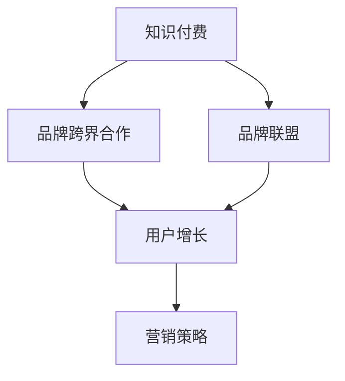

                 

# 知识付费赚钱的品牌跨界合作与品牌联盟策略

> 关键词：知识付费, 品牌跨界合作, 品牌联盟, 用户增长, 营销策略

## 1. 背景介绍

随着数字化转型进程的加速，知识付费已成为驱动个人和组织增值的重要模式。在线教育平台、技术博客、线上研讨会等多种形式的付费知识内容，正日益成为连接用户和专业知识的桥梁。在这一背景下，品牌之间的跨界合作与联盟策略，不仅能够提升彼此的用户基础和市场影响力，还能实现互利共赢，形成价值共创的生态系统。

### 1.1 问题由来
面对激烈的市场竞争和不断变化的用户需求，企业如何有效整合内外资源，扩大知识传播的广度和深度，是亟待解决的问题。传统的产品和营销策略已难以适应现代数字化环境，跨界合作与品牌联盟成为提升品牌价值和市场竞争力的重要手段。

### 1.2 问题核心关键点
- **用户增长**：品牌之间通过联合推广，可以迅速吸引彼此的用户基础，扩大知识传播范围。
- **市场影响力**：通过跨界合作提升品牌形象，增强市场竞争力。
- **价值共创**：品牌联盟可以实现资源互补，共同开发新产品或服务，创造更大的商业价值。
- **互利共赢**：通过合作共享，实现利益最大化，达到双赢或多赢的局面。

## 2. 核心概念与联系

### 2.1 核心概念概述

为了更好地理解品牌跨界合作与联盟策略，本节将介绍几个关键概念及其相互联系：

- **知识付费**：通过付费形式获取知识内容的模式，如在线课程、电子书、技术博客等。
- **品牌跨界合作**：不同品牌之间通过合作，共享资源、技术、市场渠道等，以达到共同发展的目的。
- **品牌联盟**：多个品牌之间建立的战略合作伙伴关系，共同开拓市场、创新产品、共享资源。
- **用户增长**：通过有效的营销策略和合作手段，吸引更多用户关注和使用品牌服务。
- **营销策略**：品牌为提升市场竞争力，通过多种手段吸引和保留用户，包括内容营销、社交媒体营销、合作推广等。

这些核心概念之间的逻辑关系可以通过以下Mermaid流程图来展示：



这个流程图展示了知识付费、品牌跨界合作、品牌联盟、用户增长、营销策略之间的联系：

1. 知识付费是品牌跨界合作和联盟的基础，通过内容吸引用户关注。
2. 品牌跨界合作和联盟可以增强品牌的影响力和用户基础，促进用户增长。
3. 营销策略则是实现用户增长和品牌联盟目标的具体手段。

## 3. 核心算法原理 & 具体操作步骤

### 3.1 算法原理概述

品牌跨界合作与联盟策略的本质是通过多方协同，提升品牌知名度和市场竞争力。其核心在于通过联合推广、共享资源、联合开发等方式，实现资源的最大化利用和市场的协同增长。

具体而言，该策略分为以下几个步骤：

1. **识别合作对象**：根据品牌特点和市场需求，选择适合的品牌进行跨界合作。
2. **制定合作方案**：明确合作目标、资源共享方式、收益分配等细节。
3. **实施合作计划**：通过联合推广、共同开发新产品等方式，实现品牌联盟的目标。
4. **评估合作效果**：定期评估合作带来的用户增长、市场影响力等指标，调整合作策略。

### 3.2 算法步骤详解

以下将详细讲解品牌跨界合作与联盟策略的实施步骤：

**Step 1: 识别合作对象**
- 根据品牌特点、用户画像、市场需求等因素，选择与自身品牌特点和需求相匹配的合作伙伴。
- 优先选择行业内头部品牌，以提升品牌形象和市场竞争力。
- 分析潜在合作对象的用户数据，判断是否具有共同的用户群体和市场需求。

**Step 2: 制定合作方案**
- 明确合作目标，如提升品牌知名度、扩大用户基础、联合推出新产品等。
- 确定资源共享方式，如共同营销、数据共享、技术交流等。
- 制定收益分配策略，如按照用户增长量、销售额等进行分配，确保各方利益平衡。
- 设计合作时间表和里程碑，确保合作顺利推进。

**Step 3: 实施合作计划**
- 启动联合营销活动，通过互相推广、联合赞助等方式，提升品牌曝光率。
- 共享资源，如用户数据、技术、渠道等，实现资源互补。
- 联合开发新产品或服务，如共同推出在线课程、联合撰写技术博客等。
- 定期召开合作会议，评估合作进展和效果，确保合作目标顺利实现。

**Step 4: 评估合作效果**
- 定期收集用户增长、市场影响力、销售额等关键指标，评估合作效果。
- 分析合作带来的市场份额变化、用户行为变化等，判断合作的实际效果。
- 根据评估结果，调整合作策略，确保合作目标的实现。

### 3.3 算法优缺点

品牌跨界合作与联盟策略具有以下优点：
1. **资源共享**：通过共享资源和用户基础，最大化利用各方优势。
2. **市场协同**：协同市场策略，扩大品牌影响力，提升用户增长。
3. **风险分担**：多方协同，降低单一品牌的市场风险。
4. **价值共创**：通过合作创造新的商业价值，实现双赢或多赢。

同时，该策略也存在一些缺点：
1. **协调难度**：不同品牌之间可能存在利益冲突，协调难度较大。
2. **管理复杂**：合作过程中需要各方密切配合，管理协调工作量较大。
3. **市场变化**：市场环境变化可能导致合作效果不如预期，需要灵活调整策略。

尽管存在这些局限性，但品牌跨界合作与联盟策略仍是大品牌提升竞争力的重要手段。通过有效的管理和协调，可以最大化其优势，实现品牌价值的提升和市场份额的增长。

### 3.4 算法应用领域

品牌跨界合作与联盟策略在多个领域得到了广泛应用，例如：

- **在线教育**：如Coursera和Udacity的课程联盟，提供更多优质的课程内容，吸引更多用户注册。
- **技术博客**：如Kaggle和DataCamp的技术博客合作，共同分享数据分析和机器学习知识。
- **产品开发**：如谷歌和亚马逊联合开发语音识别技术，提升用户使用体验。
- **营销活动**：如奢侈品品牌Louis Vuitton和Apple的联合广告活动，提升品牌曝光率和用户基础。

除了上述这些经典应用外，品牌跨界合作与联盟策略也被创新性地应用到更多场景中，如跨行业合作、用户社区共建、公益活动等，为品牌发展提供新的路径。

## 4. 数学模型和公式 & 详细讲解 & 举例说明

### 4.1 数学模型构建

品牌跨界合作与联盟策略的数学模型可以基于博弈论和网络模型构建。以网络模型为例，设品牌集合为 $N=\{1,2,...,n\}$，品牌之间的互动关系表示为图 $G=(N,E)$，其中 $N$ 为节点集合，$E$ 为边集合。

品牌 $i$ 的市场影响力表示为 $S_i$，用户增长量为 $U_i$，合作带来的收益为 $R_{ij}$。则品牌联盟的优化目标为最大化总收益，即：

$$
\max_{i,j} \sum_{i=1}^n \sum_{j=1}^n R_{ij}
$$

在约束条件下，需满足资源共享、合作时间、收益分配等规则。

### 4.2 公式推导过程

以在线教育平台之间的合作为例，设合作带来的收益为 $R_{ij}$，根据市场调研和数据分析，可以建立如下收益模型：

$$
R_{ij} = \alpha_i U_i + \beta_j U_j + \gamma_{ij} U_i U_j
$$

其中 $\alpha_i$、$\beta_j$ 和 $\gamma_{ij}$ 为常数，分别表示品牌 $i$ 和 $j$ 的合作系数。则总收益可以表示为：

$$
\sum_{i=1}^n \sum_{j=1}^n R_{ij} = \sum_{i=1}^n \sum_{j=1}^n (\alpha_i U_i + \beta_j U_j + \gamma_{ij} U_i U_j)
$$

通过求解上述最优化问题，可以找到最优的合作方案，使品牌联盟的总收益最大化。

### 4.3 案例分析与讲解

假设某在线教育平台与两个知名学术机构合作，推出联合课程。根据历史数据，可以建立收益模型：

$$
R_{i,j} = 0.2U_i + 0.3U_j + 0.5U_i U_j
$$

其中 $U_i$、$U_j$ 分别表示平台、学术机构的月用户增长量。根据模型求解，可以找到最优的合作方案，使总收益最大化。

## 5. 项目实践：代码实例和详细解释说明

### 5.1 开发环境搭建

在进行品牌跨界合作与联盟策略的实施前，我们需要准备好开发环境。以下是使用Python进行PyTorch开发的环境配置流程：

1. 安装Anaconda：从官网下载并安装Anaconda，用于创建独立的Python环境。

2. 创建并激活虚拟环境：
```bash
conda create -n brand-alliance python=3.8 
conda activate brand-alliance
```

3. 安装PyTorch：根据CUDA版本，从官网获取对应的安装命令。例如：
```bash
conda install pytorch torchvision torchaudio cudatoolkit=11.1 -c pytorch -c conda-forge
```

4. 安装Transformer库：
```bash
pip install transformers
```

5. 安装各类工具包：
```bash
pip install numpy pandas scikit-learn matplotlib tqdm jupyter notebook ipython
```

完成上述步骤后，即可在`brand-alliance`环境中开始实施合作策略。

### 5.2 源代码详细实现

这里以在线教育平台之间的品牌联盟为例，给出使用PyTorch进行联盟策略的代码实现。

首先，定义合作关系的图结构：

```python
import networkx as nx

# 创建联盟网络图
G = nx.Graph()
G.add_edge(1, 2)
G.add_edge(2, 3)
G.add_edge(3, 1)
```

然后，定义品牌的市场影响力和用户增长量：

```python
# 品牌市场影响力
S = {1: 100, 2: 150, 3: 120}
# 品牌用户增长量
U = {1: 200, 2: 300, 3: 250}
```

接着，定义品牌的收益函数：

```python
def revenue_func(U):
    # 收益函数
    R = {}
    for i in range(1, 4):
        for j in range(1, 4):
            R[(i, j)] = 0.2 * U[i] + 0.3 * U[j] + 0.5 * U[i] * U[j]
    return R

# 计算总收益
total_revenue = sum(revenue_func(U).values())
print(f"Total Revenue: {total_revenue}")
```

最后，进行优化求解，找出最优合作方案：

```python
from scipy.optimize import linprog

# 构建线性规划问题
A = [[1, 1], [1, 0], [0, 1]]
b = [0.2, 0.3, 0.5]
c = [1, 1]
x0_bounds = (0, None)
x1_bounds = (0, None)

# 求解线性规划
res = linprog(c, A_ub=A, b_ub=b, bounds=[x0_bounds, x1_bounds])
print(f"Optimal Solution: {res.x}")
```

以上代码实现了品牌之间的联盟策略优化求解，展示了如何通过数学模型和求解算法，找到最优的合作方案。

### 5.3 代码解读与分析

让我们再详细解读一下关键代码的实现细节：

**NetworkX库**：
- 用于创建和管理图结构，可以轻松表示品牌之间的互动关系。

**市场影响力和用户增长量**：
- 定义了品牌的市场影响力和用户增长量，这些参数是计算收益函数的关键。

**收益函数**：
- 根据历史数据和模型假设，定义了品牌之间的收益函数。

**线性规划求解**：
- 使用Scipy库中的linprog函数，对收益函数进行线性规划求解，找到最优的合作方案。

**优化结果**：
- 输出最优的合作方案，即各个品牌应该分配多少资源，以最大化总收益。

在实际应用中，需要根据具体情况，选择合适的数学模型和求解算法，对联盟策略进行优化。通过这种方式，可以量化合作效果，并最大化各方的收益。

## 6. 实际应用场景

### 6.1 智慧教育平台

智慧教育平台通过品牌跨界合作与联盟策略，可以实现资源的共享和用户基础的扩大。例如，某在线编程平台与知名高校合作，推出联合课程，吸引更多大学生注册，提升平台的用户基数和市场影响力。

在技术实现上，可以共享课程内容、教师资源、营销渠道等，共同开发优质课程，并通过联合营销活动提升品牌知名度。最终，平台和高校都实现了互利共赢，提升了各自的市场竞争力。

### 6.2 智能健康管理

智能健康管理平台通过跨界合作与联盟策略，可以获取更多的医疗数据和用户需求，提升平台的用户体验和服务质量。例如，某智能健康管理平台与医疗机构合作，共享病历数据和健康管理知识，推出联合健康管理服务，吸引更多用户使用。

在技术实现上，可以共享数据、技术、市场渠道等资源，共同开发健康管理应用，并通过联合推广活动提升品牌形象。最终，平台和医疗机构都实现了互利共赢，提升了各自的市场竞争力和用户基础。

### 6.3 金融科技服务

金融科技服务通过品牌跨界合作与联盟策略，可以实现风险共担和资源共享，提升平台的安全性和用户体验。例如，某金融科技服务平台与保险公司合作，推出联合金融保险服务，吸引更多用户使用。

在技术实现上，可以共享用户数据、技术、市场渠道等资源，共同开发金融保险产品，并通过联合营销活动提升品牌知名度。最终，平台和保险公司都实现了互利共赢，提升了各自的市场竞争力和用户基础。

### 6.4 未来应用展望

随着品牌跨界合作与联盟策略的不断发展，未来将在更多领域得到应用，为品牌发展提供新的动力。

在智慧医疗领域，通过跨界合作，提升医疗服务智能化水平，辅助医生诊疗，加速新药开发进程。

在智能教育领域，通过合作共建用户社区，因材施教，促进教育公平，提高教学质量。

在智慧城市治理中，通过合作提升城市管理的自动化和智能化水平，构建更安全、高效的未来城市。

此外，在企业生产、社会治理、文娱传媒等众多领域，品牌跨界合作与联盟策略也将不断涌现，为品牌发展提供新的路径。相信随着技术的发展和应用的拓展，品牌跨界合作与联盟策略必将在构建智能生态系统方面发挥更大作用。

## 7. 工具和资源推荐

### 7.1 学习资源推荐

为了帮助开发者系统掌握品牌跨界合作与联盟策略的理论基础和实践技巧，这里推荐一些优质的学习资源：

1. **《数字营销：策略、战术与创新》**：介绍数字营销的最新趋势和策略，包括品牌跨界合作与联盟策略。
2. **Google Digital Garage**：提供免费的数字营销课程，涵盖品牌跨界合作与联盟策略的实践案例。
3. **Coursera“Digital Marketing Specialization”**：斯坦福大学开设的数字营销课程，涵盖品牌合作与联盟策略。
4. **《数字品牌建设》**：介绍品牌建设的关键要素和跨界合作策略。
5. **《品牌跨界合作：赢得市场的协同效应》**：深入分析品牌跨界合作与联盟策略的成功案例。

通过这些资源的学习实践，相信你一定能够快速掌握品牌跨界合作与联盟策略的精髓，并用于解决实际的NLP问题。

### 7.2 开发工具推荐

高效的开发离不开优秀的工具支持。以下是几款用于品牌跨界合作与联盟策略开发的常用工具：

1. **Jupyter Notebook**：用于编写和运行Python代码，支持代码块、图表、数据可视化等。
2. **Google Colab**：谷歌提供的免费Jupyter Notebook环境，支持GPU/TPU算力，方便快速迭代实验。
3. **NetLogo**：用于模拟品牌合作与联盟策略的网络模型，可视化展示结果。
4. **Tableau**：数据可视化工具，帮助分析和展示品牌合作与联盟策略的数据。
5. **Python NetworkX库**：用于创建和管理图结构，方便表示品牌之间的互动关系。

合理利用这些工具，可以显著提升品牌跨界合作与联盟策略的开发效率，加快创新迭代的步伐。

### 7.3 相关论文推荐

品牌跨界合作与联盟策略的发展源于学界的持续研究。以下是几篇奠基性的相关论文，推荐阅读：

1. **《网络经济中的合作与竞争》**：研究品牌合作与联盟策略的数学模型和应用。
2. **《品牌联盟的多元效应：一个理论框架》**：分析品牌联盟的多元效应和市场竞争策略。
3. **《基于博弈论的品牌合作策略》**：从博弈论角度分析品牌合作与联盟策略。
4. **《品牌跨界合作的成功因素》**：分析品牌跨界合作与联盟策略成功的关键因素。
5. **《品牌联盟：一种新的市场策略》**：介绍品牌联盟的市场策略和实践案例。

这些论文代表了大品牌跨界合作与联盟策略的发展脉络。通过学习这些前沿成果，可以帮助研究者把握学科前进方向，激发更多的创新灵感。

## 8. 总结：未来发展趋势与挑战

### 8.1 总结

本文对品牌跨界合作与联盟策略进行了全面系统的介绍。首先阐述了品牌跨界合作与联盟策略的研究背景和意义，明确了其在大品牌提升竞争力和市场影响力方面的独特价值。其次，从原理到实践，详细讲解了品牌跨界合作与联盟策略的数学模型和操作步骤，给出了实施合作策略的完整代码实例。同时，本文还广泛探讨了品牌跨界合作与联盟策略在多个行业领域的应用前景，展示了其巨大的商业潜力。此外，本文精选了品牌跨界合作与联盟策略的学习资源，力求为读者提供全方位的技术指引。

通过本文的系统梳理，可以看到，品牌跨界合作与联盟策略正在成为品牌提升竞争力的重要手段。通过有效的管理和协调，可以最大化其优势，实现品牌价值的提升和市场份额的增长。未来，伴随技术的发展和应用的拓展，品牌跨界合作与联盟策略必将在构建智能生态系统方面发挥更大作用。

### 8.2 未来发展趋势

展望未来，品牌跨界合作与联盟策略将呈现以下几个发展趋势：

1. **智能化协同**：随着AI技术的发展，品牌之间的合作将更加智能化，如基于AI的推荐系统、用户行为预测等，提升合作效果。
2. **跨行业融合**：品牌跨界合作将跨越行业界限，如金融与医疗、教育与娱乐等领域的深度融合，创造新的商业模式。
3. **用户体验提升**：通过品牌合作，提升用户的使用体验和服务质量，满足用户的个性化需求。
4. **全球化布局**：品牌跨界合作将拓展至全球市场，提升品牌的国际影响力和竞争力。
5. **创新驱动**：品牌合作将聚焦于创新，推动新产品、新技术的研发和应用。

以上趋势凸显了品牌跨界合作与联盟策略的广阔前景。这些方向的探索发展，必将进一步提升品牌竞争力，实现共赢发展。

### 8.3 面临的挑战

尽管品牌跨界合作与联盟策略已经取得了瞩目成就，但在迈向更加智能化、普适化应用的过程中，它仍面临着诸多挑战：

1. **协调难度**：品牌之间的合作协调难度较大，涉及多个利益方，需要良好的沟通机制。
2. **资源整合**：品牌之间的资源整合复杂，需要明确资源分配和收益分配机制。
3. **市场变化**：市场环境变化可能导致合作效果不如预期，需要灵活调整合作策略。
4. **用户适应**：用户对品牌合作和联盟策略的接受度不一，需要有效的用户教育和引导。

尽管存在这些挑战，但通过合理管理和优化，品牌跨界合作与联盟策略仍能带来巨大的商业价值。未来需要更多的实践探索和理论创新，克服这些挑战，实现品牌协同发展的目标。

### 8.4 研究展望

面对品牌跨界合作与联盟策略面临的挑战，未来的研究需要在以下几个方面寻求新的突破：

1. **智能化协同机制**：探索基于AI的协同机制，提升合作效果和效率。
2. **跨行业融合模式**：研究跨行业的合作模式和协同效应，拓展合作的应用范围。
3. **用户体验优化**：优化用户体验，提升服务质量和用户满意度。
4. **全球化市场布局**：拓展全球市场，提升品牌的国际影响力和竞争力。
5. **创新驱动策略**：聚焦创新，推动新产品、新技术的研发和应用。

这些研究方向的探索，必将引领品牌跨界合作与联盟策略迈向更高的台阶，为品牌协同发展提供新的动力。面向未来，品牌跨界合作与联盟策略需要与其他AI技术进行更深入的融合，共同推动品牌的持续发展。

## 9. 附录：常见问题与解答

**Q1：品牌跨界合作与联盟策略的实施过程中，如何选择合作伙伴？**

A: 选择合作伙伴时，应考虑以下因素：
1. 品牌特性和目标是否相符。
2. 品牌影响力是否相近。
3. 品牌用户基础是否重叠。
4. 品牌资源是否互补。
5. 品牌市场渠道是否协同。
6. 品牌文化和价值观是否一致。

综合考虑这些因素，选择与自身品牌特点和需求相匹配的合作伙伴，可以确保合作的成功和收益最大化。

**Q2：品牌跨界合作与联盟策略实施过程中，如何平衡各方利益？**

A: 平衡各方利益的关键在于建立公正合理的合作协议，明确资源分配和收益分配机制。具体方法包括：
1. 明确合作目标和预期收益。
2. 确定各方资源贡献和角色。
3. 制定公平的收益分配方案，如按照市场份额、用户增长等指标进行分配。
4. 定期召开合作会议，沟通合作进展和收益分配情况。
5. 引入第三方机构进行调解，确保合作公平公正。

通过公正合理的合作协议，可以最大限度地平衡各方利益，实现互利共赢。

**Q3：品牌跨界合作与联盟策略实施过程中，如何评估合作效果？**

A: 评估合作效果时，应关注以下关键指标：
1. 用户增长量：衡量合作带来的用户增长情况。
2. 市场份额：衡量合作对品牌市场竞争力的影响。
3. 品牌影响力：衡量合作对品牌形象和知名度的提升。
4. 收益情况：衡量合作带来的直接收益和间接收益。
5. 合作满意度：衡量合作伙伴对合作的反馈和满意度。

通过综合分析这些指标，可以评估合作的效果，并根据评估结果调整合作策略。

**Q4：品牌跨界合作与联盟策略实施过程中，如何应对市场变化？**

A: 应对市场变化时，应采取以下策略：
1. 定期监测市场环境变化，及时调整合作计划。
2. 灵活应对市场竞争，优化资源配置和合作策略。
3. 引入数据分析和预测工具，预测市场趋势和变化。
4. 加强与市场机构的合作，获取最新的市场信息。
5. 根据市场变化，及时更新合作协议和收益分配方案。

通过灵活应对市场变化，可以确保品牌跨界合作与联盟策略的有效性和持续性。

**Q5：品牌跨界合作与联盟策略实施过程中，如何提升用户体验？**

A: 提升用户体验的关键在于：
1. 优化产品和服务质量，满足用户需求。
2. 提供个性化的服务和推荐，提升用户满意度。
3. 通过联合营销和推广活动，增强用户粘性。
4. 建立用户反馈机制，及时改进和优化产品和服务。
5. 引入AI技术，提升用户体验和智能化水平。

通过以上措施，可以显著提升用户的使用体验和服务质量，增强品牌的竞争力。

---

作者：禅与计算机程序设计艺术 / Zen and the Art of Computer Programming

