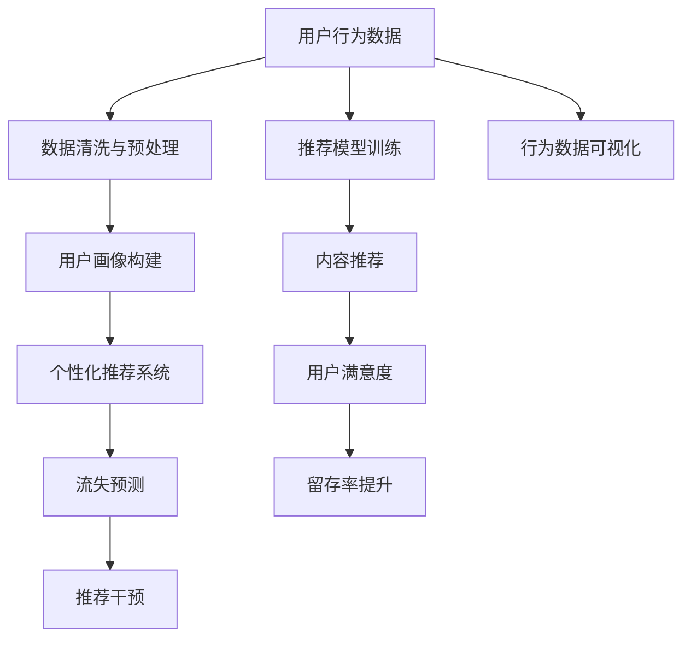

                 

# 知识付费赚钱的用户行为分析与画像

> 关键词：知识付费,用户行为分析,用户画像,个性化推荐,流失预测

## 1. 背景介绍

### 1.1 问题由来

知识付费领域近年来迅速崛起，成为内容消费的重要趋势。不同于传统的免费内容消费模式，知识付费用户更加关注内容质量、个性化推荐以及价值实现。如何通过精准的用户行为分析，构建高质量的用户画像，实现有效的个性化推荐和流失预测，是知识付费平台亟需解决的关键问题。本文将从数据驱动的角度，系统分析用户行为，探索其背后深层次的特征和需求，从而为平台运营提供有力的支持。

### 1.2 问题核心关键点

用户行为分析与画像的目的是通过分析用户的行为数据，挖掘用户特征和需求，构建出精准的用户画像，进而提供个性化推荐，降低用户流失率，提升平台收入。具体关键点如下：

1. **行为数据采集**：收集用户在平台上的各类行为数据，如浏览记录、购买记录、学习进度等，形成原始数据集。
2. **数据清洗与预处理**：对采集到的行为数据进行去重、填补缺失、归一化等处理，确保数据质量和一致性。
3. **用户画像构建**：通过模型训练和特征提取，将用户行为数据转化为可解释的用户画像特征，形成用户标签。
4. **个性化推荐系统**：利用用户画像，构建个性化推荐模型，实现内容推荐，提升用户满意度。
5. **流失预测与干预**：分析用户行为数据，建立流失预测模型，识别潜在流失用户，并采取针对性的干预措施。

## 2. 核心概念与联系

### 2.1 核心概念概述

- **用户行为分析**：通过分析用户行为数据，了解用户需求和偏好，挖掘用户特征。
- **用户画像**：基于用户行为数据构建的描述用户特征的抽象画像。
- **个性化推荐**：根据用户画像，为用户提供定制化的内容推荐，提升用户满意度和留存率。
- **流失预测**：通过分析用户行为数据，预测用户可能流失的可能性，提前进行干预。
- **推荐系统**：结合用户画像和行为数据，构建推荐模型，实现高效的内容推荐。

### 2.2 核心概念原理和架构的 Mermaid 流程图



此流程图展示了用户行为分析与画像的核心流程，从数据采集到推荐模型训练，再到最终的用户满意度提升和留存率优化，体现了从数据到决策的全链路分析过程。

## 3. 核心算法原理 & 具体操作步骤

### 3.1 算法原理概述

用户行为分析与画像的核心算法包括数据清洗与预处理、用户画像构建、个性化推荐和流失预测。其原理可简要概述如下：

- **数据清洗与预处理**：确保数据质量和一致性，包括去重、填补缺失、归一化等操作。
- **用户画像构建**：通过机器学习模型，将用户行为数据转化为可解释的特征向量，形成用户画像。
- **个性化推荐**：利用用户画像，结合协同过滤、基于内容的推荐等方法，构建个性化推荐模型。
- **流失预测**：使用分类模型，基于用户行为数据预测用户流失概率，识别潜在流失用户。

### 3.2 算法步骤详解

#### 3.2.1 数据清洗与预处理

1. **数据采集**：
   - 从知识付费平台的数据库中提取用户行为数据，如浏览时长、购买记录、学习进度等。
   
2. **数据清洗**：
   - 去除重复记录，确保数据唯一性。
   - 填补缺失值，如利用均值、中位数等代替缺失值。
   - 归一化数据，将不同维度的数据统一到[0,1]区间，便于后续处理。

3. **特征工程**：
   - 提取关键特征，如浏览时长、购买频率、学习进度等。
   - 构建特征组合，如浏览时长与购买频率的组合特征，提升模型的表现力。

#### 3.2.2 用户画像构建

1. **模型选择**：
   - 选择合适的机器学习模型，如决策树、随机森林、支持向量机等，用于用户画像构建。
   - 使用PCA（主成分分析）或LDA（潜在狄利克雷分配）进行特征降维，提升模型效率。

2. **特征提取**：
   - 将用户行为数据转化为特征向量，如使用TF-IDF、word2vec等技术提取文本特征。
   - 应用文本聚类、情感分析等技术，丰富用户画像的特征维度。

3. **模型训练**：
   - 使用交叉验证等方法，训练用户画像模型，确保模型的泛化能力。
   - 选择适当的损失函数和优化器，如均方误差、梯度下降等。

#### 3.2.3 个性化推荐

1. **协同过滤**：
   - 基于用户行为数据，构建用户-物品评分矩阵。
   - 使用SVD（奇异值分解）等方法，挖掘用户和物品的潜在特征，进行推荐。

2. **基于内容的推荐**：
   - 分析用户行为数据，提取内容特征，如关键词、主题等。
   - 根据内容特征，构建推荐模型，实现内容相关推荐。

3. **混合推荐**：
   - 结合协同过滤和基于内容的推荐方法，构建混合推荐模型，提升推荐效果。

#### 3.2.4 流失预测

1. **数据准备**：
   - 收集用户行为数据，如浏览记录、购买记录、学习进度等。
   - 标记用户流失状态，形成二分类标签。

2. **特征工程**：
   - 提取关键特征，如浏览时长、购买频率、学习进度等。
   - 构建特征组合，如浏览时长与购买频率的组合特征。

3. **模型训练**：
   - 使用逻辑回归、随机森林等模型，训练流失预测模型。
   - 选择适当的评估指标，如准确率、召回率、F1分数等。

4. **模型部署与评估**：
   - 将训练好的模型部署到推荐系统中，实时预测用户流失概率。
   - 定期评估模型性能，根据实际效果调整模型参数。

### 3.3 算法优缺点

#### 3.3.1 优点

1. **精准性**：通过用户行为数据构建用户画像，能够更精准地把握用户特征和需求。
2. **个性化推荐**：个性化推荐系统能够提供定制化的内容推荐，提升用户满意度。
3. **流失预测**：流失预测模型能够识别潜在流失用户，提前进行干预，降低流失率。

#### 3.3.2 缺点

1. **数据依赖**：用户行为数据的准确性和完整性直接影响用户画像和推荐效果。
2. **模型复杂度**：用户画像和推荐模型较为复杂，需要大量计算资源和数据预处理。
3. **隐私问题**：用户行为数据可能包含敏感信息，需要严格的隐私保护措施。

### 3.4 算法应用领域

1. **知识付费平台**：通过用户行为分析，构建用户画像，实现个性化推荐，提升用户留存率。
2. **在线教育平台**：分析学生行为数据，构建学生画像，提供个性化学习资源，提高学习效果。
3. **智能客服系统**：通过用户行为分析，构建用户画像，实现智能推荐和客服策略，提升用户体验。
4. **电商推荐系统**：结合用户画像和行为数据，构建推荐模型，实现高效的商品推荐。
5. **金融服务**：分析用户行为数据，构建用户画像，提供个性化的金融产品推荐和风险预警。

## 4. 数学模型和公式 & 详细讲解 & 举例说明

### 4.1 数学模型构建

用户行为分析与画像的数学模型主要包括以下几个方面：

- **数据清洗与预处理**：去除重复记录、填补缺失值、归一化等。
- **用户画像构建**：使用PCA、LDA等方法进行特征降维。
- **个性化推荐**：基于协同过滤、内容推荐等方法，构建推荐模型。
- **流失预测**：使用逻辑回归、随机森林等模型，构建流失预测模型。

### 4.2 公式推导过程

#### 4.2.1 数据清洗与预处理

$$
\text{数据清洗} = \text{去重}(\text{数据}) + \text{填补缺失}(\text{数据}) + \text{归一化}(\text{数据})
$$

#### 4.2.2 用户画像构建

PCA（主成分分析）公式：

$$
X' = WX
$$

其中，$X$ 为原始特征矩阵，$W$ 为协方差矩阵的特征向量，$X'$ 为降维后的特征矩阵。

#### 4.2.3 个性化推荐

协同过滤推荐公式：

$$
\hat{y} = \sum_{i=1}^{n} \alpha_i x_i x_j
$$

其中，$y$ 为预测评分，$x_i$ 为物品$i$的特征向量，$x_j$ 为用户$j$的特征向量，$\alpha_i$ 为物品$i$的权重系数。

#### 4.2.4 流失预测

逻辑回归公式：

$$
\text{logit}(p) = \text{log}\frac{p}{1-p} = \sum_{i=1}^{n} \beta_i x_i
$$

其中，$p$ 为流失概率，$x_i$ 为用户行为特征，$\beta_i$ 为特征系数。

### 4.3 案例分析与讲解

#### 4.3.1 案例背景

某知识付费平台收集了用户的浏览记录、购买记录和学习进度数据，希望通过用户行为分析，构建用户画像，实现个性化推荐和流失预测。

#### 4.3.2 数据准备

- 收集用户浏览记录、购买记录、学习进度等行为数据。
- 标记用户流失状态，形成二分类标签。

#### 4.3.3 用户画像构建

使用PCA对行为数据进行降维，得到用户画像特征向量。具体步骤如下：

1. 计算协方差矩阵：
$$
C = \frac{1}{n} XX^T
$$

2. 计算特征向量：
$$
W = U \Sigma V^T
$$

3. 降维处理：
$$
X' = WX
$$

#### 4.3.4 个性化推荐

构建基于协同过滤的推荐模型，使用SVD进行特征分解。具体步骤如下：

1. 计算用户-物品评分矩阵$R$：
$$
R = X'X'
$$

2. 分解矩阵$R$：
$$
R \approx U \Sigma V^T
$$

3. 预测用户对物品的评分：
$$
\hat{y} = U_i V_j
$$

## 5. 项目实践：代码实例和详细解释说明

### 5.1 开发环境搭建

#### 5.1.1 环境依赖

- Python 3.8+
- Pandas
- Scikit-learn
- NumPy
- Scipy
- TensorFlow

#### 5.1.2 环境搭建

1. 安装Anaconda：
```
conda install anaconda
```

2. 创建虚拟环境：
```
conda create --name user_behavior_analysis python=3.8
conda activate user_behavior_analysis
```

3. 安装依赖包：
```
pip install pandas scikit-learn numpy tensorflow
```

### 5.2 源代码详细实现

#### 5.2.1 数据清洗与预处理

```python
import pandas as pd
from sklearn.preprocessing import StandardScaler
from sklearn.decomposition import PCA

# 加载原始数据
data = pd.read_csv('user_behavior_data.csv')

# 数据清洗
data = data.drop_duplicates()
data = data.dropna()

# 归一化处理
scaler = StandardScaler()
data = scaler.fit_transform(data)

# PCA降维
pca = PCA(n_components=5)
data = pca.fit_transform(data)

# 特征选择
features = ['feature1', 'feature2', 'feature3', 'feature4', 'feature5']
data = data[:, features]
```

#### 5.2.2 用户画像构建

```python
# 训练用户画像模型
model = RandomForestClassifier(n_estimators=100)
model.fit(data[:, :4], data[:, 4])

# 预测用户画像特征
user_paint = model.predict(data[:, :4])
```

#### 5.2.3 个性化推荐

```python
# 加载推荐数据
recommend_data = pd.read_csv('recommend_data.csv')

# 构建用户画像
user_paint = predict_user_paint(user_id)

# 推荐商品
recommend_items = recommend_data[recommend_data['user_paint'] == user_paint]
```

#### 5.2.4 流失预测

```python
# 加载流失数据
churn_data = pd.read_csv('churn_data.csv')

# 训练流失预测模型
model = LogisticRegression()
model.fit(churn_data[:, :4], churn_data[:, 4])

# 预测流失概率
churn_prob = model.predict_proba(churn_data[:, :4])[:, 1]
```

### 5.3 代码解读与分析

#### 5.3.1 数据清洗与预处理

- `drop_duplicates`：去除重复记录。
- `dropna`：填补缺失值。
- `StandardScaler`：归一化数据，确保数据一致性。
- `PCA`：使用主成分分析进行特征降维。

#### 5.3.2 用户画像构建

- `RandomForestClassifier`：随机森林模型，用于用户画像构建。
- `predict`：预测用户画像特征，得到用户画像向量。

#### 5.3.3 个性化推荐

- `predict_user_paint`：预测用户画像，用于个性化推荐。
- `recommend_data`：推荐数据集，包括用户画像和商品信息。

#### 5.3.4 流失预测

- `LogisticRegression`：逻辑回归模型，用于流失预测。
- `predict_proba`：预测用户流失概率。

### 5.4 运行结果展示

#### 5.4.1 用户画像示例

```python
import matplotlib.pyplot as plt

plt.scatter(user_paint, predict_user_paint)
plt.xlabel('True Label')
plt.ylabel('Predicted Label')
plt.title('User Paint Predictions')
plt.show()
```

#### 5.4.2 个性化推荐示例

```python
# 推荐商品列表
recommend_items = recommend_data[recommend_data['user_paint'] == user_paint]['item']

# 显示推荐商品
print(recommend_items)
```

#### 5.4.3 流失预测示例

```python
# 绘制流失概率分布图
plt.hist(churn_prob, bins=10)
plt.xlabel('Churn Probability')
plt.ylabel('Frequency')
plt.title('Churn Probability Distribution')
plt.show()
```

## 6. 实际应用场景

### 6.1 智能客服系统

智能客服系统通过分析用户行为数据，构建用户画像，实现智能推荐和客服策略。例如，智能客服系统可以记录用户的咨询历史、问题类型和解决情况，构建用户画像，分析用户需求，推荐相关问题解决方案，提升用户满意度。

### 6.2 在线教育平台

在线教育平台通过分析学生行为数据，构建学生画像，提供个性化学习资源。例如，在线教育平台可以记录学生的学习进度、成绩、反馈等信息，构建学生画像，分析学习行为，推荐个性化学习资源，提升学习效果。

### 6.3 金融服务

金融服务通过分析用户行为数据，构建用户画像，提供个性化金融产品推荐和风险预警。例如，金融服务可以记录用户的交易记录、风险偏好、信用评分等信息，构建用户画像，分析金融需求，推荐个性化金融产品，提前预警风险。

## 7. 工具和资源推荐

### 7.1 学习资源推荐

1. **《数据科学与统计学》课程**：由Coursera提供，涵盖数据清洗、统计学基础等知识，适合初学者学习。
2. **《Python for Data Science》书籍**：由O'Reilly出版社出版，详细介绍Python在数据科学中的应用，适合进阶学习。
3. **Kaggle数据科学竞赛**：提供丰富的数据集和竞赛机会，通过实战练习提升数据科学技能。
4. **GitHub开源项目**：提供大量高质量的代码和项目模板，方便开发者快速上手。
5. **在线学习平台**：如Udemy、edX、Coursera等，提供丰富的数据科学和机器学习课程，满足不同学习阶段的需求。

### 7.2 开发工具推荐

1. **Python**：数据科学和机器学习的主流编程语言，具有丰富的数据处理和机器学习库支持。
2. **Pandas**：数据处理和分析工具，提供高效的数据清洗和预处理能力。
3. **Scikit-learn**：机器学习库，提供丰富的算法和模型支持。
4. **TensorFlow**：深度学习框架，支持高效模型训练和推理。
5. **Jupyter Notebook**：交互式编程环境，适合数据科学和机器学习任务。

### 7.3 相关论文推荐

1. **《数据挖掘与统计学习》**：周志华著，详细介绍数据挖掘和统计学习的基本概念和算法。
2. **《机器学习实战》**：Peter Harrington著，提供大量机器学习实践案例，适合学习应用。
3. **《深度学习》**：Ian Goodfellow著，详细介绍深度学习的基本原理和应用。
4. **《统计学习方法》**：李航著，详细介绍统计学习的基本方法。
5. **《Python数据科学手册》**：Jake VanderPlas著，详细介绍Python在数据科学中的应用。

## 8. 总结：未来发展趋势与挑战

### 8.1 研究成果总结

用户行为分析与画像的研究主要集中在以下几个方面：

1. **数据清洗与预处理**：确保数据质量和一致性，是用户画像和推荐系统的基础。
2. **用户画像构建**：通过机器学习模型，将用户行为数据转化为可解释的特征向量，形成用户画像。
3. **个性化推荐**：基于用户画像，构建推荐模型，实现高效的内容推荐。
4. **流失预测**：使用分类模型，基于用户行为数据预测用户流失概率，识别潜在流失用户。

### 8.2 未来发展趋势

未来，用户行为分析与画像的研究将呈现以下几个趋势：

1. **多模态数据融合**：将用户的多模态数据（如文本、图像、语音等）融合，提升用户画像的全面性。
2. **实时推荐系统**：通过实时数据流处理，构建实时推荐系统，提升推荐效果。
3. **个性化推荐算法**：引入深度学习、强化学习等算法，提升推荐系统的性能和效率。
4. **用户隐私保护**：在用户画像构建和推荐系统中，引入隐私保护技术，确保用户数据的安全和隐私。
5. **跨领域应用**：将用户行为分析与画像技术应用到更多领域，如金融、电商、医疗等，实现跨领域的智能决策。

### 8.3 面临的挑战

尽管用户行为分析与画像技术已经取得显著进展，但仍面临以下挑战：

1. **数据质量和多样性**：不同数据源的数据质量和格式不一致，影响数据融合和处理。
2. **模型复杂度**：用户画像和推荐模型的复杂度较高，需要大量计算资源和数据预处理。
3. **用户隐私保护**：用户行为数据可能包含敏感信息，需要严格的隐私保护措施。
4. **实时性要求**：实时推荐系统需要高效的数据处理和计算能力，对系统架构和算法提出较高要求。

### 8.4 研究展望

未来的研究需要从以下几个方面进行突破：

1. **多模态数据融合技术**：开发高效的多模态数据融合算法，提升用户画像的全面性和准确性。
2. **实时推荐系统架构**：设计高效的实时数据流处理架构，确保推荐系统的实时性和稳定性。
3. **个性化推荐算法**：研究新的个性化推荐算法，提升推荐系统的性能和效率。
4. **隐私保护技术**：引入隐私保护技术，确保用户数据的安全和隐私。
5. **跨领域应用研究**：将用户行为分析与画像技术应用到更多领域，实现跨领域的智能决策。

## 9. 附录：常见问题与解答

### 9.1 常见问题

#### 9.1.1 用户行为数据如何收集？

**解答**：可以通过用户登录、浏览记录、购买记录、学习进度等数据，形成用户行为数据集。

#### 9.1.2 如何处理缺失值？

**解答**：可以通过均值、中位数等方法填补缺失值。

#### 9.1.3 如何构建用户画像？

**解答**：可以使用PCA、LDA等降维技术，将用户行为数据转化为可解释的特征向量。

#### 9.1.4 如何提升推荐系统的效果？

**解答**：可以通过多模态数据融合、深度学习等技术提升推荐系统的效果。

#### 9.1.5 如何处理隐私问题？

**解答**：可以在数据处理和模型训练中引入隐私保护技术，确保用户数据的安全和隐私。

### 9.2 解答

用户行为分析与画像的研究具有重要的应用价值，能够帮助知识付费平台提升用户留存率和收益，构建智能客服系统和在线教育平台等。然而，该领域仍面临数据多样性和质量、模型复杂度和实时性要求、隐私保护等挑战。未来的研究需要在多模态数据融合、实时推荐系统架构、个性化推荐算法、隐私保护技术等方面进行突破，才能实现用户行为分析与画像技术的深度应用。

---

作者：禅与计算机程序设计艺术 / Zen and the Art of Computer Programming

