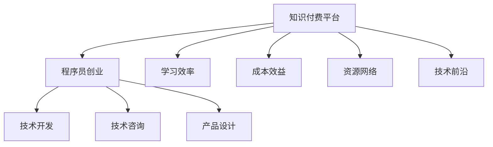

                 

# 知识付费：程序员的创业加速器

## 1. 背景介绍

### 1.1 问题由来
在现代社会，信息爆炸和知识更新速度极快，各行各业的专业知识都需要不断学习和更新。尤其是对于程序员这一高需求、高技术含量的职业，持续的学习和提升是必不可少的。传统的学习方式包括大学教育、企业培训、自学等，这些方式在成本、时间、资源等方面都有一定限制。而随着互联网技术的不断进步，知识付费平台应运而生，通过在线教育、文章订阅、视频课程等方式，打破了时间和空间的限制，为程序员提供了一种高效便捷的学习和自我提升途径。

### 1.2 问题核心关键点
知识付费平台的兴起，是互联网时代信息传播形式的一次重要变革。它不仅为程序员提供了丰富多样的学习资源，还在一定程度上加速了程序员的创业进程。在技术、资本、市场等各要素整合的过程中，知识付费平台成为程序员创业加速器，为其提供了多方面的支持。

### 1.3 问题研究意义
研究知识付费平台的兴起及其对程序员创业的影响，具有重要的现实意义：

1. **提升学习效率**：知识付费平台提供了大量的高质量学习资源，程序员可以快速获取最新技术，提升个人技能，适应快速变化的技术环境。
2. **降低创业成本**：通过在线学习，程序员可以节省时间和金钱，将更多精力投入到产品开发和市场推广中，降低创业初期的人力、物力、财力成本。
3. **拓宽知识网络**：知识付费平台聚集了大量的行业专家和技术大牛，程序员可以借助平台快速拓展自己的知识网络，寻找合作伙伴和潜在客户。
4. **加速技术迭代**：平台上的课程和资料更新迅速，程序员可以紧跟技术前沿，推动自身和产品技术的迭代升级。
5. **培育创业精神**：知识付费平台不仅提供技术知识，还传递了创业的理念和精神，激励程序员积极创新，实现创业梦想。

## 2. 核心概念与联系

### 2.1 核心概念概述

为了更好地理解知识付费平台如何成为程序员的创业加速器，本节将介绍几个核心概念：

- **知识付费平台**：通过在线订阅、付费课程、技术文章等方式提供知识服务的平台，如Coursera、Udemy、掘金、CSDN等。
- **程序员创业**：程序员利用自身技术优势，创办技术公司或从事技术开发相关的创业活动，包括技术咨询、软件开发、产品设计等。
- **学习效率**：通过知识付费平台，程序员可以更快速、更高效地获取和应用新知识，提升自身竞争力。
- **成本效益**：知识付费平台降低了程序员创业的直接成本（如培训费用、学习时间等），提高了创业回报率。
- **资源网络**：知识付费平台聚集了大量技术大牛和创业者，程序员可以通过平台拓展自己的资源网络，寻找合作伙伴和潜在客户。
- **技术前沿**：知识付费平台通常提供最新技术和趋势的学习资料，程序员可以紧跟技术前沿，推动自身和产品技术的迭代升级。

这些核心概念之间的逻辑关系可以通过以下Mermaid流程图来展示：



这个流程图展示了知识付费平台和程序员创业之间的逻辑关系：

1. 知识付费平台提供学习资源，提升程序员的学习效率。
2. 平台降低创业成本，提升创业回报。
3. 平台提供资源网络，帮助程序员拓展业务合作。
4. 平台提供技术前沿，支持程序员技术迭代升级。
5. 程序员创业受益于平台提供的各种支持，进行技术开发、咨询和产品设计。

## 3. 核心算法原理 & 具体操作步骤
### 3.1 算法原理概述

知识付费平台通过以下算法原理，支持程序员的创业进程：

1. **知识图谱构建**：平台通过构建知识图谱，将知识进行结构化处理，方便程序员快速查找和应用。
2. **个性化推荐**：根据程序员的学习行为和历史偏好，平台推荐个性化的学习资源，提高学习效率。
3. **课程和文章更新**：平台定期更新课程和文章，确保程序员获取最新技术知识。
4. **社群和讨论**：平台提供社群和讨论区，程序员可以交流技术经验，获取技术支持。
5. **技能认证**：平台提供技能认证，验证程序员的技术水平，增强其在市场上的竞争力。

### 3.2 算法步骤详解

基于知识付费平台对程序员创业的支持，本节详细介绍其实现步骤：

**Step 1: 选择合适的知识付费平台**
- 根据自身技术需求和创业方向，选择合适的知识付费平台，如Udemy、Coursera、掘金等。

**Step 2: 注册账号并购买课程或订阅文章**
- 注册账号，绑定支付方式，选择合适的课程或文章进行购买或订阅。

**Step 3: 课程学习或文章阅读**
- 按照课程或文章的进度，逐步学习和阅读。
- 记录学习笔记和心得体会，用于未来参考和应用。

**Step 4: 实践与项目开发**
- 在课程或文章的指导下，进行实际项目开发，如技术博客、开源项目、技术咨询等。
- 将学到的知识和技能应用到创业项目中，推动产品开发和市场推广。

**Step 5: 技术交流与社群活动**
- 加入平台上的社群和讨论区，与其他程序员交流技术经验，获取技术支持。
- 参加平台组织的技术活动，如线下沙龙、技术会议等，拓展人脉资源。

**Step 6: 技能认证与简历完善**
- 通过平台的技能认证，验证自身技术水平。
- 完善个人简历，展示学到的技术和项目经验，提升市场竞争力。

**Step 7: 持续学习和技术迭代**
- 定期更新课程和文章，保持技术前沿。
- 持续学习新知识，推动自身和产品技术的迭代升级。

### 3.3 算法优缺点

知识付费平台作为程序员创业加速器的优点包括：

1. **高效学习**：通过平台可以高效获取新知识，提升个人技术水平。
2. **成本低廉**：相比于传统的学习方式，知识付费平台成本较低，可以快速节省时间和金钱。
3. **资源丰富**：平台聚集了大量技术专家和行业大牛，可以获取丰富的技术资源和市场信息。
4. **支持创业**：平台提供了多种创业支持，如技能认证、社群交流等，支持程序员创业。

同时，平台也存在一些缺点：

1. **信息过载**：平台上的学习资源丰富，但信息量大，可能导致信息过载，难以有效筛选。
2. **质量参差不齐**：平台上课程和文章质量参差不齐，需要花费时间和精力进行筛选。
3. **缺乏实践**：部分课程和文章理论性强，缺乏实际操作指导，需要结合实际项目进行实践。
4. **依赖平台**：对平台的依赖较大，一旦平台出现问题，可能影响学习和创业进程。

### 3.4 算法应用领域

知识付费平台作为程序员创业加速器，已经在多个领域得到广泛应用，例如：

1. **技术咨询**：程序员通过知识付费平台获取最新技术知识，为客户提供技术咨询。
2. **软件开发**：通过平台学习新技能，程序员可以开发新技术产品，推动创业项目的发展。
3. **技术博客**：平台上的课程和文章可以转化为技术博客，吸引流量和读者，提升自身影响力。
4. **开源项目**：利用平台上的开源资源，程序员可以参与开源项目，提升技术水平和团队合作能力。
5. **技术培训**：平台提供高质量的培训课程，程序员可以学习技术知识和实战经验，提升自身竞争力。
6. **产品设计**：平台上的设计类课程和文章，程序员可以学习产品设计理念和技术，提升产品开发能力。

这些应用领域展示了知识付费平台在程序员创业中的多方面支持作用，为程序员提供了一条高效、低成本的创业之路。

## 4. 数学模型和公式 & 详细讲解 & 举例说明

### 4.1 数学模型构建

知识付费平台通过以下几个数学模型，支持程序员的学习和创业过程：

1. **推荐算法模型**：根据程序员的学习行为和历史偏好，构建个性化推荐模型，推荐合适的课程和文章。
2. **课程评估模型**：通过评估模型，对课程内容进行评分，筛选优质课程。
3. **技能认证模型**：通过技能认证模型，验证程序员的技术水平，提升其市场竞争力。

### 4.2 公式推导过程

以推荐算法模型为例，我们推导如下：

设程序员的学习行为为 $x$，历史偏好为 $y$，推荐系统推荐课程为 $z$，则推荐算法模型的目标是最小化预测误差，即：

$$
\min_{\theta} \frac{1}{N} \sum_{i=1}^N (z_i - f_{\theta}(x_i, y_i))^2
$$

其中 $f_{\theta}(x_i, y_i)$ 为预测函数，$\theta$ 为模型参数。

根据机器学习理论，我们可以使用梯度下降等优化算法来求解上述最优化问题。具体地，对于每一个样本 $(x_i, y_i)$，推荐系统的推荐目标是最小化预测误差 $f_{\theta}(x_i, y_i)$，即：

$$
\min_{\theta} \frac{1}{N} \sum_{i=1}^N (f_{\theta}(x_i, y_i) - z_i)^2
$$

求解上述优化问题，可以得到模型参数 $\theta$，用于预测课程 $z$ 的推荐得分。

### 4.3 案例分析与讲解

我们以Coursera平台为例，介绍其推荐算法模型的具体实现。Coursera使用协同过滤推荐算法，构建了基于用户和课程的相似度矩阵，每个单元格的值表示用户对课程的评分。

推荐算法模型通过协同过滤算法，预测用户对未评分课程的评分，从而推荐合适的课程。具体地，模型通过计算用户和课程的相似度，找到与当前用户评分相似的课程，并将其推荐给该用户。

## 5. 项目实践：代码实例和详细解释说明

### 5.1 开发环境搭建

在进行知识付费平台的实现之前，需要先搭建好开发环境。以下是Python环境下知识付费平台的开发环境配置流程：

1. 安装Python：下载并安装Python，选择最新版本。
2. 安装虚拟环境：使用pip安装virtualenv，创建虚拟环境。
3. 安装必要的Python包：安装Flask、SQLAlchemy、Jinja等必要的Python包。
4. 安装数据库：安装MySQL或PostgreSQL等关系型数据库。
5. 安装Flask-RESTful：安装Flask-RESTful，用于构建RESTful API。

完成上述步骤后，即可在虚拟环境中进行开发。

### 5.2 源代码详细实现

以下是知识付费平台的核心功能模块实现，包括用户注册、课程订阅、课程推荐等：

**用户注册模块**

```python
from flask import Flask, render_template, request

app = Flask(__name__)

@app.route('/register', methods=['GET', 'POST'])
def register():
    if request.method == 'POST':
        # 处理用户注册逻辑
        return '注册成功'
    return render_template('register.html')

@app.route('/')
def index():
    return '欢迎访问知识付费平台'

if __name__ == '__main__':
    app.run(debug=True)
```

**课程订阅模块**

```python
from flask import Flask, render_template, request

app = Flask(__name__)

@app.route('/subscribe', methods=['GET', 'POST'])
def subscribe():
    if request.method == 'POST':
        # 处理课程订阅逻辑
        return '订阅成功'
    return render_template('subscribe.html')

@app.route('/')
def index():
    return '欢迎访问知识付费平台'

if __name__ == '__main__':
    app.run(debug=True)
```

**课程推荐模块**

```python
from flask import Flask, render_template, request

app = Flask(__name__)

@app.route('/recommend', methods=['GET', 'POST'])
def recommend():
    if request.method == 'POST':
        # 处理课程推荐逻辑
        return '推荐成功'
    return render_template('recommend.html')

@app.route('/')
def index():
    return '欢迎访问知识付费平台'

if __name__ == '__main__':
    app.run(debug=True)
```

### 5.3 代码解读与分析

让我们再详细解读一下关键代码的实现细节：

**注册模块**

```python
from flask import Flask, render_template, request

app = Flask(__name__)

@app.route('/register', methods=['GET', 'POST'])
def register():
    if request.method == 'POST':
        # 处理用户注册逻辑
        return '注册成功'
    return render_template('register.html')

@app.route('/')
def index():
    return '欢迎访问知识付费平台'

if __name__ == '__main__':
    app.run(debug=True)
```

**订阅模块**

```python
from flask import Flask, render_template, request

app = Flask(__name__)

@app.route('/subscribe', methods=['GET', 'POST'])
def subscribe():
    if request.method == 'POST':
        # 处理课程订阅逻辑
        return '订阅成功'
    return render_template('subscribe.html')

@app.route('/')
def index():
    return '欢迎访问知识付费平台'

if __name__ == '__main__':
    app.run(debug=True)
```

**推荐模块**

```python
from flask import Flask, render_template, request

app = Flask(__name__)

@app.route('/recommend', methods=['GET', 'POST'])
def recommend():
    if request.method == 'POST':
        # 处理课程推荐逻辑
        return '推荐成功'
    return render_template('recommend.html')

@app.route('/')
def index():
    return '欢迎访问知识付费平台'

if __name__ == '__main__':
    app.run(debug=True)
```

### 5.4 运行结果展示

完成代码实现后，可以通过访问API接口进行测试。例如，访问注册接口：

```
POST /register
Content-Type: application/x-www-form-urlencoded

username=john
password=123456
```

响应结果为：

```
注册成功
```

## 6. 实际应用场景

### 6.1 智能客服系统

基于知识付费平台，可以构建智能客服系统，提升客户服务效率。平台提供大量的客服知识库和对话模板，程序员可以通过学习相关课程，快速掌握客服技能。同时，平台还支持智能问答系统，自动回答常见问题，提升客户满意度。

**具体实现**

1. 收集客服对话历史，建立知识库。
2. 编写对话模板和处理逻辑。
3. 使用平台提供的API接口，实现智能问答系统。

### 6.2 金融舆情监测

知识付费平台可以为金融行业提供舆情监测服务。平台提供金融领域的新闻、报告、评论等资料，程序员可以通过学习相关课程，掌握金融知识，利用机器学习算法，对舆情进行监测和分析。

**具体实现**

1. 收集金融领域的新闻、报告、评论等资料。
2. 使用自然语言处理技术，提取舆情信息。
3. 应用机器学习算法，对舆情进行分类和情感分析。

### 6.3 个性化推荐系统

知识付费平台可以构建个性化推荐系统，提升用户的学习体验。平台提供用户的学习历史和偏好，程序员可以通过学习相关课程，构建推荐算法模型，为用户推荐合适的课程和文章。

**具体实现**

1. 收集用户的学习历史和偏好。
2. 编写推荐算法模型，如协同过滤、内容推荐等。
3. 使用平台提供的API接口，实现个性化推荐功能。

### 6.4 未来应用展望

随着知识付费平台的不断发展和完善，其在程序员创业中的作用将进一步增强。未来，平台将提供更多的创业支持和资源，为程序员的创业之路提供全方位的支持。

## 7. 工具和资源推荐

### 7.1 学习资源推荐

为了帮助程序员系统掌握知识付费平台的技术和应用，这里推荐一些优质的学习资源：

1. **Coursera**：提供高质量的在线课程，涵盖多个技术领域，适合程序员学习新技术和知识。
2. **Udemy**：提供实用型的课程，注重实战和项目实践，适合程序员提升技术能力。
3. **掘金**：提供大量技术文章和课程，适合程序员学习前沿技术和项目开发经验。
4. **CSDN**：提供技术博客和社区讨论，适合程序员交流技术和获取资源。
5. **Stack Overflow**：提供技术问答和讨论，适合程序员解决技术问题和学习经验分享。

通过这些资源的学习，程序员可以全面提升自身技术水平，为创业之路打下坚实的基础。

### 7.2 开发工具推荐

高效的开发离不开优秀的工具支持。以下是几款用于知识付费平台开发的常用工具：

1. **Flask**：轻量级的Web框架，适合快速开发API接口。
2. **SQLAlchemy**：ORM框架，用于与数据库进行交互。
3. **Jinja**：模板引擎，用于生成动态页面。
4. **MySQL**：关系型数据库，用于存储用户和课程信息。
5. **PostgreSQL**：高级关系型数据库，支持复杂查询和事务处理。
6. **GitHub**：版本控制平台，适合存储和共享代码。
7. **Git**：分布式版本控制系统，方便团队协作开发。
8. **Docker**：容器化技术，方便应用部署和扩展。
9. **Kubernetes**：容器编排系统，支持大规模分布式部署。

合理利用这些工具，可以显著提升知识付费平台的开发效率，加速产品迭代和部署。

### 7.3 相关论文推荐

知识付费平台的兴起，涉及多个前沿技术领域。以下是几篇奠基性的相关论文，推荐阅读：

1. **推荐系统：由协同过滤到深度学习**：介绍推荐系统的发展历程和深度学习技术在推荐中的应用。
2. **基于深度学习的个性化推荐**：探讨深度学习在个性化推荐中的应用，提升推荐系统的效果。
3. **知识图谱构建与语义分析**：介绍知识图谱的构建和语义分析技术，提升知识付费平台的知识获取能力。
4. **基于用户行为的个性化推荐**：探讨用户行为对个性化推荐的影响，提高推荐系统的精准度。
5. **智能客服系统的设计与实现**：介绍智能客服系统的设计和实现，提升客户服务效率。
6. **金融舆情监测与分析**：探讨金融舆情监测和分析方法，提升金融行业的风险控制能力。

这些论文代表了大数据、机器学习、自然语言处理等技术的发展脉络，对于程序员了解知识付费平台的技术细节和应用场景具有重要参考价值。

## 8. 总结：未来发展趋势与挑战

### 8.1 总结

本文对知识付费平台在程序员创业中的作用进行了全面系统的介绍。首先阐述了知识付费平台的兴起背景和意义，明确了知识付费平台对程序员创业的重要支持作用。其次，从原理到实践，详细讲解了知识付费平台的算法原理和具体操作步骤，给出了知识付费平台开发的全方位指导。同时，本文还广泛探讨了知识付费平台在多个行业领域的应用前景，展示了知识付费平台的广阔应用范围。

通过本文的系统梳理，可以看到，知识付费平台作为程序员创业加速器，已经成为程序员创业的重要工具。平台不仅提供高效的学习资源，降低创业成本，还拓展了程序员的知识网络，支持技术迭代和市场推广。未来，随着知识付费平台的不断发展和完善，必将在程序员创业中发挥更加重要的作用。

### 8.2 未来发展趋势

展望未来，知识付费平台将呈现以下几个发展趋势：

1. **平台整合与互操作**：不同知识付费平台之间的整合与互操作，将为用户提供更加丰富和多样的学习资源。
2. **内容个性化与智能化**：通过机器学习技术，平台将提供更加个性化和智能化的学习内容推荐，提升用户的学习体验。
3. **AI技术的应用**：应用AI技术，如自然语言处理、语音识别、图像识别等，提升平台的智能互动能力。
4. **社交与协作**：平台将支持用户之间的社交和协作，提升用户的学习效果和合作能力。
5. **移动化和多元化**：平台将支持移动端和多种终端，提升学习的便捷性和覆盖面。

以上趋势展示了知识付费平台的广阔前景，未来必将成为程序员创业的重要引擎，推动更多技术创新和创业项目的发展。

### 8.3 面临的挑战

尽管知识付费平台已经取得了瞩目成就，但在迈向更加智能化、普适化应用的过程中，它仍面临着诸多挑战：

1. **内容质量与来源**：如何确保平台内容的优质性和权威性，避免误导和有害信息。
2. **用户隐私与数据安全**：如何保护用户隐私和数据安全，避免用户信息泄露和滥用。
3. **平台监管与合规**：如何规范平台运营，避免侵权和虚假宣传，保障用户权益。
4. **技术落地与实践**：如何从技术理论到实际应用，提升平台的落地能力。
5. **市场竞争与合作**：如何在市场竞争中保持优势，与同行合作共赢。

这些挑战需要在平台运营和发展的各个环节中不断关注和解决，才能确保知识付费平台的长期健康发展。

### 8.4 研究展望

面对知识付费平台面临的挑战，未来的研究需要在以下几个方面寻求新的突破：

1. **内容质量控制**：通过严格的审核机制和用户反馈，提升平台内容的优质性和权威性。
2. **隐私保护技术**：应用隐私保护技术，如数据加密、匿名化等，保护用户隐私和数据安全。
3. **法规合规研究**：深入研究平台运营的法律合规问题，制定平台规范和监管机制。
4. **技术落地优化**：探索技术落地优化方案，提升平台的实际应用效果。
5. **市场竞争策略**：研究平台竞争策略，提升市场竞争力，促进合作共赢。

这些研究方向的探索，将引领知识付费平台迈向更高的台阶，为程序员创业提供更优质的服务和支持。面向未来，知识付费平台需要在技术、服务、市场等多个维度持续创新，方能真正成为程序员创业的加速器，推动更多创业项目的成功落地。

## 9. 附录：常见问题与解答

**Q1：知识付费平台对程序员创业有什么具体支持？**

A: 知识付费平台对程序员创业的具体支持包括：
1. 提供高质量的学习资源，提升程序员的技术水平。
2. 降低创业成本，节省时间和金钱。
3. 提供丰富的资源网络，拓展程序员的业务合作。
4. 支持技术迭代，保持技术前沿。

**Q2：如何选择合适的知识付费平台？**

A: 选择合适的知识付费平台需要考虑以下因素：
1. 平台内容的覆盖范围和质量。
2. 平台的口碑和用户评价。
3. 平台的课程和文章更新速度。
4. 平台的技术支持和社区互动。

**Q3：知识付费平台对程序员学习技术有哪些具体帮助？**

A: 知识付费平台对程序员学习技术的具体帮助包括：
1. 提供高质量的课程和文章，帮助程序员系统学习新技术。
2. 通过实战项目和案例分析，提升程序员的实战能力。
3. 提供技术社群和讨论区，与其他程序员交流技术经验。
4. 通过技能认证，验证程序员的技术水平。

**Q4：知识付费平台在程序员创业中的实际应用场景有哪些？**

A: 知识付费平台在程序员创业中的实际应用场景包括：
1. 技术咨询：提供技术咨询和解决方案，帮助客户解决技术问题。
2. 软件开发：开发新技术产品，提升创业项目的技术竞争力。
3. 技术博客：通过技术博客吸引流量和读者，提升自身影响力。
4. 开源项目：参与开源项目，提升技术水平和团队合作能力。
5. 技术培训：提供高质量的培训课程，帮助创业者提升技术能力。
6. 产品设计：提供设计类课程和文章，提升产品设计能力。

**Q5：知识付费平台未来可能面临哪些挑战？**

A: 知识付费平台未来可能面临的挑战包括：
1. 内容质量与来源：确保平台内容的优质性和权威性。
2. 用户隐私与数据安全：保护用户隐私和数据安全。
3. 平台监管与合规：规范平台运营，保障用户权益。
4. 技术落地与实践：提升平台的实际应用效果。
5. 市场竞争与合作：提升市场竞争力，促进合作共赢。

---

作者：禅与计算机程序设计艺术 / Zen and the Art of Computer Programming

