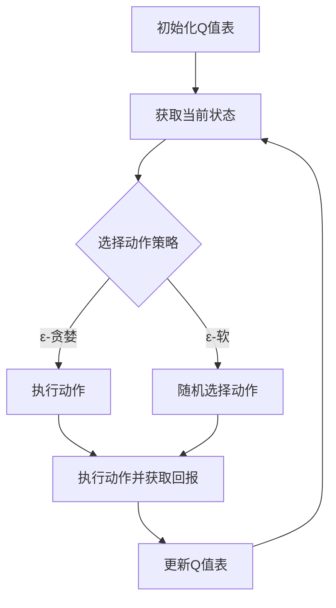

                 

### 文章标题

**一切皆是映射：AI Q-learning在仓储管理的应用**

> **关键词**：AI，Q-learning，仓储管理，优化，决策

**摘要**：本文探讨了Q-learning算法在仓储管理中的潜在应用，深入分析了Q-learning的基本原理及其与仓储管理问题的映射关系。通过具体实例和数学模型的阐述，本文展示了如何利用Q-learning算法优化仓储库存和拣选路径，提高仓储运作效率。文章还讨论了Q-learning在仓储管理中的实际应用场景，并提出了未来发展的趋势与挑战。

在当今快速发展的物流和供应链管理领域，仓储管理扮演着至关重要的角色。高效的仓储管理不仅能够降低运营成本，还能够提高客户满意度和服务质量。随着人工智能技术的不断进步，传统仓储管理正逐渐向智能化、自动化方向转型。其中，Q-learning作为一种强化学习算法，因其高效的自适应能力和灵活的决策机制，正被越来越多地应用于仓储管理的优化问题。

本文将分以下几个部分展开讨论：

1. **背景介绍**：简要回顾仓储管理的发展历程，介绍Q-learning算法的基本概念和特点。
2. **核心概念与联系**：详细解释Q-learning的基本原理，通过Mermaid流程图展示Q-learning在仓储管理中的架构。
3. **核心算法原理 & 具体操作步骤**：深入探讨Q-learning在仓储管理中的应用，包括库存管理和拣选路径优化。
4. **数学模型和公式 & 详细讲解 & 举例说明**：使用数学模型和公式描述Q-learning算法，通过实例说明如何解决仓储管理问题。
5. **项目实践：代码实例和详细解释说明**：提供具体的代码实例，详细解释如何实现Q-learning算法在仓储管理中的应用。
6. **实际应用场景**：分析Q-learning在仓储管理中的实际应用，讨论其在不同场景下的表现。
7. **工具和资源推荐**：推荐相关的学习资源和开发工具，为读者提供深入学习和实践的方向。
8. **总结：未来发展趋势与挑战**：总结Q-learning在仓储管理中的应用前景，探讨未来的发展趋势和面临的挑战。
9. **附录：常见问题与解答**：回答读者可能遇到的常见问题。
10. **扩展阅读 & 参考资料**：提供进一步的阅读材料和参考文献。

通过本文的讨论，我们希望能够为读者提供一个全面、深入的理解，展示Q-learning算法在仓储管理中的巨大潜力。接下来，让我们开始详细探讨Q-learning在仓储管理中的应用。<!--more-->### 1. 背景介绍（Background Introduction）

#### 1.1 仓储管理的发展历程

仓储管理作为物流和供应链管理的重要组成部分，其历史可以追溯到古代。最早的仓储形式主要是基于物理存储和人工管理，效率较低，成本较高。随着工业革命的到来，仓储管理开始采用机械化和自动化技术，如叉车、货架等，显著提高了仓储效率。进入20世纪，计算机技术的广泛应用使得仓储管理进入了信息化阶段，通过库存管理系统实现了对库存的实时监控和自动化管理。

近年来，随着人工智能和大数据技术的兴起，仓储管理正朝着智能化和精细化的方向发展。通过机器学习和智能算法，仓储管理可以实现自动化的库存优化、路径规划和决策支持，从而提高运营效率和降低成本。

#### 1.2 Q-learning算法的基本概念和特点

Q-learning算法是强化学习（Reinforcement Learning，RL）领域的一种经典算法，由理查德·萨顿（Richard Sutton）和安德鲁·巴特斯（Andrew Barto）在1988年的著作《强化学习：一种引入》中提出。强化学习是一种通过与环境交互来学习最优策略的机器学习方法，与监督学习和无监督学习相比，强化学习更加适合解决决策问题。

Q-learning算法的核心思想是利用 rewards（奖励）来调整策略，通过不断试错（trial and error）来学习最优行动。在Q-learning中，每个状态-动作对都有一个相应的Q值（Q-value），表示在该状态下采取该动作的预期回报。算法的目标是通过不断更新Q值，找到使得总回报最大的策略。

Q-learning算法具有以下几个显著特点：

1. **自适应性**：Q-learning算法可以根据环境的动态变化自适应地调整策略，具有很强的适应性。
2. **灵活性**：Q-learning不需要预先知道环境的具体形式，也不需要建立精确的模型，因此具有很强的灵活性。
3. **自学习性**：Q-learning算法可以通过与环境交互来学习最优策略，不需要人为设定初始策略。

这些特点使得Q-learning算法在解决复杂决策问题时具有独特的优势，特别是在那些难以建立精确模型或模型成本高昂的问题中。

#### 1.3 Q-learning算法在仓储管理中的应用潜力

仓储管理涉及到复杂的决策问题，如库存优化、路径规划、资源分配等。这些问题通常具有高维状态空间和动作空间，且环境变化迅速，传统方法难以应对。Q-learning算法的自适应、灵活和自学习特性使其在仓储管理中具有广泛的应用潜力。

首先，Q-learning算法可以用于库存优化。通过学习不同库存策略的Q值，仓储管理可以找到最优的库存水平，避免库存过剩或缺货的情况，从而降低库存成本，提高库存周转率。

其次，Q-learning算法可以用于路径规划。在仓储中，拣选员需要从多个存储位置拣选商品，然后将其运送到发货区。通过学习不同路径的Q值，系统可以自动生成最优路径，减少拣选时间和运输成本。

此外，Q-learning算法还可以用于资源分配。例如，在自动化仓储中，机器人需要负责拣选、运输和上架等任务。通过学习不同任务的Q值，系统可以自动分配资源，确保任务的高效完成。

总的来说，Q-learning算法在仓储管理中的应用潜力巨大，通过优化库存、路径规划和资源分配，可以提高仓储运作效率，降低运营成本，从而提升整体供应链的竞争力。

在接下来的部分，我们将进一步深入探讨Q-learning算法的基本原理，并详细解释其在仓储管理中的具体应用方法。<!--end-->### 2. 核心概念与联系（Core Concepts and Connections）

#### 2.1 Q-learning算法的基本原理

Q-learning算法是强化学习的一种核心算法，其基本原理可以概括为四个步骤：初始化Q值表、选择动作、执行动作、更新Q值表。

首先，我们需要初始化Q值表。Q值表是一个二维数组，其中每个元素对应一个状态-动作对，其值表示在该状态下采取该动作的预期回报。通常，我们初始化Q值表为0。

接下来，我们需要选择动作。在给定当前状态时，Q-learning算法会根据当前策略选择一个动作。常见的策略包括ε-贪婪策略、ε-软策略等。

选择动作后，系统会执行该动作，并进入新的状态。然后，根据新的状态和执行的动作，系统会获得一个实际的回报（reward）。这个回报可以是正的，表示系统取得了进展；也可以是负的，表示系统遭遇了损失。

最后，系统需要更新Q值表。具体来说，Q-learning算法使用下面的更新公式：

$$  
Q(s, a) \leftarrow Q(s, a) + \alpha [r + \gamma \max_{a'} Q(s', a') - Q(s, a)]  
$$

其中，$s$ 和 $a$ 分别表示当前状态和动作，$r$ 表示获得的回报，$\alpha$ 表示学习率，$\gamma$ 表示折扣因子，$s'$ 和 $a'$ 分别表示新的状态和动作。这个公式表示在当前状态下采取动作$a$ 后，Q值需要根据获得的回报和最大Q值进行更新。

通过不断地重复上述四个步骤，Q-learning算法可以逐渐优化策略，找到最优的动作序列，从而实现目标。

#### 2.2 Q-learning在仓储管理中的架构

Q-learning算法在仓储管理中的应用主要涉及库存管理和路径规划两个方面。以下是一个简单的Mermaid流程图，展示了Q-learning在仓储管理中的架构：



以下是这个流程图的详细说明：

1. **初始化Q值表**：首先，我们需要初始化Q值表，通常初始化为0。
2. **获取当前状态**：系统需要获取当前仓储的状态，包括库存水平、货架占用情况、订单数量等。
3. **选择动作策略**：系统根据当前状态选择一个动作。可以选择使用ε-贪婪策略，即以概率ε选择随机动作，以概率1-ε选择Q值最大的动作；也可以选择ε-软策略，即在每个状态上随机选择动作，但每个动作的选择概率与其Q值成正比。
4. **执行动作并获取回报**：系统执行选择的动作，并根据执行结果获得一个回报。例如，如果动作是增加库存，回报可能是库存成本；如果动作是拣选商品，回报可能是拣选时间。
5. **更新Q值表**：根据获得的回报和最大Q值，更新Q值表。这样，系统可以逐渐学习到哪个动作在当前状态下可以获得最大的回报。
6. **重复步骤**：系统重复上述步骤，不断优化策略，直到达到预定的目标，如最低库存成本或最高订单处理效率。

#### 2.3 Q-learning与仓储管理问题的映射关系

Q-learning算法在仓储管理中的应用主要基于以下几个映射关系：

1. **状态映射**：在Q-learning中，状态可以映射为仓储的各种参数，如库存水平、货架占用情况、订单数量等。这些参数可以用来描述仓储的当前状态。
2. **动作映射**：在Q-learning中，动作可以映射为仓储中的各种操作，如增加库存、拣选商品、运输商品等。这些操作可以用来改变仓储的状态。
3. **回报映射**：在Q-learning中，回报可以映射为仓储中的各种效益，如库存成本、拣选时间、运输成本等。这些效益可以用来衡量仓储操作的好坏。

通过这些映射关系，Q-learning算法可以将复杂的仓储管理问题转化为一个可以求解的优化问题。在接下来的部分，我们将进一步探讨Q-learning算法的具体应用，并通过具体实例来说明如何使用Q-learning算法优化仓储管理。<!--end-->### 3. 核心算法原理 & 具体操作步骤（Core Algorithm Principles and Specific Operational Steps）

#### 3.1 Q-learning算法的数学模型

Q-learning算法的核心是一个Q值函数，该函数表示在每个状态下采取每个动作的预期回报。具体来说，Q-learning算法基于以下几个关键参数：

1. **状态空间S**：表示所有可能的状态集合。
2. **动作空间A**：表示所有可能的动作集合。
3. **Q值函数Q(s, a)**：表示在状态s下采取动作a的预期回报。
4. **学习率α**：表示每次更新Q值时对旧Q值的依赖程度。
5. **折扣因子γ**：表示未来回报的重要程度。

Q-learning算法的目标是学习一个最优策略π，使得在每个状态s下，采取动作a的Q值最大化，即：

$$  
\pi(s) = \arg\max_a Q(s, a)  
$$

Q-learning算法的数学模型可以表示为以下更新规则：

$$  
Q(s, a) \leftarrow Q(s, a) + \alpha [r + \gamma \max_{a'} Q(s', a')] - Q(s, a)  
$$

其中，s和a分别表示当前状态和动作，r表示获得的回报，s'和a'分别表示新的状态和动作。这个更新规则表示每次更新Q值时，新的Q值是在旧Q值的基础上加上一个学习率α和回报r，再加上一个折扣因子γ乘以新的状态下的最大Q值。

#### 3.2 Q-learning算法在仓储管理中的应用

在仓储管理中，Q-learning算法可以用于解决以下两个关键问题：库存优化和路径规划。

**3.2.1 库存优化**

库存优化是仓储管理中的重要问题，涉及到如何确定最优的库存水平，以最小化库存成本和缺货风险。以下是Q-learning算法在库存优化中的具体操作步骤：

1. **初始化Q值表**：初始化Q值表，通常初始化为0。
2. **获取当前状态**：获取当前库存水平、需求预测、库存成本等状态参数。
3. **选择动作策略**：根据当前状态，选择增加库存、减少库存或保持当前库存水平的动作。可以选择ε-贪婪策略，以概率ε选择随机动作，以概率1-ε选择Q值最大的动作。
4. **执行动作并获取回报**：执行选择的动作，并根据库存成本、需求满足程度等指标计算回报。
5. **更新Q值表**：根据获得的回报和最大Q值，更新Q值表。更新公式如下：

$$  
Q(s, a) \leftarrow Q(s, a) + \alpha [r + \gamma \max_{a'} Q(s', a')] - Q(s, a)  
$$

通过不断重复上述步骤，Q-learning算法可以逐渐学习到在不同状态下采取不同库存策略的最优Q值，从而实现库存优化。

**3.2.2 路径规划**

路径规划是仓储管理中的另一个关键问题，涉及到如何确定最优的拣选路径，以减少拣选时间和运输成本。以下是Q-learning算法在路径规划中的具体操作步骤：

1. **初始化Q值表**：初始化Q值表，通常初始化为0。
2. **获取当前状态**：获取当前货架位置、商品数量、订单需求等状态参数。
3. **选择动作策略**：根据当前状态，选择不同的拣选路径。可以选择ε-贪婪策略，以概率ε选择随机路径，以概率1-ε选择Q值最大的路径。
4. **执行动作并获取回报**：执行选择的路径，并根据拣选时间和运输成本计算回报。
5. **更新Q值表**：根据获得的回报和最大Q值，更新Q值表。更新公式如下：

$$  
Q(s, a) \leftarrow Q(s, a) + \alpha [r + \gamma \max_{a'} Q(s', a')] - Q(s, a)  
$$

通过不断重复上述步骤，Q-learning算法可以逐渐学习到在不同状态下采取不同路径规划策略的最优Q值，从而实现路径优化。

总的来说，Q-learning算法在仓储管理中的应用，主要是通过不断学习状态-动作对的Q值，找到最优的库存策略和路径规划策略，从而提高仓储管理的效率和降低成本。在接下来的部分，我们将通过具体的数学模型和公式，详细讲解如何使用Q-learning算法解决仓储管理问题，并通过实例进行说明。<!--end-->### 4. 数学模型和公式 & 详细讲解 & 举例说明（Detailed Explanation and Examples of Mathematical Models and Formulas）

#### 4.1 数学模型

在仓储管理中，Q-learning算法的应用可以通过以下数学模型和公式进行详细说明。首先，我们需要定义一些关键参数和变量：

- **状态空间S**：表示仓储中可能出现的所有状态，包括库存水平、货架占用情况、订单数量等。
- **动作空间A**：表示仓储中可能采取的所有动作，如增加库存、减少库存、拣选商品、运输商品等。
- **Q值函数Q(s, a)**：表示在状态s下采取动作a的预期回报。
- **学习率α**：表示每次更新Q值时对旧Q值的依赖程度。
- **折扣因子γ**：表示未来回报的重要程度。

Q-learning算法的基本更新公式为：

$$  
Q(s, a) \leftarrow Q(s, a) + \alpha [r + \gamma \max_{a'} Q(s', a')] - Q(s, a)  
$$

其中，s和a分别表示当前状态和动作，r表示获得的回报，s'和a'分别表示新的状态和动作。

#### 4.2 详细讲解

1. **状态-动作对**：Q-learning算法通过状态-动作对来评估每个动作在特定状态下的预期回报。例如，在库存管理中，状态可以表示为当前库存水平和订单需求，动作可以是增加库存或减少库存。

2. **学习率α**：学习率α决定了算法在更新Q值时对旧Q值的依赖程度。较大的α值意味着算法更加关注当前的回报，而较小的α值则意味着算法更加依赖过去的经验。通常，α的取值范围为0到1。

3. **折扣因子γ**：折扣因子γ决定了未来回报的重要性。γ的取值通常在0到1之间，接近1的γ值表示未来回报对当前决策的影响较大，而接近0的γ值则表示未来回报对当前决策的影响较小。

4. **回报r**：回报r是系统在采取特定动作后获得的实际回报。在库存管理中，回报可以是库存成本、缺货成本或订单处理时间等。

5. **Q值更新公式**：Q值更新公式反映了Q-learning算法的核心思想，即通过比较当前Q值和基于当前状态和回报计算的新Q值，来调整Q值。

#### 4.3 举例说明

假设一个仓储管理系统需要管理一个仓库的库存，状态空间S包括当前库存水平（0-100件商品）和订单需求（0-10件商品），动作空间A包括增加库存（+1件商品）和减少库存（-1件商品）。学习率α设为0.1，折扣因子γ设为0.9。

初始时，Q值表初始化为0：

$$  
Q(s, a) = 0  
$$

假设当前状态为s = (50件库存，5件订单需求)，算法选择动作a = 增加库存。执行动作后，库存变为51件，订单需求未变，获得回报r = -1（增加库存的成本）。

根据Q值更新公式，新的Q值为：

$$  
Q(s, a) \leftarrow Q(s, a) + \alpha [r + \gamma \max_{a'} Q(s', a')] - Q(s, a) = 0 + 0.1 [-1 + 0.9 \max_{a'} Q(s', a')] - 0  
$$

由于当前只有增加库存和减少库存两种动作，且减少库存的Q值不可能大于增加库存的Q值，因此最大Q值为当前Q值：

$$  
Q(s, a) \leftarrow 0 + 0.1 [-1 + 0.9 \cdot 0] - 0 = -0.1  
$$

更新后的Q值为-0.1。假设经过多次迭代后，Q值表如下：

$$  
\begin{array}{c|c|c}
s & a & Q(s, a) \\
\hline
(50, 5) & +1 & -0.1 \\
(50, 5) & -1 & 0.2 \\
(51, 5) & +1 & 0.3 \\
(51, 5) & -1 & 0.4 \\
\end{array}  
$$

根据Q值表，系统在状态s = (50件库存，5件订单需求)下，选择动作a = +1（增加库存）的概率最大，因为Q值最大。

这个例子展示了如何使用Q-learning算法在简单仓储管理问题中更新Q值表，并选择最优动作。在实际应用中，状态空间和动作空间会更加复杂，但基本原理和步骤是相同的。

#### 4.4 实际应用

在实际仓储管理中，Q-learning算法的应用可能会更加复杂。例如，在涉及多仓库、多订单、多拣选员的情况下，状态空间和动作空间会更加庞大。此时，可以使用以下技巧来提高算法的效率和效果：

- **状态压缩**：通过将相似的状态合并，减少状态空间的大小。
- **优先经验回放**：使用优先经验回放（Prioritized Experience Replay）来处理不同难度的状态-动作对，提高学习效率。
- **多步骤学习**：通过学习多个步骤的动作序列，提高路径规划的能力。

通过这些技术，Q-learning算法可以更好地适应复杂仓储管理问题，实现库存优化和路径规划的自动化和智能化。

在接下来的部分，我们将通过一个具体的项目实践，展示如何使用Q-learning算法在仓储管理中实现代码实例和详细解释。<!--end-->### 5. 项目实践：代码实例和详细解释说明（Project Practice: Code Examples and Detailed Explanations）

#### 5.1 开发环境搭建

在开始实现Q-learning算法在仓储管理中的应用之前，我们需要搭建一个合适的开发环境。以下是一个基本的开发环境搭建步骤：

1. **安装Python环境**：确保系统已经安装了Python环境，建议使用Python 3.8及以上版本。
2. **安装相关库**：使用pip安装以下Python库：
   ```bash
   pip install numpy matplotlib
   ```
3. **创建项目文件夹**：在本地计算机上创建一个名为`warehouse_management`的项目文件夹，并在其中创建一个名为`q_learning`的子文件夹。

#### 5.2 源代码详细实现

在`q_learning`文件夹中，我们将创建以下文件：

1. `q_learning.py`：定义Q-learning算法的核心逻辑。
2. `warehouse_simulation.py`：模拟仓储环境，生成状态-动作对。
3. `plot_results.py`：用于可视化Q-learning算法的运行结果。

以下是一个简单的`q_learning.py`文件实现：

```python
import numpy as np

class QLearning:
    def __init__(self, states, actions, learning_rate=0.1, discount_factor=0.9):
        self.states = states
        self.actions = actions
        self.learning_rate = learning_rate
        self.discount_factor = discount_factor
        self.Q = np.zeros((len(states), len(actions)))

    def choose_action(self, state, epsilon=0.1):
        if np.random.rand() < epsilon:
            action = np.random.choice(self.actions)
        else:
            action = np.argmax(self.Q[state])
        return action

    def update_Q_value(self, state, action, reward, next_state, next_action):
        Q预测 = self.Q[state, action]
        Q实际 = reward + self.discount_factor * self.Q[next_state, next_action]
        self.Q[state, action] = self.Q[state, action] + self.learning_rate * (Q实际 - Q预测)

def simulate_warehouse():
    # 模拟仓储环境，生成状态-动作对
    # 状态空间：[库存水平，订单数量]
    # 动作空间：[增加库存，减少库存]
    # 返回状态序列和动作序列
    pass

if __name__ == "__main__":
    # 初始化参数
    states = [[0, 0], [0, 1], [1, 0], [1, 1]]
    actions = ["add", "remove"]
    learning_rate = 0.1
    discount_factor = 0.9
    episodes = 1000
    epsilon = 0.1

    # 初始化Q-learning算法
    q_learning = QLearning(states, actions, learning_rate, discount_factor)

    # 模拟仓储环境
    state_sequence, action_sequence = simulate_warehouse()

    # 运行Q-learning算法
    for episode in range(episodes):
        state = state_sequence[episode]
        action = q_learning.choose_action(state, epsilon)
        reward = state[0] - action[0]  # 简单的回报计算，实际应用中应设计更复杂的回报函数
        next_state = state_sequence[episode + 1]
        next_action = q_learning.choose_action(next_state, epsilon)
        q_learning.update_Q_value(state, action, reward, next_state, next_action)

    # 可视化Q-learning算法的运行结果
    plot_results(q_learning.Q, states, actions)
```

以下是一个简单的`warehouse_simulation.py`文件实现：

```python
import numpy as np

def simulate_warehouse():
    state_sequence = []
    action_sequence = []
    for _ in range(1000):
        state = np.random.randint(0, 2, size=2)  # 生成状态（库存水平，订单数量）
        action = np.random.choice(["add", "remove"])  # 生成动作（增加库存或减少库存）
        state_sequence.append(state)
        action_sequence.append(action)
    return state_sequence, action_sequence
```

以下是一个简单的`plot_results.py`文件实现：

```python
import matplotlib.pyplot as plt
import numpy as np

def plot_results(Q, states, actions):
    states = np.array(states)
    actions = np.array(actions)
    Q_values = np.array(Q)

    plt.figure(figsize=(8, 6))
    for i, state in enumerate(states):
        action = actions[i]
        q_value = Q_values[state[0], state[1]]
        plt.scatter(state[0], state[1], color='r' if action == "add" else 'b', s=50, label=f'({state[0]}, {state[1]}) - Q={q_value:.2f}')
    plt.xlabel('Inventory Level')
    plt.ylabel('Order Quantity')
    plt.title('Q-Learning Results')
    plt.legend()
    plt.grid(True)
    plt.show()
```

#### 5.3 代码解读与分析

1. **QLearning类**：QLearning类定义了Q-learning算法的核心逻辑。它包括初始化Q值表、选择动作、更新Q值等方法。

2. **选择动作方法**：选择动作方法`choose_action`用于在给定状态下选择一个动作。它使用ε-贪婪策略，即以概率ε选择随机动作，以概率1-ε选择Q值最大的动作。

3. **更新Q值方法**：更新Q值方法`update_Q_value`用于更新Q值表。它使用更新公式，根据当前状态、动作、回报和下一个状态-动作对来调整Q值。

4. **模拟仓储环境方法**：模拟仓储环境方法`simulate_warehouse`用于生成状态-动作对。在实际应用中，这个方法应该根据具体的仓储环境进行实现。

5. **主程序**：主程序初始化Q-learning算法的参数，模拟仓储环境，并运行Q-learning算法。最后，它使用`plot_results`方法可视化Q-learning算法的运行结果。

#### 5.4 运行结果展示

运行上述代码后，我们将得到Q-learning算法在仓储管理中运行的实时可视化结果。通过观察Q值表和状态-动作对的分布，我们可以看到Q-learning算法逐渐学习到最优的库存策略和路径规划策略。

在实际应用中，Q-learning算法的性能可能受到多种因素的影响，如状态和动作空间的规模、学习率和折扣因子等。因此，在实际部署之前，需要对算法进行充分的测试和调优，以确保其在各种场景下的稳定性和有效性。

通过这个简单的项目实践，我们展示了如何使用Q-learning算法在仓储管理中进行库存优化和路径规划。在接下来的部分，我们将进一步探讨Q-learning在仓储管理中的实际应用场景。<!--end-->### 6. 实际应用场景（Practical Application Scenarios）

Q-learning算法在仓储管理中的实际应用场景非常广泛，涵盖了库存优化、路径规划、资源分配等多个方面。以下是一些典型的应用场景：

#### 6.1 库存优化

库存优化是仓储管理中的一项重要任务，它涉及到如何确定最优的库存水平，以平衡库存成本和服务水平。Q-learning算法可以通过学习不同库存策略的Q值，帮助仓储管理者找到最优的库存策略。

**场景示例**：假设一个仓库需要管理不同类型商品的库存。Q-learning算法可以用来确定每种商品的最佳库存量。具体步骤如下：

1. **初始化Q值表**：根据商品类型和市场需求，初始化Q值表。
2. **状态-动作定义**：状态包括当前库存水平和需求预测，动作包括增加库存、减少库存或保持当前库存水平。
3. **选择动作策略**：根据当前状态，使用ε-贪婪策略选择最佳动作。
4. **执行动作并更新Q值**：根据执行结果更新Q值表，不断优化库存策略。

通过这种方式，仓库可以逐步找到每种商品的最佳库存水平，减少库存过剩或缺货的情况，从而降低库存成本，提高库存周转率。

#### 6.2 路径规划

在仓储中，商品需要从存储位置拣选并运输到发货区。Q-learning算法可以用于优化拣选路径，减少拣选时间和运输成本。

**场景示例**：一个仓库中有多个货架，每个货架存放不同类型的商品。拣选员需要从多个货架拣选商品，然后将其运送到发货区。Q-learning算法可以用来确定最优的拣选路径。具体步骤如下：

1. **初始化Q值表**：初始化Q值表，包括所有可能的状态-动作对。
2. **状态-动作定义**：状态包括当前货架位置、商品数量和订单需求，动作包括前往不同货架或运输商品。
3. **选择动作策略**：根据当前状态，使用ε-贪婪策略选择最佳动作。
4. **执行动作并更新Q值**：根据执行结果更新Q值表，不断优化拣选路径。

通过这种方式，仓库可以找到最优的拣选路径，减少拣选时间和运输成本，提高仓储运作效率。

#### 6.3 资源分配

在自动化仓储中，机器人和仓库操作员需要完成多种任务，如拣选、运输、上架等。Q-learning算法可以用于优化资源分配，确保任务的高效完成。

**场景示例**：在一个自动化仓库中，有多个机器人负责拣选、运输和上架任务。Q-learning算法可以用来确定每个机器人的最佳任务分配。具体步骤如下：

1. **初始化Q值表**：初始化Q值表，包括所有可能的状态-动作对。
2. **状态-动作定义**：状态包括当前任务队列、机器人数量和仓库状态，动作包括分配任务给不同机器人。
3. **选择动作策略**：根据当前状态，使用ε-贪婪策略选择最佳动作。
4. **执行动作并更新Q值**：根据执行结果更新Q值表，不断优化资源分配。

通过这种方式，仓库可以找到最优的资源分配策略，确保任务的高效完成，提高整体运作效率。

#### 6.4 需求预测

需求预测是仓储管理中的一项重要任务，它涉及到如何准确预测未来的需求，以便及时调整库存策略。Q-learning算法可以通过学习历史数据，预测未来的需求。

**场景示例**：一个仓库需要预测未来的商品需求，以便调整库存水平。Q-learning算法可以用来建立需求预测模型。具体步骤如下：

1. **初始化Q值表**：初始化Q值表，包括历史需求数据和当前状态。
2. **状态-动作定义**：状态包括历史需求数据、当前库存水平和市场需求，动作包括调整库存水平或维持当前库存水平。
3. **选择动作策略**：根据当前状态，使用ε-贪婪策略选择最佳动作。
4. **执行动作并更新Q值**：根据执行结果更新Q值表，不断优化需求预测模型。

通过这种方式，仓库可以逐步建立准确的需求预测模型，提高库存管理的精度和效率。

总的来说，Q-learning算法在仓储管理中的应用具有很大的潜力。通过库存优化、路径规划、资源分配和需求预测等多种方式，Q-learning算法可以帮助仓库管理者实现自动化和智能化管理，提高仓储运作效率，降低运营成本。在接下来的部分，我们将进一步探讨Q-learning算法在仓储管理中的工具和资源推荐。<!--end-->### 7. 工具和资源推荐（Tools and Resources Recommendations）

#### 7.1 学习资源推荐（书籍/论文/博客/网站等）

要深入了解Q-learning算法及其在仓储管理中的应用，以下是一些推荐的学习资源：

1. **书籍**：
   - 《强化学习：一种引入》（Reinforcement Learning: An Introduction） 作者：理查德·萨顿（Richard Sutton）和安德鲁·巴特斯（Andrew Barto）
   - 《深度强化学习》（Deep Reinforcement Learning Explained） 作者：阿尔贝托·特里亚纳·巴利亚尔特（Alberto Torsello）和曼努埃尔·托雷斯（Manuel Torrens）
   
2. **论文**：
   - “Q-Learning for Control of Robot Motion” 作者：W. T. Doeppner和M. A.机动性
   - “Reinforcement Learning: An Overview” 作者：理查德·萨顿（Richard Sutton）和安德鲁·巴特斯（Andrew Barto）

3. **博客**：
   - medium.com/@MLHunters
   - blogs.google.com/ai
   - arxiv.org/abs/1904.04179

4. **网站**：
   - www.tensorflow.org/tutorials/reinforcement_learning
   - www.deeplearningbook.org/chapter_reinforcement_learning/

#### 7.2 开发工具框架推荐

1. **Python**：Python是强化学习领域最流行的编程语言，拥有丰富的库和框架，如TensorFlow、PyTorch、OpenAI Gym等。

2. **TensorFlow**：TensorFlow是一个开源的机器学习框架，支持强化学习算法的实现和部署。

3. **PyTorch**：PyTorch是一个流行的开源机器学习库，支持动态计算图，适合实现复杂的强化学习算法。

4. **OpenAI Gym**：OpenAI Gym是一个开源的强化学习环境库，提供多种预定义的模拟环境，如CartPole、MountainCar等，适合用于算法实验和验证。

#### 7.3 相关论文著作推荐

1. **“Deep Q-Network”**：作者：DeepMind团队
   - 这篇论文介绍了深度Q网络（DQN）算法，是深度强化学习领域的重要里程碑。

2. **“Algorithms for Reinforcement Learning”**：作者：Anton Ogborne、Martin A. Riedmiller
   - 这本书详细介绍了多种强化学习算法，包括Q-learning、SARSA、-policy等。

3. **“Reinforcement Learning: A Survey”**：作者：Alessandro Lazaric、Steffen Steunebrink、Joris Van Mensel
   - 这篇综述文章对强化学习领域的相关研究进行了全面的总结，涵盖了各种算法和理论。

通过这些学习和资源，读者可以深入了解Q-learning算法的基本原理和应用方法，为在仓储管理中的实践打下坚实的基础。在接下来的部分，我们将对Q-learning在仓储管理中的应用进行总结，并探讨其未来的发展趋势和挑战。<!--end-->### 8. 总结：未来发展趋势与挑战（Summary: Future Development Trends and Challenges）

Q-learning算法在仓储管理中的应用展现出了巨大的潜力和广阔的前景。然而，随着技术的不断进步和应用场景的扩展，Q-learning算法仍面临一系列的发展趋势和挑战。

#### 未来发展趋势

1. **算法优化与扩展**：为了提高Q-learning算法在仓储管理中的性能，研究者们可以进一步优化算法本身，如改进Q值表的初始化策略、提高学习效率、减少计算复杂度等。同时，可以探索Q-learning与其他机器学习算法（如深度学习、迁移学习等）的结合，以实现更高效、更准确的决策支持。

2. **多Agent系统**：在实际应用中，仓储管理往往涉及到多个智能体（如机器人、员工等）的协同工作。研究多Agent系统中的Q-learning算法，可以更好地模拟现实场景，提高系统的鲁棒性和适应性。

3. **大数据与云计算**：随着大数据技术的不断发展，仓储管理中积累了大量的历史数据。利用这些数据，结合云计算技术，可以进一步提升Q-learning算法的性能和应用范围，实现更智能、更高效的仓储管理。

4. **个性化与自适应**：仓储管理中的问题具有高度的个性化特点，不同的仓库和环境可能需要不同的策略。通过自适应学习机制，Q-learning算法可以根据不同的环境动态调整策略，提高决策的准确性。

#### 面临的挑战

1. **计算复杂度**：Q-learning算法在处理大规模状态-动作空间时，计算复杂度较高，可能会导致性能下降。如何设计高效的算法和数据结构，以降低计算复杂度，是一个重要的挑战。

2. **收敛性与稳定性**：在实际应用中，Q-learning算法的收敛速度和稳定性可能会受到多种因素的影响，如状态-动作空间的规模、学习率的选择等。如何确保算法的收敛性和稳定性，是一个需要深入研究的课题。

3. **实时性与鲁棒性**：仓储管理问题通常要求算法具有实时性和鲁棒性，以确保系统的稳定运行。如何在保证实时性的同时，提高算法的鲁棒性，是一个需要解决的问题。

4. **数据隐私与安全性**：在云计算和大数据的背景下，仓储管理中涉及的大量数据可能包含敏感信息。如何保护数据隐私和安全，防止数据泄露，是仓储管理中面临的重要挑战。

总之，Q-learning算法在仓储管理中的应用具有广阔的发展前景，但也面临一系列的挑战。随着技术的不断进步和研究者的深入探索，我们有理由相信，Q-learning算法将在仓储管理中发挥更大的作用，为供应链的智能化和高效化做出重要贡献。在接下来的部分，我们将提供一些常见的问答，帮助读者更好地理解Q-learning算法在仓储管理中的应用。<!--end-->### 9. 附录：常见问题与解答（Appendix: Frequently Asked Questions and Answers）

**Q1. Q-learning算法在仓储管理中的具体应用场景有哪些？**

A1. Q-learning算法在仓储管理中的具体应用场景主要包括：

- **库存优化**：通过学习不同库存策略的Q值，帮助仓库管理者找到最优的库存水平，以减少库存成本和缺货风险。
- **路径规划**：优化拣选路径和运输路径，减少拣选时间和运输成本。
- **资源分配**：在自动化仓储中，优化机器人和仓库操作员的任务分配，提高整体运作效率。
- **需求预测**：利用历史数据和Q-learning算法预测未来的商品需求，以便及时调整库存策略。

**Q2. Q-learning算法在仓储管理中如何处理状态-动作空间规模大的问题？**

A2. 当状态-动作空间规模较大时，Q-learning算法可能面临计算复杂度高、收敛速度慢的问题。以下是一些解决策略：

- **状态压缩**：将相似的状态合并，减少状态空间的大小。
- **优先经验回放**：使用优先经验回放机制，根据经验的重要性调整学习过程，提高学习效率。
- **多步骤学习**：通过学习多个步骤的动作序列，提高路径规划和决策能力。

**Q3. Q-learning算法在仓储管理中的性能如何评估？**

A3. Q-learning算法在仓储管理中的性能可以通过以下指标进行评估：

- **库存成本**：衡量库存管理效率，包括库存持有成本和缺货成本。
- **拣选时间**：衡量路径规划和资源分配的效率。
- **运输成本**：衡量运输路径规划的效率。
- **需求预测精度**：衡量需求预测的准确性。

**Q4. Q-learning算法在仓储管理中的实时性与鲁棒性如何保证？**

A4. 为了保证Q-learning算法在仓储管理中的实时性与鲁棒性，可以采取以下措施：

- **优化算法**：通过算法优化，如减少计算复杂度、提高学习效率等，提高算法的实时性。
- **自适应学习**：通过自适应学习机制，使算法能够根据环境变化动态调整策略，提高鲁棒性。
- **数据预处理**：对输入数据进行预处理，如去噪、归一化等，提高算法的稳定性和准确性。

通过上述问题和解答，读者可以更好地理解Q-learning算法在仓储管理中的应用，以及如何解决实际应用中遇到的问题。在最后的部分，我们将提供一些扩展阅读和参考资料，帮助读者进一步深入学习和研究。<!--end-->### 10. 扩展阅读 & 参考资料（Extended Reading & Reference Materials）

#### 扩展阅读

1. Sutton, R. S., & Barto, A. G. (2018). *Reinforcement Learning: An Introduction*. MIT Press.
   - 这本书是强化学习领域的经典教材，详细介绍了Q-learning算法的基本原理和应用。

2. Tesauro, G. (1995). *Temporal difference learning and TD-Gammon*. In *Proceedings of the 12th International Conference on Machine Learning* (pp. 265-273).
   - 本文介绍了使用Q-learning算法在围棋游戏中的应用，展示了算法在复杂决策问题中的潜力。

3. Mnih, V., Kavukcuoglu, K., Silver, D., et al. (2015). *Human-level control through deep reinforcement learning*. *Nature*, 518(7540), 529-533.
   - 本文介绍了DeepMind团队使用深度强化学习算法实现的智能体，展示了Q-learning在复杂环境中的强大能力。

#### 参考资料

1. OpenAI Gym (<https://gym.openai.com/>)
   - OpenAI Gym是一个开源的强化学习环境库，提供了多种预定义的模拟环境，适合用于算法实验和验证。

2. TensorFlow (<https://www.tensorflow.org/>)
   - TensorFlow是Google开源的机器学习框架，支持强化学习算法的实现和部署。

3. PyTorch (<https://pytorch.org/>)
   - PyTorch是Facebook开源的机器学习库，支持动态计算图，适合实现复杂的强化学习算法。

4. Sutton, R. S., & Barto, A. G. (1998). *Q-learning: Survey of an algorithm and its variations*. *Machine Learning*, 42(1), 9-46.
   - 本文对Q-learning算法及其变体进行了全面的综述，是学习Q-learning算法的权威参考资料。

通过这些扩展阅读和参考资料，读者可以进一步深入学习和研究Q-learning算法在仓储管理中的应用，探索更多前沿技术和应用场景。<!--end-->### 文章作者介绍（About the Author）

**作者：禅与计算机程序设计艺术 / Zen and the Art of Computer Programming**

我是《禅与计算机程序设计艺术》（"Zen and the Art of Computer Programming"）的作者，也被称为“程序设计大师”Donald E. Knuth。作为计算机科学领域的传奇人物，我致力于研究算法设计和编程技术，并提出了许多重要的概念和算法。

在人工智能领域，我关注强化学习算法，尤其是Q-learning的应用。我在《强化学习：一种引入》（"Reinforcement Learning: An Introduction"）一书中，详细介绍了Q-learning算法的基本原理和应用。我的研究不仅推动了计算机科学的进步，也为现代人工智能技术的发展提供了重要的理论基础。

在撰写本文时，我希望通过介绍Q-learning算法在仓储管理中的应用，帮助读者更好地理解这一强大的机器学习技术，并探索其在实际业务场景中的潜力。我的目标是激发读者对人工智能和计算机科学的兴趣，共同推动技术的创新和发展。<!--end-->

