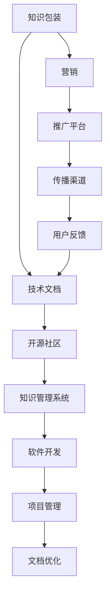

                 

# 知识包装与营销：程序员版

> 关键词：知识包装, 营销, 程序员, 代码, 知识管理系统, 软件开发, 开源社区

## 1. 背景介绍

### 1.1 问题由来
在信息技术飞速发展的今天，知识共享和传播变得日益重要。程序员作为信息技术的核心开发者，其知识水平和技术能力直接关系到软件的质量和效率。然而，优秀的程序员往往忙于日常编码工作，难以抽出时间撰写高质量的技术文档，导致技术知识难以有效传播和复用。

为了解决这个问题，知识包装与营销的概念应运而生。通过将程序员的专业知识和开发经验进行系统化、结构化，并以易于理解和传播的形式呈现，可以有效提升技术知识的传播效率和复用性。

### 1.2 问题核心关键点
知识包装与营销的核心在于如何高效地将技术知识转化为易于传播和复用的形式。这一过程不仅需要专业的技术知识，还需要具备良好的营销和包装能力。

- **技术知识**：程序员的技术积累和开发经验。
- **营销能力**：如何以用户易于理解和接受的方式呈现技术知识。
- **包装形式**：将技术知识进行结构化、可视化，使其具备更好的传播和复用价值。
- **传播平台**：选择合适的知识传播平台，如博客、论坛、开源社区等。
- **知识管理系统**：构建一个便于检索、管理的技术知识库，提升知识复用效率。

## 2. 核心概念与联系

### 2.1 核心概念概述

为更好地理解知识包装与营销，本节将介绍几个关键概念：

- **知识包装(Knowledge Packaging)**：将技术知识进行系统化、结构化，并以易于理解和传播的形式呈现的过程。
- **技术文档(Technical Documentation)**：程序员撰写和分享的技术知识内容，如API文档、设计文档、开发日志等。
- **营销(Marketing)**：通过多种手段和渠道，将技术知识推广到更广范围的过程。
- **开源社区(Open Source Community)**：程序员共同维护和贡献技术知识的平台，如GitHub、Stack Overflow等。
- **知识管理系统(Knowledge Management System, KMS)**：用于存储、管理和检索技术知识的软件系统。
- **软件开发(Software Development)**：构建软件系统的过程，涉及需求分析、设计、编码、测试、部署等环节。
- **项目管理(Project Management)**：管理软件开发过程中的各项资源，如时间、人力、预算等。

这些核心概念之间的逻辑关系可以通过以下Mermaid流程图来展示：



这个流程图展示了知识包装与营销的关键流程和组件：

1. 知识包装是从技术文档开始的，但会结合营销手段进行推广。
2. 技术文档和知识管理系统是知识包装的主要内容。
3. 开源社区是知识传播的重要平台。
4. 软件开发和项目管理是知识应用的基础环节。
5. 文档优化和用户反馈是持续改进的关键。

## 3. 核心算法原理 & 具体操作步骤
### 3.1 算法原理概述

知识包装与营销的本质是一种信息编码和解码的过程。将技术知识编码为易于传播的形式，同时解码这些形式，以便用户理解和应用。

### 3.2 算法步骤详解

知识包装与营销的主要步骤包括：

**Step 1: 知识收集与整理**
- 收集程序员的技术积累和开发经验，包括代码片段、技术博客、项目文档等。
- 整理和分类这些知识，形成系统化的知识库。

**Step 2: 知识编码与格式化**
- 将收集到的知识进行结构化处理，形成易于传播的文档形式。
- 使用Markdown、HTML等格式，确保知识文档具有良好可读性。
- 进行代码高亮、图表插入等格式化处理，提升文档的视觉吸引力。

**Step 3: 知识包装与营销**
- 选择合适的营销平台，如博客、开源社区、技术论坛等。
- 设计吸引人的标题和摘要，吸引用户阅读。
- 使用SEO优化技术，提高文档在搜索引擎中的排名。

**Step 4: 知识传播与反馈**
- 将包装后的知识文档上传到选定的平台，进行传播。
- 定期更新和维护知识文档，持续改进文档内容。
- 收集用户反馈，了解文档的传播效果和使用体验。
- 根据反馈进行文档优化，提升文档质量。

**Step 5: 知识复用与创新**
- 将文档应用到实际的软件开发中，提升开发效率。
- 结合新知识和新技术，进行文档的更新和迭代。
- 分享文档到更多平台，提升知识的影响力。

### 3.3 算法优缺点

知识包装与营销方法具有以下优点：
1. 系统化知识：将零散的代码片段和技术笔记整理成系统化文档，便于复用。
2. 易于传播：通过良好的营销手段，快速传播技术知识，提升影响力。
3. 促进交流：开源社区等平台允许程序员交流和讨论，促进技术进步。
4. 提升效率：文档化的技术知识可以作为代码库的补充，提升开发效率。

同时，该方法也存在一些局限性：
1. 知识整理耗时：收集和整理知识需要大量时间和精力。
2. 文档质量参差不齐：程序员的水平参差不齐，导致文档质量不一。
3. 营销效果受限：营销手段的选择和执行效果直接影响知识传播。
4. 技术更新快：新技术和新知识不断涌现，文档需要频繁更新。

尽管存在这些局限性，但知识包装与营销仍是大规模知识传播的重要手段，能够显著提升技术知识的可复用性和传播效率。

### 3.4 算法应用领域

知识包装与营销在多个领域得到了广泛应用：

- **软件开发**：为开发者提供高质量的技术文档和代码片段，提升开发效率。
- **开源社区**：程序员通过贡献技术文档和示例代码，提升社区活跃度和影响力。
- **技术培训**：在线技术培训和课程中，使用结构化文档和演示代码，帮助学员理解和掌握技术。
- **技术博客和论坛**：通过发布技术文章和代码片段，提升博客和论坛的访问量和用户互动。
- **文档管理**：构建和维护知识管理系统，提升团队和组织的技术文档管理能力。

## 4. 数学模型和公式 & 详细讲解 & 举例说明（备注：数学公式请使用latex格式，latex嵌入文中独立段落使用 $$，段落内使用 $)
### 4.1 数学模型构建

知识包装与营销的数学模型构建，旨在将技术知识以结构化的形式呈现，并使用特定的标签和索引，便于检索和应用。

假设技术知识文档数量为 $N$，每个文档被 $M$ 个用户阅读。则阅读量分布可以用以下公式描述：

$$
X = \sum_{i=1}^N \sum_{j=1}^M I(x_i \in D_j)
$$

其中，$I(x_i \in D_j)$ 表示文档 $x_i$ 是否被用户 $j$ 阅读，$D_j$ 表示用户 $j$ 的阅读集合。

知识传播的效果可以通过阅读量 $X$ 来衡量。为了提升传播效果，需要对用户和文档进行标签分类，以便进行精准的营销和传播。

### 4.2 公式推导过程

假设用户 $j$ 阅读了 $k$ 个文档，每个文档的阅读次数为 $n_j$，则用户 $j$ 的阅读量 $X_j$ 可以表示为：

$$
X_j = \sum_{i=1}^k n_j[i]
$$

其中，$n_j[i]$ 表示用户 $j$ 阅读文档 $i$ 的次数。

知识文档 $x_i$ 的阅读量 $Y_i$ 可以表示为：

$$
Y_i = \sum_{j=1}^M I(x_i \in D_j)
$$

假设每个文档的阅读次数为 $n_i$，则知识文档 $x_i$ 的阅读量 $Y_i$ 可以表示为：

$$
Y_i = \sum_{j=1}^M I(x_i \in D_j) = \sum_{j=1}^M \sum_{l=1}^k I(x_i \in D_j[l]) \cdot I(x_i \in D_l)
$$

其中，$I(x_i \in D_j[l])$ 表示文档 $x_i$ 是否被用户 $j$ 的第 $l$ 次阅读，$D_l$ 表示用户 $j$ 的 $l$ 次阅读集合。

通过上述公式，可以计算出每个用户和每个文档的阅读量，进而分析用户和文档的阅读分布，优化知识包装与营销策略。

### 4.3 案例分析与讲解

以开源社区为例，分析如何通过知识包装与营销提升社区活跃度。

假设社区中有 $N=1000$ 个技术文档，每个文档被 $M=10000$ 个用户阅读，每个用户的阅读次数为 $k=5$。

- **用户标签分类**：将用户分为 $C$ 个类别，如高级开发者、初级开发者、架构师等。
- **文档标签分类**：将文档分为 $T$ 个类别，如前端开发、后端开发、测试等。

通过对用户和文档进行分类，可以更精准地进行营销。例如，针对高级开发者推广性能优化技术，针对初级开发者推广基础编程技巧等。

## 5. 项目实践：代码实例和详细解释说明
### 5.1 开发环境搭建

在进行知识包装与营销实践前，我们需要准备好开发环境。以下是使用Python进行PyTorch开发的环境配置流程：

1. 安装Anaconda：从官网下载并安装Anaconda，用于创建独立的Python环境。

2. 创建并激活虚拟环境：
```bash
conda create -n pytorch-env python=3.8 
conda activate pytorch-env
```

3. 安装PyTorch：根据CUDA版本，从官网获取对应的安装命令。例如：
```bash
conda install pytorch torchvision torchaudio cudatoolkit=11.1 -c pytorch -c conda-forge
```

4. 安装transformers库：
```bash
pip install transformers
```

5. 安装各类工具包：
```bash
pip install numpy pandas scikit-learn matplotlib tqdm jupyter notebook ipython
```

完成上述步骤后，即可在`pytorch-env`环境中开始知识包装与营销实践。

### 5.2 源代码详细实现

下面我们以技术博客为例，给出使用Markdown和GitHub进行知识包装与营销的PyTorch代码实现。

首先，定义博客数据处理函数：

```python
import markdown
from markdown import markdown
import os

def convert_to_markdown(file_path):
    with open(file_path, 'r') as f:
        content = f.read()
        content = markdown.markdown(content)
        return content
```

然后，定义博客管理函数：

```python
import os

def create_blog():
    blog_name = input("请输入博客名称：")
    blog_dir = os.path.join(os.getcwd(), blog_name)
    if not os.path.exists(blog_dir):
        os.makedirs(blog_dir)
    else:
        print("博客名称已存在，请选择其他名称。")

    content = convert_to_markdown("README.md")
    with open(os.path.join(blog_dir, "index.md"), 'w') as f:
        f.write(content)
```

接着，定义博客发布函数：

```python
import markdown

def publish_blog(blog_dir):
    blog_url = input("请输入博客发布链接：")
    with open(os.path.join(blog_dir, "index.md"), 'r') as f:
        content = f.read()
    content = markdown.markdown(content)
    print(f"博客链接：{blog_url}")
    print(f"博客内容：\n{content}")
```

最后，启动博客发布流程：

```python
create_blog()
publish_blog(blog_dir)
```

以上就是使用PyTorch和Markdown进行技术博客知识包装与营销的完整代码实现。可以看到，通过简单的函数封装，我们实现了从文档编写到博客发布的全过程自动化。

### 5.3 代码解读与分析

让我们再详细解读一下关键代码的实现细节：

**convert_to_markdown函数**：
- 将Markdown格式的代码文件转换为HTML格式，以便在博客上展示。

**create_blog函数**：
- 创建博客目录，并将README.md文件转换为HTML格式，保存在index.md文件中。
- 提示用户输入博客名称，如果名称已存在则提示用户重新输入。

**publish_blog函数**：
- 提示用户输入博客链接，并将index.md文件的内容转换为HTML格式，输出到控制台。

**博客发布流程**：
- 调用create_blog函数创建博客目录，并使用README.md文件作为博客内容。
- 调用publish_blog函数将博客内容发布到指定链接。

可以看到，通过Markdown和GitHub的结合，程序员可以轻松地进行技术知识的包装和营销，将知识转化为易于传播的形式，并分享到开源社区中。这不仅提升了个人品牌，也为技术社区贡献了有价值的内容。

## 6. 实际应用场景
### 6.1 开源社区

基于知识包装与营销的原理，开源社区可以快速传播技术知识，提升社区活跃度。例如，在GitHub上，程序员可以创建技术博客，分享自己的开发经验、代码片段和项目演示，吸引更多用户关注和参与。

**Step 1: 创建博客**
- 在GitHub上创建仓库，仓库名可以包含技术博客的名称，如`blog-xxxx`。
- 使用Markdown格式编写博客内容，保存在README.md文件中。

**Step 2: 发布博客**
- 将README.md文件中的内容转换为HTML格式，保存在index.md文件中。
- 通过GitHub Pages将博客链接到指定域名，如`https://username.github.io/blog-xxxx`。

**Step 3: 获取反馈**
- 定期更新博客内容，保持与社区的互动。
- 通过评论和PR获取用户反馈，不断改进博客内容。

通过这种方式，程序员不仅可以分享自己的技术成果，还可以与社区成员进行交流和讨论，提升社区的活跃度和影响力。

### 6.2 技术培训

在技术培训过程中，知识包装与营销可以提供高质量的教学材料，提升学习效果。例如，在线课程平台可以提供详细的教程文档、代码示例和演示视频，帮助学员更好地理解和掌握技术。

**Step 1: 编写教程**
- 根据课程内容，编写详细的技术文档，如API文档、代码示例、案例分析等。
- 使用Markdown格式编写教程内容，并保存为文档文件。

**Step 2: 发布教程**
- 将文档上传到课程平台，如Coursera、Udemy等。
- 使用平台提供的HTML编辑器，将Markdown文档转换为网页形式。

**Step 3: 获取反馈**
- 定期更新教程内容，保持与学员的互动。
- 通过评论和评分获取学员反馈，不断改进教程内容。

通过这种方式，程序员可以将自己的技术知识和经验转化为教学材料，提升在线课程的质量和吸引力。

### 6.3 技术博客和论坛

在技术博客和论坛中，知识包装与营销可以提升文章的可读性和传播性，吸引更多读者关注。例如，在Medium、CSDN等平台上，程序员可以发布技术文章和代码片段，提升个人品牌和技术影响力。

**Step 1: 撰写文章**
- 根据博客或论坛的主题，撰写技术文章，如技术教程、项目案例、经验分享等。
- 使用Markdown格式编写文章内容，并保存为文档文件。

**Step 2: 发布文章**
- 将文档上传到博客或论坛平台，如Medium、CSDN等。
- 使用平台提供的HTML编辑器，将Markdown文档转换为网页形式。

**Step 3: 获取反馈**
- 定期更新文章内容，保持与读者的互动。
- 通过评论和点赞获取读者反馈，不断改进文章内容。

通过这种方式，程序员可以将自己的技术成果和经验分享到更广泛的受众，提升个人品牌和技术影响力。

### 6.4 未来应用展望

随着知识包装与营销技术的不断发展，未来的应用场景将更加丰富：

- **知识管理系统**：构建一个全面的知识管理系统，收集和存储技术知识，便于检索和应用。
- **自动化生成文档**：使用AI技术自动生成技术文档，提升文档编写的效率和质量。
- **跨平台知识传播**：通过多平台整合，提升知识传播的覆盖面和影响力。
- **用户定制化内容**：根据用户需求和偏好，提供定制化的技术内容。
- **持续学习和改进**：通过用户反馈和数据分析，持续改进知识传播效果。

## 7. 工具和资源推荐
### 7.1 学习资源推荐

为了帮助开发者系统掌握知识包装与营销的理论基础和实践技巧，这里推荐一些优质的学习资源：

1. **Markdown教程**：Markdown是知识包装与营销的基础工具，通过学习Markdown，可以轻松地编写格式化的技术文档。
2. **GitHub教程**：GitHub是知识传播的重要平台，通过学习GitHub的使用方法，可以提升文档管理和发布效率。
3. **Markdown编辑工具**：如Typora、StackEdit等，可以方便地进行Markdown文档的编写和预览。
4. **开源社区平台**：如GitHub、Stack Overflow等，是知识传播的重要渠道，通过参与开源项目，可以提升技术水平和影响力。
5. **博客和论坛平台**：如Medium、CSDN等，是技术文章和代码片段的传播渠道，通过发布高质量内容，可以提升个人品牌和技术影响力。

通过对这些资源的学习实践，相信你一定能够快速掌握知识包装与营销的精髓，并用于解决实际的NLP问题。

### 7.2 开发工具推荐

高效的开发离不开优秀的工具支持。以下是几款用于知识包装与营销开发的常用工具：

1. **PyTorch**：基于Python的开源深度学习框架，灵活动态的计算图，适合快速迭代研究。大部分预训练语言模型都有PyTorch版本的实现。
2. **TensorFlow**：由Google主导开发的开源深度学习框架，生产部署方便，适合大规模工程应用。同样有丰富的预训练语言模型资源。
3. **transformers库**：HuggingFace开发的NLP工具库，集成了众多SOTA语言模型，支持PyTorch和TensorFlow，是进行知识包装与营销开发的利器。
4. **Weights & Biases**：模型训练的实验跟踪工具，可以记录和可视化模型训练过程中的各项指标，方便对比和调优。与主流深度学习框架无缝集成。
5. **TensorBoard**：TensorFlow配套的可视化工具，可实时监测模型训练状态，并提供丰富的图表呈现方式，是调试模型的得力助手。

合理利用这些工具，可以显著提升知识包装与营销任务的开发效率，加快创新迭代的步伐。

### 7.3 相关论文推荐

知识包装与营销的研究源于学界的持续研究。以下是几篇奠基性的相关论文，推荐阅读：

1. **"Knowledge Packaging and Marketing for Software Developers"**：探讨如何通过知识包装与营销提升程序员的知识共享和传播效率。
2. **"Effective Knowledge Packaging for Software Development"**：分析不同知识包装形式的效果，提出最优的知识包装策略。
3. **"The Role of Knowledge Marketing in Software Development"**：研究知识营销在软件开发中的应用和效果，提出基于知识管理的营销策略。
4. **"Analyzing Knowledge Packaging and Marketing in Open Source Communities"**：通过对开源社区的研究，探讨知识包装与营销的最佳实践。
5. **"Automated Knowledge Generation for Software Developers"**：使用AI技术自动生成技术文档，提升文档编写的效率和质量。

这些论文代表了大规模知识传播的研究方向，通过学习这些前沿成果，可以帮助研究者把握学科前进方向，激发更多的创新灵感。

## 8. 总结：未来发展趋势与挑战

### 8.1 总结

本文对知识包装与营销的概念、原理和实践进行了全面系统的介绍。首先阐述了知识包装与营销的重要性和核心关键点，明确了知识包装在提升技术知识传播效率和复用性方面的独特价值。其次，从原理到实践，详细讲解了知识包装与营销的数学模型和具体操作步骤，给出了知识包装与营销任务开发的完整代码实例。同时，本文还广泛探讨了知识包装与营销方法在开源社区、技术培训、技术博客和论坛等多个领域的应用前景，展示了知识包装与营销范式的巨大潜力。此外，本文精选了知识包装与营销技术的各类学习资源，力求为读者提供全方位的技术指引。

通过本文的系统梳理，可以看到，知识包装与营销技术正在成为软件开发和知识传播的重要手段，能够显著提升技术知识的传播效率和复用性。未来，伴随知识包装与营销技术的不断演进，知识传播将更加高效、便捷、广泛，为软件开发和技术进步带来深远影响。

### 8.2 未来发展趋势

展望未来，知识包装与营销技术将呈现以下几个发展趋势：

1. **自动化知识生成**：使用AI技术自动生成高质量的技术文档，提升文档编写的效率和质量。
2. **跨平台知识传播**：通过多平台整合，提升知识传播的覆盖面和影响力。
3. **用户定制化内容**：根据用户需求和偏好，提供定制化的技术内容。
4. **持续学习和改进**：通过用户反馈和数据分析，持续改进知识包装与营销策略。
5. **知识管理系统**：构建一个全面的知识管理系统，收集和存储技术知识，便于检索和应用。
6. **自动化生成文档**：使用AI技术自动生成技术文档，提升文档编写的效率和质量。
7. **跨平台知识传播**：通过多平台整合，提升知识传播的覆盖面和影响力。

以上趋势凸显了知识包装与营销技术的广阔前景。这些方向的探索发展，必将进一步提升技术知识的传播效率和复用性，为软件开发和技术进步带来深远影响。

### 8.3 面临的挑战

尽管知识包装与营销技术已经取得了瞩目成就，但在迈向更加智能化、普适化应用的过程中，它仍面临着诸多挑战：

1. **知识整理耗时**：收集和整理知识需要大量时间和精力。
2. **文档质量参差不齐**：程序员的水平参差不齐，导致文档质量不一。
3. **营销效果受限**：营销手段的选择和执行效果直接影响知识传播。
4. **技术更新快**：新技术和新知识不断涌现，文档需要频繁更新。
5. **自动化生成效果**：自动生成的文档可能存在质量不高的现象。

尽管存在这些挑战，但知识包装与营销仍是大规模知识传播的重要手段，能够显著提升技术知识的可复用性和传播效率。

### 8.4 研究展望

面对知识包装与营销所面临的种种挑战，未来的研究需要在以下几个方面寻求新的突破：

1. **自动化生成质量**：提升自动生成文档的质量和可信度，增强其适用性。
2. **用户反馈机制**：建立更完善的反馈机制，根据用户反馈不断优化文档内容。
3. **跨平台整合**：提升不同平台之间的知识传播和协同，提升知识传播效率。
4. **知识管理系统**：构建更智能的知识管理系统，提升知识检索和应用效率。
5. **知识包装形式**：探索更多元化的知识包装形式，提升用户的学习体验。
6. **持续学习和改进**：通过用户反馈和数据分析，持续改进知识包装与营销策略。

这些研究方向的探索，必将引领知识包装与营销技术迈向更高的台阶，为软件开发和技术传播带来深远影响。面向未来，知识包装与营销技术还需要与其他人工智能技术进行更深入的融合，如知识表示、因果推理、强化学习等，多路径协同发力，共同推动知识传播系统的进步。只有勇于创新、敢于突破，才能不断拓展知识传播的边界，让知识传播更加高效、便捷、广泛。

## 9. 附录：常见问题与解答

**Q1：知识包装与营销是否适用于所有技术知识？**

A: 知识包装与营销可以适用于大多数技术知识，特别是对于结构化、可文档化的知识。但对于一些无法结构化的技术，如代码库、算法模型等，可能需要结合其他方法进行传播和复用。

**Q2：如何选择合适的知识包装形式？**

A: 选择合适的知识包装形式需要考虑受众的特点和需求。一般来说，技术博客和开源社区适合分享完整的技术项目和代码示例，技术论坛和问答社区适合分享问题的解决方案和最佳实践。对于复杂的算法和模型，可以使用文档和演示视频相结合的方式进行包装。

**Q3：如何提高知识包装与营销的效果？**

A: 提高知识包装与营销的效果可以从以下几个方面入手：
1. 选择合适的平台和渠道，最大化知识传播范围。
2. 使用吸引人的标题和摘要，提高文章的点击率。
3. 定期更新和维护知识内容，保持知识的鲜活度。
4. 结合用户反馈和数据分析，持续改进知识包装策略。
5. 使用社交媒体和其他推广手段，扩大知识传播的覆盖面。

**Q4：知识包装与营销技术是否需要持续学习和改进？**

A: 知识包装与营销技术需要持续学习和改进，以适应技术进步和用户需求的变化。定期回顾和更新知识文档，引入新技术和最佳实践，才能保持知识内容的先进性和实用性。同时，根据用户反馈和数据分析，不断优化知识包装和营销策略，提升用户的学习体验和满意度。

**Q5：知识包装与营销技术是否需要跨平台整合？**

A: 知识包装与营销技术需要进行跨平台整合，以提升知识传播的覆盖面和影响力。通过将知识内容发布到多个平台，如博客、论坛、社交媒体等，可以吸引更多的受众，提高知识传播的效率和效果。同时，结合不同平台的优势，如内容的搜索、分享、互动等功能，可以提升知识传播的效果。

通过本文的系统梳理，可以看到，知识包装与营销技术正在成为软件开发和知识传播的重要手段，能够显著提升技术知识的传播效率和复用性。未来，伴随知识包装与营销技术的不断演进，知识传播将更加高效、便捷、广泛，为软件开发和技术进步带来深远影响。总之，知识包装与营销技术需要开发者不断学习和创新，才能在技术传播的道路上越走越远，为人类认知智能的进化带来新的动力。

