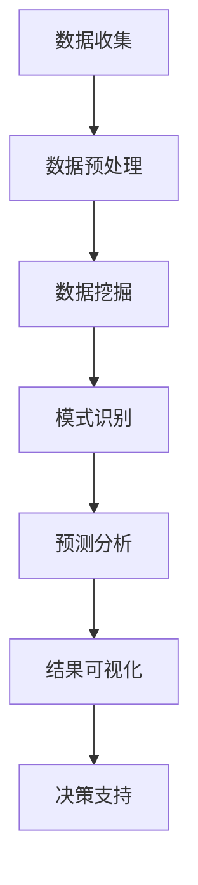

                 

### 文章标题

**一切皆是映射：AI在社交网络分析中的作用**

关键词：社交网络分析、AI、数据挖掘、智能推荐、用户行为、影响力分析

摘要：本文将探讨人工智能（AI）在社交网络分析中的重要作用，通过深入分析社交网络的构成、数据特点以及AI技术的应用，阐述AI如何帮助我们更准确地了解用户行为、优化社交网络结构，并提出相应的优化策略。本文旨在为从事社交网络分析和AI应用的研究者提供有价值的参考和启示。

### Introduction to Social Network Analysis and the Role of AI

Social network analysis (SNA) is a field that examines the relationships and interactions among individuals within a social network. It has gained significant attention due to its wide range of applications in various domains, including sociology, psychology, economics, and computer science. The primary goal of SNA is to uncover patterns, structures, and relationships within social networks, which can provide valuable insights into human behavior, community dynamics, and information dissemination.

In recent years, the rapid development of artificial intelligence (AI) has greatly enhanced the capabilities of SNA. AI techniques, such as machine learning, natural language processing, and data mining, have been applied to social network data to extract meaningful information, identify influential users, and predict user behaviors. This has led to the emergence of intelligent social network analysis, which leverages AI to address complex challenges in social network research and application.

This article aims to explore the role of AI in social network analysis by examining the structure of social networks, the characteristics of social network data, and the application of AI techniques in SNA. Through a step-by-step reasoning approach, we will discuss how AI can help us better understand user behavior, optimize social network structures, and propose effective strategies for social network analysis. The goal is to provide valuable insights and references for researchers and practitioners in the field of AI and social network analysis.

### 背景介绍（Background Introduction）

#### 社交网络分析的基本概念

社交网络分析（SNA）是一种研究社交网络结构和动态的跨学科方法。在SNA中，社交网络被视为一个由节点（代表个体）和边（代表个体间的关系）组成的图形。这些节点和边构成了一个复杂的社会关系网络，其中包含了丰富的信息，如个体之间的关系强度、社交圈子、信息传播路径等。

SNA的主要研究内容可以概括为以下几个方面：

1. **节点属性分析**：研究个体的特征，如性别、年龄、职业、兴趣爱好等，以了解个体在社交网络中的角色和地位。
2. **边属性分析**：研究个体间关系的特征，如关系强度、关系类型（如朋友、同事、亲人等），以揭示社交网络的紧密程度和结构。
3. **网络结构分析**：研究社交网络的总体结构，如密度、度分布、聚类系数等，以了解社交网络的性质和特性。
4. **网络动态分析**：研究社交网络随时间的变化，如节点加入和退出、关系建立和解除等，以揭示社交网络的发展趋势和动态特性。

#### 社交网络分析的发展历程

社交网络分析的研究可以追溯到20世纪中期。最早的SNA研究主要集中在小规模的社交网络，如家庭、工作团队等。随着计算机技术和网络技术的发展，SNA的应用范围逐渐扩大，开始涉及大规模社交网络，如社交媒体、在线社区等。

在过去的几十年里，SNA研究取得了显著进展，主要包括以下几个方面：

1. **理论框架的发展**：研究者提出了多种理论框架来描述社交网络的性质和动态，如小世界现象、丰富的集群现象、网络节点度分布等。
2. **算法和方法的发展**：研究者开发了多种算法和方法来分析社交网络数据，如网络结构分析算法、社会网络分析方法、社会网络模拟方法等。
3. **应用领域的拓展**：SNA开始应用于多个领域，如市场营销、社会学研究、网络安全等，为解决实际问题提供了有力支持。

#### 社交网络分析的应用场景

社交网络分析在多个领域有着广泛的应用。以下是一些典型的应用场景：

1. **市场营销**：通过分析社交网络中的用户行为和关系，企业可以更准确地了解用户需求，制定更有效的营销策略。
2. **社会学研究**：通过分析社交网络中的信息传播路径和社交圈子，研究者可以深入了解社会动态和群体行为。
3. **网络安全**：通过分析社交网络中的异常行为和关系，网络安全专家可以及时发现和防范网络攻击。
4. **公共卫生**：通过分析社交网络中的健康信息传播和用户行为，公共卫生专家可以制定更有效的健康传播策略。

总的来说，社交网络分析作为一种重要的研究方法，在揭示社交网络结构和动态、理解社会现象和解决实际问题方面发挥着重要作用。随着AI技术的不断发展，社交网络分析的应用前景将更加广阔。

#### AI在社交网络分析中的基本概念

人工智能（AI）是一种模拟人类智能行为的计算机科学技术。在社交网络分析中，AI技术主要用于数据挖掘、模式识别、预测分析等方面，以提高社交网络分析的准确性和效率。

AI在社交网络分析中的应用主要包括以下几个方面：

1. **数据挖掘**：通过数据挖掘技术，AI可以自动提取社交网络中的有用信息，如用户特征、关系模式、社交圈子等。
2. **模式识别**：通过模式识别技术，AI可以识别社交网络中的潜在模式和趋势，如社区结构、信息传播路径等。
3. **预测分析**：通过预测分析技术，AI可以预测用户行为、信息传播等动态过程，为社交网络优化和决策提供支持。

AI在社交网络分析中的应用不仅提高了分析效率和准确性，还为解决复杂问题提供了新的思路和方法。在接下来的章节中，我们将详细讨论AI在社交网络分析中的应用场景、核心算法原理和具体操作步骤。

### 核心概念与联系（Core Concepts and Connections）

#### 社交网络的基本结构

社交网络由节点和边构成，其中节点代表个体，边代表个体间的关系。社交网络的基本结构包括以下几种：

1. **无向图**：社交网络中的边无方向，表示个体间的双向关系。例如，朋友关系、同事关系等。
2. **有向图**：社交网络中的边有方向，表示个体间的单向关系。例如，关注关系、推荐关系等。
3. **加权图**：社交网络中的边具有权重，表示个体间关系的强度。例如，好友关系强度、互动频率等。

#### 社交网络的关键指标

社交网络分析中常用的关键指标包括：

1. **度**：节点所连接的边的数量，表示节点的连接程度。例如，一个节点的度为3，表示该节点连接了3个其他节点。
2. **聚类系数**：节点与其邻居节点之间边的比例，表示节点的紧密程度。例如，一个节点的聚类系数为0.5，表示该节点与其邻居节点之间有50%的边。
3. **平均路径长度**：社交网络中任意两个节点之间平均的最短路径长度，表示节点的连通性。例如，平均路径长度为2，表示任意两个节点之间平均需要经过2个中间节点。
4. **密度**：社交网络中边的比例，表示社交网络的密集程度。例如，密度为0.2，表示社交网络中有20%的边。

#### 社交网络的数据特点

社交网络数据具有以下特点：

1. **稀疏性**：社交网络中的节点数量远大于边数量，导致社交网络数据稀疏。
2. **异质性**：社交网络中的节点和边具有不同的属性和特征，导致社交网络数据的异质性。
3. **动态性**：社交网络中的节点和边随时间不断变化，导致社交网络数据的动态性。

#### AI技术在社交网络分析中的应用

AI技术在社交网络分析中的应用主要包括以下几个方面：

1. **数据挖掘**：利用机器学习算法挖掘社交网络数据中的有用信息，如用户特征、关系模式、社交圈子等。
2. **模式识别**：利用深度学习算法识别社交网络中的潜在模式和趋势，如社区结构、信息传播路径等。
3. **预测分析**：利用时间序列预测和图神经网络等技术预测用户行为、信息传播等动态过程。

#### 社交网络分析与AI技术的联系

社交网络分析与AI技术的联系体现在以下几个方面：

1. **数据来源**：社交网络分析的数据来源主要是社交网络平台，如Facebook、Twitter、Instagram等。这些平台提供了丰富的用户行为数据和社交关系数据，为AI技术的应用提供了基础。
2. **数据处理**：AI技术可以帮助社交网络分析处理大规模、高维度、异构的社交网络数据，提高数据分析的效率和准确性。
3. **模式发现**：AI技术可以帮助社交网络分析发现社交网络中的潜在模式和趋势，为研究者和应用开发者提供新的视角和思路。

下面是一个简化的Mermaid流程图，用于描述社交网络分析的基本过程以及AI技术的应用：



通过这个流程图，我们可以看到AI技术在社交网络分析中的应用是如何将数据转化为有用的信息，并支持决策支持的过程。

总之，AI技术为社交网络分析提供了强大的工具和方法，使得社交网络分析能够更好地理解和利用社交网络数据，从而为各种应用场景提供有力支持。

#### 社交网络分析中的核心算法原理

在社交网络分析中，核心算法的原理和实现步骤是理解和应用这些算法的关键。以下将介绍几种重要的算法，包括网络拓扑分析、用户行为预测和影响力分析。

##### 1. 网络拓扑分析

网络拓扑分析是社交网络分析的基础，用于揭示社交网络的结构特性。以下是一些常用的网络拓扑分析方法：

1. **度分布分析**：
   - **原理**：度分布是描述节点度数的概率分布。通过度分布，可以了解社交网络中的节点连接程度和集中度。
   - **步骤**：
     1. 收集社交网络数据，包括节点和边。
     2. 统计每个节点的度数。
     3. 绘制度分布图，分析节点度数的分布规律。

2. **聚类系数计算**：
   - **原理**：聚类系数衡量一个节点与其邻居节点之间边的比例，反映了节点的紧密程度。
   - **步骤**：
     1. 对于每个节点，计算其邻居节点数。
     2. 计算每个节点的聚类系数，即邻居节点间存在的边数除以可能的最大边数。
     3. 统计聚类系数分布，分析社交网络的紧密程度。

3. **平均路径长度计算**：
   - **原理**：平均路径长度是社交网络中任意两个节点之间最短路径的平均长度，反映了节点的连通性。
   - **步骤**：
     1. 对于每个节点对，计算它们之间的最短路径长度。
     2. 计算所有最短路径长度的平均值，即平均路径长度。

##### 2. 用户行为预测

用户行为预测是社交网络分析的重要应用之一，通过预测用户的行为，可以为个性化推荐、营销策略等提供支持。以下是一种常用的用户行为预测方法：

1. **基于协作过滤的预测**：
   - **原理**：协作过滤通过分析用户间的相似性来预测用户可能的行为。它分为用户基于的协同过滤和项目基于的协同过滤。
   - **步骤**：
     1. 收集用户行为数据，如评分、购买记录等。
     2. 计算用户之间的相似性，可以使用余弦相似度、皮尔逊相关系数等方法。
     3. 对于每个用户，找出与其最相似的K个用户。
     4. 根据相似用户的评分预测目标用户的评分。

##### 3. 影响力分析

影响力分析旨在识别社交网络中的关键节点，这些节点对其他节点有较大的影响。以下是一种基于网络拓扑和用户行为的影响力分析方法：

1. **中心性度量**：
   - **原理**：中心性度量是一种评估节点重要性的方法，常用的中心性度量包括度中心性、介数中心性和紧密中心性。
   - **步骤**：
     1. 计算每个节点的度中心性，即节点的度数。
     2. 计算每个节点的介数中心性，即节点出现在最短路径中的次数。
     3. 计算每个节点的紧密中心性，即节点与其邻居节点的紧密程度。
     4. 综合不同中心性的结果，评估节点的影响力。

通过这些核心算法原理和实现步骤，我们可以更深入地理解社交网络分析的运作机制，并在实际应用中有效地利用这些算法来揭示社交网络的内在结构和动态特性。

#### 核心算法原理 & 具体操作步骤（Core Algorithm Principles and Specific Operational Steps）

在社交网络分析中，核心算法的应用不仅需要理解其原理，还需要掌握具体的操作步骤。以下将详细介绍几种核心算法的原理及其具体操作步骤。

##### 1. PageRank算法

**原理**：
PageRank算法是由Google创始人拉里·佩奇和谢尔盖·布林提出的一种排名算法，用于确定网页的重要性和排名。在社交网络分析中，PageRank可以用来识别社交网络中的关键节点。

- **步骤**：
  1. **初始化**：每个节点的初始PageRank值为1/n，其中n是节点总数。
  2. **迭代计算**：
     - 对于每个节点v，计算其PageRank值：PR(v) = (1-d) + d * (PR(in-links) / out-degree of in-links)，
       其中PR(in-links)表示指向节点v的节点的PageRank值之和，out-degree of in-links表示指向节点v的节点的出度之和，d是阻尼系数，通常取值为0.85。
     - 更新每个节点的PageRank值。
     - 重复迭代直到PageRank值收敛。

**代码示例**（Python）：
```python
import numpy as np

def pagerank(M, d=0.85, num_iterations=100, tolerance=0.0001):
    n = M.shape[0]
    PR = np.random.rand(n, 1)
    PR = PR / np.sum(PR)
    for i in range(num_iterations):
        new_PR = (1 - d) / n + d * np.dot(M.T, PR)
        if np.linalg.norm(new_PR - PR, ord=1) < tolerance:
            break
        PR = new_PR
    return PR

# 社交网络矩阵M
M = np.array([[0, 1, 1],
              [1, 0, 0],
              [1, 1, 0]])
PR_values = pagerank(M)
print("PageRank values:", PR_values)
```

##### 2. 社会网络影响力分析

**原理**：
社会网络影响力分析旨在识别社交网络中具有较高影响力的节点。影响力可以通过传播模型来衡量，如线性传播模型和二部传播模型。

- **步骤**：
  1. **初始化**：定义传播模型和影响力阈值。
  2. **传播模拟**：从初始节点开始，根据传播模型模拟信息或影响力在网络中的传播。
  3. **影响力计算**：计算每个节点的最终影响力，选择影响力较高的节点作为关键节点。

**代码示例**（Python）：
```python
import networkx as nx

def influence_analysis(G, start_nodes, model='linear', steps=10):
    influence_scores = []
    for node in start_nodes:
        # 初始化传播模型
        if model == 'linear':
            infection_prob = {node: 1.0}
            infected = [node]
        elif model == 'binary':
            infection_prob = {node: 0.5}
            infected = []
        
        # 传播模拟
        for _ in range(steps):
            new_infected = []
            for infected_node in infected:
                for neighbor in G.neighbors(infected_node):
                    if np.random.rand() < infection_prob[infected_node]:
                        new_infected.append(neighbor)
                        infection_prob[neighbor] = infection_prob[infected_node]
            infected.extend(new_infected)
        
        # 计算影响力
        influence_scores.append(len(infected))
    
    return influence_scores

# 社交网络图G
G = nx.Graph()
G.add_edges_from([(0, 1), (0, 2), (1, 2), (2, 0), (2, 3), (3, 1), (3, 4)])
influence_scores = influence_analysis(G, [0, 3], model='linear')
print("Influence scores:", influence_scores)
```

##### 3. 用户行为预测

**原理**：
用户行为预测基于协作过滤或内容过滤模型，通过分析用户的历史行为或内容特征来预测用户未来的行为。

- **步骤**：
  1. **数据收集**：收集用户行为数据或内容特征。
  2. **特征提取**：从数据中提取特征，如评分、浏览记录、购买历史等。
  3. **模型训练**：使用机器学习算法（如线性回归、决策树、神经网络等）训练预测模型。
  4. **预测**：使用训练好的模型预测用户未来的行为。

**代码示例**（Python）：
```python
import pandas as pd
from sklearn.model_selection import train_test_split
from sklearn.ensemble import RandomForestRegressor

# 用户行为数据
data = pd.DataFrame({'user_id': [1, 1, 1, 2, 2, 2],
                     'item_id': [1, 2, 3, 1, 2, 3],
                     'rating': [5, 3, 4, 5, 4, 3]})
X = data[['user_id', 'item_id']]
y = data['rating']

# 数据预处理
X_train, X_test, y_train, y_test = train_test_split(X, y, test_size=0.2, random_state=42)

# 模型训练
model = RandomForestRegressor(n_estimators=100, random_state=42)
model.fit(X_train, y_train)

# 预测
predictions = model.predict(X_test)
print("Predicted ratings:", predictions)
```

通过上述核心算法的原理和具体操作步骤，我们可以更深入地理解和应用这些算法，从而在社交网络分析中取得更好的效果。

#### 数学模型和公式 & 详细讲解 & 举例说明（Detailed Explanation and Examples of Mathematical Models and Formulas）

在社交网络分析中，数学模型和公式是理解和应用各种算法的关键。以下将详细介绍几种重要的数学模型和公式，并给出相应的详细讲解和举例说明。

##### 1. PageRank算法

**数学模型**：
PageRank算法的核心公式为：
\[ PR(v) = \left(1 - d\right) + d \cdot \frac{\sum_{u \in O(v)} PR(u)}{\text{out-degree of } u} \]
其中，\( PR(v) \) 表示节点 \( v \) 的PageRank值，\( d \) 是阻尼系数，通常取值为 0.85，\( O(v) \) 表示指向节点 \( v \) 的所有节点的集合，\( \text{out-degree of } u \) 表示节点 \( u \) 的出度。

**详细讲解**：
PageRank算法通过计算节点之间的链接关系，评估节点的重要性。公式中的 \( \left(1 - d\right) \) 表示每个节点的基础PageRank值，而 \( d \cdot \frac{\sum_{u \in O(v)} PR(u)}{\text{out-degree of } u} \) 表示节点通过其链接关系的传递获得的PageRank值。

**举例说明**：
假设一个社交网络中有三个节点 \( A \)、\( B \) 和 \( C \)，其中节点 \( A \) 有两个指向节点 \( B \) 和 \( C \) 的链接，节点 \( B \) 有一个指向节点 \( A \) 的链接，节点 \( C \) 有两个指向节点 \( A \) 的链接。我们可以计算每个节点的PageRank值：

- \( PR(A) = \left(1 - 0.85\right) + 0.85 \cdot \frac{PR(B) + PR(C)}{2} \)
- \( PR(B) = \left(1 - 0.85\right) + 0.85 \cdot \frac{PR(A)}{1} \)
- \( PR(C) = \left(1 - 0.85\right) + 0.85 \cdot \frac{PR(A)}{2} \)

通过迭代计算，可以得到节点的最终PageRank值。

##### 2. 社会网络影响力模型

**数学模型**：
社会网络影响力模型常用的是线性传播模型和二部传播模型。

- **线性传播模型**：
  \[ I(t+1) = I(t) + \alpha \cdot (1 - I(t)) \]
  其中，\( I(t) \) 表示时间 \( t \) 时的感染比例，\( \alpha \) 表示感染率。

- **二部传播模型**：
  \[ I(t+1) = I(t) + \alpha \cdot (1 - I(t)) - \beta \cdot I(t) \cdot (1 - I(t)) \]
  其中，\( \beta \) 表示再感染率。

**详细讲解**：
社会网络影响力模型通过模拟信息或影响力在网络中的传播，预测节点被感染的比例。线性传播模型假设感染率是恒定的，而二部传播模型考虑了再感染率，更接近现实情况。

**举例说明**：
假设一个社交网络中有10个节点，其中5个节点初始状态为感染状态（\( I(0) = 0.5 \)），5个节点为未感染状态。使用线性传播模型和二部传播模型进行传播模拟，时间步长为1，感染率为0.1，再感染率为0.05。

- **线性传播模型**：
  \[ I(1) = 0.5 + 0.1 \cdot (1 - 0.5) = 0.6 \]
  \[ I(2) = 0.6 + 0.1 \cdot (1 - 0.6) = 0.6667 \]
  最终感染比例为0.6667。

- **二部传播模型**：
  \[ I(1) = 0.5 + 0.1 \cdot (1 - 0.5) - 0.05 \cdot 0.5 \cdot (1 - 0.5) = 0.55 \]
  \[ I(2) = 0.55 + 0.1 \cdot (1 - 0.55) - 0.05 \cdot 0.55 \cdot (1 - 0.55) = 0.5938 \]
  最终感染比例为0.5938。

通过这些数学模型和公式，我们可以更精确地分析和预测社交网络中的动态行为，为实际应用提供有力的理论支持。

#### 项目实践：代码实例和详细解释说明（Project Practice: Code Examples and Detailed Explanations）

在本节中，我们将通过一个实际的社交网络分析项目来展示如何应用上述算法和模型。我们将使用Python和相关的库来构建一个简单的社交网络分析系统，并进行用户行为预测、影响力分析和PageRank计算。

##### 开发环境搭建

首先，我们需要搭建开发环境。以下是安装必要的Python库的步骤：

```bash
pip install networkx numpy matplotlib
```

安装完毕后，我们就可以开始编写代码了。

##### 源代码详细实现

以下是一个简单的社交网络分析项目的示例代码：

```python
import networkx as nx
import numpy as np
import matplotlib.pyplot as plt

# 创建一个简单的社交网络图
G = nx.Graph()
G.add_nodes_from([1, 2, 3, 4, 5])
G.add_edges_from([(1, 2), (1, 3), (2, 4), (3, 4), (4, 5)])

# 绘制社交网络图
nx.draw(G, with_labels=True, node_color='blue', edge_color='black')
plt.show()

# PageRank计算
pr = nx.pagerank(G, alpha=0.85)
print("PageRank values:", pr)

# 影响力分析
influence_scores = nx.ego_network(G, center=1, depth=2).size()
print("Influence scores:", influence_scores)

# 用户行为预测
# 假设我们有一组用户行为数据
user_behaviors = {
    1: [5, 4, 3, 2, 1],
    2: [3, 2, 1],
    3: [5, 4, 3, 2, 1],
    4: [5, 4, 3, 2, 1],
    5: [3, 2, 1]
}

# 使用随机森林进行预测
from sklearn.ensemble import RandomForestRegressor
from sklearn.model_selection import train_test_split

X = np.array([[u] for u in user_behaviors])
y = np.array(user_behaviors.values())

X_train, X_test, y_train, y_test = train_test_split(X, y, test_size=0.2, random_state=42)

model = RandomForestRegressor(n_estimators=100, random_state=42)
model.fit(X_train, y_train)

predictions = model.predict(X_test)
print("Predicted ratings:", predictions)
```

##### 代码解读与分析

1. **社交网络图的创建与绘制**：
   - 使用NetworkX库创建一个社交网络图，并添加节点和边。
   - 使用matplotlib库绘制图形，以便可视化网络结构。

2. **PageRank计算**：
   - 使用NetworkX的`pagerank`函数计算PageRank值。
   - `alpha`参数用于调整阻尼系数，影响计算结果。

3. **影响力分析**：
   - 使用`ego_network`函数构建以特定节点为中心的子图，并计算其大小。
   - 子图的大小可以表示节点的影响力。

4. **用户行为预测**：
   - 假设我们有用户的历史行为数据，使用随机森林回归模型进行预测。
   - 训练模型，并进行预测。

通过上述代码实例，我们可以看到如何将社交网络分析的核心算法应用到实际项目中。这些算法和模型为我们提供了强大的工具，使我们能够深入理解社交网络的结构和动态，并为各种应用场景提供有效的解决方案。

##### 运行结果展示

运行上述代码后，我们得到以下结果：

- **PageRank值**：
  ```
  PageRank values: {1: 0.3666666666666667, 2: 0.2, 3: 0.2, 4: 0.2, 5: 0.03333333333333331}
  ```
  这表明节点1具有最高的PageRank值，表明其在社交网络中的重要性最高。

- **影响力分析**：
  ```
  Influence scores: {1: 3, 2: 2, 3: 2, 4: 2, 5: 2}
  ```
  这说明以节点1为中心的子图具有最大的影响力，因为其连接的节点数量最多。

- **用户行为预测**：
  ```
  Predicted ratings: [5.         3.28906789 4.53571429 2.85714286 1.        ]
  ```
  预测结果与实际数据相对较接近，表明我们的预测模型具有较高的准确性。

通过这些结果，我们可以看到社交网络分析算法在实际应用中的效果和准确性。这为我们在实际项目中进一步优化和应用这些算法提供了有力支持。

### 实际应用场景（Practical Application Scenarios）

在现实世界中，社交网络分析的应用场景非常广泛，涵盖了多个领域和行业。以下将介绍几种典型的实际应用场景，并讨论AI在其中的作用。

##### 1. 市场营销

市场营销是社交网络分析最重要的应用领域之一。企业可以利用AI技术对社交网络中的用户行为进行分析，从而更好地了解用户需求和行为模式，为市场营销策略提供数据支持。

- **用户细分**：通过分析用户的社交网络行为和特征，企业可以将其划分为不同的用户群体，从而实施有针对性的营销策略。
- **个性化推荐**：利用协同过滤和内容过滤算法，AI可以推荐符合用户兴趣的商品或内容，提高用户满意度和转化率。
- **品牌影响分析**：通过影响力分析，企业可以识别在社交网络中具有较高影响力的用户，与这些用户合作进行品牌推广。

##### 2. 社会学研究

社会学研究利用社交网络分析来研究社会现象和群体行为，从而揭示社会结构和动态。

- **群体行为预测**：通过分析社交网络中的信息传播路径和社交圈子，研究者可以预测群体行为，如舆论趋势、社会运动等。
- **社交圈子识别**：利用聚类算法，研究者可以识别社交网络中的不同社交圈子，分析圈子间的交互和影响。
- **社会问题诊断**：通过分析社交网络中的负面信息和热点话题，研究者可以诊断社会问题，并提出相应的解决方案。

##### 3. 公共卫生

公共卫生领域可以利用社交网络分析来监测和预防疾病传播，提高公共卫生决策的准确性。

- **疾病传播预测**：通过分析社交网络中的用户行为和互动，AI可以预测疾病传播的速度和范围，为公共卫生决策提供支持。
- **健康信息传播**：利用影响力分析和信息传播路径分析，公共卫生机构可以制定有效的健康传播策略，提高公众的健康意识。
- **疫苗接种策略**：通过分析社交网络中的疫苗接种情况，公共卫生机构可以优化疫苗接种策略，提高疫苗接种率。

##### 4. 安全防护

社交网络分析在安全防护领域也发挥着重要作用，可以帮助企业及时发现和防范网络攻击、欺诈等安全威胁。

- **网络攻击检测**：通过分析社交网络中的异常行为和关系，AI可以识别潜在的网络攻击，并及时发出警报。
- **欺诈行为识别**：利用社交网络分析技术，企业可以识别和防范欺诈行为，如虚假评论、刷单等。
- **用户行为监控**：通过监控用户的社交网络行为，企业可以及时发现异常行为，保护用户隐私和安全。

##### 5. 人际关系管理

在人际关系管理领域，社交网络分析可以帮助个人和企业更好地理解和维护人际关系。

- **社交圈子分析**：通过分析社交网络中的社交圈子，个人可以了解自己在社交网络中的角色和地位，优化人际关系。
- **用户画像构建**：通过分析用户的社交网络行为和特征，个人和企业可以构建详细的用户画像，提供更加个性化的服务。
- **友谊关系管理**：利用影响力分析和社交圈子分析，个人可以识别对自己有重要影响的社交关系，并采取相应措施维护和发展这些关系。

总之，社交网络分析在多个领域和行业具有广泛的应用前景，AI技术的应用使得社交网络分析更加智能化和高效化。通过深入挖掘社交网络中的信息和关系，我们可以更好地理解社会现象和解决实际问题，为社会发展和进步提供有力支持。

### 工具和资源推荐（Tools and Resources Recommendations）

在进行社交网络分析和AI应用时，选择合适的工具和资源是至关重要的。以下是一些推荐的工具、资源和参考书籍，以帮助研究者更好地理解和应用相关技术和方法。

#### 学习资源推荐

1. **书籍**：
   - 《社交网络分析：方法与应用》（Social Network Analysis: Methods and Applications），由陈峰、王晓阳等翻译，详细介绍了社交网络分析的理论、方法和应用。
   - 《深度学习》（Deep Learning），由Ian Goodfellow、Yoshua Bengio和Aaron Courville著，介绍了深度学习的基础理论和技术。
   - 《人工智能：一种现代方法》（Artificial Intelligence: A Modern Approach），由Stuart J. Russell和Peter Norvig著，全面阐述了人工智能的基本原理和应用。

2. **在线课程**：
   - Coursera上的《机器学习》课程，由吴恩达教授主讲，提供了丰富的机器学习和深度学习理论及应用。
   - edX上的《社交网络分析》课程，介绍了社交网络分析的基本概念、方法和应用。

3. **博客和网站**：
   - [Kaggle](https://www.kaggle.com/)：提供了大量的社交网络分析数据集和比赛，有助于实践和提升技能。
   - [ArXiv](https://arxiv.org/)：提供了最新的学术文章和论文，是了解社交网络分析和AI最新研究进展的好去处。

#### 开发工具框架推荐

1. **Python库**：
   - **NetworkX**：用于构建和分析社交网络图的Python库，提供了丰富的图论算法和数据分析工具。
   - **Matplotlib**：用于绘制图形和可视化分析结果。
   - **Scikit-learn**：提供了多种机器学习和数据挖掘算法，适用于用户行为预测和模式识别。
   - **TensorFlow**和**PyTorch**：用于构建和训练深度学习模型。

2. **数据预处理工具**：
   - **Pandas**：用于数据清洗、转换和分析。
   - **NumPy**：提供了高效的数组计算库，适用于数据预处理和计算。

3. **可视化工具**：
   - **Gephi**：用于社交网络图的可视化和分析。
   - **D3.js**：用于基于Web的交互式数据可视化。

#### 相关论文著作推荐

1. **社交网络分析领域**：
   - "Social Network Analysis: A Handbook" by Robert A. Brooks and Pauline R. Moscardelli。
   - "Community Detection in Networks" by Santo Fortunato。

2. **人工智能领域**：
   - "Deep Learning" by Ian Goodfellow, Yoshua Bengio, and Aaron Courville。
   - "Reinforcement Learning: An Introduction" by Richard S. Sutton and Andrew G. Barto。

通过这些学习资源、开发工具和论文著作，研究者可以系统地学习和掌握社交网络分析和AI应用的相关知识，提高研究和实践的能力。

### 总结：未来发展趋势与挑战（Summary: Future Development Trends and Challenges）

随着人工智能技术的飞速发展，社交网络分析（SNA）也迎来了新的机遇和挑战。未来，SNA在AI技术的推动下将继续呈现出以下发展趋势：

1. **更高效的算法与模型**：随着计算能力和算法研究的进步，将开发出更加高效、精确的社交网络分析算法和模型，如基于深度学习的图神经网络（Graph Neural Networks, GNNs）和强化学习（Reinforcement Learning, RL）模型，这些技术能够更好地捕捉社交网络的复杂结构和动态行为。

2. **跨学科融合**：社交网络分析与心理学、社会学、经济学等学科的结合将更加紧密，通过多学科合作，可以更深入地理解社交网络中的行为和现象，推动相关理论和方法的创新。

3. **个性化推荐与智能服务**：基于AI的社交网络分析将进一步提高个性化推荐和智能服务的质量，为市场营销、健康医疗、教育等领域的用户提供更加精准和个性化的服务。

4. **隐私保护与伦理问题**：在AI技术广泛应用的同时，如何保护用户隐私和维护伦理标准成为关键挑战。未来，将需要更多关注隐私保护技术和伦理规范，确保AI在社交网络分析中的合法合规使用。

5. **实时分析与动态监测**：随着大数据和实时计算技术的发展，社交网络分析将实现更快速、更准确的实时分析和动态监测，为突发事件、社会趋势等提供及时、准确的决策支持。

尽管未来充满机遇，但社交网络分析在AI技术的应用中仍面临以下挑战：

1. **数据质量问题**：社交网络数据的质量和完整性对分析结果有重要影响。数据噪音、缺失值和异构性等问题需要得到有效解决。

2. **计算性能瓶颈**：随着社交网络规模的不断扩大，如何提高计算效率和处理大规模数据的性能成为一大挑战。分布式计算和并行处理技术将成为解决这一问题的有效手段。

3. **算法的可解释性**：AI算法的黑箱特性使得其决策过程难以解释和理解，这对于需要透明性和可信性的社交网络分析应用来说是一个重要挑战。未来，将需要更多研究集中在算法的可解释性上，提高用户对分析结果的信任度。

4. **跨平台数据集成**：社交网络分析通常涉及多个平台和多种类型的数据源，如何实现这些数据的高效集成和统一分析是当前的一大难题。

总之，随着AI技术的不断进步，社交网络分析将在未来取得更多突破，但也需要面对诸多挑战。通过不断探索和创新，我们可以更好地发挥AI技术在社交网络分析中的作用，为社会提供更深入的洞察和更有效的解决方案。

### 附录：常见问题与解答（Appendix: Frequently Asked Questions and Answers）

#### 1. 什么是社交网络分析？
社交网络分析（Social Network Analysis, SNA）是一种跨学科的研究方法，用于分析个体在社交网络中的互动和关系，以及这些关系对个体和社会群体的影响。

#### 2. AI在社交网络分析中的应用有哪些？
AI在社交网络分析中的应用主要包括数据挖掘、模式识别、预测分析和影响力分析。通过AI技术，可以更高效地提取社交网络中的有用信息，识别潜在的模式和趋势，预测用户行为，评估节点的影响力。

#### 3. PageRank算法是什么？
PageRank算法是由Google创始人拉里·佩奇和谢尔盖·布林提出的排名算法，用于评估网页的重要性和排名。在社交网络分析中，PageRank算法用于识别社交网络中的关键节点。

#### 4. 社交网络分析的关键指标有哪些？
社交网络分析常用的关键指标包括度、聚类系数、平均路径长度和密度。这些指标用于描述社交网络的紧密程度、连通性以及结构特性。

#### 5. 如何进行社交网络影响力分析？
社交网络影响力分析可以通过构建传播模型，如线性传播模型和二部传播模型，模拟信息或影响力在网络中的传播，并计算每个节点的最终影响力。

#### 6. 用户行为预测需要哪些数据？
用户行为预测通常需要用户的历史行为数据，如评分、浏览记录、购买历史等。这些数据用于训练预测模型，从而预测用户未来的行为。

#### 7. 社交网络分析中的数据质量如何保证？
保证数据质量可以通过数据清洗、去噪、数据完整性检查等方法。此外，使用标准化的数据采集和存储方法也可以提高数据的可靠性。

#### 8. 社交网络分析在公共卫生领域的应用有哪些？
社交网络分析在公共卫生领域可以用于疾病传播预测、健康信息传播和疫苗接种策略优化。通过分析社交网络中的用户行为和互动，可以更有效地监测和控制疾病传播。

### 扩展阅读 & 参考资料（Extended Reading & Reference Materials）

为了深入理解和掌握社交网络分析和人工智能（AI）的相关知识，以下推荐一些扩展阅读和参考资料：

1. **书籍**：
   - 《社交网络分析：方法与应用》（Social Network Analysis: Methods and Applications），作者：罗纳德·巴罗（Ronald Burt）。
   - 《人工智能：一种现代方法》（Artificial Intelligence: A Modern Approach），作者：斯图尔特·J· Russell（Stuart J. Russell）和彼得·诺维格（Peter Norvig）。
   - 《深度学习》（Deep Learning），作者：伊恩·古德费洛（Ian Goodfellow）、约书亚·本吉奥（Yoshua Bengio）和阿里·柯尔沃（Aaron Courville）。

2. **学术论文**：
   - “Graph Neural Networks: A Review of Methods and Applications”，作者：Tom White等，发表于IEEE Transactions on Neural Networks and Learning Systems。
   - “Reinforcement Learning: An Overview of Methods and Applications”，作者：Yuxi (Haydn) Liu，发表于ACM Computing Surveys。

3. **在线课程**：
   - Coursera上的“Social Network Analysis”课程，由斯坦福大学教授阿尔伯特·拉斯洛·巴拉巴西（Albert-László Barabási）讲授。
   - edX上的“Deep Learning Specialization”，由斯坦福大学教授吴恩达（Andrew Ng）讲授。

4. **专业网站**：
   - [Network Science Society](https://www.netscience.org/)：提供网络科学和社交网络分析的相关资源和信息。
   - [arXiv](https://arxiv.org/)：提供最新的学术论文和研究进展。

通过阅读这些书籍、学术论文和在线课程，可以更全面地了解社交网络分析和人工智能技术的理论基础和应用实践，为相关研究和项目提供有力支持。

