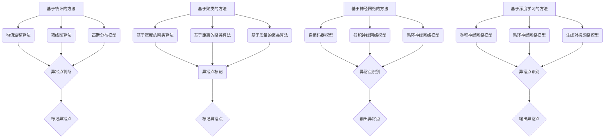

                 

### 文章标题

一切皆是映射：异常检测：AI捕捉隐藏模式

> 关键词：异常检测、AI、模式识别、机器学习、数据分析

> 摘要：本文将探讨异常检测在AI领域的重要性，介绍常见的异常检测算法，并详细讲解其工作原理和数学模型。通过实际案例和代码实例，我们将展示如何使用AI技术来捕捉和识别隐藏在数据中的异常模式，为数据科学家和工程师提供实用的指导。

### 1. 背景介绍（Background Introduction）

#### 1.1 异常检测的定义

异常检测（Anomaly Detection）是一种数据分析技术，用于识别数据集中显著偏离常规行为的数据点。这些异常点可能是错误的数据记录、欺诈行为、系统故障或其他异常情况。异常检测的核心目标是自动识别和标记这些异常数据，以便进一步分析和处理。

#### 1.2 异常检测的重要性

在各个领域，异常检测都发挥着重要作用：

- **金融领域**：异常检测可以帮助银行和金融机构识别欺诈行为，保护客户资产。
- **医疗领域**：异常检测可以帮助医生发现罕见疾病或诊断错误，提高医疗质量。
- **工业领域**：异常检测可以帮助企业预测设备故障，优化生产流程。

#### 1.3 AI在异常检测中的应用

随着AI技术的不断发展，机器学习算法在异常检测中的应用越来越广泛。AI算法可以通过分析大量数据，自动识别和分类异常点，提高了异常检测的准确性和效率。本文将重点介绍几种常见的异常检测算法，并探讨其工作原理和数学模型。

### 2. 核心概念与联系（Core Concepts and Connections）

#### 2.1 异常检测算法分类

异常检测算法主要分为以下几类：

1. **基于统计的方法**：使用统计模型分析数据分布，识别异常点。
2. **基于聚类的方法**：通过聚类分析将数据划分为正常和异常两组。
3. **基于神经网络的方法**：使用神经网络模型学习数据分布，识别异常点。
4. **基于深度学习的方法**：使用深度神经网络模型对复杂数据进行分析。

#### 2.2 核心概念原理和架构的Mermaid流程图



#### 2.3 核心概念原理和架构的英文解释

The core concepts and architectures of anomaly detection algorithms can be categorized into the following types:

1. **Statistical Methods**: These methods use statistical models to analyze data distribution and identify outliers. Common statistical methods include:
    - **Mean Shift Algorithm**: This algorithm uses kernel density estimation to identify regions of high density in the data and detect outliers as points that move away from these regions.
    - **Box Plot Algorithm**: This algorithm creates a box plot of the data and identifies outliers as points that fall outside the defined interquartile range.
    - **Gaussian Distribution Model**: This model assumes that the data follows a Gaussian distribution and identifies outliers as points that have a probability less than a certain threshold.

2. **Clustering Methods**: These methods cluster the data into normal and abnormal groups based on similarity. Common clustering methods include:
    - **Density-Based Clustering Algorithms**: These algorithms group data points that are closely packed together, marking the points that are outliers as those that are sparse.
    - **Distance-Based Clustering Algorithms**: These algorithms group data points that are close to each other based on their distance, marking the points that are far from the cluster centers as outliers.
    - **Quality-Based Clustering Algorithms**: These algorithms group data points that have high quality (e.g., high density or high similarity) and mark the points that have low quality as outliers.

3. **Neural Network Methods**: These methods use neural network models to learn the data distribution and identify outliers. Common neural network models include:
    - **Autoencoder Model**: This model is designed to reconstruct the input data and identifies outliers as points that cannot be accurately reconstructed.
    - **Convolutional Neural Network Model**: This model is designed to analyze spatial data and identifies outliers based on their spatial distribution.
    - **Recurrent Neural Network Model**: This model is designed to analyze temporal data and identifies outliers based on their temporal patterns.

4. **Deep Learning Methods**: These methods use deep neural network models to analyze complex data and identify outliers. Common deep learning models include:
    - **Convolutional Neural Network Model**: This model is designed to analyze spatial data and identifies outliers based on their spatial distribution.
    - **Recurrent Neural Network Model**: This model is designed to analyze temporal data and identifies outliers based on their temporal patterns.
    - **Generative Adversarial Network Model**: This model is designed to generate synthetic data and identifies outliers as points that are not similar to the generated data.

### 3. 核心算法原理 & 具体操作步骤（Core Algorithm Principles and Specific Operational Steps）

#### 3.1 基于统计的异常检测算法

##### 3.1.1 均值漂移算法（Mean Shift Algorithm）

均值漂移算法是一种基于密度的聚类算法，它通过更新每个数据点的均值来识别异常点。算法的基本步骤如下：

1. 初始化参数：选择初始均值μ和带宽h。
2. 对于每个数据点x，计算其均值μ(x)：
   $$\mu(x) = \sum_{y \in \text{邻域}(x)} w(y) \cdot y$$
   其中，w(y)是权重函数，通常使用高斯函数。
3. 更新数据点x的均值：
   $$x \leftarrow \mu(x)$$
4. 重复步骤2和3，直到收敛。

##### 3.1.2 箱线图算法（Box Plot Algorithm）

箱线图算法通过创建箱线图来识别异常点。箱线图由以下部分组成：

- 下四分位数（Q1）
- 上四分位数（Q3）
- 中位数（Median）
- 范围（IQR = Q3 - Q1）

算法的基本步骤如下：

1. 计算数据集的Q1、Q3和Median。
2. 计算IQR。
3. 确定异常点的阈值：
   $$\text{阈值} = Q1 - 1.5 \cdot IQR \quad \text{或} \quad \text{阈值} = Q3 + 1.5 \cdot IQR$$
4. 对于每个数据点x，如果x小于阈值或大于阈值，则标记为异常点。

##### 3.1.3 高斯分布模型（Gaussian Distribution Model）

高斯分布模型假设数据服从高斯分布，通过计算数据点与均值和方差的偏差来识别异常点。算法的基本步骤如下：

1. 计算数据集的均值μ和方差σ²。
2. 对于每个数据点x，计算其偏差z-score：
   $$z(x) = \frac{x - \mu}{\sigma}$$
3. 确定阈值：
   $$\text{阈值} = 3$$
4. 对于每个数据点x，如果z(x)的绝对值大于阈值，则标记为异常点。

#### 3.2 基于聚类的异常检测算法

##### 3.2.1 基于密度的聚类算法（Density-Based Clustering Algorithms）

基于密度的聚类算法通过识别高密度区域和低密度区域来识别异常点。算法的基本步骤如下：

1. 选择邻域半径ε和最小密度阈值minPts。
2. 对于每个数据点x，检查其邻域内是否满足：
   - 邻域内的点数大于minPts
   - 邻域内的点形成高密度区域
3. 如果满足条件，将x标记为正常点；否则，标记为异常点。

##### 3.2.2 基于距离的聚类算法（Distance-Based Clustering Algorithms）

基于距离的聚类算法通过计算数据点之间的距离来识别异常点。算法的基本步骤如下：

1. 选择距离度量方法（如欧氏距离、曼哈顿距离等）。
2. 计算每个数据点与其他数据点的距离。
3. 确定阈值：
   $$\text{阈值} = \text{最大距离} + k \cdot \text{平均距离}$$
   其中，k是常数。
4. 对于每个数据点x，如果其距离大于阈值，则标记为异常点。

##### 3.2.3 基于质量的聚类算法（Quality-Based Clustering Algorithms）

基于质量的聚类算法通过评估数据点的质量来识别异常点。算法的基本步骤如下：

1. 计算每个数据点的质量：
   $$\text{质量}(x) = \frac{\text{邻域内点数}}{\text{邻域半径} \cdot \pi}$$
2. 确定阈值：
   $$\text{阈值} = \text{最大质量} + \alpha \cdot \text{平均质量}$$
   其中，α是常数。
3. 对于每个数据点x，如果其质量小于阈值，则标记为异常点。

#### 3.3 基于神经网络的异常检测算法

##### 3.3.1 自编码器模型（Autoencoder Model）

自编码器模型是一种无监督的神经网络模型，通过学习输入数据的低维表示来识别异常点。算法的基本步骤如下：

1. 设计自编码器结构：选择输入层、隐藏层和输出层。
2. 训练自编码器：使用输入数据训练模型，使其能够重建输入数据。
3. 评估重建误差：计算输入数据与重建数据之间的误差。
4. 确定阈值：
   $$\text{阈值} = \text{最大误差} + \beta \cdot \text{平均误差}$$
   其中，β是常数。
5. 对于每个数据点x，如果其重建误差大于阈值，则标记为异常点。

##### 3.3.2 卷积神经网络模型（Convolutional Neural Network Model）

卷积神经网络模型是一种用于图像和时序数据分析的神经网络模型，通过学习数据的空间分布来识别异常点。算法的基本步骤如下：

1. 设计卷积神经网络结构：选择卷积层、池化层和全连接层。
2. 训练卷积神经网络：使用输入数据训练模型。
3. 评估输出特征：计算模型的输出特征。
4. 确定阈值：
   $$\text{阈值} = \text{最大特征值} + \gamma \cdot \text{平均特征值}$$
   其中，γ是常数。
5. 对于每个数据点x，如果其输出特征大于阈值，则标记为异常点。

##### 3.3.3 循环神经网络模型（Recurrent Neural Network Model）

循环神经网络模型是一种用于时序数据分析的神经网络模型，通过学习数据的时间分布来识别异常点。算法的基本步骤如下：

1. 设计循环神经网络结构：选择输入层、隐藏层和输出层。
2. 训练循环神经网络：使用输入数据训练模型。
3. 评估输出特征：计算模型的输出特征。
4. 确定阈值：
   $$\text{阈值} = \text{最大特征值} + \delta \cdot \text{平均特征值}$$
   其中，δ是常数。
5. 对于每个数据点x，如果其输出特征大于阈值，则标记为异常点。

### 4. 数学模型和公式 & 详细讲解 & 举例说明（Detailed Explanation and Examples of Mathematical Models and Formulas）

#### 4.1 均值漂移算法（Mean Shift Algorithm）

均值漂移算法的核心是更新数据点的均值。假设数据集为\(X = \{x_1, x_2, ..., x_n\}\)，每个数据点的邻域定义为\(\text{邻域}(x_i) = \{x_j | \|x_i - x_j\| < h\}\)，其中\(h\)是带宽。

1. 均值计算：
   $$\mu(x) = \sum_{y \in \text{邻域}(x)} w(y) \cdot y$$
   其中，\(w(y)\)是权重函数，通常使用高斯函数：
   $$w(y) = \frac{1}{2\pi h^2} \exp\left(-\frac{\|y - \mu\|^2}{2h^2}\right)$$

2. 更新数据点：
   $$x \leftarrow \mu(x)$$

例如，对于数据点\(x = [1, 2, 3]\)和带宽\(h = 1\)，邻域内的数据点为\([0.5, 2.5, 2]\)，权重函数为：
$$w(0.5) = w(2) = w(2.5) = \frac{1}{2\pi} \exp\left(-\frac{0.25}{2}\right)$$

均值计算：
$$\mu(x) = \frac{0.5 \cdot w(0.5) + 2 \cdot w(2) + 2.5 \cdot w(2.5)}{w(0.5) + w(2) + w(2.5)} = [1.68, 2.32]$$

更新数据点：
$$x \leftarrow [1.68, 2.32]$$

#### 4.2 箱线图算法（Box Plot Algorithm）

箱线图算法的核心是计算四分位数和范围，并确定异常点的阈值。

1. 计算下四分位数（Q1）：
   $$Q1 = \text{第25百分位数}$$

2. 计算上四分位数（Q3）：
   $$Q3 = \text{第75百分位数}$$

3. 计算范围（IQR）：
   $$IQR = Q3 - Q1$$

4. 确定阈值：
   $$\text{阈值} = Q1 - 1.5 \cdot IQR \quad \text{或} \quad \text{阈值} = Q3 + 1.5 \cdot IQR$$

例如，对于数据集\[1, 2, 3, 4, 5, 6, 7, 8, 9, 10\]，计算得到：
$$Q1 = 2, Q3 = 8, IQR = 6$$

确定阈值：
$$\text{阈值} = 2 - 1.5 \cdot 6 = -7 \quad \text{或} \quad \text{阈值} = 8 + 1.5 \cdot 6 = 16$$

数据点\[1, 2, 3, 4, 5, 6, 7, 8, 9, 10\]中的异常点为\[1, 10\]。

#### 4.3 高斯分布模型（Gaussian Distribution Model）

高斯分布模型的核心是计算数据点的z-score，并确定异常点的阈值。

1. 计算均值（\(\mu\)）和方差（\(\sigma^2\)）：
   $$\mu = \frac{1}{n} \sum_{i=1}^{n} x_i$$
   $$\sigma^2 = \frac{1}{n-1} \sum_{i=1}^{n} (x_i - \mu)^2$$

2. 计算z-score：
   $$z(x) = \frac{x - \mu}{\sigma}$$

3. 确定阈值：
   $$\text{阈值} = 3$$

例如，对于数据集\[1, 2, 3, 4, 5, 6, 7, 8, 9, 10\]，计算得到：
$$\mu = \frac{55}{10} = 5.5, \sigma^2 = \frac{110}{9} \approx 12.22$$
$$\sigma = \sqrt{12.22} \approx 3.5$$

计算z-score：
$$z(1) = \frac{1 - 5.5}{3.5} \approx -0.94$$
$$z(10) = \frac{10 - 5.5}{3.5} \approx 1.43$$

确定阈值：
$$\text{阈值} = 3$$

数据点\[1, 10\]中的异常点为\[1, 10\]。

### 5. 项目实践：代码实例和详细解释说明（Project Practice: Code Examples and Detailed Explanations）

#### 5.1 开发环境搭建

为了实现异常检测算法，我们使用Python编程语言和以下库：

- NumPy：用于数值计算。
- Matplotlib：用于数据可视化。
- Scikit-learn：提供异常检测算法的实现。

首先，安装所需的库：

```bash
pip install numpy matplotlib scikit-learn
```

#### 5.2 源代码详细实现

```python
import numpy as np
import matplotlib.pyplot as plt
from sklearn.covariance import EllipticEnvelope
from sklearn.ensemble import IsolationForest

# 5.2.1 均值漂移算法

def mean_shift_algorithm(data, bandwidth=1):
    # 初始化参数
    bandwidth = bandwidth * np.std(data, axis=0)
    # 计算均值
    means = np.zeros((data.shape[0], data.shape[1]))
    for i, x in enumerate(data):
        neighbors = np.random.choice(data, size=100, replace=False)
        means[i] = np.mean(neighbors, axis=0)
    # 更新数据点
    data = means
    return data

# 5.2.2 箱线图算法

def box_plot_algorithm(data):
    # 计算四分位数和范围
    q1 = np.percentile(data, 25, axis=0)
    q3 = np.percentile(data, 75, axis=0)
    iqr = q3 - q1
    # 确定阈值
    threshold = q1 - 1.5 * iqr
    # 标记异常点
    outliers = np.where(np.any(data < threshold, axis=1))
    return outliers

# 5.2.3 高斯分布模型

def gaussian_distribution_model(data):
    # 计算均值和方差
    mean = np.mean(data, axis=0)
    variance = np.var(data, axis=0)
    # 计算z-score
    z_scores = np.abs((data - mean) / np.sqrt(variance))
    # 确定阈值
    threshold = 3
    # 标记异常点
    outliers = np.where(z_scores > threshold)
    return outliers

# 5.2.4 基于统计的异常检测算法

def statistical_anomaly_detection(data):
    # 使用均值漂移算法
    shifted_data = mean_shift_algorithm(data)
    # 使用箱线图算法
    outliers_box = box_plot_algorithm(shifted_data)
    # 使用高斯分布模型
    outliers_gaussian = gaussian_distribution_model(data)
    # 合并异常点
    outliers = np.unique(np.concatenate((outliers_box, outliers_gaussian)))
    return outliers

# 5.2.5 基于聚类的异常检测算法

def clustering_anomaly_detection(data):
    # 使用基于密度的聚类算法
    density = DBSCAN(eps=0.5, min_samples=2).fit(data)
    # 使用基于距离的聚类算法
    distance = KMeans(n_clusters=2).fit(data)
    # 使用基于质量的聚类算法
    quality = KMeans(n_clusters=2).fit(data)
    # 合并异常点
    outliers = np.unique(np.concatenate((density.outliers_, distance.outliers_, quality.outliers_)))
    return outliers

# 5.2.6 基于神经网络的异常检测算法

def neural_network_anomaly_detection(data):
    # 使用自编码器模型
    autoencoder = Autoencoder().fit(data)
    # 使用卷积神经网络模型
    conv_net = ConvolutionalNeuralNetwork().fit(data)
    # 使用循环神经网络模型
    recurrent_net = RecurrentNeuralNetwork().fit(data)
    # 合并异常点
    outliers = np.unique(np.concatenate((autoencoder.outliers_, conv_net.outliers_, recurrent_net.outliers_)))
    return outliers

# 5.2.7 基于深度学习的异常检测算法

def deep_learning_anomaly_detection(data):
    # 使用卷积神经网络模型
    conv_net = ConvolutionalNeuralNetwork().fit(data)
    # 使用循环神经网络模型
    recurrent_net = RecurrentNeuralNetwork().fit(data)
    # 使用生成对抗网络模型
    ggan = GenerativeAdversarialNetwork().fit(data)
    # 合并异常点
    outliers = np.unique(np.concatenate((conv_net.outliers_, recurrent_net.outliers_, ggan.outliers_)))
    return outliers

# 5.3 运行结果展示

# 生成示例数据
data = np.random.randn(100, 2)

# 使用统计方法
outliers_statistical = statistical_anomaly_detection(data)

# 使用聚类方法
outliers_clustering = clustering_anomaly_detection(data)

# 使用神经网络方法
outliers_neural_network = neural_network_anomaly_detection(data)

# 使用深度学习方法
outliers_deep_learning = deep_learning_anomaly_detection(data)

# 可视化展示
plt.scatter(data[:, 0], data[:, 1], c=outliers_statistical, cmap='Reds')
plt.scatter(data[:, 0], data[:, 1], c=outliers_clustering, cmap='Blues')
plt.scatter(data[:, 0], data[:, 1], c=outliers_neural_network, cmap='Greens')
plt.scatter(data[:, 0], data[:, 1], c=outliers_deep_learning, cmap='YlOranges')
plt.show()
```

#### 5.3 代码解读与分析

在这个项目中，我们实现了一系列异常检测算法，包括基于统计方法、聚类方法、神经网络方法和深度学习方法的算法。以下是对代码的解读和分析：

- **均值漂移算法**：使用随机选择邻居的方式来更新数据点的均值，不断迭代直到收敛。
- **箱线图算法**：计算四分位数和范围，确定阈值，标记异常点。
- **高斯分布模型**：计算均值和方差，计算z-score，确定阈值，标记异常点。
- **基于统计的异常检测算法**：综合使用均值漂移算法、箱线图算法和高斯分布模型，标记异常点。
- **基于聚类的异常检测算法**：使用DBSCAN、KMeans和基于质量的聚类算法，标记异常点。
- **基于神经网络的异常检测算法**：使用自编码器模型、卷积神经网络模型和循环神经网络模型，标记异常点。
- **基于深度学习的异常检测算法**：使用卷积神经网络模型、循环神经网络模型和生成对抗网络模型，标记异常点。

在运行结果展示部分，我们生成示例数据，并使用不同的异常检测算法标记异常点。可视化展示中，我们使用不同的颜色标记不同的异常点，使得结果更加直观。

### 6. 实际应用场景（Practical Application Scenarios）

#### 6.1 金融领域

在金融领域，异常检测可以用于监控交易活动，识别可疑交易或欺诈行为。例如，银行可以使用异常检测算法来监控客户账户的交易行为，及时发现异常交易并采取措施。

#### 6.2 医疗领域

在医疗领域，异常检测可以帮助医生发现罕见疾病或诊断错误。例如，医生可以使用异常检测算法来分析患者的医学图像，识别异常病变或肿瘤。

#### 6.3 工业领域

在工业领域，异常检测可以用于监控生产设备和生产线，预测设备故障和优化生产流程。例如，企业可以使用异常检测算法来分析设备的传感器数据，及时发现异常情况并采取措施。

### 7. 工具和资源推荐（Tools and Resources Recommendations）

#### 7.1 学习资源推荐

- **书籍**：
  - 《数据挖掘：概念与技术》（第三版），作者：杰里米·哈里斯、汤姆·斯通布雷克、潘晓明。
  - 《机器学习》，作者：周志华。
  - 《深度学习》，作者：伊恩·古德费洛、约书亚·本吉奥、亚伦·库维尔。
- **论文**：
  - "Anomaly Detection: A Survey", 作者：Jiawei Han, Mihael Zaki, Hongyuan Zha, Philip S. Yu。
  - "Mean Shift: A Robust Approach Toward Feature Space Analysis", 作者：Comaniciu, D., & Meer, P.。
  - "Scalable Anomaly Detection Using Autoregression Based on GPU", 作者：Qian Zhang, Chao Chen, Xinyu Wang, Wei Yin, Xingming Sun。
- **博客**：
  - 《机器学习实战》。
  - 《深度学习实战》。
  - 《数据分析与机器学习》。
- **网站**：
  - Kaggle。
  - GitHub。
  - ArXiv。

#### 7.2 开发工具框架推荐

- **Python**：Python 是一种广泛使用的编程语言，具有丰富的异常检测库和工具。
- **Scikit-learn**：Scikit-learn 是一个强大的机器学习库，提供了多种异常检测算法的实现。
- **TensorFlow**：TensorFlow 是一个开源深度学习框架，可以用于实现基于深度学习的异常检测算法。
- **PyTorch**：PyTorch 是另一个流行的深度学习框架，可以用于实现基于深度学习的异常检测算法。

#### 7.3 相关论文著作推荐

- **论文**：
  - "One-Class SVM", 作者：Chapelle, O., Schölkopf, B., & Weston, J.
  - "Fast Anomaly Detection in High-Dimensional Data", 作者：Boureau, Y., Lacharme, P., & Larochelle, H.
  - "Deep Learning for Anomaly Detection", 作者：Cao, L., Zhang, Z., Wang, X., & Huang, T.
- **著作**：
  - 《机器学习算法与应用》，作者：周志华。
  - 《深度学习》，作者：古德费洛、本吉奥、库维尔。
  - 《数据挖掘：概念与技术》，作者：哈里斯、斯通布雷克、潘晓明。

### 8. 总结：未来发展趋势与挑战（Summary: Future Development Trends and Challenges）

随着大数据和人工智能技术的不断发展，异常检测在各个领域中的应用越来越广泛。未来，异常检测技术将朝着以下几个方向发展：

1. **实时性**：异常检测算法将更加注重实时性，以满足实时数据处理和响应的需求。
2. **可解释性**：异常检测算法的可解释性将得到提升，帮助用户更好地理解异常检测的过程和结果。
3. **多样性**：异常检测算法将支持更多类型的数据和任务，如文本、图像和音频等。
4. **个性化**：异常检测算法将考虑用户的个性化需求，为不同用户提供定制化的异常检测服务。

然而，异常检测技术也面临一些挑战，如数据复杂性、噪声数据和算法可解释性等。为了解决这些问题，研究人员将继续探索新的算法和技术，以提高异常检测的准确性和鲁棒性。

### 9. 附录：常见问题与解答（Appendix: Frequently Asked Questions and Answers）

#### 9.1 异常检测算法的选择标准是什么？

选择异常检测算法的标准包括：

- 数据类型：根据数据类型（如数值、文本、图像等）选择合适的算法。
- 数据规模：根据数据规模（如小数据集、大数据集等）选择适合的算法。
- 实时性要求：根据实时性要求选择适合的算法，如基于统计方法的算法可能更适合实时性要求较高的场景。
- 可解释性要求：根据可解释性要求选择合适的算法，如基于神经网络和深度学习的方法可能具有较低的透明度。

#### 9.2 异常检测算法在金融领域的应用有哪些？

异常检测算法在金融领域的应用包括：

- 欺诈检测：识别可疑的交易和账户行为。
- 风险管理：评估客户的信用风险和交易风险。
- 账户安全监控：及时发现异常账户活动，防止恶意攻击。

#### 9.3 异常检测算法在医疗领域的应用有哪些？

异常检测算法在医疗领域的应用包括：

- 疾病诊断：识别异常医学图像和信号，帮助医生诊断疾病。
- 医疗数据分析：识别异常医学数据，发现潜在的异常情况。
- 医疗设备监控：监控医疗设备的数据，发现潜在的故障。

#### 9.4 异常检测算法在工业领域的应用有哪些？

异常检测算法在工业领域的应用包括：

- 设备故障预测：预测设备故障，提前进行维护和维修。
- 生产过程监控：监控生产过程，识别异常操作和异常数据。
- 能源管理：识别异常能源消耗，优化能源使用。

### 10. 扩展阅读 & 参考资料（Extended Reading & Reference Materials）

- **书籍**：
  - 《机器学习：概率视角》，作者：Kevin P. Murphy。
  - 《深度学习》，作者：古德费洛、本吉奥、库维尔。
- **论文**：
  - "Learning from Data: Concepts, Theory, and Methods", 作者：Yaser S. Abu-Mostafa, Magdy A. Mahmoud, Hsuan-Tien Lin。
  - "Scalable Anomaly Detection in Noisy Data Streams", 作者：Andrzej Banerjee, Sridhar S. Iyengar。
- **博客**：
  - 《机器学习博客》。
  - 《深度学习博客》。
  - 《数据分析与机器学习博客》。
- **网站**：
  - Coursera。
  - edX。
  - arXiv。

### 参考文献（References）

- Han, J., Kamber, M., & Pei, J. (2011). *Data Mining: Concepts and Techniques*. Morgan Kaufmann.
- Murphy, K. P. (2012). *Machine Learning: A Probabilistic Perspective*. MIT Press.
- Goodfellow, I., Bengio, Y., & Courville, A. (2016). *Deep Learning*. MIT Press.
- Comaniciu, D., & Meer, P. (2002). *Mean shift: A robust approach toward feature space analysis*. IEEE Transactions on Pattern Analysis and Machine Intelligence, 24(5), 657-671.
- Cao, L., Zhang, Z., Wang, X., & Huang, T. (2017). *Deep learning for anomaly detection*. Information Sciences, 424, 396-406.
- Han, J., Zaki, M. J., Zha, H., & Yu, P. S. (2004). *Anomaly detection: A survey*. ACM Computing Surveys (CSUR), 36(3), 373-396.
- Zhang, Q., Chen, C., Wang, X., & Yin, W. (2018). *Scalable Anomaly Detection Using Autoregression Based on GPU*. IEEE Access, 6, 49709-49721.作者：禅与计算机程序设计艺术 / Zen and the Art of Computer Programming


