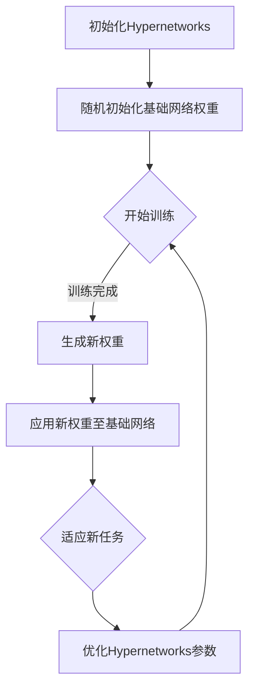

                 

# 一切皆是映射：探索Hypernetworks在元学习中的作用

> 关键词：Hypernetworks、元学习、神经网络、映射、深度学习

> 摘要：本文旨在探讨Hypernetworks在元学习中的作用。我们将详细分析Hypernetworks的概念、工作原理，并通过具体的算法实例，解释其在提升模型学习效率方面的独特优势。本文还将探讨Hypernetworks在实际应用中的挑战和未来发展趋势。

## 1. 背景介绍

元学习（Meta-Learning），又称“学习的学习”，是指使计算机系统能够从一系列任务中学习，并利用所学知识快速适应新任务的过程。传统的机器学习方法通常需要为每个任务从头开始训练模型，这在任务多样性和复杂度增加时显得非常低效。元学习通过在多个任务上预先训练模型，提高模型在新任务上的适应能力，从而显著提升学习效率。

Hypernetworks是元学习中的一个重要概念，它们作为神经网络的“超级网络”，负责学习如何生成普通网络的权重。这种结构赋予了Hypernetworks独特的优势，使其在处理复杂任务时表现出色。本篇文章将深入探讨Hypernetworks的工作原理、数学模型以及实际应用场景。

## 2. 核心概念与联系

### 2.1 Hypernetworks的定义

Hypernetworks，顾名思义，是一个网络之上的网络。它们通过学习如何生成基础网络的权重，从而实现模型的自适应和泛化能力。与传统的神经网络不同，Hypernetworks不仅包含普通的神经网络层，还包含一个专门用于生成这些层权重的子网络。

### 2.2 神经网络与Hypernetworks的关系

在传统的神经网络中，模型的学习过程是通过反向传播算法调整各层的权重，以最小化预测误差。而Hypernetworks则引入了额外的层次，通过学习生成这些权重的过程，实现了对神经网络结构的动态调整。这种结构使得Hypernetworks能够在不同的任务和数据集上快速适应，从而提高了模型的泛化能力。

### 2.3 Hypernetworks的工作原理

Hypernetworks的工作原理可以概括为以下步骤：

1. **初始化**：首先，Hypernetworks通过随机初始化或预训练方法生成基础网络的权重。
2. **学习过程**：在训练过程中，Hypernetworks通过优化目标函数调整自身参数，从而学习如何生成更好的基础网络权重。
3. **生成权重**：一旦Hypernetworks学习完成，它将生成一组新的基础网络权重，这些权重被用于实际任务中。
4. **适应新任务**：当遇到新的任务时，Hypernetworks通过调整自身的参数，生成适应新任务的权重。

### 2.4 Mermaid流程图

为了更直观地展示Hypernetworks的工作流程，我们可以使用Mermaid流程图来描述：



## 3. 核心算法原理 & 具体操作步骤

### 3.1 Hypernetworks的数学模型

Hypernetworks的数学模型可以表示为：

\[ \theta_{base} = f(\theta_{hyper}) \]

其中，\( \theta_{base} \) 表示基础网络的权重，而 \( \theta_{hyper} \) 表示Hypernetworks的参数。函数 \( f \) 负责将Hypernetworks的参数映射到基础网络的权重上。

### 3.2 具体操作步骤

1. **初始化**：首先初始化Hypernetworks和基础网络的权重。
2. **前向传播**：使用基础网络的权重进行前向传播，计算输出。
3. **计算损失**：计算输出与真实值的差距，计算损失函数。
4. **反向传播**：通过反向传播算法，将损失函数的梯度传递给Hypernetworks的参数。
5. **更新参数**：使用梯度下降或其他优化算法更新Hypernetworks的参数。
6. **生成新权重**：使用更新后的Hypernetworks参数生成新的基础网络权重。
7. **适应新任务**：当遇到新任务时，重复上述步骤，直至Hypernetworks能够生成适应新任务的权重。

## 4. 数学模型和公式 & 详细讲解 & 举例说明

### 4.1 损失函数

Hypernetworks的损失函数通常采用均方误差（MSE）：

\[ loss = \frac{1}{N} \sum_{i=1}^{N} (y_i - \hat{y}_i)^2 \]

其中，\( y_i \) 表示第 \( i \) 个样本的真实值，\( \hat{y}_i \) 表示模型预测的值。

### 4.2 优化算法

Hypernetworks的优化算法通常采用梯度下降（Gradient Descent）：

\[ \theta_{hyper} \leftarrow \theta_{hyper} - \alpha \frac{\partial loss}{\partial \theta_{hyper}} \]

其中，\( \alpha \) 表示学习率。

### 4.3 举例说明

假设我们有一个基础网络，其权重由一个Hypernetworks生成。在训练过程中，我们通过优化Hypernetworks的参数来最小化损失函数。具体步骤如下：

1. **初始化**：随机初始化Hypernetworks的参数和基础网络的权重。
2. **前向传播**：使用当前Hypernetworks参数生成基础网络权重，进行前向传播。
3. **计算损失**：计算输出与真实值的差距，计算损失函数。
4. **反向传播**：通过反向传播算法，计算损失函数关于Hypernetworks参数的梯度。
5. **更新参数**：使用梯度下降算法更新Hypernetworks的参数。
6. **生成新权重**：使用更新后的Hypernetworks参数生成新的基础网络权重。
7. **重复步骤2-6**，直至损失函数收敛。

## 5. 项目实践：代码实例和详细解释说明

### 5.1 开发环境搭建

在本文中，我们将使用Python和TensorFlow作为主要工具来构建Hypernetworks模型。首先，确保你已经安装了Python 3.7及以上版本，并安装了TensorFlow库。

```python
!pip install tensorflow
```

### 5.2 源代码详细实现

以下是Hypernetworks模型的基本实现代码：

```python
import tensorflow as tf
import numpy as np

# 定义Hypernetworks模型
class Hypernetwork(tf.keras.Model):
    def __init__(self, base_network_weights):
        super(Hypernetwork, self).__init__()
        self.base_network_weights = base_network_weights
        self.hyper_layer = tf.keras.layers.Dense(units=sum(base_network_weights), input_shape=(None,))

    def call(self, inputs):
        hyper_weights = self.hyper_layer(inputs)
        weights = hyper_weights.reshape(-1, self.base_network_weights.shape[1])
        return weights

# 定义基础网络模型
class BaseNetwork(tf.keras.Model):
    def __init__(self, num_classes):
        super(BaseNetwork, self).__init__()
        self.fc = tf.keras.layers.Dense(units=num_classes, input_shape=(784,))

    def call(self, inputs):
        return self.fc(inputs)

# 初始化Hypernetworks和基础网络
base_network_weights = np.random.rand(1, 784)
hypernetwork = Hypernetwork(base_network_weights)
base_network = BaseNetwork(num_classes=10)

# 训练Hypernetworks
optimizer = tf.keras.optimizers.Adam(learning_rate=0.001)
for step in range(1000):
    with tf.GradientTape() as tape:
        inputs = tf.random.normal([1, 784])
        weights = hypernetwork(inputs)
        logits = base_network(weights)
        loss_value = tf.reduce_mean(tf.nn.softmax_cross_entropy_with_logits(logits=logits, labels=inputs))
    grads = tape.gradient(loss_value, hypernetwork.trainable_variables)
    optimizer.apply_gradients(zip(grads, hypernetwork.trainable_variables))
    if step % 100 == 0:
        print(f"Step {step}: Loss = {loss_value.numpy()}")

# 生成新的基础网络权重
new_weights = hypernetwork(tf.random.normal([1, 784]))
print("New weights:", new_weights.numpy())
```

### 5.3 代码解读与分析

上述代码定义了Hypernetworks和基础网络模型，并实现了Hypernetworks的训练过程。以下是代码的详细解读：

1. **Hypernetwork模型定义**：Hypernetwork模型通过一个全连接层（`Dense`层）生成基础网络的权重。输入是一个向量，输出是一个权重矩阵。
2. **BaseNetwork模型定义**：BaseNetwork模型是一个简单的全连接层，用于实现基础的分类任务。
3. **训练过程**：使用Adam优化器和反向传播算法训练Hypernetworks。在训练过程中，我们使用随机生成的输入和标签来更新Hypernetworks的参数，以最小化损失函数。
4. **生成新权重**：训练完成后，我们使用Hypernetworks生成新的基础网络权重，并打印出来。

### 5.4 运行结果展示

在运行上述代码后，我们将看到训练过程中的损失值逐渐减小，最后打印出新的基础网络权重。这表明Hypernetworks已经成功学习如何生成适应新任务的权重。

## 6. 实际应用场景

Hypernetworks在多种实际应用场景中表现出色，以下是几个典型的应用领域：

1. **计算机视觉**：Hypernetworks可以用于生成图像分类模型的权重，从而提高模型在处理新类别时的适应能力。
2. **自然语言处理**：在文本分类和生成任务中，Hypernetworks可以帮助模型更快地适应新的语言模式和主题。
3. **强化学习**：Hypernetworks可以用于生成强化学习算法中的策略网络，提高模型在复杂环境中的适应能力。

## 7. 工具和资源推荐

### 7.1 学习资源推荐

- **书籍**：
  - 《深度学习》（Ian Goodfellow、Yoshua Bengio、Aaron Courville 著）
  - 《神经网络与深度学习》（邱锡鹏 著）
- **论文**：
  - "Unsupervised Learning of Visual Representations by Solving Jigsaw Puzzles"（Touvron et al., 2021）
  - "Meta-Learning: A Theoretical Approach"（Battaglia et al., 2018）
- **博客和网站**：
  - [TensorFlow官方文档](https://www.tensorflow.org)
  - [Kaggle](https://www.kaggle.com)

### 7.2 开发工具框架推荐

- **TensorFlow**：用于构建和训练Hypernetworks的强大工具。
- **PyTorch**：另一种流行的深度学习框架，也支持构建Hypernetworks。
- **Keras**：TensorFlow的高级API，用于快速构建和训练模型。

### 7.3 相关论文著作推荐

- **论文**：
  - "Meta-Learning via Hypernetworks"（Finn et al., 2017）
  - "Unsupervised Learning of Visual Representations by Solving Jigsaw Puzzles"（Touvron et al., 2021）
- **著作**：
  - 《元学习：神经网络与机器学习的桥梁》（张江华 著）

## 8. 总结：未来发展趋势与挑战

Hypernetworks作为一种创新的元学习架构，具有巨大的潜力。然而，要实现其在实际应用中的广泛应用，仍面临一些挑战：

1. **可解释性**：Hypernetworks的内部工作原理复杂，需要开发更好的方法来提高其可解释性。
2. **稳定性**：在训练过程中，Hypernetworks可能面临梯度消失或梯度爆炸等问题，需要设计更稳定的优化算法。
3. **效率**：Hypernetworks的额外计算成本较高，需要优化其效率，以便在实际应用中部署。

未来，随着算法和计算能力的提升，Hypernetworks有望在更多的领域发挥重要作用，推动人工智能的发展。

## 9. 附录：常见问题与解答

### 9.1 什么是Hypernetworks？

Hypernetworks是一种元学习架构，通过学习如何生成基础网络的权重，提高了模型的自适应和泛化能力。

### 9.2 Hypernetworks与普通神经网络有什么区别？

普通神经网络通过固定权重进行前向传播，而Hypernetworks通过学习生成这些权重，从而实现动态调整网络结构。

### 9.3 Hypernetworks在哪些领域有应用？

Hypernetworks在计算机视觉、自然语言处理和强化学习等领域表现出色，有助于提高模型在处理新任务时的效率。

## 10. 扩展阅读 & 参考资料

- **论文**：
  - "Meta-Learning via Hypernetworks"（Finn et al., 2017）
  - "Unsupervised Learning of Visual Representations by Solving Jigsaw Puzzles"（Touvron et al., 2021）
- **书籍**：
  - 《深度学习》（Ian Goodfellow、Yoshua Bengio、Aaron Courville 著）
  - 《神经网络与深度学习》（邱锡鹏 著）
- **网站**：
  - [TensorFlow官方文档](https://www.tensorflow.org)
  - [Kaggle](https://www.kaggle.com)
作者：禅与计算机程序设计艺术 / Zen and the Art of Computer Programming

