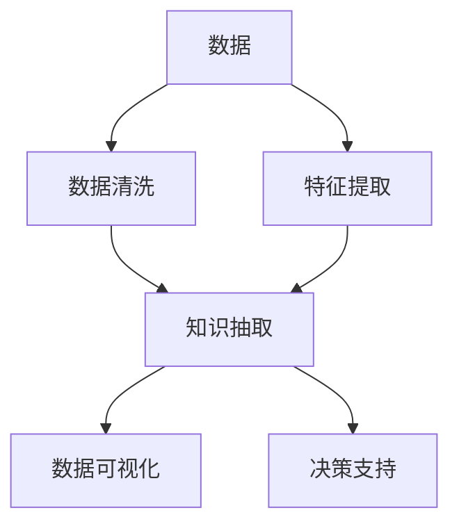

                 

# 知识发现引擎如何改变程序员的工作模式

## 1. 背景介绍

### 1.1 问题由来
在信息爆炸的时代，程序员面临着前所未有的数据量和处理需求。传统的编程工作模式需要程序员手动编写和维护大量的数据访问、清洗、聚合和分析代码，这不仅效率低下，容易出错，还难以保证代码的灵活性和可扩展性。

为了应对这些挑战，知识发现引擎(Knowledge Discovery Engine, KDE)应运而生。它通过智能化的算法和数据处理技术，从大量数据中自动抽取有价值的信息，并将这些信息以结构化、易于理解和操作的方式呈现给程序员，大大提升了编程效率和代码质量。

### 1.2 问题核心关键点
知识发现引擎的核心在于利用机器学习和数据挖掘技术，自动从数据中发现并抽取有意义的知识，辅助程序员进行数据分析、模式识别和决策支持。关键点包括：

- 数据处理能力：KDE能够高效处理海量数据，提取关键特征和结构。
- 知识抽取能力：能够自动识别并提取出数据中的知识模式、规律和关联性。
- 可扩展性：支持自定义算法和规则，根据不同的应用场景进行灵活配置。
- 交互性：提供友好的用户界面，程序员可以直观地查看和操作发现的知识。
- 决策支持：提供可视化工具，辅助程序员进行决策分析。

## 2. 核心概念与联系

### 2.1 核心概念概述

为更好地理解知识发现引擎的原理和应用，本节将介绍几个密切相关的核心概念：

- 知识发现(Knowledge Discovery, KD)：指通过数据分析和机器学习技术，从大量数据中发现和抽取有价值的知识模式和规律。
- 数据挖掘(Data Mining)：指从数据集中挖掘出隐藏模式和知识的过程，是知识发现的重要手段。
- 机器学习(Machine Learning)：指利用算法和模型，从数据中学习规律和模式，实现知识发现和决策支持。
- 知识抽取(Knowledge Extraction)：指从数据中提取出具体的知识信息，如实体、关系、属性等。
- 数据可视化(Data Visualization)：指将数据转化为图形、图表等形式，直观展示数据特性和模式。
- 决策支持(Decision Support)：指利用知识发现结果，辅助决策者进行科学决策和问题解决。

这些概念之间的逻辑关系可以通过以下Mermaid流程图来展示：



这个流程图展示了这个过程的基本流程：数据经过清洗和特征提取后，进入知识抽取环节，提取出具体的知识信息；再通过数据可视化展示出来，辅助决策者进行科学决策。

## 3. 核心算法原理 & 具体操作步骤
### 3.1 算法原理概述

知识发现引擎的基本原理是利用机器学习和数据挖掘技术，从大量数据中自动抽取有价值的信息，并将其以结构化、易于理解和操作的方式呈现给程序员。其核心算法包括数据预处理、特征提取、知识抽取、数据可视化和决策支持等。

数据预处理包括数据清洗、去重、归一化等步骤，去除噪声和异常值，保证数据的质量和一致性。特征提取则通过统计、聚类、分类等技术，从数据中提取出关键的特征和属性，供后续的知识发现使用。知识抽取利用机器学习算法，自动识别并提取出数据中的实体、关系和属性等信息，形成结构化的知识图谱。数据可视化则将知识图谱转换为图形、图表等形式，直观展示数据特性和模式。决策支持则基于抽取的知识，辅助程序员进行科学决策和问题解决。

### 3.2 算法步骤详解

知识发现引擎的构建一般包括以下几个关键步骤：

**Step 1: 数据准备**
- 收集和整理数据，包括数据格式、元数据等，保证数据的质量和完整性。
- 对数据进行清洗和预处理，去除噪声和异常值。

**Step 2: 特征工程**
- 进行特征选择和提取，利用统计、聚类、分类等技术，提取出数据中的关键特征和属性。
- 设计特征变换和转换方法，如标准化、归一化等，提高特征的可用性和效率。

**Step 3: 模型训练**
- 选择合适的机器学习算法和模型，如分类、回归、聚类等，进行模型训练。
- 根据不同任务和数据特性，选择不同的训练策略和优化算法。

**Step 4: 知识抽取**
- 利用自然语言处理和图谱算法，从数据中自动识别并提取出实体、关系和属性等信息。
- 建立知识图谱，将抽取的知识以结构化形式存储。

**Step 5: 数据可视化**
- 利用数据可视化技术，将知识图谱转换为图形、图表等形式，直观展示数据特性和模式。
- 设计友好的用户界面，方便程序员查看和操作发现的知识。

**Step 6: 决策支持**
- 利用抽取的知识，辅助程序员进行科学决策和问题解决。
- 提供决策建议和推荐，辅助程序员进行最优决策。

### 3.3 算法优缺点

知识发现引擎在提升程序员工作效率和代码质量方面，具有以下优点：

1. 自动化数据处理：自动清洗、去重和归一化，保证数据质量。
2. 高效特征提取：自动识别关键特征和属性，提高数据分析效率。
3. 智能知识抽取：自动发现数据中的实体、关系和属性，形成结构化知识图谱。
4. 可视化辅助决策：将知识图谱可视化展示，辅助程序员进行科学决策。
5. 可扩展性灵活：支持自定义算法和规则，根据不同应用场景灵活配置。

同时，知识发现引擎也存在一些局限性：

1. 数据质量依赖：依赖于数据的质量和完整性，如果数据不完整或存在噪声，则抽取结果可能不准确。
2. 算法复杂度高：知识发现算法通常比较复杂，需要较长的训练时间。
3. 模型解释性差：知识发现结果往往是黑盒模型，难以解释其内部工作机制。
4. 算法可解释性不足：黑盒模型难以解释其决策过程，可能缺乏透明性和可信度。

尽管存在这些局限性，但知识发现引擎在提升程序员工作效率和代码质量方面，仍然具有巨大的潜力和应用价值。未来相关研究的重点在于如何进一步提高算法的解释性和可解释性，提高算法的自动化和高效性，优化数据处理流程，提升知识抽取的准确性和鲁棒性。

### 3.4 算法应用领域

知识发现引擎的应用范围广泛，包括但不限于以下几个领域：

- 大数据处理：从海量数据中自动提取有价值的知识，辅助大数据分析、数据清洗和预处理。
- 数据分析建模：自动发现数据中的模式和规律，形成数据模型，辅助数据建模和预测分析。
- 自动化测试：自动从测试数据中发现测试用例和缺陷，辅助自动化测试和质量保证。
- 知识管理：自动从文档和文本中抽取知识信息，辅助知识管理和文档处理。
- 情报分析：自动从情报数据中提取有价值的信息，辅助情报分析和决策支持。
- 智能运维：自动从日志和监控数据中发现问题，辅助智能运维和问题诊断。

## 4. 数学模型和公式 & 详细讲解 & 举例说明
### 4.1 数学模型构建

在知识发现引擎中，数学模型主要用于特征选择、特征提取和知识抽取等环节。这里以分类问题为例，介绍基本的数学模型构建过程。

假设数据集 $D=\{(x_i,y_i)\}_{i=1}^N$，其中 $x_i$ 为输入特征向量，$y_i$ 为输出标签。构建分类模型的目标是找到最优的超平面 $w$ 和阈值 $b$，使得分类误差最小。分类器的数学模型如下：

$$
f(x) = \text{sign}(w^Tx + b)
$$

其中 $w$ 为权重向量，$b$ 为偏置项，$\text{sign}$ 为符号函数，$x$ 为输入特征向量。

目标是最小化分类误差：

$$
\min_{w,b} \frac{1}{N}\sum_{i=1}^N L(f(x_i),y_i)
$$

其中 $L$ 为损失函数，常用的有交叉熵损失、平方损失等。

### 4.2 公式推导过程

分类器 $f(x)$ 的推导过程如下：

1. 假设 $w$ 和 $b$ 满足：
   $$
   w^Tx_i + b = y_i
   $$
   则可以得到超平面方程：
   $$
   w^Tx + b = 0
   $$

2. 引入符号函数：
   $$
   f(x) = \text{sign}(w^Tx + b)
   $$

3. 将 $w$ 和 $b$ 替换为决策边界上的点：
   $$
   f(x) = \text{sign}(\text{distance}(x,\text{plane}))
   $$

其中 $\text{distance}(x,\text{plane})$ 表示输入 $x$ 到超平面的距离。

4. 分类误差最小化：
   $$
   \min_{w,b} \frac{1}{N}\sum_{i=1}^N L(f(x_i),y_i)
   $$

5. 通过梯度下降等优化算法，最小化上述目标函数，即可得到最优的 $w$ 和 $b$。

### 4.3 案例分析与讲解

以著名的Iris数据集为例，该数据集包含150个样本，每个样本包含4个特征（花萼长度、花萼宽度、花瓣长度、花瓣宽度）和3个类别（setosa、versicolor、virginica）。利用上述模型对Iris数据集进行分类训练和测试，过程如下：

1. 数据预处理：标准化输入特征向量。
2. 特征选择：选择最相关特征，如花萼长度和花瓣宽度。
3. 模型训练：使用梯度下降算法训练分类器，最小化分类误差。
4. 模型测试：在测试集上评估分类器的准确率。

通过上述步骤，可以构建出高效的分类模型，用于处理Iris数据集中的分类问题。

## 5. 项目实践：代码实例和详细解释说明
### 5.1 开发环境搭建

在进行知识发现引擎的实践开发前，我们需要准备好开发环境。以下是使用Python进行Scikit-Learn开发的环境配置流程：

1. 安装Anaconda：从官网下载并安装Anaconda，用于创建独立的Python环境。

2. 创建并激活虚拟环境：
```bash
conda create -n sklearn-env python=3.8 
conda activate sklearn-env
```

3. 安装Scikit-Learn：从官网获取对应的安装命令。例如：
```bash
conda install scikit-learn
```

4. 安装各类工具包：
```bash
pip install numpy pandas matplotlib seaborn scikit-learn
```

5. 安装数据集：
```bash
pip install datasets
```

完成上述步骤后，即可在`sklearn-env`环境中开始知识发现引擎的实践开发。

### 5.2 源代码详细实现

下面我们以Iris数据集分类问题为例，给出使用Scikit-Learn库进行知识发现引擎的PyTorch代码实现。

首先，定义数据预处理函数：

```python
from sklearn.preprocessing import StandardScaler

def preprocess_data(X):
    scaler = StandardScaler()
    X_scaled = scaler.fit_transform(X)
    return X_scaled
```

然后，定义模型训练和评估函数：

```python
from sklearn.model_selection import train_test_split
from sklearn.svm import SVC
from sklearn.metrics import accuracy_score

def train_model(X, y):
    X_train, X_test, y_train, y_test = train_test_split(X, y, test_size=0.2, random_state=42)
    svm = SVC(kernel='rbf', C=1.0, gamma=0.1)
    svm.fit(X_train, y_train)
    y_pred = svm.predict(X_test)
    accuracy = accuracy_score(y_test, y_pred)
    print(f"Accuracy: {accuracy}")
    return svm

def evaluate_model(model, X, y):
    y_pred = model.predict(X)
    accuracy = accuracy_score(y, y_pred)
    print(f"Accuracy: {accuracy}")
```

接着，启动模型训练和评估流程：

```python
X, y = load_iris_data()
X_train, X_test, y_train, y_test = train_test_split(X, y, test_size=0.2, random_state=42)
svm = train_model(X_train, y_train)
evaluate_model(svm, X_test, y_test)
```

以上就是使用Scikit-Learn库对Iris数据集进行分类的知识发现引擎的完整代码实现。可以看到，得益于Scikit-Learn库的强大封装，我们可以用相对简洁的代码完成知识发现引擎的构建。

### 5.3 代码解读与分析

让我们再详细解读一下关键代码的实现细节：

**preprocess_data函数**：
- 定义了标准化预处理函数，利用sklearn的StandardScaler进行标准化处理。

**train_model函数**：
- 定义了模型训练函数，利用sklearn的SVC训练分类器，最小化分类误差。
- 训练集和测试集通过train_test_split进行划分，训练SVC分类器，并在测试集上评估模型准确率。

**evaluate_model函数**：
- 定义了模型评估函数，利用模型对测试集进行预测，并计算准确率。

**训练流程**：
- 加载Iris数据集，标准化特征向量。
- 将数据划分为训练集和测试集，使用train_test_split函数。
- 训练SVM分类器，并评估模型准确率。

通过上述步骤，可以构建出高效的分类模型，用于处理Iris数据集中的分类问题。

## 6. 实际应用场景
### 6.1 智能运维

在大数据运维领域，知识发现引擎可以自动从日志和监控数据中发现问题，辅助智能运维和问题诊断。运维人员往往需要面对大量的系统日志和监控数据，难以快速定位问题根源。

通过知识发现引擎，可以自动从日志和监控数据中抽取关键信息和模式，发现异常行为和潜在问题。具体而言，可以：

- 自动分析日志数据，识别出异常日志和错误信息，辅助定位问题。
- 分析监控数据，发现性能瓶颈和资源异常，辅助系统优化和调度。
- 自动生成故障报告和报警信息，辅助运维人员快速定位问题。

### 6.2 知识管理

在企业知识管理领域，知识发现引擎可以自动从文档和文本中抽取知识信息，辅助知识管理和文档处理。文档和文本是企业知识的重要来源，但文档往往结构松散，难以直接利用。

通过知识发现引擎，可以自动从文档和文本中提取关键信息，形成知识图谱，辅助知识管理。具体而言，可以：

- 自动抽取文档中的实体、关系和属性，形成结构化知识图谱。
- 利用知识图谱进行文档分类和摘要，辅助文档管理。
- 自动生成知识报告和文档关联，辅助知识共享和协作。

### 6.3 数据挖掘与分析

在大数据挖掘和分析领域，知识发现引擎可以自动从数据集中发现和抽取有价值的知识模式和规律。数据挖掘和分析是企业决策的重要基础，但数据量庞大，分析复杂，难以高效完成。

通过知识发现引擎，可以自动从数据集中发现和抽取知识模式，形成数据模型，辅助数据分析和决策。具体而言，可以：

- 自动发现数据中的模式和规律，形成数据模型。
- 利用数据模型进行数据预测和推断，辅助业务决策。
- 利用数据模型进行异常检测和异常预警，辅助风险控制和应急响应。

### 6.4 未来应用展望

随着知识发现引擎技术的发展，其在更多领域的应用将得到扩展。未来可能包括：

- 医疗健康：自动从医疗数据中发现和抽取知识模式，辅助医疗诊断和健康管理。
- 金融风险：自动从金融数据中发现和抽取风险模式，辅助金融风险控制和预警。
- 电商推荐：自动从电商数据中发现和抽取用户行为模式，辅助电商推荐和个性化服务。
- 教育培训：自动从教育数据中发现和抽取学习模式，辅助教育培训和知识共享。
- 智慧城市：自动从城市数据中发现和抽取管理模式，辅助智慧城市建设和管理。

## 7. 工具和资源推荐
### 7.1 学习资源推荐

为了帮助开发者系统掌握知识发现引擎的理论基础和实践技巧，这里推荐一些优质的学习资源：

1. 《Python数据科学手册》系列博文：由知名数据科学家撰写，深入浅出地介绍了数据科学的基础知识和常用工具，如Scikit-Learn、Pandas等。

2. Coursera《机器学习》课程：由斯坦福大学Andrew Ng教授主讲，涵盖机器学习的基本概念和算法，包括分类、回归、聚类等。

3. Kaggle数据科学竞赛：全球最大的数据科学竞赛平台，提供大量数据集和实践项目，助力数据科学学习和应用。

4. 《数据科学实战》书籍：由大数据专家撰写，介绍了数据科学从数据获取、处理、分析到可视化的全过程，包括Scikit-Learn、Pandas等常用工具。

5. DataCamp在线学习平台：提供大量数据科学相关的课程和实战项目，涵盖Python、R、SQL等常用技术。

通过这些资源的学习实践，相信你一定能够快速掌握知识发现引擎的精髓，并用于解决实际的业务问题。

### 7.2 开发工具推荐

高效的开发离不开优秀的工具支持。以下是几款用于知识发现引擎开发的常用工具：

1. Python：免费的开源编程语言，广泛应用于数据科学和机器学习领域。
2. Scikit-Learn：基于Python的机器学习库，提供了丰富的算法和工具，支持分类、回归、聚类等。
3. Pandas：基于Python的数据处理库，支持数据清洗、特征提取等操作。
4. Jupyter Notebook：免费的交互式编程环境，支持多种编程语言和数据可视化工具。
5. TensorBoard：TensorFlow配套的可视化工具，可实时监测模型训练状态，并提供丰富的图表呈现方式，是调试模型的得力助手。

合理利用这些工具，可以显著提升知识发现引擎的开发效率，加快创新迭代的步伐。

### 7.3 相关论文推荐

知识发现引擎的发展源于学界的持续研究。以下是几篇奠基性的相关论文，推荐阅读：

1. “Knowledge Discovery in Databases”：现代知识发现的奠基之作，详细介绍了知识发现的理论和应用。
2. “Mining of Massive Datasets”：讲解了大规模数据挖掘的算法和工具，为知识发现提供了理论支持。
3. “The Mining of Machine Learning Knowledge”：介绍了机器学习知识挖掘的技术和应用，展示了知识发现的多样性。
4. “Pattern Recognition and Machine Learning”：介绍了模式识别和机器学习的算法和工具，为知识发现提供了实践基础。
5. “Deep Learning for Knowledge Discovery”：介绍了深度学习在知识发现中的应用，展示了知识发现的前沿技术。

这些论文代表了大规模数据挖掘和知识发现的理论发展脉络，通过学习这些前沿成果，可以帮助研究者把握学科前进方向，激发更多的创新灵感。

## 8. 总结：未来发展趋势与挑战

### 8.1 总结

本文对知识发现引擎的工作原理和应用实践进行了全面系统的介绍。首先阐述了知识发现引擎在提升程序员工作效率和代码质量方面的重要性，明确了知识发现引擎在自动数据处理、特征提取、知识抽取、数据可视化和决策支持等方面的作用。其次，从原理到实践，详细讲解了知识发现引擎的数学模型构建、公式推导和实现细节，给出了知识发现引擎的完整代码实例。同时，本文还广泛探讨了知识发现引擎在智能运维、知识管理、数据挖掘与分析等多个领域的应用前景，展示了知识发现引擎的广阔潜力。此外，本文精选了知识发现引擎相关的学习资源、开发工具和研究论文，力求为读者提供全方位的技术指引。

通过本文的系统梳理，可以看到，知识发现引擎正在成为数据科学和机器学习领域的重要工具，极大地提升了程序员的工作效率和代码质量。未来，伴随知识发现引擎技术的不断发展，知识发现将变得更加自动化、高效化和智能化，为各行各业带来更加广泛的应用场景。

### 8.2 未来发展趋势

展望未来，知识发现引擎将呈现以下几个发展趋势：

1. 自动化程度提升：知识发现引擎将越来越智能化，自动化处理数据和提取知识，减少人工干预。
2. 多模态融合：知识发现引擎将支持多种数据类型的融合，如图像、视频、文本、时间序列等，形成多模态知识图谱。
3. 实时性增强：知识发现引擎将实现实时数据处理和知识发现，支持实时决策和动态调整。
4. 交互性增强：知识发现引擎将提供更友好的用户界面，支持自然语言交互和实时反馈。
5. 可解释性提升：知识发现引擎将增强模型的解释性，提供更加透明和可信的决策支持。

以上趋势凸显了知识发现引擎的广阔前景。这些方向的探索发展，将进一步提升知识发现引擎的性能和应用范围，为各行各业带来更加高效和智能的数据分析和管理。

### 8.3 面临的挑战

尽管知识发现引擎已经取得了瞩目成就，但在迈向更加智能化、普适化应用的过程中，它仍面临着诸多挑战：

1. 数据质量瓶颈：依赖于数据的质量和完整性，数据不完整或存在噪声时，抽取结果可能不准确。
2. 算法复杂度高：知识发现算法通常比较复杂，需要较长的训练时间。
3. 模型解释性差：知识发现结果往往是黑盒模型，难以解释其内部工作机制。
4. 算法可解释性不足：黑盒模型难以解释其决策过程，可能缺乏透明性和可信度。
5. 计算资源消耗高：知识发现引擎往往需要大量的计算资源，对硬件要求较高。

尽管存在这些挑战，但知识发现引擎在提升程序员工作效率和代码质量方面，仍然具有巨大的潜力和应用价值。未来相关研究的重点在于如何进一步提高算法的解释性和可解释性，提高算法的自动化和高效性，优化数据处理流程，提升知识抽取的准确性和鲁棒性，优化计算资源消耗，提升实时性和交互性。

### 8.4 研究展望

面向未来，知识发现引擎的研究还需要在其他方向寻求新的突破：

1. 融合深度学习技术：利用深度学习模型，自动从数据中发现和抽取知识模式，提高知识发现的准确性和鲁棒性。
2. 引入先验知识：将符号化的先验知识，如知识图谱、逻辑规则等，与神经网络模型进行巧妙融合，提高知识抽取的精确性和鲁棒性。
3. 多任务学习：将知识发现与数据分类、回归、聚类等任务相结合，实现多任务协同优化，提高知识发现的效率和效果。
4. 联合推理：利用推理机和知识库，进行联合推理和决策支持，提高知识发现的准确性和可靠性。
5. 数据隐私保护：在知识发现过程中，保护用户隐私和数据安全，避免数据泄露和滥用。

这些研究方向的探索，必将引领知识发现引擎技术迈向更高的台阶，为构建智能数据处理和决策支持系统提供坚实基础。面向未来，知识发现引擎将与其他人工智能技术进行更深入的融合，协同发力，共同推动数据科学和机器学习技术的进步。

## 9. 附录：常见问题与解答

**Q1：知识发现引擎如何与传统数据分析工具（如Excel、SQL）进行集成？**

A: 知识发现引擎可以通过API接口、数据导出和数据导入等方式与传统数据分析工具进行集成。具体而言，可以通过以下方式集成：

1. API接口：知识发现引擎提供API接口，支持传统数据分析工具调用。
2. 数据导出：将知识发现引擎抽取的知识结果导出为CSV、Excel等格式，供传统数据分析工具读取和分析。
3. 数据导入：将传统数据分析工具中的数据导入知识发现引擎，自动进行特征提取和知识抽取。

通过这些方式，可以使得知识发现引擎与传统数据分析工具无缝集成，实现高效的数据分析和知识管理。

**Q2：知识发现引擎在处理大规模数据时，如何保证性能和效率？**

A: 知识发现引擎在处理大规模数据时，需要考虑以下几个方面：

1. 数据分块：将大规模数据分块处理，降低内存占用，提高处理效率。
2. 并行计算：利用多核CPU、GPU或分布式计算框架，进行并行计算，加速数据处理和知识抽取。
3. 数据压缩：采用数据压缩技术，减少存储和传输数据量，提高系统效率。
4. 模型优化：采用模型压缩和优化技术，减少模型参数和计算量，提高模型效率。
5. 数据缓存：利用缓存技术，减少重复计算，提高数据访问速度。

通过这些优化措施，可以保证知识发现引擎在大规模数据处理时，依然能够高效运行。

**Q3：知识发现引擎是否适用于非结构化数据（如文本、图像）的处理？**

A: 知识发现引擎通常适用于结构化数据的处理，但在某些情况下，也可以通过引入非结构化数据处理技术，实现对文本、图像等非结构化数据的知识抽取。具体而言，可以通过以下方式处理非结构化数据：

1. 自然语言处理：利用自然语言处理技术，从文本中提取实体、关系和属性等信息。
2. 图像处理：利用计算机视觉技术，从图像中提取特征和模式。
3. 数据融合：将结构化数据与非结构化数据相结合，形成多模态知识图谱。

通过这些方式，可以使得知识发现引擎处理非结构化数据的泛化能力和应用范围进一步扩大。

**Q4：知识发现引擎在实际应用中，如何保证数据隐私和安全？**

A: 知识发现引擎在实际应用中，需要考虑数据隐私和安全问题。具体而言，可以通过以下方式保护数据隐私和安全：

1. 数据加密：对数据进行加密处理，保护数据在传输和存储过程中的安全。
2. 匿名化处理：对数据进行匿名化处理，保护用户隐私。
3. 访问控制：对知识发现引擎的API接口进行访问控制，限制未经授权的访问。
4. 安全审计：记录和审计知识发现引擎的访问记录，确保数据安全和合法使用。

通过这些措施，可以确保知识发现引擎在实际应用中，能够保证数据隐私和安全，满足各种法律法规和业务需求。

**Q5：知识发现引擎在处理复杂数据时，如何保证模型的可解释性？**

A: 知识发现引擎在处理复杂数据时，需要考虑模型的可解释性问题。具体而言，可以通过以下方式提高模型的可解释性：

1. 模型简化：采用简化模型，如决策树、逻辑回归等，提高模型的透明性和可解释性。
2. 可视化展示：利用可视化技术，展示模型的决策过程和特征重要性，提高模型的透明性和可信度。
3. 特征选择：选择与目标相关的特征，减少模型的复杂性，提高模型的可解释性。
4. 模型解释工具：利用模型解释工具，如SHAP、LIME等，解释模型的决策过程，提高模型的透明性和可信度。

通过这些方式，可以使得知识发现引擎在处理复杂数据时，依然能够保证模型的可解释性和透明性。

---

作者：禅与计算机程序设计艺术 / Zen and the Art of Computer Programming

