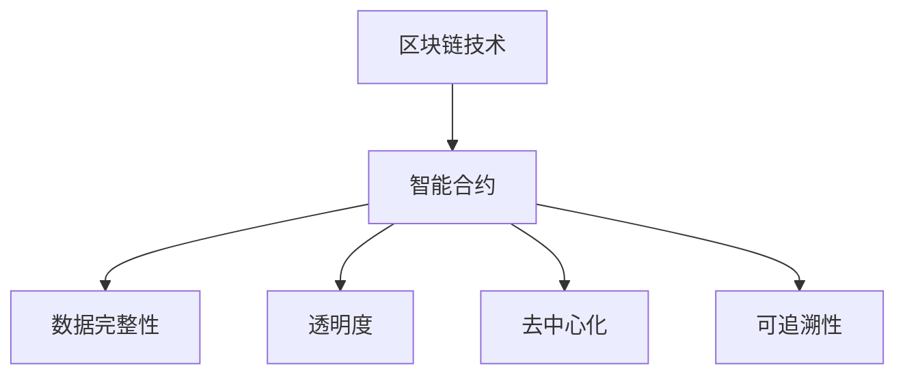

                 

# 知识发现引擎的区块链技术应用

> 关键词：知识发现引擎, 区块链技术, 智能合约, 数据安全, 透明性, 去中心化, 可追溯性

## 1. 背景介绍

在信息时代，知识发现引擎(Knowledge Discovery Engine, KDE)成为了数据驱动决策和智能分析的重要工具。传统知识发现引擎主要依赖于中心化的数据库系统，存在数据孤岛、信息泄露、操作不可信等风险。而区块链技术的出现，为知识发现引擎带来了全新的思路和方法，旨在通过分布式账本技术实现数据的去中心化、透明性和不可篡改性。

本文旨在探讨区块链技术如何应用于知识发现引擎，如何在知识发现过程中保持数据的完整性和安全性，并通过智能合约自动执行复杂的逻辑操作。我们将从区块链的架构和特点出发，逐步深入了解其对知识发现引擎的影响，并分析具体应用场景。

## 2. 核心概念与联系

### 2.1 核心概念概述

为更好地理解区块链技术在知识发现引擎中的应用，我们需要先掌握一些核心概念：

- **区块链技术**：一种去中心化的分布式账本技术，通过共识机制实现账本数据的不可篡改性和透明性。

- **智能合约**：一种自动执行的合约，通过区块链技术在代码层面上实现复杂的业务逻辑和数据操作。

- **数据完整性**：保证数据的原始性和完整性，防止数据在传输和存储过程中被篡改。

- **透明度**：确保数据的可追溯性和公开性，使参与方可以随时查看和验证数据的来源和流向。

- **去中心化**：通过分布式节点网络去除中心化管理，提高系统的鲁棒性和抗攻击能力。

- **可追溯性**：实现数据操作的记录和审计，追溯数据流动的路径和历史。

这些概念之间的关系可以通过以下Mermaid流程图来展示：



这个流程图展示了区块链技术如何通过智能合约实现数据的完整性、透明度、去中心化和可追溯性，共同构建了一个安全、可信的知识发现引擎。

## 3. 核心算法原理 & 具体操作步骤
### 3.1 算法原理概述

区块链技术在知识发现引擎中的应用，主要体现在以下几个方面：

- **数据存储和分发**：利用区块链的分布式账本特性，实现知识数据的分散存储和同步分发，避免数据孤岛和信息不对称。

- **数据溯源和验证**：通过区块链的不可篡改性，确保知识数据来源的透明和可追溯，方便进行数据审计和验证。

- **共识机制和治理**：引入区块链的共识机制，保证数据操作的正确性和公正性，通过智能合约自动执行复杂的逻辑操作，实现数据的智能管理和治理。

### 3.2 算法步骤详解

区块链技术应用于知识发现引擎，主要包含以下几个步骤：

1. **数据采集和预处理**：
   - 通过分布式节点网络采集知识数据，并进行预处理，如去重、清洗、标准化等。
   - 利用智能合约自动执行数据预处理逻辑，减少人为操作，提高数据质量。

2. **知识数据上链**：
   - 将预处理后的知识数据通过智能合约封装成区块，并发布到区块链网络。
   - 智能合约自动验证数据格式和内容，确保数据完整性和一致性。

3. **数据查询和分析**：
   - 用户可以通过智能合约接口查询区块链上的知识数据，进行数据分析和挖掘。
   - 智能合约自动执行复杂的数据分析逻辑，如关联规则、聚类、分类等，提供智能化的分析结果。

4. **数据共享与协作**：
   - 利用区块链的去中心化特性，实现多个参与方之间的数据共享与协作，减少数据孤岛和信息不对称。
   - 智能合约自动管理数据共享规则，确保数据交换的公平性和安全性。

### 3.3 算法优缺点

区块链技术应用于知识发现引擎，具有以下优点：

- **数据透明和可追溯性**：区块链的分布式账本保证了数据操作的透明和可追溯，便于数据审计和验证。
- **去中心化和分布式存储**：区块链的去中心化特性避免了数据孤岛和信息不对称，提高了系统的鲁棒性和抗攻击能力。
- **自动执行和智能管理**：通过智能合约自动执行复杂的逻辑操作，实现数据的智能管理和治理。

同时，也存在以下缺点：

- **性能瓶颈**：大规模数据的上链和查询操作可能会影响区块链网络的性能。
- **存储成本高**：分布式账本需要大量存储空间，增加系统的存储成本。
- **智能合约复杂性**：智能合约的设计和实现需要较高的技术门槛，存在代码复杂性和漏洞风险。

### 3.4 算法应用领域

区块链技术在知识发现引擎中的应用，主要应用于以下领域：

1. **科学研究与协作**：
   - 在科学研究领域，区块链技术可以实现研究数据的分散存储和共享，便于研究人员进行协作和数据验证。
   - 通过智能合约自动执行研究流程和数据管理，提高研究的透明度和可重复性。

2. **医疗健康与数据安全**：
   - 在医疗健康领域，区块链技术可以实现患者数据的隐私保护和去中心化存储，防止数据泄露和篡改。
   - 通过智能合约自动执行医疗操作和数据管理，提高医疗数据的完整性和安全性。

3. **金融行业与交易记录**：
   - 在金融行业，区块链技术可以实现交易记录的分散存储和共享，防止数据篡改和欺诈。
   - 通过智能合约自动执行交易逻辑和风险控制，提高交易的透明度和公正性。

4. **供应链管理与溯源**：
   - 在供应链管理领域，区块链技术可以实现供应链数据的透明和可追溯，便于供应链管理与溯源。
   - 通过智能合约自动执行供应链操作和数据管理，提高供应链的效率和透明度。

5. **知识产权与版权保护**：
   - 在知识产权领域，区块链技术可以实现知识产权的数字化和去中心化管理，防止盗版和侵权。
   - 通过智能合约自动执行知识产权的授权和监管，保护知识产权的权益。

## 4. 数学模型和公式 & 详细讲解 & 举例说明

### 4.1 数学模型构建

知识发现引擎中的数据处理和分析，可以通过数学模型进行建模和计算。以下以关联规则挖掘为例，介绍数学模型的构建方法。

假设知识数据为 $D=\{I_1,I_2,...,I_n\}$，其中 $I_i$ 为单个数据项。设 $X$ 和 $Y$ 为两个数据项集合，分别表示 $X$ 和 $Y$ 项集的出现频率，则关联规则 $X \rightarrow Y$ 的置信度为：

$$
\text{Conf}(X \rightarrow Y) = \frac{N(X \cup Y)}{N(X)}
$$

其中 $N(X \cup Y)$ 为同时出现 $X$ 和 $Y$ 的数据项数量，$N(X)$ 为出现 $X$ 的数据项数量。

### 4.2 公式推导过程

关联规则挖掘的数学模型推导如下：

1. 计算每个数据项的出现频率，构建频度矩阵 $F$。

2. 计算所有可能的出现 $X$ 和 $Y$ 项集的出现频率，构建频率矩阵 $F_{X,Y}$。

3. 计算置信度 $\text{Conf}(X \rightarrow Y)$，并筛选出满足最小置信度的规则。

4. 对于每个规则 $X \rightarrow Y$，计算提升度 $\text{Lift}(X \rightarrow Y)$，筛选出满足最小提升度的规则。

5. 最终得到满足置信度和提升度的规则集合。

### 4.3 案例分析与讲解

以电商平台为例，利用区块链技术实现基于用户行为数据的关联规则挖掘。

1. 数据采集和预处理：
   - 通过区块链节点采集用户行为数据，如浏览记录、购买记录等。
   - 利用智能合约自动清洗和标准化数据，去除异常和重复记录。

2. 知识数据上链：
   - 将预处理后的用户行为数据通过智能合约封装成区块，并发布到区块链网络。
   - 智能合约自动验证数据格式和内容，确保数据完整性和一致性。

3. 数据查询和分析：
   - 用户可以通过智能合约接口查询用户行为数据，进行关联规则挖掘。
   - 智能合约自动执行关联规则逻辑，如关联规则、聚类、分类等，提供智能化的推荐结果。

4. 数据共享与协作：
   - 利用区块链的去中心化特性，实现电商平台之间的数据共享与协作。
   - 智能合约自动管理数据共享规则，确保数据交换的公平性和安全性。

## 5. 项目实践：代码实例和详细解释说明
### 5.1 开发环境搭建

在进行知识发现引擎的区块链应用实践前，我们需要准备好开发环境。以下是使用Python进行Hyperledger Fabric开发的环境配置流程：

1. 安装Hyperledger Fabric CLI工具：
```bash
git clone https://github.com/hyperledger/fabric
cd fabric
make envsubst PLAT=linux-gnu
```

2. 安装必要的依赖软件：
```bash
sudo apt-get install go golang-1.13-openjdk-8-jdk-headless libpq-dev postgresql postgresql-contrib libffi-dev libssl-dev
```

3. 启动Hyperledger Fabric网络：
```bash
docker-compose -f docker-compose-dev-network.yml up -d
```

4. 安装Hyperledger Fabric SDK：
```bash
make install-sdk
```

### 5.2 源代码详细实现

这里我们以电商平台为例，编写一个基于Hyperledger Fabric的区块链应用。

1. 创建一个区块链通道：
```python
from hfc.fabric import Fabric

fabric = Fabric('mychannel')
```

2. 创建智能合约：
```python
from hfc.fabric import SmartContract
from hfc.fabric import Chaincode

class MyContract(SmartContract):
    def __init__(self):
        pass

    def query(self, req):
        # 实现查询用户行为数据的方法
        pass

    def analyze(self, req):
        # 实现关联规则分析的方法
        pass

    def execute(self, req):
        # 实现智能合约自动执行的方法
        pass

chaincode = Chaincode(name='mycontract', chaincode_id='mycontract', version='1.0')
```

3. 部署智能合约：
```python
fabric.expand cartridge upload -c mychannel -f app-cartridge.json
```

4. 查询和分析用户行为数据：
```python
mycontract = SmartContract(
    Fabric(), 
    'mychannel', 
    'mycontract', 
    '1.0'
)

# 查询用户行为数据
response = mycontract.query('query')
# 分析关联规则
response = mycontract.analyze('analyze')
# 自动执行规则逻辑
response = mycontract.execute('execute')
```

### 5.3 代码解读与分析

让我们再详细解读一下关键代码的实现细节：

**Fabric类**：
- 实现了与Hyperledger Fabric网络的连接和交互，是进行区块链应用开发的基础。

**SmartContract类**：
- 继承自Fabric类，是定义智能合约逻辑的关键。
- 实现了查询、分析和执行三种方法，对应于数据查询、关联规则分析和逻辑执行。

**chaincode模块**：
- 用于定义智能合约的属性，如名称、版本、代码等。
- 通过指定chaincode.json文件，可以在区块链上部署智能合约。

通过上述代码的实现，我们可以看到，基于Hyperledger Fabric的区块链应用，可以通过智能合约实现数据的查询、分析和自动执行。智能合约的设计和实现需要根据具体场景进行调整，以适应不同的数据处理和业务逻辑需求。

### 5.4 运行结果展示

通过智能合约的部署和运行，我们可以获得智能化的用户行为分析和关联规则挖掘结果。以下是一个简单的示例：

```python
# 查询用户行为数据
response = mycontract.query('query')
# 分析关联规则
response = mycontract.analyze('analyze')
# 自动执行规则逻辑
response = mycontract.execute('execute')
```

通过运行以上代码，我们可以在区块链上查询用户行为数据，分析关联规则，并自动执行规则逻辑，获取智能化的推荐结果。

## 6. 实际应用场景
### 6.1 科学研究与协作

在科学研究领域，区块链技术可以实现研究数据的分散存储和共享，便于研究人员进行协作和数据验证。通过智能合约自动执行研究流程和数据管理，提高研究的透明度和可重复性。

### 6.2 医疗健康与数据安全

在医疗健康领域，区块链技术可以实现患者数据的隐私保护和去中心化存储，防止数据泄露和篡改。通过智能合约自动执行医疗操作和数据管理，提高医疗数据的完整性和安全性。

### 6.3 金融行业与交易记录

在金融行业，区块链技术可以实现交易记录的分散存储和共享，防止数据篡改和欺诈。通过智能合约自动执行交易逻辑和风险控制，提高交易的透明度和公正性。

### 6.4 供应链管理与溯源

在供应链管理领域，区块链技术可以实现供应链数据的透明和可追溯，便于供应链管理与溯源。通过智能合约自动执行供应链操作和数据管理，提高供应链的效率和透明度。

### 6.5 知识产权与版权保护

在知识产权领域，区块链技术可以实现知识产权的数字化和去中心化管理，防止盗版和侵权。通过智能合约自动执行知识产权的授权和监管，保护知识产权的权益。

## 7. 工具和资源推荐
### 7.1 学习资源推荐

为了帮助开发者系统掌握区块链技术在知识发现引擎中的应用，这里推荐一些优质的学习资源：

1. Hyperledger Fabric官方文档：Hyperledger Fabric的官方文档，提供了完整的开发指南和样例代码，是入门区块链应用开发的首选。

2. 《区块链技术与数据安全》书籍：介绍区块链技术的基本原理和应用场景，重点讲解区块链在数据安全方面的作用。

3. 《智能合约设计与实现》书籍：详细讲解智能合约的设计和实现方法，适用于区块链应用开发的实践参考。

4. 《Hyperledger Fabric入门与实战》课程：由Hyperledger Fabric社区和国内领先的教育平台联合开设的课程，涵盖Hyperledger Fabric基础、开发、应用等多个方面。

5. 区块链技术社区和博客：如Blockchain District、Coindesk等，提供区块链技术动态、项目案例和开发经验分享。

通过对这些资源的学习实践，相信你一定能够快速掌握区块链技术在知识发现引擎中的应用，并用于解决实际的业务问题。

### 7.2 开发工具推荐

高效的开发离不开优秀的工具支持。以下是几款用于区块链应用开发的常用工具：

1. Hyperledger Fabric CLI：Hyperledger Fabric的命令行工具，方便进行区块链网络的配置和管理。

2. IDEA：基于Hyperledger Fabric的开发环境，提供代码编写、调试、测试等功能。

3. Consensus Debugger：Hyperledger Fabric的调试工具，帮助开发者快速定位和修复问题。

4. Smart Contract Studio：智能合约开发工具，支持代码编写、编译、部署等操作，适用于智能合约的快速开发。

5. GO语言开发工具：如Golang、Godev等，提供GO语言开发所需的环境和工具支持。

合理利用这些工具，可以显著提升区块链应用开发的效率，加快创新迭代的步伐。

### 7.3 相关论文推荐

区块链技术在知识发现引擎中的应用，仍处于快速发展的阶段。以下是几篇奠基性的相关论文，推荐阅读：

1. Satoshi Nakamoto, "Bitcoin: A Peer-to-Peer Electronic Cash System"：区块链技术的起源，介绍了比特币的实现原理和特点。

2. Ethereum白皮书：介绍Ethereum平台及其智能合约机制，为区块链应用提供了重要的参考。

3. 《基于区块链的供应链管理系统设计》论文：详细讲解了区块链在供应链管理中的应用，提出了供应链数据共享和透明性的解决方案。

4. 《区块链在科学研究中的应用》论文：探讨了区块链技术在科学研究中的作用，提出了一种基于区块链的数据共享和协作机制。

5. 《区块链与知识产权保护》论文：分析了区块链技术在知识产权保护中的应用，提出了基于区块链的数字版权管理方案。

这些论文代表了区块链技术在知识发现引擎中的最新研究进展，通过学习这些前沿成果，可以帮助研究者把握学科前进方向，激发更多的创新灵感。

## 8. 总结：未来发展趋势与挑战
### 8.1 总结

本文对区块链技术在知识发现引擎中的应用进行了全面系统的介绍。首先阐述了区块链技术的背景和特点，明确了其在知识发现过程中保持数据的完整性和安全性方面的优势。其次，从原理到实践，详细讲解了区块链技术在知识发现引擎中的应用步骤，并提供了具体的代码实现。同时，本文还广泛探讨了区块链技术在多个行业领域的应用场景，展示了其广阔的前景。

通过本文的系统梳理，可以看到，区块链技术在知识发现引擎中的应用，可以有效地解决数据孤岛、信息泄露、操作不可信等问题，提高了系统的透明性、去中心化和鲁棒性。未来的研究将在数据存储、查询、分析、共享等方面进行更深入的探索和优化，助力知识发现引擎迈向新的高度。

### 8.2 未来发展趋势

展望未来，区块链技术在知识发现引擎中的应用，将呈现以下几个发展趋势：

1. **去中心化和分布式存储**：随着区块链技术的不断成熟，分布式存储和去中心化特性将得到更广泛的应用，实现数据的广泛共享和协作。

2. **智能合约和自动化治理**：智能合约的普及将使知识发现引擎的管理和治理更加自动化和智能化，降低人为干预和操作风险。

3. **跨链交互和跨领域应用**：区块链的跨链技术将打破不同区块链之间的数据壁垒，实现知识数据的跨领域应用和共享。

4. **数据隐私和安全**：随着隐私计算和数据保护技术的进步，区块链在数据隐私和安全方面的应用将更加成熟，增强数据的安全性和用户隐私。

5. **大规模数据处理**：基于区块链的数据处理和分析能力将不断提升，能够处理大规模数据，实现高效的知识发现和分析。

6. **行业应用拓展**：区块链技术在金融、医疗、科研、供应链等多个领域的应用将进一步拓展，推动各行业的智能化和数字化进程。

以上趋势凸显了区块链技术在知识发现引擎中的巨大潜力，必将进一步推动知识的共享和创新，提升社会生产力和科技水平。

### 8.3 面临的挑战

尽管区块链技术在知识发现引擎中的应用前景广阔，但也面临着诸多挑战：

1. **性能瓶颈**：大规模数据的上链和查询操作可能会影响区块链网络的性能，需要进一步优化共识机制和存储策略。

2. **存储成本高**：分布式账本需要大量存储空间，增加系统的存储成本，需要探索更高效的数据存储和压缩方法。

3. **智能合约复杂性**：智能合约的设计和实现需要较高的技术门槛，存在代码复杂性和漏洞风险，需要进一步提高智能合约的可扩展性和安全性。

4. **跨链交互难度**：跨链技术的复杂性和安全性问题需要进一步解决，确保跨链数据的安全和可靠传输。

5. **数据隐私和安全**：如何在保护用户隐私的同时，确保数据的安全性和透明性，需要进一步探索隐私计算和数据保护技术。

6. **行业应用落地**：各行业对区块链技术的接受度和应用需求存在差异，需要根据不同行业特点进行定制化开发和推广。

正视区块链技术在知识发现引擎中的应用面临的这些挑战，积极应对并寻求突破，将是大规模数据管理和知识发现的必然选择。

### 8.4 研究展望

未来的研究需要在以下几个方面寻求新的突破：

1. **去中心化和分布式存储**：探索更高效的去中心化和分布式存储技术，降低存储成本和提高系统性能。

2. **智能合约和自动化治理**：开发更加智能和安全的智能合约，提高自动化治理的效率和公平性。

3. **跨链交互和跨领域应用**：研究跨链交互技术，促进不同区块链之间的数据共享和协同。

4. **数据隐私和安全**：探索隐私计算和数据保护技术，提高数据隐私和安全保护水平。

5. **大规模数据处理**：研究高效的数据处理和分析技术，提高大规模数据的处理能力。

6. **行业应用落地**：针对不同行业特点，进行定制化开发和推广，提升区块链技术在各行业的落地效果。

这些研究方向将引领区块链技术在知识发现引擎中的进一步发展，推动知识的共享和创新，提升社会生产力和科技水平。

## 9. 附录：常见问题与解答

**Q1：什么是区块链技术？**

A: 区块链技术是一种去中心化的分布式账本技术，通过共识机制实现账本数据的不可篡改性和透明性。

**Q2：区块链技术在知识发现引擎中的应用主要体现在哪些方面？**

A: 区块链技术在知识发现引擎中的应用主要体现在数据存储和分发、数据溯源和验证、共识机制和治理等方面。

**Q3：区块链技术如何提高知识数据的安全性和透明性？**

A: 区块链技术通过分布式账本和不可篡改性，确保知识数据的完整性和透明度。智能合约自动执行和审计，进一步提高数据的安全性和透明性。

**Q4：区块链技术在知识发现引擎中如何实现数据共享和协作？**

A: 利用区块链的去中心化特性，实现多个参与方之间的数据共享与协作，减少数据孤岛和信息不对称。智能合约自动管理数据共享规则，确保数据交换的公平性和安全性。

**Q5：区块链技术在知识发现引擎中如何实现数据的智能分析和挖掘？**

A: 通过智能合约自动执行复杂的逻辑操作，实现数据的智能管理和治理。利用区块链的分布式账本和智能合约，进行数据的查询、分析和挖掘，提供智能化的分析结果。

通过本文的系统梳理，可以看到，区块链技术在知识发现引擎中的应用，具有重要的学术价值和现实意义。相信随着技术的不断进步和应用实践的积累，区块链技术将为知识发现引擎的发展提供更加广阔的空间。

