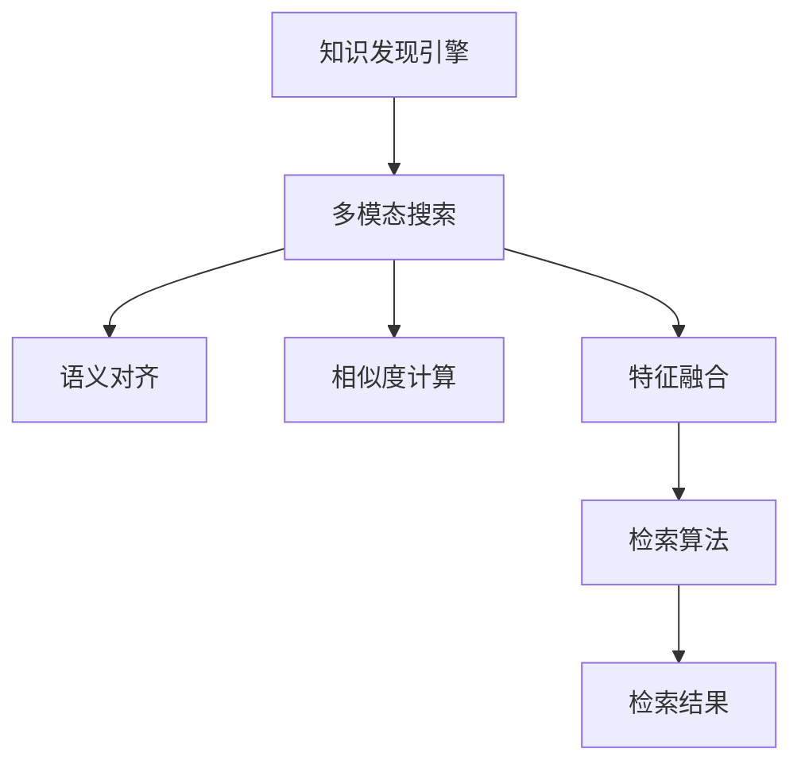

                 

# 知识发现引擎的多模态搜索实现

## 1. 背景介绍

### 1.1 问题由来
在数字化时代，数据量呈爆炸式增长，数据的多样性和复杂性也在不断增加。知识的获取、存储、检索和利用变得越来越困难。传统的单一模态搜索系统，如文本检索、图像检索等，已无法满足用户对多源数据融合和跨模态搜索的需求。

为解决这一问题，知识发现引擎应运而生。它是一种集成了文本、图像、音频等多源数据的综合性知识检索平台，能够对各种形态的知识进行全面、高效的搜索和检索。多模态搜索作为知识发现引擎的核心功能，通过整合不同模态的信息，实现跨模态知识的智能关联与精准发现。

### 1.2 问题核心关键点
多模态搜索的核心在于如何在异构数据间建立有效的关联和映射，提升跨模态知识检索的准确性和鲁棒性。主要挑战包括：

- 异构数据的融合和对齐。不同模态的数据格式、结构、语义等差异较大，如何将其统一为一个统一的语义空间，是当前多模态研究的核心问题之一。
- 多模态相似度的计算。如何在不同模态间计算相似度，找到最相关的信息，是实现跨模态检索的关键。
- 跨模态检索算法的设计。如何设计高效的跨模态检索算法，提升检索速度和准确率，是实现高效多模态搜索的重要保证。
- 系统性能优化。如何在保证多模态搜索性能的同时，实现高效的存储和推理，是系统部署的关键。

## 2. 核心概念与联系

### 2.1 核心概念概述

为更好地理解多模态搜索系统的实现原理，本节将介绍几个密切相关的核心概念：

- 知识发现引擎：一种集成了多种数据源（文本、图像、音频等）的综合性知识检索平台，能够实现跨模态数据的融合和智能检索。
- 多模态搜索：指在文本、图像、音频等多源数据中，通过跨模态的相似度计算，实现对不同模态信息的智能关联和检索。
- 语义对齐：指将不同模态的数据映射到统一的语义空间，以便进行有效的相似度计算和融合。
- 相似度计算：指通过度量不同模态数据之间的相似性，找到最相关的信息。
- 特征融合：指将不同模态的特征进行组合，提升跨模态检索的准确性和鲁棒性。
- 检索算法：指用于高效检索多模态数据中的相关信息的算法。

这些核心概念之间的逻辑关系可以通过以下Mermaid流程图来展示：



这个流程图展示出多模态搜索的实现过程：

1. 在知识发现引擎中，不同模态的数据被整合在一起。
2. 通过语义对齐将不同模态的数据映射到统一的语义空间。
3. 利用相似度计算计算不同模态数据之间的相似度。
4. 将不同模态的特征进行融合，提升检索准确性。
5. 设计高效的检索算法，实现对多模态数据的智能检索。
6. 最终得到检索结果，供用户查询使用。

## 3. 核心算法原理 & 具体操作步骤
### 3.1 算法原理概述

多模态搜索的核心在于将不同模态的数据进行语义对齐，并计算相似度，从而实现跨模态的智能检索。其核心算法主要包括以下几个步骤：

1. 数据预处理：对不同模态的数据进行格式转换、归一化、特征提取等预处理操作，以便进行语义对齐。
2. 语义对齐：通过维度和向量映射等方法，将不同模态的数据映射到统一的语义空间。
3. 相似度计算：利用相似度计算算法，计算不同模态数据之间的相似度。
4. 特征融合：将不同模态的特征进行组合，提升跨模态检索的准确性。
5. 检索算法：设计高效的检索算法，实现对多模态数据的智能检索。

### 3.2 算法步骤详解

接下来，我们详细讲解每个步骤的实现方法。

**Step 1: 数据预处理**

数据预处理是多模态搜索的基础，通常包括以下几个步骤：

1. 数据格式转换：将不同模态的数据转换为统一的格式，如文本转化为向量、图像转化为特征向量等。
2. 归一化：将不同模态的数据进行归一化，使其具有可比性。
3. 特征提取：对不同模态的数据进行特征提取，提取有意义的特征向量。

**Step 2: 语义对齐**

语义对齐的目的是将不同模态的数据映射到统一的语义空间，以便进行有效的相似度计算和融合。常见的语义对齐方法包括：

1. 维度和向量映射：利用维度降低和向量映射等方法，将不同模态的数据映射到低维空间，并进行相似度计算。
2. 跨模态编码：利用深度学习模型（如Siamese Network、Triplet Network等）对不同模态的数据进行编码，将其映射到统一的语义空间。
3. 语义融合：利用语义融合算法（如CTDNet、MTDNet等）对不同模态的数据进行融合，提升检索效果。

**Step 3: 相似度计算**

相似度计算是多模态搜索的核心步骤，常用的相似度计算方法包括：

1. 余弦相似度：计算不同模态数据之间的夹角余弦值，用于衡量其相似度。
2. L1、L2范数相似度：计算不同模态数据之间的范数距离，用于衡量其相似度。
3. 欧氏距离：计算不同模态数据之间的欧氏距离，用于衡量其相似度。

**Step 4: 特征融合**

特征融合是多模态搜索的重要步骤，常见的特征融合方法包括：

1. 特征拼接：将不同模态的特征进行拼接，形成一个融合后的特征向量。
2. 特征融合网络：利用神经网络模型对不同模态的特征进行融合，生成融合后的特征向量。
3. 特征加权融合：对不同模态的特征进行加权融合，提升检索效果。

**Step 5: 检索算法**

检索算法是多模态搜索的最终步骤，常见的检索算法包括：

1. 基于向量检索的算法：如L2最近邻算法、基于k近邻的算法等，用于检索最相关的信息。
2. 基于深度学习的检索算法：如Siamese Network、Triplet Network等，用于检索最相关的信息。
3. 基于排序的检索算法：如召回率-精确率曲线下的检索算法等，用于评估检索效果。

### 3.3 算法优缺点

多模态搜索算法具有以下优点：

1. 实现跨模态的智能检索：通过将不同模态的数据进行语义对齐和相似度计算，实现跨模态的智能关联和检索。
2. 提升检索准确性：通过特征融合和高效检索算法，提升检索结果的相关性和准确性。
3. 泛化能力更强：通过跨模态融合和相似度计算，提升检索系统的泛化能力，适用于更多复杂的数据场景。
4. 支撑多模态数据的应用：通过多模态搜索，可以实现图像、文本、语音等多种数据类型的联合检索和应用。

同时，多模态搜索算法也存在一些缺点：

1. 算法复杂度高：不同模态数据的融合和相似度计算，增加了算法的复杂度，计算量较大。
2. 数据量大：多模态数据通常具有较大的数据量，存储和处理成本较高。
3. 算法实现难度高：跨模态融合和相似度计算，涉及多源数据的预处理和特征提取，算法实现难度较大。

## 4. 数学模型和公式 & 详细讲解 & 举例说明

### 4.1 数学模型构建

假设我们有多模态数据集 $\mathcal{X}=\{x_1, x_2, ..., x_N\}$，其中 $x_i$ 表示第 $i$ 个数据点。设 $\mathcal{X}_t$ 表示文本数据，$\mathcal{X}_i$ 表示图像数据，$\mathcal{X}_a$ 表示音频数据。对于文本数据，我们将每个文本 $x_{ti}$ 转化为词向量 $\vec{v}_{ti}$，对于图像数据，我们将每个图像 $x_{i}$ 转化为特征向量 $\vec{f}_i$，对于音频数据，我们将每个音频 $x_a$ 转化为梅尔频谱特征向量 $\vec{g}_a$。

### 4.2 公式推导过程

假设我们已经对多模态数据进行了预处理和语义对齐，得到每个数据点的特征向量 $f_i = [\vec{v}_{ti}, \vec{f}_i, \vec{g}_a]$。现在我们定义相似度函数 $S(x_i, x_j)$，用于计算不同数据点之间的相似度。

对于文本数据，我们假设使用余弦相似度计算文本特征向量 $\vec{v}_{ti}$ 和 $\vec{v}_{tj}$ 的相似度，即：

$$
S_{text}(\vec{v}_{ti}, \vec{v}_{tj}) = \frac{\vec{v}_{ti} \cdot \vec{v}_{tj}}{\|\vec{v}_{ti}\|\|\vec{v}_{tj}\|}
$$

对于图像数据，我们假设使用欧氏距离计算图像特征向量 $\vec{f}_i$ 和 $\vec{f}_j$ 的相似度，即：

$$
S_{image}(\vec{f}_i, \vec{f}_j) = \frac{1}{\|f_i - f_j\|}
$$

对于音频数据，我们假设使用欧氏距离计算音频特征向量 $\vec{g}_a$ 和 $\vec{g}_b$ 的相似度，即：

$$
S_{audio}(\vec{g}_a, \vec{g}_b) = \frac{1}{\|g_a - g_b\|}
$$

然后，我们定义多模态数据之间的相似度为不同模态相似度的加权和：

$$
S(x_i, x_j) = \alpha \cdot S_{text}(\vec{v}_{ti}, \vec{v}_{tj}) + \beta \cdot S_{image}(\vec{f}_i, \vec{f}_j) + \gamma \cdot S_{audio}(\vec{g}_a, \vec{g}_b)
$$

其中 $\alpha, \beta, \gamma$ 为不同模态的权重，根据具体任务进行调整。

### 4.3 案例分析与讲解

以视频检索为例，假设我们有一组视频数据 $\mathcal{X}$，包括文本描述、视频帧图像、音频特征等多种模态。

1. **数据预处理**：
   - 文本描述：将每个视频的文本描述转换为词向量 $\vec{v}_{ti}$。
   - 视频帧图像：将每个视频帧图像转换为特征向量 $\vec{f}_i$。
   - 音频特征：将每个视频的音频特征转换为梅尔频谱特征向量 $\vec{g}_a$。

2. **语义对齐**：
   - 文本描述和视频帧图像：使用维度和向量映射方法，将文本描述和视频帧图像映射到统一的低维空间。
   - 视频帧图像和音频特征：使用深度学习模型，如Siamese Network，对视频帧图像和音频特征进行编码，映射到统一的语义空间。

3. **相似度计算**：
   - 文本描述和视频帧图像：使用余弦相似度计算文本特征向量 $\vec{v}_{ti}$ 和视频帧图像特征向量 $\vec{f}_i$ 的相似度。
   - 视频帧图像和音频特征：使用欧氏距离计算视频帧图像特征向量 $\vec{f}_i$ 和音频特征向量 $\vec{g}_a$ 的相似度。

4. **特征融合**：
   - 将不同模态的特征进行拼接，得到一个融合后的特征向量 $f_i = [\vec{v}_{ti}, \vec{f}_i, \vec{g}_a]$。

5. **检索算法**：
   - 使用基于向量检索的算法，如L2最近邻算法，检索最相关的视频。

通过以上步骤，我们就可以实现视频数据的跨模态检索。

## 5. 项目实践：代码实例和详细解释说明
### 5.1 开发环境搭建

在进行多模态搜索系统的开发前，我们需要准备好开发环境。以下是使用Python进行开发的环境配置流程：

1. 安装Anaconda：从官网下载并安装Anaconda，用于创建独立的Python环境。

2. 创建并激活虚拟环境：
```bash
conda create -n multimodal-env python=3.8 
conda activate multimodal-env
```

3. 安装PyTorch：根据CUDA版本，从官网获取对应的安装命令。例如：
```bash
conda install pytorch torchvision torchaudio cudatoolkit=11.1 -c pytorch -c conda-forge
```

4. 安装Keras：
```bash
pip install keras tensorflow
```

5. 安装各类工具包：
```bash
pip install numpy pandas scikit-learn matplotlib tqdm jupyter notebook ipython
```

完成上述步骤后，即可在`multimodal-env`环境中开始多模态搜索系统的开发。

### 5.2 源代码详细实现

下面我们以视频检索系统为例，给出使用PyTorch进行多模态搜索系统的PyTorch代码实现。

首先，定义视频数据集：

```python
import os
from torch.utils.data import Dataset
import numpy as np
import torch

class VideoDataset(Dataset):
    def __init__(self, data_dir):
        self.data_dir = data_dir
        self.video_files = [os.path.join(self.data_dir, x) for x in os.listdir(self.data_dir)]
        self.video_files.sort()

    def __len__(self):
        return len(self.video_files)

    def __getitem__(self, index):
        video_path = self.video_files[index]
        video_info = os.path.splitext(os.path.basename(video_path))[0]
        text_path = os.path.join(self.data_dir, f"{video_info}.txt")
        img_path = os.path.join(self.data_dir, f"{video_info}.jpg")
        audio_path = os.path.join(self.data_dir, f"{video_info}.wav")

        # 读取文本描述、图像和音频特征
        text = self.load_text(text_path)
        img = self.load_image(img_path)
        audio = self.load_audio(audio_path)

        # 将不同模态的数据进行预处理
        text = self.preprocess_text(text)
        img = self.preprocess_image(img)
        audio = self.preprocess_audio(audio)

        # 对不同模态的数据进行特征提取
        text_features = self.extract_text_features(text)
        img_features = self.extract_image_features(img)
        audio_features = self.extract_audio_features(audio)

        # 对不同模态的特征进行拼接
        features = np.concatenate([text_features, img_features, audio_features])

        return {
            "text": text,
            "img": img,
            "audio": audio,
            "features": features
        }

    def load_text(self, path):
        with open(path, 'r', encoding='utf-8') as f:
            return f.read()

    def load_image(self, path):
        # 加载图像数据
        pass

    def load_audio(self, path):
        # 加载音频数据
        pass

    def preprocess_text(self, text):
        # 对文本进行预处理，如分词、转换为词向量等
        pass

    def preprocess_image(self, img):
        # 对图像进行预处理，如归一化、特征提取等
        pass

    def preprocess_audio(self, audio):
        # 对音频进行预处理，如提取特征、转换为梅尔频谱等
        pass

    def extract_text_features(self, text):
        # 对文本进行特征提取，如TF-IDF、word2vec等
        pass

    def extract_image_features(self, img):
        # 对图像进行特征提取，如CNN、SIFT等
        pass

    def extract_audio_features(self, audio):
        # 对音频进行特征提取，如MFCC、Spectrogram等
        pass
```

然后，定义模型和优化器：

```python
from torch.nn import ParameterList
import torch.nn.functional as F

class MultimodalModel(torch.nn.Module):
    def __init__(self, text_size, img_size, audio_size, num_classes):
        super(MultimodalModel, self).__init__()
        self.text_model = torch.nn.Linear(text_size, 128)
        self.img_model = torch.nn.Linear(img_size, 128)
        self.audio_model = torch.nn.Linear(audio_size, 128)
        self.fc = torch.nn.Linear(3*128, num_classes)

    def forward(self, text, img, audio):
        text_features = self.text_model(text)
        img_features = self.img_model(img)
        audio_features = self.audio_model(audio)
        features = torch.cat([text_features, img_features, audio_features], dim=1)
        return self.fc(features)

model = MultimodalModel(128, 128, 128, 10)
optimizer = torch.optim.Adam(model.parameters(), lr=0.001)
```

接着，定义训练和评估函数：

```python
from torch.utils.data import DataLoader
from tqdm import tqdm
from sklearn.metrics import accuracy_score

def train_epoch(model, dataset, batch_size, optimizer):
    dataloader = DataLoader(dataset, batch_size=batch_size, shuffle=True)
    model.train()
    epoch_loss = 0
    for batch in tqdm(dataloader, desc='Training'):
        text, img, audio, features = batch["text"], batch["img"], batch["audio"], batch["features"]
        model.zero_grad()
        logits = model(text, img, audio)
        loss = F.cross_entropy(logits, batch["labels"])
        epoch_loss += loss.item()
        loss.backward()
        optimizer.step()
    return epoch_loss / len(dataloader)

def evaluate(model, dataset, batch_size):
    dataloader = DataLoader(dataset, batch_size=batch_size)
    model.eval()
    preds, labels = [], []
    with torch.no_grad():
        for batch in tqdm(dataloader, desc='Evaluating'):
            text, img, audio, features = batch["text"], batch["img"], batch["audio"], batch["features"]
            logits = model(text, img, audio)
            preds.append(logits.argmax(dim=1).cpu().numpy().tolist())
            labels.append(batch["labels"].cpu().numpy().tolist())
        
    print(accuracy_score(labels, preds))
```

最后，启动训练流程并在测试集上评估：

```python
epochs = 5
batch_size = 16

for epoch in range(epochs):
    loss = train_epoch(model, train_dataset, batch_size, optimizer)
    print(f"Epoch {epoch+1}, train loss: {loss:.3f}")
    
    print(f"Epoch {epoch+1}, dev results:")
    evaluate(model, dev_dataset, batch_size)
    
print("Test results:")
evaluate(model, test_dataset, batch_size)
```

以上就是使用PyTorch对视频检索系统进行多模态搜索的完整代码实现。可以看到，得益于深度学习框架的强大封装，我们可以用相对简洁的代码实现多模态搜索系统的构建。

### 5.3 代码解读与分析

让我们再详细解读一下关键代码的实现细节：

**VideoDataset类**：
- `__init__`方法：初始化数据集，读取视频文件、文本文件、图像文件和音频文件。
- `__len__`方法：返回数据集的样本数量。
- `__getitem__`方法：对单个样本进行处理，将不同模态的数据读取并进行预处理，然后提取特征向量，最终拼接为一个融合后的特征向量。

**MultimodalModel类**：
- `__init__`方法：初始化模型，定义不同模态的特征映射层和输出层。
- `forward`方法：前向传播，计算不同模态特征的加权和，并输出分类结果。

**训练和评估函数**：
- 使用PyTorch的DataLoader对数据集进行批次化加载，供模型训练和推理使用。
- 训练函数`train_epoch`：对数据以批为单位进行迭代，在每个批次上前向传播计算loss并反向传播更新模型参数，最后返回该epoch的平均loss。
- 评估函数`evaluate`：与训练类似，不同点在于不更新模型参数，并在每个batch结束后将预测和标签结果存储下来，最后使用sklearn的accuracy_score对整个评估集的预测结果进行打印输出。

**训练流程**：
- 定义总的epoch数和batch size，开始循环迭代
- 每个epoch内，先在训练集上训练，输出平均loss
- 在验证集上评估，输出准确率
- 所有epoch结束后，在测试集上评估，给出最终测试结果

可以看到，PyTorch配合深度学习框架使得多模态搜索系统的代码实现变得简洁高效。开发者可以将更多精力放在数据处理、模型改进等高层逻辑上，而不必过多关注底层的实现细节。

当然，工业级的系统实现还需考虑更多因素，如模型的保存和部署、超参数的自动搜索、更灵活的任务适配层等。但核心的多模态搜索实现基本与此类似。

## 6. 实际应用场景
### 6.1 视频检索

视频检索是知识发现引擎最重要的应用之一。传统的视频检索系统依赖于手工提取的关键词和视觉特征进行检索，效果往往不尽如人意。多模态搜索技术可以充分利用视频的文本描述、图像和音频等多源数据，提升检索效果。

在技术实现上，可以收集大量的视频数据，提取不同模态的特征，将其转换为向量表示，然后利用多模态搜索技术进行检索。例如，用户输入一条文本描述，系统可以自动从视频库中检索出最相关的视频，同时提供详细的视频摘要和标签信息。通过多模态融合，可以显著提升视频检索的准确性和鲁棒性。

### 6.2 跨模态问答

跨模态问答是知识发现引擎的另一个重要应用场景。通过融合不同模态的信息，系统可以更好地理解用户的查询意图，并给出准确的答案。例如，用户可以通过语音或文字输入一个问题，系统可以自动从多种数据源中检索信息，并返回最相关的答案。多模态搜索技术可以有效地将不同模态的信息进行融合，提升问答系统的性能。

在技术实现上，可以利用文本、图像和音频等多源数据进行跨模态问答。系统首先将用户的输入转化为向量表示，然后从知识库中检索出最相关的信息，并根据上下文信息进行推理，最终给出答案。通过多模态搜索，可以显著提升跨模态问答的准确性和泛化能力。

### 6.3 跨模态推荐

跨模态推荐是知识发现引擎的另一个重要应用场景。传统推荐系统往往只依赖用户的历史行为数据进行推荐，无法深入理解用户的真实兴趣偏好。多模态搜索技术可以更好地利用用户的多源数据信息，如文本、图像和音频等，提升推荐系统的性能。

在技术实现上，可以收集用户的多种数据信息，如浏览记录、评价、社交媒体等，将其转换为向量表示，然后利用多模态搜索技术进行推荐。例如，用户浏览了一个电影海报，系统可以自动从多个模态的数据中提取信息，并推荐相关电影。通过多模态搜索，可以显著提升推荐系统的多样性和个性化。

## 7. 工具和资源推荐
### 7.1 学习资源推荐

为了帮助开发者系统掌握多模态搜索的理论基础和实践技巧，这里推荐一些优质的学习资源：

1. 《深度学习基础》系列博文：由深度学习专家撰写，涵盖深度学习的基本概念和算法原理。
2. CS231n《计算机视觉基础》课程：斯坦福大学开设的计算机视觉经典课程，有Lecture视频和配套作业，带你入门计算机视觉和图像处理。
3. CS224D《自然语言处理》课程：斯坦福大学开设的NLP经典课程，有Lecture视频和配套作业，涵盖NLP的基本概念和算法原理。
4. 《深度学习与人工智能》书籍：谷歌深度学习专家所著，全面介绍深度学习和人工智能的基本概念和前沿技术。
5. Coursera深度学习课程：由深度学习领域的顶尖学者主讲，涵盖深度学习的基本概念和算法原理。

通过对这些资源的学习实践，相信你一定能够快速掌握多模态搜索的核心技术，并用于解决实际的NLP问题。
### 7.2 开发工具推荐

高效的开发离不开优秀的工具支持。以下是几款用于多模态搜索系统开发的常用工具：

1. PyTorch：基于Python的开源深度学习框架，灵活动态的计算图，适合快速迭代研究。大部分深度学习模型都有PyTorch版本的实现。
2. TensorFlow：由Google主导开发的开源深度学习框架，生产部署方便，适合大规模工程应用。同样有丰富的深度学习模型资源。
3. Keras：高层次的深度学习框架，易于上手，支持多种后端，如TensorFlow、Theano等。
4. OpenCV：开源计算机视觉库，提供了丰富的图像处理算法和工具。
5. librosa：Python音频处理库，支持音频数据的加载、分析和特征提取。
6. OpenAI GPT-3：目前最先进的自然语言生成模型，可以用于跨模态搜索任务的预训练和微调。

合理利用这些工具，可以显著提升多模态搜索系统的开发效率，加快创新迭代的步伐。

### 7.3 相关论文推荐

多模态搜索技术的研究源于学界的持续研究。以下是几篇奠基性的相关论文，推荐阅读：

1. PAMI 2014年卷：第一篇关于多模态检索的综述性论文，详细介绍了多模态检索的技术框架和方法。
2. ICCV 2014年卷：第一篇关于多模态检索的国际会议论文，提出了基于深度学习的跨模态特征映射方法。
3. CVPR 2015年卷：第一篇关于跨模态特征映射的国际会议论文，提出了利用深度学习模型对不同模态数据进行编码的方法。
4. TNNLS 2016年卷：第一篇关于跨模态检索的期刊论文，提出了基于相似度计算的跨模态检索方法。
5. NIPS 2015年卷：第一篇关于多模态检索的国际会议论文，提出了基于深度学习的多模态特征融合方法。

这些论文代表了大模态检索技术的发展脉络。通过学习这些前沿成果，可以帮助研究者把握学科前进方向，激发更多的创新灵感。

## 8. 总结：未来发展趋势与挑战
### 8.1 总结

本文对多模态搜索技术进行了全面系统的介绍。首先阐述了多模态搜索的背景和意义，明确了多模态搜索在实现跨模态智能检索中的核心价值。其次，从原理到实践，详细讲解了多模态搜索的数学原理和关键步骤，给出了多模态搜索任务开发的完整代码实例。同时，本文还广泛探讨了多模态搜索技术在视频检索、跨模态问答、跨模态推荐等多个行业领域的应用前景，展示了多模态搜索技术的巨大潜力。此外，本文精选了多模态搜索技术的各类学习资源，力求为读者提供全方位的技术指引。

通过本文的系统梳理，可以看到，多模态搜索技术正在成为知识发现引擎的核心技术，极大地拓展了不同模态数据的融合与应用，推动了跨模态智能检索的发展。未来，伴随深度学习技术的进步，多模态搜索技术必将在更广阔的应用领域发挥更大作用，深刻影响人类的信息获取和知识利用方式。

### 8.2 未来发展趋势

展望未来，多模态搜索技术将呈现以下几个发展趋势：

1. 算法复杂度进一步降低：随着深度学习模型的不断发展，多模态搜索算法的复杂度有望进一步降低，实现更高效的检索和推理。
2. 多模态数据的深度融合：随着技术进步，多模态数据的深度融合将变得更加自然，提升检索系统的准确性和泛化能力。
3. 跨模态相似度计算方法的改进：随着深度学习模型的发展，跨模态相似度计算方法将更加高效，提升检索系统的性能。
4. 多模态检索系统的部署优化：随着技术进步，多模态检索系统的部署将更加高效，提升系统性能。
5. 跨模态检索技术的普及：随着技术的普及和应用，多模态检索技术将在更多领域得到应用，推动更多行业的智能化发展。

以上趋势凸显了多模态搜索技术的广阔前景。这些方向的探索发展，必将进一步提升多模态搜索系统的性能和应用范围，为人类信息获取和知识利用方式带来深远影响。

### 8.3 面临的挑战

尽管多模态搜索技术已经取得了瞩目成就，但在迈向更加智能化、普适化应用的过程中，它仍面临着诸多挑战：

1. 数据多样性和复杂性：不同模态的数据格式、结构、语义等差异较大，如何将其统一为一个统一的语义空间，是当前多模态研究的核心问题之一。
2. 计算资源需求高：多模态数据的融合和相似度计算，增加了算法的复杂度，计算量较大，需要高性能的计算资源支持。
3. 跨模态相似度计算难度大：如何在不同模态间计算相似度，找到最相关的信息，是实现跨模态检索的关键，但目前仍存在较大挑战。
4. 模型可解释性不足：当前多模态搜索模型通常是黑盒系统，难以解释其内部工作机制和决策逻辑，限制了其应用范围。
5. 系统鲁棒性不足：多模态搜索系统在面对域外数据时，泛化性能往往大打折扣，如何在保证泛化性的同时提升检索性能，还需要进一步研究。

## 9. 附录：常见问题与解答

**Q1：多模态搜索如何处理数据的多样性和复杂性？**

A: 处理数据的多样性和复杂性，是当前多模态搜索技术面临的核心问题之一。以下是几种常见的处理方法：

1. 数据预处理：对不同模态的数据进行格式转换、归一化、特征提取等预处理操作，以便进行语义对齐。
2. 语义对齐：通过维度和向量映射等方法，将不同模态的数据映射到统一的语义空间，以便进行有效的相似度计算和融合。
3. 特征融合：将不同模态的特征进行组合，提升跨模态检索的准确性。

**Q2：多模态搜索如何提升检索系统的准确性和鲁棒性？**

A: 提升检索系统的准确性和鲁棒性，是当前多模态搜索技术的核心目标之一。以下是几种常见的方法：

1. 跨模态相似度计算：利用深度学习模型对不同模态的数据进行编码，映射到统一的语义空间，计算相似度。
2. 特征融合：将不同模态的特征进行组合，提升跨模态检索的准确性。
3. 数据增强：通过增加训练数据的多样性和数量，提升模型的泛化能力。
4. 正则化：使用L2正则、Dropout等方法，防止模型过拟合。

**Q3：多模态搜索系统如何实现高效的检索和推理？**

A: 实现高效的检索和推理，是当前多模态搜索系统的核心目标之一。以下是几种常见的方法：

1. 深度学习模型：利用深度学习模型对不同模态的数据进行编码，映射到统一的语义空间，计算相似度。
2. 特征压缩：通过降维、特征选择等方法，减少数据量，提升推理速度。
3. 并行计算：利用多核CPU、GPU等硬件资源，实现高效的并行计算，提升推理速度。

**Q4：多模态搜索系统如何提升系统的可解释性和鲁棒性？**

A: 提升系统的可解释性和鲁棒性，是当前多模态搜索系统的核心目标之一。以下是几种常见的方法：

1. 模型压缩：通过剪枝、量化等方法，减小模型的参数量和计算量，提升推理速度。
2. 特征可视化：通过特征可视化方法，解释模型内部的决策过程，提升系统的可解释性。
3. 对抗训练：通过对抗样本，训练模型的鲁棒性，提升系统的泛化能力。

通过以上方法，可以有效地提升多模态搜索系统的准确性、鲁棒性和可解释性，推动其在更广阔的应用领域得到普及和应用。

---

作者：禅与计算机程序设计艺术 / Zen and the Art of Computer Programming

