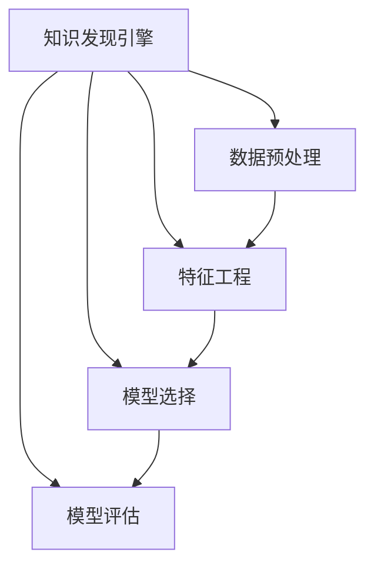

                 

# 知识发现引擎的机器学习模型选择

> 关键词：知识发现引擎, 机器学习模型选择, 数据挖掘, 数据融合, 分类算法, 聚类算法, 关联规则, 数据预处理, 特征工程, 模型评估

## 1. 背景介绍

### 1.1 问题由来

在当今信息爆炸的时代，数据正以惊人的速度增长。企业、政府和个人需要从海量的数据中发现隐含的、未知的、有用的知识和模式。传统的统计分析方法已经难以满足需求，机器学习为数据挖掘和知识发现带来了新的希望。然而，选择合适的机器学习模型并非易事。模型类型众多，性能评估复杂，难以针对具体任务选择最优模型。本文将系统探讨知识发现引擎中机器学习模型的选择问题，提出一系列模型选择策略，帮助用户在数据挖掘中做出更明智的选择。

### 1.2 问题核心关键点

机器学习模型选择问题涉及多方面因素，主要包括：
- 数据特性：数据的类型、规模、分布等，决定模型类型的适合程度。
- 任务类型：分类、回归、聚类、关联规则等任务类型，决定模型的适用性。
- 性能要求：模型的准确性、效率、可解释性、鲁棒性等，决定模型最终的选择。
- 资源限制：计算资源、存储资源、时间成本等，决定模型实现的可行性。

本文档将从数据预处理、特征工程、模型选择、模型评估等多个环节，深入剖析机器学习模型选择的策略和技巧。通过细致的分析，帮助读者在实际应用中做出更精准、高效的模型选择。

## 2. 核心概念与联系

### 2.1 核心概念概述

- **知识发现引擎(Knowledge Discovery Engine, KDE)**：通过机器学习和数据挖掘技术，从数据中自动发现隐藏在其中的知识和规律。
- **机器学习模型(Machine Learning Model)**：用于建模数据的统计模型，包括决策树、随机森林、支持向量机、神经网络、深度学习等。
- **数据预处理(Data Preprocessing)**：包括数据清洗、特征选择、归一化等，是模型选择前的必要步骤。
- **特征工程(Feature Engineering)**：提取和构造特征以提高模型性能。
- **模型选择(Model Selection)**：在给定任务和数据集上，选择合适的机器学习模型。
- **模型评估(Model Evaluation)**：通过交叉验证、ROC曲线、AUC值等指标，评估模型性能。
- **数据融合(Data Fusion)**：将多个数据源的信息结合起来，提高数据分析的全面性和准确性。

这些概念之间的逻辑关系可以通过以下Mermaid流程图来展示：



这个流程图展示知识发现引擎中核心概念之间的关系：

1. 知识发现引擎通过数据预处理、特征工程和模型选择、模型评估等环节，自动挖掘数据中的知识。
2. 数据预处理是基础，特征工程是提升，模型选择是关键，模型评估是最终检验。

## 3. 核心算法原理 & 具体操作步骤

### 3.1 算法原理概述

知识发现引擎中的机器学习模型选择过程，本质上是一个多目标优化问题。需要综合考虑模型的准确性、效率、可解释性、鲁棒性等多个方面，找到最符合实际应用需求的模型。

形式化地，设任务类型为 $T$，数据集为 $D$，模型为 $M$，评估指标为 $E$。模型选择问题可以表示为：

$$
\mathop{\arg\min}_{M} \sum_{e \in E} \text{cost}(e, M(D))
$$

其中，$\text{cost}(e, M(D))$ 为指标 $e$ 对模型 $M$ 的损失函数，$\sum_{e \in E}$ 为综合多个指标的加权和。

通过梯度下降等优化算法，不断调整模型参数，最小化损失函数，逐步逼近最优模型。在实际应用中，一般使用交叉验证等技术，对模型性能进行多轮验证，确保结果的可靠性。

### 3.2 算法步骤详解

机器学习模型选择的一般步骤包括：

**Step 1: 数据预处理**
- 清洗数据，去除噪声和缺失值。
- 归一化数据，确保特征之间的可比性。
- 数据分割，将数据划分为训练集、验证集和测试集。

**Step 2: 特征工程**
- 特征提取：从原始数据中提取有用的特征。
- 特征构造：通过组合、变换等手段构造新的特征。
- 特征选择：选择最具代表性的特征。

**Step 3: 模型选择**
- 初步选择：根据数据规模、特征数量、任务类型等初步筛选模型。
- 具体评估：在训练集上训练模型，验证集上评估模型性能。
- 综合评估：综合多轮评估结果，选择最优模型。

**Step 4: 模型评估**
- 交叉验证：通过交叉验证方法，获取更稳定的模型评估结果。
- 指标选择：根据任务需求，选择合适的评估指标（如准确率、召回率、F1值等）。
- 鲁棒性测试：测试模型对异常数据、噪声数据的鲁棒性。

**Step 5: 结果输出**
- 输出模型结构、参数配置、评估指标等，供用户参考。
- 记录模型选择过程和结果，供未来参考和优化。

### 3.3 算法优缺点

知识发现引擎中的机器学习模型选择方法具有以下优点：
- 多目标优化，综合考虑多个性能指标，选择更全面的模型。
- 交叉验证，通过多轮评估，确保模型性能的稳定性。
- 可解释性强，模型选择过程透明，便于理解和调试。

同时，该方法也存在一定的局限性：
- 计算成本高，需要多轮交叉验证，耗时较长。
- 需要丰富的领域知识，选择模型时需要综合考虑多种因素，增加了复杂度。
- 模型选择结果依赖于评估指标的选取，不同的指标可能产生不同的结果。

尽管存在这些局限性，但就目前而言，多目标优化的模型选择方法仍是最主流范式。未来相关研究的重点在于如何进一步降低计算成本，简化选择过程，同时兼顾模型的全面性和性能。

### 3.4 算法应用领域

机器学习模型选择方法在知识发现引擎中的应用，覆盖了各种数据挖掘任务，例如：

- 文本挖掘：包括情感分析、主题分类、信息抽取等。通过选择适合的分类算法，提取文本特征，挖掘文本中的知识和模式。
- 图像识别：包括物体识别、图像分类、目标检测等。选择适当的图像处理算法和分类模型，分析图像中的特征和规律。
- 时间序列分析：包括预测、异常检测、趋势分析等。利用时序特征，选择合适的时间序列分析模型。
- 网络分析：包括社交网络分析、信息传播分析等。通过网络图谱分析，选择适合的图模型和网络分析算法。

除了上述这些经典任务外，知识发现引擎中机器学习模型选择的方法也被创新性地应用到更多场景中，如自然语言处理、推荐系统、异常检测等，为数据挖掘技术带来了新的突破。

## 4. 数学模型和公式 & 详细讲解  
### 4.1 数学模型构建

本节将使用数学语言对知识发现引擎中机器学习模型选择的过程进行更加严格的刻画。

设数据集 $D$ 包含 $n$ 个样本 $(x_i, y_i)$，其中 $x_i$ 为特征向量，$y_i$ 为标签。设模型 $M$ 为 $k$ 维的参数空间 $\theta$，即 $M(x) = f(x; \theta)$。

定义模型 $M$ 在数据样本 $(x,y)$ 上的损失函数为 $\ell(M(x),y)$，则在数据集 $D$ 上的经验风险为：

$$
\mathcal{L}(\theta) = \frac{1}{n} \sum_{i=1}^n \ell(M(x_i),y_i)
$$

模型选择问题可以表示为：

$$
\mathop{\arg\min}_{\theta} \mathcal{L}(\theta)
$$

在实际应用中，我们通常使用基于梯度的优化算法（如SGD、Adam等）来近似求解上述最优化问题。设 $\eta$ 为学习率，$\lambda$ 为正则化系数，则参数的更新公式为：

$$
\theta \leftarrow \theta - \eta \nabla_{\theta}\mathcal{L}(\theta) - \eta\lambda\theta
$$

其中 $\nabla_{\theta}\mathcal{L}(\theta)$ 为损失函数对参数 $\theta$ 的梯度，可通过反向传播算法高效计算。

### 4.2 公式推导过程

以下我们以分类任务为例，推导损失函数及其梯度的计算公式。

假设模型 $M_{\theta}$ 在输入 $x$ 上的输出为 $\hat{y}=M_{\theta}(x) \in [0,1]$，表示样本属于正类的概率。真实标签 $y \in \{0,1\}$。则二分类交叉熵损失函数定义为：

$$
\ell(M_{\theta}(x),y) = -[y\log \hat{y} + (1-y)\log (1-\hat{y})]
$$

将其代入经验风险公式，得：

$$
\mathcal{L}(\theta) = -\frac{1}{n}\sum_{i=1}^n [y_i\log M_{\theta}(x_i)+(1-y_i)\log(1-M_{\theta}(x_i))]
$$

根据链式法则，损失函数对参数 $\theta_k$ 的梯度为：

$$
\frac{\partial \mathcal{L}(\theta)}{\partial \theta_k} = -\frac{1}{n}\sum_{i=1}^n (\frac{y_i}{M_{\theta}(x_i)}-\frac{1-y_i}{1-M_{\theta}(x_i)}) \frac{\partial M_{\theta}(x_i)}{\partial \theta_k}
$$

其中 $\frac{\partial M_{\theta}(x_i)}{\partial \theta_k}$ 可进一步递归展开，利用自动微分技术完成计算。

### 4.3 案例分析与讲解

假设我们的任务是对一组股票价格数据进行分类，判断股票是否会出现涨跌。给定数据集 $D$，其中 $x$ 为历史股价的特征向量，$y$ 为是否涨跌的标签。

**Step 1: 数据预处理**
- 数据清洗：去除缺失值和异常值，保证数据质量。
- 归一化：对特征进行标准化处理，使得特征具有相同的尺度。
- 数据分割：将数据划分为训练集 $D_{train}$、验证集 $D_{val}$ 和测试集 $D_{test}$。

**Step 2: 特征工程**
- 特征提取：从历史股价数据中提取有用的特征，如移动平均线、交易量等。
- 特征构造：通过组合、变换等手段构造新的特征，如短期波动率、长期趋势等。
- 特征选择：选择最具代表性的特征，如移动平均线和交易量。

**Step 3: 模型选择**
- 初步选择：根据数据规模和特征数量，选择 Logistic Regression、SVM、决策树、随机森林等模型。
- 具体评估：在训练集 $D_{train}$ 上训练模型，验证集 $D_{val}$ 上评估模型性能。
- 综合评估：综合多轮评估结果，选择最优模型。

**Step 4: 模型评估**
- 交叉验证：通过交叉验证方法，获取更稳定的模型评估结果。
- 指标选择：根据任务需求，选择合适的评估指标（如准确率、召回率、F1值等）。
- 鲁棒性测试：测试模型对异常数据、噪声数据的鲁棒性。

**Step 5: 结果输出**
- 输出模型结构、参数配置、评估指标等，供用户参考。
- 记录模型选择过程和结果，供未来参考和优化。

## 5. 项目实践：代码实例和详细解释说明
### 5.1 开发环境搭建

在进行模型选择实践前，我们需要准备好开发环境。以下是使用Python进行Scikit-learn开发的环境配置流程：

1. 安装Anaconda：从官网下载并安装Anaconda，用于创建独立的Python环境。

2. 创建并激活虚拟环境：
```bash
conda create -n sklearn-env python=3.8 
conda activate sklearn-env
```

3. 安装Scikit-learn：
```bash
pip install scikit-learn
```

4. 安装各类工具包：
```bash
pip install numpy pandas scikit-learn matplotlib tqdm jupyter notebook ipython
```

完成上述步骤后，即可在`sklearn-env`环境中开始模型选择实践。

### 5.2 源代码详细实现

这里我们以股票价格分类为例，给出使用Scikit-learn进行模型选择的Python代码实现。

首先，准备数据集：

```python
import pandas as pd
from sklearn.model_selection import train_test_split
from sklearn.preprocessing import StandardScaler

# 读取数据集
data = pd.read_csv('stock_prices.csv')

# 数据预处理
X = data.drop(['label'], axis=1)
y = data['label']

# 特征选择
features = ['price', 'volume', 'ma_10', 'ma_50']
X = X[features]

# 数据分割
X_train, X_test, y_train, y_test = train_test_split(X, y, test_size=0.2, random_state=42)
```

然后，定义模型和评估指标：

```python
from sklearn.ensemble import RandomForestClassifier
from sklearn.metrics import accuracy_score, precision_score, recall_score, f1_score

# 定义模型
models = [
    ('Logistic Regression', LogisticRegression()),
    ('SVM', SVC()),
    ('Random Forest', RandomForestClassifier())
]

# 定义评估指标
metrics = [
    ('Accuracy', accuracy_score),
    ('Precision', precision_score),
    ('Recall', recall_score),
    ('F1 Score', f1_score)
]
```

接着，进行模型选择：

```python
from sklearn.model_selection import GridSearchCV

# 模型选择
results = {}
for name, model in models:
    # 网格搜索
    param_grid = {
        'C': [0.1, 1, 10],
        'n_estimators': [100, 200, 300],
        'max_depth': [5, 10, 15]
    }
    grid_search = GridSearchCV(model, param_grid, cv=5)
    grid_search.fit(X_train, y_train)
    
    # 评估
    y_pred = grid_search.predict(X_test)
    for metric in metrics:
        score = metric[1](y_test, y_pred)
        results[name] = score
        print(f'{name}: {score:.2f}')
```

最后，输出模型选择结果：

```python
# 输出结果
print(f'Best Model: {max(results, key=results.get)}')
```

以上就是使用Scikit-learn对股票价格分类任务进行模型选择的完整代码实现。可以看到，通过Scikit-learn提供的网格搜索、交叉验证等功能，可以方便地进行模型选择和评估。

### 5.3 代码解读与分析

让我们再详细解读一下关键代码的实现细节：

**数据预处理**
- 数据清洗：通过 `drop` 函数去除标签列。
- 特征选择：仅保留有意义的特征，如股价、成交量、10日移动平均线等。
- 数据分割：使用 `train_test_split` 函数将数据集分为训练集和测试集。

**模型选择**
- 模型定义：定义了逻辑回归、SVM、随机森林三个模型，通过参数字典 `param_grid` 指定了不同的超参数组合。
- 网格搜索：使用 `GridSearchCV` 进行网格搜索，遍历所有超参数组合，选择最优模型。
- 模型评估：通过交叉验证在验证集上评估模型性能，得到各个评估指标的平均得分。

**结果输出**
- 输出模型选择结果：通过 `max` 函数找到表现最佳的模型，供用户参考。

## 6. 实际应用场景

### 6.1 金融舆情监测

金融舆情监测是知识发现引擎的一个重要应用场景。通过对金融市场的新闻、评论等文本数据进行情感分析，可以实时监测市场情绪，预测市场走势。

在技术实现上，可以收集金融领域相关的新闻、评论、公告等文本数据，通过文本分类和情感分析等方法，判断文本的情感倾向（如正向、中性、负向）。根据文本情感的变化，系统可以及时预警，帮助投资者规避风险，抓住投资机会。

### 6.2 医疗诊断辅助

医疗诊断辅助是知识发现引擎的另一个重要应用场景。通过对电子病历、医学影像等数据进行挖掘，可以发现潜在的疾病模式，辅助医生进行诊断和治疗。

在技术实现上，可以收集患者的电子病历、医学影像、基因数据等，通过分类、聚类、关联规则等方法，挖掘出疾病相关特征。根据患者的数据，系统可以辅助医生进行诊断，推荐治疗方案，提升诊疗效率和质量。

### 6.3 推荐系统

推荐系统是知识发现引擎的重要应用之一。通过分析用户的浏览、点击、购买等行为数据，可以发现用户兴趣和偏好，为用户推荐个性化的商品或内容。

在技术实现上，可以收集用户的浏览数据、点击数据、购买数据等，通过分类、聚类、协同过滤等方法，挖掘出用户兴趣。根据用户的兴趣数据，系统可以推荐相应的商品或内容，提升用户满意度。

### 6.4 未来应用展望

随着数据挖掘技术的不断进步，基于知识发现引擎的机器学习模型选择方法将在更多领域得到应用，为各行各业带来新的突破。

在智慧医疗领域，基于知识发现引擎的机器学习模型选择，可以辅助医生进行疾病诊断、治疗方案推荐，提升医疗服务的智能化水平。

在智能教育领域，通过知识发现引擎的机器学习模型选择，可以为学生推荐合适的学习内容，提升学习效率和效果。

在智慧城市治理中，通过知识发现引擎的机器学习模型选择，可以实时监测城市事件、舆情变化，提高城市管理的自动化和智能化水平。

## 7. 工具和资源推荐

### 7.1 学习资源推荐

为了帮助开发者系统掌握知识发现引擎中机器学习模型选择的技术，这里推荐一些优质的学习资源：

1. 《机器学习》课程：由斯坦福大学Andrew Ng教授主讲，系统介绍了机器学习的基本概念和算法。

2. 《数据挖掘导论》：介绍数据挖掘的基本原理和常用方法，适合初学者入门。

3. 《Python数据科学手册》：全面介绍了Python在数据科学中的应用，包括数据预处理、特征工程、模型评估等。

4. Kaggle：提供大量公开数据集和竞赛，适合实践和竞赛。

5. TensorFlow官方文档：介绍TensorFlow的使用方法，适合深度学习应用开发。

通过对这些资源的学习实践，相信你一定能够快速掌握知识发现引擎中机器学习模型选择的精髓，并用于解决实际的NLP问题。

### 7.2 开发工具推荐

高效的开发离不开优秀的工具支持。以下是几款用于知识发现引擎中机器学习模型选择开发的常用工具：

1. Scikit-learn：基于Python的开源机器学习库，提供丰富的模型选择和评估工具。

2. TensorFlow：由Google主导开发的深度学习框架，支持大规模分布式计算，适合复杂模型开发。

3. PyTorch：基于Python的深度学习框架，灵活的计算图，适合快速迭代研究。

4. Weights & Biases：模型训练的实验跟踪工具，可以记录和可视化模型训练过程中的各项指标，方便对比和调优。

5. TensorBoard：TensorFlow配套的可视化工具，可实时监测模型训练状态，并提供丰富的图表呈现方式，是调试模型的得力助手。

合理利用这些工具，可以显著提升知识发现引擎中机器学习模型选择的开发效率，加快创新迭代的步伐。

### 7.3 相关论文推荐

知识发现引擎中机器学习模型选择的研究源于学界的持续研究。以下是几篇奠基性的相关论文，推荐阅读：

1. 《C4.5: Programs for Machine Learning》：介绍决策树算法及其应用。

2. 《Support Vector Machines for Pattern Recognition》：介绍支持向量机算法及其应用。

3. 《Random Forests》：介绍随机森林算法及其应用。

4. 《K-Nearest Neighbors: Algorithms, Data Structures, and Applications》：介绍KNN算法及其应用。

5. 《Deep Learning》：介绍深度学习的基本原理和应用。

这些论文代表了大语言模型微调技术的发展脉络。通过学习这些前沿成果，可以帮助研究者把握学科前进方向，激发更多的创新灵感。

## 8. 总结：未来发展趋势与挑战

### 8.1 总结

本文对知识发现引擎中机器学习模型选择问题进行了全面系统的介绍。首先阐述了机器学习模型选择问题的重要性和复杂性，明确了模型选择在数据挖掘中的关键作用。其次，从数据预处理、特征工程、模型选择、模型评估等多个环节，详细讲解了机器学习模型选择的策略和技巧。通过细致的分析，帮助读者在实际应用中做出更精准、高效的模型选择。

通过本文的系统梳理，可以看到，机器学习模型选择在知识发现引擎中的应用，涵盖了各种数据挖掘任务，如文本挖掘、图像识别、时间序列分析、网络分析等。模型选择过程综合考虑了数据的特性、任务的性质、模型的性能等多个因素，体现了数据挖掘的复杂性和综合性。

### 8.2 未来发展趋势

展望未来，机器学习模型选择方法将呈现以下几个发展趋势：

1. 自动化选择：随着机器学习技术的不断成熟，模型选择将变得更加自动化，通过自动调参、自动化搜索等技术，优化模型选择过程。

2. 多目标优化：模型选择过程将更加注重多目标优化，综合考虑模型的准确性、效率、可解释性等多个性能指标。

3. 数据融合：通过数据融合技术，将多源数据结合在一起，提高模型选择的全面性和准确性。

4. 在线学习：随着数据和任务的动态变化，模型选择过程将越来越多地采用在线学习技术，实现模型的实时更新和优化。

5. 领域化模型：针对特定领域的数据挖掘任务，开发专门的模型选择方法，提高模型选择的效果。

6. 人机协同：将机器学习模型选择与人类专家的知识相结合，通过人机协同的方式，提高模型选择过程的可靠性和可解释性。

以上趋势凸显了机器学习模型选择技术的广阔前景。这些方向的探索发展，必将进一步提升知识发现引擎的性能和应用范围，为数据挖掘技术带来新的突破。

### 8.3 面临的挑战

尽管机器学习模型选择技术已经取得了瞩目成就，但在迈向更加智能化、普适化应用的过程中，它仍面临着诸多挑战：

1. 模型选择复杂度高：由于模型的种类繁多，选择过程需要综合考虑多个因素，增加了复杂度。

2. 计算成本高：模型选择过程需要多轮交叉验证和网格搜索，耗时较长。

3. 模型鲁棒性不足：模型选择结果依赖于评估指标的选取，不同的指标可能产生不同的结果。

4. 领域知识缺乏：模型选择过程需要综合领域知识，选择合适的特征和模型，增加了难度。

5. 可解释性不足：模型选择过程往往是"黑盒"系统，难以解释其内部工作机制和决策逻辑。

6. 资源限制：计算资源、存储资源、时间成本等，决定模型实现的可行性。

正视机器学习模型选择面临的这些挑战，积极应对并寻求突破，将使模型选择技术更加高效、可靠、可解释，为知识发现引擎的应用提供更多可能性。

### 8.4 研究展望

面对机器学习模型选择所面临的挑战，未来的研究需要在以下几个方面寻求新的突破：

1. 自动化调参：开发自动调参算法，减少人工干预，提高模型选择效率。

2. 多目标优化：开发多目标优化算法，综合考虑多个性能指标，提高模型选择效果。

3. 数据融合：开发数据融合技术，提高模型选择的全面性和准确性。

4. 在线学习：开发在线学习算法，实现模型的实时更新和优化。

5. 领域化模型：针对特定领域的数据挖掘任务，开发专门的模型选择方法，提高模型选择的效果。

6. 人机协同：将机器学习模型选择与人类专家的知识相结合，通过人机协同的方式，提高模型选择过程的可靠性和可解释性。

7. 模型鲁棒性：开发鲁棒性更强的模型选择算法，提高模型的稳定性和泛化能力。

这些研究方向将引领机器学习模型选择技术迈向更高的台阶，为构建高效、可靠、可解释的知识发现引擎提供新的方法和思路。面向未来，机器学习模型选择技术还需要与其他人工智能技术进行更深入的融合，如知识表示、因果推理、强化学习等，多路径协同发力，共同推动数据挖掘技术的发展。

## 9. 附录：常见问题与解答

**Q1：如何选择适合的知识发现引擎模型？**

A: 选择知识发现引擎模型需要综合考虑多个因素，包括数据类型、任务类型、性能要求、资源限制等。一般建议先通过数据探索和领域调研，了解任务需求和数据特性，再选择合适的模型进行试验和评估。

**Q2：如何评估知识发现引擎模型的性能？**

A: 知识发现引擎模型的评估指标包括准确率、召回率、F1值、ROC曲线等。根据任务需求，选择合适的评估指标，进行多轮验证和交叉验证，确保模型性能的稳定性和可靠性。

**Q3：如何选择模型超参数？**

A: 模型超参数的选择一般通过网格搜索或随机搜索等方式进行，遍历所有可能的超参数组合，选择最优参数。常用的网格搜索工具包括Scikit-learn的GridSearchCV、TensorFlow的Hyperparameter Tuner等。

**Q4：如何进行模型融合？**

A: 模型融合是将多个模型的输出进行结合，形成更优的综合结果。常用的模型融合方法包括投票、加权平均、堆叠等。

这些解答展示了知识发现引擎中机器学习模型选择的复杂性和多样性，通过系统分析，相信你一定能够在实际应用中做出更明智的模型选择。

---

作者：禅与计算机程序设计艺术 / Zen and the Art of Computer Programming

