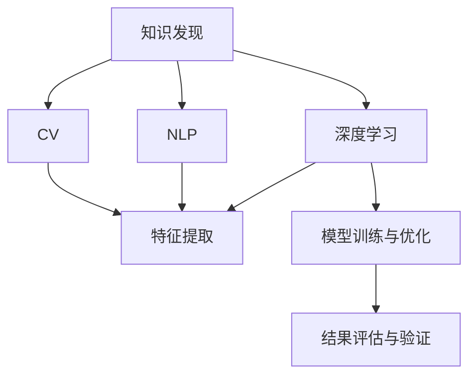

                 

# 知识发现引擎的深度学习技术应用

> 关键词：知识发现, 深度学习, 自然语言处理, 计算机视觉, 深度学习模型, 特征提取

## 1. 背景介绍

### 1.1 问题由来

在现代信息爆炸的时代，数据量呈指数级增长，如何从海量数据中高效地提取有用信息，成为各个领域面临的重大挑战。知识发现(Knowledge Discovery in Databases, KDD)技术，通过对数据的高效分析和处理，帮助人们从数据中挖掘出有价值的知识，从而辅助决策、优化管理、提升竞争力。

深度学习(DL)作为当前最热门的AI技术之一，以其强大的自适应能力和泛化能力，在知识发现领域展现出巨大的潜力。通过深度学习技术，可以从非结构化数据中自动提取特征，并结合领域知识进行建模，提升知识发现的效率和质量。

本论文将全面介绍深度学习技术在知识发现引擎中的应用，从理论到实践，探讨如何利用DL技术从大规模数据中高效地发现和提取知识。

### 1.2 问题核心关键点

在知识发现引擎中应用深度学习，主要涉及以下几个核心关键点：

- **数据预处理**：将原始数据转化为模型可以处理的数值形式。
- **特征提取**：从数据中自动学习高层次的特征表示。
- **模型训练与优化**：利用深度学习模型学习数据分布，提取特征。
- **结果评估与验证**：使用合适的评估指标衡量模型的效果，并优化模型。
- **应用场景**：从自然语言处理(NLP)到计算机视觉(CV)等多个领域的应用案例。

本文将重点介绍如何通过深度学习技术实现高效的知识发现。

## 2. 核心概念与联系

### 2.1 核心概念概述

为更好地理解深度学习技术在知识发现中的应用，本节将介绍几个关键概念及其之间的联系：

- **知识发现(KDD)**：指从大规模数据集中提取有用知识的过程。通过数据挖掘、统计分析等技术，从数据中发现潜在的关联、模式和规律，辅助决策和优化。
- **深度学习(DL)**：一种基于多层神经网络的机器学习方法，通过逐层特征抽象，学习数据的高层次表示，适用于复杂模式的学习。
- **自然语言处理(NLP)**：处理、理解和生成人类语言的技术，包括文本分类、信息抽取、情感分析等。
- **计算机视觉(CV)**：使用计算机处理和分析图像、视频等视觉数据的技术，涉及图像识别、目标检测、图像生成等。
- **特征提取**：从原始数据中提取出对任务有帮助的特征，是深度学习模型的关键步骤。
- **模型训练与优化**：利用梯度下降等优化算法，最小化损失函数，调整模型参数，提高模型性能。
- **结果评估与验证**：使用准确率、F1分数、AUC等指标评估模型效果，确保模型能够适应新数据。

这些核心概念之间的逻辑关系可以通过以下Mermaid流程图来展示：



这个流程图展示了几类核心概念及其之间的关系：

1. 知识发现引擎通过深度学习技术，实现从数据中自动提取特征。
2. 深度学习可以应用于自然语言处理和计算机视觉等多个领域。
3. 模型训练与优化是提高深度学习模型效果的关键步骤。
4. 结果评估与验证用于衡量模型效果，指导模型的改进。

## 3. 核心算法原理 & 具体操作步骤

### 3.1 算法原理概述

深度学习在知识发现中的应用主要基于以下几个原理：

1. **无监督学习**：深度学习模型通过大量无标签数据训练，自动发现数据中的潜在结构，适用于发现未知知识。
2. **特征提取**：通过多层神经网络，学习数据的复杂特征表示，适用于高层次知识发现。
3. **迁移学习**：利用预训练模型在不同任务之间的知识迁移，提高模型泛化能力。
4. **多模态学习**：结合图像、文本、音频等多模态数据，增强知识发现的广度和深度。
5. **强化学习**：通过与环境的交互，模型不断优化策略，适用于复杂的知识发现任务。

### 3.2 算法步骤详解

深度学习在知识发现中的应用步骤主要包括以下几个环节：

**Step 1: 数据预处理**

- 数据清洗：去除噪声和无关数据，提升数据质量。
- 数据归一化：将数据转化为标准化的数值形式，如归一化、标准化、对数变换等。
- 数据分割：将数据划分为训练集、验证集和测试集。

**Step 2: 特征提取**

- 使用卷积神经网络(CNN)提取图像特征。
- 使用循环神经网络(RNN)或Transformer模型提取文本特征。
- 使用深度学习模型提取多模态数据的联合特征。

**Step 3: 模型训练与优化**

- 选择合适的深度学习模型和损失函数。
- 使用随机梯度下降(SGD)、Adam等优化算法进行模型训练。
- 应用正则化技术，如L2正则、Dropout，避免过拟合。

**Step 4: 结果评估与验证**

- 使用准确率、F1分数、AUC等指标评估模型效果。
- 在测试集上进行模型验证，确保模型泛化能力。
- 利用交叉验证等技术，进一步提升模型鲁棒性。

**Step 5: 应用与部署**

- 将训练好的模型应用到实际问题中。
- 结合领域知识，对模型进行微调或迁移学习，提升模型性能。
- 部署模型到实际应用系统，进行实时数据处理和知识发现。

### 3.3 算法优缺点

深度学习在知识发现中的应用有以下优缺点：

**优点：**
- 自动特征提取：深度学习模型能够自动学习数据的复杂特征，减少人工干预。
- 泛化能力强：通过多层神经网络的抽象，模型能够适应复杂的数据分布。
- 迁移学习能力：预训练模型可以在不同任务之间迁移，提升模型泛化能力。

**缺点：**
- 计算资源需求高：深度学习模型通常需要较大的计算资源，对硬件要求较高。
- 训练时间长：模型训练过程耗时较长，需要大量时间进行迭代优化。
- 模型复杂度高：深度学习模型的复杂性较高，难以解释其内部机制。

尽管存在这些局限性，但深度学习技术在知识发现中的应用仍然展示出强大的潜力和优势。

### 3.4 算法应用领域

深度学习在知识发现中的应用广泛，主要包括以下几个领域：

- **自然语言处理(NLP)**：文本分类、信息抽取、情感分析等。
- **计算机视觉(CV)**：图像分类、目标检测、图像生成等。
- **推荐系统**：协同过滤、基于内容的推荐、基于混合模型的推荐等。
- **金融分析**：股票预测、信用风险评估、市场分析等。
- **医疗健康**：疾病诊断、基因分析、医疗影像分析等。
- **社交网络分析**：社区发现、情感分析、关系预测等。

这些应用场景展示了深度学习在知识发现中的广泛应用，为各行各业带来了显著的效益。

## 4. 数学模型和公式 & 详细讲解 & 举例说明

### 4.1 数学模型构建

在知识发现引擎中，深度学习模型的构建主要包括以下几个步骤：

- 定义输入数据的维度和格式，如文本的词向量表示、图像的像素值等。
- 设计神经网络的架构，包括卷积层、池化层、全连接层等。
- 选择合适的损失函数和优化算法，如交叉熵损失、Adam优化器等。

以文本分类任务为例，使用Transformer模型进行文本特征提取。定义输入序列的长度为$n$，令$x_i$为第$i$个输入样本的词向量表示，模型结构如下：

$$
y=\text{Softmax}(\text{Transformer}(x))
$$

其中，$\text{Transformer}$表示Transformer模型，$\text{Softmax}$表示softmax层。

### 4.2 公式推导过程

以图像分类任务为例，使用卷积神经网络(CNN)进行特征提取。输入图像$x$的大小为$h\times w\times c$，令$x_{i,j,k}$为第$i$行、第$j$列、第$k$个通道的像素值。模型的前向传播过程如下：

1. 卷积层
$$
y_1=\text{Conv2D}(x)
$$
2. 池化层
$$
y_2=\text{MaxPooling2D}(y_1)
$$
3. 全连接层
$$
y_3=\text{FC}(y_2)
$$
4. 输出层
$$
y=\text{Softmax}(y_3)
$$

其中，$\text{Conv2D}$和$\text{MaxPooling2D}$表示卷积和池化操作，$\text{FC}$表示全连接层。

### 4.3 案例分析与讲解

以情感分析任务为例，使用LSTM模型进行特征提取和分类。输入文本$x$经过嵌入层转换为向量表示，再通过LSTM层提取特征，最后通过全连接层输出情感分类。模型的前向传播过程如下：

1. 嵌入层
$$
y_1=\text{Embedding}(x)
$$
2. LSTM层
$$
y_2=\text{LSTM}(y_1)
$$
3. 全连接层
$$
y=\text{Softmax}(\text{FC}(y_2))
$$

其中，$\text{Embedding}$表示嵌入层，$\text{LSTM}$表示LSTM层，$\text{FC}$表示全连接层。

## 5. 项目实践：代码实例和详细解释说明

### 5.1 开发环境搭建

在进行深度学习应用实践前，我们需要准备好开发环境。以下是使用Python进行TensorFlow开发的环境配置流程：

1. 安装Anaconda：从官网下载并安装Anaconda，用于创建独立的Python环境。

2. 创建并激活虚拟环境：
```bash
conda create -n tf-env python=3.8 
conda activate tf-env
```

3. 安装TensorFlow：根据CUDA版本，从官网获取对应的安装命令。例如：
```bash
conda install tensorflow -c conda-forge
```

4. 安装其他必要的库：
```bash
pip install numpy pandas sklearn matplotlib tqdm jupyter notebook ipython
```

完成上述步骤后，即可在`tf-env`环境中开始深度学习实践。

### 5.2 源代码详细实现

下面我们以图像分类任务为例，给出使用TensorFlow进行卷积神经网络(CNN)特征提取的代码实现。

首先，定义CNN模型的结构：

```python
import tensorflow as tf
from tensorflow.keras import layers

model = tf.keras.Sequential([
    layers.Conv2D(32, (3, 3), activation='relu', input_shape=(28, 28, 1)),
    layers.MaxPooling2D((2, 2)),
    layers.Conv2D(64, (3, 3), activation='relu'),
    layers.MaxPooling2D((2, 2)),
    layers.Conv2D(64, (3, 3), activation='relu'),
    layers.Flatten(),
    layers.Dense(64, activation='relu'),
    layers.Dense(10, activation='softmax')
])
```

然后，定义训练和评估函数：

```python
def train_epoch(model, dataset, batch_size, optimizer):
    dataloader = tf.data.Dataset.from_tensor_slices(dataset)
    dataloader = dataloader.batch(batch_size, drop_remainder=True)
    model.compile(optimizer=optimizer, loss='sparse_categorical_crossentropy', metrics=['accuracy'])
    model.fit(dataloader, epochs=5)
    
def evaluate(model, dataset, batch_size):
    dataloader = tf.data.Dataset.from_tensor_slices(dataset)
    dataloader = dataloader.batch(batch_size, drop_remainder=True)
    model.evaluate(dataloader)
```

最后，启动训练流程并在测试集上评估：

```python
batch_size = 32
optimizer = tf.keras.optimizers.Adam(learning_rate=0.001)
train_dataset = ...
dev_dataset = ...
test_dataset = ...

model = load_model(...)
train_epoch(model, train_dataset, batch_size, optimizer)
evaluate(model, dev_dataset, batch_size)
evaluate(model, test_dataset, batch_size)
```

以上就是使用TensorFlow进行CNN图像分类任务微调的完整代码实现。可以看到，TensorFlow提供了强大的模型构建和训练框架，使得深度学习模型的开发和调试变得更加简单。

### 5.3 代码解读与分析

让我们再详细解读一下关键代码的实现细节：

**Sequential模型**：
- `tf.keras.Sequential`类用于定义神经网络模型。
- 每个层通过`layers.<layer_name>`类进行创建。

**数据集处理**：
- `tf.data.Dataset.from_tensor_slices`用于将数据转换为TensorFlow数据集。
- `dataset.batch(batch_size, drop_remainder=True)`用于将数据集分割成批处理的数据。

**模型编译**：
- `model.compile`用于设置模型的优化器和损失函数。

**模型训练与评估**：
- `model.fit`用于训练模型。
- `model.evaluate`用于评估模型性能。

**模型加载与保存**：
- `tf.keras.models.load_model`用于加载模型。

可以看到，TensorFlow提供的高级API使得深度学习模型的开发和实践变得更加高效和便捷。

## 6. 实际应用场景

### 6.1 金融分析

在金融领域，深度学习技术可以应用于股票预测、信用风险评估、市场分析等多个方面。通过分析历史股价、财务数据、新闻报道等多维数据，深度学习模型可以学习市场波动规律，预测股价趋势。

例如，可以使用RNN或LSTM模型，将时间序列数据作为输入，学习股票价格的历史变化趋势，从而进行股票预测。模型结构如下：

1. 嵌入层
$$
y_1=\text{Embedding}(x)
$$
2. LSTM层
$$
y_2=\text{LSTM}(y_1)
$$
3. 全连接层
$$
y=\text{Softmax}(\text{FC}(y_2))
$$

其中，$x$为时间序列数据，$y$为预测的股价。

### 6.2 医疗健康

在医疗领域，深度学习技术可以应用于疾病诊断、基因分析、医疗影像分析等多个方面。通过分析患者病历、基因序列、医疗影像等数据，深度学习模型可以学习疾病的特征，辅助医生进行诊断和治疗决策。

例如，可以使用卷积神经网络(CNN)，将医学影像数据作为输入，学习影像特征，进行疾病诊断。模型结构如下：

1. 卷积层
$$
y_1=\text{Conv2D}(x)
$$
2. 池化层
$$
y_2=\text{MaxPooling2D}(y_1)
$$
3. 全连接层
$$
y=\text{Softmax}(\text{FC}(y_2))
$$

其中，$x$为医学影像数据，$y$为预测的疾病标签。

### 6.3 智能推荐

在推荐系统中，深度学习技术可以应用于协同过滤、基于内容的推荐、基于混合模型的推荐等多个方面。通过分析用户的历史行为数据和物品的特征信息，深度学习模型可以学习用户的兴趣偏好，推荐个性化的物品。

例如，可以使用协同过滤算法，将用户行为数据和物品特征信息作为输入，学习用户的兴趣偏好，进行推荐。模型结构如下：

1. 嵌入层
$$
y_1=\text{Embedding}(x_1)
$$
2. 矩阵分解层
$$
y_2=\text{MatrixFactorization}(y_1)
$$
3. 全连接层
$$
y=\text{Softmax}(\text{FC}(y_2))
$$

其中，$x_1$为用户行为数据，$x_2$为物品特征信息，$y$为推荐物品的标签。

### 6.4 未来应用展望

随着深度学习技术的发展，知识发现引擎将展现出更加广阔的应用前景。未来的深度学习技术将在以下几个方面进一步提升知识发现的能力：

1. 多模态学习：结合图像、文本、音频等多模态数据，增强知识发现的广度和深度。
2. 迁移学习：通过预训练模型在不同任务之间的知识迁移，提高模型泛化能力。
3. 强化学习：通过与环境的交互，模型不断优化策略，适用于复杂的知识发现任务。
4. 联邦学习：通过分布式协同训练，保护数据隐私，提升知识发现的效率。
5. 知识图谱：结合领域知识构建知识图谱，增强知识发现的效果。

## 7. 工具和资源推荐

### 7.1 学习资源推荐

为了帮助开发者系统掌握深度学习技术在知识发现中的应用，这里推荐一些优质的学习资源：

1. 《深度学习》书籍：由Goodfellow等人所著，全面介绍了深度学习的基本原理和应用。
2. 《TensorFlow官方文档》：TensorFlow的官方文档，提供了丰富的模型构建和训练教程，适合初学者和专业人士。
3. 《自然语言处理综论》书籍：由Rabiner等人所著，全面介绍了自然语言处理的基本概念和前沿技术。
4. 《计算机视觉基础》书籍：由Gao等人所著，全面介绍了计算机视觉的基本原理和应用。
5. Coursera和Udacity等在线课程：提供了丰富的深度学习课程，涵盖从基础到高级的各个方面。

通过对这些资源的学习实践，相信你一定能够快速掌握深度学习技术在知识发现中的应用，并用于解决实际的NLP问题。

### 7.2 开发工具推荐

高效的开发离不开优秀的工具支持。以下是几款用于深度学习知识发现应用的常用工具：

1. TensorFlow：基于Python的开源深度学习框架，灵活的计算图，适合快速迭代研究。
2. PyTorch：基于Python的开源深度学习框架，灵活的动态图，适合研究复杂模型。
3. Keras：基于TensorFlow和Theano等后端的高层API，易于上手，适合快速原型设计。
4. Jupyter Notebook：轻量级的交互式Python开发环境，适合数据探索和模型调试。
5. Visual Studio Code：强大的代码编辑器，支持多种语言和工具链，适合综合开发。

合理利用这些工具，可以显著提升深度学习知识发现任务的开发效率，加快创新迭代的步伐。

### 7.3 相关论文推荐

深度学习在知识发现中的应用源于学界的持续研究。以下是几篇奠基性的相关论文，推荐阅读：

1. "Convolutional Neural Networks for Sentence Classification"（CNN文本分类）：提出了使用CNN进行文本分类的模型，开创了深度学习在文本分类中的应用。
2. "Long Short-Term Memory"（LSTM）：提出了使用LSTM进行序列建模，提高了深度学习在时间序列数据中的应用。
3. "Learning Multi-View Vector Representations for Data Mining in High-Dimensional Spaces"（多视图向量表示学习）：提出了使用多视图数据进行特征融合，提高了深度学习在知识发现中的应用。
4. "Deep Clustering via Sum-Product Networks"（深度聚类）：提出了使用神经网络进行聚类，提高了深度学习在数据挖掘中的应用。
5. "Knowledge Graph Embeddings"（知识图谱嵌入）：提出了使用神经网络进行知识图谱嵌入，提高了深度学习在知识发现中的应用。

这些论文代表了大深度学习在知识发现领域的进展。通过学习这些前沿成果，可以帮助研究者把握学科前进方向，激发更多的创新灵感。

## 8. 总结：未来发展趋势与挑战

### 8.1 总结

本文对深度学习技术在知识发现引擎中的应用进行了全面系统的介绍。首先阐述了深度学习在知识发现中的重要性和应用场景，明确了深度学习技术在知识发现中的应用前景。其次，从理论到实践，详细讲解了深度学习技术在知识发现中的核心算法和操作步骤，给出了深度学习应用实践的完整代码实例。同时，本文还探讨了深度学习技术在多个实际应用场景中的具体实现，展示了深度学习技术的强大潜力。

通过本文的系统梳理，可以看到，深度学习技术在知识发现领域展现出巨大的应用前景，极大地提升了数据处理和知识发现的能力。未来，伴随深度学习技术的进一步发展，知识发现引擎必将实现更广泛、更深入的应用，为各行各业带来深远的影响。

### 8.2 未来发展趋势

展望未来，深度学习在知识发现中的应用将呈现以下几个发展趋势：

1. 多模态学习：结合图像、文本、音频等多模态数据，增强知识发现的广度和深度。
2. 迁移学习：通过预训练模型在不同任务之间的知识迁移，提高模型泛化能力。
3. 强化学习：通过与环境的交互，模型不断优化策略，适用于复杂的知识发现任务。
4. 联邦学习：通过分布式协同训练，保护数据隐私，提升知识发现的效率。
5. 知识图谱：结合领域知识构建知识图谱，增强知识发现的效果。

以上趋势凸显了深度学习技术在知识发现领域的广阔前景。这些方向的探索发展，必将进一步提升知识发现引擎的能力，为各行各业带来深远的影响。

### 8.3 面临的挑战

尽管深度学习技术在知识发现中的应用已经取得了显著的成效，但在迈向更加智能化、普适化应用的过程中，它仍面临诸多挑战：

1. 数据质量问题：深度学习模型对数据质量的要求较高，数据噪声、缺失等都会影响模型效果。
2. 模型复杂性问题：深度学习模型的复杂性较高，难以解释其内部机制，模型调试和维护难度较大。
3. 计算资源需求高：深度学习模型通常需要较大的计算资源，对硬件要求较高，推广难度较大。
4. 隐私保护问题：深度学习模型通常需要大量数据进行训练，如何保护数据隐私成为一大挑战。
5. 知识图谱构建问题：如何有效构建和应用知识图谱，实现知识发现与推理的深度结合，仍需进一步研究。

这些挑战凸显了深度学习技术在知识发现领域的复杂性和局限性，需要在理论和工程实践中不断探索和突破。

### 8.4 研究展望

面向未来，深度学习在知识发现领域的研究需要在以下几个方面寻求新的突破：

1. 自动化特征提取：进一步提升模型的自动特征提取能力，减少人工干预，提高数据处理的效率。
2. 模型解释性：开发可解释性强的深度学习模型，增强模型的透明度，方便理解和使用。
3. 隐私保护机制：研究数据隐私保护技术，保护用户数据的安全，增强模型的可信度。
4. 多模态融合技术：研究多模态数据的深度融合方法，提升知识发现的效果和广度。
5. 联邦学习框架：研究联邦学习技术，实现分布式协同训练，保护数据隐私。
6. 知识图谱应用：研究知识图谱与深度学习的结合方法，增强知识发现的效果和推理能力。

这些研究方向的前沿探索，必将推动深度学习在知识发现领域的进一步发展，为各行各业带来更深远的变革。总之，深度学习技术在知识发现领域展现出广阔的应用前景，未来将实现更广泛、更深入的应用，为各行各业带来深远的影响。

## 9. 附录：常见问题与解答

**Q1：深度学习在知识发现中的应用是否只适用于大数据集？**

A: 深度学习在知识发现中的应用并不局限于大数据集。虽然大数据集可以带来更好的效果，但深度学习模型可以通过迁移学习、多模态学习等方法，从较小数据集中学习有效的特征表示。同时，结合领域知识，进行有指导的数据标注，也能提升模型的效果。

**Q2：深度学习在知识发现中的应用是否只适用于新问题？**

A: 深度学习在知识发现中的应用并不仅限于新问题。虽然深度学习模型需要大量的标注数据进行训练，但通过迁移学习、少样本学习等方法，可以从少量数据中学习有效的特征表示，应用于新问题。同时，深度学习模型也可以通过微调、正则化等方法，提高对新数据的适应能力。

**Q3：深度学习在知识发现中的应用是否只适用于预测性问题？**

A: 深度学习在知识发现中的应用并不仅限于预测性问题。虽然预测性问题是深度学习模型最擅长的领域，但在分类、聚类、关联规则挖掘等非预测性问题中，深度学习模型也能展现出强大的能力。同时，深度学习模型还可以通过多模态融合等方法，增强知识发现的广度和深度。

**Q4：深度学习在知识发现中的应用是否只适用于单一领域？**

A: 深度学习在知识发现中的应用并不仅限于单一领域。虽然深度学习模型在不同领域中的应用需要针对具体问题进行调整和优化，但在金融、医疗、电商等多个领域中，深度学习模型都能展现出强大的能力。同时，深度学习模型还可以通过迁移学习、联邦学习等方法，跨领域应用，提升模型的泛化能力。

**Q5：深度学习在知识发现中的应用是否只适用于高维数据？**

A: 深度学习在知识发现中的应用并不仅限于高维数据。虽然高维数据带来了更多的信息，但也带来了计算复杂度、数据噪声等问题。深度学习模型可以通过降维、特征选择等方法，处理高维数据，提取有效的特征表示。同时，深度学习模型还可以通过多模态学习等方法，结合多维数据，增强知识发现的广度和深度。

正视深度学习在知识发现领域面临的挑战，积极应对并寻求突破，将使深度学习技术在各个领域中发挥更大的作用。相信随着深度学习技术的不断发展和优化，知识发现引擎必将在更广阔的应用领域实现突破，为各行各业带来深远的影响。

