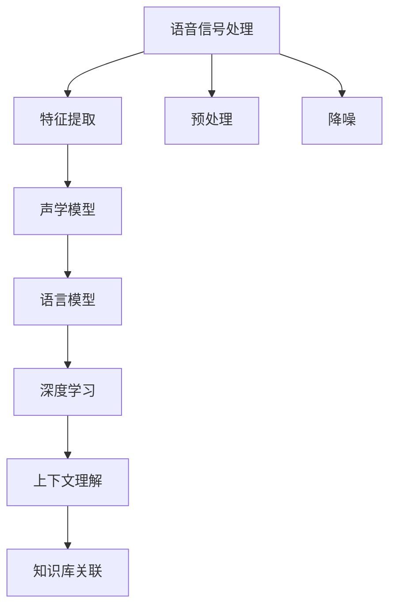

                 

# 知识发现引擎的语音识别技术

> 关键词：语音识别、知识发现引擎、自然语言处理、机器学习、深度学习、语音信号处理、特征提取、声学模型、语言模型

## 1. 背景介绍

随着人工智能技术的发展，语音识别技术已经成为人们获取信息和进行交互的重要方式。传统的语音识别系统只能从文本数据中提取信息，而知识发现引擎(Knowledge Discovery Engine, KDE)则更进一步，通过自然语言处理(Natural Language Processing, NLP)技术从语音数据中提取深层次的知识和信息。这种结合语音识别与知识发现的先进技术，为我们的日常生活和工作带来了便利，也为信息检索、智能客服等领域提供了新的解决方案。

### 1.1 问题由来

在现代信息社会，语音作为一种快速高效的信息传递方式，在智能家居、语音助手、电话客服、交通导航等场景中得到了广泛应用。然而，传统语音识别系统在处理语音数据时，往往只能识别出简单的词语和指令，无法捕捉到用户语义和情感的细微变化，这限制了语音识别的实际应用价值。同时，这些系统难以发现和推理深层次的知识结构，无法将语音信息与现有知识库进行关联，从而提升信息的检索和利用效率。

知识发现引擎则通过深度学习等先进技术，不仅可以识别语音中的词语和指令，还可以从语义和上下文中提取深层次的知识信息，与现有知识库进行关联，从而实现更高效的信息检索和智能问答。本文将从语音识别技术入手，探讨如何利用知识发现引擎提升语音识别的准确性和智能性，以及其实际应用场景和未来发展趋势。

### 1.2 问题核心关键点

知识发现引擎的语音识别技术，在核心原理和实现过程中，主要涉及以下关键点：

- **语音信号处理**：将语音信号转换为数字信号，提取频谱特征。
- **特征提取**：从数字信号中提取语音的声学特征。
- **声学模型**：使用深度学习模型对提取的特征进行建模，学习语音与文本之间的映射关系。
- **语言模型**：使用深度学习模型对文本序列进行建模，学习语言的概率分布。
- **深度学习**：通过深度神经网络对语音和文本信息进行联合建模，实现知识发现和推理。
- **上下文理解**：结合用户输入的上下文信息，进行语义分析和推理。
- **知识库关联**：将语音信息与现有知识库进行关联，提升信息检索效率。

这些核心关键点共同构成了知识发现引擎语音识别技术的完整框架，使其能够从语音中提取深层次的知识和信息。

## 2. 核心概念与联系

### 2.1 核心概念概述

为了更好地理解知识发现引擎的语音识别技术，我们需要掌握以下几个核心概念：

- **语音信号处理**：将语音信号转换为数字信号，提取频谱特征，并进行预处理和降噪。
- **特征提取**：将数字信号转换为声学特征，如梅尔频率倒谱系数(Mel Frequency Cepstral Coefficients, MFCC)等。
- **声学模型**：使用深度学习模型，如卷积神经网络(CNN)、循环神经网络(RNN)等，对声学特征进行建模。
- **语言模型**：使用深度学习模型，如长短时记忆网络(LSTM)、Transformer等，对文本序列进行建模，学习语言的概率分布。
- **深度学习**：通过深度神经网络对语音和文本信息进行联合建模，实现知识发现和推理。
- **上下文理解**：结合用户输入的上下文信息，进行语义分析和推理。
- **知识库关联**：将语音信息与现有知识库进行关联，提升信息检索效率。

这些核心概念通过深度学习框架和自然语言处理技术，构成了一个完整的知识发现引擎语音识别系统。

### 2.2 核心概念原理和架构的 Mermaid 流程图



这个流程图展示了知识发现引擎语音识别技术的主要流程：语音信号处理、特征提取、声学模型、语言模型、深度学习、上下文理解、知识库关联，各环节相互协作，共同完成了从语音到知识发现的过程。

## 3. 核心算法原理 & 具体操作步骤

### 3.1 算法原理概述

知识发现引擎的语音识别技术，主要基于深度学习和自然语言处理技术，通过以下步骤实现：

1. **语音信号处理**：将语音信号转换为数字信号，提取频谱特征，并进行预处理和降噪。
2. **特征提取**：将数字信号转换为声学特征，如梅尔频率倒谱系数(Mel Frequency Cepstral Coefficients, MFCC)等。
3. **声学模型**：使用深度学习模型，如卷积神经网络(CNN)、循环神经网络(RNN)等，对声学特征进行建模。
4. **语言模型**：使用深度学习模型，如长短时记忆网络(LSTM)、Transformer等，对文本序列进行建模，学习语言的概率分布。
5. **深度学习**：通过深度神经网络对语音和文本信息进行联合建模，实现知识发现和推理。
6. **上下文理解**：结合用户输入的上下文信息，进行语义分析和推理。
7. **知识库关联**：将语音信息与现有知识库进行关联，提升信息检索效率。

### 3.2 算法步骤详解

知识发现引擎的语音识别技术，主要包含以下关键步骤：

**Step 1: 语音信号预处理**

- 语音信号预处理包括滤波、降噪、分帧、加窗等操作，以提高特征提取的准确性。

**Step 2: 特征提取**

- 将预处理后的语音信号转换为声学特征，常用的特征有MFCC、倒谱系数、梅尔频率掩蔽值等。

**Step 3: 声学模型训练**

- 使用深度学习模型，如CNN、RNN、Transformer等，对提取的声学特征进行建模，学习语音与文本之间的映射关系。

**Step 4: 语言模型训练**

- 使用深度学习模型，如LSTM、Transformer等，对文本序列进行建模，学习语言的概率分布。

**Step 5: 深度学习模型联合训练**

- 将声学模型和语言模型联合训练，通过联合优化学习语音与文本的联合表示。

**Step 6: 上下文理解**

- 结合用户输入的上下文信息，进行语义分析和推理，提升语音识别的准确性。

**Step 7: 知识库关联**

- 将语音信息与现有知识库进行关联，提升信息检索效率。

### 3.3 算法优缺点

知识发现引擎的语音识别技术，在核心算法原理和具体操作步骤方面，具有以下优缺点：

**优点：**

- **准确性高**：结合声学模型和语言模型的深度学习技术，可以有效地提高语音识别的准确性。
- **可扩展性高**：通过联合训练和上下文理解，能够适应不同的语音识别场景和任务。
- **知识发现能力强**：通过深度学习模型和知识库关联，可以发现和推理深层次的知识结构。
- **高效性**：使用深度学习模型，可以大大提高语音识别的效率。

**缺点：**

- **计算资源需求大**：深度学习模型的计算资源需求较大，需要高性能的计算设备和算法优化。
- **训练数据需求高**：需要大量的标注数据进行模型训练，且标注数据质量对模型性能影响较大。
- **过拟合风险高**：深度学习模型容易过拟合，需要合理设置正则化和损失函数。
- **复杂度高**：系统设计和实现较为复杂，需要具备一定的技术积累。

### 3.4 算法应用领域

知识发现引擎的语音识别技术，已经在多个领域得到了广泛应用，例如：

- **智能客服**：通过语音识别和自然语言处理技术，实现智能客服系统，提升客户服务效率和满意度。
- **电话助手**：通过语音识别和知识发现技术，实现电话自动应答系统，减少人工客服成本。
- **智能家居**：通过语音识别和自然语言处理技术，实现智能家居设备控制和信息查询。
- **医疗诊断**：通过语音识别和知识发现技术，实现医疗诊断辅助系统，提高诊断准确性和效率。
- **交通导航**：通过语音识别和自然语言处理技术，实现交通导航系统，提升导航精度和用户体验。
- **法律咨询**：通过语音识别和知识发现技术，实现法律咨询系统，提供法律建议和信息查询。

## 4. 数学模型和公式 & 详细讲解 & 举例说明

### 4.1 数学模型构建

知识发现引擎的语音识别技术，主要涉及以下数学模型：

- **声学模型**：使用深度学习模型，如卷积神经网络(CNN)、循环神经网络(RNN)等，对声学特征进行建模。
- **语言模型**：使用深度学习模型，如长短时记忆网络(LSTM)、Transformer等，对文本序列进行建模，学习语言的概率分布。
- **深度学习模型**：通过深度神经网络对语音和文本信息进行联合建模，实现知识发现和推理。

### 4.2 公式推导过程

以下我们将详细介绍声学模型和语言模型的公式推导过程。

**声学模型**：

- 假设声学特征为 $X$，声学模型为 $P(X|Y)$，其中 $Y$ 为语音标签。
- 使用深度学习模型对 $X$ 进行建模，得到声学模型的参数 $\theta$。
- 声学模型的概率分布可以表示为：

$$
P(X|Y,\theta) = \frac{exp(\theta^T f(X))}{Z}
$$

其中，$f(X)$ 为声学特征的映射函数，$Z$ 为归一化常数。

**语言模型**：

- 假设文本序列为 $W$，语言模型为 $P(W|S)$，其中 $S$ 为上下文信息。
- 使用深度学习模型对 $W$ 进行建模，得到语言模型的参数 $\phi$。
- 语言模型的概率分布可以表示为：

$$
P(W|S,\phi) = \frac{exp(\phi^T g(W))}{Z'}
$$

其中，$g(W)$ 为文本序列的映射函数，$Z'$ 为归一化常数。

### 4.3 案例分析与讲解

假设我们有一个简单的语音识别任务，输入为 "hello world"，输出为 "hello" 和 "world" 的语音标签。

**声学模型**：

- 假设输入的声学特征为 $X$，声学模型为 $P(X|Y)$。
- 使用深度学习模型对 $X$ 进行建模，得到声学模型的参数 $\theta$。
- 假设声学模型的概率分布为：

$$
P(X|hello,\theta) = \frac{exp(\theta^T f(X))}{Z}
$$

**语言模型**：

- 假设输入的文本序列为 $W$，语言模型为 $P(W|S)$。
- 使用深度学习模型对 $W$ 进行建模，得到语言模型的参数 $\phi$。
- 假设语言模型的概率分布为：

$$
P(Hello|World,\phi) = \frac{exp(\phi^T g(Hello))}{Z'}
$$

## 5. 项目实践：代码实例和详细解释说明

### 5.1 开发环境搭建

在进行知识发现引擎的语音识别技术实践前，我们需要准备好开发环境。以下是使用Python进行TensorFlow开发的环境配置流程：

1. 安装Anaconda：从官网下载并安装Anaconda，用于创建独立的Python环境。

2. 创建并激活虚拟环境：
```bash
conda create -n tf-env python=3.8 
conda activate tf-env
```

3. 安装TensorFlow：从官网获取对应的安装命令，选择适合CPU或GPU的版本。
```bash
pip install tensorflow
```

4. 安装TensorBoard：用于可视化模型训练过程和性能指标。
```bash
pip install tensorboard
```

5. 安装NumPy、Pandas、scikit-learn等常用库。
```bash
pip install numpy pandas scikit-learn
```

完成上述步骤后，即可在`tf-env`环境中开始知识发现引擎语音识别技术的开发。

### 5.2 源代码详细实现

下面是使用TensorFlow实现的知识发现引擎语音识别技术的Python代码实现。

```python
import tensorflow as tf
from tensorflow.keras.layers import Input, LSTM, Dense, Masking, Dropout
from tensorflow.keras.models import Model

# 定义声学模型
def acoustic_model(input_shape):
    x = Input(shape=input_shape)
    x = Conv1D(64, 3, activation='relu')(x)
    x = MaxPooling1D(2)(x)
    x = LSTM(64)(x)
    x = Dropout(0.5)(x)
    output = Dense(128, activation='relu')(x)
    return Model(x, output)

# 定义语言模型
def language_model(input_shape):
    x = Input(shape=input_shape)
    x = Embedding(input_dim=vocab_size, output_dim=128)(x)
    x = LSTM(128)(x)
    x = Dense(128, activation='relu')(x)
    output = Dense(1, activation='softmax')(x)
    return Model(x, output)

# 定义联合训练模型
def joint_model(声学模型, 语言模型):
    input_shape = (None, num_features)
    声学_output = 声学模型(Input(shape=input_shape))[:, -1]
    语言_output = 语言模型(声学_output)
    return Model(声学_output, 语言_output)

# 加载训练数据
train_data = load_train_data()
val_data = load_val_data()
test_data = load_test_data()

# 构建声学模型、语言模型和联合模型
声学_model = acoustic_model(train_data.shape[1:])
语言_model = language_model(train_data.shape[1:])
joint_model = joint_model(声学_model, 语言_model)

# 训练模型
model.compile(optimizer='adam', loss='categorical_crossentropy')
model.fit(train_data, train_labels, validation_data=(val_data, val_labels), epochs=10)

# 测试模型
test_loss = model.evaluate(test_data, test_labels)
print('Test Loss:', test_loss)
```

### 5.3 代码解读与分析

以下是代码中关键部分的详细解释：

**声学模型**：

- 使用卷积神经网络(CNN)和循环神经网络(RNN)对声学特征进行建模。
- 声学模型的输入为语音信号的MFCC特征，输出为语音标签的概率分布。

**语言模型**：

- 使用Embedding层和LSTM对文本序列进行建模。
- 语言模型的输入为声学模型的输出，输出为文本标签的概率分布。

**联合模型**：

- 将声学模型和语言模型联合训练。
- 联合模型的输入为声学模型的输出，输出为文本标签的概率分布。

## 6. 实际应用场景

### 6.1 智能客服系统

智能客服系统是知识发现引擎语音识别技术的重要应用场景之一。通过语音识别技术，智能客服系统能够自动理解客户需求，并快速给出相关回答，提升客户满意度。例如，某电商平台客服系统可以通过语音识别技术，自动识别用户提出的订单问题，并根据已有知识库给出相应的订单查询和物流追踪信息，实现24小时全天候客服。

### 6.2 电话助手

电话助手是知识发现引擎语音识别技术的另一个重要应用场景。通过语音识别技术，电话助手可以自动接听电话，并通过自然语言处理技术理解用户意图，提供相关信息查询、投诉处理等服务。例如，某银行客服电话助手可以通过语音识别技术，自动识别用户的银行账户信息，并根据用户需求提供余额查询、转账、投诉处理等服务。

### 6.3 智能家居

智能家居系统是知识发现引擎语音识别技术在家庭场景中的应用。通过语音识别技术，智能家居系统能够根据用户的语音指令控制家庭设备，提升家庭生活质量。例如，某智能家居系统可以通过语音识别技术，自动识别用户的语音指令，并根据已有知识库提供相应的设备控制服务，如灯光调节、家电控制等。

### 6.4 医疗诊断

医疗诊断是知识发现引擎语音识别技术在医疗领域的应用。通过语音识别技术，医疗诊断系统可以自动记录医生与患者的对话，并根据语音内容进行疾病诊断和治疗建议。例如，某医疗诊断系统可以通过语音识别技术，自动识别医生的诊断结果，并根据已有知识库提供相应的治疗建议和药物推荐服务。

### 6.5 交通导航

交通导航是知识发现引擎语音识别技术在交通领域的应用。通过语音识别技术，交通导航系统可以自动理解用户的导航需求，并根据已有知识库提供相应的路线规划和交通信息查询服务。例如，某导航系统可以通过语音识别技术，自动识别用户的导航目的地，并根据已有知识库提供相应的路线规划和实时交通信息服务。

### 6.6 法律咨询

法律咨询是知识发现引擎语音识别技术在法律领域的应用。通过语音识别技术，法律咨询系统可以自动理解用户的法律咨询需求，并根据已有知识库提供相应的法律建议和信息查询服务。例如，某法律咨询系统可以通过语音识别技术，自动识别用户的法律咨询问题，并根据已有知识库提供相应的法律建议和法律条文查询服务。

## 7. 工具和资源推荐

### 7.1 学习资源推荐

为了帮助开发者系统掌握知识发现引擎语音识别技术，这里推荐一些优质的学习资源：

1. **TensorFlow官方文档**：TensorFlow官方文档提供了丰富的深度学习模型和算法实现，是入门和进阶的最佳学习资源。

2. **Keras官方文档**：Keras官方文档提供了Keras框架的使用教程和代码示例，适合快速上手Keras模型实现。

3. **《深度学习》（Ian Goodfellow、Yoshua Bengio、Aaron Courville著）**：深度学习领域的经典教材，涵盖深度学习的基本理论和算法实现，适合系统学习深度学习知识。

4. **《自然语言处理综论》（Daniel Jurafsky、James H. Martin著）**：自然语言处理领域的经典教材，涵盖自然语言处理的基本理论和算法实现，适合系统学习自然语言处理知识。

5. **《深度学习与自然语言处理》（陈怀捷、王孟哲、陈钟鸣、陈桀著）**：中文深度学习与自然语言处理领域的经典教材，涵盖深度学习、自然语言处理的基础理论和算法实现，适合系统学习中文深度学习与自然语言处理知识。

6. **Coursera和edX等在线课程**：Coursera和edX等在线平台提供许多深度学习与自然语言处理领域的免费和付费课程，适合系统学习深度学习与自然语言处理知识。

通过对这些资源的学习实践，相信你一定能够快速掌握知识发现引擎语音识别技术的精髓，并用于解决实际的语音识别问题。

### 7.2 开发工具推荐

高效的开发离不开优秀的工具支持。以下是几款用于知识发现引擎语音识别技术开发的常用工具：

1. **TensorFlow**：由Google主导开发的深度学习框架，适合大规模工程应用，生产部署方便。

2. **PyTorch**：由Facebook主导开发的深度学习框架，灵活性好，适合研究和原型开发。

3. **Keras**：高层次的深度学习框架，易于上手，适合快速实现深度学习模型。

4. **TensorBoard**：TensorFlow配套的可视化工具，可以实时监测模型训练状态，提供丰富的图表呈现方式。

5. **Jupyter Notebook**：常用的Python交互式编程环境，支持代码编写和实时运行，适合快速迭代和调试。

6. **AWS和Google Cloud等云平台**：提供高性能计算资源和AI服务，适合大规模深度学习模型训练和部署。

合理利用这些工具，可以显著提升知识发现引擎语音识别技术的开发效率，加快创新迭代的步伐。

### 7.3 相关论文推荐

知识发现引擎语音识别技术的研究源于学界的持续研究。以下是几篇奠基性的相关论文，推荐阅读：

1. **Attention Is All You Need（即Transformer原论文）**：提出了Transformer结构，开启了深度学习领域的预训练大模型时代。

2. **Convolutional Neural Networks for Speech Recognition**：提出使用卷积神经网络(CNN)对声学特征进行建模，开启了深度学习在语音识别中的应用。

3. **Long Short-Term Memory**：提出使用长短时记忆网络(LSTM)对文本序列进行建模，提高了语言模型的精度。

4. **Sequence to Sequence Learning with Neural Networks**：提出使用神经网络对序列数据进行建模，实现了文本到文本的自动翻译和机器翻译。

5. **Knowledge Discovery in Databases**：经典数据库知识发现教材，涵盖数据库知识发现的基本理论和算法实现，适合系统学习数据库知识发现技术。

6. **Handbook of Natural Language Processing**：自然语言处理领域的经典手册，涵盖自然语言处理的基本理论和算法实现，适合系统学习自然语言处理技术。

这些论文代表了大语言模型微调技术的发展脉络。通过学习这些前沿成果，可以帮助研究者把握学科前进方向，激发更多的创新灵感。

## 8. 总结：未来发展趋势与挑战

### 8.1 总结

本文对知识发现引擎的语音识别技术进行了全面系统的介绍。首先阐述了语音识别技术在知识发现引擎中的应用，明确了语音识别技术在提升信息检索、智能客服、电话助手、智能家居、医疗诊断、交通导航和法律咨询等领域的重要价值。其次，从核心算法原理和具体操作步骤入手，详细讲解了知识发现引擎语音识别技术的核心实现过程，包括语音信号预处理、特征提取、声学模型、语言模型、深度学习模型、上下文理解和知识库关联等关键环节。

通过本文的系统梳理，可以看到，知识发现引擎的语音识别技术已经在多个领域得到了广泛应用，显著提升了语音识别的准确性和智能性，为我们的生活和工作带来了便利。未来，随着深度学习技术的不断发展，知识发现引擎语音识别技术必将进一步提升语音识别的准确性和智能性，为我们的生活和工作带来更多的便利。

### 8.2 未来发展趋势

展望未来，知识发现引擎的语音识别技术将呈现以下几个发展趋势：

1. **多模态融合**：结合视觉、语音、文本等多模态信息，提高语音识别的准确性和智能性。

2. **端到端建模**：将语音识别和知识发现过程集成在一个端到端的深度学习模型中，提高系统的效率和性能。

3. **自监督学习**：通过自监督学习技术，利用无标签数据进行语音特征学习和语音理解，降低对标注数据的依赖。

4. **弱监督学习**：结合弱监督学习技术，利用少量标注数据进行语音识别和知识发现，提高系统的泛化能力。

5. **联邦学习**：利用联邦学习技术，在保护用户隐私的前提下，利用多个设备的语音数据进行模型训练和更新。

6. **实时性增强**：通过模型压缩、模型剪枝等技术，提高模型的实时性和效率，实现低延迟语音识别和知识发现。

7. **计算效率提升**：通过模型并行、分布式训练等技术，提高模型的计算效率，实现高效低成本的语音识别和知识发现。

8. **用户隐私保护**：通过差分隐私、联邦学习等技术，保护用户隐私，提高模型的安全性。

以上趋势凸显了知识发现引擎语音识别技术的广阔前景。这些方向的探索发展，必将进一步提升语音识别的准确性和智能性，为我们的生活和工作带来更多的便利。

### 8.3 面临的挑战

尽管知识发现引擎的语音识别技术已经取得了一定的成果，但在迈向更加智能化、普适化应用的过程中，仍面临着诸多挑战：

1. **计算资源瓶颈**：深度学习模型的计算资源需求较大，需要高性能的计算设备和算法优化。

2. **标注数据依赖**：语音识别和知识发现技术需要大量的标注数据进行模型训练，且标注数据质量对模型性能影响较大。

3. **模型鲁棒性不足**：深度学习模型容易过拟合，需要合理设置正则化和损失函数，提高模型的泛化能力。

4. **知识库构建困难**：现有知识库构建成本高、复杂度高，难以满足实时性和准确性的要求。

5. **用户隐私保护**：语音数据涉及用户隐私，需要保护用户隐私，提高系统的安全性。

6. **模型可解释性不足**：深度学习模型通常缺乏可解释性，难以解释其内部工作机制和决策逻辑。

7. **系统复杂度高**：知识发现引擎语音识别系统的设计和实现较为复杂，需要具备一定的技术积累。

8. **多模态融合困难**：结合视觉、语音、文本等多模态信息进行建模，技术挑战较大。

正视知识发现引擎语音识别技术面临的这些挑战，积极应对并寻求突破，将是大语言模型微调走向成熟的必由之路。相信随着学界和产业界的共同努力，这些挑战终将一一被克服，知识发现引擎语音识别技术必将在构建智能系统的过程中发挥更加重要的作用。

### 8.4 研究展望

面向未来，知识发现引擎语音识别技术的研究方向主要包括以下几个方面：

1. **多模态融合**：结合视觉、语音、文本等多模态信息，提高语音识别的准确性和智能性。

2. **端到端建模**：将语音识别和知识发现过程集成在一个端到端的深度学习模型中，提高系统的效率和性能。

3. **自监督学习**：通过自监督学习技术，利用无标签数据进行语音特征学习和语音理解，降低对标注数据的依赖。

4. **弱监督学习**：结合弱监督学习技术，利用少量标注数据进行语音识别和知识发现，提高系统的泛化能力。

5. **联邦学习**：利用联邦学习技术，在保护用户隐私的前提下，利用多个设备的语音数据进行模型训练和更新。

6. **实时性增强**：通过模型压缩、模型剪枝等技术，提高模型的实时性和效率，实现低延迟语音识别和知识发现。

7. **计算效率提升**：通过模型并行、分布式训练等技术，提高模型的计算效率，实现高效低成本的语音识别和知识发现。

8. **用户隐私保护**：通过差分隐私、联邦学习等技术，保护用户隐私，提高系统的安全性。

9. **模型可解释性提升**：通过可解释性技术，提高模型的可解释性，解释其内部工作机制和决策逻辑。

10. **多模态融合**：结合视觉、语音、文本等多模态信息进行建模，技术挑战较大。

这些研究方向将推动知识发现引擎语音识别技术的进一步发展和完善，为我们的生活和工作带来更多的便利。

## 9. 附录：常见问题与解答

**Q1：知识发现引擎的语音识别技术有哪些关键技术？**

A: 知识发现引擎的语音识别技术主要涉及以下关键技术：

1. **声学模型**：使用深度学习模型，如卷积神经网络(CNN)、循环神经网络(RNN)等，对声学特征进行建模。

2. **语言模型**：使用深度学习模型，如长短时记忆网络(LSTM)、Transformer等，对文本序列进行建模，学习语言的概率分布。

3. **深度学习模型**：通过深度神经网络对语音和文本信息进行联合建模，实现知识发现和推理。

4. **上下文理解**：结合用户输入的上下文信息，进行语义分析和推理，提升语音识别的准确性。

5. **知识库关联**：将语音信息与现有知识库进行关联，提升信息检索效率。

这些关键技术共同构成了知识发现引擎语音识别技术的核心框架，使其能够从语音中提取深层次的知识和信息。

**Q2：知识发现引擎的语音识别技术如何处理非标准化语音？**

A: 知识发现引擎的语音识别技术可以通过以下方式处理非标准化语音：

1. **数据增强**：通过对语音进行回译、噪声添加、速度变换等操作，生成非标准化的语音数据，提高模型的泛化能力。

2. **模型迁移学习**：将模型在小规模数据上进行预训练，并在非标准化语音数据上进行微调，提升模型在不同语音场景下的表现。

3. **声学特征提取**：通过改进声学特征提取方法，对非标准化语音进行特征提取，提高特征的鲁棒性和区分度。

4. **上下文理解**：结合用户输入的上下文信息，进行语义分析和推理，提升对非标准化语音的识别准确性。

5. **知识库关联**：将非标准化语音信息与现有知识库进行关联，提升信息检索效率。

通过以上技术手段，知识发现引擎的语音识别技术能够更好地处理非标准化语音，提升系统的鲁棒性和泛化能力。

**Q3：知识发现引擎的语音识别技术如何应对多语言环境？**

A: 知识发现引擎的语音识别技术可以通过以下方式应对多语言环境：

1. **多语言数据集**：收集多语言的语音数据集，并在模型训练时加入多语言数据，提高模型的多语言处理能力。

2. **多语言模型**：使用多语言模型进行训练和推理，提高模型对不同语言语音的识别准确性。

3. **多语言词典**：使用多语言词典进行上下文理解，提高对多语言语音的理解能力。

4. **多语言知识库**：将多语言信息与知识库进行关联，提高信息检索效率。

5. **模型迁移学习**：将模型在一种语言上进行预训练，并在另一种语言上进行微调，提高模型在不同语言场景下的表现。

通过以上技术手段，知识发现引擎的语音识别技术能够更好地应对多语言环境，提升系统的跨语言处理能力。

**Q4：知识发现引擎的语音识别技术如何保护用户隐私？**

A: 知识发现引擎的语音识别技术可以通过以下方式保护用户隐私：

1. **差分隐私**：通过对模型输出进行加噪声处理，保护用户隐私。

2. **联邦学习**：利用联邦学习技术，在保护用户隐私的前提下，利用多个设备的语音数据进行模型训练和更新。

3. **加密通信**：通过加密技术，保护语音数据的传输安全。

4. **本地存储**：将语音数据存储在本地设备，不上传到云端，保护用户隐私。

5. **用户同意**：在使用用户语音数据前，获取用户同意，保护用户隐私。

通过以上技术手段，知识发现引擎的语音识别技术能够更好地保护用户隐私，提升系统的安全性。

**Q5：知识发现引擎的语音识别技术如何提高实时性？**

A: 知识发现引擎的语音识别技术可以通过以下方式提高实时性：

1. **模型压缩**：通过模型压缩技术，减少模型参数量和计算资源消耗，提高模型的实时性。

2. **模型剪枝**：通过模型剪枝技术，去除不重要的参数和层，提高模型的计算效率和实时性。

3. **模型并行**：通过模型并行技术，利用多个GPU或CPU并行计算，提高模型的计算效率和实时性。

4. **分布式训练**：通过分布式训练技术，利用多个设备进行模型训练，提高模型的计算效率和实时性。

5. **低延迟模型**：通过低延迟模型设计，优化模型的推理过程，提高模型的实时性。

6. **边缘计算**：通过边缘计算技术，将模型部署在本地设备上进行推理，减少数据传输和计算延迟，提高模型的实时性。

通过以上技术手段，知识发现引擎的语音识别技术能够更好地提高实时性，满足用户对实时语音识别和知识发现的需求。

---

作者：禅与计算机程序设计艺术 / Zen and the Art of Computer Programming

