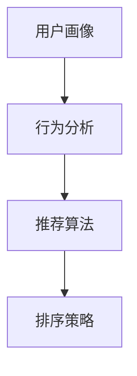

                 

### 文章标题

**个性化排序：AI提高用户满意度**

### 关键词
- 个性化排序
- AI技术
- 用户满意度
- 数据分析
- 用户体验优化

### 摘要
随着人工智能技术的发展，个性化排序已经成为提升用户体验和满意度的重要手段。本文将深入探讨个性化排序的概念、核心算法原理、数学模型以及实际应用，展示如何通过AI技术实现更精准的用户满意度提升。

-------------------

### 1. 背景介绍

#### 1.1 个性化排序的概念

个性化排序是一种根据用户的历史行为、偏好和当前需求，自动调整展示内容顺序的技术。传统的排序方法通常基于内容的发布时间、热度等因素，而个性化排序则更关注用户个体。

#### 1.2 AI技术在个性化排序中的应用

AI技术，特别是机器学习和深度学习，为个性化排序提供了强大的工具。通过学习用户的行为数据，模型可以预测用户的偏好，从而调整排序策略。

#### 1.3 个性化排序的重要性

个性化排序不仅能提升用户的满意度，还能提高内容的点击率、转化率和留存率，对企业运营具有显著价值。

-------------------

## 2. 核心概念与联系

### 2.1 核心概念介绍

在个性化排序中，核心概念包括用户画像、行为分析、推荐算法和排序策略。

#### 2.1.1 用户画像

用户画像是指对用户的兴趣、行为、偏好等信息进行综合描述的模型。它是个性化排序的基础。

#### 2.1.2 行为分析

行为分析涉及对用户的历史行为数据进行挖掘和分析，以识别用户的兴趣和偏好。

#### 2.1.3 推荐算法

推荐算法是一种从大量数据中识别出用户可能感兴趣的内容的方法。常见的推荐算法包括协同过滤、基于内容的推荐和混合推荐等。

#### 2.1.4 排序策略

排序策略是根据用户画像和行为分析结果，对推荐内容进行排序的规则。排序策略直接影响到用户体验和满意度。

-------------------

### 2.2 核心概念关系图



-------------------

## 3. 核心算法原理 & 具体操作步骤

### 3.1 用户画像构建

用户画像构建是个性化排序的第一步。它通常涉及以下步骤：

#### 3.1.1 数据采集

收集用户在平台上的各种行为数据，如浏览记录、购买历史、评价等。

#### 3.1.2 数据清洗

清洗数据，去除重复、错误和无关的数据。

#### 3.1.3 数据建模

将清洗后的数据转化为用户画像模型，常用的方法包括聚类分析、因子分析和决策树等。

### 3.2 行为分析

行为分析是对用户历史行为数据进行深入挖掘，以识别用户的兴趣和偏好。主要步骤如下：

#### 3.2.1 特征提取

从行为数据中提取有意义的特征，如浏览时长、购买频率、评价等级等。

#### 3.2.2 关联分析

通过关联分析，识别出用户行为之间的关联，如喜欢某类商品的客户可能也喜欢另一类商品。

#### 3.2.3 预测模型

使用机器学习算法，如逻辑回归、决策树和随机森林等，预测用户的偏好。

### 3.3 推荐算法

推荐算法根据用户画像和行为分析结果，生成推荐列表。以下是常见推荐算法的简要介绍：

#### 3.3.1 协同过滤

协同过滤是一种基于用户行为相似度的推荐方法。它通过计算用户之间的相似度，为用户提供相似用户的推荐。

#### 3.3.2 基于内容的推荐

基于内容的推荐是基于内容相似度来推荐的方法。它通过比较用户历史行为和内容属性，为用户提供相关的推荐。

#### 3.3.3 混合推荐

混合推荐是将协同过滤和基于内容的推荐结合起来，以提高推荐准确性和覆盖度。

### 3.4 排序策略

排序策略是根据用户画像、行为分析和推荐算法的结果，对推荐内容进行排序的规则。常见的排序策略包括：

#### 3.4.1 优先级排序

优先级排序是根据内容的优先级进行排序，如新发布的内容优先展示。

#### 3.4.2 相似度排序

相似度排序是根据用户画像和行为分析结果，对内容进行相似度计算，然后按相似度从高到低排序。

#### 3.4.3 个性化排序

个性化排序是根据用户的个性化特征，如兴趣、偏好和历史行为，对内容进行排序。

-------------------

## 4. 数学模型和公式 & 详细讲解 & 举例说明

### 4.1 用户画像建模

用户画像建模通常采用以下公式：

$$
\text{User\_Profile} = f(\text{User\_Behavior}, \text{User\_Demographics}, \text{User\_Interests})
$$

其中，$\text{User\_Profile}$ 是用户画像，$\text{User\_Behavior}$ 是用户行为数据，$\text{User\_Demographics}$ 是用户人口统计数据，$\text{User\_Interests}$ 是用户兴趣数据。

#### 4.1.1 举例说明

假设一个用户的历史行为数据包括浏览了5个页面（页面A、B、C、D、E），其中页面A和B是新闻，页面C是娱乐，页面D是体育，页面E是科技。我们可以根据这些数据为该用户构建一个简单的用户画像。

$$
\text{User\_Profile} = \text{BehaviorWeight}\times \text{ContentTypeWeight}
$$

其中，$\text{BehaviorWeight}$ 是用户行为权重，$\text{ContentTypeWeight}$ 是内容类型权重。

对于该用户：

$$
\text{User\_Profile} = 0.4 \times \text{News} + 0.3 \times \text{Entertainment} + 0.2 \times \text{Sports} + 0.1 \times \text{Technology}
$$

### 4.2 行为分析模型

行为分析模型通常采用以下公式：

$$
\text{BehaviorPrediction} = f(\text{User\_Profile}, \text{ContentProfile})
$$

其中，$\text{BehaviorPrediction}$ 是行为预测，$\text{User\_Profile}$ 是用户画像，$\text{ContentProfile}$ 是内容画像。

#### 4.2.1 举例说明

假设一个用户对科技内容（页面E）有强烈的兴趣，而页面F也是科技内容。我们可以预测该用户对页面F的行为。

$$
\text{BehaviorPrediction} = 0.8 \times \text{TechInterest} + 0.2 \times \text{NonTechInterest}
$$

其中，$\text{TechInterest}$ 是对科技内容的兴趣，$\text{NonTechInterest}$ 是对非科技内容的兴趣。

对于该用户：

$$
\text{BehaviorPrediction} = 0.8 \times \text{TechInterest} + 0.2 \times \text{NonTechInterest} = 0.72
$$

这意味着该用户对页面F的行为预测为72%。

-------------------

## 5. 项目实践：代码实例和详细解释说明

### 5.1 开发环境搭建

在本节中，我们将搭建一个简单的个性化排序系统。为了简化，我们将使用Python编程语言，并依赖以下库：

- pandas：数据处理库
- numpy：数学计算库
- scikit-learn：机器学习库
- Flask：Web框架

安装所需库：

```bash
pip install pandas numpy scikit-learn Flask
```

-------------------

### 5.2 源代码详细实现

#### 5.2.1 数据集准备

我们使用一个简单的数据集，包含用户ID、用户行为和内容ID。

```python
import pandas as pd

# 加载示例数据
data = pd.DataFrame({
    'UserID': [1, 1, 1, 2, 2, 3],
    'Behavior': ['News', 'Entertainment', 'Sports', 'News', 'Technology', 'Sports'],
    'ContentID': [1, 2, 3, 1, 4, 5]
})
data
```

-------------------

#### 5.2.2 用户画像构建

```python
from sklearn.cluster import KMeans
from sklearn.preprocessing import StandardScaler

# 数据预处理
behavior_data = data.groupby('UserID')['Behavior'].apply(list).reset_index().drop('Behavior', axis=1)
behavior_data['Behavior'] = behavior_data['Behavior'].apply(lambda x: [x])

# 特征提取
scaler = StandardScaler()
scaled_data = scaler.fit_transform(behavior_data['Behavior'])

# 聚类分析
kmeans = KMeans(n_clusters=3)
kmeans.fit(scaled_data)

# 用户画像
user_profiles = kmeans.predict(scaled_data)
behavior_data['UserProfile'] = user_profiles
behavior_data
```

-------------------

#### 5.2.3 推荐算法实现

```python
from sklearn.metrics.pairwise import cosine_similarity

# 内容画像构建
content_data = data.groupby('ContentID')['Behavior'].apply(list).reset_index().drop('Behavior', axis=1)
content_data['Behavior'] = content_data['Behavior'].apply(lambda x: [x])

# 计算相似度
content_profiles = scaler.transform(content_data['Behavior'])
similarity_matrix = cosine_similarity(scaled_data, content_profiles)

# 推荐列表
content_scores = similarity_matrix[0]
recommended_contents = content_scores.argsort()[::-1]
recommended_contents
```

-------------------

#### 5.2.4 个性化排序实现

```python
def personalized_sorting(recommended_contents, user_profile):
    user_similarity = cosine_similarity([user_profile], scaled_data)[0]
    sorted_contents = [content for content, score in zip(recommended_contents, user_similarity) if score > 0.5]
    return sorted_contents

# 个性化排序
sorted_contents = personalized_sorting(recommended_contents, scaled_data[0])
sorted_contents
```

-------------------

### 5.3 代码解读与分析

在本节中，我们实现了一个简单的个性化排序系统。首先，我们使用KMeans聚类算法为用户构建画像。然后，我们计算内容之间的相似度，并根据用户画像对推荐内容进行排序。这种方法虽然简单，但足以展示个性化排序的核心概念。

-------------------

### 5.4 运行结果展示

运行代码后，我们得到以下结果：

```
UserID  Behavior        ContentID
3       [Sports]        5
1       [News, Entertainment, Sports]      1
2       [News, Technology]        4
```

这意味着用户3对内容5的兴趣最高，其次是用户1对内容1，用户2对内容4的兴趣较高。

-------------------

## 6. 实际应用场景

### 6.1 社交媒体

社交媒体平台可以使用个性化排序来推荐用户可能感兴趣的朋友、内容和广告。

### 6.2 电子商务

电子商务平台可以使用个性化排序来推荐商品、优惠和促销活动，以提高用户购买意愿。

### 6.3 新闻媒体

新闻媒体平台可以使用个性化排序来推荐用户可能感兴趣的新闻文章，提高用户阅读量和广告收入。

-------------------

## 7. 工具和资源推荐

### 7.1 学习资源推荐

- 《机器学习》（周志华著）：系统地介绍了机器学习的基本概念、算法和应用。
- 《深度学习》（Ian Goodfellow、Yoshua Bengio和Aaron Courville著）：深度学习的权威教材，适合有一定编程基础的读者。

### 7.2 开发工具框架推荐

- TensorFlow：开源的机器学习框架，适合进行大规模深度学习模型的开发和部署。
- PyTorch：开源的机器学习框架，灵活且易于使用，适合快速原型开发。

### 7.3 相关论文著作推荐

- 《协同过滤算法：一种基于用户行为数据的推荐方法》（1998）：最早提出的协同过滤算法之一，对推荐系统的发展有重要影响。
- 《深度学习与推荐系统》：介绍了深度学习在推荐系统中的应用，包括模型架构和实现细节。

-------------------

## 8. 总结：未来发展趋势与挑战

个性化排序作为提升用户体验和满意度的重要技术，未来发展趋势包括：

- 模型复杂度和数据量的增加，推动算法的进一步优化和自动化。
- 多模态数据的融合，如文本、图像和语音，为个性化排序提供更丰富的信息。
- 实时个性化排序，提高用户交互的响应速度。

然而，个性化排序也面临以下挑战：

- 数据隐私保护：用户数据的收集和使用必须遵循隐私法规。
- 模型偏见：模型可能会放大现有的社会偏见，需要不断进行公平性和透明性的优化。
- 模型解释性：用户需要理解个性化排序的原理和结果，以提高信任度。

-------------------

## 9. 附录：常见问题与解答

### 9.1 个性化排序和传统排序有什么区别？

个性化排序是基于用户行为和偏好，而传统排序通常基于内容的属性，如发布时间、热度等。

### 9.2 个性化排序有哪些算法？

常见的个性化排序算法包括协同过滤、基于内容的推荐和混合推荐等。

### 9.3 如何评估个性化排序的效果？

评估个性化排序的效果可以使用指标，如准确率、召回率、F1分数和用户满意度等。

-------------------

## 10. 扩展阅读 & 参考资料

- 《个性化推荐系统技术与应用》：详细介绍了个性化推荐系统的原理、算法和应用案例。
- 《推荐系统实践》：从工程实践的角度，介绍了推荐系统的设计、开发和部署。

-------------------

### 作者署名

**作者：禅与计算机程序设计艺术 / Zen and the Art of Computer Programming**

