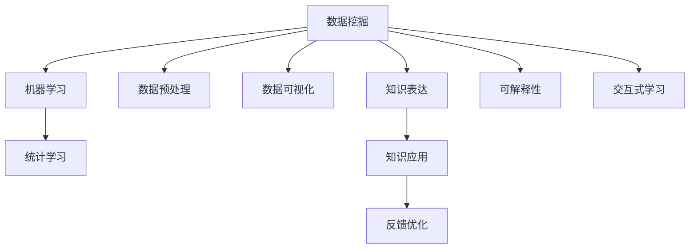

                 

# 知识发现引擎：人类智慧的新纪元

## 1. 背景介绍

### 1.1 问题由来

在信息化爆炸的今天，大数据已经渗透到社会生活的各个层面，从科学研究、经济决策到社会治理，处处离不开数据的支持。然而，仅靠人工挖掘数据中所蕴含的智慧，已经远远无法满足现代社会的需求。

数字化转型浪潮下，如何从海量数据中自动地发现和挖掘出有用的知识，成为了各国企业、科研机构和政府机构竞相攻克的难题。知识发现(Knowledge Discovery, KD)技术应运而生，成为了人类智慧的新纪元。

### 1.2 问题核心关键点

知识发现指的是通过数据挖掘、机器学习和统计学方法，自动地从原始数据中发现有价值、可应用的知识的过程。其核心关键点包括：

- **数据源的多样性**：知识发现技术需要对多种类型的数据源进行综合处理，如结构化数据库、非结构化文本、图像、音频、视频等。
- **数据分析的自动化**：利用先进的算法和工具，自动对数据进行清洗、处理、特征提取、模式识别等。
- **知识表达的泛化性**：知识发现的目标是构建出能够泛化、迁移的新知识，而非简单的统计规律。
- **模型的可解释性**：知识发现模型不仅要输出结果，还要能够解释模型发现的知识。
- **发现过程的交互性**：知识发现过程通常是一个迭代、交互的过程，需要与人进行有效沟通。

这些核心关键点决定了知识发现技术的复杂性和多样性，也为其带来了广阔的应用前景。

### 1.3 问题研究意义

研究知识发现技术，对于推动科学发现、促进经济转型、改进社会治理等诸多领域，都具有重要意义：

1. **科学研究的利器**：自动化的数据挖掘能够发现难以用传统方法揭示的新现象、新规律，推动科学研究的进步。
2. **经济决策的支持**：企业通过数据挖掘可以发现市场趋势、客户需求，提升决策的科学性和准确性。
3. **社会治理的智能化**：政府可以利用大数据分析社会动态、预测发展趋势，提升治理能力，促进社会和谐。
4. **知识经济的崛起**：知识发现技术可以帮助企业发掘新的商业机会，构建知识生态，实现知识资产的商业化。
5. **智能化创新的驱动**：知识发现技术为人工智能、机器学习、自然语言处理等前沿技术提供了有力的支撑。

## 2. 核心概念与联系

### 2.1 核心概念概述

为更好地理解知识发现技术的原理和架构，本节将介绍几个关键概念：

- **知识发现**(Knowledge Discovery, KD)：通过数据挖掘和分析技术，自动地从数据中发现有意义、可应用的知识。
- **数据挖掘**(Data Mining, DM)：从数据中抽取模式、发现知识、总结规律的过程。
- **机器学习**(Machine Learning, ML)：利用数据训练模型，自动进行特征选择、模式识别、预测等。
- **统计学习**(Statistical Learning)：通过统计方法对数据进行分析、建模、预测。
- **数据预处理**(Data Preprocessing)：包括数据清洗、归一化、标准化、降维等，为后续分析提供准备。
- **数据可视化**(Data Visualization)：使用图表、图像等形式，将数据信息直观展示出来，辅助分析决策。
- **知识表达**(Knowledge Representation)：将知识以结构化或非结构化的形式表达出来，便于应用和传播。
- **可解释性**(Interpretability)：知识发现模型应具备良好的可解释性，能够解释其发现过程和结果。
- **交互式学习**(Interactive Learning)：通过人机交互的方式，优化知识发现过程。

这些核心概念之间的逻辑关系可以通过以下Mermaid流程图来展示：



这个流程图展示出了知识发现技术的核心组成和关键流程：

1. 从数据挖掘开始，将原始数据进行预处理、清洗和特征提取。
2. 应用机器学习和统计学习方法，对数据进行建模和分析。
3. 通过数据可视化展示分析结果，并进行人工校验。
4. 将知识表达为结构化或非结构化形式，便于应用和传播。
5. 提供知识发现模型的可解释性，增强可信度。
6. 通过交互式学习不断优化知识发现过程。
7. 最终将发现的知识应用于实际场景中，并进行反馈优化。

## 3. 核心算法原理 & 具体操作步骤
### 3.1 算法原理概述

知识发现技术主要通过以下步骤实现：

1. **数据预处理**：对原始数据进行清洗、归一化、降维等预处理操作，提取关键特征。
2. **模型训练**：选择合适的机器学习模型，如分类、聚类、回归、关联规则等，对数据进行训练。
3. **知识发现**：通过训练好的模型对数据进行分析和预测，发现其中的模式和规律。
4. **结果评估**：对模型发现的知识进行评估和验证，确保其可靠性。
5. **知识表达**：将发现的知识表达为结构化或非结构化的形式，便于应用和传播。

核心算法原理主要涉及以下几个方面：

- **特征选择**：选择对知识发现有用的特征，去除冗余和噪声。
- **模型选择**：选择合适的机器学习模型，构建知识发现模型。
- **参数优化**：通过交叉验证等技术优化模型参数，提升模型性能。
- **性能评估**：通过精确度、召回率、F1分数等指标评估模型性能。

### 3.2 算法步骤详解

**Step 1: 数据预处理**

1. **数据清洗**：去除噪声、缺失值、异常值等，确保数据质量。
2. **数据归一化**：将数据缩放到一定范围，方便后续计算。
3. **数据降维**：通过主成分分析(PCA)、t-SNE等方法，减少数据维度，提高处理效率。
4. **特征选择**：通过卡方检验、互信息等方法，选择有意义的特征。

**Step 2: 模型训练**

1. **模型选择**：根据问题类型选择合适的机器学习模型，如决策树、支持向量机、神经网络等。
2. **模型训练**：利用训练集对模型进行训练，得到初始模型。
3. **参数优化**：通过交叉验证、网格搜索等方法，调整模型参数，提升模型性能。

**Step 3: 知识发现**

1. **模式识别**：利用训练好的模型对数据进行预测，发现模式和规律。
2. **异常检测**：识别数据中的异常值，进行分析和处理。
3. **关联规则**：通过Apriori等算法，发现数据中的关联规则。
4. **聚类分析**：通过K-means等算法，对数据进行聚类。

**Step 4: 结果评估**

1. **性能评估**：使用精确度、召回率、F1分数等指标评估模型性能。
2. **结果验证**：在测试集上对模型进行验证，确保泛化性能。
3. **特征重要性**：通过特征重要性分析，选择关键特征。

**Step 5: 知识表达**

1. **结果可视化**：将发现的知识通过图表、图像等形式展示出来。
2. **结果存储**：将知识存储为结构化或非结构化形式，方便后续应用。

### 3.3 算法优缺点

知识发现技术具有以下优点：

- **自动化程度高**：通过算法自动处理数据，减少了人工干预，提高了效率。
- **泛化性强**：知识发现模型能够对未知数据进行泛化，发现新的规律和模式。
- **可解释性好**：许多知识发现算法具有较好的可解释性，便于理解和应用。
- **适应性强**：可以适应不同类型的数据源和分析需求。

同时，知识发现技术也存在以下缺点：

- **数据质量要求高**：数据质量对知识发现的效果有重要影响，数据清洗和预处理非常关键。
- **算法复杂度高**：许多知识发现算法计算复杂度高，需要较强的计算资源。
- **模型选择困难**：不同问题类型可能需要不同的模型，选择合适的模型不容易。
- **结果可信度低**：知识发现结果可能存在偏差，需要人工验证和解释。

尽管如此，知识发现技术仍然是大数据时代的重要利器，对于科学、经济、社会等领域具有广泛的应用前景。

### 3.4 算法应用领域

知识发现技术已经在多个领域得到了广泛的应用，例如：

- **科学研究**：自动从科学文献中发现新的科学规律和理论。
- **金融分析**：利用历史数据预测股票价格、市场趋势等。
- **医疗诊断**：通过患者数据发现疾病特征和关联。
- **市场营销**：分析消费者行为，制定更有效的营销策略。
- **社交网络分析**：分析社交网络中的关系和传播规律。
- **公共安全**：分析犯罪数据，预测犯罪趋势，提高警务效率。
- **环境监测**：分析环境数据，发现污染源和治理方案。
- **文化遗产保护**：自动从文化遗产数据中发现历史变迁和价值规律。

## 4. 数学模型和公式 & 详细讲解 & 举例说明

### 4.1 数学模型构建

知识发现技术的数学模型主要包括以下几个方面：

- **数据预处理**：
  - **数据清洗**：去除噪声、缺失值、异常值等。
  - **数据归一化**：使用标准化公式将数据缩放到[0,1]范围内。
  - **数据降维**：通过主成分分析(PCA)将数据降维，减少计算量。

- **模型训练**：
  - **分类模型**：利用逻辑回归、决策树等算法进行分类。
  - **回归模型**：利用线性回归、支持向量机等算法进行回归。
  - **聚类模型**：利用K-means等算法进行聚类。

- **知识发现**：
  - **关联规则**：利用Apriori算法发现数据中的关联规则。
  - **异常检测**：利用孤立森林等算法检测异常值。

- **结果评估**：
  - **性能指标**：使用精确度、召回率、F1分数等指标评估模型性能。
  - **特征重要性**：使用信息增益、卡方检验等方法选择关键特征。

### 4.2 公式推导过程

以分类模型为例，详细推导逻辑回归模型的公式。

假设有一组数据集 $D=\{(x_i, y_i)\}_{i=1}^N$，其中 $x_i$ 为特征向量，$y_i$ 为标签。分类任务的目标是找到一个最优的模型 $f(x;w)$，使得预测结果与真实标签尽可能接近。

在训练集 $D$ 上，利用逻辑回归模型进行分类，其目标函数为：

$$
\mathcal{L}(w) = -\frac{1}{N} \sum_{i=1}^N \log f(x_i;w)
$$

其中 $f(x;w)$ 为逻辑回归模型，$w$ 为模型参数。为了简化公式，假设 $f(x;w)$ 的形式为：

$$
f(x;w) = \sigma(w^Tx + b)
$$

其中 $\sigma$ 为 sigmoid 函数，$w$ 和 $b$ 为模型参数。

将上述公式代入目标函数，得：

$$
\mathcal{L}(w) = -\frac{1}{N} \sum_{i=1}^N [y_i \log \sigma(w^T x_i + b) + (1-y_i) \log (1-\sigma(w^T x_i + b))]
$$

在训练集 $D$ 上求导，并令导数为零，得：

$$
\frac{\partial \mathcal{L}(w)}{\partial w} = \frac{1}{N} \sum_{i=1}^N [y_i (x_i - \sigma(w^T x_i + b)x_i) - (1-y_i) \sigma(w^T x_i + b)x_i] = 0
$$

化简得：

$$
w^T (x_i - \sigma(w^T x_i + b)x_i) = 0
$$

进一步化简得：

$$
w = \frac{\sum_{i=1}^N (y_i - \sigma(w^T x_i + b)) x_i}{\sum_{i=1}^N (1 - \sigma(w^T x_i + b)) x_i^2}
$$

最终得到逻辑回归模型的参数更新公式：

$$
w \leftarrow w - \eta \nabla_{w}\mathcal{L}(w) = w - \eta \frac{1}{N} \sum_{i=1}^N [y_i (x_i - \sigma(w^T x_i + b)x_i) - (1-y_i) \sigma(w^T x_i + b)x_i]
$$

其中 $\eta$ 为学习率。

## 5. 项目实践：代码实例和详细解释说明

### 5.1 开发环境搭建

在开始项目实践前，我们需要准备好开发环境。以下是使用Python进行Pandas、Scikit-learn等数据处理和机器学习库的开发环境配置流程：

1. 安装Anaconda：从官网下载并安装Anaconda，用于创建独立的Python环境。

2. 创建并激活虚拟环境：
```bash
conda create -n data-mining python=3.8 
conda activate data-mining
```

3. 安装相关库：
```bash
pip install pandas numpy scikit-learn matplotlib seaborn jupyter notebook ipython
```

4. 安装可视化库：
```bash
pip install matplotlib seaborn
```

完成上述步骤后，即可在`data-mining`环境中开始项目实践。

### 5.2 源代码详细实现

接下来，我们以一个简单的分类任务为例，使用Pandas和Scikit-learn库对数据进行处理和分类。

首先，定义数据集和标签：

```python
import pandas as pd
from sklearn.model_selection import train_test_split

# 加载数据集
data = pd.read_csv('data.csv')

# 定义标签
labels = data['label'].map({'positive': 1, 'negative': 0})
```

然后，进行数据预处理：

```python
# 特征选择
features = data[['feature1', 'feature2', 'feature3']]
features.dropna(inplace=True)

# 数据标准化
from sklearn.preprocessing import StandardScaler
scaler = StandardScaler()
features = scaler.fit_transform(features)
```

接着，划分训练集和测试集：

```python
# 划分数据集
X_train, X_test, y_train, y_test = train_test_split(features, labels, test_size=0.2, random_state=42)
```

然后，构建和训练模型：

```python
from sklearn.linear_model import LogisticRegression

# 构建逻辑回归模型
model = LogisticRegression()

# 训练模型
model.fit(X_train, y_train)
```

最后，评估模型性能：

```python
# 预测测试集
y_pred = model.predict(X_test)

# 评估模型性能
from sklearn.metrics import classification_report
print(classification_report(y_test, y_pred))
```

以上就是使用Python对数据进行预处理、分类和评估的完整代码实现。可以看到，得益于Pandas和Scikit-learn库的强大封装，代码实现变得简洁高效。

### 5.3 代码解读与分析

让我们再详细解读一下关键代码的实现细节：

**数据预处理**：
- `features.dropna(inplace=True)`：去除数据中的缺失值。
- `scaler = StandardScaler()`：创建标准化器，对特征进行标准化处理。
- `scaler.fit_transform(features)`：对特征进行标准化，得到标准化的特征矩阵。

**模型训练**：
- `model.fit(X_train, y_train)`：在训练集上训练逻辑回归模型。

**模型评估**：
- `y_pred = model.predict(X_test)`：在测试集上对模型进行预测。
- `classification_report(y_test, y_pred)`：使用精确度、召回率、F1分数等指标评估模型性能。

**代码实现**：
- `import pandas as pd`：导入Pandas库，用于数据处理。
- `from sklearn.model_selection import train_test_split`：导入Scikit-learn库，用于划分数据集。
- `from sklearn.linear_model import LogisticRegression`：导入Scikit-learn库，构建逻辑回归模型。
- `from sklearn.metrics import classification_report`：导入Scikit-learn库，评估模型性能。

## 6. 实际应用场景

### 6.1 金融风险控制

金融行业对数据安全性和合规性有极高的要求，知识发现技术通过自动化的数据分析，能够有效识别风险点，辅助金融机构制定风险控制策略。

在金融风控领域，知识发现技术可以应用于以下几个方面：

- **信用评分**：通过分析客户的借贷记录、信用报告等信息，构建信用评分模型，评估客户信用风险。
- **欺诈检测**：利用历史交易数据，识别异常交易行为，防止金融欺诈。
- **市场预测**：通过分析历史行情、新闻事件等信息，预测股票价格和市场趋势。

### 6.2 医疗诊断与治疗

医疗领域数据量庞大，且涉及隐私和安全问题，知识发现技术通过自动化的数据挖掘，能够发现疾病特征和关联，辅助医生制定诊断和治疗方案。

在医疗诊断领域，知识发现技术可以应用于以下几个方面：

- **疾病预测**：通过分析患者的基因、临床数据等信息，预测疾病的发生概率和风险。
- **治疗方案优化**：利用历史病例数据，发现最优治疗方案，提高治疗效果。
- **药物研发**：通过分析药物的临床试验数据，发现药物的副作用和疗效。

### 6.3 智能客服与推荐系统

智能客服和推荐系统是现代电商、社交媒体、在线教育等领域的核心技术，通过知识发现技术，可以大幅提升服务质量和用户满意度。

在智能客服领域，知识发现技术可以应用于以下几个方面：

- **客户分类**：通过分析客户的历史行为和反馈信息，将客户分类，提供个性化的服务。
- **问题解答**：利用自然语言处理技术，自动分析客户的问题，并提供最佳答案。
- **营销策略**：通过分析客户偏好和行为数据，提供精准的营销推荐。

## 7. 工具和资源推荐

### 7.1 学习资源推荐

为了帮助开发者系统掌握知识发现技术的理论基础和实践技巧，这里推荐一些优质的学习资源：

1. 《数据挖掘与统计学习基础》：经典教材，全面介绍了数据挖掘和统计学习的基本概念和常用算法。
2. 《Python数据科学手册》：详细介绍了Python在数据处理、机器学习中的应用，适合初学者和进阶者。
3. 《机器学习实战》：通过实例演示，介绍了多种机器学习算法的实现方法，适合动手实践。
4. 《KDD Cup竞赛指南》：详细介绍了KDD Cup数据挖掘竞赛的流程和策略，适合竞赛选手和算法研究员。
5. 《机器学习：实战应用》：通过实际案例，介绍了机器学习算法在各行各业的应用，适合实战学习。

通过对这些资源的学习实践，相信你一定能够快速掌握知识发现技术的精髓，并用于解决实际的业务问题。

### 7.2 开发工具推荐

高效的开发离不开优秀的工具支持。以下是几款用于知识发现开发的常用工具：

1. Jupyter Notebook：免费的交互式开发环境，支持Python、R、SQL等多种语言。
2. RStudio：开源的R语言开发环境，集成了多种数据处理和分析工具。
3. Tableau：可视化分析工具，支持拖放式数据可视化。
4. Orange：开源的数据挖掘和可视化工具，适合初学者入门。
5. RapidMiner：商业化的数据科学平台，提供强大的数据处理和建模功能。
6. Python Scikit-learn：Python机器学习库，提供了多种常用的数据处理和机器学习算法。

合理利用这些工具，可以显著提升知识发现任务的开发效率，加快创新迭代的步伐。

### 7.3 相关论文推荐

知识发现技术的研究始于数据挖掘领域，随着其应用的深入，逐渐与机器学习、统计学等领域融合。以下是几篇奠基性的相关论文，推荐阅读：

1. KDD 1998：《The 1998 KDD Cup》：数据挖掘领域的经典竞赛，推动了知识发现技术的发展。
2. 《Knowledge Discovery in Databases》：全面介绍了知识发现技术的基本框架和关键技术。
3. 《Data Mining: Concepts and Techniques》：经典的教材，系统介绍了数据挖掘和机器学习的理论和方法。
4. 《Anomaly Detection: A Survey》：综述了异常检测算法的研究进展和应用。
5. 《Association Rules in Large Databases: An Overview》：介绍了关联规则挖掘算法的研究进展和应用。
6. 《Pattern Mining: On the Design of Algorithms and Their Performance》：介绍了模式挖掘算法的原理和性能评估。

这些论文代表了大数据时代知识发现技术的发展脉络，通过学习这些前沿成果，可以帮助研究者把握学科前进方向，激发更多的创新灵感。

## 8. 总结：未来发展趋势与挑战

### 8.1 总结

本文对知识发现技术进行了全面系统的介绍。首先阐述了知识发现技术的背景和意义，明确了其在科学、经济、社会等领域的重要价值。其次，从原理到实践，详细讲解了知识发现技术的数学模型和关键步骤，给出了知识发现任务开发的完整代码实例。同时，本文还广泛探讨了知识发现技术在金融、医疗、智能客服等多个行业领域的应用前景，展示了其广阔的应用前景。此外，本文精选了知识发现技术的各类学习资源，力求为读者提供全方位的技术指引。

通过本文的系统梳理，可以看到，知识发现技术是数据时代的重要利器，其自动化的数据分析和挖掘能力，为科学研究、经济决策、社会治理等诸多领域提供了强有力的支撑。知识发现技术在大数据、人工智能、机器学习等前沿技术的推动下，必将在未来迎来更加广阔的发展空间。

### 8.2 未来发展趋势

展望未来，知识发现技术将呈现以下几个发展趋势：

1. **自动化程度提高**：随着算法的优化和工具的提升，知识发现任务的自动化程度将不断提高，更多任务能够自动完成，减少了人工干预。
2. **数据融合与交叉应用**：知识发现技术将与其他前沿技术，如自然语言处理、计算机视觉等，进行更多交叉应用，提升综合分析能力。
3. **数据质量和安全性保障**：随着数据量的增大和隐私保护的加强，知识发现技术将更加注重数据质量和安全性保障，确保数据挖掘过程的安全可靠。
4. **智能交互与个性化**：知识发现技术将引入智能交互和个性化推荐，提高用户体验和系统效率。
5. **跨领域知识发现**：知识发现技术将更多应用于跨领域数据挖掘，发现不同领域之间的关联和规律。
6. **边缘计算与实时分析**：知识发现技术将更多应用于边缘计算和实时数据分析，提升实时响应能力。
7. **量子计算与知识发现**：量子计算技术的发展，将为知识发现技术带来新的突破，提高算法的效率和性能。

以上趋势凸显了知识发现技术的广阔前景，这些方向的探索发展，必将进一步提升知识发现技术的智能化、自动化、高效化水平，为科学研究、经济转型、社会治理等领域提供更有力的支持。

### 8.3 面临的挑战

尽管知识发现技术已经取得了一定的进展，但在迈向智能化、普适化应用的过程中，仍面临诸多挑战：

1. **数据质量与标注成本**：高质量数据和标注数据对于知识发现的效果至关重要，但数据获取和标注成本较高，成为制约技术发展的一大瓶颈。
2. **算法复杂性与计算资源**：许多知识发现算法计算复杂度高，需要强大的计算资源和高效算法。
3. **模型可解释性**：知识发现模型往往难以解释其发现过程和结果，不利于实际应用和监管。
4. **跨领域数据融合**：不同领域的数据结构和特征差异较大，难以进行有效的融合和分析。
5. **知识迁移与泛化**：知识发现模型的泛化能力不足，难以将知识迁移到新领域和新问题。
6. **数据隐私与安全**：数据隐私保护和安全问题，如数据泄露、模型滥用等，成为知识发现技术应用的重要挑战。

正视这些挑战，积极应对并寻求突破，将是大数据时代知识发现技术走向成熟的必由之路。相信随着学界和产业界的共同努力，这些挑战终将一一被克服，知识发现技术必将在构建人机协同的智能时代中扮演越来越重要的角色。

### 8.4 研究展望

面向未来，知识发现技术的研究需要从以下几个方向进行深入探索：

1. **自动化算法与工具**：研究更加自动化的算法和工具，提高知识发现任务的效率和可靠性。
2. **数据融合与跨领域应用**：研究跨领域数据融合方法，提升知识发现模型的泛化能力。
3. **模型可解释性**：研究知识发现模型的可解释性，提高模型的可信度和应用范围。
4. **多模态数据挖掘**：研究多模态数据的挖掘方法，提升知识发现技术在视觉、音频等多模态数据中的应用。
5. **知识迁移与持续学习**：研究知识迁移与持续学习技术，提高知识发现模型的适应性和生命周期。
6. **数据隐私与安全**：研究数据隐私保护和安全技术，确保数据挖掘过程的安全可靠。

这些研究方向的探索，将引领知识发现技术迈向更高的台阶，为构建智能化、自动化的知识发现系统铺平道路。

## 9. 附录：常见问题与解答

**Q1：知识发现技术与数据挖掘有什么不同？**

A: 数据挖掘是知识发现技术的一个核心组成部分，通过从数据中挖掘出有用的信息和知识，为决策提供支持。而知识发现技术则更加关注从数据中发现具有应用价值的知识，其应用范围更广，涉及领域更多。

**Q2：知识发现技术可以解决哪些实际问题？**

A: 知识发现技术可以应用于多个领域，如科学研究、金融分析、医疗诊断、营销策略等。通过自动化的数据分析，可以发现数据中的模式、规律和关联，辅助决策和应用。

**Q3：如何提升知识发现模型的泛化能力？**

A: 提升知识发现模型的泛化能力，需要从以下几个方面入手：
1. 增加数据量：更多的数据可以覆盖更多的场景，提高模型的泛化能力。
2. 数据增强：通过数据增强技术，提高数据的多样性和丰富性。
3. 模型选择：选择合适的模型，避免过拟合和欠拟合。
4. 特征工程：选择关键特征，减少噪声和冗余。
5. 模型评估：使用交叉验证等方法，评估模型的泛化性能。

**Q4：知识发现技术在金融领域有哪些应用？**

A: 知识发现技术在金融领域的应用非常广泛，如信用评分、欺诈检测、市场预测等。通过自动化的数据分析，可以发现潜在风险点，辅助金融机构制定风险控制策略。

**Q5：知识发现技术在医疗领域有哪些应用？**

A: 知识发现技术在医疗领域的应用主要包括疾病预测、治疗方案优化和药物研发等。通过自动化的数据分析，可以发现疾病特征和关联，辅助医生制定诊断和治疗方案。

这些常见问题与解答，可以帮助读者更好地理解知识发现技术的原理和应用场景，促进其在实际业务中的广泛应用。

