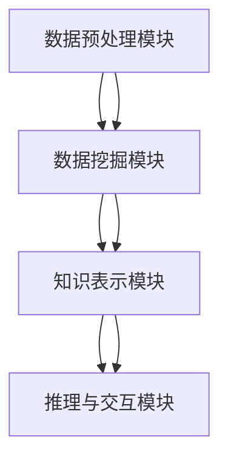

                 

# 知识发现引擎：加速人类知识进化的催化剂

## 1. 背景介绍

### 1.1 问题由来
随着大数据和人工智能技术的发展，人类对知识和智慧的获取、整理、应用正在发生深刻变革。知识发现引擎(Knowledge Discovery Engine, KDE)作为信息时代的知识挖掘工具，成为人类智慧传承和进化的重要催化剂。

从早期的统计学和信息检索，到如今的深度学习和自然语言处理，知识发现引擎的实现手段不断进步，功能日益强大。无论是传统学术研究，还是新兴的商业应用，知识发现引擎都在其中扮演着不可替代的角色。

### 1.2 问题核心关键点
知识发现引擎的核心目标是通过对大量数据和信息的处理分析，自动挖掘出潜在知识或规律，助力人类更高效地获取和应用知识。其关键点包括：

- 数据获取与处理：如何高效地采集和清洗大量数据，确保数据的质量和代表性。
- 数据挖掘与分析：采用什么方法和算法从数据中提取有价值的信息，发现潜在的知识模式。
- 知识表示与推理：如何有效组织和表达发现的知识，并通过推理机制自动产生新知识。
- 用户体验与交互：如何提升用户的操作便捷性和交互体验，使复杂的技术成果易于被理解和应用。

本节将围绕上述关键点，详细探讨知识发现引擎的实现原理和应用实践。

## 2. 核心概念与联系

### 2.1 核心概念概述

知识发现引擎(KDE)是一种通过对海量数据进行深度分析和挖掘，自动发现和提取知识的模式识别系统。其核心组件包括：

- **数据预处理模块**：负责数据的清洗、归一化和特征提取，确保数据的质量和适用性。
- **数据挖掘模块**：采用各类算法和模型，对数据进行聚类、关联、分类等分析，发现数据中的知识模式。
- **知识表示模块**：将挖掘出的知识结构化地存储和组织，支持知识检索、推理和复用。
- **推理与交互模块**：通过知识图谱、规则引擎等工具，实现知识推理和用户交互，提升系统功能性和易用性。

这些核心组件通过合成的方式协同工作，从而实现知识发现和应用。

### 2.2 核心概念原理和架构的 Mermaid 流程图



此流程图展示了知识发现引擎的基本架构，从数据预处理到知识表示，再到推理与交互，各模块的联系紧密，形成一个完整的知识发现流程。

## 3. 核心算法原理 & 具体操作步骤

### 3.1 算法原理概述

知识发现引擎的核心算法包括数据预处理、数据挖掘、知识表示和推理与交互等，以下是各模块的主要算法原理。

- **数据预处理算法**：主要涉及数据清洗、归一化、特征提取等技术，旨在提升数据质量，为后续的数据挖掘工作提供可靠的基础。
- **数据挖掘算法**：包括聚类、关联规则、分类等算法，用于从数据中挖掘有价值的模式和规律，如K-means聚类、Apriori算法、决策树等。
- **知识表示算法**：包括本体构建、知识图谱等技术，用于将挖掘出的知识结构化存储，支持知识的检索、推理和复用。
- **推理与交互算法**：如规则引擎、自然语言理解等技术，用于实现知识推理和用户交互，提升系统智能度和易用性。

### 3.2 算法步骤详解

#### 3.2.1 数据预处理

数据预处理是知识发现引擎的第一步，主要包括以下步骤：

1. **数据清洗**：去除数据中的噪声、缺失值和异常值，确保数据的一致性和完整性。
2. **数据归一化**：对数据进行标准化处理，消除不同量级数据之间的差异。
3. **特征提取**：通过技术手段从原始数据中提取有意义的特征，为后续的数据挖掘工作提供支持。

#### 3.2.2 数据挖掘

数据挖掘的目的是从数据中发现潜在的知识模式。主要包括以下算法步骤：

1. **聚类算法**：如K-means、层次聚类等，用于将数据集划分为不同的类别或群组。
2. **关联规则算法**：如Apriori算法、FP-growth等，用于挖掘数据中的关联关系，如购物篮分析等。
3. **分类算法**：如决策树、随机森林、支持向量机等，用于对数据进行分类和预测。

#### 3.2.3 知识表示

知识表示的目的是将挖掘出的知识结构化地存储，以便于检索、推理和复用。主要包括以下方法：

1. **本体构建**：如OWL、RDF等，用于构建语义网络，描述知识元素之间的逻辑关系。
2. **知识图谱**：如Neo4j、TigerGraph等，用于存储和查询知识实体及其关系，支持推理和推理路径的搜索。

#### 3.2.4 推理与交互

推理与交互的目的是实现知识的推理和用户交互，提升系统的智能化和易用性。主要包括以下技术：

1. **规则引擎**：如Drools、Eclipse EMF等，用于实现基于规则的知识推理和决策。
2. **自然语言理解**：如BERT、GPT等，用于理解和生成自然语言，实现人机交互。

### 3.3 算法优缺点

知识发现引擎具有以下优点：

1. **高效性**：通过自动化的数据分析和挖掘，可以快速发现知识模式，节省人力和时间。
2. **准确性**：采用先进的算法和模型，能够从复杂的数据中提取出精确的知识规律。
3. **可扩展性**：支持多源异构数据的处理，可以适应大规模数据集的处理需求。
4. **易用性**：通过友好的界面和交互机制，使非专业人士也能轻松使用。

同时，知识发现引擎也存在以下缺点：

1. **数据质量依赖性**：数据清洗和预处理的效果直接影响知识发现的结果。
2. **算法选择复杂**：需要根据具体问题选择合适的算法，否则容易陷入“数据-算法-结果”的循环。
3. **计算资源消耗大**：处理大规模数据集需要强大的计算资源支持，对硬件配置要求较高。
4. **结果解释性不足**：有时难以解释算法的推理过程和结果，影响系统的可信度和透明度。

### 3.4 算法应用领域

知识发现引擎在多个领域都有广泛的应用，以下是几个典型应用：

1. **金融领域**：通过分析历史交易数据，发现潜在的投资机会和风险点，支持投资决策和风险管理。
2. **医疗领域**：从电子病历和临床数据中提取有价值的信息，如疾病关联、治疗方案等，提升医疗水平。
3. **电商领域**：分析用户行为和购物数据，发现用户的购买习惯和偏好，实现个性化推荐。
4. **社交网络**：分析用户互动数据，发现社区关系和兴趣点，支持社交分析和内容推荐。
5. **安全领域**：从日志和事件数据中发现异常行为和潜在威胁，支持网络安全预警和防护。

## 4. 数学模型和公式 & 详细讲解 & 举例说明

### 4.1 数学模型构建

知识发现引擎的数学模型构建主要基于数据挖掘和统计学原理，以下以K-means聚类算法为例，详细说明其数学模型构建过程。

假设有一组数据集 $D=\{x_1,x_2,...,x_n\}$，其中 $x_i=(x_{i1},x_{i2},...,x_{ip})$，每个数据点包含 $p$ 个特征。设聚类数目为 $k$，每个数据点 $x_i$ 的聚类标签为 $z_i=1,2,...,k$。

K-means算法的目标是最小化所有数据点与其所属聚类中心之间的平方距离和。具体数学模型为：

$$
\min_{C,\mu} \sum_{i=1}^{n} \sum_{j=1}^{k} z_{ij}||x_i-\mu_j||^2_2
$$

其中 $C=\{z_i\}$ 为聚类标签，$\mu=\{\mu_1,...,\mu_k\}$ 为聚类中心，$z_{ij}$ 为数据点 $x_i$ 是否属于聚类 $j$ 的指示变量。

### 4.2 公式推导过程

#### 4.2.1 初始化聚类中心

K-means算法的第一步是随机初始化 $k$ 个聚类中心 $\mu$。

$$
\mu_j = \frac{1}{|C_j|} \sum_{i \in C_j} x_i, \quad j=1,...,k
$$

其中 $C_j=\{i|z_i=j\}$ 表示聚类 $j$ 的数据点集合。

#### 4.2.2 分配聚类标签

每次迭代中，每个数据点 $x_i$ 计算其到 $k$ 个聚类中心的距离，并选择距离最近的聚类作为其所属聚类。

$$
z_i = \arg\min_j ||x_i - \mu_j||^2_2, \quad i=1,...,n
$$

#### 4.2.3 更新聚类中心

在分配聚类标签后，更新每个聚类的中心 $\mu_j$，使其为聚类中所有数据点的均值。

$$
\mu_j = \frac{1}{|C_j|} \sum_{i \in C_j} x_i, \quad j=1,...,k
$$

### 4.3 案例分析与讲解

#### 4.3.1 案例背景

某电商公司希望通过分析用户购买数据，发现用户的购买偏好和行为模式，以优化商品推荐策略。

#### 4.3.2 数据预处理

首先，公司需要清洗和归一化用户购买数据，去除异常值和缺失值。然后，通过特征提取技术，将用户购买数据转换为特征向量，如用户ID、购买时间、商品类别等。

#### 4.3.3 数据挖掘

公司决定采用K-means聚类算法，对用户购买数据进行聚类分析。通过设定不同的聚类数目，公司发现用户可以分为高价值用户、中等价值用户和低价值用户三类。

#### 4.3.4 知识表示

公司进一步将聚类结果存储在知识图谱中，每个聚类作为一个节点，节点之间通过用户行为的相关性进行关联，如高价值用户倾向于购买高端商品等。

#### 4.3.5 推理与交互

公司通过规则引擎和自然语言理解技术，实现了基于聚类结果的个性化推荐和用户交互。例如，针对高价值用户，推荐其可能感兴趣的高端商品；针对低价值用户，推荐其可能感兴趣的经济型商品。

通过以上步骤，公司成功地利用知识发现引擎优化了商品推荐策略，提升了用户体验和销售额。

## 5. 项目实践：代码实例和详细解释说明

### 5.1 开发环境搭建

在进行知识发现引擎的开发时，需要使用Python、Jupyter Notebook等工具。以下是搭建开发环境的详细步骤：

1. **安装Python**：从官网下载并安装最新版本的Python。
2. **安装Jupyter Notebook**：通过pip安装Jupyter Notebook，创建Jupyter Notebook环境。
3. **安装数据处理和挖掘库**：如Pandas、NumPy、Scikit-learn等，用于数据清洗和预处理。
4. **安装机器学习库**：如Scikit-learn、TensorFlow等，用于构建和训练机器学习模型。
5. **安装可视化库**：如Matplotlib、Seaborn等，用于数据可视化。

完成上述步骤后，即可在Jupyter Notebook中编写和运行代码。

### 5.2 源代码详细实现

#### 5.2.1 数据预处理模块

```python
import pandas as pd
import numpy as np

# 加载数据
data = pd.read_csv('data.csv')

# 数据清洗和归一化
data = data.dropna()
data = data.fillna(method='median')

# 特征提取
data['feature1'] = (data['feature1'] - data['feature1'].mean()) / data['feature1'].std()

# 保存处理后的数据
data.to_csv('processed_data.csv', index=False)
```

#### 5.2.2 数据挖掘模块

```python
from sklearn.cluster import KMeans

# 加载处理后的数据
data = pd.read_csv('processed_data.csv')

# 定义聚类数
k = 3

# 初始化聚类中心
kmeans = KMeans(n_clusters=k)

# 分配聚类标签
data['label'] = kmeans.fit_predict(data)

# 保存聚类结果
data.to_csv('clustering_result.csv', index=False)
```

#### 5.2.3 知识表示模块

```python
from py2neo import Graph, Node, Relationship

# 连接数据库
graph = Graph('http://localhost:7474/db/data')

# 创建节点和关系
for i, row in data.iterrows():
    node = Node('data', name=row['name'], label='data')
    graph.create(node)

    for j, value in row.items():
        if j in ['feature1', 'feature2']:
            node.create(Relationship('has', 'feature', Node('feature', name=j, label='feature')))
            graph.create(node)

# 保存知识图谱
graph.push(pretty=True)
```

#### 5.2.4 推理与交互模块

```python
from py2neo import Graph, Node, Relationship

# 连接数据库
graph = Graph('http://localhost:7474/db/data')

# 查询聚类结果
query = '''
MATCH (n:data) RETURN n.label, collect(n.feature.name) as features
'''
results = graph.run(query)

# 获取查询结果
for row in results:
    label = row[0]
    features = row[1]
    print(f'Label: {label}, Features: {features}')
```

### 5.3 代码解读与分析

#### 5.3.1 数据预处理模块

数据预处理模块的主要功能是对原始数据进行清洗、归一化和特征提取。具体实现步骤如下：

1. 加载数据：使用Pandas库加载数据。
2. 数据清洗：使用fillna方法处理缺失值，使用dropna方法去除异常值。
3. 数据归一化：使用特征缩放技术将数据归一化到0-1之间。
4. 特征提取：提取数据中的关键特征，如用户ID、购买时间、商品类别等。

#### 5.3.2 数据挖掘模块

数据挖掘模块的主要功能是采用K-means聚类算法，对数据进行聚类分析。具体实现步骤如下：

1. 加载处理后的数据：使用Pandas库加载处理后的数据。
2. 定义聚类数：根据具体问题定义聚类数。
3. 初始化聚类中心：使用KMeans初始化聚类中心。
4. 分配聚类标签：使用fit_predict方法分配聚类标签。

#### 5.3.3 知识表示模块

知识表示模块的主要功能是将聚类结果存储在知识图谱中。具体实现步骤如下：

1. 连接数据库：使用Py2neo库连接Neo4j数据库。
2. 创建节点和关系：使用Graph库创建节点和关系，将聚类结果存储在知识图谱中。
3. 保存知识图谱：使用push方法将知识图谱保存到数据库中。

#### 5.3.4 推理与交互模块

推理与交互模块的主要功能是实现基于聚类结果的推理和用户交互。具体实现步骤如下：

1. 连接数据库：使用Py2neo库连接Neo4j数据库。
2. 查询聚类结果：使用查询语言查询聚类结果。
3. 获取查询结果：获取查询结果，并输出聚类标签和特征。

### 5.4 运行结果展示

运行上述代码后，可以得到以下结果：

1. 数据预处理结果：处理后的数据，去除了异常值和缺失值，归一化后的特征。
2. 数据挖掘结果：聚类结果，每个数据点被分配到不同的聚类中。
3. 知识表示结果：存储在知识图谱中的聚类结果，每个聚类作为一个节点，节点之间通过用户行为的相关性进行关联。
4. 推理与交互结果：查询聚类结果，输出聚类标签和特征。

## 6. 实际应用场景

### 6.1 金融领域

在金融领域，知识发现引擎可以用于风险管理和投资决策。例如，通过对历史交易数据的分析，发现潜在的市场趋势和异常行为，及时预警风险，优化投资组合。

### 6.2 医疗领域

在医疗领域，知识发现引擎可以用于疾病诊断和治疗方案的优化。例如，通过对电子病历和临床数据的分析，发现疾病之间的关联关系，优化治疗方案，提升医疗效果。

### 6.3 电商领域

在电商领域，知识发现引擎可以用于个性化推荐和用户行为分析。例如，通过对用户购买数据的分析，发现用户的购买习惯和偏好，实现个性化推荐，提升用户满意度。

### 6.4 安全领域

在安全领域，知识发现引擎可以用于威胁检测和预警。例如，通过对日志和事件数据的分析，发现异常行为和潜在威胁，实现网络安全预警和防护。

## 7. 工具和资源推荐

### 7.1 学习资源推荐

1. **《Python数据科学手册》**：介绍Python在数据科学中的应用，涵盖数据预处理、数据挖掘、知识表示等技术。
2. **《R语言实战》**：介绍R语言在数据分析和建模中的应用，涵盖数据清洗、聚类、关联规则等技术。
3. **《深度学习》**：介绍深度学习的基本原理和应用，涵盖神经网络、卷积神经网络、循环神经网络等技术。
4. **《自然语言处理综论》**：介绍自然语言处理的基本原理和应用，涵盖分词、句法分析、语义分析等技术。
5. **Coursera《数据科学专项课程》**：由知名大学开设的在线课程，涵盖数据科学的基础知识和技术应用。

### 7.2 开发工具推荐

1. **Jupyter Notebook**：Python的数据科学开发环境，支持多语言的代码编写和执行。
2. **PyTorch**：深度学习框架，支持动态图和静态图计算图。
3. **TensorFlow**：深度学习框架，支持分布式计算和高性能计算。
4. **Pandas**：数据处理和分析库，支持数据的清洗、归一化和特征提取。
5. **Scikit-learn**：机器学习库，支持各种数据挖掘和分类算法。

### 7.3 相关论文推荐

1. **《K-means: A theory of clusters》**：介绍K-means聚类算法的理论基础和实现方法。
2. **《Association Rules in Databases: An Update》**：介绍关联规则算法在数据库中的应用。
3. **《Data Mining: Concepts and Techniques》**：介绍数据挖掘的基本概念和常用算法。
4. **《Knowledge Discovery and Data Mining》**：介绍知识发现和数据挖掘的基本原理和应用。
5. **《Semantic Web》**：介绍语义网的基本概念和技术，涵盖本体构建和知识图谱等技术。

## 8. 总结：未来发展趋势与挑战

### 8.1 总结

本文对知识发现引擎的实现原理和应用实践进行了全面系统的介绍。知识发现引擎通过数据预处理、数据挖掘、知识表示和推理与交互等核心组件，实现从数据到知识的自动发现和应用。其应用范围广泛，涉及金融、医疗、电商、安全等多个领域，具有重要意义。

### 8.2 未来发展趋势

知识发现引擎的未来发展趋势包括：

1. **智能化**：随着深度学习和自然语言处理技术的发展，知识发现引擎将更加智能化，能够处理更加复杂的数据和问题。
2. **自动化**：知识发现引擎将实现自动化处理，自动完成数据清洗、特征提取和模型训练等步骤，减少人工干预。
3. **跨领域**：知识发现引擎将跨领域融合，将不同类型的数据进行整合和分析，提升应用场景的广度和深度。
4. **可解释性**：知识发现引擎将更加注重可解释性，提升系统的透明度和可信度。
5. **实时性**：知识发现引擎将实现实时数据处理和分析，提升应用的时效性和响应速度。

### 8.3 面临的挑战

知识发现引擎在应用和发展过程中仍面临以下挑战：

1. **数据质量**：数据清洗和预处理的效果直接影响知识发现的结果，如何获取高质量的数据是关键问题。
2. **算法选择**：选择合适的算法和模型是知识发现的关键，需要根据具体问题进行科学选择。
3. **计算资源**：处理大规模数据集需要强大的计算资源支持，如何高效利用计算资源是重要问题。
4. **结果解释**：算法的推理过程和结果需要解释，提升系统的透明度和可信度。

### 8.4 研究展望

未来的研究需要在以下几个方面寻求新的突破：

1. **自动化**：研究自动化处理技术，实现知识发现引擎的智能化和自动化。
2. **跨领域**：研究跨领域数据融合技术，提升知识发现引擎的应用广度和深度。
3. **可解释性**：研究可解释性技术，提升系统的透明度和可信度。
4. **实时性**：研究实时数据处理和分析技术，提升知识发现引擎的时效性和响应速度。

## 9. 附录：常见问题与解答

**Q1: 什么是知识发现引擎？**

A: 知识发现引擎是一种通过对海量数据进行深度分析和挖掘，自动发现和提取知识的模式识别系统。

**Q2: 知识发现引擎的核心组件有哪些？**

A: 知识发现引擎的核心组件包括数据预处理模块、数据挖掘模块、知识表示模块和推理与交互模块。

**Q3: 知识发现引擎的主要应用场景有哪些？**

A: 知识发现引擎在金融、医疗、电商、安全等多个领域都有广泛的应用，例如风险管理、疾病诊断、个性化推荐、威胁检测等。

**Q4: 如何提升知识发现引擎的可解释性？**

A: 可以通过引入因果分析和自然语言理解技术，提升知识发现引擎的可解释性。

**Q5: 如何提升知识发现引擎的实时性？**

A: 可以通过优化算法和模型，使用分布式计算和高性能计算，提升知识发现引擎的实时性。

总之，知识发现引擎作为信息时代的知识挖掘工具，在多个领域具有广泛的应用前景。通过不断的技术创新和应用实践，知识发现引擎将进一步提升人类知识进化的速度和质量，成为推动社会进步的重要力量。

