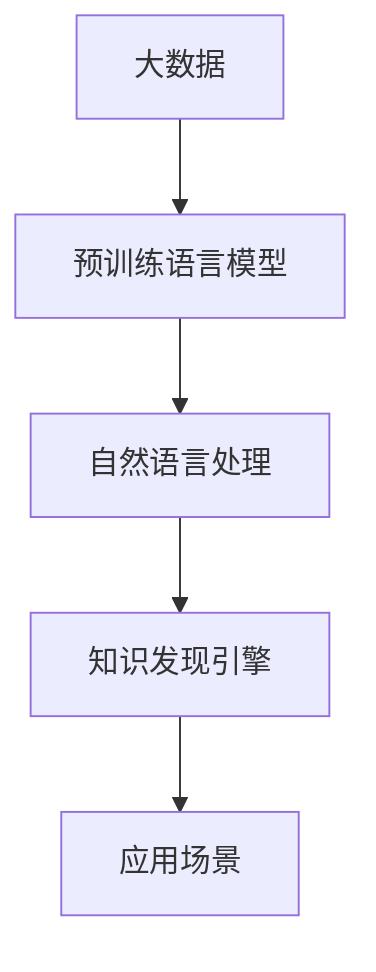

                 

# 知识发现引擎：开启人类知识新纪元

> 关键词：知识发现引擎, 人类知识, 自然语言处理(NLP), 大数据, 机器学习(ML), 人工智能(AI)

## 1. 背景介绍

在信息爆炸的今天，全球每天产生的数据量以PB计，从互联网数据、社交媒体、传感器数据到科学实验数据，海量数据源源不断地产生。而知识，作为人类对客观世界的认知与总结，是数据中蕴含的宝藏，能够为决策支持、科学研究、产品创新等提供有力的支持。如何高效地发现和利用这些知识，成为当下科技创新的重要命题。

### 1.1 问题由来

在早期，知识获取主要依赖人工阅读和总结，工作量大且效率低。后来随着搜索引擎的兴起，人们可以通过关键词检索迅速定位到相关内容，但仍然缺乏深度理解与关联。数据挖掘技术和大规模语料库的建立，使得机器可以自动从数据中提取知识，推动了知识发现的自动化进程。

然而，数据挖掘和文本挖掘的早期方法往往依赖于人工定义的特征和规则，在处理复杂语义和多源异构数据时效果有限。近年来，随着深度学习和大规模预训练语言模型（如BERT、GPT等）的崛起，知识发现技术实现了飞跃式发展。预训练语言模型能够自动学习丰富的语言表示，通过对大规模无标签文本语料进行预训练，能够有效地捕捉语言中的潜在知识模式。

基于此，本文将深入探讨知识发现引擎的概念、原理、算法及其应用实践，特别以自然语言处理(NLP)为例，展示知识发现技术在处理海量数据、挖掘深层次知识方面的强大能力。

## 2. 核心概念与联系

### 2.1 核心概念概述

为更准确理解知识发现引擎的工作原理和架构，本节将介绍几个关键概念：

- **知识发现引擎(Knowledge Discovery Engine, KDE)**：一种利用机器学习和大数据技术，从海量数据中自动提取、组织和呈现知识的系统。KDE的主要任务是从数据中识别出潜在的知识模式，辅助决策制定、问题解决和创新。
- **自然语言处理(Natural Language Processing, NLP)**：一种专注于计算机如何理解和生成人类语言的技术。通过NLP技术，计算机可以自动处理和理解文本数据，从而挖掘其中的知识。
- **大数据(Big Data)**：指在传统数据处理方式无法处理的大规模、多样化、高速产生的数据集。大数据技术能够高效地存储、处理和分析这些数据。
- **深度学习(Deep Learning)**：一种模拟人脑神经网络工作方式的机器学习方法，通过多层神经网络学习数据的复杂表示，适用于处理非结构化数据。
- **预训练语言模型(Pre-trained Language Models)**：如BERT、GPT等，通过在大规模无标签文本语料上进行预训练，学习通用的语言表示，具备强大的语言理解和生成能力。
- **迁移学习(Transfer Learning)**：指将在一个任务上学到的知识迁移到另一个相关任务上的学习范式。预训练语言模型通过迁移学习，能够很好地适应各种下游NLP任务。

这些核心概念通过以下Mermaid流程图相互联系，展示了知识发现引擎的宏观架构：



这个流程图展示了大数据、预训练语言模型、自然语言处理和知识发现引擎之间的关系：

1. 大数据提供了丰富多样的信息源，是知识发现的基础。
2. 预训练语言模型通过自动学习丰富的语言表示，为知识发现提供了强大的底层支持。
3. 自然语言处理技术在预训练语言模型的基础上，能够自动理解和生成自然语言文本，从而有效提取知识。
4. 知识发现引擎通过机器学习和数据挖掘技术，自动分析和组织知识，辅助决策和创新。

## 3. 核心算法原理 & 具体操作步骤

### 3.1 算法原理概述

知识发现引擎的核心算法原理基于机器学习和深度学习技术。其核心思想是从大数据中自动提取有价值的信息，并组织成易于理解和应用的格式。具体流程如下：

1. **数据准备**：收集和清洗大规模文本数据，确保数据的质量和多样性。
2. **预训练语言模型**：使用预训练语言模型在大规模无标签文本上自动学习语言表示，构建知识表示空间。
3. **特征提取**：通过NLP技术，从文本数据中自动提取和生成特征，如词向量、句法结构、情感极性等。
4. **知识挖掘**：利用机器学习算法，在特征空间中挖掘和构建知识模式，识别关联规则和结构化知识。
5. **知识表示**：将挖掘出的知识以易于理解和应用的形式表示出来，如知识图谱、主题模型、摘要等。
6. **知识应用**：将知识应用到实际问题中，如文本分类、信息检索、问答系统等。

### 3.2 算法步骤详解

以下将详细介绍知识发现引擎的核心算法步骤：

**Step 1: 数据预处理**
- **数据收集**：收集大规模文本数据，包括网页、文档、社交媒体等。
- **数据清洗**：去除无关信息，如HTML标签、停用词等，确保数据质量。
- **分词与标注**：对文本进行分词、词性标注、命名实体识别等NLP处理，生成文本特征。

**Step 2: 预训练语言模型训练**
- **选择模型**：选择合适的预训练语言模型，如BERT、GPT等。
- **预训练任务**：定义预训练任务，如掩码语言模型、文本分类、语言建模等。
- **训练模型**：在大量无标签文本上对预训练模型进行训练，学习语言表示。
- **模型保存**：保存训练好的预训练模型，供后续微调使用。

**Step 3: 特征提取与处理**
- **词向量表示**：使用Word2Vec、GloVe等算法，将文本转换为向量表示。
- **句法分析**：使用依存分析、命名实体识别等NLP技术，提取句子结构信息。
- **情感分析**：利用情感词典、深度学习模型等技术，识别文本情感极性。

**Step 4: 知识挖掘**
- **关联规则挖掘**：使用Apriori、FP-Growth等算法，发现数据中潜在的关联规则。
- **主题建模**：使用LDA、LSI等算法，识别文本中的主题分布。
- **知识图谱构建**：使用知识图谱生成算法，构建实体、关系、属性等结构化知识。

**Step 5: 知识表示与输出**
- **知识可视化**：将挖掘出的知识以图形化形式展示，如KDE、Gephi等工具。
- **知识库构建**：将知识组织成结构化知识库，如RDF、JSON等格式。
- **摘要生成**：使用文本生成模型，自动生成文本摘要。

**Step 6: 知识应用**
- **文本分类**：将文本数据分类到不同的主题或领域。
- **信息检索**：构建检索索引，高效查询相关文档。
- **问答系统**：构建基于知识图谱的问答系统，自动回答用户查询。

### 3.3 算法优缺点

知识发现引擎基于深度学习和大数据技术，具有以下优点：

1. **高效处理大规模数据**：能够高效处理海量数据，自动提取和挖掘其中的知识。
2. **自动学习语言表示**：利用预训练语言模型自动学习丰富的语言表示，提取深层次的语义信息。
3. **泛化能力强**：通过迁移学习，能够在多个NLP任务上取得良好的效果。
4. **可解释性强**：通过知识可视化工具，能够直观展示挖掘出的知识模式。

同时，也存在以下局限性：

1. **依赖高质量标注数据**：部分步骤如知识图谱构建，仍需大量高质量标注数据。
2. **计算资源需求高**：需要高性能计算资源，训练预训练语言模型和挖掘知识模式。
3. **模型复杂度高**：复杂模型增加了系统复杂性，可能面临过拟合问题。
4. **结果可解释性不足**：部分知识表示复杂，难以直接解释其背后逻辑。
5. **跨领域迁移能力有限**：在跨领域任务上的泛化能力有待进一步提升。

尽管存在这些局限性，但总体而言，知识发现引擎在处理大规模数据、挖掘深层次知识方面具有重要价值。

### 3.4 算法应用领域

知识发现引擎在多个领域都得到了广泛应用，主要包括：

- **信息检索**：构建高效的文本检索系统，快速找到相关文档。
- **文本分类**：将文本数据分类到不同的主题或领域，辅助内容管理和推荐系统。
- **问答系统**：构建基于知识图谱的问答系统，自动回答用户查询。
- **情感分析**：自动分析文本情感，辅助市场预测和舆情监测。
- **主题建模**：挖掘文本中的主题分布，辅助内容创作和知识管理。
- **智能客服**：构建基于NLP的智能客服系统，自动回答用户咨询。

此外，知识发现引擎还被应用于科学数据分析、医疗诊断、金融风控等领域，为各行业提供强有力的知识支撑。

## 4. 数学模型和公式 & 详细讲解 & 举例说明

### 4.1 数学模型构建

知识发现引擎的数学模型构建主要围绕以下几个核心概念展开：

- **文本表示**：通过词向量、句法结构、情感极性等技术，将文本数据转换为向量表示。
- **知识挖掘**：通过关联规则、主题建模等技术，发现文本中的潜在知识模式。
- **知识表示**：通过知识图谱、主题模型等技术，组织和呈现知识结构。

### 4.2 公式推导过程

以主题建模为例，展示其数学模型和公式推导过程：

**Latent Dirichlet Allocation (LDA)**
LDA是一种常见的文本主题建模算法，其主要目标是发现文本中的主题分布。LDA假设每个文档由若干主题构成，每个主题由若干词构成，每个词由若干主题分布组成。

- **文档主题分布**：$\alpha$ 表示文档-主题分布超参数。
- **主题-词分布**：$\beta$ 表示主题-词分布超参数。
- **词分布**：$z$ 表示每个词对应的主题分布。

对于长度为 $N$ 的文本 $d$，LDA模型的概率分布公式为：

$$
P(d|\alpha,\beta) = \prod_{n=1}^N \frac{\alpha_k}{\sum_{k=1}^K \alpha_k} \frac{z_{n,k}^{(\theta)}}{\beta_{k,j}} P(w_j|z_{n,k})
$$

其中：
- $\alpha_k$ 表示主题 $k$ 在文档中的分布概率。
- $z_{n,k}$ 表示第 $n$ 个词对应的主题 $k$ 的分布概率。
- $\beta_{k,j}$ 表示主题 $k$ 中词 $j$ 的分布概率。
- $P(w_j|z_{n,k})$ 表示给定主题 $k$，词 $j$ 的条件概率。

公式推导过程涉及多个统计学和概率论的数学推导，此处略去。

### 4.3 案例分析与讲解

以维基百科文章为例，展示LDA模型在文本主题建模中的应用：

- **数据准备**：收集维基百科英文文章，去除HTML标签和停用词，分词并标注词性。
- **模型训练**：使用LDA算法，训练出100个主题的分布。
- **结果分析**：可视化每个主题中的高频词，发现包含多个子主题的知识分布，如历史、科技、医学等。
- **应用场景**：自动分类新文章到相应主题，辅助内容管理和推荐系统。

## 5. 项目实践：代码实例和详细解释说明

### 5.1 开发环境搭建

在进行知识发现引擎项目实践前，需要先准备好开发环境。以下是使用Python进行知识发现引擎开发的流程：

1. 安装Anaconda：从官网下载并安装Anaconda，用于创建独立的Python环境。
2. 创建并激活虚拟环境：
```bash
conda create -n kde-env python=3.8 
conda activate kde-env
```

3. 安装必要的包：
```bash
pip install scikit-learn pandas numpy gensim py2neo spacy
```

4. 下载预训练模型：
```bash
python -m spacy download en_core_web_lg
```

完成上述步骤后，即可在`kde-env`环境中开始项目实践。

### 5.2 源代码详细实现

以下以LDA模型为例，展示使用Gensim库对维基百科文章进行主题建模的Python代码实现。

```python
from gensim import corpora, models
import pandas as pd
from sklearn.feature_extraction.text import TfidfVectorizer
from py2neo import Graph, Node, Relationship

# 准备维基百科数据集
wiki_df = pd.read_csv('wiki_data.csv')

# 分词和去除停用词
def preprocess(text):
    # 分词
    tokens = nlp(text)
    # 去除停用词和标点符号
    tokens = [token for token in tokens if token.is_alpha]
    return ' '.join(tokens)

# 构建文本集合
corpus = [preprocess(article) for article in wiki_df['text']]

# 构建词典
dictionary = corpora.Dictionary(corpus)

# 构建文本-词向量矩阵
doc_bow = [dictionary.doc2bow(doc.split()) for doc in corpus]

# 训练LDA模型
lda = models.LdaModel(doc_bow, num_topics=100, id2word=dictionary, passes=10)

# 获取主题-词分布
top_topics = lda.show_topics(form='word')

# 可视化主题分布
for topic in top_topics:
    print(topic)
```

### 5.3 代码解读与分析

让我们详细解读一下关键代码的实现细节：

**LDA模型实现**：
1. **数据准备**：读取维基百科数据集，并将其中的文本内容进行预处理。
2. **词典构建**：使用Gensim库的`Dictionary`对象，构建文本集合的词典。
3. **文本-词向量矩阵构建**：将文本集合转换为稀疏矩阵，每个行向量表示一个文档，每个列向量表示一个词。
4. **LDA模型训练**：使用Gensim库的`LdaModel`对象，训练LDA模型，指定主题数和迭代次数。
5. **主题-词分布获取**：获取LDA模型中每个主题对应的词分布，并进行可视化展示。

**可视化展示**：
1. **主题-词分布**：打印出每个主题对应的高频词。
2. **主题分布**：可视化每个主题中高频词的分布情况。

通过上述代码，可以自动进行维基百科文章的主题建模，发现其中的潜在主题分布，从而为内容管理和推荐系统提供数据支撑。

## 6. 实际应用场景

### 6.1 智能客服系统

智能客服系统是知识发现引擎的重要应用场景之一。传统的客服系统需要大量人工处理客户咨询，响应速度慢，且难以提供一致性的服务。利用知识发现引擎，可以构建基于NLP的智能客服系统，自动理解客户咨询并给出最佳答复。

具体实现步骤如下：
1. **数据收集**：收集企业内部历史客服对话记录。
2. **数据处理**：对对话文本进行分词、标注等NLP处理。
3. **模型训练**：使用知识发现引擎训练预训练语言模型，并进行微调。
4. **智能问答**：将对话文本输入模型，自动回答客户咨询，并提供相关推荐。

### 6.2 金融舆情监测

金融舆情监测是知识发现引擎的另一个重要应用场景。传统的金融舆情监测主要依赖人工阅读和手动标注，效率低且容易产生偏差。利用知识发现引擎，可以自动从新闻、评论等文本中提取情感和主题信息，实时监测金融舆情。

具体实现步骤如下：
1. **数据收集**：收集金融领域相关的新闻、评论等文本数据。
2. **数据处理**：对文本进行分词、情感分析等NLP处理。
3. **模型训练**：使用知识发现引擎训练预训练语言模型，并进行微调。
4. **情感分析**：自动分析文本情感，监测市场舆情变化。
5. **风险预警**：根据情感分析结果，生成风险预警信号，辅助金融机构决策。

### 6.3 个性化推荐系统

个性化推荐系统是知识发现引擎的重要应用方向之一。传统的推荐系统依赖用户历史行为数据，难以理解用户的真实兴趣偏好。利用知识发现引擎，可以自动从文本数据中挖掘用户的兴趣点，生成个性化推荐列表。

具体实现步骤如下：
1. **数据收集**：收集用户浏览、点击、评论、分享等行为数据。
2. **数据处理**：对文本数据进行分词、情感分析等NLP处理。
3. **模型训练**：使用知识发现引擎训练预训练语言模型，并进行微调。
4. **兴趣提取**：自动分析文本内容，提取用户的兴趣点。
5. **推荐生成**：根据用户的兴趣点，生成个性化推荐列表，辅助用户决策。

## 7. 工具和资源推荐

### 7.1 学习资源推荐

为了帮助开发者系统掌握知识发现引擎的理论基础和实践技巧，这里推荐一些优质的学习资源：

1. **《信息检索：原理与实践》**：由杰出的信息检索专家R.Buckley撰写，深入浅出地介绍了信息检索的原理和技术。
2. **《文本挖掘：概念与应用》**：由文本挖掘领域的权威教材《Data Mining: Concepts and Techniques》翻译而来，全面介绍了文本挖掘的理论与实践。
3. **《大数据技术与实践》**：由大数据领域的专家撰写，介绍了大数据处理和分析的最新技术。
4. **《深度学习基础》**：由深度学习领域的专家撰写，介绍了深度学习的原理和应用。
5. **《自然语言处理综述》**：由NLP领域的专家撰写，全面介绍了自然语言处理的技术进展和应用场景。

通过对这些资源的学习实践，相信你一定能够快速掌握知识发现引擎的核心思想和实现技术，并用于解决实际的NLP问题。

### 7.2 开发工具推荐

高效的开发离不开优秀的工具支持。以下是几款用于知识发现引擎开发的常用工具：

1. **Jupyter Notebook**：交互式开发环境，方便编写和测试代码。
2. **Python**：流行且功能强大的编程语言，适用于快速迭代研究。
3. **Gensim**：用于文本处理和主题建模的Python库，支持LDA、Word2Vec等算法。
4. **Spacy**：强大的NLP库，支持分词、词性标注、命名实体识别等功能。
5. **Scikit-learn**：机器学习库，提供丰富的数据处理和建模工具。
6. **Py2neo**：图形数据库，支持大规模知识图谱的构建和查询。

合理利用这些工具，可以显著提升知识发现引擎的开发效率，加快创新迭代的步伐。

### 7.3 相关论文推荐

知识发现引擎的研究始于学界的持续研究。以下是几篇奠基性的相关论文，推荐阅读：

1. **《Latent Dirichlet Allocation》**：LDA算法的发明者，提供了主题建模的经典解决方案。
2. **《Deep Learning for Text Mining》**：介绍了深度学习在文本挖掘中的应用。
3. **《Knowledge Graph Embeddings and their Applications》**：介绍了知识图谱嵌入技术，提供了结构化知识表示的解决方案。
4. **《Multi-View Multi-Task Learning for Text Classification》**：介绍了多视图多任务学习技术，提高了文本分类的效果。
5. **《Transfer Learning for Healthcare》**：介绍了知识发现引擎在医疗领域的应用，提供了大量实验和案例。

这些论文代表了大数据和知识发现技术的发展脉络。通过学习这些前沿成果，可以帮助研究者把握学科前进方向，激发更多的创新灵感。

## 8. 总结：未来发展趋势与挑战

### 8.1 总结

本文对知识发现引擎的概念、原理、算法及其应用实践进行了全面系统的介绍。首先阐述了知识发现引擎的研究背景和意义，明确了其在处理大规模数据、挖掘深层次知识方面的独特价值。其次，从原理到实践，详细讲解了知识发现引擎的数学模型和核心算法步骤，给出了知识发现引擎任务开发的完整代码实例。同时，本文还广泛探讨了知识发现引擎在智能客服、金融舆情、个性化推荐等多个行业领域的应用前景，展示了知识发现技术在处理海量数据、挖掘深层次知识方面的强大能力。此外，本文精选了知识发现引擎的学习资源，力求为读者提供全方位的技术指引。

通过本文的系统梳理，可以看到，知识发现引擎技术在处理大规模数据、挖掘深层次知识方面具有重要价值。未来，伴随深度学习和大数据技术的不断发展，知识发现引擎必将在更多的领域得到广泛应用，为人类知识的挖掘、管理和应用提供更强大的支撑。

### 8.2 未来发展趋势

展望未来，知识发现引擎的发展将呈现以下几个趋势：

1. **自动化程度提升**：随着技术的发展，知识发现引擎将越来越自动化，能够自动处理更多复杂任务。
2. **多模态知识融合**：未来的知识发现引擎将越来越多地融合视觉、语音、文本等多模态数据，实现跨模态的知识发现。
3. **高效计算技术应用**：随着计算技术的进步，知识发现引擎的计算效率将得到显著提升，能够处理更大规模的数据。
4. **深度学习与神经网络结合**：深度学习技术的发展，将为知识发现引擎提供更强大的特征提取和知识挖掘能力。
5. **模型可解释性增强**：未来的知识发现引擎将更加注重模型的可解释性，提升系统透明性和可靠性。
6. **跨领域知识迁移**：知识发现引擎将在更多领域实现跨领域知识迁移，提升系统的通用性和适应性。

这些趋势凸显了知识发现引擎技术的广阔前景。这些方向的探索发展，必将进一步提升知识发现引擎的性能和应用范围，为人类知识的挖掘、管理和应用提供更强大的支撑。

### 8.3 面临的挑战

尽管知识发现引擎技术已经取得了显著成果，但在迈向更加智能化、普适化应用的过程中，仍面临诸多挑战：

1. **数据质量与标注问题**：数据质量和标注数据的可靠性仍是知识发现的重要瓶颈。部分任务需要高质量的标注数据，获取难度大且成本高。
2. **计算资源需求高**：知识发现引擎需要高性能计算资源，训练预训练语言模型和挖掘知识模式，对硬件要求高。
3. **模型复杂度问题**：复杂的模型增加了系统复杂性，可能面临过拟合问题，需要进一步优化。
4. **知识迁移问题**：知识发现引擎在不同领域的应用效果仍需进一步提升，需要更多跨领域迁移能力的探索。
5. **结果可解释性问题**：部分知识表示复杂，难以直接解释其背后逻辑，需要增强可解释性。
6. **隐私与安全问题**：知识发现引擎涉及大量敏感数据，需要确保数据隐私和系统安全。

这些挑战需要未来进一步研究和突破，才能使知识发现引擎技术在更多领域得到广泛应用。

### 8.4 研究展望

面对知识发现引擎面临的挑战，未来的研究需要在以下几个方面寻求新的突破：

1. **无监督与半监督学习**：探索无监督和半监督学习技术，降低对标注数据的依赖，提高知识发现的自动化程度。
2. **多模态融合**：开发多模态数据融合技术，实现视觉、语音、文本等多模态数据的协同知识发现。
3. **高效计算技术**：引入分布式计算、并行计算等技术，提高知识发现引擎的计算效率。
4. **深度学习与神经网络**：引入深度学习技术，增强知识发现引擎的特征提取和知识挖掘能力。
5. **可解释性与透明性**：引入可解释性模型和透明性技术，提升知识发现引擎的系统可靠性和可信度。
6. **跨领域知识迁移**：探索跨领域知识迁移技术，提升知识发现引擎在不同领域的应用效果。
7. **隐私与安全保护**：引入隐私保护和安全性技术，确保知识发现引擎系统数据的安全性。

这些研究方向的探索，必将引领知识发现引擎技术迈向更高的台阶，为人类知识的挖掘、管理和应用提供更强大的支撑。面向未来，知识发现引擎需要与其他人工智能技术进行更深入的融合，共同推动知识发现技术的进步。只有勇于创新、敢于突破，才能不断拓展知识发现引擎的边界，让智能技术更好地造福人类社会。

## 9. 附录：常见问题与解答

**Q1: 知识发现引擎与信息检索的区别是什么？**

A: 知识发现引擎与信息检索都涉及到从数据中提取有用信息，但二者的区别在于：
- 信息检索主要关注如何快速定位相关文档，通常采用倒排索引等技术。
- 知识发现引擎则关注从数据中发现潜在的知识模式，通常使用关联规则、主题建模等算法。

**Q2: 知识发现引擎有哪些常见的应用场景？**

A: 知识发现引擎在多个领域都得到了广泛应用，主要包括：
- 金融舆情监测：自动从新闻、评论等文本中提取情感和主题信息，实时监测金融舆情。
- 个性化推荐系统：自动分析用户兴趣，生成个性化推荐列表，辅助用户决策。
- 智能客服系统：自动理解客户咨询，提供最佳答复。
- 文本分类：自动分类文本数据到不同的主题或领域。
- 情感分析：自动分析文本情感，监测市场舆情变化。

**Q3: 知识发现引擎的计算资源需求高，如何解决这一问题？**

A: 知识发现引擎对计算资源的需求较高，以下是一些可能的解决方案：
- **分布式计算**：使用Hadoop、Spark等分布式计算平台，将计算任务分布到多台机器上，提高计算效率。
- **并行计算**：使用GPU、TPU等加速计算，提高计算速度。
- **模型压缩**：使用模型压缩、稀疏化存储等技术，减小模型尺寸，降低计算资源消耗。
- **预训练模型**：使用预训练模型，减少计算资源消耗，提高计算效率。

通过上述方法，可以在不增加计算资源投入的情况下，提高知识发现引擎的计算效率，提升系统性能。

---

作者：禅与计算机程序设计艺术 / Zen and the Art of Computer Programming

