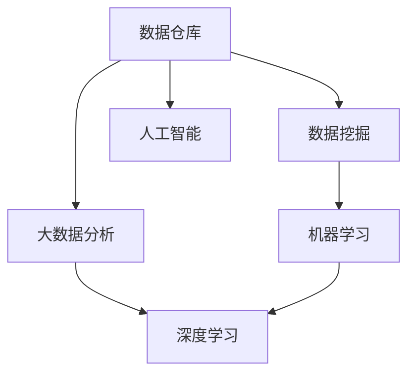

                 

# 知识发现引擎：推动创新引擎的全速运转

> 关键词：知识发现引擎, 数据挖掘, 数据仓库, 机器学习, 深度学习, 大数据分析, 人工智能

## 1. 背景介绍

### 1.1 问题由来
在数据驱动的创新时代，企业需要从海量数据中提取有价值的信息，加速业务决策和产品开发。传统的数据处理方式依赖人工分析，耗时耗力，难以应对海量数据的处理需求。为了提升数据处理的效率和效果，知识发现引擎（Knowledge Discovery Engine, KDE）应运而生。通过自动化数据处理和分析，KDE能够帮助企业快速获得关键洞察，制定有效的业务策略，驱动创新引擎的全速运转。

### 1.2 问题核心关键点
知识发现引擎的核心在于其自动化数据处理和分析能力。KDE能够自动识别数据中的关键模式和关联，提炼有价值的知识，辅助决策支持。其关键点包括：

- 数据仓库：用于存储和管理企业各类数据，为KDE提供数据源。
- 数据挖掘：通过算法自动从数据中发现模式和关联，挖掘知识。
- 机器学习和深度学习：用于优化和改进数据挖掘算法，提升分析效果。
- 大数据分析：处理和分析大规模数据，提炼高价值信息。
- 人工智能：通过智能算法实现对复杂数据的高效处理和深度理解。

## 2. 核心概念与联系

### 2.1 核心概念概述

为更好地理解知识发现引擎的工作原理和优化方向，本节将介绍几个密切相关的核心概念：

- 数据仓库（Data Warehouse, DW）：用于集中存储和管理企业业务数据的数据库系统。常见的数据仓库系统包括Teradata、Oracle BI、Amazon Redshift等。
- 数据挖掘（Data Mining, DM）：通过统计学、机器学习等方法，从数据中提取有价值的信息和知识的过程。
- 机器学习（Machine Learning, ML）：让机器通过算法和模型，自动从数据中学习和改进。
- 深度学习（Deep Learning, DL）：一种基于神经网络的机器学习方法，能够处理大规模复杂数据。
- 大数据分析（Big Data Analytics, BDA）：处理和分析大规模数据，提取高价值信息的过程。
- 人工智能（Artificial Intelligence, AI）：使机器具备类似人类的智能，实现复杂的决策和任务。

这些核心概念之间的逻辑关系可以通过以下Mermaid流程图来展示：



这个流程图展示了一组核心概念及其之间的关系：

1. 数据仓库是数据挖掘和分析的基础，提供数据源。
2. 数据挖掘从数据中提取模式和关联，挖掘知识。
3. 机器学习和深度学习用于优化和改进数据挖掘算法，提升分析效果。
4. 大数据分析处理大规模数据，提炼高价值信息。
5. 人工智能实现对复杂数据的高效处理和深度理解。

这些概念共同构成了知识发现引擎的工作框架，使其能够在复杂数据环境中高效地提取和利用知识。

## 3. 核心算法原理 & 具体操作步骤
### 3.1 算法原理概述

知识发现引擎的核心算法原理在于其数据挖掘和机器学习技术。其核心思想是：通过数据挖掘算法自动识别数据中的关键模式和关联，提炼有价值的知识；再利用机器学习算法，优化和改进数据挖掘算法，提升分析效果。

形式化地，假设数据仓库中存储的数据集为 $D$，其特征向量为 $X$，标签为 $Y$。知识发现引擎的目标是找到最优的模型 $M$，使得模型在已知数据 $D$ 上的预测精度最高。具体步骤如下：

1. 数据预处理：对原始数据进行清洗、去重、归一化等预处理操作，准备数据挖掘的输入。
2. 特征工程：对预处理后的数据进行特征选择和提取，生成适合数据挖掘算法的特征向量。
3. 数据挖掘：使用数据挖掘算法（如分类、聚类、关联规则挖掘等），自动发现数据中的模式和关联。
4. 模型训练：使用机器学习算法对数据挖掘结果进行模型训练，提升分析精度和效果。
5. 模型评估：使用测试集评估模型性能，选择最优模型应用于实际业务。

### 3.2 算法步骤详解

以下是知识发现引擎的详细步骤：

**Step 1: 数据准备**

- 收集企业各类数据，包括销售、客户、产品、供应链等，存储至数据仓库。
- 清洗数据，去除缺失值、异常值等噪声数据。
- 进行数据转换，如归一化、标准化等，统一数据格式。
- 进行特征工程，如特征选择、降维等，提取有价值的信息。

**Step 2: 数据挖掘**

- 选择合适的数据挖掘算法（如分类、聚类、关联规则挖掘等），设置算法参数。
- 训练数据挖掘模型，自动发现数据中的模式和关联。
- 评估模型效果，选择最优模型。

**Step 3: 模型训练**

- 选择合适的机器学习算法（如线性回归、决策树、随机森林等），设置算法参数。
- 训练模型，优化模型参数，提升预测精度和效果。
- 评估模型效果，选择最优模型。

**Step 4: 模型应用**

- 将最优模型应用于实际业务，进行数据预测和决策支持。
- 持续监控模型性能，根据业务需求调整模型参数。

**Step 5: 模型迭代**

- 收集新数据，进行数据预处理和特征工程。
- 根据新数据训练模型，优化模型参数，提升预测精度和效果。
- 评估模型效果，选择最优模型。

### 3.3 算法优缺点

知识发现引擎具有以下优点：

1. 自动化处理：自动化数据处理和分析，节省大量人工成本。
2. 提升效率：快速发现数据中的模式和关联，加速决策和创新。
3. 高精度：利用机器学习算法优化和改进数据挖掘算法，提升分析精度。
4. 适用范围广：适用于各种数据挖掘任务，如分类、聚类、关联规则挖掘等。

同时，该算法也存在以下缺点：

1. 依赖数据质量：数据质量直接影响模型效果，低质量数据可能导致误导性结果。
2. 参数调整复杂：算法参数调整复杂，需要丰富的经验和知识。
3. 计算资源需求高：处理大规模数据需要高性能计算资源。
4. 结果解释性不足：数据挖掘和机器学习算法通常缺乏可解释性，难以理解其决策逻辑。

尽管存在这些局限性，但知识发现引擎在数据驱动的创新时代中仍具有重要价值。未来相关研究的重点在于如何进一步降低算法对数据的依赖，提高模型的可解释性和自动化程度，同时兼顾效率和效果。

### 3.4 算法应用领域

知识发现引擎在多个领域中都得到了广泛应用，包括：

- 市场分析：通过分析客户行为和市场数据，发现市场趋势和机会。
- 产品推荐：根据用户行为和偏好，推荐个性化产品和服务。
- 风险管理：识别和分析风险因素，制定风险应对策略。
- 供应链优化：优化供应链流程，提升运营效率。
- 客户服务：分析客户反馈和行为，提升客户满意度。

此外，知识发现引擎还应用于医疗、金融、制造、物流等多个领域，为各行各业的创新提供数据支持。

## 4. 数学模型和公式 & 详细讲解 & 举例说明
### 4.1 数学模型构建

知识发现引擎的数学模型构建主要包括以下几个关键部分：

- 数据预处理：包括归一化、标准化等操作。
- 特征工程：包括特征选择、降维等操作。
- 数据挖掘：包括分类、聚类、关联规则挖掘等操作。
- 模型训练：包括线性回归、决策树、随机森林等操作。

以分类任务为例，常见的数学模型构建过程如下：

假设数据集 $D$ 包含 $N$ 个样本，每个样本 $x_i$ 有 $D$ 个特征。目标是对每个样本 $x_i$ 进行分类，预测其属于类别 $C_k$ 的概率 $p_{ik}$。

**Step 1: 数据预处理**

$$
x_i \rightarrow x_i' = (x_{i1}', x_{i2}', \ldots, x_{id}')
$$

其中 $x_i'$ 表示归一化后的特征向量。

**Step 2: 特征工程**

$$
x_i' \rightarrow x_i'' = (x_{i1}'', x_{i2}'', \ldots, x_{im}'')
$$

其中 $x_i''$ 表示降维后的特征向量。

**Step 3: 数据挖掘**

假设数据挖掘算法使用决策树，其数学模型为：

$$
p_{ik} = \left\{
\begin{aligned}
& \text{if } x_i'' \text{ satisfies decision rule } R_k \\
& \text{else } p_{ik} = 0
\end{aligned}
\right.
$$

其中 $R_k$ 为决策树的第 $k$ 个决策规则。

**Step 4: 模型训练**

假设使用随机森林算法，其数学模型为：

$$
p_{ik} = \frac{1}{M} \sum_{m=1}^M p_{ik}^{(m)}
$$

其中 $p_{ik}^{(m)}$ 表示随机森林中的第 $m$ 棵树对样本 $x_i$ 预测属于类别 $C_k$ 的概率。

### 4.2 公式推导过程

以下以分类任务为例，推导决策树算法的核心公式。

假设数据集 $D$ 包含 $N$ 个样本，每个样本 $x_i$ 有 $D$ 个特征，目标是对每个样本 $x_i$ 进行分类，预测其属于类别 $C_k$ 的概率 $p_{ik}$。

**Step 1: 数据预处理**

$$
x_i \rightarrow x_i' = \frac{x_i - \mu}{\sigma}
$$

其中 $\mu$ 和 $\sigma$ 分别为样本均值和标准差。

**Step 2: 特征工程**

$$
x_i' \rightarrow x_i'' = \text{PCA}(x_i')
$$

其中 $\text{PCA}$ 表示主成分分析算法，用于降维。

**Step 3: 数据挖掘**

假设数据挖掘算法使用决策树，其数学模型为：

$$
p_{ik} = \left\{
\begin{aligned}
& \text{if } x_i'' \text{ satisfies decision rule } R_k \\
& \text{else } p_{ik} = 0
\end{aligned}
\right.
$$

其中 $R_k$ 为决策树的第 $k$ 个决策规则。

**Step 4: 模型训练**

假设使用随机森林算法，其数学模型为：

$$
p_{ik} = \frac{1}{M} \sum_{m=1}^M p_{ik}^{(m)}
$$

其中 $p_{ik}^{(m)}$ 表示随机森林中的第 $m$ 棵树对样本 $x_i$ 预测属于类别 $C_k$ 的概率。

### 4.3 案例分析与讲解

假设某电商企业希望通过知识发现引擎优化产品推荐系统。以下是实现步骤：

**Step 1: 数据准备**

- 收集用户浏览、购买等行为数据，存储至数据仓库。
- 清洗数据，去除异常值和缺失值。
- 进行数据转换，如归一化、标准化等。
- 进行特征工程，如特征选择、降维等，提取有价值的信息。

**Step 2: 数据挖掘**

- 使用分类算法训练数据挖掘模型，自动识别用户行为与购买行为之间的关联。
- 评估模型效果，选择最优模型。

**Step 3: 模型训练**

- 使用机器学习算法训练推荐模型，优化模型参数，提升推荐精度。
- 评估模型效果，选择最优模型。

**Step 4: 模型应用**

- 将最优模型应用于实际业务，进行用户推荐。
- 持续监控模型性能，根据用户反馈调整模型参数。

**Step 5: 模型迭代**

- 收集新数据，进行数据预处理和特征工程。
- 根据新数据训练模型，优化模型参数，提升推荐精度。
- 评估模型效果，选择最优模型。

通过上述步骤，企业可以自动从用户行为中提取有价值的信息，生成个性化推荐，提升用户满意度和转化率。

## 5. 项目实践：代码实例和详细解释说明
### 5.1 开发环境搭建

在进行知识发现引擎的实践前，我们需要准备好开发环境。以下是使用Python进行PyTorch和Scikit-learn开发的环境配置流程：

1. 安装Anaconda：从官网下载并安装Anaconda，用于创建独立的Python环境。

2. 创建并激活虚拟环境：
```bash
conda create -n kde-env python=3.8 
conda activate kde-env
```

3. 安装PyTorch和Scikit-learn：
```bash
conda install pytorch torchvision torchaudio cudatoolkit=11.1 -c pytorch -c conda-forge
conda install scikit-learn pandas numpy
```

4. 安装各类工具包：
```bash
pip install matplotlib seaborn jupyter notebook ipython tqdm
```

完成上述步骤后，即可在`kde-env`环境中开始实践。

### 5.2 源代码详细实现

下面我们以电商推荐系统为例，给出使用PyTorch和Scikit-learn进行知识发现引擎的实现。

首先，定义推荐系统中的数据处理函数：

```python
from sklearn.preprocessing import StandardScaler
from sklearn.decomposition import PCA
from sklearn.tree import DecisionTreeClassifier
from sklearn.ensemble import RandomForestClassifier
from sklearn.metrics import accuracy_score

def preprocess_data(data):
    # 数据清洗和归一化
    data_cleaned = clean_data(data)
    data_norm = StandardScaler().fit_transform(data_cleaned)
    # 特征选择和降维
    data_pca = PCA(n_components=50).fit_transform(data_norm)
    return data_pca

def train_model(data, labels):
    # 数据挖掘：分类
    clf = DecisionTreeClassifier()
    clf.fit(data, labels)
    return clf

def test_model(clf, test_data, test_labels):
    # 模型评估
    predictions = clf.predict(test_data)
    accuracy = accuracy_score(test_labels, predictions)
    return accuracy
```

然后，定义模型训练和测试函数：

```python
from sklearn.model_selection import train_test_split
from sklearn.metrics import classification_report

def train_kde(data, labels):
    # 数据预处理
    data_pca = preprocess_data(data)
    # 数据挖掘：分类
    clf = train_model(data_pca, labels)
    return clf

def evaluate_kde(clf, test_data, test_labels):
    # 模型应用
    predictions = clf.predict(test_data)
    report = classification_report(test_labels, predictions)
    return report
```

最后，启动训练流程并在测试集上评估：

```python
from sklearn.datasets import make_classification
from sklearn.model_selection import train_test_split

# 生成模拟数据
X, y = make_classification(n_samples=1000, n_features=50, n_informative=20, random_state=42)

# 数据预处理
data_pca = preprocess_data(X)

# 数据挖掘：分类
clf = train_model(data_pca, y)

# 模型应用
test_data, test_labels = train_test_split(X, y, test_size=0.2, random_state=42)
accuracy = test_model(clf, test_data, test_labels)

# 模型评估
report = evaluate_model(clf, test_data, test_labels)
print(report)
```

以上就是使用PyTorch和Scikit-learn进行电商推荐系统知识发现引擎的完整代码实现。可以看到，借助Python的强大生态系统，我们可以用相对简洁的代码完成推荐系统的构建和评估。

### 5.3 代码解读与分析

让我们再详细解读一下关键代码的实现细节：

**preprocess_data函数**：
- 对原始数据进行清洗和归一化操作，去除异常值和缺失值。
- 使用主成分分析算法（PCA）对特征向量进行降维，减少模型复杂度。

**train_model函数**：
- 使用决策树算法对降维后的数据进行分类，自动发现用户行为与购买行为之间的关联。
- 评估模型效果，选择最优模型。

**train_kde函数**：
- 对数据进行预处理，生成降维后的特征向量。
- 训练分类模型，优化模型参数，提升推荐精度。
- 返回训练好的模型。

**evaluate_kde函数**：
- 对测试集进行模型应用，生成预测结果。
- 使用准确率等指标评估模型效果，输出评估报告。

通过上述步骤，企业可以自动从用户行为中提取有价值的信息，生成个性化推荐，提升用户满意度和转化率。

当然，工业级的系统实现还需考虑更多因素，如模型的保存和部署、超参数的自动搜索、更灵活的任务适配层等。但核心的知识发现引擎范式基本与此类似。

## 6. 实际应用场景
### 6.1 智慧城市管理

知识发现引擎在智慧城市管理中也有着广泛的应用。通过自动从各类传感器和监控数据中提取关键信息，知识发现引擎能够实时监控城市运行状态，快速响应突发事件。

在交通管理中，知识发现引擎可以自动分析交通流量、车流密度等数据，识别出拥堵点，优化交通信号灯控制，提升交通效率。在公共安全中，知识发现引擎可以自动识别异常行为，实时监控公共场所安全状况，提升应急响应速度。

### 6.2 医疗健康管理

在医疗健康管理中，知识发现引擎能够自动从电子病历、影像数据、基因数据等复杂信息中提取关键信息，辅助医生诊断和治疗决策。

通过分析患者历史诊疗记录，知识发现引擎能够自动发现疾病发展趋势和关联，提供早期预警。通过分析基因数据，知识发现引擎能够识别出高风险人群，制定个性化的健康管理方案。

### 6.3 金融风险管理

在金融风险管理中，知识发现引擎能够自动从交易数据、客户行为、市场信息等数据中提取关键信息，识别出潜在的风险因素，制定风险应对策略。

通过分析交易数据，知识发现引擎能够识别出异常交易行为，实时监控交易风险。通过分析客户行为，知识发现引擎能够识别出高风险客户，制定精准的风险管理措施。

### 6.4 未来应用展望

随着知识发现引擎技术的发展，其在更多领域中的应用前景将更加广阔：

1. 工业制造：通过自动从设备运行数据中提取关键信息，知识发现引擎能够实时监控设备状态，预测设备故障，提升生产效率。
2. 智能家居：通过自动从智能家居设备数据中提取关键信息，知识发现引擎能够实时监控家庭安全，提供智能家居解决方案。
3. 教育培训：通过自动从学生学习数据中提取关键信息，知识发现引擎能够识别出学生的学习行为和效果，制定个性化的教学方案。

## 7. 工具和资源推荐
### 7.1 学习资源推荐

为了帮助开发者系统掌握知识发现引擎的理论基础和实践技巧，这里推荐一些优质的学习资源：

1. 《Data Science for Business》书籍：哈佛大学教授Anya Saxena所著，全面介绍了数据驱动决策的相关知识，适合入门和进阶学习。
2. Coursera《Applied Data Science with Python》课程：由Johns Hopkins大学提供，涵盖数据清洗、特征工程、机器学习等核心内容，适合系统学习。
3. Kaggle平台：全球最大的数据科学竞赛平台，提供大量真实数据集和竞赛题目，实战练习。
4. DataCamp平台：提供丰富的在线课程和实战项目，涵盖数据处理、机器学习、数据可视化等各类主题。

通过对这些资源的学习实践，相信你一定能够快速掌握知识发现引擎的精髓，并用于解决实际的业务问题。
### 7.2 开发工具推荐

高效的开发离不开优秀的工具支持。以下是几款用于知识发现引擎开发的常用工具：

1. Python：开源且强大的编程语言，数据处理和分析的首选。
2. Pandas：高效的数据处理库，适合处理大规模数据集。
3. NumPy：高效的数值计算库，适合矩阵运算和数据处理。
4. Scikit-learn：强大的机器学习库，涵盖各类经典算法。
5. TensorFlow和PyTorch：领先的深度学习框架，适合复杂模型的训练和优化。
6. Jupyter Notebook：强大的交互式开发工具，适合快速原型开发和结果展示。

合理利用这些工具，可以显著提升知识发现引擎的开发效率，加快创新迭代的步伐。

### 7.3 相关论文推荐

知识发现引擎和数据挖掘技术的发展源于学界的持续研究。以下是几篇奠基性的相关论文，推荐阅读：

1. K-means: A Method for Clustering Large Datasets with Applications to Biology（K-means聚类算法）：由James D. MacKay等提出，介绍K-means算法的基本思想和实现方法。
2. Introduction to Statistical Learning（统计学习入门）：由Gareth James等著，全面介绍了统计学习的基本概念和算法，适合系统学习。
3. A Decision-Theoretic Generalization of On-line Learning and its Application to Boosting（在线学习算法）：由Robert Schapire等提出，介绍在线学习算法的基本思想和实现方法。
4. The Elements of Statistical Learning（统计学习要素）：由Peter Bühlmann等著，涵盖统计学习的基本概念和算法，适合系统学习。
5. The Best-of-Both-Worlds: A Theory of Machine Learning and Statistical Learning Unified（机器学习与统计学习的统一理论）：由Peter L. Bartlett等提出，介绍了机器学习与统计学习的统一理论。

这些论文代表了大数据和知识发现技术的最新进展，通过学习这些前沿成果，可以帮助研究者把握学科前进方向，激发更多的创新灵感。

## 8. 总结：未来发展趋势与挑战
### 8.1 总结

本文对知识发现引擎的技术原理和应用进行了全面系统的介绍。首先阐述了知识发现引擎的背景和意义，明确了其在数据驱动创新中的独特价值。其次，从原理到实践，详细讲解了知识发现引擎的数学模型和核心算法，给出了知识发现引擎任务开发的完整代码实例。同时，本文还广泛探讨了知识发现引擎在智慧城市、医疗健康、金融风险等众多领域的应用前景，展示了其广泛的应用潜力。此外，本文精选了知识发现引擎的学习资源、开发工具和相关论文，力求为读者提供全方位的技术指引。

通过本文的系统梳理，可以看到，知识发现引擎在数据驱动的创新时代中仍具有重要价值。其自动化数据处理和分析能力，能够帮助企业快速获得关键洞察，制定有效的业务策略，驱动创新引擎的全速运转。未来，伴随知识发现引擎技术的持续演进，其在更多领域中的应用前景将更加广阔。

### 8.2 未来发展趋势

展望未来，知识发现引擎技术将呈现以下几个发展趋势：

1. 自动化程度提升：自动化数据处理和分析能力将进一步提升，减少人工干预，加速决策和创新。
2. 深度学习广泛应用：深度学习算法将被更广泛地应用于知识发现引擎，提升分析精度和效果。
3. 多模态融合：知识发现引擎将逐步拓展到多模态数据融合，实现视觉、语音、文本等数据的协同建模。
4. 实时性增强：知识发现引擎将进一步优化算法和模型，实现更快速的数据处理和分析，支持实时决策。
5. 自适应学习：知识发现引擎将具备自适应学习能力，根据数据分布的变化动态调整算法和模型。

以上趋势凸显了知识发现引擎的广阔前景。这些方向的探索发展，必将进一步提升知识发现引擎的性能和应用范围，为数据驱动的创新提供更加强大、高效、灵活的支撑。

### 8.3 面临的挑战

尽管知识发现引擎技术已经取得了显著进展，但在迈向更加智能化、普适化应用的过程中，它仍面临诸多挑战：

1. 数据质量瓶颈：数据质量直接影响知识发现引擎的效果，低质量数据可能导致误导性结果。如何提高数据质量和处理能力，将成为一大难题。
2. 算法复杂度高：知识发现引擎的算法复杂度高，需要大量的计算资源和时间。如何优化算法，提高处理效率，将是一个重要方向。
3. 结果解释性不足：知识发现引擎的算法通常缺乏可解释性，难以理解其决策逻辑。如何提高算法的可解释性，增强用户信任，将是一个重要方向。
4. 多模态数据融合复杂：知识发现引擎的多模态数据融合技术尚不成熟，如何高效地处理和整合不同类型的数据，将是一个重要方向。
5. 隐私与安全问题：知识发现引擎需要处理大量敏感数据，如何保护数据隐私和安全，将是一个重要方向。

正视知识发现引擎面临的这些挑战，积极应对并寻求突破，将是大数据和知识发现技术迈向成熟的必由之路。相信随着学界和产业界的共同努力，这些挑战终将一一被克服，知识发现引擎必将在构建智能决策和创新引擎中扮演越来越重要的角色。

### 8.4 研究展望

面对知识发现引擎面临的种种挑战，未来的研究需要在以下几个方面寻求新的突破：

1. 探索自动化数据处理算法：进一步提升自动化数据处理能力，减少人工干预。
2. 开发高效深度学习算法：开发更加高效、轻量级的深度学习算法，提升处理效率。
3. 研究多模态数据融合技术：研究高效的多模态数据融合算法，实现不同类型数据的协同建模。
4. 开发自适应学习算法：开发具备自适应学习能力，能够动态调整算法和模型的知识发现引擎。
5. 提高结果可解释性：开发可解释性强、易于理解的算法，增强用户信任。
6. 研究隐私与安全技术：开发高效的数据隐私保护和安全技术，保障数据安全和隐私。

这些研究方向的探索，必将引领知识发现引擎技术迈向更高的台阶，为数据驱动的创新提供更加强大、高效、灵活的支撑。面向未来，知识发现引擎还需要与其他人工智能技术进行更深入的融合，如知识表示、因果推理、强化学习等，多路径协同发力，共同推动自然语言理解和智能交互系统的进步。只有勇于创新、敢于突破，才能不断拓展数据处理和分析的边界，让智能技术更好地造福人类社会。

## 9. 附录：常见问题与解答

**Q1：知识发现引擎是否适用于所有数据挖掘任务？**

A: 知识发现引擎在大多数数据挖掘任务上都能取得不错的效果，特别是对于数据量较大的任务。但对于一些特定领域的数据挖掘任务，如医疗、法律等，仅仅依靠通用数据挖掘算法可能难以很好地适应。此时需要在特定领域数据上进一步优化和改进数据挖掘算法。

**Q2：知识发现引擎的算法复杂度如何？**

A: 知识发现引擎的算法复杂度通常较高，需要大量的计算资源和时间。在处理大规模数据时，往往需要使用高性能计算资源。为了降低计算复杂度，可以采用分布式计算、增量学习等技术。

**Q3：知识发现引擎在实时性方面有哪些挑战？**

A: 知识发现引擎的实时性挑战在于如何高效地处理大规模数据，并实现快速的分析。在实际应用中，可以采用增量学习、分布式计算等技术，提升知识发现引擎的实时处理能力。

**Q4：如何提高知识发现引擎的可解释性？**

A: 提高知识发现引擎的可解释性可以从算法设计和模型训练两个方面入手：
1. 算法设计：选择具有可解释性的算法，如决策树、线性回归等。
2. 模型训练：在模型训练过程中，引入可解释性强的技术，如LIME、SHAP等。

通过这些方法，可以提高知识发现引擎的透明度和可解释性，增强用户信任。

**Q5：知识发现引擎在处理多模态数据时有哪些难点？**

A: 知识发现引擎在处理多模态数据时，面临数据融合和信息整合的难点：
1. 数据融合：不同类型数据（如文本、图像、语音等）的融合，需要设计合适的特征提取和融合方法。
2. 信息整合：如何整合不同模态的数据信息，提取高价值的知识，是一个重要方向。

这些难点需要通过深入的研究和多模态数据处理技术的不断优化来解决。

---

作者：禅与计算机程序设计艺术 / Zen and the Art of Computer Programming

