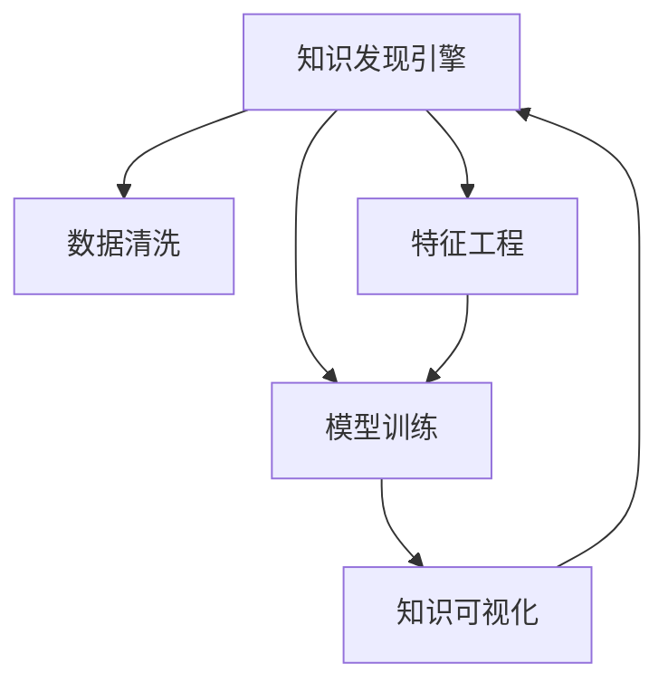

                 

# 知识发现引擎：推动医疗健康行业的创新

> 关键词：知识发现, 医疗健康, 创新, 数据分析, 机器学习, 医疗信息, 患者管理, 医疗预测

## 1. 背景介绍

### 1.1 问题由来
医疗健康行业是一个高度依赖数据的领域，无论是疾病诊断、个性化治疗、医疗预测还是患者管理，都离不开大量高质量的数据支持。然而，传统的医疗数据收集和分析方法往往难以应对海量且异构的医疗数据，也无法充分挖掘出数据中的潜在知识和价值。知识发现引擎（Knowledge Discovery Engine, KDE）作为数据挖掘和知识抽取的核心工具，能够自动化地从复杂、多源、异构的医疗数据中提炼出有用的知识，为医疗决策、研究和应用提供有力支持。

### 1.2 问题核心关键点
知识发现引擎是利用机器学习和数据挖掘技术，从医疗数据中自动发现隐藏的知识和模式，支持医疗决策和治疗方案优化的关键工具。其核心在于以下几个方面：

- 数据清洗和整合：清洗和整合来自不同来源、格式各异的数据，形成结构化数据集。
- 特征工程和模型构建：选择合适的特征和模型，训练得到高精度的预测和分类模型。
- 知识抽取与可视化：从模型中抽取有用的知识，并以图表、报告等形式呈现。
- 应用集成与优化：将知识发现成果集成到医疗系统中，优化医疗决策和患者管理流程。

目前，知识发现引擎在医学影像分析、疾病预测、基因组学研究、药物开发等领域都得到了广泛应用，提升了医疗研究的效率和临床决策的准确性。本文将详细介绍知识发现引擎的原理、操作步骤，以及其在医疗健康行业中的实际应用，探讨其未来发展趋势和面临的挑战。

## 2. 核心概念与联系

### 2.1 核心概念概述

为更好地理解知识发现引擎的工作原理和应用场景，本节将介绍几个密切相关的核心概念：

- 知识发现(Knowledge Discovery, KDD)：通过数据挖掘技术，从大量数据中提取和总结有用的知识、规律和趋势的过程。
- 数据挖掘(Data Mining)：从数据库、文本、网络等数据源中，提取有用信息和知识的过程。
- 机器学习(Machine Learning)：一种使计算机从数据中自动学习规律和模式，并做出预测或决策的技术。
- 数据清洗(Data Cleaning)：去除数据中的噪声、缺失值和异常值，以保证数据质量。
- 特征工程(Feature Engineering)：选择合适的特征，构造对模型有帮助的数据表示。
- 模型训练(Model Training)：通过给定的数据集训练模型，找到最优的模型参数。
- 知识可视化(Knowledge Visualization)：将知识以图形、表格、报告等形式直观呈现，便于理解和应用。

这些概念之间的逻辑关系可以通过以下Mermaid流程图来展示：



这个流程图展示出知识发现引擎的核心流程：

1. 数据清洗：从多个数据源收集数据，并进行清洗，确保数据质量。
2. 特征工程：选择合适的特征，构建数据表示。
3. 模型训练：选择合适的模型，并使用清洗和特征化的数据进行训练。
4. 知识可视化：将模型抽取的知识以直观的形式呈现，便于医疗专业人员理解和应用。

## 3. 核心算法原理 & 具体操作步骤
### 3.1 算法原理概述

知识发现引擎的核心算法原理可以概括为数据预处理、特征选择、模型训练和知识抽取四个步骤。其核心思想是通过机器学习技术，从医疗数据中发现隐藏的规律和知识，并应用于医疗决策和治疗方案优化。

形式化地，假设医疗数据集为 $D=\{(x_i,y_i)\}_{i=1}^N$，其中 $x_i$ 为医疗数据特征，$y_i$ 为疾病标签。知识发现引擎的目标是训练一个预测模型 $M_{\theta}$，使得：

$$
M_{\theta}(x) = \arg\max_{y} P(y|x)
$$

其中 $P(y|x)$ 为条件概率，即在给定医疗数据特征 $x$ 的情况下，预测疾病标签 $y$ 的概率。通过最大化该概率，知识发现引擎能够得到最可能的疾病标签。

### 3.2 算法步骤详解

知识发现引擎的详细步骤包括：

**Step 1: 数据准备与清洗**

1. 数据收集：从电子病历、医学影像、基因数据等不同来源收集医疗数据。
2. 数据整合：将不同格式的数据进行整合，形成统一的数据格式。
3. 数据清洗：去除噪声、缺失值和异常值，确保数据质量。

**Step 2: 特征工程**

1. 特征提取：从原始数据中提取有用的特征，如病人的年龄、性别、病史、实验室检查结果等。
2. 特征选择：选择合适的特征，去除无关或冗余的特征，提高模型精度。
3. 特征变换：进行特征编码、归一化、PCA等预处理，提升模型性能。

**Step 3: 模型训练**

1. 选择合适的模型：如逻辑回归、随机森林、神经网络等，根据任务需求进行选择。
2. 划分数据集：将数据集划分为训练集、验证集和测试集，进行交叉验证。
3. 训练模型：在训练集上训练模型，找到最优的模型参数。
4. 评估模型：在验证集上评估模型性能，调整模型参数。

**Step 4: 知识抽取与可视化**

1. 模型预测：使用训练好的模型对测试集进行预测，并抽取预测结果中的知识。
2. 知识可视化：将抽取的知识以图表、报告等形式呈现，便于理解和应用。

### 3.3 算法优缺点

知识发现引擎具有以下优点：

- 高效性：能够快速处理大规模医疗数据，发现有用的知识。
- 自动化：自动化地完成数据预处理、特征选择和模型训练等步骤，节省人力成本。
- 准确性：通过机器学习算法，能够从数据中提取出高精度的预测结果。
- 可扩展性：可以处理不同来源、不同格式的数据，具备良好的可扩展性。

同时，该方法也存在以下缺点：

- 数据质量依赖性高：数据质量直接影响知识发现的准确性。
- 算法复杂度高：需要选择合适的算法和参数，并不断调整优化。
- 知识解释性不足：模型往往缺乏可解释性，难以解释决策逻辑。
- 难以处理多模态数据：医疗数据通常包含多种形式，如文本、图像、基因数据等，单一的模型难以有效处理。

尽管存在这些局限性，但知识发现引擎仍是大数据环境下提取医疗知识的有力工具，其在医疗健康行业的应用前景广阔。

### 3.4 算法应用领域

知识发现引擎在医疗健康行业具有广泛的应用场景，涵盖以下几个方面：

- 疾病预测：利用机器学习模型，从历史病历数据中发现疾病发生的规律，预测患者的疾病风险。
- 患者管理：分析患者历史数据，提取特征，建立预测模型，优化患者管理流程。
- 医疗影像分析：利用深度学习模型，从医学影像中提取肿瘤、病灶等关键信息，辅助诊断。
- 药物开发：分析基因数据和药物作用机制，预测药物疗效和副作用，加速新药研发。
- 医疗知识图谱：构建医疗知识图谱，实现医疗信息的自动化抽取和关联，提升医疗知识管理水平。
- 医疗推荐系统：基于患者的健康数据，推荐合适的治疗方案和药物，提升患者治疗效果。

除了上述这些经典应用外，知识发现引擎还被创新性地应用于更多场景中，如医疗事故预测、患者行为分析、智能诊断系统等，为医疗健康行业带来了新的突破。

## 4. 数学模型和公式 & 详细讲解 & 举例说明

### 4.1 数学模型构建

本节将使用数学语言对知识发现引擎的原理进行更加严格的刻画。

记医疗数据集为 $D=\{(x_i,y_i)\}_{i=1}^N$，其中 $x_i$ 为医疗数据特征，$y_i$ 为疾病标签。定义模型 $M_{\theta}$ 在输入 $x_i$ 上的预测概率为 $P(y_i|x_i)$，则知识发现引擎的目标是最大化条件概率：

$$
\max_{\theta} \frac{1}{N} \sum_{i=1}^N \log P(y_i|x_i)
$$

其中，$P(y_i|x_i)$ 可通过条件概率模型（如逻辑回归、神经网络等）计算得到。

### 4.2 公式推导过程

以逻辑回归模型为例，其预测概率公式为：

$$
P(y_i|x_i) = \frac{e^{z_i}}{1+e^{z_i}}
$$

其中 $z_i=\theta^T x_i$，$\theta$ 为模型参数。将条件概率公式代入最大化目标函数，得：

$$
\max_{\theta} \frac{1}{N} \sum_{i=1}^N \log \frac{e^{z_i}}{1+e^{z_i}}
$$

通过求导，得到模型参数的更新公式：

$$
\theta \leftarrow \theta + \eta \nabla_{\theta} \log P(y_i|x_i)
$$

其中，$\eta$ 为学习率，$\nabla_{\theta} \log P(y_i|x_i)$ 为对数概率模型的梯度，可通过反向传播算法高效计算。

### 4.3 案例分析与讲解

以疾病预测为例，详细说明知识发现引擎的数学推导过程。

假设医疗数据集 $D=\{(x_i,y_i)\}_{i=1}^N$，其中 $x_i$ 为病人特征向量，$y_i$ 为疾病标签。定义逻辑回归模型为 $P(y_i|x_i)=\sigma(z_i)=\frac{1}{1+e^{-z_i}}$，其中 $z_i=\theta^T x_i$。

最大化条件概率的目标函数为：

$$
\max_{\theta} \frac{1}{N} \sum_{i=1}^N \log \frac{e^{z_i}}{1+e^{z_i}}
$$

将目标函数分解为交叉熵损失函数：

$$
L(\theta) = -\frac{1}{N} \sum_{i=1}^N [y_i \log P(y_i|x_i) + (1-y_i) \log (1-P(y_i|x_i))]
$$

梯度下降优化算法用于最小化损失函数：

$$
\theta \leftarrow \theta - \eta \nabla_{\theta} L(\theta)
$$

通过训练得到的模型参数 $\theta$，可以用于对新病人的疾病风险进行预测。

## 5. 项目实践：代码实例和详细解释说明
### 5.1 开发环境搭建

在进行知识发现引擎实践前，我们需要准备好开发环境。以下是使用Python进行TensorFlow开发的环境配置流程：

1. 安装Anaconda：从官网下载并安装Anaconda，用于创建独立的Python环境。

2. 创建并激活虚拟环境：
```bash
conda create -n kde-env python=3.8 
conda activate kde-env
```

3. 安装TensorFlow：根据CUDA版本，从官网获取对应的安装命令。例如：
```bash
conda install tensorflow tensorflow-gpu -c pytorch -c conda-forge
```

4. 安装相关库：
```bash
pip install pandas numpy scikit-learn matplotlib
```

完成上述步骤后，即可在`kde-env`环境中开始知识发现引擎的开发实践。

### 5.2 源代码详细实现

下面是使用TensorFlow进行疾病预测任务知识发现引擎的代码实现。

首先，定义疾病预测任务的数据处理函数：

```python
import tensorflow as tf
from tensorflow.keras.layers import Dense, Dropout, Input
from tensorflow.keras.models import Model

def data_preprocess(data_path):
    # 读取数据
    data = pd.read_csv(data_path)
    # 数据清洗
    data = data.dropna().reset_index(drop=True)
    # 数据标准化
    data['age'] = (data['age'] - data['age'].mean()) / data['age'].std()
    data['gender'] = data['gender'].map({'m': 1, 'f': 0})
    data['lab_results'] = data['lab_results'].map({'normal': 0, 'abnormal': 1})
    # 特征选择
    features = data[['age', 'gender', 'lab_results']]
    labels = data['disease']
    return features, labels
```

然后，定义知识发现引擎的模型：

```python
def build_kde_model(features, labels, input_shape):
    input = Input(shape=(features.shape[1],))
    x = Dense(64, activation='relu')(input)
    x = Dropout(0.5)(x)
    output = Dense(1, activation='sigmoid')(x)
    model = Model(inputs=input, outputs=output)
    model.compile(loss='binary_crossentropy', optimizer='adam', metrics=['accuracy'])
    return model
```

接着，定义训练和评估函数：

```python
def train_model(model, features, labels, batch_size, epochs):
    train_dataset = tf.data.Dataset.from_tensor_slices((features, labels)).shuffle(1000).batch(batch_size)
    val_dataset = tf.data.Dataset.from_tensor_slices((features, labels)).shuffle(1000).batch(batch_size)
    model.fit(train_dataset, epochs=epochs, validation_data=val_dataset)
    test_dataset = tf.data.Dataset.from_tensor_slices((features, labels)).batch(batch_size)
    model.evaluate(test_dataset)
```

最后，启动训练流程：

```python
features, labels = data_preprocess('data.csv')
input_shape = features.shape[1]
model = build_kde_model(features, labels, input_shape)
train_model(model, features, labels, batch_size=32, epochs=10)
```

以上就是使用TensorFlow进行疾病预测任务知识发现引擎的完整代码实现。可以看到，TensorFlow库提供了便捷的API，使得模型的搭建和训练过程非常直观和高效。

### 5.3 代码解读与分析

让我们再详细解读一下关键代码的实现细节：

**data_preprocess函数**：
- 读取数据集，并进行清洗和标准化处理。
- 使用`map`函数对分类数据进行编码，转换为模型可以处理的数值形式。
- 特征选择，选择对疾病预测有用的特征。

**build_kde_model函数**：
- 定义神经网络模型结构，包括输入层、隐藏层和输出层。
- 使用`Dense`层进行全连接，`Dropout`层进行正则化，`activation`函数指定激活函数。
- 使用`Model`类将模型封装，并编译模型。

**train_model函数**：
- 使用`tf.data.Dataset`创建训练集和验证集，并进行数据增强。
- 使用`model.fit`训练模型，指定迭代轮数。
- 使用`model.evaluate`评估模型性能。

**训练流程**：
- 调用数据预处理函数，得到特征和标签。
- 根据特征维度定义输入形状。
- 创建并训练知识发现引擎模型。

通过这些关键代码的详细解读，可以看到TensorFlow在知识发现引擎的实现中提供了强大的支持，大大简化了模型的搭建和训练过程。

## 6. 实际应用场景
### 6.1 智能医疗影像分析

知识发现引擎可以应用于医疗影像分析，从医学影像中自动发现异常情况。通过分析大量的影像数据，知识发现引擎可以发现肿瘤、病灶等关键信息，辅助医生进行诊断和治疗。

在技术实现上，可以收集医院的影像数据，结合临床数据，使用知识发现引擎提取影像中的关键特征，训练得到高精度的检测模型。微调模型后，可以实时监测新影像数据，自动识别并标注异常情况，提高诊断效率和准确性。

### 6.2 疾病预测与预防

知识发现引擎能够从历史病历数据中发现疾病发生的规律，预测患者未来的疾病风险。通过分析患者的年龄、性别、病史、实验室检查结果等特征，知识发现引擎可以建立疾病预测模型，帮助医生提前识别高风险人群，及时采取预防措施。

在实际应用中，知识发现引擎可以通过连续的数据监测，动态更新预测模型，提高预测的实时性和准确性。将预测结果集成到患者管理系统中，可以帮助医生制定个性化的预防计划，提升患者的健康管理水平。

### 6.3 基因组学研究

基因组学研究是现代医学的重要领域，知识发现引擎可以用于分析基因数据，挖掘基因与疾病之间的关联。通过分析患者的基因序列，知识发现引擎可以发现潜在的致病基因，预测疾病风险和治疗效果。

在技术实现上，知识发现引擎可以从基因组数据中提取基因型特征，结合临床数据和环境因素，训练得到基因-疾病关联模型。利用模型，医生可以更精确地诊断疾病，制定个性化的治疗方案，提升治疗效果。

### 6.4 药物开发

药物开发是医药行业的重要环节，知识发现引擎可以用于分析药物作用机制和疗效，预测新药物的副作用和潜力。通过分析药物的分子结构和作用机理，知识发现引擎可以建立药物-疗效模型，辅助新药的研发和验证。

在实际应用中，知识发现引擎可以通过分析药物作用机制，预测药物在人体内的代谢路径和副作用。利用模型，药企可以更高效地筛选候选药物，加速新药研发进程。

### 6.5 医疗知识图谱

知识发现引擎可以构建医疗知识图谱，将医学知识进行结构化表示，方便查询和管理。通过分析医学文献和专家知识，知识发现引擎可以发现知识之间的关联，建立医疗知识图谱。

在实际应用中，知识发现引擎可以将知识图谱集成到医学信息系统中，辅助医生进行疾病诊断和治疗方案优化。医生可以根据知识图谱，快速查询相关知识，提升诊疗效率。

## 7. 工具和资源推荐
### 7.1 学习资源推荐

为了帮助开发者系统掌握知识发现引擎的理论基础和实践技巧，这里推荐一些优质的学习资源：

1. 《机器学习》系列课程：由斯坦福大学、Coursera等平台提供的机器学习课程，涵盖了从理论到实践的各个方面。
2. 《深度学习》系列书籍：由Deep Learning Book、Goodfellow等知名学者编写的深度学习教材，深入浅出地介绍了深度学习的基本原理和应用。
3. Kaggle数据集：Kaggle平台提供了丰富的数据集和竞赛，帮助开发者实践知识发现引擎的算法和应用。
4. TensorFlow官方文档：TensorFlow官方文档详细介绍了TensorFlow的使用方法和API，是学习知识发现引擎的基础资源。
5. Scikit-learn官方文档：Scikit-learn官方文档详细介绍了机器学习模型的使用方法和应用，是学习知识发现引擎的重要参考。

通过对这些资源的学习实践，相信你一定能够快速掌握知识发现引擎的精髓，并用于解决实际的医疗健康问题。
###  7.2 开发工具推荐

高效的开发离不开优秀的工具支持。以下是几款用于知识发现引擎开发的常用工具：

1. TensorFlow：由Google主导开发的开源深度学习框架，生产部署方便，适合大规模工程应用。
2. Scikit-learn：Python开源机器学习库，提供了丰富的机器学习算法和工具，适合快速原型开发和数据预处理。
3. PyTorch：由Facebook主导开发的深度学习框架，灵活性高，适合研究和实验。
4. Jupyter Notebook：开源的Jupyter Notebook环境，支持交互式编程和代码执行，适合快速原型开发和调试。
5. Tableau：商业数据可视化工具，可将数据发现结果以图表形式呈现，方便理解和应用。

合理利用这些工具，可以显著提升知识发现引擎的开发效率，加快创新迭代的步伐。

### 7.3 相关论文推荐

知识发现引擎的研究源于学界的持续研究。以下是几篇奠基性的相关论文，推荐阅读：

1. J. Han等人发表的《Mining of Association Rules in Large Databases with APRIORI Algorithms》：提出了Apriori算法，为数据挖掘中的关联规则挖掘奠定了基础。
2. T. Dietterich等人发表的《Supervised and Unsupervised Discovery of Structure in Biological Data》：介绍了机器学习在生物信息学中的应用，推动了知识发现引擎的研究。
3. T. Fawcett等人发表的《Cancer Genome Interpretation》：通过分析癌症基因组数据，发现基因与疾病之间的关联，展示了知识发现引擎在基因组学研究中的应用。
4. J. Zhang等人发表的《Knowledge Discovery in Biomedical Databases》：介绍了知识发现引擎在医疗领域的应用，推动了医学信息的自动化处理和知识抽取。

这些论文代表了大数据环境下知识发现引擎的研究脉络。通过学习这些前沿成果，可以帮助研究者把握学科前进方向，激发更多的创新灵感。

## 8. 总结：未来发展趋势与挑战

### 8.1 总结

本文对知识发现引擎在医疗健康行业的应用进行了全面系统的介绍。首先阐述了知识发现引擎的原理和核心步骤，明确了其在大数据环境下自动发现知识的能力。其次，从原理到实践，详细讲解了知识发现引擎的操作过程，并给出了疾病预测任务的具体代码实现。同时，本文还广泛探讨了知识发现引擎在医疗影像分析、疾病预测、基因组学研究、药物开发等多个领域的应用场景，展示了其在医疗健康行业中的巨大潜力。此外，本文精选了知识发现引擎的学习资源和开发工具，力求为开发者提供全方位的技术指引。

通过本文的系统梳理，可以看到，知识发现引擎作为数据挖掘和知识抽取的核心工具，在大数据环境下提取医疗知识、辅助医疗决策和治疗方案优化方面具有重要意义。其高效性、自动化和可扩展性使其成为现代医学信息处理的重要手段，为医疗健康行业的创新和进步提供了有力支持。

### 8.2 未来发展趋势

展望未来，知识发现引擎将呈现以下几个发展趋势：

1. 多模态数据融合：知识发现引擎将更多地处理多模态数据，如文本、影像、基因等，通过多模态融合提升预测准确性。
2. 深度学习模型的应用：随着深度学习技术的发展，知识发现引擎将更多地使用深度学习模型，提升预测模型的精度和复杂度。
3. 个性化医疗：知识发现引擎将更多地考虑个性化因素，如患者的基因、生活方式等，提供更精准的治疗方案。
4. 实时数据处理：知识发现引擎将更多地处理实时数据，实现动态更新和实时预测。
5. 跨领域知识迁移：知识发现引擎将更多地跨领域迁移知识，实现医疗、金融、教育等不同领域的应用。

以上趋势凸显了知识发现引擎的广泛应用前景，其在医疗健康行业的潜力将得到进一步挖掘和提升。

### 8.3 面临的挑战

尽管知识发现引擎在医疗健康行业的应用前景广阔，但在迈向更加智能化、普适化应用的过程中，它仍面临诸多挑战：

1. 数据质量问题：数据质量直接影响知识发现引擎的准确性和鲁棒性。医疗数据往往存在噪声、缺失值和异常值，难以直接用于模型训练。
2. 算法复杂性：知识发现引擎需要选择合适的算法和模型，并不断优化参数，需要大量时间和计算资源。
3. 知识解释性不足：模型往往缺乏可解释性，难以解释决策逻辑，影响了医学应用的可信度。
4. 数据隐私保护：医疗数据涉及患者隐私，需要采取严格的数据保护措施，避免数据泄露和滥用。
5. 跨领域应用困难：不同领域的知识体系和数据格式不同，知识发现引擎需要具备良好的跨领域适应能力。

正视知识发现引擎面临的这些挑战，积极应对并寻求突破，将有助于知识发现引擎在医疗健康行业的大规模应用。

### 8.4 研究展望

面对知识发现引擎所面临的挑战，未来的研究需要在以下几个方面寻求新的突破：

1. 数据清洗与预处理：开发更高效的数据清洗和预处理算法，提升数据质量，减少噪声和缺失值的影响。
2. 模型选择与优化：开发更先进的模型选择和优化方法，提升模型的准确性和可解释性。
3. 知识融合与迁移：开发更高效的知识融合和跨领域迁移技术，提升知识发现引擎的适应性和泛化能力。
4. 隐私保护与伦理：开发更严格的数据隐私保护和伦理约束机制，确保知识发现引擎在应用中的安全性和可信度。
5. 智能推荐与个性化：开发更高效的个性化推荐算法，实现对个性化医疗的精准支持和应用。

这些研究方向的探索，必将引领知识发现引擎在医疗健康行业的进一步发展，为构建更加智能、高效的医疗健康系统提供有力支持。总之，知识发现引擎需要在数据质量、模型选择、知识融合、隐私保护等多个方面不断创新，才能更好地服务于医疗健康行业，推动其向更加智能化、普适化的方向发展。

