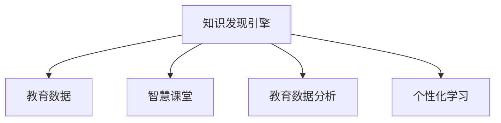

                 

# 知识发现引擎：教育领域的智慧革命

> 关键词：知识发现引擎，教育技术，智慧课堂，教育数据分析，个性化学习

## 1. 背景介绍

### 1.1 问题由来
随着信息技术的发展，教育领域正在经历深刻的变革。传统的教育模式已经无法满足现代社会的教育需求。如何让教育更加智能化、个性化，是当前教育领域亟待解决的重大问题。

为了解决这个问题，知识发现引擎应运而生。知识发现引擎是指通过对教育数据进行分析和挖掘，发现其中的知识规律和潜在信息，从而辅助教育决策和个性化学习的一种技术。该技术已经在教育领域得到了广泛应用，极大地提升了教育质量和教学效率。

## 2. 核心概念与联系

### 2.1 核心概念概述

为了更好地理解知识发现引擎，本节将介绍几个密切相关的核心概念：

- **知识发现(Knowledge Discovery)**：通过数据分析和挖掘，从大量数据中发现隐藏的有用信息和知识。在教育领域，知识发现可以发现学生学习行为、成绩分布、知识掌握情况等规律。
- **教育数据(Education Data)**：包含学生信息、教师信息、课程信息、成绩信息等，是知识发现引擎的核心数据来源。
- **智慧课堂(Smart Classroom)**：利用先进的信息技术，提供智能化、个性化、互动式的学习体验。知识发现引擎可以为智慧课堂提供数据支持和决策辅助。
- **教育数据分析(Education Data Analytics)**：通过分析教育数据，发现其中的规律和趋势，为教育决策提供依据。知识发现引擎是教育数据分析的重要组成部分。
- **个性化学习(Personalized Learning)**：根据学生的学习情况和需求，提供个性化的教学内容和路径，提升学习效果。知识发现引擎可以通过分析学生数据，实现个性化的教学推荐。

这些核心概念之间的逻辑关系可以通过以下Mermaid流程图来展示：



这个流程图展示了这个核心概念的逻辑关系：

1. 知识发现引擎以教育数据为输入，通过数据分析和挖掘，发现知识规律。
2. 智慧课堂使用这些知识规律，提供个性化和智能化的学习体验。
3. 教育数据分析以知识发现的结果为依据，进行更深入的分析。
4. 个性化学习则利用知识发现的结果，为每个学生定制个性化的学习方案。

## 3. 核心算法原理 & 具体操作步骤

### 3.1 算法原理概述

知识发现引擎的原理是通过对教育数据的分析，发现其中的知识规律和潜在信息，从而为教育决策和个性化学习提供依据。其核心算法包括数据预处理、特征提取、模型训练和结果解释等步骤。

### 3.2 算法步骤详解

知识发现引擎的具体操作步骤如下：

**Step 1: 数据收集与预处理**
- 收集教育数据，包括学生基本信息、课程信息、成绩信息等。
- 对数据进行清洗、去重、归一化等预处理，确保数据的准确性和一致性。

**Step 2: 特征提取**
- 从教育数据中提取有用的特征，如学生成绩、学习时长、知识点掌握情况等。
- 使用统计学方法、数据挖掘算法等，对特征进行降维和聚类，提取出有意义的特征集合。

**Step 3: 模型训练**
- 选择合适的机器学习或深度学习模型，对提取出的特征进行训练。常用的模型包括决策树、随机森林、神经网络等。
- 使用交叉验证等方法，评估模型的性能，选择最优的模型参数和结构。

**Step 4: 结果解释**
- 对训练好的模型进行结果解释，将模型的输出转化为易于理解的结论。
- 提供可视化工具，展示数据分析和挖掘的结果。

### 3.3 算法优缺点

知识发现引擎具有以下优点：

- 提高了教育决策的科学性和准确性。通过数据分析，可以发现隐藏的教育规律，辅助决策。
- 支持个性化学习，提高了学生的学习效果。通过分析学生的学习行为，可以为其提供个性化的学习建议和路径。
- 支持智慧课堂的构建，提供了智能化和互动式的学习体验。

同时，该方法也存在以下缺点：

- 需要大量的教育数据，数据获取和处理难度较大。
- 算法的复杂度高，训练和解释成本较高。
- 模型的解释性较差，难以解释模型的决策过程。

### 3.4 算法应用领域

知识发现引擎已经在教育领域的多个方面得到了应用，包括：

- **学生学习行为分析**：分析学生的学习行为，发现学习规律，提供个性化学习建议。
- **教师教学效果评估**：通过分析学生的成绩和反馈，评估教师的教学效果，提供改进建议。
- **课程设计与优化**：分析课程内容和结构，发现学生的薄弱环节，优化课程设计和教学方法。
- **学习资源推荐**：根据学生的学习情况，推荐合适的学习资源和内容，提升学习效果。
- **考试命题与评价**：通过分析历届考试的题目和答案，发现考试的难度和规律，辅助命题和评价。

## 4. 数学模型和公式 & 详细讲解 & 举例说明

### 4.1 数学模型构建

知识发现引擎的数学模型主要包括数据预处理、特征提取和模型训练三部分。下面分别进行详细讲解。

#### 4.1.1 数据预处理

数据预处理的主要目标是清洗和整理教育数据，使其满足后续分析和挖掘的要求。常用的数据预处理技术包括：

- **数据清洗**：去除重复数据、缺失数据和异常数据，确保数据的完整性和一致性。
- **归一化**：将数据进行归一化处理，使不同维度的数据具有相同的尺度，便于后续分析。

#### 4.1.2 特征提取

特征提取是指从原始数据中提取有用的特征，用于后续的分析和挖掘。常用的特征提取技术包括：

- **统计特征提取**：使用统计学方法，提取数据的均值、方差、标准差等统计特征。
- **文本特征提取**：使用自然语言处理技术，提取文本数据的词频、TF-IDF、主题模型等特征。
- **时序特征提取**：使用时间序列分析方法，提取数据的趋势、周期、季节性等特征。

#### 4.1.3 模型训练

模型训练是指选择合适的机器学习或深度学习模型，对提取出的特征进行训练。常用的模型包括决策树、随机森林、神经网络等。以神经网络为例，其训练过程如下：

1. 选择神经网络模型，如多层感知器(MLP)、卷积神经网络(CNN)、循环神经网络(RNN)等。
2. 确定模型的超参数，如层数、节点数、激活函数等。
3. 使用反向传播算法，计算损失函数，更新模型参数。
4. 使用交叉验证等方法，评估模型的性能，选择最优的模型参数和结构。

### 4.2 公式推导过程

以神经网络为例，其训练过程的数学模型推导如下：

设输入数据为 $x$，输出标签为 $y$，神经网络的参数为 $\theta$，则神经网络的输出为 $h(x;\theta)$。神经网络的损失函数为：

$$
L(\theta) = \frac{1}{N}\sum_{i=1}^N \ell(h(x_i;\theta),y_i)
$$

其中 $\ell$ 为损失函数，常用的损失函数包括均方误差、交叉熵等。

神经网络的训练过程可以表示为：

$$
\theta = \arg\min_{\theta} L(\theta)
$$

其中 $\arg\min$ 表示最小值，即找到使损失函数最小的参数 $\theta$。

### 4.3 案例分析与讲解

以学生学习行为分析为例，分析学生的学习数据，发现学生的学习规律，提供个性化学习建议。

假设有一个学生 $S$，其学习数据包含以下特征：

- 学习时长：$T$
- 学习频率：$F$
- 成绩：$G$
- 学习资源使用情况：$R$

首先，需要对这些特征进行预处理和归一化，然后提取有用的特征。例如，使用时间序列分析方法，提取学习时长的趋势、周期和季节性特征。

接着，选择适当的模型，如多层感知器(MLP)，对提取出的特征进行训练。训练过程可以使用反向传播算法，不断更新模型参数，使模型的输出与实际标签尽可能一致。

最后，使用训练好的模型对新数据进行预测，提供个性化的学习建议。例如，根据学生的学习行为和成绩，预测学生的薄弱环节，为其推荐相应的学习资源和内容。

## 5. 项目实践：代码实例和详细解释说明

### 5.1 开发环境搭建

在进行知识发现引擎的开发实践前，需要准备开发环境。以下是使用Python进行PyTorch开发的环境配置流程：

1. 安装Anaconda：从官网下载并安装Anaconda，用于创建独立的Python环境。

2. 创建并激活虚拟环境：
```bash
conda create -n pytorch-env python=3.8 
conda activate pytorch-env
```

3. 安装PyTorch：根据CUDA版本，从官网获取对应的安装命令。例如：
```bash
conda install pytorch torchvision torchaudio cudatoolkit=11.1 -c pytorch -c conda-forge
```

4. 安装相关的Python库：
```bash
pip install pandas numpy scikit-learn torch torchtext
```

完成上述步骤后，即可在`pytorch-env`环境中开始开发实践。

### 5.2 源代码详细实现

下面以学生学习行为分析为例，给出使用PyTorch进行知识发现引擎的代码实现。

```python
import torch
import torch.nn as nn
import torch.optim as optim
from torchtext.datasets import TabularDataset, TabularList
from torchtext.data import Field, BucketIterator

# 定义数据集
train_data, test_data = TabularDataset.splits(
    path="./data",
    train='train.csv',
    test='test.csv',
    format='tsv',
    fields=[
        ('T', Field(sequential=True, use_vocab=False, fix_length=10), 
        ('F', Field(sequential=True, use_vocab=False, fix_length=10), 
        ('G', Field(sequential=False, use_vocab=False), 
        ('R', Field(sequential=False, use_vocab=False)
    ])

# 定义模型
class StudentModel(nn.Module):
    def __init__(self):
        super(StudentModel, self).__init__()
        self.embedding = nn.Embedding(10, 10)
        self.fc = nn.Linear(10, 10)
        self.output = nn.Linear(10, 1)

    def forward(self, x):
        embedded = self.embedding(x)
        hidden = self.fc(embedded)
        output = self.output(hidden)
        return output

# 定义超参数
model = StudentModel()
optimizer = optim.Adam(model.parameters(), lr=0.001)
criterion = nn.MSELoss()

# 定义训练函数
def train_epoch(model, data_loader, optimizer, criterion):
    model.train()
    total_loss = 0
    for batch in data_loader:
        input_t, input_f, input_g, input_r = batch
        optimizer.zero_grad()
        output = model(input_t)
        loss = criterion(output, input_g)
        loss.backward()
        optimizer.step()
        total_loss += loss.item()
    return total_loss / len(data_loader)

# 训练模型
epochs = 10
batch_size = 64

for epoch in range(epochs):
    train_loss = train_epoch(model, train_iterator, optimizer, criterion)
    print(f"Epoch {epoch+1}, train loss: {train_loss:.4f}")
    
# 测试模型
with torch.no_grad():
    test_loss = train_epoch(model, test_iterator, optimizer, criterion)
    print(f"Test loss: {test_loss:.4f}")
```

### 5.3 代码解读与分析

以下是关键代码的实现细节：

**定义数据集**：
- 使用 `TabularDataset` 类从数据集中加载训练集和测试集，使用 `Field` 类定义数据字段类型。
- 定义特征 `T`、`F`、`G`、`R` 分别代表学习时长、学习频率、成绩、学习资源使用情况。

**定义模型**：
- 定义 `StudentModel` 类，继承 `nn.Module`，构建包含嵌入层、全连接层和输出层的神经网络。
- 嵌入层将输入数据映射到高维空间，全连接层进行特征提取，输出层输出预测结果。

**定义超参数**：
- 定义优化器、损失函数和训练函数。

**训练模型**：
- 在每个epoch内，对训练数据进行迭代训练，计算损失并更新模型参数。
- 在每个epoch后，输出训练损失。

**测试模型**：
- 在测试集上进行模型评估，计算测试损失。

## 6. 实际应用场景

### 6.1 智慧课堂

知识发现引擎可以应用于智慧课堂的构建，提供智能化的学习体验。例如，根据学生的学习行为，动态调整教学内容和难度，提供个性化的学习建议。

具体而言，知识发现引擎可以从学生的学习数据中提取有用的特征，如学习时长、学习频率、知识掌握情况等。然后，使用神经网络等模型，对这些特征进行训练，预测学生的薄弱环节，为其推荐相应的学习资源和内容。

### 6.2 教育数据分析

知识发现引擎可以用于教育数据的分析和挖掘，发现其中的规律和趋势，为教育决策提供依据。例如，分析学生的成绩数据，发现不同科目的成绩分布和关联关系，为课程设置和考试命题提供参考。

具体而言，知识发现引擎可以从学生的成绩数据中提取有用的特征，如成绩、分数分布、科目关联等。然后，使用机器学习或深度学习模型，对这些特征进行训练，发现其中的规律和趋势，为教育决策提供依据。

### 6.3 个性化学习

知识发现引擎可以用于个性化学习，提供个性化的教学内容和路径，提升学习效果。例如，根据学生的学习情况，推荐合适的学习资源和路径，提升学生的学习效果。

具体而言，知识发现引擎可以从学生的学习数据中提取有用的特征，如学习时长、学习频率、知识掌握情况等。然后，使用神经网络等模型，对这些特征进行训练，预测学生的薄弱环节，为其推荐相应的学习资源和路径。

## 7. 工具和资源推荐

### 7.1 学习资源推荐

为了帮助开发者系统掌握知识发现引擎的理论基础和实践技巧，这里推荐一些优质的学习资源：

1. 《Python深度学习》系列书籍：介绍深度学习和知识发现引擎的原理和实现。
2. Kaggle教育数据分析竞赛：提供丰富的教育数据集和模型实现，可以学习到数据预处理、特征提取和模型训练的技术。
3. Coursera《机器学习》课程：斯坦福大学开设的机器学习课程，深入讲解了机器学习的基本概念和算法。
4. PyTorch官方文档：提供完整的深度学习框架的文档和示例代码，可以学习到模型训练和推理的实现方法。

### 7.2 开发工具推荐

高效的开发离不开优秀的工具支持。以下是几款用于知识发现引擎开发的常用工具：

1. Jupyter Notebook：用于编写和运行Python代码，提供可视化界面，方便调试和测试。
2. TensorBoard：提供可视化工具，实时监测模型训练状态，展示模型的指标和图表。
3. PyTorch Lightning：提供快速原型开发和实验运行的环境，支持模型加速和可视化。
4. Weights & Biases：提供实验跟踪和评估工具，记录和可视化模型训练过程中的各项指标。

### 7.3 相关论文推荐

知识发现引擎的研究源于学界的持续研究。以下是几篇奠基性的相关论文，推荐阅读：

1. KDD '99: "Knowledge Discovery in Databases: Parallel Conceptual Clustering in Large Databases" ：介绍知识发现的经典算法和方法。
2. ICML '12: "Learning from labeled and unlabeled data in knowledge discovery and data mining" ：介绍知识发现中无监督和半监督学习方法。
3. JMLR '06: "A Survey of Data Mining and Statistical Learning Techniques for Predicting and Understanding Behavior from Adaptive Web Systems" ：介绍数据挖掘和行为分析技术。
4. TAM '07: "Exploring the Social Network of News Discussion in Chinese WWW" ：介绍社交网络分析和文本挖掘技术。

通过对这些资源的学习实践，相信你一定能够快速掌握知识发现引擎的精髓，并用于解决实际的NLP问题。

## 8. 总结：未来发展趋势与挑战

### 8.1 研究成果总结

知识发现引擎作为教育领域的一项重要技术，已经在多个方面得到了应用，提高了教育决策的科学性和个性化学习的有效性。其主要成果包括：

- 学生学习行为分析：分析学生的学习行为，发现学习规律，提供个性化学习建议。
- 教师教学效果评估：通过分析学生的成绩和反馈，评估教师的教学效果，提供改进建议。
- 课程设计与优化：分析课程内容和结构，发现学生的薄弱环节，优化课程设计和教学方法。
- 学习资源推荐：根据学生的学习情况，推荐合适的学习资源和内容，提升学习效果。
- 考试命题与评价：通过分析历届考试的题目和答案，发现考试的难度和规律，辅助命题和评价。

### 8.2 未来发展趋势

展望未来，知识发现引擎将呈现以下几个发展趋势：

1. 数据融合：将多源异构数据进行融合，提供更全面和精准的分析结果。
2. 实时分析：实现实时数据分析和挖掘，及时发现教育过程中的问题。
3. 自适应学习：根据学生的学习情况和反馈，动态调整学习内容和路径，提升学习效果。
4. 跨领域应用：将知识发现引擎应用于更多领域，如医疗、金融等，提供智能化的决策支持。
5. 自动化评估：使用自动化评估工具，对模型和算法进行评估和优化。

### 8.3 面临的挑战

尽管知识发现引擎已经取得了一定的成就，但在迈向更加智能化、普适化应用的过程中，它仍面临诸多挑战：

1. 数据获取难度：教育数据获取和处理难度较大，缺乏标准化的数据格式和规范。
2. 数据质量问题：教育数据往往存在缺失、错误和噪声，影响分析结果的准确性。
3. 模型解释性不足：知识发现引擎的模型复杂度高，难以解释其内部工作机制和决策逻辑。
4. 鲁棒性问题：知识发现引擎的模型对数据分布和特征变化敏感，鲁棒性较差。
5. 隐私和安全问题：教育数据涉及学生的隐私和个人信息，数据安全和隐私保护至关重要。

### 8.4 研究展望

面对知识发现引擎所面临的挑战，未来的研究需要在以下几个方面寻求新的突破：

1. 数据预处理技术：开发高效的数据清洗和处理技术，确保数据的质量和一致性。
2. 模型解释性技术：开发可解释的模型和算法，提高模型的透明性和可理解性。
3. 鲁棒性优化技术：提高模型的鲁棒性和泛化能力，使其对数据变化具有更好的适应性。
4. 隐私保护技术：开发隐私保护技术，保护教育数据的安全和隐私。
5. 跨领域应用研究：将知识发现引擎应用于更多领域，如医疗、金融等，探索其在不同领域的应用前景。

这些研究方向的探索，必将引领知识发现引擎技术迈向更高的台阶，为教育领域提供更智能、更精准、更个性化的解决方案。

## 9. 附录：常见问题与解答

**Q1：知识发现引擎是否适用于所有教育场景？**

A: 知识发现引擎可以适用于大部分教育场景，但需要根据具体场景进行调整和优化。例如，针对不同年龄段的学生的学习行为分析，需要采用不同的特征提取方法和模型。

**Q2：知识发现引擎的训练过程需要哪些数据？**

A: 知识发现引擎的训练过程需要大量的教育数据，包括学生的学习行为数据、成绩数据、反馈数据等。这些数据需要经过清洗、归一化和标注等预处理步骤，才能用于训练模型。

**Q3：如何评估知识发现引擎的性能？**

A: 知识发现引擎的性能评估可以从多个方面进行，如准确率、召回率、F1值、模型复杂度等。可以使用交叉验证等方法，对模型进行评估和优化。

**Q4：知识发现引擎在实际应用中需要注意哪些问题？**

A: 知识发现引擎在实际应用中需要注意数据获取和处理难度、数据质量问题、模型解释性不足、鲁棒性问题、隐私和安全问题等。需要综合考虑这些因素，确保知识发现引擎的稳定性和可靠性。

**Q5：知识发现引擎如何与智慧课堂结合？**

A: 知识发现引擎可以与智慧课堂结合，提供智能化的学习体验。例如，根据学生的学习行为，动态调整教学内容和难度，提供个性化的学习建议。

---

作者：禅与计算机程序设计艺术 / Zen and the Art of Computer Programming

