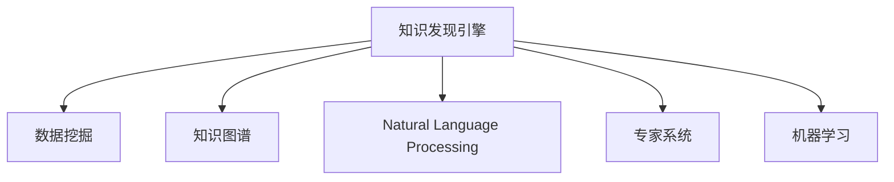

                 

# 知识发现引擎：知识创新的助推器

> 关键词：知识发现引擎, 数据挖掘, 知识图谱, 自然语言处理, 专家系统, 机器学习

## 1. 背景介绍

### 1.1 问题由来
随着信息时代的发展，数据的规模和维度不断增长，人们在日常工作、学习中面临大量的数据处理需求。如何从海量数据中提取出有用信息，揭示数据背后的规律和趋势，成为信息时代的一个关键问题。知识发现引擎(Knowledge Discovery Engine, KDE)正是在这一背景下提出的，通过自动化地从数据中挖掘知识，辅助人们进行决策分析，提升效率和效果。

### 1.2 问题核心关键点
知识发现引擎的核心在于从数据中提取、整理、分析和应用知识，支持用户在信息爆炸的时代，快速、准确地获取所需信息。其核心特点包括：

- 数据驱动：通过数据分析而非直觉判断进行知识发现。
- 自动化：减少人工干预，提高发现效率。
- 可解释性：模型决策应具备可解释性，便于用户理解。
- 可扩展性：能够处理大规模复杂数据，支持多领域应用。
- 动态更新：能够适应数据分布的变化，保持知识的时效性。

知识发现引擎已经在金融、医疗、电商、政府等多个领域得到了广泛应用，成为推动社会信息化、智能化发展的重要工具。

### 1.3 问题研究意义
研究知识发现引擎，对于揭示数据背后隐藏的规律和知识，提升数据利用效率，推动社会经济信息化、智能化发展具有重要意义：

1. 降低数据处理成本：自动化、智能化的知识发现，减少了人工分析和数据整理的复杂度和工作量。
2. 提高决策效率：通过发现数据中的模式和趋势，辅助用户制定决策，提升决策的科学性和准确性。
3. 促进创新应用：在商业智能、医疗诊断、智慧城市等多个领域，知识发现引擎帮助企业、机构发现新的应用场景和业务机会。
4. 强化风险防控：通过数据挖掘和分析，及时发现异常行为和风险预警，提高数据安全性和系统稳定性。
5. 实现精准推荐：在电商、内容推荐等领域，知识发现引擎可以基于用户历史行为数据，实现精准个性化推荐。

## 2. 核心概念与联系

### 2.1 核心概念概述

为了更好地理解知识发现引擎的工作原理和优化方向，本节将介绍几个密切相关的核心概念：

- **知识发现引擎(KDE)**：自动从大规模数据集中发现知识，支持数据驱动的决策分析和智能应用。
- **数据挖掘(Data Mining)**：从数据中自动、智能地提取有用信息，包括分类、聚类、关联规则分析等。
- **知识图谱(Knowledge Graph)**：通过图结构表示实体与实体之间的语义关系，辅助进行复杂数据的分析和推理。
- **自然语言处理(NLP)**：通过算法对自然语言进行理解和处理，辅助知识发现和智能应用。
- **专家系统(Expert System)**：结合人工智能与专家知识，进行复杂决策和问题求解的系统。
- **机器学习(Machine Learning)**：通过学习数据特征和模式，实现自主发现和应用知识。

这些核心概念之间的逻辑关系可以通过以下Mermaid流程图来展示：



这个流程图展示了知识发现引擎的关键组件及其相互关系：

1. 知识发现引擎是数据挖掘、知识图谱、自然语言处理、专家系统、机器学习的集成应用，通过多维度的信息获取和处理，实现全面、准确的知识发现。
2. 数据挖掘是知识发现的基础，通过分类、聚类、关联规则分析等手段，挖掘数据中的有用信息。
3. 知识图谱通过语义图结构，辅助进行复杂数据的推理和关系分析。
4. 自然语言处理技术，从文本中提取语义信息，辅助知识发现和智能应用。
5. 专家系统结合人工智能与专家知识，进行复杂决策和问题求解。
6. 机器学习技术，通过学习数据特征和模式，实现自主发现和应用知识。

## 3. 核心算法原理 & 具体操作步骤

### 3.1 算法原理概述

知识发现引擎的核心算法原理，主要是通过数据挖掘技术，从大规模数据集中自动发现知识。这些算法主要包括分类、聚类、关联规则分析、神经网络、深度学习等。具体而言：

1. **分类算法**：通过将数据分为不同的类别，挖掘数据中的模式和规律，支持决策分析和推荐系统。
2. **聚类算法**：将相似的数据分为一组，发现数据中的结构化和层次化特征，辅助模式识别和异常检测。
3. **关联规则分析**：通过分析事务数据中的频繁项集和关联规则，发现数据中的潜在关系，支持市场分析和商业决策。
4. **神经网络和深度学习**：通过多层神经网络和深度学习模型，自动提取数据中的高阶特征和模式，实现复杂数据表示和推理。

这些算法可以应用于不同的数据类型和分析任务，如结构化数据、半结构化数据、非结构化数据等。

### 3.2 算法步骤详解

知识发现引擎的具体操作步骤一般包括以下几个关键步骤：

**Step 1: 数据预处理**
- 收集、清洗、整合数据，准备数据挖掘所需的输入。
- 进行缺失值处理、异常值检测、数据转换等预处理步骤，确保数据的质量和一致性。

**Step 2: 数据建模**
- 根据任务需求选择合适的算法模型，如决策树、支持向量机、神经网络等。
- 对模型进行参数设置和超参数调优，选择最优模型。
- 对模型进行训练，确保模型能够正确地从数据中学习规律。

**Step 3: 特征提取**
- 从原始数据中提取特征，如数值特征、文本特征、时间特征等。
- 对特征进行编码和标准化处理，确保特征的可用性和可比性。

**Step 4: 数据挖掘**
- 将预处理后的数据输入模型，进行分类、聚类、关联规则分析等操作。
- 分析模型的输出结果，提取有用信息和知识。

**Step 5: 知识应用**
- 将挖掘出的知识应用于实际场景，如决策支持、推荐系统、异常检测等。
- 根据实际需求，调整和优化知识发现引擎的模型和算法，提升应用效果。

### 3.3 算法优缺点

知识发现引擎的优点包括：
1. 自动化程度高，减少人工干预，提高发现效率。
2. 能够处理大规模复杂数据，支持多领域应用。
3. 通过数据挖掘算法，发现数据中的模式和规律，提升决策的科学性和准确性。

同时，该方法也存在一些局限性：
1. 对数据质量和完整性的要求较高，数据预处理环节复杂。
2. 算法的复杂度和计算成本较高，需要高性能计算资源。
3. 模型解释性较差，用户难以理解模型的决策过程。
4. 算法依赖于特定领域知识，需要领域专家参与调整模型。
5. 对于噪声数据和异常数据处理不当，可能影响结果的正确性。

尽管存在这些局限性，但知识发现引擎仍是大数据时代的重要工具，可以帮助企业和机构高效、智能地利用数据，提升决策水平和运营效率。

### 3.4 算法应用领域

知识发现引擎已经在多个领域得到广泛应用，如：

- **金融行业**：用于信用评分、风险管理、市场分析等，提升金融机构的决策效率和风险控制能力。
- **医疗行业**：用于疾病诊断、药物研发、健康监测等，支持医生的诊断和治疗决策。
- **零售行业**：用于顾客行为分析、商品推荐、库存管理等，提升零售业的运营效率和客户满意度。
- **政府行业**：用于公共安全、城市规划、环境保护等，支持政府部门的决策和治理。
- **教育行业**：用于学生行为分析、课程推荐、学习路径规划等，提升教育机构的教学质量和效果。

## 4. 数学模型和公式 & 详细讲解 & 举例说明

### 4.1 数学模型构建

在知识发现引擎中，常用的数学模型包括分类模型、聚类模型、关联规则模型、神经网络模型等。以下是几种常见的数学模型：

- **决策树模型**：通过树形结构表示决策规则，支持分类和回归任务。模型公式为：
$$
\max_{T}P(T|D)
$$
其中，$T$ 表示决策树，$D$ 表示数据集，$P(T|D)$ 表示在数据集$D$上决策树$T$的概率。

- **支持向量机模型**：通过寻找最优超平面，将数据分为不同的类别。模型公式为：
$$
\min_{w,b}\frac{1}{2}||w||^2+\frac{1}{N}\sum_{i=1}^N[\max(0,1-y_i(w\cdot x_i+b))]^p
$$
其中，$w$ 表示模型参数，$b$ 表示偏置项，$x_i$ 表示样本点，$y_i$ 表示样本标签，$p$ 表示正则化参数。

- **K-近邻模型**：通过计算样本之间的距离，找到最近的K个邻居，进行分类或回归。模型公式为：
$$
\hat{y}(x)=argmin_{y\in\{1,2,...,K\}}\sum_{i=1}^N||x_i-x||^2
$$
其中，$x$ 表示待分类或回归的数据点，$x_i$ 表示训练集中的数据点，$K$ 表示最近邻居数量。

- **神经网络模型**：通过多层神经网络，自动学习数据特征和模式。模型公式为：
$$
\hat{y}(x)=f_{\theta}(x)=\sigma(W_n\sigma(W_{n-1}\sigma(...\sigma(W_1x+b_1)+b_{n-1})+b_n)
$$
其中，$x$ 表示输入数据，$W_i$ 表示权重矩阵，$b_i$ 表示偏置项，$\sigma$ 表示激活函数。

### 4.2 公式推导过程

下面以决策树模型为例，详细推导其核心公式和算法步骤：

**决策树模型推导**
1. **信息熵计算**：计算数据集的信息熵$H(D)$，公式为：
$$
H(D)=-\sum_{y\in\{1,2,...,N\}}p(y)\log p(y)
$$
其中，$p(y)$ 表示样本属于类别$y$的概率。

2. **信息增益计算**：计算每个属性对信息熵的增益，公式为：
$$
IG(A)=H(D)-\sum_{v\in V}p(v)H(D|A=v)
$$
其中，$A$ 表示属性，$V$ 表示属性$A$的取值集合，$p(v)$ 表示属性$A=v$的概率，$H(D|A=v)$ 表示在属性$A=v$条件下，数据集的信息熵。

3. **选择最优属性**：选择信息增益最大的属性$A_i$，作为当前节点的分割属性。

4. **递归分裂**：对分割后的子集，递归执行上述步骤，直到满足终止条件。

### 4.3 案例分析与讲解

**案例1：电商顾客行为分析**
某电商公司收集了大量顾客的购买行为数据，包括年龄、性别、购买次数、购买金额等特征。公司希望通过知识发现引擎，挖掘顾客的行为规律，提升顾客满意度和销售额。

1. **数据预处理**：清洗数据，处理缺失值，进行特征编码和标准化。
2. **数据建模**：选择决策树模型，进行参数设置和训练。
3. **特征提取**：提取顾客年龄、性别、购买次数、购买金额等特征。
4. **数据挖掘**：通过决策树模型，分析顾客的购买行为规律，挖掘出高价值客户群体。
5. **知识应用**：针对高价值客户群体，进行个性化推荐和优惠券发放，提升销售额。

**案例2：疾病诊断系统**
某医院收集了大量的患者病历数据，包括症状、检查结果、诊断结果等。医院希望通过知识发现引擎，辅助医生进行疾病诊断，提升诊断准确率。

1. **数据预处理**：清洗数据，处理异常值，进行特征编码和标准化。
2. **数据建模**：选择支持向量机模型，进行参数设置和训练。
3. **特征提取**：提取症状、检查结果等特征。
4. **数据挖掘**：通过支持向量机模型，分析患者的疾病风险，辅助医生进行诊断。
5. **知识应用**：根据医生的反馈，调整和优化模型，提升诊断准确率。

## 5. 项目实践：代码实例和详细解释说明

### 5.1 开发环境搭建

在进行知识发现引擎的开发实践前，我们需要准备好开发环境。以下是使用Python进行Scikit-learn开发的开发环境配置流程：

1. 安装Anaconda：从官网下载并安装Anaconda，用于创建独立的Python环境。

2. 创建并激活虚拟环境：
```bash
conda create -n scikit-learn-env python=3.8 
conda activate scikit-learn-env
```

3. 安装Scikit-learn：
```bash
pip install scikit-learn
```

4. 安装相关工具包：
```bash
pip install numpy pandas matplotlib sklearn joblib
```

完成上述步骤后，即可在`scikit-learn-env`环境中开始知识发现引擎的开发实践。

### 5.2 源代码详细实现

下面以决策树模型为例，给出使用Scikit-learn对电商顾客行为分析任务的代码实现。

```python
from sklearn.tree import DecisionTreeClassifier
from sklearn.metrics import accuracy_score
from sklearn.datasets import load_boston
from sklearn.model_selection import train_test_split

# 加载数据集
boston = load_boston()

# 划分训练集和测试集
X_train, X_test, y_train, y_test = train_test_split(boston.data, boston.target, test_size=0.2, random_state=42)

# 创建决策树模型
model = DecisionTreeClassifier()

# 训练模型
model.fit(X_train, y_train)

# 预测测试集
y_pred = model.predict(X_test)

# 计算准确率
accuracy = accuracy_score(y_test, y_pred)
print(f"Accuracy: {accuracy:.2f}")
```

以上就是使用Scikit-learn进行电商顾客行为分析任务决策树模型的代码实现。可以看到，Scikit-learn提供了丰富的机器学习算法和工具，使得模型开发变得更加简洁高效。

### 5.3 代码解读与分析

让我们再详细解读一下关键代码的实现细节：

**决策树模型实现**
- `load_boston()`函数：用于加载波士顿房价数据集，包含13个特征和1个目标变量。
- `train_test_split()`函数：用于将数据集划分为训练集和测试集，设置随机种子为42。
- `DecisionTreeClassifier()`类：创建决策树分类器。
- `fit()`方法：对训练集进行模型训练。
- `predict()`方法：对测试集进行预测。
- `accuracy_score()`函数：计算预测准确率。

通过Scikit-learn库，我们可以快速搭建和训练决策树模型，进行电商顾客行为分析。但工业级的系统实现还需考虑更多因素，如模型的保存和部署、超参数的自动搜索、更灵活的特征工程等。

## 6. 实际应用场景

### 6.1 金融行业

知识发现引擎在金融行业有着广泛的应用，如信用评分、风险管理、市场分析等。通过分析历史交易数据和市场信息，帮助金融机构进行决策支持，提升风险控制和运营效率。

**案例1：信用评分系统**
某银行希望通过知识发现引擎，对客户信用进行评分，支持贷款审批和信用管理。

1. **数据预处理**：收集和清洗客户的历史交易数据和信用记录。
2. **数据建模**：选择支持向量机模型，进行参数设置和训练。
3. **特征提取**：提取客户的交易金额、还款记录、信用评级等特征。
4. **数据挖掘**：通过支持向量机模型，分析客户的信用风险，生成信用评分。
5. **知识应用**：根据信用评分，制定贷款审批策略，提升贷款管理效率。

**案例2：市场分析系统**
某基金公司希望通过知识发现引擎，分析市场走势，支持投资决策。

1. **数据预处理**：收集和清洗市场交易数据和新闻信息。
2. **数据建模**：选择神经网络模型，进行参数设置和训练。
3. **特征提取**：提取市场的交易量、股价、新闻情感等特征。
4. **数据挖掘**：通过神经网络模型，分析市场走势，预测市场趋势。
5. **知识应用**：根据市场预测结果，调整投资策略，优化资产配置。

### 6.2 医疗行业

知识发现引擎在医疗行业也有着广泛的应用，如疾病诊断、药物研发、健康监测等。通过分析患者病历和医疗数据，帮助医生进行诊断和治疗决策，提升医疗水平和患者满意度。

**案例1：疾病诊断系统**
某医院希望通过知识发现引擎，辅助医生进行疾病诊断，提升诊断准确率。

1. **数据预处理**：收集和清洗患者病历数据。
2. **数据建模**：选择决策树模型，进行参数设置和训练。
3. **特征提取**：提取患者的症状、检查结果等特征。
4. **数据挖掘**：通过决策树模型，分析患者的疾病风险，辅助医生进行诊断。
5. **知识应用**：根据医生的反馈，调整和优化模型，提升诊断准确率。

**案例2：药物研发系统**
某制药公司希望通过知识发现引擎，加速药物研发进程，提升研发效率。

1. **数据预处理**：收集和清洗药物研发数据和临床试验数据。
2. **数据建模**：选择神经网络模型，进行参数设置和训练。
3. **特征提取**：提取药物的化学结构、临床试验结果等特征。
4. **数据挖掘**：通过神经网络模型，分析药物的药效和副作用，辅助药物研发。
5. **知识应用**：根据药物研发结果，调整和优化模型，提升研发效率。

### 6.3 零售行业

知识发现引擎在零售行业也有着广泛的应用，如顾客行为分析、商品推荐、库存管理等。通过分析顾客的购买行为和商品销售数据，帮助零售商进行决策支持，提升运营效率和客户满意度。

**案例1：顾客行为分析系统**
某电商平台希望通过知识发现引擎，分析顾客的购买行为，支持个性化推荐和促销活动。

1. **数据预处理**：收集和清洗顾客的购买行为数据。
2. **数据建模**：选择K-近邻模型，进行参数设置和训练。
3. **特征提取**：提取顾客的年龄、性别、购买次数、购买金额等特征。
4. **数据挖掘**：通过K-近邻模型，分析顾客的购买行为规律，挖掘出高价值客户群体。
5. **知识应用**：针对高价值客户群体，进行个性化推荐和优惠券发放，提升销售额。

**案例2：库存管理系统**
某零售商希望通过知识发现引擎，优化库存管理，减少库存积压和缺货风险。

1. **数据预处理**：收集和清洗商品销售数据和库存数据。
2. **数据建模**：选择神经网络模型，进行参数设置和训练。
3. **特征提取**：提取商品的销售量、库存量、季节性等特征。
4. **数据挖掘**：通过神经网络模型，分析商品销售趋势，优化库存管理。
5. **知识应用**：根据库存管理结果，调整和优化模型，提升库存管理效率。

## 7. 工具和资源推荐

### 7.1 学习资源推荐

为了帮助开发者系统掌握知识发现引擎的理论基础和实践技巧，这里推荐一些优质的学习资源：

1. **《机器学习实战》**：作者Peter Harrington，详细介绍了机器学习的基本概念和常见算法，包括决策树、支持向量机、神经网络等。

2. **《Python数据科学手册》**：作者Jake VanderPlas，介绍了Python在数据科学中的应用，包括数据预处理、特征工程、模型评估等。

3. **《数据挖掘导论》**：作者Makoto Yamakawa，介绍了数据挖掘的基本原理和算法，适合初学者学习。

4. **Coursera《机器学习》课程**：由斯坦福大学Andrew Ng教授主讲，涵盖机器学习的理论基础和实践应用，适合全面学习。

5. **Kaggle竞赛平台**：提供大量的数据集和竞赛任务，可以实践和检验知识发现引擎的应用效果。

通过这些资源的学习实践，相信你一定能够快速掌握知识发现引擎的理论基础和实践技巧，并用于解决实际的业务问题。

### 7.2 开发工具推荐

高效的开发离不开优秀的工具支持。以下是几款用于知识发现引擎开发的常用工具：

1. Python：作为数据科学和机器学习的主流编程语言，Python具有丰富的数据处理和机器学习库。
2. Scikit-learn：基于Python的开源机器学习库，提供了大量的分类、聚类、回归算法，适合快速开发和实验。
3. R语言：作为统计分析和数据科学的重要工具，R语言提供了丰富的统计分析和机器学习库。
4. TensorFlow：由Google主导开发的开源深度学习框架，支持神经网络和深度学习模型的开发和训练。
5. Weights & Biases：模型训练的实验跟踪工具，可以记录和可视化模型训练过程中的各项指标，方便对比和调优。

合理利用这些工具，可以显著提升知识发现引擎的开发效率，加快创新迭代的步伐。

### 7.3 相关论文推荐

知识发现引擎的研究方向涉及数据挖掘、机器学习、统计学等多个领域，以下是几篇经典论文，推荐阅读：

1. **《决策树》**：作者Quinlan，介绍决策树的基本原理和算法实现。
2. **《支持向量机》**：作者Cortes和Vapnik，介绍支持向量机的基本原理和算法实现。
3. **《K-近邻算法》**：作者Cover和Hart，介绍K-近邻算法的原理和实现。
4. **《神经网络》**：作者Rumelhart和Hinton，介绍神经网络的基本原理和算法实现。
5. **《关联规则学习》**：作者Agrawal和Srikant，介绍关联规则的基本原理和算法实现。

这些论文代表了大数据时代的知识发现引擎理论研究的经典成果，通过学习这些前沿成果，可以帮助研究者把握学科前进方向，激发更多的创新灵感。

## 8. 总结：未来发展趋势与挑战

### 8.1 总结

本文对知识发现引擎的理论基础和实践技巧进行了全面系统的介绍。首先阐述了知识发现引擎的研究背景和意义，明确了其在数据驱动决策分析和智能应用中的独特价值。其次，从原理到实践，详细讲解了知识发现引擎的核心算法和操作步骤，给出了具体的代码实现。同时，本文还广泛探讨了知识发现引擎在金融、医疗、零售等多个领域的应用前景，展示了其在社会信息化、智能化发展中的巨大潜力。此外，本文精选了知识发现引擎的学习资源、开发工具和相关论文，力求为读者提供全方位的技术指引。

通过本文的系统梳理，可以看到，知识发现引擎是大数据时代的重要工具，通过自动化、智能化的数据挖掘，帮助企业和机构高效、智能地利用数据，提升决策水平和运营效率。未来，伴随大数据技术和人工智能技术的不断发展，知识发现引擎必将在更多领域得到广泛应用，推动社会经济信息化、智能化进程。

### 8.2 未来发展趋势

展望未来，知识发现引擎将呈现以下几个发展趋势：

1. **自动化程度提升**：通过更高效的算法和工具，实现自动化的数据清洗、特征提取、模型训练等环节，减少人工干预，提高发现效率。
2. **多模态数据融合**：将结构化数据、半结构化数据、非结构化数据等多种数据类型进行融合，提升数据挖掘的全面性和准确性。
3. **实时数据处理**：通过实时数据流处理技术，实现数据的实时分析和挖掘，支持动态决策和智能应用。
4. **深度学习与机器学习结合**：利用深度学习模型，提取数据的复杂特征和模式，提高知识发现的深度和广度。
5. **跨领域知识应用**：将知识发现引擎应用于跨领域的数据挖掘和分析，推动不同行业之间的知识共享和创新。
6. **模型可解释性增强**：通过可解释性算法和工具，增强模型决策的透明性和可理解性，提升用户信任度。

这些趋势凸显了知识发现引擎的发展前景，对于提高数据利用效率、推动社会经济信息化、智能化发展具有重要意义。

### 8.3 面临的挑战

尽管知识发现引擎已经取得了显著成效，但在迈向更加智能化、普适化应用的过程中，仍面临以下挑战：

1. **数据隐私和安全**：在数据挖掘和分析过程中，如何保护用户隐私和数据安全，防止数据泄露和滥用。
2. **模型复杂度与计算资源**：知识发现引擎涉及复杂的算法和模型，对计算资源要求较高，如何平衡模型复杂度和计算资源。
3. **算法的普适性和鲁棒性**：现有的算法在处理不同类型数据和复杂场景时，鲁棒性和普适性仍需进一步提升。
4. **模型解释性和透明性**：如何增强模型决策的可解释性和透明性，使用户能够理解和信任模型的输出结果。
5. **跨领域知识整合**：知识发现引擎需要在不同领域之间进行知识的整合和迁移，如何高效、准确地进行跨领域知识融合。

这些挑战需要通过技术创新和实践积累，逐步攻克。相信随着学界和产业界的共同努力，知识发现引擎必将在未来不断完善和发展，为社会经济信息化、智能化发展做出更大的贡献。

### 8.4 研究展望

未来，知识发现引擎的研究方向可以从以下几个方面进行探索：

1. **自动化和智能化的提升**：通过更高效的算法和工具，实现自动化的数据预处理、特征提取、模型训练等环节，减少人工干预，提高发现效率。
2. **多模态数据的融合与分析**：将结构化数据、半结构化数据、非结构化数据等多种数据类型进行融合，提升数据挖掘的全面性和准确性。
3. **实时数据流处理**：通过实时数据流处理技术，实现数据的实时分析和挖掘，支持动态决策和智能应用。
4. **深度学习与机器学习结合**：利用深度学习模型，提取数据的复杂特征和模式，提高知识发现的深度和广度。
5. **跨领域知识应用**：将知识发现引擎应用于跨领域的数据挖掘和分析，推动不同行业之间的知识共享和创新。
6. **模型可解释性和透明性**：通过可解释性算法和工具，增强模型决策的透明性和可理解性，提升用户信任度。
7. **数据隐私和安全**：在数据挖掘和分析过程中，如何保护用户隐私和数据安全，防止数据泄露和滥用。

这些研究方向将推动知识发现引擎的技术不断进步，为大数据时代的智能化、信息化发展提供有力支持。

## 9. 附录：常见问题与解答

**Q1：知识发现引擎是否适用于所有数据类型？**

A: 知识发现引擎适用于大多数数据类型，包括结构化数据、半结构化数据、非结构化数据等。但对于一些特定的数据类型，如图像、视频、音频等，需要进行预处理和转换，才能应用知识发现引擎。

**Q2：知识发现引擎是否需要大量标注数据？**

A: 知识发现引擎不一定需要大量标注数据。对于无监督学习和半监督学习算法，可以利用非标注数据进行训练和挖掘，提高发现效率。但对于有监督学习算法，标注数据是必要的。

**Q3：知识发现引擎是否容易受到噪声数据的影响？**

A: 知识发现引擎容易受到噪声数据的影响，特别是在数据预处理环节。因此，在数据预处理过程中，需要进行异常值检测和噪声过滤，确保数据的质量和一致性。

**Q4：知识发现引擎的计算复杂度是否很高？**

A: 知识发现引擎的计算复杂度较高，特别是对于复杂的模型和数据集。为了降低计算复杂度，可以采用分布式计算、GPU加速等技术手段，优化知识发现引擎的计算效率。

**Q5：知识发现引擎是否需要领域专家参与？**

A: 知识发现引擎需要领域专家的参与，特别是在数据预处理、特征提取、模型优化等环节。领域专家的知识可以指导模型设计，优化算法选择，提高发现效率和准确性。

这些问题的解答，帮助读者更好地理解知识发现引擎的核心概念和应用场景，为进一步深入学习和实践打下坚实基础。

---

作者：禅与计算机程序设计艺术 / Zen and the Art of Computer Programming

