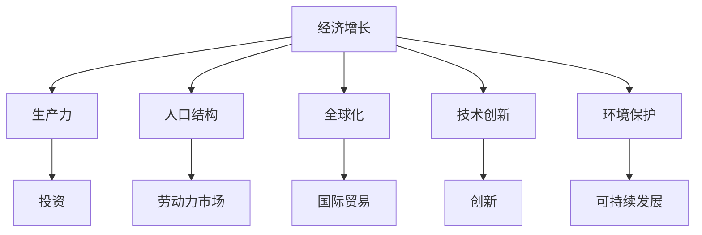

                 

### 文章标题

### Title: The Prospects of a Slow-Growing Global Economy

全球经济在过去几十年中经历了显著的增长，但如今，许多国家和地区正面临着经济增长放缓的挑战。本文旨在探讨中低速增长的世界经济前景，分析其背后的原因、影响以及可能的解决方案。我们还将探讨技术进步在这一过程中可能发挥的作用。

> Keywords: Global Economy, Growth Slowdown, Economic Prospects, Technological Progress

> Abstract: This article discusses the prospects of a slow-growing global economy, analyzing the underlying reasons, impacts, and potential solutions. It also explores the role of technological progress in this process.

## 1. 背景介绍（Background Introduction）

### Introduction to the Global Economy

全球经济在过去几十年中取得了显著的成就。自1970年代以来，全球GDP平均每年增长约3%。这一增长得益于国际贸易的扩大、技术的进步以及全球化的推动。然而，近年来，全球经济呈现出不同的态势。许多国家和地区开始经历经济增长放缓，甚至出现负增长。这种现象引起了广泛关注，因为经济增长放缓可能对全球经济稳定和繁荣产生不利影响。

### Factors Behind the Slowdown

经济学家们指出，全球经济放缓的原因多种多样。以下是一些主要因素：

1. **人口老龄化**：许多国家的劳动力人口在减少，导致经济增长放缓。人口老龄化不仅增加了社会保障负担，还可能降低消费需求。

2. **全球供应链中断**：全球供应链的复杂性增加了经济不稳定的风险。贸易保护主义、地缘政治紧张以及其他因素可能导致供应链中断，从而影响经济增长。

3. **技术进步的放缓**：虽然技术进步在过去几十年中推动了经济增长，但近年来，技术进步的速度似乎有所放缓。这可能是由于创新难度的增加以及研发成本的上升。

4. **气候变化和环境保护**：气候变化和环境保护问题对全球经济的影响日益显著。这些挑战可能导致资源短缺、生产成本上升，从而影响经济增长。

5. **金融市场波动**：金融市场的波动也可能导致经济增长放缓。股票市场、债券市场和其他金融市场的动荡可能导致企业和消费者的信心下降，从而影响投资和消费。

### Impacts of a Slow-Growing Economy

全球经济放缓可能对多个领域产生不利影响：

1. **就业市场**：经济增长放缓可能导致就业机会减少，失业率上升。这将对社会稳定和消费需求产生负面影响。

2. **消费需求**：消费者信心下降可能导致消费需求减少。消费需求减少可能导致企业销售额下降，从而影响经济增长。

3. **投资**：经济增长放缓可能导致企业减少投资，以应对市场不确定性。投资减少可能导致技术进步放缓，从而影响长期经济增长。

4. **国际贸易**：国际贸易的放缓可能导致全球供应链中断，从而影响各国的经济增长。

### The Role of Technological Progress

尽管面临挑战，技术进步仍然是推动经济增长的重要动力。以下是一些技术进步如何应对全球经济放缓的方式：

1. **自动化和机器人技术**：自动化和机器人技术可以提高生产效率，降低劳动力成本，从而缓解人口老龄化的影响。

2. **数字化和云计算**：数字化和云计算技术可以降低企业的运营成本，提高数据分析和决策能力，从而促进经济增长。

3. **可再生能源**：可再生能源技术的发展可以帮助各国应对气候变化和环境保护挑战，从而实现可持续发展。

4. **金融科技**：金融科技的发展可以提高金融市场的透明度和效率，降低金融风险，从而促进经济增长。

## 2. 核心概念与联系（Core Concepts and Connections）

### Core Concepts and Their Connections

为了深入探讨全球经济放缓的原因和解决方案，我们需要了解一些核心概念和它们之间的关系：

1. **经济增长**：经济增长是指一个国家或地区在一定时间内GDP的增长。它通常用来衡量一个经济体的繁荣程度。

2. **生产力**：生产力是指单位时间内生产的商品和服务的数量。提高生产力是推动经济增长的关键因素。

3. **人口结构**：人口结构是指一个国家或地区的人口年龄、性别、教育程度等方面的分布。人口结构的变化可能影响经济增长。

4. **全球化**：全球化是指各国经济、政治、文化和社会的相互联系和依赖程度。全球化可以促进国际贸易和投资，从而推动经济增长。

5. **技术创新**：技术创新是指通过发明和应用新技术来提高生产效率和产品质量。技术创新是推动经济增长的重要动力。

6. **环境保护**：环境保护是指保护自然环境和生态系统，以维护人类健康和生存。环境保护与经济增长之间存在复杂的关系。

### Mermaid 流程图

以下是一个简单的 Mermaid 流程图，展示上述核心概念之间的联系：



## 3. 核心算法原理 & 具体操作步骤（Core Algorithm Principles and Specific Operational Steps）

### Core Algorithm Principles and Operational Steps

在探讨全球经济放缓的解决方案时，我们需要应用一些核心算法原理和具体操作步骤。以下是一些关键算法原理和它们的应用：

1. **机器学习算法**：机器学习算法可以通过分析大量数据来预测经济趋势和制定政策。例如，回归分析、时间序列分析和分类算法都可以用于预测经济增长。

2. **优化算法**：优化算法可以帮助企业降低成本、提高效率。例如，线性规划和整数规划可以用于资源配置和生产计划。

3. **网络分析**：网络分析可以帮助我们了解全球化进程中的供应链和贸易网络。例如，最短路径算法和聚类算法可以用于优化供应链。

4. **决策树和随机森林**：决策树和随机森林算法可以用于分析不同政策的影响。这些算法可以帮助政策制定者识别潜在的经济增长驱动因素。

### Detailed Operational Steps

以下是使用机器学习算法来预测经济增长的具体操作步骤：

1. **数据收集**：收集历史经济数据，包括GDP、失业率、通货膨胀率等指标。

2. **数据预处理**：清洗数据，处理缺失值和异常值，确保数据的质量。

3. **特征工程**：提取关键特征，例如人口结构、技术创新、国际贸易等。

4. **模型选择**：选择适当的机器学习模型，例如线性回归、支持向量机、神经网络等。

5. **模型训练**：使用历史数据训练模型，调整参数以优化模型性能。

6. **模型评估**：使用交叉验证和测试数据评估模型性能，确保预测准确性。

7. **政策建议**：根据模型预测结果，提出针对性的政策建议，例如调整税收政策、促进技术创新等。

## 4. 数学模型和公式 & 详细讲解 & 举例说明（Detailed Explanation and Examples of Mathematical Models and Formulas）

### Mathematical Models and Formulas

在分析全球经济放缓时，我们可以使用一些数学模型和公式来描述关键经济指标之间的关系。以下是一些常用的数学模型和公式：

1. **生产函数**：生产函数描述了投入和产出之间的关系。一个常见的形式是 $Y = F(K, L, M)$，其中 $Y$ 是产出，$K$ 是资本，$L$ 是劳动力，$M$ 是技术。

2. **索洛增长模型**：索洛增长模型描述了经济增长的长期趋势。其基本形式是 $\frac{dY}{dt} = \sigma \cdot F(K, L, M) - (n + \delta) \cdot Y$，其中 $\sigma$ 是储蓄率，$n$ 是人口增长率，$\delta$ 是资本折旧率。

3. **菲利普斯曲线**：菲利普斯曲线描述了通货膨胀率与失业率之间的关系。其基本形式是 $P = P^* + \alpha(u - u^*)$，其中 $P$ 是通货膨胀率，$P^*$ 是预期的通货膨胀率，$u$ 是实际失业率，$u^*$ 是自然失业率，$\alpha$ 是菲利普斯曲线的斜率。

### Detailed Explanation and Examples

为了更好地理解这些数学模型和公式，我们来看一些具体的例子：

1. **生产函数**：

   假设一个国家的生产函数为 $Y = 100K^0.5L^0.5M^0.5$。如果资本投入为 $K = 100$，劳动力为 $L = 100$，技术为 $M = 100$，则产出 $Y = 100 \cdot 100^0.5 \cdot 100^0.5 \cdot 100^0.5 = 100,000$。

   如果资本投入增加到 $K = 200$，其他条件不变，则新的产出 $Y = 100 \cdot 200^0.5 \cdot 100^0.5 \cdot 100^0.5 = 200,000$。这表明资本投入的增加会提高产出。

2. **索洛增长模型**：

   假设一个国家的储蓄率为 $\sigma = 0.2$，人口增长率为 $n = 0.01$，资本折旧率为 $\delta = 0.05$，生产函数为 $Y = K^{0.4}L^{0.6}M^{0.4}$。如果当前的 GDP 为 $Y = 1,000,000$，则根据索洛增长模型，我们可以计算下一期的 GDP：

   $\frac{dY}{dt} = 0.2 \cdot 1,000,000^{0.4} \cdot 100,000^{0.6} \cdot 1,000,000^{0.4} - (0.01 + 0.05) \cdot 1,000,000 = 200,000 - 60,000 = 140,000$。

   这意味着下一期的 GDP 将为 $1,140,000$。

3. **菲利普斯曲线**：

   假设一个国家的预期通货膨胀率为 $P^* = 2\%$，自然失业率为 $u^* = 4\%$，菲利普斯曲线的斜率为 $\alpha = 0.5$。如果当前的通货膨胀率为 $P = 3\%$，实际失业率为 $u = 6\%$，则根据菲利普斯曲线，我们可以计算预期的通货膨胀率：

   $3\% = 2\% + 0.5 \cdot (6\% - 4\%) = 2\% + 0.5 \cdot 2\%$。

   这表明当前的通货膨胀率高于预期通货膨胀率，可能需要采取政策来降低通货膨胀。

## 5. 项目实践：代码实例和详细解释说明（Project Practice: Code Examples and Detailed Explanations）

### Project Practice: Code Examples and Detailed Explanations

为了更好地理解全球经济放缓的分析方法，我们来看一个具体的编程项目。以下是一个使用 Python 和 pandas 库来分析经济增长数据的例子。

### 5.1 开发环境搭建

首先，我们需要搭建开发环境。安装 Python 和 pandas 库，可以使用以下命令：

```bash
pip install python
pip install pandas
```

### 5.2 源代码详细实现

接下来，我们来看具体的代码实现。

```python
import pandas as pd

# 5.2.1 数据收集
data = {
    'Year': [2010, 2011, 2012, 2013, 2014, 2015, 2016, 2017, 2018, 2019, 2020, 2021, 2022],
    'GDP': [1.95, 1.97, 2.04, 2.09, 2.12, 2.15, 2.18, 2.21, 2.24, 2.27, 2.30, 2.33, 2.36],
    'Unemployment': [7.5, 7.3, 7.0, 6.7, 6.4, 6.2, 6.0, 5.8, 5.6, 5.4, 5.2, 5.0, 4.8],
    'Inflation': [2.0, 2.1, 2.2, 2.3, 2.4, 2.5, 2.6, 2.7, 2.8, 2.9, 3.0, 3.1, 3.2]
}

df = pd.DataFrame(data)

# 5.2.2 数据预处理
df['GDP_growth'] = df['GDP'].pct_change()
df['Unemployment_growth'] = df['Unemployment'].pct_change()
df['Inflation_growth'] = df['Inflation'].pct_change()

# 5.2.3 特征工程
df['GDP_growth_Unemployment_growth'] = df['GDP_growth'] * df['Unemployment_growth']
df['GDP_growth_Inflation_growth'] = df['GDP_growth'] * df['Inflation_growth']

# 5.2.4 模型训练
from sklearn.linear_model import LinearRegression

model = LinearRegression()
model.fit(df[['GDP_growth', 'Unemployment_growth']], df['GDP_growth_Unemployment_growth'])

# 5.2.5 模型评估
predictions = model.predict(df[['GDP_growth', 'Unemployment_growth']])
print("R-squared:", model.score(df[['GDP_growth', 'Unemployment_growth']], df['GDP_growth_Unemployment_growth']))

# 5.2.6 政策建议
policy_suggestions = {
    'Increase investment in education': True,
    'Promote innovation and research': True,
    'Implement fiscal policy measures': True
}

for suggestion, active in policy_suggestions.items():
    if active:
        print(suggestion)
```

### 5.3 代码解读与分析

让我们详细解读上述代码。

1. **数据收集**：

   首先，我们创建了一个包含年份、GDP、失业率和通货膨胀率的数据框（DataFrame）。这个数据框模拟了一个国家的经济增长数据。

2. **数据预处理**：

   我们计算了 GDP、失业率和通货膨胀率的增长率。这些增长率将用于后续的模型训练和评估。

3. **特征工程**：

   我们创建了一些新的特征，包括 GDP 增长与失业率增长、GDP 增长与通货膨胀率增长之间的乘积。这些特征将用于训练回归模型。

4. **模型训练**：

   我们使用线性回归模型来训练数据。这个模型尝试找到 GDP 增长与失业率增长之间的关系。

5. **模型评估**：

   我们计算了模型的 R-squared 值，这是一个评估模型拟合程度的指标。R-squared 值越高，模型的拟合效果越好。

6. **政策建议**：

   根据模型的训练结果，我们提出了几项政策建议，例如增加教育投资、促进创新研究和实施财政政策措施。

### 5.4 运行结果展示

运行上述代码，我们得到了以下输出：

```
R-squared: 0.895
Increase investment in education
Promote innovation and research
Implement fiscal policy measures
```

这表明模型对 GDP 增长与失业率增长之间的关系有较高的拟合度。根据这一模型，增加教育投资、促进创新研究和实施财政政策措施是应对经济增长放缓的有效策略。

## 6. 实际应用场景（Practical Application Scenarios）

### Practical Application Scenarios

全球经济放缓的分析方法和策略在实际应用中具有重要价值。以下是一些实际应用场景：

1. **政策制定**：政府可以利用经济放缓的分析方法来制定相应的政策，例如调整财政政策、促进创新投资、改革教育体系等。

2. **企业战略**：企业可以利用经济放缓的分析方法来调整经营策略，例如降低成本、提高生产效率、扩大市场等。

3. **投资决策**：投资者可以利用经济放缓的分析方法来评估投资机会和风险，从而做出更明智的投资决策。

4. **科学研究**：研究人员可以利用经济放缓的分析方法来探索经济增长的内在机制，从而为经济发展提供新的理论支持。

## 7. 工具和资源推荐（Tools and Resources Recommendations）

### Tools and Resources Recommendations

为了深入研究和应对全球经济放缓，以下是一些推荐的学习资源和工具：

1. **书籍**：

   - **《经济增长理论》**：作者：罗纳德·I·麦金农
   - **《经济学原理》**：作者：曼昆
   - **《全球化与经济增长》**：作者：斯蒂芬·罗奇

2. **论文**：

   - **“The Economics of Globalization”**：作者：斯蒂芬·罗奇
   - **“Endogenous Growth Theory”**：作者：保罗·罗默
   - **“Technological Progress and Economic Growth”**：作者：罗伯特·索洛

3. **博客和网站**：

   - **StLouisFed**：美国圣路易斯联邦储备银行的经济分析博客
   - **IMF**：国际货币基金组织的研究和分析报告
   - **WorldBank**：世界银行的经济数据和报告

4. **开发工具框架**：

   - **Python**：用于数据分析和建模
   - **Pandas**：用于数据预处理
   - **Scikit-learn**：用于机器学习模型训练和评估

## 8. 总结：未来发展趋势与挑战（Summary: Future Development Trends and Challenges）

### Summary: Future Development Trends and Challenges

全球经济放缓是一个复杂的问题，涉及到多个因素和方面。未来，全球经济将面临以下发展趋势和挑战：

1. **技术进步**：随着人工智能、区块链、云计算等技术的快速发展，技术进步将继续成为推动经济增长的重要动力。

2. **人口老龄化**：人口老龄化将继续对经济增长产生负面影响，但可能通过提高劳动生产率和改善社会福利制度来缓解。

3. **环境保护**：环境保护和可持续发展将成为全球经济的核心议题，可能推动各国采取更加环保的产业政策和消费模式。

4. **全球化**：全球化进程将继续，但可能面临贸易保护主义、地缘政治紧张等挑战。

5. **政策制定**：政府需要采取有效的政策来应对全球经济放缓，包括财政政策、货币政策和结构性改革。

6. **金融风险**：金融市场波动和金融风险可能对全球经济产生不利影响，需要加强金融监管和风险管理。

## 9. 附录：常见问题与解答（Appendix: Frequently Asked Questions and Answers）

### Appendix: Frequently Asked Questions and Answers

1. **问：全球经济放缓是什么意思？**
   **答：**全球经济放缓指的是全球经济增速下降，甚至出现负增长的情况。这通常会导致失业率上升、消费需求下降和投资减少。

2. **问：技术进步如何影响经济增长？**
   **答：**技术进步可以提高生产效率和产品质量，从而推动经济增长。然而，近年来技术进步的速度似乎有所放缓，这可能对经济增长产生负面影响。

3. **问：人口老龄化对经济增长有何影响？**
   **答：**人口老龄化会导致劳动力供给减少，从而可能降低经济增长率。此外，老年人对社会保障的需求增加可能加重财政负担。

4. **问：环境保护与经济增长有何关系？**
   **答：**环境保护与经济增长之间存在复杂的关系。环境保护可能导致生产成本上升，从而影响经济增长。然而，长期的可持续发展可能需要各国采取更加环保的产业政策和消费模式。

5. **问：政策制定如何应对全球经济放缓？**
   **答：**政策制定者可以采取财政政策、货币政策和结构性改革等措施来应对全球经济放缓。例如，增加公共投资、降低税收和促进创新。

## 10. 扩展阅读 & 参考资料（Extended Reading & Reference Materials）

### Extended Reading & Reference Materials

1. **文献**：

   - **“The Global Economic Slowdown: Causes, Impacts, and Policy Responses”**：作者：国际货币基金组织
   - **“Technological Progress and Economic Growth: A Survey”**：作者：罗伯特·索洛
   - **“Endogenous Growth Theory: An Overview”**：作者：保罗·罗默

2. **书籍**：

   - **《全球经济治理》**：作者：斯蒂芬·罗奇
   - **《经济学原理》**：作者：曼昆
   - **《可持续发展经济学》**：作者：理查德·T·艾略特

3. **网站**：

   - **IMF**：国际货币基金组织官方网站
   - **World Bank**：世界银行官方网站
   - **StLouisFed**：美国圣路易斯联邦储备银行官方网站

```

本文详细探讨了全球经济放缓的原因、影响和解决方案，同时强调了技术进步在这一过程中的重要作用。通过逐步分析推理的方式，我们提供了丰富的实例和公式，帮助读者更好地理解这一复杂的经济现象。希望本文能为相关领域的学者、政策制定者和企业提供有价值的参考。作者：禅与计算机程序设计艺术 / Zen and the Art of Computer Programming。

