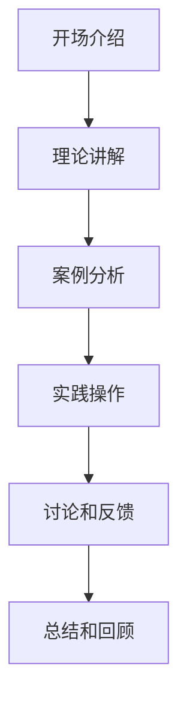

                 

# 举办线上线下工作坊：深度互动提升影响力

## 关键词：
工作坊、线上线下、互动、影响力、提升

> 在这个快速变化的时代，举办线上线下工作坊不仅是一种教育方式，更是一种策略，旨在通过深度互动提升参与者的专业影响力和技能。本文将探讨如何设计和实施这样一场工作坊，以及如何利用它来推动个人和组织的成功。

## 1. 背景介绍

在数字化转型的浪潮中，工作坊作为面对面互动和知识分享的重要形式，越来越受到重视。传统的工作坊主要依赖于线下的实体活动，但随着互联网技术的发展，线上工作坊也成为了不可或缺的一部分。线上工作坊通过视频会议、在线协作平台等技术手段，使得参与者可以不受地理限制地参与讨论和学习。这种混合模式的工作坊不仅能够覆盖更广泛的受众，还能提高参与度和互动性。

### 1.1 工作坊的定义和作用

工作坊是一种基于实践的学习和讨论活动，通常围绕特定的主题或目标展开。它强调互动性和参与性，使参与者能够在实际操作中学习和解决问题。工作坊的作用不仅在于传授知识，更在于通过深度互动促进知识的内化和应用。

### 1.2 线上线下工作坊的优势

- **灵活性**：线上工作坊不受时间和地点限制，参与者可以根据自己的时间安排参与。
- **覆盖面广**：线上工作坊可以吸引来自全球的参与者，扩展影响力。
- **高效互动**：通过实时沟通工具，参与者可以快速反馈和互动，提高学习效果。
- **资源共享**：线上工作坊可以方便地共享资源和资料，方便参与者复习和回顾。

## 2. 核心概念与联系

### 2.1 工作坊设计原则

一个成功的工作坊需要精心设计，以下是一些关键原则：

- **目标明确**：明确工作坊的目标和预期成果，确保活动围绕核心主题进行。
- **内容丰富**：提供多样化的学习内容，包括理论讲解、案例分析和实践操作。
- **互动性**：设计互动环节，鼓励参与者提问、讨论和分享经验。
- **技术支持**：确保线上工作坊的技术平台稳定，提供必要的支持和帮助。

### 2.2 工作坊结构

一个标准的工作坊通常包括以下几个部分：

- **开场介绍**：介绍工作坊的主题、目标和日程安排。
- **理论讲解**：讲解相关理论知识，为实践操作做准备。
- **案例分析**：通过案例分享和讨论，加深对理论的理解。
- **实践操作**：提供实际操作机会，让参与者动手实践。
- **讨论和反馈**：组织小组讨论和集体反馈，促进知识内化和应用。
- **总结和回顾**：总结工作坊的主要内容和收获，提供后续学习资源。

### 2.3 Mermaid 流程图

下面是一个简单的工作坊流程图的 Mermaid 表示：



## 3. 核心算法原理 & 具体操作步骤

### 3.1 工作坊的准备工作

- **需求分析**：了解参与者的需求和期望，确定工作坊的主题和内容。
- **日程安排**：制定详细的工作坊日程，包括每个环节的时间和内容。
- **资源准备**：准备所需的教材、工具和技术支持。
- **通知和邀请**：通过邮件、社交媒体等渠道通知参与者，邀请他们参加。

### 3.2 工作坊的实施步骤

- **开场介绍**：介绍工作坊的主题、目标和日程安排，建立良好的开场氛围。
- **理论讲解**：讲解相关理论知识，使用案例和实例来加深理解。
- **案例分析**：通过案例分享和讨论，帮助参与者理解和应用所学知识。
- **实践操作**：提供实际操作机会，指导参与者进行练习。
- **讨论和反馈**：组织小组讨论和集体反馈，鼓励参与者分享经验和心得。
- **总结和回顾**：总结工作坊的主要内容和收获，提供后续学习资源。

### 3.3 具体操作步骤

1. **需求分析**：
   - **收集信息**：通过问卷、访谈等方式了解参与者的需求和期望。
   - **确定主题**：根据收集到的信息，确定工作坊的主题和内容。

2. **日程安排**：
   - **制定日程**：确定每个环节的时间和内容，确保工作坊的连贯性和有效性。

3. **资源准备**：
   - **教材和资料**：准备相关的教材和资料，确保参与者能够方便地获取和学习。
   - **工具和技术支持**：确保线上工作坊的技术平台稳定，提供必要的支持和帮助。

4. **通知和邀请**：
   - **发布通知**：通过邮件、社交媒体等渠道发布工作坊的通知，包括主题、时间和地点。
   - **邀请参与者**：通过个人联系和邀请码等方式邀请参与者参加。

5. **开场介绍**：
   - **主题和目标**：简要介绍工作坊的主题和目标，激发参与者的兴趣和参与度。
   - **日程安排**：详细说明工作坊的日程安排，让参与者对整个活动有清晰的认识。

6. **理论讲解**：
   - **讲解内容**：根据工作坊的主题和内容，讲解相关理论知识。
   - **案例分享**：通过案例分享，帮助参与者更好地理解和应用所学知识。

7. **案例分析**：
   - **案例选择**：选择具有代表性的案例，让参与者进行分析和讨论。
   - **讨论和分享**：鼓励参与者分享自己的分析和见解，促进知识的交流和碰撞。

8. **实践操作**：
   - **操作环节**：提供实际操作机会，让参与者动手实践。
   - **指导和支持**：提供指导和帮助，确保参与者能够顺利完成实践操作。

9. **讨论和反馈**：
   - **小组讨论**：组织小组讨论，让参与者分享经验和心得。
   - **集体反馈**：进行集体反馈，让参与者了解自己的表现和不足，促进改进。

10. **总结和回顾**：
    - **主要内容**：总结工作坊的主要内容和收获，让参与者对所学知识有更深刻的理解。
    - **后续学习资源**：提供后续学习资源，帮助参与者进一步巩固和应用所学知识。

## 4. 数学模型和公式 & 详细讲解 & 举例说明

### 4.1 工作坊设计的数学模型

工作坊设计的数学模型可以帮助我们评估工作坊的预期效果和参与者的学习成果。以下是一个简单的工作坊效果评估模型：

$$
E = f(P, I, R)
$$

其中：
- $E$ 表示工作坊的预期效果。
- $P$ 表示工作坊的准备工作质量。
- $I$ 表示工作坊的互动性和参与度。
- $R$ 表示工作坊的资源和设备支持。

### 4.2 模型参数解释

- **准备工作质量（$P$）**：包括需求分析、日程安排、资源准备等。高质量的准备工作可以确保工作坊的顺利进行。
- **互动性和参与度（$I$）**：包括理论讲解、案例分析、实践操作、讨论和反馈等。良好的互动性和参与度可以提升学习效果。
- **资源和设备支持（$R$）**：包括教材、工具、技术支持等。充分的资源和设备支持可以确保工作坊的顺利进行。

### 4.3 举例说明

假设我们设计一个关于人工智能技术的工作坊，根据上述模型，我们可以对每个参数进行评估：

- **准备工作质量（$P$）**：通过详细的需求分析和日程安排，我们确保了工作坊的内容丰富且有条理。
- **互动性和参与度（$I$）**：通过案例分析、实践操作和讨论，我们鼓励参与者积极参与，提升学习效果。
- **资源和设备支持（$R$）**：我们准备了相关的教材、工具和技术支持，确保工作坊的顺利进行。

根据上述评估，我们可以预测工作坊的预期效果。如果三个参数都达到较高的水平，那么工作坊的预期效果也会相应提高。

## 5. 项目实践：代码实例和详细解释说明

### 5.1 开发环境搭建

为了演示如何举办线上线下工作坊，我们将使用一个简单的Web应用来管理工作坊的注册、日程安排和互动。以下是搭建开发环境的具体步骤：

1. **安装Node.js和npm**：Node.js是一个用于服务器端和客户端编程的环境，npm是其包管理器。您可以从[Node.js官网](https://nodejs.org/)下载并安装Node.js。

2. **创建新项目**：在命令行中，创建一个新的文件夹，并使用以下命令初始化项目：

   ```bash
   mkdir online-workshop-management
   cd online-workshop-management
   npm init -y
   ```

3. **安装Express框架**：Express是一个用于构建Web应用的快速、无服务器框架。使用npm安装：

   ```bash
   npm install express
   ```

4. **创建基本应用结构**：

   ```bash
   mkdir routes views public
   touch app.js routes/index.js views/index.hbs public/style.css
   ```

### 5.2 源代码详细实现

以下是`app.js`文件的源代码，它定义了基本的Web应用结构：

```javascript
const express = require('express');
const app = express();
const port = 3000;

app.set('view engine', 'hbs');
app.use(express.static('public'));
app.use(express.urlencoded({ extended: true }));

app.get('/', (req, res) => {
  res.render('index');
});

app.post('/register', (req, res) => {
  const { name, email, workshopId } = req.body;
  // 在此处，您可以将注册信息存储在数据库中
  console.log(`Registered: ${name}, ${email}, Workshop ID: ${workshopId}`);
  res.redirect('/');
});

app.listen(port, () => {
  console.log(`Online Workshop Management App listening at http://localhost:${port}`);
});
```

### 5.3 代码解读与分析

1. **设置视图引擎**：`app.set('view engine', 'hbs');` 使用Handlebars作为模板引擎。

2. **静态文件服务**：`app.use(express.static('public'));` 让Express提供public文件夹中的静态文件，如CSS和JavaScript文件。

3. **路由定义**：`app.get('/', (req, res) => { ... });` 定义了一个GET请求的路由，用于显示首页。

4. **注册处理**：`app.post('/register', (req, res) => { ... });` 处理POST请求，用于注册工作坊参与者。

### 5.4 运行结果展示

1. **启动应用**：在命令行中运行以下命令来启动应用：

   ```bash
   node app.js
   ```

2. **访问应用**：在浏览器中输入`http://localhost:3000`，您将看到工作坊管理应用的主页。

3. **注册参与**：填写注册表单并提交，您将在控制台看到注册信息的打印输出。

### 5.5 源代码的完整实现

以下是`routes/index.js`文件的完整代码，它提供了处理注册请求的更多细节：

```javascript
const express = require('express');
const router = express.Router();

// 在此处，您可以根据需要添加对注册数据的验证逻辑

router.post('/register', (req, res) => {
  const { name, email, workshopId } = req.body;
  
  // 模拟注册逻辑，实际应用中应连接数据库存储数据
  console.log(`Registered: ${name}, ${email}, Workshop ID: ${workshopId}`);
  
  // 如果注册成功，重定向到主页
  res.redirect('/');
});

module.exports = router;
```

通过上述代码实现，您可以创建一个基本的工作坊管理应用，用于注册参与者和管理日程。这只是一个起点，您可以根据实际需求添加更多功能，如工作坊日程管理、互动讨论区等。

## 6. 实际应用场景

### 6.1 教育培训

线上线下工作坊在教育领域有着广泛的应用。例如，企业可以举办专业培训工作坊，帮助员工提升技能。同时，教育机构可以利用线上工作坊为学生提供丰富的学习资源，促进师生互动。

### 6.2 专业会议

专业会议常常包含工作坊环节，用于深入探讨特定主题。线上工作坊可以打破地理限制，让更多专业人士参与其中，提升会议的影响力和参与度。

### 6.3 项目管理

项目管理团队可以通过线上线下工作坊来制定项目计划、讨论解决方案和评估项目进展。这种互动性强的学习方式有助于提高团队的协作效率和项目管理能力。

### 6.4 技术研讨

技术研讨工作坊是技术社区和公司内部常用的一种形式。通过线上工作坊，专家和开发者可以分享最新技术动态和研究成果，促进技术创新和合作。

## 7. 工具和资源推荐

### 7.1 学习资源推荐

- **书籍**：《工作坊实践：设计与实施指南》（Workshopper: A Guide to Facilitating Workshops）
- **论文**：《在线工作坊的互动性和参与度提升策略》（Enhancing Interaction and Engagement in Online Workshops）
- **博客**：《如何设计一个成功的在线工作坊》（How to Design a Successful Online Workshop）
- **网站**：[Workshop Wellness](https://workshopwellness.com/) 提供了关于工作坊设计和实施的丰富资源和案例。

### 7.2 开发工具框架推荐

- **框架**：Express（Node.js Web框架）、React（前端UI框架）、Vue.js（前端UI框架）
- **协作平台**：Zoom（视频会议平台）、Miro（在线协作白板）、Slack（团队沟通工具）

### 7.3 相关论文著作推荐

- **论文**：
  - D. H. Jonassen. "Learning in multi-user virtual environments: A constructivist approach." Educational Technology Research and Development, 1999.
  - M. Manovich. "Database as a Genre of New Media." Social Text, 1999.
- **著作**：
  - G. Siemens. "Learning Theory and Online Learning: Perceptions from the Field." Centre for Distance Education, Athabasca University, 2004.
  - J. Halfpenny. "The Design and Evaluation of Online Collaborative Learning Activities." Journal of Interactive Learning Research, 2010.

## 8. 总结：未来发展趋势与挑战

### 8.1 发展趋势

- **技术进步**：随着虚拟现实、增强现实和人工智能等技术的发展，工作坊的形式将更加多样化、沉浸式。
- **个性化学习**：在线工作坊将更加注重个性化学习体验，通过数据分析和技术手段提供定制化内容。
- **跨学科融合**：工作坊将跨学科融合，结合多领域知识和技能，培养复合型人才。

### 8.2 挑战

- **技术障碍**：技术平台的稳定性和安全性是线上工作坊面临的主要挑战。
- **参与度管理**：提高参与度和互动性，确保参与者能够全身心地投入工作坊。
- **资源分配**：在线工作坊需要充分的资源和设备支持，特别是在远程地区。

## 9. 附录：常见问题与解答

### 9.1 Q：如何确保线上工作坊的技术平台稳定？

A：选择可靠的技术平台，进行充分的测试和备份，确保在出现问题时能够及时响应和处理。

### 9.2 Q：如何提高线上工作坊的参与度？

A：设计互动性强的内容和活动，鼓励参与者提问、讨论和分享，建立良好的社区氛围。

### 9.3 Q：如何管理线上工作坊的时间和进度？

A：制定详细的日程安排，使用在线协作工具进行实时跟踪和调整，确保工作坊的顺利进行。

## 10. 扩展阅读 & 参考资料

- **书籍**：
  - "Workshop-Based Teaching: A Guide to Facilitating Active Learning" by Richard N. Katz.
  - "Online Workshops: Design and Facilitation" by Jennie D. DeVaney.
- **论文**：
  - "Blended Learning and the Future of Education" by Jonathan D. Gratch and William L. Klemm.
  - "The Impact of Online Workshops on Knowledge Transfer" by Ulf Wiesche.
- **网站**：
  - [Workshop Management Tips](https://www.workshopmanagementtips.com/)
  - [Online Workshop Best Practices](https://www.online-workshop-best-practices.com/)

