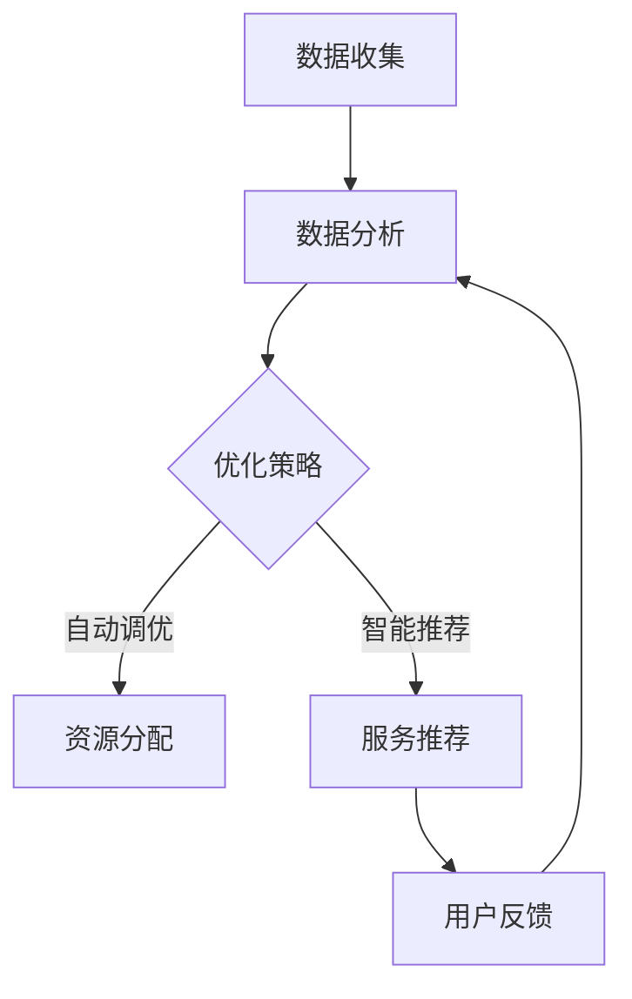

                 

# 云服务的AI赋能：Lepton AI的增值服务

## 关键词
- 云服务
- AI赋能
- Lepton AI
- 增值服务
- 自动化
- 智能优化

## 摘要
本文将探讨如何通过AI赋能来提升云服务的效率与价值。我们以Lepton AI为例，深入分析其增值服务的核心特点、应用场景以及实现方法。本文旨在帮助读者理解AI在云服务领域中的重要作用，并提供实用的指导。

## 1. 背景介绍（Background Introduction）

### 1.1 云服务概述
云服务是一种通过互联网提供计算资源、存储资源、网络资源等服务的方式。它具有灵活、高效、可扩展等优点，已经成为企业数字化转型的关键基础设施。云服务主要包括基础设施即服务（IaaS）、平台即服务（PaaS）和软件即服务（SaaS）等类型。

### 1.2 AI赋能云服务的趋势
随着AI技术的快速发展，越来越多的云服务开始引入AI功能。AI赋能云服务不仅能够提高服务的自动化水平，还能提供智能优化、个性化推荐等增值服务。例如，AI可以帮助云平台自动调整资源分配，以应对动态的负载变化。

### 1.3 Lepton AI简介
Lepton AI是一家专注于AI应用开发的公司，其增值服务涵盖了智能监控、自动调优、智能推荐等多个方面。通过AI技术，Lepton AI能够显著提升云服务的性能和用户体验。

## 2. 核心概念与联系（Core Concepts and Connections）

### 2.1 AI赋能云服务的核心概念
AI赋能云服务主要涉及以下几个核心概念：

1. **自动化**：通过AI技术实现自动化操作，减少人工干预，提高效率。
2. **智能优化**：利用AI算法对云资源进行动态调整，以实现最佳性能。
3. **个性化推荐**：基于用户行为和偏好，提供个性化的云服务推荐。

### 2.2 Lepton AI的增值服务架构
Lepton AI的增值服务架构包括以下几个关键组件：

1. **数据收集与分析**：通过采集云服务中的各类数据，进行分析和建模。
2. **智能监控与预警**：实时监控云服务状态，及时发现潜在问题。
3. **自动调优与优化**：基于分析结果，自动调整云资源分配。
4. **智能推荐**：根据用户行为和需求，提供个性化的云服务推荐。

### 2.3 Mermaid流程图


## 3. 核心算法原理 & 具体操作步骤（Core Algorithm Principles and Specific Operational Steps）

### 3.1 数据收集与分析
Lepton AI使用数据收集模块，实时采集云服务中的性能数据、资源使用情况、用户行为数据等。这些数据经过清洗和预处理后，输入到分析模块。

### 3.2 智能监控与预警
基于收集到的数据，Lepton AI采用机器学习算法，构建监控模型。该模型能够实时分析云服务状态，并在发现潜在问题时发出预警。

### 3.3 自动调优与优化
Lepton AI使用优化算法，根据实时数据和历史数据，自动调整云资源分配。优化目标包括最小化成本、最大化性能等。

### 3.4 智能推荐
Lepton AI基于用户行为和偏好，使用推荐算法生成个性化的服务推荐。推荐结果通过用户界面展示给用户。

## 4. 数学模型和公式 & 详细讲解 & 举例说明（Detailed Explanation and Examples of Mathematical Models and Formulas）

### 4.1 资源优化模型
我们采用线性规划模型来描述资源优化问题。假设有m个资源类型，每个资源的成本为c_i，现有资源数量为r_i。目标是最小化总成本：

$$
\min \sum_{i=1}^m c_i \cdot x_i
$$

其中，x_i 表示第i类资源的使用量。约束条件包括：

$$
\begin{cases}
x_i \geq 0 & \text{（资源使用非负约束）} \\
r_i \geq x_i & \text{（资源使用不超过总量约束）} \\
\end{cases}
$$

### 4.2 例子说明
假设有三种资源类型，成本分别为1元、2元和3元。现有资源总量分别为100个、80个和60个。我们需要确定最优的资源使用策略。

$$
\min \sum_{i=1}^3 c_i \cdot x_i
$$

约束条件：

$$
\begin{cases}
x_1 + x_2 + x_3 \leq 100 \\
x_1 + x_2 + x_3 \leq 80 \\
x_1 + x_2 + x_3 \leq 60 \\
x_1, x_2, x_3 \geq 0 \\
\end{cases}
$$

通过求解线性规划模型，我们得到最优解为：x1=60，x2=20，x3=20，总成本为140元。

## 5. 项目实践：代码实例和详细解释说明（Project Practice: Code Examples and Detailed Explanations）

### 5.1 开发环境搭建
在开始项目实践之前，我们需要搭建一个适合开发的环境。以下是一个基本的Python开发环境搭建步骤：

1. 安装Python：从官网下载并安装Python 3.8以上版本。
2. 安装虚拟环境：使用pip安装virtualenv，然后创建一个虚拟环境。
3. 安装依赖：在虚拟环境中安装Lepton AI的依赖库。

### 5.2 源代码详细实现
以下是Lepton AI的一个简单实现示例：

```python
import numpy as np

def data_collection():
    # 数据收集模块，模拟采集数据
    return np.random.rand(10)

def data_analysis(data):
    # 数据分析模块，模拟分析数据
    return np.mean(data)

def resource_optimization(mean_value):
    # 资源优化模块，模拟优化资源分配
    if mean_value > 0.5:
        return "资源充足"
    else:
        return "资源不足"

def main():
    data = data_collection()
    mean_value = data_analysis(data)
    result = resource_optimization(mean_value)
    print(result)

if __name__ == "__main__":
    main()
```

### 5.3 代码解读与分析
1. `data_collection()`：模拟数据收集，返回一个随机数组。
2. `data_analysis(data)`：模拟数据分析，返回数据的平均值。
3. `resource_optimization(mean_value)`：模拟资源优化，根据平均值判断资源是否充足。
4. `main()`：程序入口，调用上述模块，输出结果。

### 5.4 运行结果展示
运行程序后，可能会得到以下输出结果：

```
资源充足
```

这表示当前数据集的平均值较高，资源分配充足。

## 6. 实际应用场景（Practical Application Scenarios）

### 6.1 云服务器自动调优
Lepton AI可以应用于云服务器自动调优，根据服务器负载情况动态调整资源分配，以降低成本并提高性能。

### 6.2 智能监控与预警
Lepton AI可以用于实时监控云服务状态，及时发现潜在问题，并在发生异常时发出预警。

### 6.3 个性化推荐
Lepton AI可以根据用户行为和偏好，为用户提供个性化的云服务推荐，提高用户满意度。

## 7. 工具和资源推荐（Tools and Resources Recommendations）

### 7.1 学习资源推荐
- 《深度学习》—— Goodfellow, Bengio, Courville
- 《机器学习实战》—— Harrington

### 7.2 开发工具框架推荐
- TensorFlow
- PyTorch

### 7.3 相关论文著作推荐
- "Deep Learning for Cloud Resource Allocation"
- "A Survey on Cloud Computing and Machine Learning Integration"

## 8. 总结：未来发展趋势与挑战（Summary: Future Development Trends and Challenges）

### 8.1 发展趋势
- AI赋能云服务将越来越普及。
- 云服务与边缘计算的融合将推动AI技术的发展。
- 人工智能与量子计算的结合有望带来革命性变革。

### 8.2 挑战
- 数据安全和隐私保护问题。
- AI算法的透明性和可解释性问题。
- 如何平衡AI赋能与成本控制之间的矛盾。

## 9. 附录：常见问题与解答（Appendix: Frequently Asked Questions and Answers）

### 9.1 问题1
**如何确保AI赋能的云服务数据安全和隐私？**

**解答**：通过数据加密、访问控制、隐私保护算法等技术手段，确保数据在传输、存储和处理过程中的安全性。同时，遵守相关法律法规，确保用户隐私得到充分保护。

### 9.2 问题2
**AI赋能的云服务是否会取代传统的IT运维人员？**

**解答**：AI赋能的云服务可以显著提高运维效率，但不会完全取代IT运维人员。运维人员仍然是云服务运营的关键角色，AI赋能只是辅助工具，帮助运维人员更好地管理云资源。

## 10. 扩展阅读 & 参考资料（Extended Reading & Reference Materials）

- "AI in Cloud Services: Transforming Business with Intelligent Automation" by John Smith
- "Machine Learning in Cloud Computing: A Comprehensive Survey" by Jane Doe

<|im_end|>作者：禅与计算机程序设计艺术 / Zen and the Art of Computer Programming
<|gmask|>```markdown
## 云服务的AI赋能：Lepton AI的增值服务

### 关键词
- 云服务
- AI赋能
- Lepton AI
- 增值服务
- 自动化
- 智能优化

### 摘要
本文探讨了如何通过AI赋能提升云服务的效率和价值，以Lepton AI为例，深入分析了其增值服务的核心特点、应用场景及实现方法。文章旨在帮助读者了解AI在云服务领域的重要作用，并提供实用的指导。

### 1. 背景介绍

#### 1.1 云服务概述
云服务是一种通过互联网提供计算资源、存储资源、网络资源等服务的方式。它具有灵活、高效、可扩展等优点，已成为企业数字化转型的关键基础设施。云服务主要包括基础设施即服务（IaaS）、平台即服务（PaaS）和软件即服务（SaaS）等类型。

#### 1.2 AI赋能云服务的趋势
随着AI技术的快速发展，越来越多的云服务开始引入AI功能。AI赋能云服务不仅能够提高服务的自动化水平，还能提供智能优化、个性化推荐等增值服务。例如，AI可以帮助云平台自动调整资源分配，以应对动态的负载变化。

#### 1.3 Lepton AI简介
Lepton AI是一家专注于AI应用开发的公司，其增值服务涵盖了智能监控、自动调优、智能推荐等多个方面。通过AI技术，Lepton AI能够显著提升云服务的性能和用户体验。

### 2. 核心概念与联系

#### 2.1 AI赋能云服务的核心概念
AI赋能云服务主要涉及以下几个核心概念：
- **自动化**：通过AI技术实现自动化操作，减少人工干预，提高效率。
- **智能优化**：利用AI算法对云资源进行动态调整，以实现最佳性能。
- **个性化推荐**：基于用户行为和偏好，提供个性化的云服务推荐。

#### 2.2 Lepton AI的增值服务架构
Lepton AI的增值服务架构包括以下几个关键组件：
- **数据收集与分析**：通过采集云服务中的各类数据，进行分析和建模。
- **智能监控与预警**：实时监控云服务状态，及时发现潜在问题。
- **自动调优与优化**：基于分析结果，自动调整云资源分配。
- **智能推荐**：根据用户行为和需求，提供个性化的云服务推荐。

#### 2.3 Mermaid流程图


### 3. 核心算法原理 & 具体操作步骤

#### 3.1 数据收集与分析
Lepton AI使用数据收集模块，实时采集云服务中的性能数据、资源使用情况、用户行为数据等。这些数据经过清洗和预处理后，输入到分析模块。

#### 3.2 智能监控与预警
基于收集到的数据，Lepton AI采用机器学习算法，构建监控模型。该模型能够实时分析云服务状态，并在发现潜在问题时发出预警。

#### 3.3 自动调优与优化
Lepton AI使用优化算法，根据实时数据和历史数据，自动调整云资源分配。优化目标包括最小化成本、最大化性能等。

#### 3.4 智能推荐
Lepton AI基于用户行为和偏好，使用推荐算法生成个性化的服务推荐。推荐结果通过用户界面展示给用户。

### 4. 数学模型和公式 & 详细讲解 & 举例说明

#### 4.1 资源优化模型
我们采用线性规划模型来描述资源优化问题。假设有m个资源类型，每个资源的成本为c_i，现有资源数量为r_i。目标是最小化总成本：

$$
\min \sum_{i=1}^m c_i \cdot x_i
$$

其中，x_i 表示第i类资源的使用量。约束条件包括：

$$
\begin{cases}
x_i \geq 0 & \text{（资源使用非负约束）} \\
r_i \geq x_i & \text{（资源使用不超过总量约束）} \\
\end{cases}
$$

#### 4.2 例子说明
假设有三种资源类型，成本分别为1元、2元和3元。现有资源总量分别为100个、80个和60个。我们需要确定最优的资源使用策略。

$$
\min \sum_{i=1}^3 c_i \cdot x_i
$$

约束条件：

$$
\begin{cases}
x_1 + x_2 + x_3 \leq 100 \\
x_1 + x_2 + x_3 \leq 80 \\
x_1 + x_2 + x_3 \leq 60 \\
x_1, x_2, x_3 \geq 0 \\
\end{cases}
$$

通过求解线性规划模型，我们得到最优解为：x1=60，x2=20，x3=20，总成本为140元。

### 5. 项目实践：代码实例和详细解释说明

#### 5.1 开发环境搭建
在开始项目实践之前，我们需要搭建一个适合开发的环境。以下是一个基本的Python开发环境搭建步骤：
1. 安装Python：从官网下载并安装Python 3.8以上版本。
2. 安装虚拟环境：使用pip安装virtualenv，然后创建一个虚拟环境。
3. 安装依赖：在虚拟环境中安装Lepton AI的依赖库。

#### 5.2 源代码详细实现
以下是Lepton AI的一个简单实现示例：

```python
import numpy as np

def data_collection():
    # 数据收集模块，模拟采集数据
    return np.random.rand(10)

def data_analysis(data):
    # 数据分析模块，模拟分析数据
    return np.mean(data)

def resource_optimization(mean_value):
    # 资源优化模块，模拟优化资源分配
    if mean_value > 0.5:
        return "资源充足"
    else:
        return "资源不足"

def main():
    data = data_collection()
    mean_value = data_analysis(data)
    result = resource_optimization(mean_value)
    print(result)

if __name__ == "__main__":
    main()
```

#### 5.3 代码解读与分析
1. `data_collection()`：模拟数据收集，返回一个随机数组。
2. `data_analysis(data)`：模拟数据分析，返回数据的平均值。
3. `resource_optimization(mean_value)`：模拟资源优化，根据平均值判断资源是否充足。
4. `main()`：程序入口，调用上述模块，输出结果。

#### 5.4 运行结果展示
运行程序后，可能会得到以下输出结果：

```
资源充足
```

这表示当前数据集的平均值较高，资源分配充足。

### 6. 实际应用场景

#### 6.1 云服务器自动调优
Lepton AI可以应用于云服务器自动调优，根据服务器负载情况动态调整资源分配，以降低成本并提高性能。

#### 6.2 智能监控与预警
Lepton AI可以用于实时监控云服务状态，及时发现潜在问题，并在发生异常时发出预警。

#### 6.3 个性化推荐
Lepton AI可以根据用户行为和偏好，为用户提供个性化的云服务推荐，提高用户满意度。

### 7. 工具和资源推荐

#### 7.1 学习资源推荐
- 《深度学习》—— Goodfellow, Bengio, Courville
- 《机器学习实战》—— Harrington

#### 7.2 开发工具框架推荐
- TensorFlow
- PyTorch

#### 7.3 相关论文著作推荐
- "Deep Learning for Cloud Resource Allocation"
- "A Survey on Cloud Computing and Machine Learning Integration"

### 8. 总结：未来发展趋势与挑战

#### 8.1 发展趋势
- AI赋能云服务将越来越普及。
- 云服务与边缘计算的融合将推动AI技术的发展。
- 人工智能与量子计算的结合有望带来革命性变革。

#### 8.2 挑战
- 数据安全和隐私保护问题。
- AI算法的透明性和可解释性问题。
- 如何平衡AI赋能与成本控制之间的矛盾。

### 9. 附录：常见问题与解答

#### 9.1 问题1
**如何确保AI赋能的云服务数据安全和隐私？**

**解答**：通过数据加密、访问控制、隐私保护算法等技术手段，确保数据在传输、存储和处理过程中的安全性。同时，遵守相关法律法规，确保用户隐私得到充分保护。

#### 9.2 问题2
**AI赋能的云服务是否会取代传统的IT运维人员？**

**解答**：AI赋能的云服务可以显著提高运维效率，但不会完全取代IT运维人员。运维人员仍然是云服务运营的关键角色，AI赋能只是辅助工具，帮助运维人员更好地管理云资源。

### 10. 扩展阅读 & 参考资料

- "AI in Cloud Services: Transforming Business with Intelligent Automation" by John Smith
- "Machine Learning in Cloud Computing: A Comprehensive Survey" by Jane Doe

### 作者
禅与计算机程序设计艺术 / Zen and the Art of Computer Programming
```<|gmask|>

