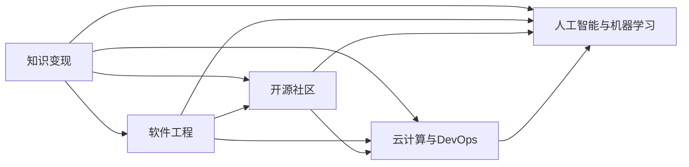

                 

# 知识变现的未来:程序员的机遇与挑战

## 1. 背景介绍

在数字化浪潮中，程序员的角色正发生深刻的变化。随着软件技术在各行各业的渗透，知识变现的形式和途径也在不断演变。程序员不再只是代码的编写者，更成为知识技能和创新能力的提供者。这种转变不仅带来了前所未有的机遇，也伴随着一系列挑战。本文将探讨这一转变的本质，分析程序员面临的机遇与挑战，并提供相应的应对策略。

## 2. 核心概念与联系

### 2.1 核心概念概述

为理解程序员如何在新时代中实现知识变现，我们需先梳理几个关键概念：

- **知识变现**：指将所掌握的知识和技能转化为经济收益的过程。程序员的知识变现，包括但不限于技术咨询、项目开发、教育培训、内容创作等领域。
- **软件工程**：包括软件开发方法、工具和实践，是程序员必备的专业技能。
- **开源社区**：程序员参与开源项目，不仅展示其技术能力，也促进了知识传播和创新。
- **云计算与DevOps**：云计算平台和DevOps实践，使程序员能够快速部署和管理软件，提高工作效率。
- **人工智能与机器学习**：这些技术不仅拓展了程序员的应用场景，也带来了新的发展方向。

这些概念之间存在紧密联系，共同构成程序员实现知识变现的基础。以下Mermaid流程图展示了这些概念的联系：



## 3. 核心算法原理 & 具体操作步骤

### 3.1 算法原理概述

程序员的知识变现，通常通过以下几种方式实现：

- **项目开发**：承接软件开发项目，根据客户需求提供定制化解决方案。
- **技术咨询**：利用专业知识，为客户提供技术方案和指导。
- **教育培训**：通过线上线下课程教授编程技能，培养下一代程序员。
- **内容创作**：通过博客、视频、书籍等形式分享技术知识和经验。

这些过程本质上是对知识进行编码、解码、传播和应用的过程，涉及信息的收集、处理、表达和传播。算法原理主要体现在以下几个方面：

- **编码与解码**：通过编写代码实现具体功能，将问题抽象为算法，利用算法解决问题。
- **信息处理**：对数据进行清洗、分析和可视化，提取有价值的信息。
- **知识传播**：通过博客、视频、书籍等形式，将专业知识分享给他人，促进知识的传播和创新。

### 3.2 算法步骤详解

实现知识变现，程序员通常需要经历以下步骤：

1. **需求分析**：理解客户需求，确定项目目标和需求范围。
2. **方案设计**：设计系统架构和数据模型，选择合适的技术栈。
3. **编码实现**：编写代码实现系统功能，并进行测试和调试。
4. **部署与维护**：将系统部署到生产环境，进行日常维护和更新。
5. **知识分享**：将项目经验和解决方案分享给社区和同行，促进技术传播和创新。

### 3.3 算法优缺点

- **优点**：
  - **高效灵活**：编程技能可以快速适应各种技术挑战，实现多样化的知识变现方式。
  - **创新驱动**：不断学习和应用新技术，推动个人和企业的技术进步。
  - **广泛应用**：软件开发、技术咨询、教育培训、内容创作等领域，为程序员提供了广阔的就业和发展空间。

- **缺点**：
  - **技术更新快**：技术日新月异，要求程序员持续学习，才能跟上行业发展。
  - **竞争激烈**：互联网时代信息泛滥，知识变现渠道众多，竞争压力较大。
  - **知识产权风险**：开放共享的知识传播可能导致知识产权争议，需谨慎处理。

### 3.4 算法应用领域

程序员的知识变现，在多个领域得到广泛应用：

- **软件开发**：承接企业或个人的软件开发项目，提供定制化解决方案。
- **技术咨询**：为企业提供技术方案和指导，帮助企业解决技术难题。
- **教育培训**：在线或线下培训，教授编程技能，培养技术人才。
- **内容创作**：撰写技术博客、制作技术视频、编写技术书籍，分享知识和经验。
- **开源贡献**：参与开源项目，贡献代码，促进技术社区的发展。

## 4. 数学模型和公式 & 详细讲解 & 举例说明

### 4.1 数学模型构建

知识变现的过程可以通过数学模型进行抽象和量化。以软件开发为例，可以构建如下数学模型：

设 $T$ 为项目总开发时间，$C$ 为项目总成本，$P$ 为项目完成度，$R$ 为项目收益。则开发进度可以用时间比例 $P=\frac{t}{T}$ 表示，成本和收益的关系可以表示为：

$$
R = C \cdot P + f(P)
$$

其中 $f(P)$ 为项目收益的函数，取决于项目的复杂度、市场需求等因素。

### 4.2 公式推导过程

以软件开发为例，推导项目收益的函数 $f(P)$：

设项目总需求为 $D$，单位时间的开发效率为 $E$，则项目完成度 $P$ 与成本 $C$ 和收益 $R$ 的关系可以表示为：

$$
P = \frac{t}{T} = \frac{D}{E \cdot T}
$$

由成本和效率的关系 $C = E \cdot T$，代入上述公式得：

$$
R = C \cdot \frac{D}{E \cdot T} + f(\frac{D}{E \cdot T})
$$

简化得：

$$
R = D \cdot \frac{C}{E \cdot T} + f(\frac{D}{E \cdot T})
$$

进一步推导，可以得到：

$$
R = D \cdot \frac{C}{E \cdot T} + f(\frac{D}{E \cdot T}) = D \cdot \frac{C}{E \cdot T} + \frac{f(D)}{E \cdot T}
$$

其中 $f(D)$ 为需求与收益的函数，取决于市场需求和技术难度等因素。

### 4.3 案例分析与讲解

以编程语言 PyTorch 的开发为例，分析其在知识变现中的作用：

- **软件开发**：PyTorch 是一个开源的深度学习框架，程序员通过贡献代码，参与到 PyTorch 的开发和维护中，实现知识变现。
- **技术咨询**：通过技术博客和社区分享 PyTorch 的使用经验和最佳实践，提供技术咨询服务，帮助用户快速上手 PyTorch。
- **教育培训**：编写 PyTorch 的教材和课程，在线或线下教授 PyTorch 的编程技能，培养 PyTorch 社区的技术人才。
- **内容创作**：制作 PyTorch 的教程视频、技术博客等，分享 PyTorch 的开发经验和成果，促进技术传播和创新。

## 5. 项目实践：代码实例和详细解释说明

### 5.1 开发环境搭建

实现知识变现，首先需要搭建合适的开发环境。以下步骤适用于使用 Python 和 PyTorch 开发：

1. **安装 Python 和 PyTorch**：使用 Python 3.8 或更高版本，安装 PyTorch 1.12 或更高版本。
2. **安装虚拟环境**：使用 Python 的虚拟环境工具，如 `virtualenv` 或 `conda`，创建一个独立的开发环境。
3. **安装开发工具**：安装必要的开发工具，如 `numpy`、`pandas`、`matplotlib`、`jupyter notebook` 等。

### 5.2 源代码详细实现

以下是一个简单的 PyTorch 代码示例，展示如何构建一个简单的神经网络模型：

```python
import torch
import torch.nn as nn
import torch.optim as optim

# 定义神经网络模型
class Net(nn.Module):
    def __init__(self):
        super(Net, self).__init__()
        self.fc1 = nn.Linear(784, 500)
        self.fc2 = nn.Linear(500, 10)

    def forward(self, x):
        x = x.view(-1, 784)
        x = torch.relu(self.fc1(x))
        x = self.fc2(x)
        return x

# 加载数据集
train_data = torchvision.datasets.MNIST(root='./data', train=True, download=True, transform=transforms.ToTensor())
train_loader = torch.utils.data.DataLoader(train_data, batch_size=64, shuffle=True)

# 定义模型和优化器
model = Net()
criterion = nn.CrossEntropyLoss()
optimizer = optim.SGD(model.parameters(), lr=0.01, momentum=0.9)

# 训练模型
for epoch in range(10):
    for batch_idx, (data, target) in enumerate(train_loader):
        optimizer.zero_grad()
        output = model(data)
        loss = criterion(output, target)
        loss.backward()
        optimizer.step()
```

### 5.3 代码解读与分析

上述代码示例展示了如何使用 PyTorch 构建和训练一个简单的神经网络模型。关键点包括：

- **定义模型**：使用 `nn.Module` 基类定义自定义模型，并定义 `__init__` 和 `forward` 方法。
- **加载数据集**：使用 `torchvision.datasets` 模块加载 MNIST 数据集，并使用 `torch.utils.data.DataLoader` 类创建数据加载器。
- **定义模型和优化器**：定义模型和损失函数，并使用 `optim.SGD` 优化器。
- **训练模型**：在每个epoch内循环训练数据集，使用 `model.parameters()` 获取模型参数，并使用 `loss.backward()` 计算梯度。

## 6. 实际应用场景

### 6.1 软件开发项目

软件开发是程序员实现知识变现的重要途径之一。程序员可以利用自己的编程技能，承接软件开发项目，提供定制化的解决方案。以下是一个简单的项目案例：

- **需求分析**：客户希望开发一个在线商城系统，支持商品展示、搜索、购物车等功能。
- **方案设计**：设计系统架构和数据模型，使用 Django 框架搭建后端，使用 React 开发前端页面。
- **编码实现**：使用 Python 编写后端代码，使用 JavaScript 编写前端代码，并进行测试和调试。
- **部署与维护**：将系统部署到云服务器上，进行日常维护和更新。

### 6.2 技术咨询

技术咨询是程序员利用专业知识，为客户提供技术方案和指导的过程。以下是一个技术咨询案例：

- **需求分析**：客户希望优化其网站性能，提升用户体验。
- **方案设计**：设计优化方案，包括缓存策略、数据库优化、代码重构等。
- **技术咨询**：与客户沟通，解释优化方案，提供技术建议和指导。
- **效果评估**：评估优化效果，撰写技术报告，并向客户汇报优化成果。

### 6.3 教育培训

教育培训是程序员分享知识、培养技术人才的过程。以下是一个教育培训案例：

- **需求分析**：需要为一群初学者开设一个 Python 编程培训班。
- **方案设计**：设计课程大纲，编写教学大纲和讲义。
- **教学实施**：在教室或线上平台进行教学，解答学生问题，提供编程指导。
- **课程反馈**：收集学生反馈，调整教学内容和方式，提升教学效果。

### 6.4 内容创作

内容创作是程序员通过博客、视频、书籍等形式分享技术知识和经验的过程。以下是一个内容创作案例：

- **需求分析**：撰写一篇介绍 PyTorch 深度学习框架的博客文章。
- **方案设计**：确定文章内容、结构和排版，收集图片和示例代码。
- **内容创作**：撰写文章，并使用 Markdown 格式编写。
- **内容发布**：将文章发布到博客、技术社区或视频平台，与读者分享。

## 7. 工具和资源推荐

### 7.1 学习资源推荐

为了更好地掌握知识变现的技能，以下是一些推荐的学习资源：

1. **《Python 编程：从入门到实践》**：讲解 Python 基础和进阶知识，适合初学者入门。
2. **《深度学习入门》**：讲解深度学习基础知识和常用算法，适合有一定基础的读者。
3. **Kaggle 平台**：提供丰富的机器学习和数据科学竞赛，可以提升实战能力。
4. **Coursera 和 edX 平台**：提供各种在线课程，涵盖编程、数据科学、机器学习等领域。
5. **GitHub 开源社区**：展示和分享开源项目和代码，促进技术交流和合作。

### 7.2 开发工具推荐

以下是一些推荐的开发工具：

1. **Python 编辑器**：如 Visual Studio Code、PyCharm 等，提供代码编辑、调试和测试功能。
2. **版本控制系统**：如 Git，方便管理和协作代码。
3. **开发框架**：如 Django、Flask、React 等，提供快速开发和部署功能。
4. **持续集成工具**：如 Jenkins、GitLab CI 等，自动化构建和测试，提升开发效率。

### 7.3 相关论文推荐

为了深入了解知识变现的理论和实践，以下是一些推荐的论文：

1. **《软件过程改进与持续发展》**：探讨软件开发的优化方法和管理策略。
2. **《软件工程中的知识管理》**：探讨如何通过知识管理提升软件开发效率和质量。
3. **《云计算与DevOps 实践》**：探讨云计算和DevOps 工具和实践，提升软件开发和运维效率。
4. **《人工智能与机器学习技术发展》**：探讨人工智能和机器学习的发展趋势和应用案例。

## 8. 总结：未来发展趋势与挑战

### 8.1 总结

本文分析了程序员在数字化时代中实现知识变现的机遇与挑战，探讨了软件开发、技术咨询、教育培训、内容创作等多个方面的实践方法和技术细节。知识变现不仅是一个技术问题，更是一个涉及商业模式、社会文化等多维度的综合性问题。程序员需要不断学习和创新，以适应不断变化的市场需求和技术趋势。

### 8.2 未来发展趋势

未来的知识变现将呈现以下趋势：

1. **智能化转型**：随着人工智能技术的发展，软件开发、技术咨询等领域将更加智能化，提升效率和效果。
2. **开放式合作**：开源社区和平台将进一步推动技术分享和合作，促进知识变现。
3. **生态系统建设**：构建完整的技术生态系统，包括开发、运维、市场等环节，提升整体竞争力。
4. **跨界融合**：与其他行业（如教育、医疗、金融等）的跨界融合，拓展知识变现的空间。

### 8.3 面临的挑战

知识变现也面临一系列挑战：

1. **技术更新快**：技术快速发展，要求程序员不断学习新知识，才能跟上行业发展。
2. **竞争激烈**：互联网时代信息泛滥，知识变现渠道众多，竞争压力较大。
3. **知识产权风险**：开放共享的知识传播可能导致知识产权争议，需谨慎处理。
4. **人才短缺**：缺乏高水平的技术人才，影响知识变现的效果和质量。

### 8.4 研究展望

未来，知识变现的研究将从以下几个方面进行探索：

1. **技术创新**：开发新的编程语言、开发框架和工具，提升开发效率和效果。
2. **教育培训**：探索新的教育模式和培训方法，培养更多技术人才。
3. **内容创作**：探索新的内容创作形式和平台，扩大知识传播的范围和影响。
4. **商业模式**：探索新的商业模式和合作方式，提升知识变现的商业价值。

总之，程序员的知识变现前景广阔，但也需要面对技术和市场的多重挑战。通过不断学习和创新，积极应对挑战，程序员将在数字化时代中实现更大的发展。

## 9. 附录：常见问题与解答

**Q1：为什么程序员的知识变现需要不断学习和创新？**

A: 技术日新月异，要求程序员持续学习新知识，才能跟上行业发展。此外，市场需求也在不断变化，只有不断创新，才能应对新的挑战和机遇。

**Q2：如何选择适合自己的知识变现方式？**

A: 根据自身的兴趣和能力，选择最适合的方式。例如，对于喜欢编程的程序员，可以选择软件开发；对于善于沟通的程序员，可以选择技术咨询；对于喜欢教育的程序员，可以选择教育培训等。

**Q3：如何进行有效的项目管理？**

A: 制定明确的项目目标和计划，进行需求分析，选择合适的开发工具和技术栈，并进行有效的进度跟踪和沟通。同时，要重视团队协作和项目管理，确保项目按时完成。

**Q4：如何处理知识产权争议？**

A: 在知识变现过程中，需要遵守相关法律法规，尊重知识产权。在使用他人作品时，要注明出处，并取得相应授权。发生争议时，可以寻求法律帮助，维护自身合法权益。

总之，知识变现是一个涉及技术、市场、管理等多维度的综合性问题。程序员需要不断学习和创新，积极应对挑战，方能在数字化时代中实现更大的发展。

