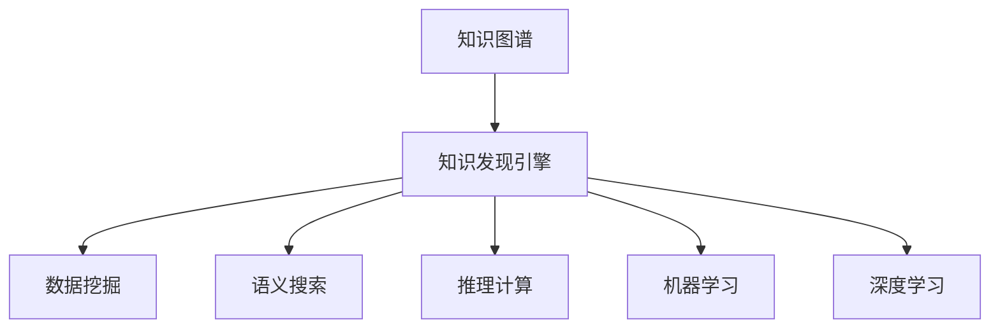

                 

# 知识图谱在知识发现引擎中的应用

> 关键词：知识图谱,知识发现引擎,数据挖掘,语义搜索,推理计算,机器学习,深度学习,数据科学

## 1. 背景介绍

### 1.1 问题由来

在当前信息爆炸的时代，数据的价值日益凸显。然而，数据本身并不能直接转化为知识，需要通过特定的工具和技术手段进行提取、整合和分析。传统的基于规则和模板的数据抽取方法，难以应对大规模、复杂的数据场景，也无法有效利用数据背后的语义关系。知识图谱(Knowledge Graphs)作为一种新兴的数据表示和处理方式，通过将实体、属性、关系等语义信息结构化地存储在图数据库中，使得数据之间的关联更加清晰，更容易进行深入分析和利用。

近年来，随着数据科学和人工智能技术的不断进步，知识图谱在知识发现和数据挖掘领域的应用也取得了显著进展。从搜索引擎、智能推荐到金融风控、医疗诊断等多个领域，知识图谱正逐步成为推动大数据智能化应用的重要手段。本文将系统介绍知识图谱在知识发现引擎中的核心原理、核心算法和实践应用，帮助读者全面理解知识图谱及其在知识发现引擎中的价值和潜力。

## 2. 核心概念与联系

### 2.1 核心概念概述

为更好地理解知识图谱在知识发现引擎中的应用，本节将介绍几个核心概念：

- **知识图谱(Knowledge Graphs)**：一种结构化的语义数据表示方式，由节点和边组成。节点代表实体(Entity)，边代表实体之间的关系(Relationship)，以及实体和关系对应的属性(Attribute)。知识图谱通过RDF (Resource Description Framework)或OWL (Web Ontology Language)等格式进行表示，是语义搜索、推理计算的基础。

- **知识发现引擎(Knowledge Discovery Engine)**：利用数据挖掘、机器学习和深度学习等技术，自动从大量数据中挖掘出有用知识，支持知识图谱构建和应用的系统。知识发现引擎能够自动发现数据中的模式、关系和趋势，为用户提供深度洞察和决策支持。

- **数据挖掘(Data Mining)**：从大量数据中提取有用信息和知识的过程。包括分类、聚类、关联规则学习、序列模式发现等。

- **语义搜索(Semantic Search)**：通过自然语言查询和知识图谱进行语义匹配和关联查询，支持用户获取更深层次的知识和信息。

- **推理计算(Relational Query Processing)**：在知识图谱上进行复杂关系和逻辑推理，得出更准确的结论和预测。

- **机器学习(Machine Learning)**：基于算法和模型，自动从数据中学习规律和模式，实现分类、预测、聚类等功能。

- **深度学习(Deep Learning)**：通过多层次神经网络结构，学习数据中更抽象、更复杂的特征表示，实现更高级别的分析和决策。

这些核心概念之间的逻辑关系可以通过以下Mermaid流程图来展示：



这个流程图展示出知识图谱与知识发现引擎之间的内在联系：

1. 知识图谱通过数据挖掘技术，自动从大量数据中构建。
2. 利用语义搜索和推理计算，支持知识图谱的深度查询和推理。
3. 机器学习和深度学习技术，进一步提升知识发现和推理的准确性。

这些核心概念共同构成了知识图谱在知识发现引擎中的应用框架，使其能够在各类应用场景中发挥重要作用。通过理解这些核心概念，我们可以更好地把握知识图谱的工作原理和优化方向。

## 3. 核心算法原理 & 具体操作步骤
### 3.1 算法原理概述

知识图谱在知识发现引擎中的应用，主要基于以下几个核心算法：

- **数据挖掘算法**：从大规模数据集中挖掘出有价值的模式和关系，构建初步的知识图谱框架。
- **语义匹配算法**：通过自然语言处理技术，将用户查询与知识图谱中的实体和关系进行语义匹配，支持精准的语义搜索。
- **推理计算算法**：在知识图谱中进行复杂关系和逻辑推理，利用规则引擎、模型库等技术，得出更准确的结论和预测。
- **机器学习算法**：基于数据挖掘结果和用户行为数据，训练和优化推理模型，提升推理准确性和泛化能力。
- **深度学习算法**：利用神经网络模型，学习数据中更抽象的特征表示，支持复杂语义关系的发现和推理。

### 3.2 算法步骤详解

基于知识图谱的知识发现引擎，其核心算法步骤如下：

**Step 1: 数据预处理**
- 收集和整合来自不同来源的结构化数据和非结构化数据。
- 清洗和标注数据，去除噪声和冗余，确保数据质量。

**Step 2: 数据挖掘**
- 利用分类、聚类、关联规则学习等算法，从数据中挖掘出有用的模式和关系。
- 构建初步的知识图谱，包含实体、属性和关系等语义信息。

**Step 3: 语义匹配**
- 通过自然语言处理技术，将用户查询转换为知识图谱中实体和关系的描述。
- 在知识图谱中进行语义匹配，找到最相关的实体和关系。

**Step 4: 推理计算**
- 利用规则引擎和模型库，在知识图谱上进行复杂关系和逻辑推理。
- 生成推理结果，支持用户获取更深层次的知识和信息。

**Step 5: 反馈和优化**
- 根据用户反馈和评估指标，调整和优化算法模型。
- 持续改进知识图谱和知识发现引擎，提升其性能和应用效果。

### 3.3 算法优缺点

知识图谱在知识发现引擎中的应用，具有以下优点：
1. 结构化语义表示：知识图谱将实体、属性和关系结构化表示，便于进行深入分析和利用。
2. 精准语义搜索：利用语义匹配技术，支持用户进行精准的知识查询和检索。
3. 复杂推理能力：通过推理计算，支持复杂关系和逻辑推理，得出更准确的结论和预测。
4. 自动化挖掘：利用数据挖掘算法，自动从数据中发现有用模式和关系，提升知识发现效率。
5. 可扩展性强：知识图谱支持动态更新和扩展，能持续改进和丰富知识库。

同时，知识图谱的应用也存在一些局限性：
1. 数据质量和完整性：知识图谱的构建需要高质量、完整的数据，数据缺陷会影响推理结果。
2. 复杂度较高：构建和维护知识图谱的复杂度较高，需要专业知识和技术支持。
3. 计算资源需求：知识图谱的构建和推理计算需要大量计算资源，特别是在大规模应用中。
4. 模型解释性差：知识图谱的推理过程较为复杂，模型的解释性较差，难以进行调试和优化。

尽管存在这些局限性，但就目前而言，知识图谱在知识发现引擎中的应用仍然是十分重要的。未来相关研究的重点在于如何进一步降低知识图谱构建和推理计算的复杂度，提高知识图谱的自动化和智能化水平，同时兼顾可解释性和高效性等因素。

### 3.4 算法应用领域

基于知识图谱的知识发现引擎，已经在多个领域得到了广泛的应用，例如：

- 搜索引擎：利用知识图谱支持精准的语义搜索，提高搜索结果的相关性和满意度。
- 智能推荐系统：根据用户行为数据和知识图谱，生成个性化的推荐结果，提升用户体验。
- 金融风控：利用知识图谱进行风险评估和信用评分，提高金融决策的准确性和可靠性。
- 医疗诊断：基于知识图谱进行疾病诊断和个性化治疗方案推荐，提高医疗服务质量。
- 智能客服：利用知识图谱进行实体识别和关系推理，提供更精准的客户服务。
- 智能助手：基于知识图谱进行自然语言理解和任务处理，支持用户获取知识和服务。

除了上述这些经典应用外，知识图谱还在更多领域得到创新性地应用，如城市规划、环境保护、教育培训等，为各行各业带来变革性影响。随着知识图谱技术的不断进步，相信其在知识发现引擎中的应用将会更加广泛，助力更多领域的智能化转型。

## 4. 数学模型和公式 & 详细讲解  
### 4.1 数学模型构建

本节将使用数学语言对知识图谱在知识发现引擎中的应用进行更加严格的刻画。

记知识图谱中的实体为 $E=\{e_1,e_2,...,e_n\}$，属性为 $A=\{a_1,a_2,...,a_m\}$，关系为 $R=\{r_1,r_2,...,r_k\}$。假设知识图谱包含 $N$ 个节点和 $M$ 条边，表示为 $G=(E,R)$。

定义 $e_i$ 的属性表示为 $e_i=a_{i_1},a_{i_2},...,a_{i_l}$，其中 $a_{i_j} \in A$。假设属性 $a_{i_j}$ 的取值范围为 $[a_{i_j}^{\min},a_{i_j}^{\max}]$，且 $a_{i_j}^{\min}<a_{i_j}^{\max}$。

定义 $r_i$ 的关系表示为 $r_i:E \rightarrow E$，表示 $r_i$ 从节点 $e_i$ 映射到节点 $e_j$。假设 $r_i$ 的关系权重为 $w_{i,j}$，且 $w_{i,j}>0$。

知识图谱中的推理计算，可以通过以下数学模型表示：

$$
P(e_i|e_j)=\frac{P(e_j)}{\Sigma_{k=1}^K P(e_j|e_k)} \cdot P(r_k|e_j,e_i)
$$

其中 $P(e_i|e_j)$ 表示在已知节点 $e_j$ 的情况下，节点 $e_i$ 出现的概率。$P(e_j)$ 表示节点 $e_j$ 的先验概率，$\Sigma_{k=1}^K P(e_j|e_k)$ 表示节点 $e_j$ 的上下文概率，$P(r_k|e_j,e_i)$ 表示节点 $e_i$ 在节点 $e_j$ 的上下文条件下，通过关系 $r_k$ 生成的概率。

### 4.2 公式推导过程

以下我们以路径推理为例，推导路径概率的计算公式。

假设知识图谱中存在三条路径从节点 $e_1$ 到节点 $e_4$：

1. $e_1 \rightarrow e_2 \rightarrow e_3 \rightarrow e_4$
2. $e_1 \rightarrow e_3 \rightarrow e_4$
3. $e_1 \rightarrow e_2 \rightarrow e_4$

则节点 $e_4$ 在节点 $e_1$ 的上下文条件下，通过关系 $r_k$ 生成的概率为：

$$
P(r_k|e_1,e_4) = \frac{P(r_k)}{\Sigma_{k=1}^K P(r_k|e_j)}
$$

其中 $P(r_k)$ 表示关系 $r_k$ 的先验概率，$\Sigma_{k=1}^K P(r_k|e_j)$ 表示所有关系 $r_k$ 在节点 $e_j$ 的上下文条件下的生成概率。

根据路径的定义，路径 $(e_1 \rightarrow e_2 \rightarrow e_3 \rightarrow e_4)$ 的概率为：

$$
P(e_4|e_1) = \frac{P(e_1)}{\Sigma_{j=1}^N P(e_1|e_j)} \cdot P(r_1|e_1,e_2) \cdot P(r_2|e_2,e_3) \cdot P(r_3|e_3,e_4)
$$

类似地，路径 $(e_1 \rightarrow e_3 \rightarrow e_4)$ 和路径 $(e_1 \rightarrow e_2 \rightarrow e_4)$ 的概率分别为：

$$
P(e_4|e_1) = \frac{P(e_1)}{\Sigma_{j=1}^N P(e_1|e_j)} \cdot P(r_2|e_1,e_3) \cdot P(r_3|e_3,e_4)
$$

$$
P(e_4|e_1) = \frac{P(e_1)}{\Sigma_{j=1}^N P(e_1|e_j)} \cdot P(r_1|e_1,e_2) \cdot P(r_3|e_2,e_4)
$$

则节点 $e_4$ 在节点 $e_1$ 的上下文条件下，通过所有路径生成的概率为：

$$
P(e_4|e_1) = \frac{P(e_1)}{\Sigma_{j=1}^N P(e_1|e_j)} \cdot \Sigma_{k=1}^K P(r_k|e_1,e_4)
$$

### 4.3 案例分析与讲解

假设我们在一个医疗知识图谱中，需要推理计算一个患者在某种疾病的风险概率。患者节点为 $e_1$，疾病节点为 $e_4$。假设存在三条路径从患者节点 $e_1$ 到疾病节点 $e_4$，分别表示为 $e_1 \rightarrow e_2 \rightarrow e_3 \rightarrow e_4$，$e_1 \rightarrow e_3 \rightarrow e_4$ 和 $e_1 \rightarrow e_2 \rightarrow e_4$。已知每个路径的关系权重 $w_{i,j}$ 和每个节点 $e_i$ 的先验概率 $P(e_i)$，则可以使用上述公式计算节点 $e_4$ 在节点 $e_1$ 的上下文条件下，通过关系 $r_k$ 生成的概率，从而得出患者在某种疾病的风险概率。

## 5. 项目实践：代码实例和详细解释说明
### 5.1 开发环境搭建

在进行知识图谱项目实践前，我们需要准备好开发环境。以下是使用Python进行OpenCog Toolkit开发的环境配置流程：

1. 安装Anaconda：从官网下载并安装Anaconda，用于创建独立的Python环境。

2. 创建并激活虚拟环境：
```bash
conda create -n cogtoolkit-env python=3.8 
conda activate cogtoolkit-env
```

3. 安装OpenCog Toolkit：
```bash
conda install opencog
```

4. 安装各类工具包：
```bash
pip install numpy pandas scikit-learn matplotlib tqdm jupyter notebook ipython
```

完成上述步骤后，即可在`cogtoolkit-env`环境中开始知识图谱实践。

### 5.2 源代码详细实现

这里我们以构建和查询医疗知识图谱为例，给出使用OpenCog Toolkit进行知识图谱开发的PyTorch代码实现。

首先，定义知识图谱的数据结构和查询函数：

```python
from opencog.tg import LGraph
from opencog.nq import NqCore

class KnowledgeGraph:
    def __init__(self, graph_file):
        self.graph = LGraph.from_file(graph_file)
        
    def query(self, query):
        nq_core = NqCore()
        nq_core.add_graph(self.graph)
        nq_core.prepare()
        result = nq_core.query(query)
        return result
```

然后，定义知识图谱的节点和关系：

```python
# 定义节点和关系
graph = LGraph()
graph.add_entity('Person')
graph.add_entity('Disease')
graph.add_relation('HasDisease', 'Person', 'Disease')

# 添加节点和关系
graph.add_fact('John', 'Person')
graph.add_fact('Disease', 'Disease')
graph.add_fact('John', 'HasDisease', 'Disease')

# 保存知识图谱
graph.save_graph('knowledge_graph.gra')
```

接着，定义知识图谱的查询函数：

```python
# 定义查询函数
knowledge_graph = KnowledgeGraph('knowledge_graph.gra')

# 查询John是否患有某种疾病
query = "SELECT ?Disease ?proportion WHERE {<John> <HasDisease> ?Disease} ?proportion ?Disease"
result = knowledge_graph.query(query)
print(result)
```

最后，启动查询流程：

```python
query = "SELECT ?Disease ?proportion WHERE {<John> <HasDisease> ?Disease} ?proportion ?Disease"
result = knowledge_graph.query(query)
print(result)
```

以上就是使用OpenCog Toolkit进行知识图谱构建和查询的完整代码实现。可以看到，利用OpenCog Toolkit，我们可以方便地定义和操作知识图谱，通过查询函数实现复杂的关系推理和计算。

### 5.3 代码解读与分析

让我们再详细解读一下关键代码的实现细节：

**KnowledgeGraph类**：
- `__init__`方法：初始化知识图谱，从文件中加载或创建空图。
- `query`方法：定义查询函数，将查询语句输入到知识图谱中，得到推理结果。

**LGraph和NqCore类**：
- `LGraph`类：OpenCog Toolkit中表示知识图谱的类，通过添加节点和关系进行构建。
- `NqCore`类：OpenCog Toolkit中用于查询知识图谱的类，通过定义查询语句进行推理计算。

**知识图谱的查询函数**：
- `graph.add_entity`方法：定义知识图谱中的实体节点。
- `graph.add_relation`方法：定义知识图谱中的关系类型。
- `graph.add_fact`方法：定义知识图谱中的事实，即实体和关系的关系链。
- `graph.save_graph`方法：保存知识图谱到文件。
- `knowledge_graph.query`方法：定义查询函数，通过查询语句得到推理结果。

**查询函数的使用**：
- `query = "SELECT ?Disease ?proportion WHERE {<John> <HasDisease> ?Disease} ?proportion ?Disease"`：定义查询语句，查询John是否患有某种疾病，并输出疾病名称和概率。
- `result = knowledge_graph.query(query)`：调用查询函数，得到推理结果。

可以看到，利用OpenCog Toolkit，我们可以方便地构建和查询知识图谱，实现复杂的关系推理和计算。开发者可以将更多精力放在知识图谱的构建和查询逻辑上，而不必过多关注底层实现细节。

当然，工业级的系统实现还需考虑更多因素，如知识图谱的扩展和优化、查询效率的提升、多语言支持等。但核心的知识图谱构建和查询原理基本与此类似。

## 6. 实际应用场景
### 6.1 智能推荐系统

基于知识图谱的智能推荐系统，已经成为电商平台、视频网站、社交媒体等领域的标配。推荐系统通过分析用户行为数据和知识图谱，生成个性化的推荐结果，提升用户体验和满意度。

在技术实现上，可以构建以用户为核心的知识图谱，包含用户的兴趣、行为、偏好等语义信息。同时，通过知识图谱与商品、电影、音乐等实体进行关联，利用推理计算生成推荐结果。推荐系统通过不断迭代和优化，能够逐步了解用户的真实需求，提供更精准、更个性化的推荐服务。

### 6.2 医疗诊断系统

基于知识图谱的医疗诊断系统，能够帮助医生快速、准确地进行疾病诊断和治疗方案推荐。知识图谱中包含医学文献、药品、症状、诊断标准等丰富的语义信息，通过语义匹配和推理计算，能够快速匹配病人的症状和诊断结果，生成个性化的治疗方案。

在实际应用中，知识图谱可以通过数据挖掘技术，从医疗文献中提取实体、关系和属性，构建医学知识图谱。医生在接诊时，输入病人的症状，知识图谱通过推理计算，能够快速匹配相关的疾病和诊断结果，并推荐相应的治疗方案。这种智能化的诊断系统，能够大大提升医疗服务的效率和准确性，减轻医生的工作负担。

### 6.3 金融风控系统

基于知识图谱的金融风控系统，能够帮助金融机构实时监测和评估客户信用风险。知识图谱中包含客户的基本信息、交易记录、社交网络等语义信息，通过推理计算，能够综合评估客户的信用状况和风险水平。

在实际应用中，知识图谱可以通过数据挖掘技术，从客户的交易数据、社交数据中提取实体、关系和属性，构建客户信用图谱。金融机构在审核贷款申请时，输入客户的个人信息和交易记录，知识图谱通过推理计算，能够快速评估客户的信用风险，做出是否批准贷款的决定。这种智能化的风控系统，能够大大提升金融决策的准确性和可靠性，降低金融风险。

### 6.4 未来应用展望

随着知识图谱技术的不断进步，其在知识发现引擎中的应用将会更加广泛，为各行各业带来变革性影响。

在智慧城市治理中，知识图谱能够整合城市中的各类数据，支持智能交通、环境监测、安全监控等应用，提高城市的智能化水平。

在环境保护领域，知识图谱能够整合环境监测数据、生态数据、气候数据等，支持环境变化的分析和预测，为环境保护提供决策支持。

在教育培训领域，知识图谱能够整合课程、教材、学生信息等数据，支持个性化学习推荐和智能辅导，提高教育质量和学习效果。

此外，在能源管理、农业生产、旅游业等多个领域，知识图谱也将在知识发现和应用中发挥重要作用，推动相关行业的智能化转型。

## 7. 工具和资源推荐
### 7.1 学习资源推荐

为了帮助开发者系统掌握知识图谱的理论基础和实践技巧，这里推荐一些优质的学习资源：

1. 《知识图谱与语义搜索》系列博文：由知识图谱技术专家撰写，深入浅出地介绍了知识图谱原理、构建方法、查询技术等前沿话题。

2. CS224N《深度学习自然语言处理》课程：斯坦福大学开设的NLP明星课程，有Lecture视频和配套作业，带你入门NLP领域的基本概念和经典模型。

3. 《知识图谱设计与应用》书籍：详细介绍了知识图谱的设计方法和应用案例，涵盖实体抽取、关系建模、推理计算等关键技术。

4. HuggingFace官方文档：知识图谱的开源工具库，提供了丰富的知识图谱构建和查询样例代码，是上手实践的必备资料。

5. DBpedia：全球最大的开放数据集，包含各类实体的语义信息，是构建知识图谱的常用数据源。

通过对这些资源的学习实践，相信你一定能够快速掌握知识图谱的精髓，并用于解决实际的NLP问题。
###  7.2 开发工具推荐

高效的开发离不开优秀的工具支持。以下是几款用于知识图谱开发的常用工具：

1. OpenCog Toolkit：基于Python的开源知识图谱工具库，支持语义推理和查询，适合知识图谱的构建和应用。

2. Neo4j：开源的图形数据库，支持大规模知识图谱的存储和查询，适合高并发场景。

3. Gephi：开源的数据可视化工具，支持知识图谱的可视化展示，适合分析复杂的关系网络。

4. RDF4J：Java库，支持RDF数据的处理和查询，适合构建基于知识图谱的应用。

5. SPARQL：查询语言，支持在RDF数据中查询实体、关系和属性，适合知识图谱的查询和推理。

合理利用这些工具，可以显著提升知识图谱的开发效率，加快创新迭代的步伐。

### 7.3 相关论文推荐

知识图谱在知识发现和数据挖掘领域的发展源于学界的持续研究。以下是几篇奠基性的相关论文，推荐阅读：

1. "Knowledge Discovery as a Mixture of Closed and Open-World Models"：提出了知识图谱的混合模型，结合封闭世界模型和开放世界模型，提升知识发现的效果。

2. "Statistical Relational Learning for Knowledge Discovery"：探讨了统计关系学习在知识图谱构建和推理中的应用，支持复杂语义关系的发现和推理。

3. "A Survey of Knowledge Graphs and their Applications"：综述了知识图谱的应用场景和技术方法，介绍了知识图谱在各个领域的应用实践。

4. "A Framework for Knowledge Graphs"：提出了一种知识图谱的框架，涵盖知识图谱的设计、构建、查询和应用等关键环节，为知识图谱的研究和实践提供了指导。

5. "Knowledge Graph Embedding: A Survey"：综述了知识图谱嵌入技术，探讨了如何通过神经网络模型学习知识图谱的语义表示，支持复杂语义关系的发现和推理。

这些论文代表了大语言模型微调技术的发展脉络。通过学习这些前沿成果，可以帮助研究者把握学科前进方向，激发更多的创新灵感。

## 8. 总结：未来发展趋势与挑战

### 8.1 总结

本文对知识图谱在知识发现引擎中的应用进行了全面系统的介绍。首先阐述了知识图谱和知识发现引擎的核心概念，明确了知识图谱在知识发现中的价值和潜力。其次，从原理到实践，详细讲解了知识图谱在知识发现引擎中的核心算法和具体步骤，给出了知识图谱开发的完整代码实例。同时，本文还广泛探讨了知识图谱在智能推荐、医疗诊断、金融风控等实际应用场景中的表现，展示了知识图谱的广泛应用前景。此外，本文精选了知识图谱技术的各类学习资源，力求为读者提供全方位的技术指引。

通过本文的系统梳理，可以看到，知识图谱在知识发现引擎中的应用已经成为人工智能技术发展的重要方向。通过构建和查询知识图谱，知识发现引擎能够从大规模数据中挖掘出有价值的知识，支持用户获取深层次的信息和洞察。知识图谱的未来发展，将进一步推动人工智能技术的智能化和自动化，带来更多领域的革新和变革。

### 8.2 未来发展趋势

展望未来，知识图谱在知识发现引擎中的应用将呈现以下几个发展趋势：

1. 数据质量持续提升。随着数据采集和清洗技术的不断进步，知识图谱的数据质量将逐步提升，支持更精准、更全面的知识发现。

2. 知识图谱智能化增强。结合深度学习等技术，知识图谱能够自动进行实体识别、关系抽取和属性预测，提升知识图谱的构建效率和准确性。

3. 推理计算自动化。利用模型库和规则引擎，知识图谱能够自动进行复杂关系和逻辑推理，提高推理计算的自动化水平。

4. 跨领域知识整合。知识图谱能够整合多领域的语义信息，支持跨领域知识发现和推理，提升知识图谱的应用范围和效果。

5. 实时化应用。结合分布式计算和云服务，知识图谱能够实现实时化推理和查询，支持动态更新和实时分析。

6. 多模态知识融合。知识图谱能够整合视觉、语音、文本等多模态数据，提升跨模态知识发现和推理能力。

这些趋势凸显了知识图谱在知识发现引擎中的重要价值，展示了其在各个领域的应用潜力和未来发展方向。

### 8.3 面临的挑战

尽管知识图谱在知识发现引擎中的应用已经取得了显著进展，但在迈向更加智能化、普适化应用的过程中，仍然面临诸多挑战：

1. 数据质量和一致性。知识图谱的构建需要高质量、一致性的数据，数据质量问题会影响推理结果的准确性。如何提升数据质量和一致性，仍然是一个重要课题。

2. 推理计算复杂度。知识图谱中的推理计算较为复杂，涉及实体、关系和属性的多重关系和逻辑推理，需要高效的算法和模型支持。如何降低推理计算的复杂度，提高推理计算的效率，还需要更多理论和实践的探索。

3. 知识图谱的可扩展性。知识图谱的构建和应用需要支持大规模、多领域、多语言的应用场景，需要高效的数据存储和查询技术支持。如何提升知识图谱的可扩展性，构建更加灵活、可配置的知识图谱系统，将是未来的研究重点。

4. 推理结果的可靠性。知识图谱的推理结果可能受到数据缺陷、关系冲突等因素的影响，推理结果的可靠性需要进一步保障。如何提升推理结果的可靠性和鲁棒性，还需要更多理论和实践的探索。

5. 推理模型的可解释性。知识图谱的推理过程较为复杂，模型的可解释性较差，难以进行调试和优化。如何提高推理模型的可解释性，增强系统的透明性和可控性，将是未来的研究方向。

6. 多语言支持。知识图谱需要支持多种语言，以便在不同语言环境下进行知识发现和推理。如何提升知识图谱的多语言支持能力，增强其跨语言应用能力，将是未来的研究重点。

这些挑战凸显了知识图谱在知识发现引擎中的重要性和复杂性。唯有从数据、算法、系统等多个维度协同发力，才能真正实现知识图谱在知识发现引擎中的应用突破。相信随着学界和产业界的共同努力，这些挑战终将一一被克服，知识图谱必将在知识发现引擎中发挥更大的作用。

### 8.4 研究展望

面对知识图谱在知识发现引擎中的挑战，未来的研究需要在以下几个方面寻求新的突破：

1. 探索无监督和半监督知识发现方法。摆脱对大量标注数据的依赖，利用无监督和半监督学习技术，从非结构化数据中自动构建知识图谱。

2. 研究知识图谱与深度学习的融合。利用深度学习技术，学习知识图谱的语义表示，提升知识图谱的构建和推理能力。

3. 融合因果分析和博弈论工具。通过引入因果分析和博弈论方法，增强知识图谱的因果推理和决策支持能力，提高系统的稳定性和鲁棒性。

4. 纳入伦理道德约束。在知识图谱的构建和推理过程中，引入伦理导向的评估指标，过滤和惩罚有偏见、有害的输出倾向，确保系统的透明性和安全性。

5. 提高知识图谱的可解释性和可控性。通过可解释性模型和可控性机制，增强知识图谱的解释性和可控性，便于调试和优化。

这些研究方向的探索，必将引领知识图谱在知识发现引擎中的应用走向更高的台阶，为构建智能化的知识系统提供更强的技术支撑。面向未来，知识图谱需要与其他人工智能技术进行更深入的融合，如符号推理、因果推理、强化学习等，多路径协同发力，共同推动知识发现引擎的发展和应用。只有勇于创新、敢于突破，才能真正实现知识图谱在知识发现引擎中的应用突破。

## 9. 附录：常见问题与解答

**Q1：知识图谱在知识发现引擎中的应用场景有哪些？**

A: 知识图谱在知识发现引擎中的应用场景非常广泛，主要包括：

1. 智能推荐系统：通过分析用户行为数据和知识图谱，生成个性化的推荐结果，提升用户体验和满意度。
2. 医疗诊断系统：利用知识图谱进行疾病诊断和治疗方案推荐，提高医疗服务的效率和准确性。
3. 金融风控系统：通过推理计算，综合评估客户的信用状况和风险水平，提升金融决策的准确性和可靠性。
4. 智能客服系统：通过自然语言处理和推理计算，提供更精准、更个性化的客户服务。
5. 智能助手：通过知识图谱进行自然语言理解和任务处理，支持用户获取知识和服务。
6. 城市治理：整合城市中的各类数据，支持智能交通、环境监测、安全监控等应用，提高城市的智能化水平。
7. 环境保护：整合环境监测数据、生态数据、气候数据等，支持环境变化的分析和预测，为环境保护提供决策支持。
8. 教育培训：整合课程、教材、学生信息等数据，支持个性化学习推荐和智能辅导，提高教育质量和学习效果。

**Q2：如何构建高质量的知识图谱？**

A: 构建高质量的知识图谱需要经过以下几个步骤：

1. 数据收集：收集各类结构化数据和非结构化数据，确保数据质量和完整性。
2. 数据清洗：清洗和标注数据，去除噪声和冗余，确保数据质量。
3. 实体抽取：利用自然语言处理技术，从文本中抽取实体和关系，构建初步的知识图谱。
4. 关系抽取：利用自然语言处理技术，从文本中抽取实体之间的关系，补充知识图谱。
5. 属性抽取：利用自然语言处理技术，从文本中抽取实体的属性信息，补充知识图谱。
6. 知识验证：对知识图谱进行验证，确保知识的准确性和一致性。
7. 知识推理：利用推理计算，验证知识图谱中知识的合理性和一致性。

**Q3：知识图谱在推理计算中存在哪些挑战？**

A: 知识图谱在推理计算中存在以下挑战：

1. 推理计算复杂度：知识图谱中的推理计算较为复杂，涉及实体、关系和属性的多重关系和逻辑推理，需要高效的算法和模型支持。
2. 知识一致性：知识图谱中的知识可能存在冲突和不一致，需要进行知识验证和推理修正。
3. 推理结果的可靠性：推理结果可能受到数据缺陷、关系冲突等因素的影响，需要进行结果验证和可靠性保障。
4. 知识图谱的可扩展性：知识图谱需要支持大规模、多领域、多语言的应用场景，需要高效的数据存储和查询技术支持。

**Q4：知识图谱在实际应用中需要注意哪些问题？**

A: 知识图谱在实际应用中需要注意以下几个问题：

1. 数据质量和一致性：知识图谱的构建需要高质量、一致性的数据，数据质量问题会影响推理结果。
2. 推理计算效率：知识图谱的推理计算较为复杂，涉及实体、关系和属性的多重关系和逻辑推理，需要高效的算法和模型支持。
3. 知识图谱的可扩展性：知识图谱需要支持大规模、多领域、多语言的应用场景，需要高效的数据存储和查询技术支持。
4. 推理结果的可靠性：推理结果可能受到数据缺陷、关系冲突等因素的影响，需要进行结果验证和可靠性保障。
5. 知识图谱的可解释性：知识图谱的推理过程较为复杂，模型的可解释性较差，难以进行调试和优化。
6. 多语言支持：知识图谱需要支持多种语言，以便在不同语言环境下进行知识发现和推理。

**Q5：知识图谱的未来发展方向有哪些？**

A: 知识图谱的未来发展方向主要包括：

1. 数据质量持续提升：随着数据采集和清洗技术的不断进步，知识图谱的数据质量将逐步提升，支持更精准、更全面的知识发现。
2. 知识图谱智能化增强：结合深度学习等技术，知识图谱能够自动进行实体识别、关系抽取和属性预测，提升知识图谱的构建效率和准确性。
3. 推理计算自动化：利用模型库和规则引擎，知识图谱能够自动进行复杂关系和逻辑推理，提高推理计算的自动化水平。
4. 跨领域知识整合：知识图谱能够整合多领域的语义信息，支持跨领域知识发现和推理，提升知识图谱的应用范围和效果。
5. 实时化应用：结合分布式计算和云服务，知识图谱能够实现实时化推理和查询，支持动态更新和实时分析。
6. 多模态知识融合：知识图谱能够整合视觉、语音、文本等多模态数据，提升跨模态知识发现和推理能力。

这些未来发展方向将进一步推动知识图谱在知识发现引擎中的应用，为各行各业带来更深刻的变革和创新。

**Q6：知识图谱在知识发现中的应用有哪些实际案例？**

A: 知识图谱在知识发现中的应用已经有许多实际案例，例如：

1. 电商平台：利用知识图谱进行商品推荐和搜索，提升用户体验和满意度。
2. 视频网站：利用知识图谱进行内容推荐和搜索，提升用户粘性和观看体验。
3. 医疗领域：利用知识图谱进行疾病诊断和个性化治疗方案推荐，提高医疗服务的效率和准确性。
4. 金融领域：利用知识图谱进行信用评估和风险预测，提升金融决策的准确性和可靠性。
5. 城市治理：利用知识图谱进行交通管理、环境监测和公共安全，提高城市智能化水平。
6. 环境保护：利用知识图谱进行环境监测和污染预测，支持环境保护决策。

这些实际案例展示了知识图谱在知识发现和应用中的巨大潜力，为各行各业带来了变革性的影响。

---

作者：禅与计算机程序设计艺术 / Zen and the Art of Computer Programming

