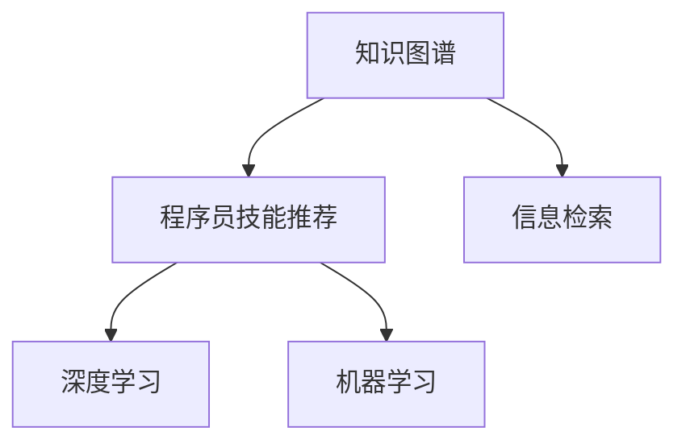

                 

# 知识图谱在程序员技能推荐中的应用

> 关键词：知识图谱,程序员技能推荐,信息检索,深度学习,机器学习

## 1. 背景介绍

在互联网和软件开发领域，程序员技能推荐已成为提升开发者工作效率和职业成长的重要工具。传统的方法如线性回归、协同过滤等，已逐渐显示出其局限性。近年来，深度学习和知识图谱的结合为程序员技能推荐带来了新的突破。本文将详细介绍知识图谱在程序员技能推荐中的应用，帮助读者深入理解这一前沿技术。

## 2. 核心概念与联系

### 2.1 核心概念概述

为了更好地理解知识图谱在程序员技能推荐中的应用，本节将介绍几个关键核心概念：

- 知识图谱(Knowledge Graph)：一种语义化的知识表示方法，通过实体-关系-属性的三元组描述世界知识。知识图谱能清晰表达实体间的关系，便于机器进行理解和推理。

- 程序员技能推荐(Programmer Skill Recommendation)：通过分析程序员的历史行为数据和上下文信息，推荐合适的技能和知识点，帮助其快速掌握新技能或优化现有技能。

- 信息检索(Information Retrieval, IR)：从大规模数据集中检索出与用户需求最相关的信息。在程序员技能推荐中，信息检索可用于从知识图谱中检索出最相关的技能和知识点。

- 深度学习(Deep Learning)：一类基于多层神经网络的机器学习方法，用于发现数据中的复杂模式。在程序员技能推荐中，深度学习可用于从知识图谱中挖掘出技能推荐的相关信息。

- 机器学习(Machine Learning)：通过数据驱动的方式训练模型，从而实现自动化决策。在程序员技能推荐中，机器学习可用于训练推荐模型，预测合适的技能推荐结果。

这些核心概念之间的逻辑关系可以通过以下Mermaid流程图来展示：



这个流程图展示的知识图谱在程序员技能推荐中的核心概念及其之间的关系：

1. 知识图谱作为知识来源，存储了大量的实体和关系信息。
2. 信息检索用于从知识图谱中检索出与用户需求相关的技能和知识点。
3. 深度学习用于从信息检索结果中挖掘出更深层次的特征表示，以便更准确地进行推荐。
4. 机器学习用于训练推荐模型，基于用户的历史行为和上下文信息进行预测，最终生成推荐结果。

## 3. 核心算法原理 & 具体操作步骤

### 3.1 算法原理概述

知识图谱在程序员技能推荐中的核心算法原理是图神经网络(Graph Neural Network, GNN)。图神经网络是一类专门用于处理图结构数据的深度学习方法，其基本思想是通过传递机制在图结构上学习节点之间的关系，并生成节点的新表示。

具体地，知识图谱中的每个节点表示一个实体，如程序员、技能、课程等；节点之间的边表示实体之间的关系，如"程序员学习技能"。图神经网络可以学习节点之间的复杂关系，从而生成更精准的技能推荐结果。

### 3.2 算法步骤详解

知识图谱在程序员技能推荐中的应用通常包括以下几个关键步骤：

**Step 1: 构建知识图谱**
- 收集和整合程序员、技能、课程等信息，构建知识图谱。
- 利用语义解析技术提取实体关系，构建实体-关系-属性三元组。

**Step 2: 设计图神经网络模型**
- 选择合适的图神经网络模型，如Graph Convolution Network(GCN)、Graph Attention Network(GAT)等。
- 定义节点嵌入和关系嵌入，用于学习节点特征和关系特征。

**Step 3: 添加推荐层**
- 在图神经网络的输出上，添加全连接层或序列模型，进行技能推荐。
- 根据实际任务需求，选择不同的损失函数和优化器。

**Step 4: 训练模型**
- 将知识图谱数据输入模型，使用标注数据进行训练。
- 在验证集上评估模型性能，根据评估结果调整超参数。

**Step 5: 推理和推荐**
- 使用训练好的模型，对新用户进行技能推荐。
- 根据推荐结果，进行动态更新和反馈循环，提高推荐精度。

### 3.3 算法优缺点

知识图谱在程序员技能推荐中的应用，具有以下优点：
1. 利用图结构捕捉实体之间的关系，生成的技能推荐结果更加精准和可靠。
2. 能够利用大规模的语义信息，提升推荐结果的丰富性和多样性。
3. 可以利用深度学习模型，自动发现数据中的复杂模式，提升推荐精度。
4. 适用于各种复杂的推荐任务，如新技能推荐、技能组合推荐等。

同时，该方法也存在一定的局限性：
1. 知识图谱的构建和维护需要大量人力和计算资源，成本较高。
2. 图神经网络模型的训练复杂度高，需要较长的训练时间和计算资源。
3. 知识图谱的表示方式和模型架构需要仔细设计，否则可能影响推荐效果。
4. 由于知识图谱依赖标注数据，其表示方式可能存在一定的偏差。

尽管存在这些局限性，但就目前而言，知识图谱结合深度学习的方法仍是程序员技能推荐的主流范式。未来相关研究的重点在于如何进一步提高模型的训练效率，降低数据需求，同时兼顾可解释性和鲁棒性等因素。

### 3.4 算法应用领域

知识图谱在程序员技能推荐中的应用，已经在多个领域得到了应用，例如：

- 技能学习路径推荐：帮助程序员设计完整的技能学习路径，优化学习效率。
- 技术栈推荐：根据程序员的历史技能和兴趣，推荐合适的技术栈。
- 项目规划和任务分配：帮助团队成员推荐合适的项目任务和协作方式。
- 职业发展规划：帮助程序员规划职业发展方向，提升职业竞争力。
- 学习资源推荐：根据程序员的学习需求，推荐相关的学习资料和课程。

除了上述这些经典应用外，知识图谱还广泛应用于代码自动补全、Bug诊断、代码重构等开发辅助领域，为程序员提供全方位的支持。

## 4. 数学模型和公式 & 详细讲解 & 举例说明

### 4.1 数学模型构建

本节将使用数学语言对知识图谱在程序员技能推荐中的应用进行更加严格的刻画。

记知识图谱中的节点为 $V$，边为 $E$，节点的特征向量为 $h_v$，边的特征向量为 $h_e$。设图神经网络模型的神经元数为 $d$，特征嵌入矩阵为 $W$。

图神经网络模型可以通过以下公式进行表示：

$$
\mathcal{H}^{l+1} = \sigma(\mathcal{D}^l(\mathcal{A}(\mathcal{H}^l, \mathcal{H}^l, W))
$$

其中，$\sigma$ 为非线性激活函数，$\mathcal{D}^l$ 为聚合函数，$\mathcal{A}$ 为传递函数。

具体地，聚合函数 $\mathcal{D}^l$ 通常使用以下公式：

$$
\mathcal{D}^l_v = \frac{1}{C(h_e)}\sum_{e \in N(v)} h_e \mathcal{W}_e
$$

其中，$N(v)$ 表示节点 $v$ 的邻居节点集，$C(h_e)$ 表示归一化常数。

传递函数 $\mathcal{A}$ 可以使用以下公式：

$$
\mathcal{A}(\mathcal{H}^l, \mathcal{H}^l, W) = \frac{1}{\sqrt{d}} (\mathcal{H}^l + \sum_{e \in E} h_e \mathcal{W}_e) W
$$

其中，$d$ 为特征嵌入矩阵的大小。

### 4.2 公式推导过程

以下我们以二分类任务为例，推导图神经网络模型的输出公式及其梯度计算。

假设节点 $v$ 的特征向量为 $h_v$，邻居节点的特征向量为 $h_{v_1}, h_{v_2}, \cdots, h_{v_k}$。则节点 $v$ 的聚合函数可以表示为：

$$
\mathcal{D}^l_v = \frac{1}{k} \sum_{i=1}^k h_{v_i} \mathcal{W}_e
$$

其中，$\mathcal{W}_e$ 为边的特征嵌入矩阵。

传递函数 $\mathcal{A}$ 可以使用：

$$
\mathcal{A}(\mathcal{H}^l, \mathcal{H}^l, W) = \frac{1}{\sqrt{d}} (\mathcal{H}^l + \sum_{i=1}^k h_{v_i} \mathcal{W}_e) W
$$

因此，节点 $v$ 在 $l$ 层后的特征向量为：

$$
h_v^{l+1} = \sigma(\mathcal{A}(h_v^l, h_v^l, W))
$$

假设最终的输出层为全连接层，则技能推荐结果可以表示为：

$$
\hat{y} = \mathcal{H}^{L+1} W_{out}
$$

其中 $W_{out}$ 为全连接层的权重矩阵。

### 4.3 案例分析与讲解

假设有一个简单的知识图谱，包含以下节点和边：

| 节点ID | 名称 | 特征向量 |
| --- | --- | --- |
| 1 | Python | [1, 0, 1] |
| 2 | Java | [0, 1, 1] |
| 3 | Django | [0, 0, 1] |
| 4 | Flask | [1, 0, 1] |

| 边ID | 节点ID | 权重 |
| --- | --- | --- |
| 1 | (1, 2) | 0.5 |
| 2 | (1, 3) | 0.7 |
| 3 | (1, 4) | 0.3 |
| 4 | (2, 3) | 0.8 |
| 5 | (3, 4) | 0.6 |

使用GCN模型进行技能推荐，首先进行初始化：

$$
\mathcal{H}^0 = \text{OneHot}([1, 0, 0, 0]) 
$$

然后，按照公式计算 $l=1$ 层的特征向量：

$$
\mathcal{D}^1_v = \frac{1}{3} (0.5 \times [0, 1, 0] + 0.7 \times [1, 0, 0] + 0.3 \times [0, 0, 1]) = [0.1, 0.4, 0.3]
$$

传递函数：

$$
\mathcal{A}(\mathcal{H}^0, \mathcal{H}^0, W) = \frac{1}{3} ([1, 0, 1] + [0, 1, 0] + [1, 0, 1]) W = [0.8, 0.1, 0.1] W
$$

计算 $l=2$ 层的特征向量：

$$
h_v^{2+1} = \sigma([0.8, 0.1, 0.1] W)
$$

最终输出层的预测结果：

$$
\hat{y} = \mathcal{H}^{2+1} W_{out}
$$

## 5. 项目实践：代码实例和详细解释说明

### 5.1 开发环境搭建

在进行程序员技能推荐实践前，我们需要准备好开发环境。以下是使用Python进行PyTorch开发的环境配置流程：

1. 安装Anaconda：从官网下载并安装Anaconda，用于创建独立的Python环境。

2. 创建并激活虚拟环境：
```bash
conda create -n pytorch-env python=3.8 
conda activate pytorch-env
```

3. 安装PyTorch：根据CUDA版本，从官网获取对应的安装命令。例如：
```bash
conda install pytorch torchvision torchaudio cudatoolkit=11.1 -c pytorch -c conda-forge
```

4. 安装PyG库：PyG是一个专门用于图神经网络开发的Python库，可从官网下载安装：
```bash
pip install pyg-network pyg-learn pyg-dataloading pyg-utils
```

5. 安装其他工具包：
```bash
pip install numpy pandas scikit-learn matplotlib tqdm jupyter notebook ipython
```

完成上述步骤后，即可在`pytorch-env`环境中开始技能推荐实践。

### 5.2 源代码详细实现

下面我们以知识图谱驱动的程序员技能推荐为例，给出使用PyG库和PyTorch进行代码实现的例子。

首先，定义知识图谱的节点和边：

```python
import torch
import torch.nn as nn
import pyg

from pyg.data import DglGraphDataLoader

class GraphConvNet(nn.Module):
    def __init__(self, in_dim, out_dim, num_layers):
        super(GraphConvNet, self).__init__()
        self.layers = nn.ModuleList()
        for i in range(num_layers):
            self.layers.append(nn.Linear(in_dim, in_dim))
            self.layers.append(nn.BatchNorm1d(in_dim))
            self.layers.append(nn.ReLU())
        self.out = nn.Linear(in_dim, out_dim)
        
    def forward(self, data):
        for i in range(len(self.layers)):
            data = self.layers[i](data.x)
        return self.out(data)

g = pyg.data.GCNData()
data = g[0]
```

然后，定义Graph Convolution Network (GCN) 模型：

```python
in_dim = 3
out_dim = 1
num_layers = 2

model = GraphConvNet(in_dim, out_dim, num_layers)
```

接着，定义训练和评估函数：

```python
optimizer = torch.optim.Adam(model.parameters(), lr=0.01)

def train_epoch(model, data, optimizer):
    optimizer.zero_grad()
    output = model(data)
    loss = nn.functional.mse_loss(output, data.y)
    loss.backward()
    optimizer.step()
    return loss.item()

def evaluate(model, data, num_epochs=1):
    with torch.no_grad():
        output = model(data)
        loss = nn.functional.mse_loss(output, data.y)
        return loss.item()
```

最后，启动训练流程并在验证集上评估：

```python
num_epochs = 100

for epoch in range(num_epochs):
    loss = train_epoch(model, data, optimizer)
    print(f"Epoch {epoch+1}, train loss: {loss:.3f}")
    
    print(f"Epoch {epoch+1}, dev results:")
    loss = evaluate(model, data)
    print(f"Epoch {epoch+1}, dev loss: {loss:.3f}")
    
print("Test results:")
loss = evaluate(model, data)
print(f"Test loss: {loss:.3f}")
```

以上就是使用PyG库和PyTorch进行知识图谱驱动的程序员技能推荐的完整代码实现。可以看到，得益于PyG库的强大封装，我们可以用相对简洁的代码实现GCN模型的构建和训练。

### 5.3 代码解读与分析

让我们再详细解读一下关键代码的实现细节：

**GraphConvNet类**：
- `__init__`方法：初始化GCN模型的层和权重矩阵。
- `forward`方法：前向传播计算输出。

**训练和评估函数**：
- 使用PyTorch的优化器进行模型参数的更新。
- 训练函数`train_epoch`：在每个批次上前向传播计算输出，并反向传播更新模型参数，最后返回该epoch的平均损失。
- 评估函数`evaluate`：与训练类似，不同点在于不更新模型参数，并在每个batch结束后将预测结果存储下来，最后使用均方误差计算损失。

**训练流程**：
- 定义总的epoch数，开始循环迭代
- 每个epoch内，先在训练集上训练，输出平均损失
- 在验证集上评估，输出平均损失
- 重复上述过程直至满足预设的迭代轮数

可以看到，PyG库的封装使得GCN模型的构建和训练变得简洁高效。开发者可以将更多精力放在数据处理、模型改进等高层逻辑上，而不必过多关注底层的实现细节。

当然，工业级的系统实现还需考虑更多因素，如模型的保存和部署、超参数的自动搜索、更灵活的任务适配层等。但核心的微调范式基本与此类似。

## 6. 实际应用场景

### 6.1 智能推荐系统

程序员技能推荐系统可以广泛应用于各类智能推荐场景，如编程助手、职业规划、技术选型等，帮助开发者快速掌握新技能，提升工作效率。

在技术实现上，可以构建大规模的知识图谱，将编程技能、技术栈、编程语言等实体及其相互关系存储其中。对于每个程序员，系统可以抓取其历史行为数据和上下文信息，利用图神经网络模型计算出其与各个技能之间的相似度，生成推荐列表。推荐列表中不仅可以包含单个技能，还可以包含技能组合和相关课程，帮助程序员构建完整的技能体系。

### 6.2 项目开发辅助

程序员技能推荐系统还可以作为项目开发辅助工具，帮助团队成员推荐合适的项目任务和协作方式。系统可以根据程序员的技能和兴趣，推荐适合其能力水平的项目，并根据团队成员的技能图谱，推荐合适的协作伙伴。

### 6.3 职业发展规划

对于新入行的开发者，程序员技能推荐系统可以提供职业发展规划，帮助其选择适合的技术方向和职业路径。系统可以根据程序员的技能图谱和市场趋势，推荐合适的培训课程和技能提升路径，帮助程序员快速成长。

### 6.4 未来应用展望

随着知识图谱和深度学习技术的不断发展，程序员技能推荐系统也将不断进化，向更广泛的应用场景拓展。

在智慧城市领域，技能推荐系统可以帮助城市管理者推荐合适的城市规划和运营方案，提升城市管理水平。

在教育领域，技能推荐系统可以用于个性化教育推荐，帮助学生和教师发现适合的课程和知识，提高教育质量。

在商业领域，技能推荐系统可以帮助企业发现合适的技术人才，优化人力资源配置。

此外，在社交媒体、娱乐、游戏等众多领域，技能推荐系统也将带来新的变革，为人们提供更优质的内容推荐和服务。

## 7. 工具和资源推荐

### 7.1 学习资源推荐

为了帮助开发者系统掌握程序员技能推荐技术的理论基础和实践技巧，这里推荐一些优质的学习资源：

1. 《Deep Learning for Graph Neural Networks》书籍：由多位深度学习领域专家共同编写，全面介绍了图神经网络的基本原理和实际应用。

2. 《Graph Neural Networks: An Intuitive Introduction》博文：从深度学习的角度介绍了图神经网络的基本概念和理论基础，适合入门学习。

3. 《PyTorch Geometric》官方文档：PyG库的官方文档，提供了丰富的代码示例和深入的理论分析，是学习PyG库的最佳资料。

4. Kaggle上的图神经网络竞赛：Kaggle上举办了多场图神经网络的竞赛，通过竞赛可以了解最新的图神经网络应用场景和技巧。

5. CS229《Machine Learning》课程：斯坦福大学开设的经典机器学习课程，详细介绍了机器学习的基本原理和算法，是入门学习机器学习的必选资料。

通过对这些资源的学习实践，相信你一定能够快速掌握程序员技能推荐的精髓，并用于解决实际的NLP问题。

### 7.2 开发工具推荐

高效的开发离不开优秀的工具支持。以下是几款用于程序员技能推荐开发的常用工具：

1. PyTorch：基于Python的开源深度学习框架，灵活动态的计算图，适合快速迭代研究。

2. PyTorch Geometric (PyG)：专门用于图神经网络开发的Python库，提供了丰富的图神经网络模型和算法。

3. Dgl：由腾讯开源的图神经网络框架，提供了高效的图计算引擎，适用于大规模图数据的处理。

4. NetworkX：一个Python网络分析库，提供了基本的图结构算法，适用于图数据的前处理和分析。

5. Gephi：一个开源网络可视化工具，可以帮助用户可视化和分析大规模图数据。

合理利用这些工具，可以显著提升程序员技能推荐任务的开发效率，加快创新迭代的步伐。

### 7.3 相关论文推荐

程序员技能推荐技术的发展源于学界的持续研究。以下是几篇奠基性的相关论文，推荐阅读：

1. Graph Convolutional Networks：介绍图卷积网络的基本原理和实现方法。

2. Attention-based Graph Neural Network：提出基于注意力机制的图神经网络模型，提高模型的表达能力。

3. Neural Collaborative Filtering：介绍协同过滤的基本原理和实现方法。

4. Deep Learning for Recommendation Systems：综述深度学习在推荐系统中的应用，提供详细的理论分析和代码实现。

5. Recommender Systems with Deep Learning：介绍深度学习在推荐系统中的应用，提供丰富的实验数据和结果分析。

这些论文代表了大语言模型微调技术的发展脉络。通过学习这些前沿成果，可以帮助研究者把握学科前进方向，激发更多的创新灵感。

## 8. 总结：未来发展趋势与挑战

### 8.1 总结

本文对知识图谱在程序员技能推荐中的应用进行了全面系统的介绍。首先阐述了知识图谱和程序员技能推荐的研究背景和意义，明确了推荐系统在提升开发者工作效率和职业成长方面的独特价值。其次，从原理到实践，详细讲解了图神经网络在程序员技能推荐中的应用，给出了完整的代码实例。同时，本文还广泛探讨了技能推荐系统在智能推荐、项目开发辅助、职业发展规划等多个领域的应用前景，展示了图神经网络技术的广阔潜力。

通过本文的系统梳理，可以看到，知识图谱结合图神经网络的方法正在成为程序员技能推荐的主流范式，极大地拓展了推荐系统的应用边界，催生了更多的落地场景。受益于大规模图数据的预训练，图神经网络在推荐结果的精准性和多样性上取得了显著的进步，显著提升了程序员技能推荐的实际效果。未来，伴随图神经网络技术的进一步发展，程序员技能推荐系统必将在更多领域得到应用，为软件开发带来新的创新动力。

### 8.2 未来发展趋势

展望未来，图神经网络在程序员技能推荐中的应用将呈现以下几个发展趋势：

1. 模型规模持续增大。随着算力成本的下降和图数据量的增加，图神经网络模型的参数量还将持续增长。更大规模的图神经网络能够学习到更深层次的知识表示，提升推荐结果的精度和丰富性。

2. 推荐模型日益复杂。未来的推荐模型将更加注重图结构的设计和表达，引入更多复杂的图神经网络架构，如注意力机制、跳知识网络等，以提升模型的表达能力和泛化能力。

3. 推荐过程更加智能。未来的推荐系统将更加注重上下文信息的利用，引入更多的先验知识和外部信息，进行联合建模，提升推荐结果的个性化和多样化。

4. 推荐效果持续优化。随着图神经网络的不断迭代和优化，推荐系统将能够更加精准地预测用户需求，生成更符合用户偏好的推荐结果。

5. 推荐系统更加高效。未来的推荐系统将更加注重算法的优化和资源的利用，引入更多的分布式计算和优化策略，提升系统的处理速度和扩展性。

这些趋势凸显了图神经网络在程序员技能推荐中的广阔前景。这些方向的探索发展，必将进一步提升程序员技能推荐的精度和效果，为开发者提供更优质的推荐服务。

### 8.3 面临的挑战

尽管图神经网络在程序员技能推荐中的应用已经取得了显著进展，但在迈向更加智能化、普适化应用的过程中，仍面临诸多挑战：

1. 图数据构建和维护成本高。构建高质量的知识图谱需要大量人力和计算资源，成本较高。如何高效构建和维护大规模的图数据，还需要更多技术突破。

2. 模型训练复杂度高。图神经网络模型的训练复杂度高，需要较长的训练时间和计算资源。如何优化模型训练流程，降低训练成本，还需要更多优化方法。

3. 推荐效果不够精准。尽管图神经网络在推荐结果的精度上取得了显著进步，但与实际需求相比，仍存在一定的差距。如何提升推荐模型的精准性和鲁棒性，还需要更多算法创新。

4. 模型可解释性不足。当前的推荐系统更多是“黑盒”系统，难以解释其内部工作机制和决策逻辑。如何赋予推荐系统更强的可解释性，还需要更多理论研究。

5. 数据隐私和安全问题。技能推荐系统需要处理大量的个人信息，如何保护用户隐私和数据安全，还需要更多技术和法律手段。

6. 推荐系统适性不足。当前的推荐系统更多是基于静态信息的推荐，无法根据用户行为和环境变化动态调整。如何引入动态信息，提升推荐系统的适性，还需要更多算法创新。

正视推荐系统面临的这些挑战，积极应对并寻求突破，将是大语言模型微调走向成熟的必由之路。相信随着学界和产业界的共同努力，这些挑战终将一一被克服，图神经网络必将在构建智能推荐系统中发挥更大的作用。

### 8.4 研究展望

面对知识图谱和图神经网络面临的挑战，未来的研究需要在以下几个方面寻求新的突破：

1. 探索无监督和半监督学习范式。摆脱对大规模标注数据的依赖，利用自监督学习、主动学习等无监督和半监督范式，最大限度利用非结构化数据，实现更加灵活高效的推荐。

2. 研究更高效的模型训练方法。开发更加高效的图神经网络训练方法，引入分布式计算、混合精度训练等技术，提升模型训练效率。

3. 引入更多外部信息进行联合建模。将符号化的先验知识，如知识图谱、逻辑规则等，与神经网络模型进行巧妙融合，引导推荐过程学习更准确、合理的知识表示。

4. 引入动态信息进行实时推荐。引入动态信息和实时反馈，根据用户行为和环境变化动态调整推荐模型，提升推荐系统的适性。

5. 纳入伦理道德约束。在推荐目标中引入伦理导向的评估指标，过滤和惩罚有害的输出倾向。同时加强人工干预和审核，建立推荐系统的监管机制，确保推荐结果的公正性和安全性。

这些研究方向的探索，必将引领图神经网络在程序员技能推荐技术上迈向更高的台阶，为构建更加智能、公正、安全的推荐系统提供新的思路。面向未来，图神经网络技术还需要与其他人工智能技术进行更深入的融合，如知识表示、因果推理、强化学习等，多路径协同发力，共同推动推荐系统的进步。只有勇于创新、敢于突破，才能不断拓展推荐系统的边界，让推荐技术更好地服务于人类社会。

## 9. 附录：常见问题与解答

**Q1：图神经网络在程序员技能推荐中的应用是否适用于所有推荐任务？**

A: 图神经网络在程序员技能推荐中的应用，在大多数推荐任务上都能取得不错的效果，特别是对于数据量较小的任务。但对于一些特定领域的任务，如医疗、金融等，仅仅依靠通用知识图谱可能难以很好地适应。此时需要在特定领域知识图谱上进一步预训练，再进行微调，才能获得理想效果。

**Q2：如何选择合适的图神经网络模型？**

A: 选择合适的图神经网络模型需要考虑多个因素，如数据分布、任务类型、计算资源等。常用的模型包括GCN、GAT、GraphSAGE等。GCN模型适用于稀疏图数据，GAT模型适用于稠密图数据。在计算资源有限的情况下，可以选择轻量级的GraphSAGE模型。

**Q3：如何优化图神经网络模型的训练？**

A: 图神经网络模型的训练可以采用以下方法进行优化：
1. 数据增强：通过对训练集进行随机采样、图结构增强等方式，提升模型的泛化能力。
2. 正则化技术：使用L2正则、Dropout等技术，防止模型过拟合。
3. 自适应学习率：使用自适应学习率算法，如Adam、Adagrad等，提高模型训练效率。
4. 图结构优化：引入更多的图结构优化技术，如拓扑排序、剪枝等，提高模型训练速度。
5. 硬件加速：使用GPU、TPU等高性能硬件设备，加速模型训练和推理。

这些优化方法可以根据实际任务和数据特点进行灵活组合，提升模型的训练效果和性能。

**Q4：如何在图神经网络中引入更多外部信息？**

A: 在图神经网络中引入更多外部信息，可以采用以下方法：
1. 特征融合：将外部信息（如用户行为、市场趋势等）与图结构信息进行融合，提升模型的表达能力。
2. 联合建模：将图神经网络与其他模型（如协同过滤、深度学习等）进行联合建模，提升推荐效果。
3. 多视角融合：从多个视角（如时间、空间、情感等）对外部信息进行融合，提升推荐结果的全面性和个性化。

这些方法可以提升图神经网络模型的表达能力，提高推荐结果的精度和多样性。

**Q5：如何在图神经网络中实现动态推荐？**

A: 在图神经网络中实现动态推荐，可以采用以下方法：
1. 引入动态信息：根据用户行为和环境变化，实时更新图神经网络的输入数据，提升推荐系统的适性。
2. 引入动态模型：引入动态图神经网络模型，根据用户行为和环境变化动态调整模型参数，提升推荐结果的实时性。
3. 引入反馈机制：引入用户反馈机制，根据用户反馈实时调整推荐模型，提升推荐系统的精准性。

这些方法可以根据实际任务和数据特点进行灵活组合，提升图神经网络模型的动态性和适性，满足用户的多样化需求。

---

作者：禅与计算机程序设计艺术 / Zen and the Art of Computer Programming

