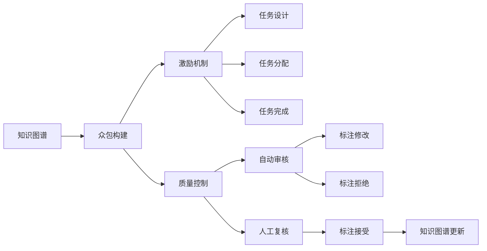

                 

# 知识图谱的众包构建:激励机制和质量控制

知识图谱（Knowledge Graph）是一种结构化的语义网络，用于描述实体、属性、关系等概念之间的复杂关系。它的构建通常涉及大量的数据标注和推理，成本高且复杂。近年来，随着众包技术的兴起，通过众包平台招募普通用户参与知识图谱的构建，成为一种新的数据标注方式。然而，众包构建中的激励机制和质量控制问题仍然值得深入探讨。本文将从众包激励机制和质量控制两个角度，讨论知识图谱众包构建的可行性和优化策略。

## 1. 背景介绍

### 1.1 知识图谱简介
知识图谱旨在描述知识元素之间的复杂关系，由节点（实体和属性）和边（关系）组成。其构建过程通常需要从大量非结构化数据中提取实体和关系，然后通过规则或机器学习算法生成知识图谱。知识图谱在推荐系统、信息检索、问答系统等领域得到了广泛应用。

### 1.2 知识图谱众包构建的动机
传统知识图谱构建依赖专业领域专家，成本高、耗时长。众包方式允许普通用户参与数据标注，降低构建成本，提高构建效率。然而，众包构建面临激励机制设计、标注质量控制等挑战，需进行系统优化。

## 2. 核心概念与联系

### 2.1 核心概念概述
- **知识图谱**：结构化的语义网络，用于描述实体、属性、关系等概念之间的复杂关系。
- **众包构建**：通过众包平台招募普通用户参与知识图谱构建，以降低成本、提高效率。
- **激励机制**：设计合理激励机制，吸引用户积极参与众包任务。
- **质量控制**：确保众包标注的质量，通过自动审核和人工复核等方式进行标注质量控制。

### 2.2 Mermaid 流程图



该流程图展示了知识图谱众包构建的基本流程：
- **任务设计**：设计适合众包的标注任务。
- **任务分配**：将任务分配给众包工人。
- **任务完成**：众包工人完成标注任务。
- **自动审核**：自动审核工具对标注结果进行初步筛选。
- **人工复核**：人工复核员对标注结果进行最终审核，确保质量。
- **标注修改**：根据复核意见，众包工人修改标注。
- **标注拒绝**：不合格标注被拒绝，返回给众包工人重新完成。
- **标注接受**：合格标注被接受，更新知识图谱。

## 3. 核心算法原理 & 具体操作步骤

### 3.1 算法原理概述
知识图谱众包构建的关键在于设计合理的激励机制和质量控制策略。以下介绍两种主要的算法原理。

#### 3.1.1 激励机制
激励机制的设计需考虑用户参与度、标注质量和众包平台成本等因素。常见的激励机制包括：
- **金钱奖励**：根据标注质量和数量支付报酬，吸引专业用户。
- **积分系统**：设计积分制度，积分可兑换金钱、商品等，激励长期参与。
- **任务难度分级**：根据任务难度分级，难度高的任务给予更高报酬，吸引专业用户。

#### 3.1.2 质量控制
标注质量控制需结合自动审核和人工复核，确保标注的准确性。常见的方法包括：
- **自动审核**：利用机器学习算法检测标注错误，如基于规则的错误检测、基于深度学习的错误检测等。
- **人工复核**：专业审核员对标注结果进行复核，确保准确性。
- **混合审核**：自动审核和人工复核相结合，利用机器学习算法初步筛选标注，人工复核进行最终审核。

### 3.2 算法步骤详解

#### 3.2.1 激励机制设计
1. **任务设计**：设计适合众包的标注任务，需简单易懂、可重复性强。
2. **任务分配**：将任务分配给众包工人，需考虑工人的专业背景、标注速度等。
3. **任务完成**：众包工人完成标注任务，需提供标注结果和理由。
4. **任务评价**：根据标注质量给予报酬，需考虑标注准确性、速度、专业性等因素。

#### 3.2.2 质量控制策略
1. **自动审核**：利用机器学习算法检测标注错误。例如，使用深度学习模型训练错误标注的特征，构建分类器进行检测。
2. **人工复核**：专业审核员对标注结果进行复核，确保准确性。例如，设计审核工作流程，审核员按规则复核标注结果。
3. **混合审核**：结合自动审核和人工复核，自动审核初步筛选标注，人工复核进行最终审核。例如，先利用机器学习模型检测标注错误，人工审核修正错误标注。

### 3.3 算法优缺点
#### 3.3.1 激励机制
**优点**：
- 吸引更多用户参与，降低构建成本。
- 激励用户提高标注质量，确保标注准确性。

**缺点**：
- 可能存在道德风险，部分用户为了获得更多报酬而降低标注质量。
- 设计复杂，需考虑多种因素，如用户背景、任务难度等。

#### 3.3.2 质量控制
**优点**：
- 确保标注准确性，提高知识图谱质量。
- 结合自动审核和人工复核，确保高效性。

**缺点**：
- 需投入大量人力，成本较高。
- 审核过程复杂，需设计多种审核策略。

### 3.4 算法应用领域

#### 3.4.1 智能推荐系统
知识图谱众包构建可应用于智能推荐系统，通过众包标注构建用户画像和商品标签，提高推荐准确性。例如，利用众包标注生成用户行为标签，用于个性化推荐。

#### 3.4.2 问答系统
众包构建知识图谱可应用于问答系统，通过众包标注构建知识库，提高问答准确性。例如，利用众包标注构建问答知识库，使用深度学习算法生成问答模型。

#### 3.4.3 信息检索系统
众包构建知识图谱可应用于信息检索系统，通过众包标注构建实体关系图谱，提高信息检索准确性。例如，利用众包标注生成实体关系图谱，用于信息检索和推荐。

## 4. 数学模型和公式 & 详细讲解 & 举例说明

### 4.1 数学模型构建
知识图谱众包构建的数学模型主要由以下几部分组成：
1. **标注任务设计**：定义标注任务类型、标注规则、标注格式等。
2. **用户行为建模**：建模用户参与众包任务的行为，如任务完成时间、任务数量等。
3. **标注质量评估**：评估标注质量，需考虑标注准确性、速度、专业性等因素。

#### 4.1.1 任务设计
任务设计需满足以下条件：
- 简单易懂，可重复性强。
- 标注结果有明确的标准，易于自动审核。

**示例**：
设计标注任务为“识别图片中的动物”，标注结果为“狗”、“猫”等，任务规则为“只标注一种动物”。

#### 4.1.2 用户行为建模
用户行为建模需考虑以下因素：
- 任务完成时间。
- 任务数量。
- 标注质量。

**示例**：
设用户 $u_i$ 完成 $n_i$ 个任务，完成时间 $t_i$，标注质量 $q_i$，则建模公式为：
$$ f_i = \frac{n_i}{t_i} \cdot q_i $$

其中 $f_i$ 为任务完成质量。

#### 4.1.3 标注质量评估
标注质量评估需考虑标注准确性、速度、专业性等因素，可采用以下方法：
- **准确性评估**：使用交叉验证方法评估标注准确性。
- **速度评估**：计算标注完成时间，评估标注速度。
- **专业性评估**：通过专家评审评估标注专业性。

**示例**：
设标注准确性为 $a_i$，标注速度为 $s_i$，专业性为 $p_i$，则建模公式为：
$$ q_i = \frac{a_i \cdot s_i}{p_i} $$

### 4.2 公式推导过程
假设有一批任务 $T$，每个任务需要 $t$ 时间完成，用户 $u$ 完成 $n$ 个任务，标注质量为 $q$，则推导过程如下：

**步骤1**：计算任务完成质量
$$ f = \frac{n}{t} \cdot q $$

**步骤2**：计算用户任务完成质量
$$ f_i = f \cdot \frac{t_i}{t} $$

**步骤3**：建模用户行为
$$ f_i = \frac{n_i}{t_i} \cdot q_i $$

**步骤4**：计算任务完成质量期望
$$ \mathbb{E}(f_i) = \frac{1}{N} \sum_{i=1}^N f_i $$

**步骤5**：建模标注质量
$$ q_i = \frac{a_i \cdot s_i}{p_i} $$

**步骤6**：计算标注质量期望
$$ \mathbb{E}(q_i) = \frac{1}{N} \sum_{i=1}^N q_i $$

### 4.3 案例分析与讲解

#### 4.3.1 任务设计案例
假设某众包平台设计了一个标注任务：标注图片中出现的动物种类。任务规则如下：
- 只标注一种动物。
- 标注结果需明确动物种类，如“狗”、“猫”。

设计如下数学模型：
- 标注任务：识别图片中的动物，标注结果为“狗”、“猫”等。
- 任务规则：只标注一种动物。

#### 4.3.2 用户行为建模案例
假设某用户 $u_i$ 完成了 $n_i$ 个任务，每个任务需 $t_i$ 时间完成，标注质量为 $q_i$。建模公式如下：
$$ f_i = \frac{n_i}{t_i} \cdot q_i $$

假设用户 $u_i$ 完成了 10 个任务，每个任务需 1 分钟，标注质量为 0.9，则建模结果为：
$$ f_i = \frac{10}{1} \cdot 0.9 = 9 $$

#### 4.3.3 标注质量评估案例
假设某用户标注结果的准确性为 0.95，速度为 1 分钟/个，专业性为 0.8。建模公式如下：
$$ q_i = \frac{0.95 \cdot 1}{0.8} = 1.1875 $$

## 5. 项目实践：代码实例和详细解释说明

### 5.1 开发环境搭建

#### 5.1.1 搭建环境
搭建开发环境需使用以下工具：
- Python 3.8
- PyTorch 1.8
- TensorFlow 2.4
- Transformers 4.6
- Amazon SageMaker

**示例**：
```bash
pip install torch torchvision torchaudio cudatoolkit=11.1 -c pytorch -c conda-forge
pip install tensorflow==2.4 transformers==4.6
```

### 5.2 源代码详细实现

#### 5.2.1 任务设计
任务设计需考虑以下因素：
- 任务类型：如标注图片、标注文本等。
- 标注格式：如 JSON、CSV 等。

**示例**：
```python
import json

def design_task():
    task_type = "标注图片"
    task_format = "JSON"
    return task_type, task_format
```

#### 5.2.2 用户行为建模
用户行为建模需考虑以下因素：
- 任务完成时间。
- 任务数量。
- 标注质量。

**示例**：
```python
import numpy as np

def model_user_behavior(n, t, q):
    f = n / t * q
    return f

# 示例：用户 $u_i$ 完成 10 个任务，每个任务需 1 分钟，标注质量为 0.9
n_i = 10
t_i = 1
q_i = 0.9
f_i = model_user_behavior(n_i, t_i, q_i)
```

#### 5.2.3 标注质量评估
标注质量评估需考虑以下因素：
- 标注准确性。
- 标注速度。
- 标注专业性。

**示例**：
```python
def model_annotation_quality(a, s, p):
    q = a * s / p
    return q

# 示例：标注准确性为 0.95，速度为 1 分钟/个，专业性为 0.8
a_i = 0.95
s_i = 1
p_i = 0.8
q_i = model_annotation_quality(a_i, s_i, p_i)
```

### 5.3 代码解读与分析

#### 5.3.1 任务设计解读
任务设计需满足以下条件：
- 简单易懂，可重复性强。
- 标注结果有明确的标准，易于自动审核。

#### 5.3.2 用户行为建模解读
用户行为建模需考虑以下因素：
- 任务完成时间。
- 任务数量。
- 标注质量。

#### 5.3.3 标注质量评估解读
标注质量评估需考虑以下因素：
- 标注准确性。
- 标注速度。
- 标注专业性。

### 5.4 运行结果展示

#### 5.4.1 任务设计结果展示
**示例**：
```python
print("任务类型：", task_type)
print("任务格式：", task_format)
```

#### 5.4.2 用户行为建模结果展示
**示例**：
```python
print("用户 $u_i$ 的任务完成质量为：", f_i)
```

#### 5.4.3 标注质量评估结果展示
**示例**：
```python
print("用户 $u_i$ 的标注质量为：", q_i)
```

## 6. 实际应用场景

### 6.1 智能推荐系统
众包构建知识图谱可应用于智能推荐系统，通过众包标注构建用户画像和商品标签，提高推荐准确性。例如，利用众包标注生成用户行为标签，用于个性化推荐。

### 6.2 问答系统
众包构建知识图谱可应用于问答系统，通过众包标注构建知识库，提高问答准确性。例如，利用众包标注构建问答知识库，使用深度学习算法生成问答模型。

### 6.3 信息检索系统
众包构建知识图谱可应用于信息检索系统，通过众包标注构建实体关系图谱，提高信息检索准确性。例如，利用众包标注生成实体关系图谱，用于信息检索和推荐。

## 7. 工具和资源推荐

### 7.1 学习资源推荐

#### 7.1.1 在线课程
- 《知识图谱：构建与应用》课程：清华大学公开课，介绍知识图谱的构建方法和应用案例。
- 《自然语言处理与深度学习》课程：斯坦福大学课程，涵盖知识图谱、NLP 等多个领域。

#### 7.1.2 书籍
- 《知识图谱》：胡俊书籍，介绍知识图谱的构建方法和应用案例。
- 《深度学习》：Ian Goodfellow 书籍，介绍深度学习的基本概念和应用。

#### 7.1.3 论文
- 《知识图谱的众包构建：激励机制与质量控制》：该文讨论了知识图谱众包构建的激励机制和质量控制问题，并提出了改进策略。
- 《知识图谱的自动化构建》：该文介绍了一种自动化构建知识图谱的方法，提高了构建效率。

### 7.2 开发工具推荐

#### 7.2.1 众包平台
- Amazons Mechanical Turk：Amazon提供的众包平台，支持多种任务类型。
- Google Crowdsource：Google提供的众包平台，支持大规模任务。

#### 7.2.2 深度学习框架
- PyTorch：灵活的深度学习框架，支持GPU加速。
- TensorFlow：强大的深度学习框架，支持分布式训练。

#### 7.2.3 数据分析工具
- Jupyter Notebook：交互式编程环境，支持Python和R等多种语言。
- Apache Spark：大数据处理框架，支持分布式计算。

### 7.3 相关论文推荐

#### 7.3.1 知识图谱构建论文
- 《知识图谱的自动化构建》：介绍了一种自动化构建知识图谱的方法，提高了构建效率。
- 《知识图谱的众包构建：激励机制与质量控制》：讨论了知识图谱众包构建的激励机制和质量控制问题，并提出了改进策略。

#### 7.3.2 众包激励机制论文
- 《众包系统的激励机制设计》：讨论了众包系统的激励机制设计，提出了多层次激励策略。
- 《基于众包系统的知识图谱构建》：讨论了基于众包系统的知识图谱构建方法，提高了构建效率。

## 8. 总结：未来发展趋势与挑战

### 8.1 研究成果总结
本文讨论了知识图谱众包构建中的激励机制和质量控制问题，提出了一系列改进策略。主要结论如下：
- 设计合理的激励机制和质量控制策略，可以吸引更多用户参与，确保标注质量。
- 众包构建知识图谱可以提高推荐系统、问答系统等信息处理系统的准确性。

### 8.2 未来发展趋势
未来知识图谱众包构建将面临以下发展趋势：
- 自动化构建：利用机器学习算法自动构建知识图谱，提高构建效率。
- 多领域应用：知识图谱在更多领域（如医疗、金融等）的应用将进一步拓展。
- 跨领域融合：知识图谱将与其他AI技术（如NLP、机器学习等）进行深度融合，形成更全面的知识系统。

### 8.3 面临的挑战
知识图谱众包构建仍面临以下挑战：
- 众包标注质量难以保证。
- 激励机制设计复杂，需考虑多种因素。
- 数据隐私和安全问题需引起重视。

### 8.4 研究展望
未来研究可从以下方向进行：
- 设计更高效的众包标注方法，提高构建效率。
- 研究多模态知识图谱构建方法，提高知识融合能力。
- 开发自动化构建工具，降低人工成本。

## 9. 附录：常见问题与解答

**Q1：知识图谱众包构建的激励机制有哪些？**
**A1**：知识图谱众包构建的激励机制包括金钱奖励、积分系统、任务难度分级等。金钱奖励吸引专业用户，积分系统激励长期参与，任务难度分级吸引专业用户。

**Q2：如何设计众包任务的标注规则？**
**A2**：设计众包任务的标注规则需满足以下条件：
- 简单易懂，可重复性强。
- 标注结果有明确的标准，易于自动审核。

**Q3：如何评估众包标注的质量？**
**A3**：评估众包标注的质量需考虑标注准确性、速度、专业性等因素。例如，使用机器学习算法检测标注错误，设计专家评审流程评估标注质量。

**Q4：知识图谱众包构建有哪些应用场景？**
**A4**：知识图谱众包构建的应用场景包括智能推荐系统、问答系统、信息检索系统等。

**Q5：如何提高知识图谱众包构建的效率？**
**A5**：提高知识图谱众包构建的效率需考虑以下因素：
- 设计合理的众包任务，需简单易懂，可重复性强。
- 设计高效的激励机制，吸引更多用户参与。
- 引入自动化审核工具，提高标注质量。

**Q6：知识图谱众包构建面临哪些挑战？**
**A6**：知识图谱众包构建面临以下挑战：
- 众包标注质量难以保证。
- 激励机制设计复杂，需考虑多种因素。
- 数据隐私和安全问题需引起重视。

**Q7：如何设计合理的激励机制？**
**A7**：设计合理的激励机制需考虑以下因素：
- 任务设计需简单易懂，可重复性强。
- 任务难度分级，难度高的任务给予更高报酬，吸引专业用户。
- 设计积分系统，积分可兑换金钱、商品等，激励长期参与。

**Q8：如何确保众包标注的质量？**
**A8**：确保众包标注的质量需结合自动审核和人工复核，确保标注准确性。例如，使用机器学习模型初步筛选标注，人工复核进行最终审核。

**Q9：知识图谱众包构建有哪些应用场景？**
**A9**：知识图谱众包构建的应用场景包括智能推荐系统、问答系统、信息检索系统等。

